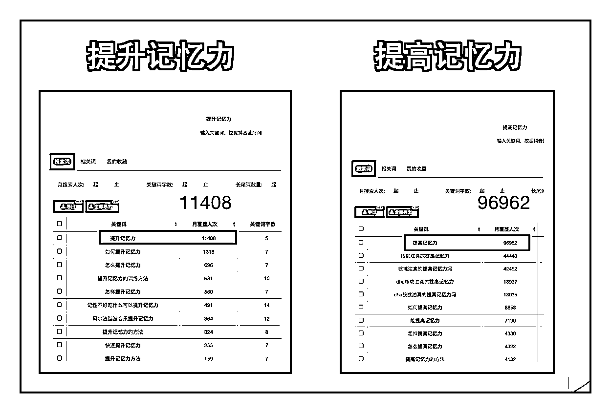
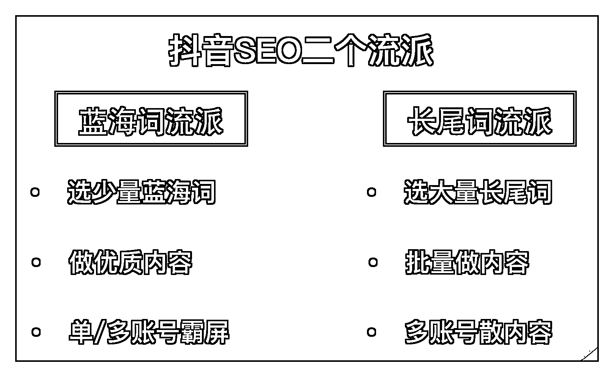
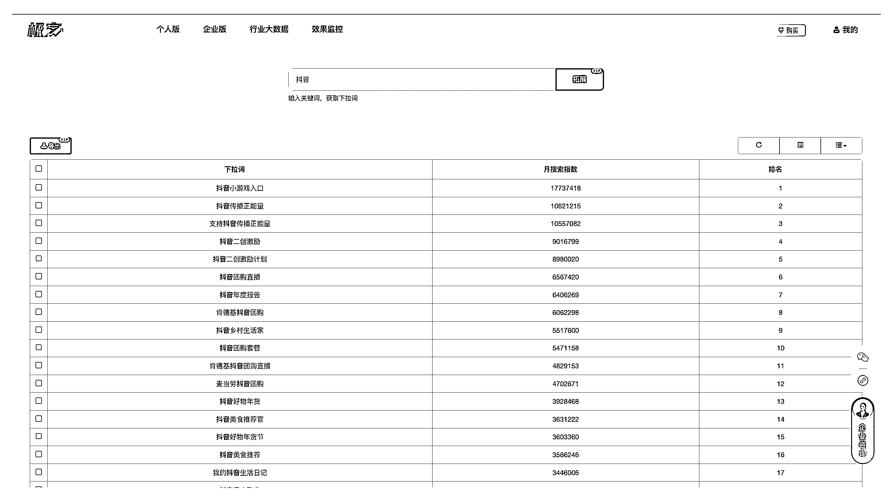

# 4.2 抖音 SEO 核心逻辑

上面讲了搜索流量占比，抖音 SEO 的根本价值，在于想办法提升搜索流量占比，也就是提升搜索排名。

如果你问我做抖音 SEO 最重要的是什么？我会毫不犹豫告诉是选词。选词的重要性，占到抖音 SEO 的 50% 以上，选择 > 努力，如果方向错了，一切的排名技巧都毫无用处。

30

比如“提升记忆力”的月覆盖人数是 11408 ，而“提高记忆力”的月覆盖人数是 96962 ，后者搜索人数是前者的 9 倍多。如果没有数据的加持，即使其他条件都一样的情况下，结果可能也会相差十倍：

做抖音 SEO 最重要的是选词，核心逻辑是找到蓝海词，找词一共有两个流派：蓝海词流派和长尾词流派。

蓝海词流派：选少量蓝海词，蓝海词数量 100 个以内。关键词的月搜索量平均在几万左右，发布内容始终围绕这些来做，做完一轮之后，可以再来一个账号来做一遍这些关键词，实现关键词的霸屏效果。

长尾词流派：选大量的关键词，数量在 1000 以上，不封顶。根据数据显示词越长，竞争度大概率是越小的，毕竟词越长，被抖音博主用运气命中的概率越低。这类关键词为抖音的下拉词居多，月搜索量在 1000 以内，采用批量生成内容的形式，适合生成内容成本比较低的行业。长尾词

为了能更好提高搜索数据，一个作品不要只抢占一个关键词，一个作品可以占 3-5 个词搜索排名，前提是这些关键词都是围绕内容来做的。

长尾词流派面临的问题是如何快速找到大量下拉词，可以通过下方链接，快速找到大量的抖音下拉词，并且支持数据导出。

[传送门：](https://dyinseo.com/DouyinSugKeyword/index?keyword=%E6%8A%96%E9%9F%B3)[抖音下拉词链接，需要登录后查看](https://dyinseo.com/DouyinSugKeyword/index?keyword=%E6%8A%96%E9%9F%B3)

