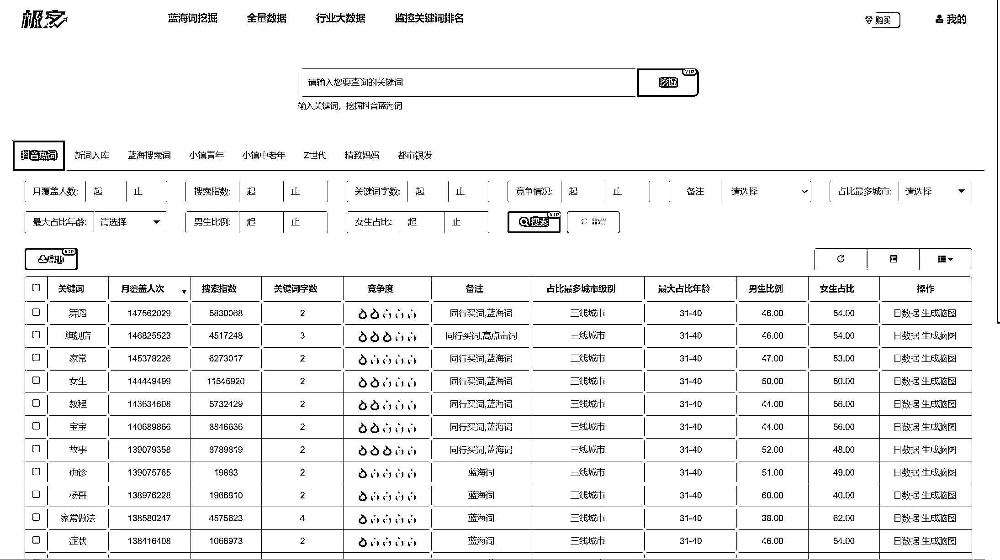

# 4.3.2 搜索结果字段解释

下面是极客增长工具搜索结果看板，我们为大家解释一下重要字段：

1、日数据

衡量该关键词在抖音的搜索具体数据，代表每日搜索累计搜索过的次数，1 个人是可以搜索多次的。

2、月覆盖人次

累计该关键词和该关键词的长尾词加起来的总的月覆盖人次，1 个人是可以搜索多次的，是多个关键词的累计数据；

3、搜索指数

衡量该关键词在抖音的搜索热度。通过关键词及相关内容的搜索量等数据加权求和得出该关键词的搜索指数，搜索指数并不等于实际搜索量。

4、关键词字数

关键词越长说明机会越大，毕竟大家不会注意竞争长的关键词 。

5、竞争度

1 表示竞争最小，5 表示竞争最大。但是这个不绝对，只是根据内容数量初步判断，真实的判断还要自己的账号和内容的情况，毕竟竞争度是相对的。你账号粉丝数越多、做内容越强，做关键词越容易。

6、备注字段

•黑马词：流量呈显著上升趋势的词；

•同行买词：同行业广告主覆盖度高的词；

•高点击词：点击率相对较高的词；

•蓝海词：流量大但目前竞争不激烈的词。

