# 方法一：精细化选词

想查询抖音当前热词，可批量查看关键词数据，传送门：

[`dyinseo.com/KeywordDouyin/index.html`](https://dyinseo.com/KeywordDouyin/index.html)

想精细化查询其他关键词，可以参考下列方法：

第一步：在极客增长工具中搜索意向关键词

以「创业」举例，可以看出在返乡创业、餐饮创业、农村创业养殖等关键词，都是搜索量很大、竞争度很低的关键词，这就是我们所说的流量洼地（备注：工具里面的竞争度和蓝海词都是系统提供的参考，还得结合自身的制作能力来综合评估）：

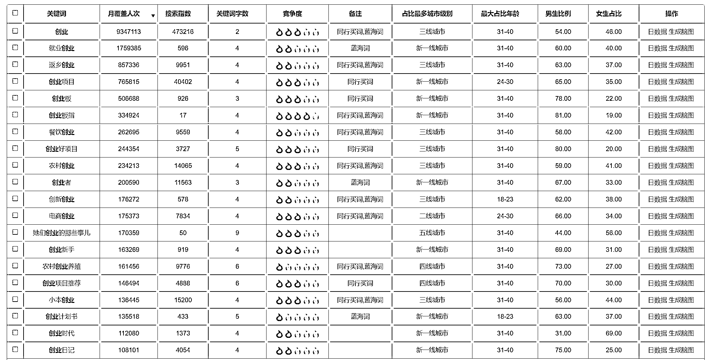

第二步：返回抖音搜索框查找

找到一个蓝海关键词的方向之后，我们可以在抖音搜索框输入相对应的词汇，通过下拉词发现更多的用户需求。比如：

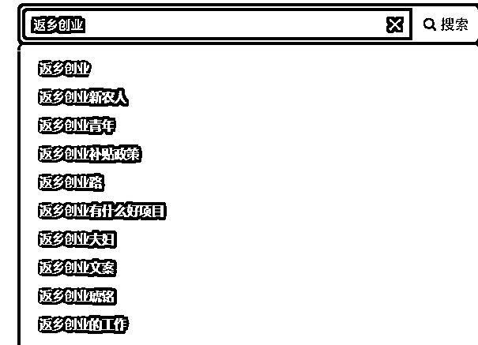

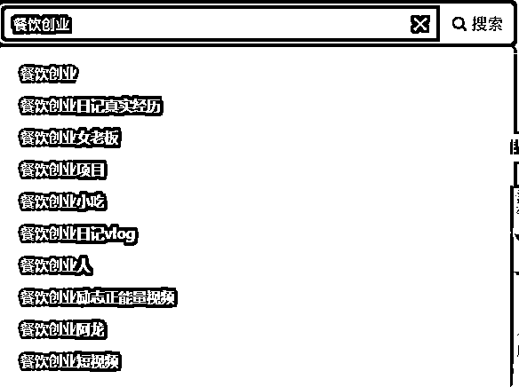

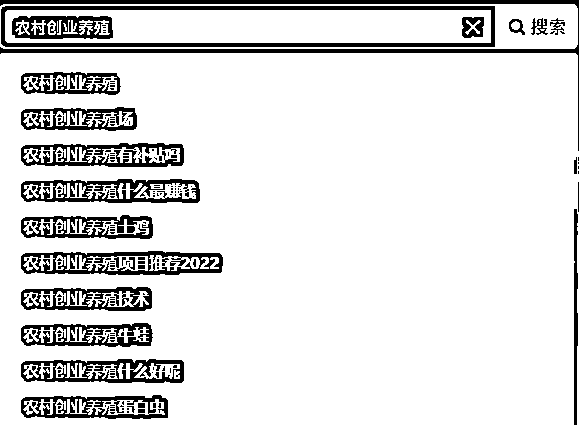

第三步：返回工具精细化搜索

在抖音找到更精细的关键词后，返回工具继续搜索。

关键词查询技巧：搜索关键词的时候，会发现搜索出来的结果有比较多的干扰选择，比如搜索二手车，会出现二手车的价格、推荐、交易市场、直播等其他维度信息。但是我们只想看宝马二手车的相关词，直接搜索结果也不够丰富。

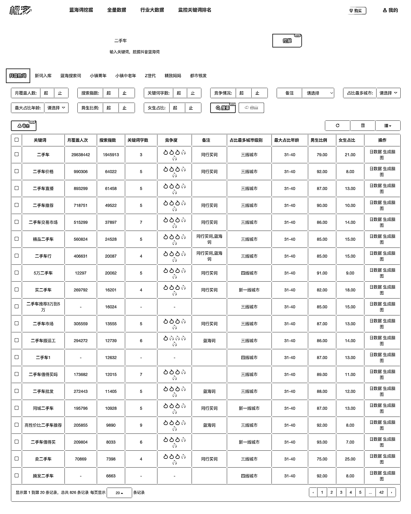

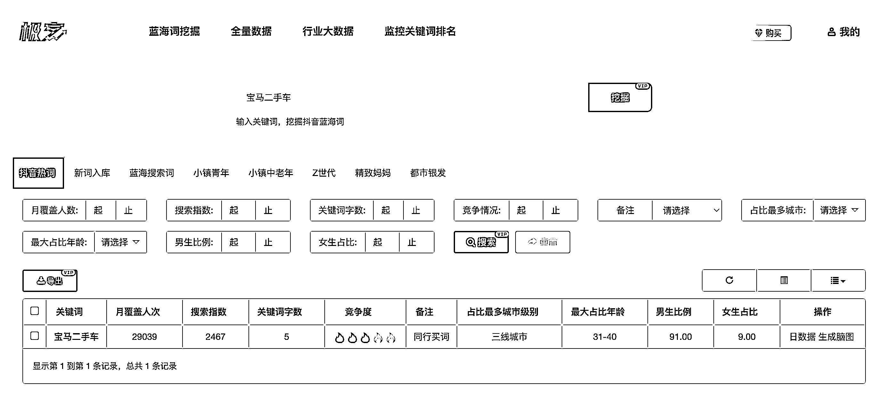

那我们可以使用宝马 + 二手车的形式，就可以出来更多搜索结果。也就是包含多个关键词：关键词 A + 关键词 B。

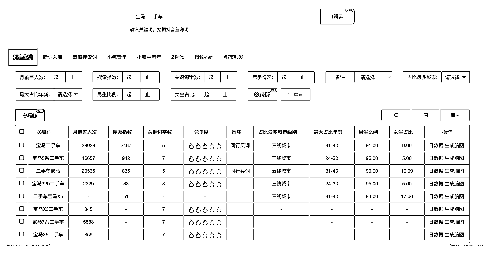

如果我们不想在搜索结果中看到二手车，这个时候可以采用 “-” 的。也就是屏蔽这个关键词的意思：关键词 A - 关键词 B 。

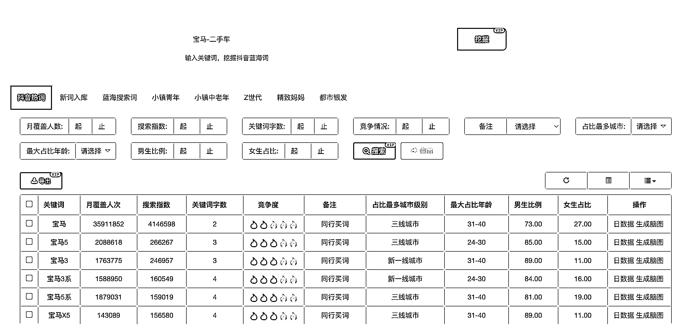

包含任一关键词是：关键词 A 关键词 B 。

选词时需要注意的点：

•同城业务需要注意区域；

•月搜索量只有几十的不建议做；月搜索量超百万的建议留在后面做，先积累经验再操作大词；

•竞争度高的词不是好词；

•意图不明确的词不是好词（词越长说明需求越明确，词越短需求越不明确，建议在 4 个字以上）；

•不要做别人视频中大概率会提到的，比如：社群营销的六大核心流程及打法；

•品牌词基本上转化率高（不一定是自己的品牌词，可以是对方的品牌词）；

•客单价尽量高，低客单价除非搜索量大，否则没必要做搜索流量；

•不要盲目相信搜索指数。

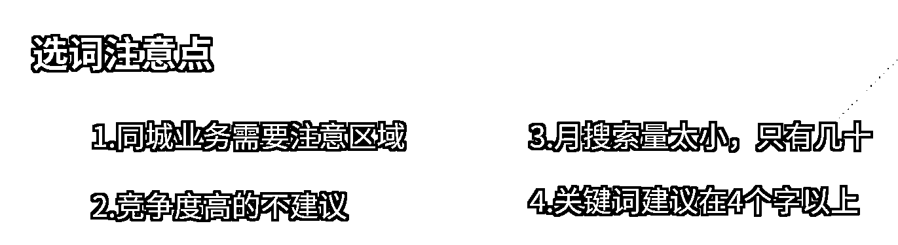

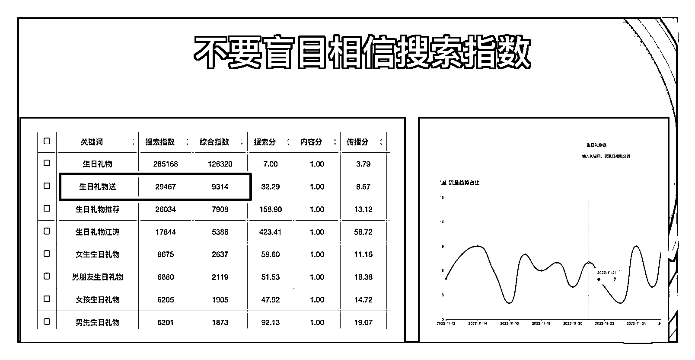

不完全正确，因为存在 2 条隐藏变量：

•关键词搜索量会影响转化率；

•关键词搜索量会影响客单价。

所以并不是关键词的搜索量越大越好，而是转化率高、客单价高的关键词，搜索量越大越好，具体要看业务。

部分关键词解析：

如果你是做本地同城业务卖二手车的，下面关键词那些值得做，那些不值得做？

实操案例：

场景模拟：如果你是做本地同城业务卖二手车的，下面关键词那些值得做，那些不值得做？

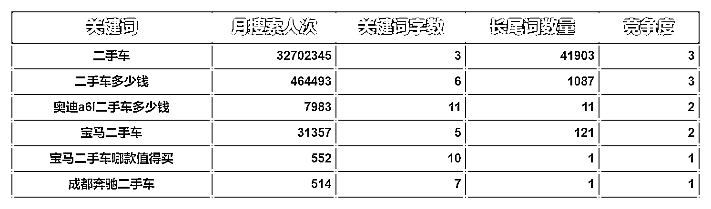

正确答案

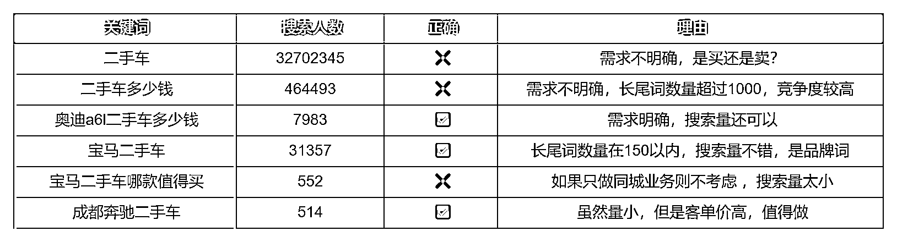

