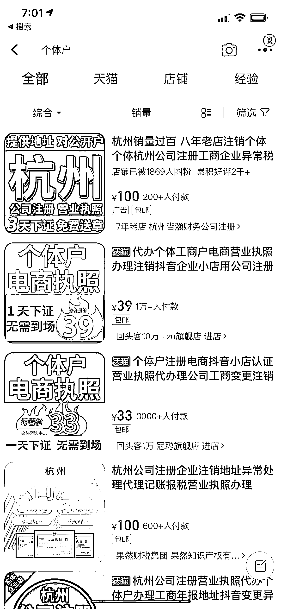
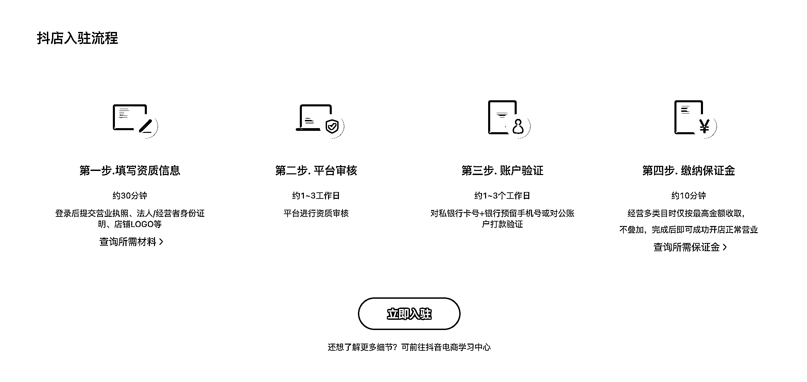
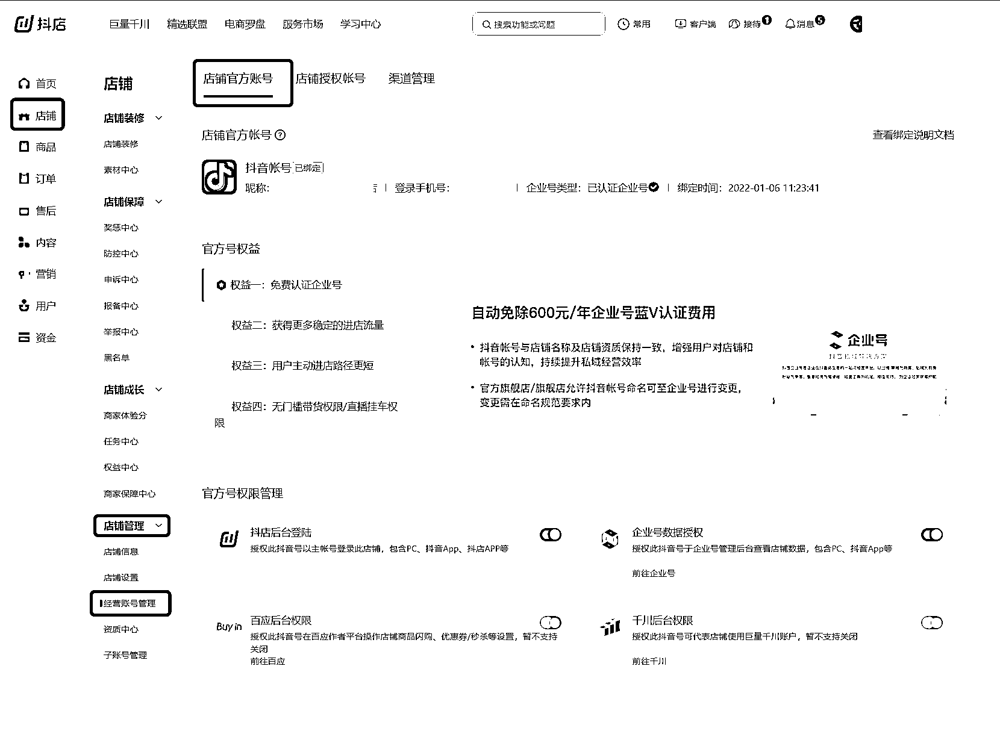
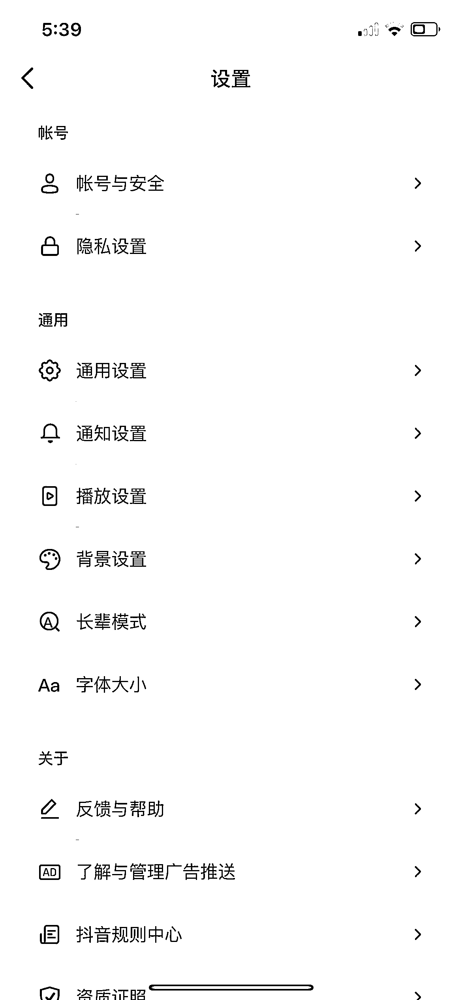
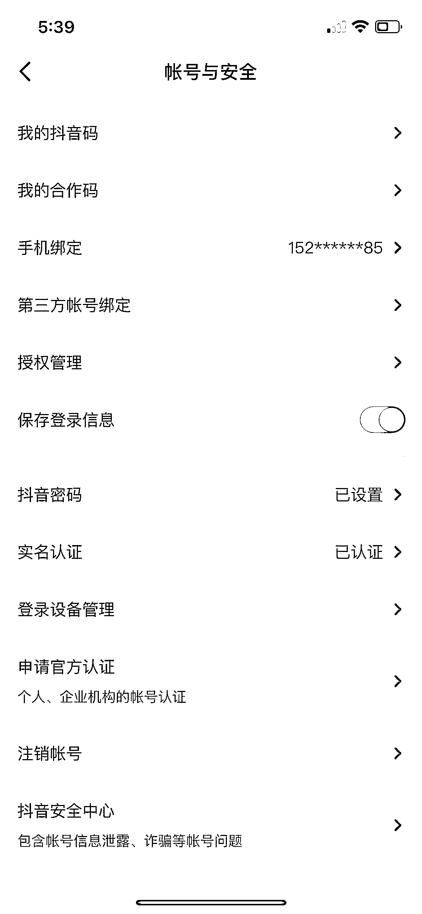

# 方法二：申请蓝 V 和黄 V

根据上文，我们知道蓝 V 号有加权，我们具体该如何申请蓝 V 号呢？

蓝 V 号，一般是公司或者个体户才能申请的，正常的话，需要 600 块钱。但是如果你申请了抖音小店，可以免掉这 600 块钱，但会缴纳 4000+ 押金，不同行业有不一样的押金。也有一些内部渠道可以 150 就可以认证蓝 V，但是粉丝数要超过 500 。

个体户的押金要比企业申请的押金少一半（具体操作流程，淘宝上直接搜索即可）。

如何申请抖音小店？具体内容可以查看：[店铺官方账号如何认证企业号？](https://school.jinritemai.com/doudian/web/article/111648)

官网：[`fxg.jinritemai.com/`](https://fxg.jinritemai.com/)

如何申请黄 V 认证？设置 -> 账号与安全 -> 申请认证：

