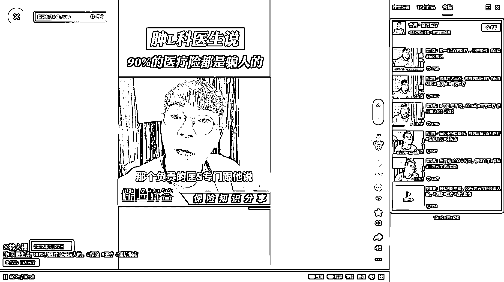
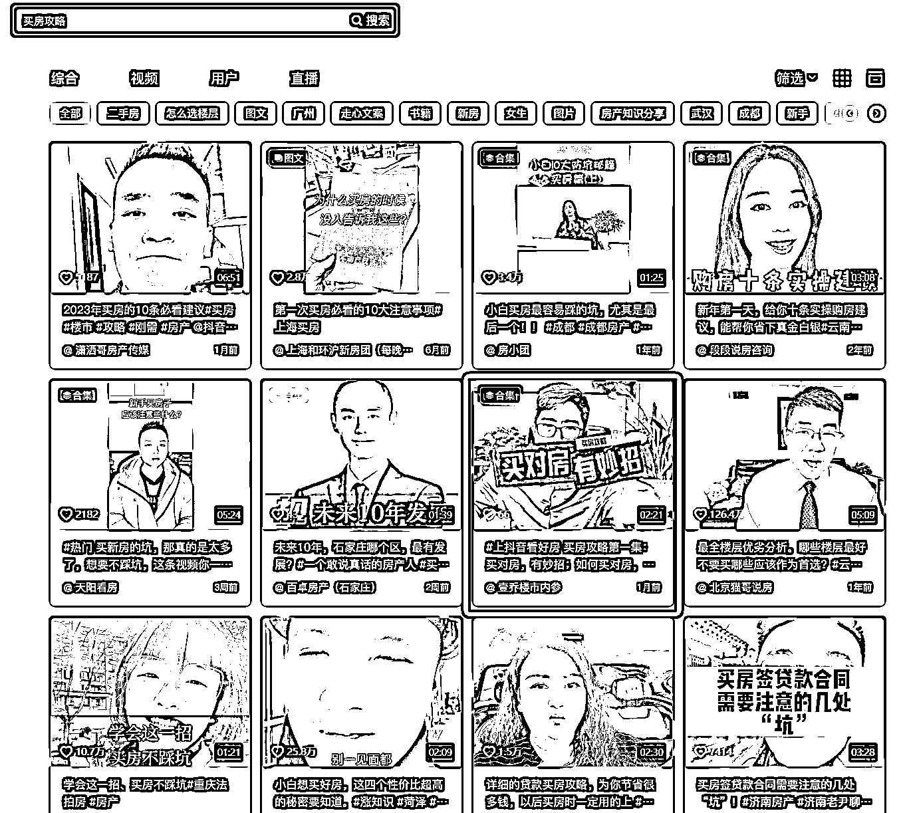
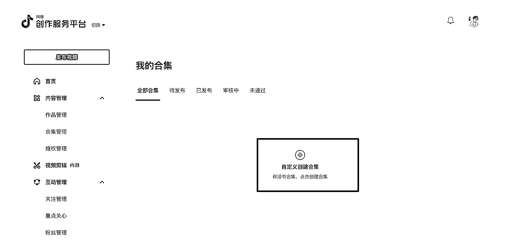
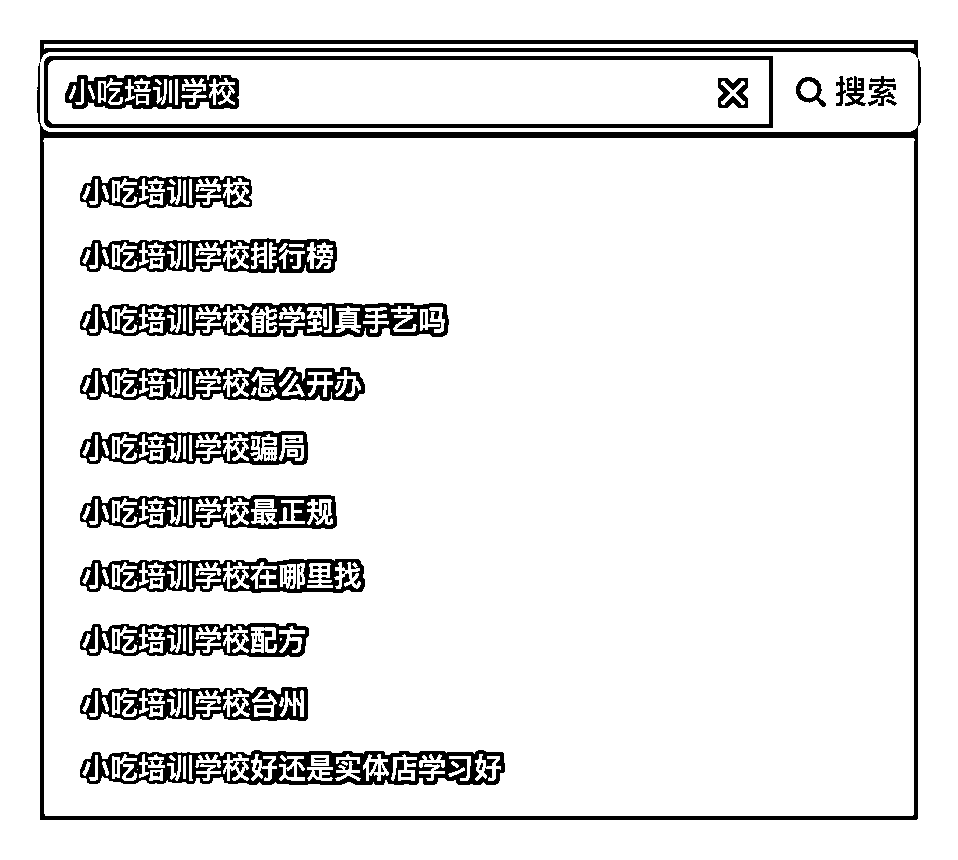

# 方法三：创建视频合集

上面我们说过，合集的重要性很高，合集可以让你合集下所有的作品进行加权，并且还有延长作品更新时间的作用。

我们来看一些例子，比如“医疗保险”，因为做了合集，合集的权重累积高，才能让 1 年多前的视频长期抢占这个关键词：

我们再看一个例子，“买房攻略”这个词，月搜索在 15 万左右，为何这个 66 个赞的视频能排名靠前？因为他采用了合集的策略，完全命中关键词，即使数据效果没有其他人好，也能上排名：

如何创建合集？

可以前往抖音创作者服务平台：[`creator.douyin.com/creator-micro/content/collection/manage`](https://creator.douyin.com/creator-micro/content/collection/manage)

那么有的人会说，我不知道合集的内容发那些怎么办呢？围绕关键词在抖音搜索下拉词，比如我想做「小吃培训学校」，就可以找到内容灵感：

