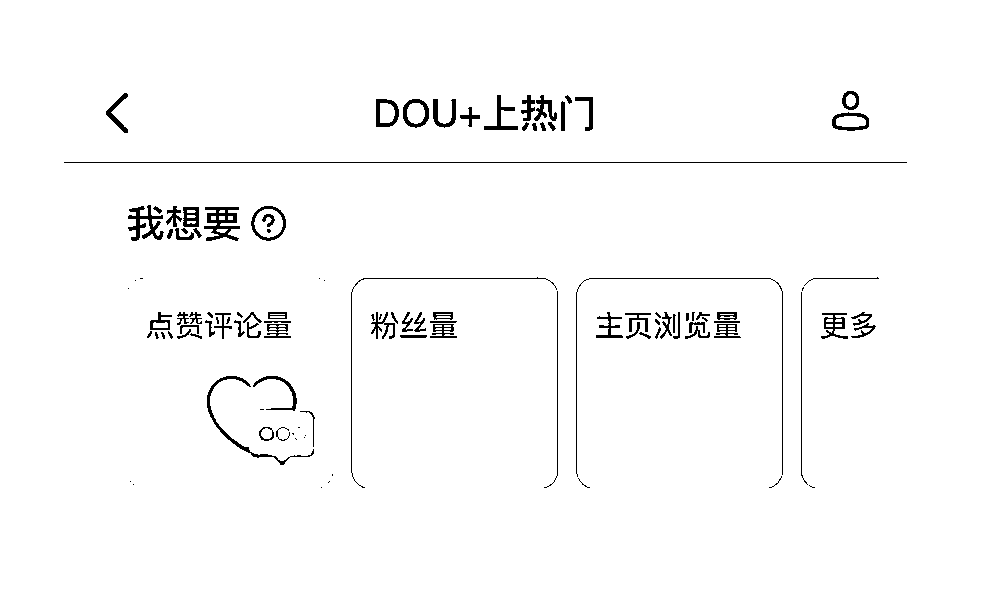
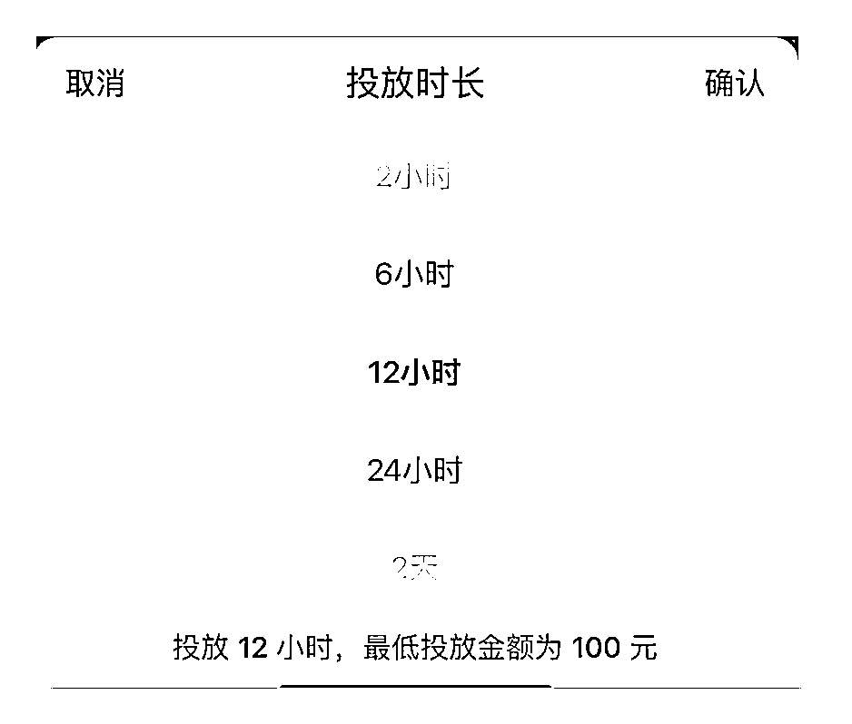
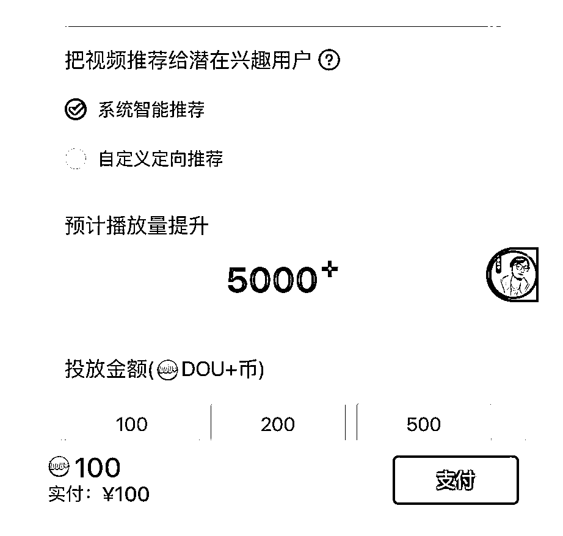
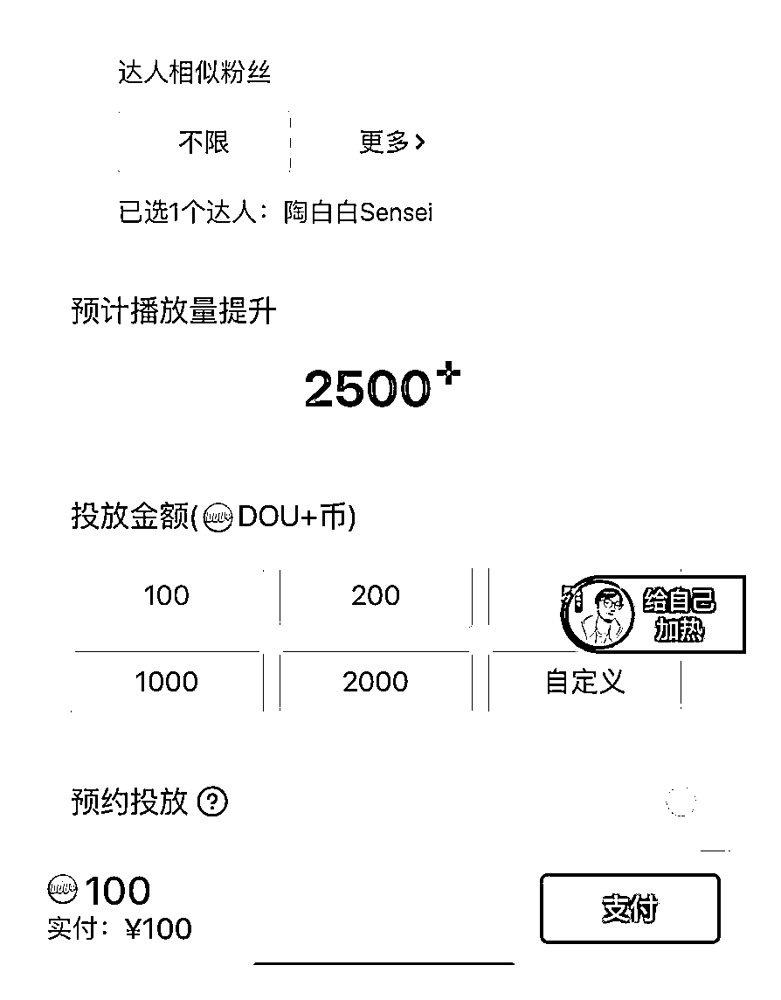
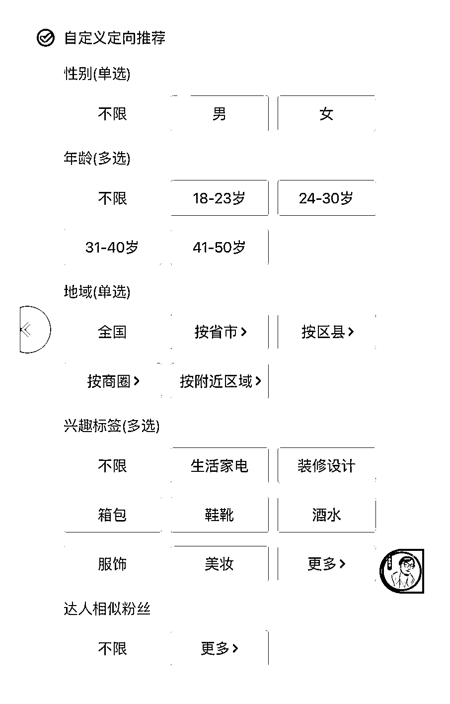

# 方法五：投放抖 +

如果是新号，前期因为用户模型和铁粉没有建立，即使花费了很多时间做了优质作品，系统也无法推荐给用户模型，因为用户不精准，所以作品的互动数据自然不会高，所以大部分的作品都比较难火，点赞数也会比较低。

付费投放其实是一个巨型杠杆，通过付费投放，可以达到如下效果：

•通过付费流量，撬动抖音的自然流，当互动数据好的时候，可以进入抖音更大的流量池；

•通过提升作品的互动数据，提高作品权重，从而达到 SEO 的目的；

•通过挖掘爆款作品，提高涨粉数量，快速撬动粉丝数量。

什么样的作品选择抖 + 投放？

•能够在 SEO 关键词下面找到你的作品，但是作品的排名还比较靠后（比如第 20 名）；

•找到有异常值的作品，则投放效果最好。

什么是异常值？

作品互动的点赞、收藏、评论、转粉率，有一项比平常作品高三分之一以上。举例：正常作品发布的数据是点赞、收藏、转发综合互动数据在 50 以内，评论数量 10 以内，异常值则是高出 1/3 （比如自己的作品突然点赞、收藏、互动综合在 80-130 之间或以上）。

当然，这条作品是可以体现你的专业内容，涨的不是泛粉，那个就值得投放抖 + ，如果这条内容的标题有你想做的 SEO 关键词，效果会更好，可以蹭到搜索流量。

1）如何选择投放目标？

在起号的过程中，对短视频做抖 + 有一个投放目标，你觉得我们目标应该选择那个？

选项 A：点赞评论量选项 B：粉丝量选项 C：主页浏览量

正确答案是：A（点赞评论量）

为什么要选择点赞评论量？

因为前期起号的过程中，作品的基础点赞、评论、收藏数据肯定较差，投点赞评论可以帮助作品快速积累互动数据。只有有了基础的数据，别人才更加愿意点赞评论。

很多用户都有观看评论的习惯，你连评论都没有，别人都没有机会看评论，你的作品完播率也会大概率比别人低。另外，因为人人都有从众心理，只有看到数据较好的作品，才更加愿意点赞。

为什么不应该投放投粉丝量？

如果我们选择投放粉丝量，抖音是必须完成这个值的，因此很可能投来的都是目前喜欢点击关注人群，而不是选择你的目标人群，比如 50 岁的大妈，虽然选择粉丝量可能会更快的完成目标，但是会影响后续的流量分发效果。

为什么会影响后续的流量分发效果？

因为靠钱买来的粉丝，不一定都是真正认可你的人，他们可能只是一时兴起关注了你，但是对你的作品并不感兴趣，很有可能后来都不会看到你的作品，即使看到了，也不会对你的作品感兴趣，这可能会对账号之后发布的作品有负面的影响。

投放点赞评论很有可能会帮你突破当前的流量池，因为互动数据会给作品加分。

31

当投放起来一条作品的点赞评论互动数据比较高之后，比如 2000+点赞，评论在 200 以上，并且能够吸引精准粉丝了，这个时候的涨粉效果正常情况下，可以投涨粉。

2）如何选择投放时间？

目前你面临投放选择时长的问题，会怎么选择？

选项 A ：2 小时选项 B ：6 小时现象 C ：12 小时选项 D ：24 小时

我们先看一下时间的区别：

•2 小时，快速的跑点赞评论数据，肯定不够精准；

•6 小时，也是快速跑完点赞评论数据，精准了一些；

•12 小时，给抖音足够的时间，也足够精准了；

•24 小时，整整跑 1 天时间，时间拉的较长，最精准。

24 小时以上的数据我们就不看了哈。

正确答案是：先 1 后 4，或者直接 4。

为什么是这样的投放方法，得先知道我们要什么？

•短视频的基础权重

•精准的粉丝

根据上面的用户从众心理知道，当点赞数少的时候，别人是不愿意点赞的，评论数少的时候，完播率会比较低。所以我们要先投放 100 块钱 2 小时的点赞评论，虽然 2 小时的精准匹配度不如 24 小时那么高，但是可以帮助作品快速拉高基础数据值，然后再追投一单 24 小时，让系统慢慢跑。

如果你对自己的作品互动数据比较有信心，那么就可以只投 24 小时，让系统慢慢的进行精准匹配，获得性价比最高的流量效果。

6 小时和 12 小时，更适合覆盖固定时间上线的人群，比如说你是投深夜人群的。

蓝 V 投放的时候是没有 2 小时的选项的，我们用 6 小时替代，也可以。

3）如何选择投放人群？

投放人群是投放智能推荐，还是投放达人相似？

选项 A：系统智能推荐，100 块钱 5000 播放选项 B：达人相似投放，100 块钱 2500 播放

如果粉丝模型已经建立：正确答案是 A ；如果粉丝模型还未建立：正确答案是 B 。

如果视频的点赞数不是大爷大妈，评论区都是精准的人群，说明粉丝模型是对的。选择智能推荐，可以获得 5000 的播放量，因为抖音的算法是全球顶尖的，算法机制甚至是抖音的壁垒之一，我们要相信抖音的算法。

新手起号阶段，推荐投达人相似。达人相似怎么投？达人相似投的不是对标达人，而是近期对标作品所搭建起来的观众画像模型。比如一个刚火的博主，是因为说了某个产品好，火起来的，但是他没有卖这个产品，这时候你投放一个这个产品的链接，会起到事半功倍的效果。

找对标达人是一件极其重要的事，对标达人有几个要求：

1.对标达人的粉丝要垂直精准，最好是对标达人刚起号成功。

2.对标达人的粉丝数量不建议太高，否则粉丝人群会比较泛，建议在 1～10 万之间。

如果实在找不好对标达人，建议选择自定义模式，对年龄、地域、兴趣偏好、性别进行详细的划分。

4）如何选择自定义模式？

我们什么时候选择自定义模式？当我们的作品对性别、年龄、地域、兴趣等限制的时候，可以选择自定义模式。

5）Dou+不让投放是什么原因？

平台希望优质内容能够获得更多展示机会，但以下类型视频，无法投放 DOU+：

1.视频质量差：无内容、视频模糊、产品 bug、静帧视频、视频拉伸，破坏景物 3s 及 3s 以下的视频、观看后让人感到极度不适的视频。

2.搬运视频：视频中 ID 与上传者 ID 不一致、账号状态标签为搬运号、明显截取的 pgc 内容、录屏视频、视频中出现其他平台水印的视频。

3.调性不推荐：视频内容低俗含有软色情、视频内容引人不适、视频内容不符合本平台的调性，视频非正向价值观。

4.隐性风险类：视频或文案中出现广告、出现欺诈内容、标题党、医疗养生类、抽烟喝酒的行为、违规饲养野生动物、视频中出现虐童现象、视频中出现疑似赌博的场景。

5.明显的营销、广告类信息、视频：视频内容中含有明显的品牌定帧、品牌词字幕、品牌水印、口播；视频背景中含有明显的品牌词、商业元素。

6.未授权明星/影视/赛事类视频。视频涉及侵权，无法使用 DOU+；请提供相关授权证明至 feedback@douyin.com。

7.视频标题和视频描述包含以下元素， 无法使用 DOU+：

（ 1 ） 联系方式：电话、微信号、QQ 号、二维码、微信公众号、地址

（ 2 ） 招揽信息：标题招揽、视频口播招揽、视频海报或传单招揽、价格信息

8.标题产品功效介绍

（ 3 ） 曝光商标：品牌定帧、商业字幕、非官方入库商业贴纸

（ 4 ） 指向性的企业店铺名称

内容不符合抖音站内社区公约的视频。

6）投放抖 + 总结

对于新号，投对标达人，时间选择投 24 小时，把所有的作品投一遍，最终筛选出点赞涨粉数最好的那条。

对标达人怎么选？对标达人作品质量不如你，但是粉丝数很多，因为对标达人很重要，所以找对标达人的时间花费的多一些。

如果对标达人实在找不准，或者心理没底，也可以使用自定义选项，把年龄、性别、喜好、地域等数据精细化选择。

•起号阶段建议准备至少 2000+，1500 块钱投点赞评论、500 块钱投涨粉；

•投放的时候一次选择 5 个作品，每次投 100 ，选择点赞评论，先把所有的作品投放一遍，剩余的钱给点赞评论互动数据最好的；

•找出涨粉最好的那个作品，投涨粉，投 500 块钱，看粉丝单价。

之后有预算的话，粉丝数单价小于 1 元，可以围绕涨粉率高的作品，把粉丝数拉到 5000 以上。

