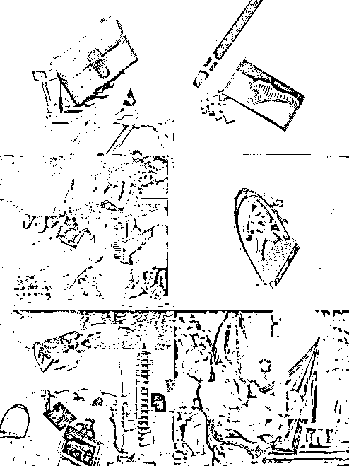

# 6.1.1 整体服务流程需要打造仪式感

奢侈品这个行业最需要仪式感的打造，也是仪式感打造的最好的行业。外界听起来似乎是非常高大上，但实际上，奢侈品行业并未发明什么特别的操作，它们只不过是把每个环节做到极致。

在奢侈品行业，我们把顾客从进店到离店过程中的每个环节，设置为不同的接触点。每个品牌都是围绕顾客的这些接触点去做设计。

根据顾客的动线，接触点无非就包括以下几个环节：欢迎 - 探索 - 介绍产品 - 体验产品 - 处理问题 - 结束销售 - 送别 - 售后维系。

这些接触点里 “欢迎” “介绍产品” 在线上是最重要的提供仪式感的环节，下面将详细和大家拆解线上如何通过这两个环节做好服务体验。

1、欢迎环节仪式感打造

欢迎这件事，是由 3 个小细节组成的。

•橱窗

•欢迎的话术和动作

•破冰话术

1）橱窗的仪式感打造

在奢侈品店铺，从你看到店铺外观的那一刻就开始了。举个最简单的例子，奢侈品每一次的橱窗设计都不单单只是产品的堆放，每一次都会是有主题的故事。

这是爱马仕的橱窗，这已经不仅仅是橱窗了，而是一个个的艺术作品。任何顾客走到橱窗附近就会多看几眼，而且是以欣赏艺术作品的眼光。

比如，这组橱窗就融合了希腊神话故事和美感，还展示了产品。这是品牌的做法，那么平移到个人线上，如何在“橱窗”上，增强仪式感和美感呢？其实就是注意设计我们的朋友圈。

朋友圈封面，朋友圈的每个文案和图片，我们的头像，个性签名，都需要特别设计。因为，这些，就像奢侈品的橱窗一样重要。

2）欢迎话术的仪式感

每位新朋友加上微信后，都需要先做自我介绍，再邀请他进群。群里也设置了邀请须经群主同意。如果是群里朋友邀请新朋友，也会先告知这位群友，需要新朋友加微信。当我们友好的互相介绍完，我再通过。

以上的准入门槛，就是一种仪式感。亮明身份，提升自身价值，互相了解，平等对待。高客单价产品的售卖，做到最高级，你应该和客户的平等交流的状态，而不是一个小客服。那么从第一步，就很重要了。

3）破冰话术的仪式感

打完招呼后，就可以聊聊天，以达到破冰的效果。在奢侈品的销售里，我们会让员工准备 100 个破冰话术，用于欢迎完毕后和顾客聊天。

那么线上其实也非常需要设计这个破冰的语言。具体聊什么，线上来说，其实客户的头像，微信签名，自我介绍里的内容都可以作为破冰话术来聊一聊。具体大家也可以上一下线上沟通课。需要注意的是，聊天的内容氛围需要和你的社群格调保持一致。

很多时候我们私域流量进来了，如果不打招呼这个人就不会和我们有链接。那么光打个招呼还是不够的。还必须在初始的聊天中，展示出自己的价值，但又不能让客人感觉你是在“显摆”。

4）介绍产品的仪式感

最后我们再来看看关于，产品介绍的仪式感。

每一个产品，它都有很多很多个 FAB，我们在描述的时候，是通过前期对顾客的了解之后，针对性的去谈的几个点，一般来说我们描述两个即可，最多不超过三个，那方向是从哪几个方向来看呢。

我们不要自自说自话告诉顾客，这个产品他设计的多么好，剪裁的多么好，细节做的多么好就结束啦。

而是应该重点告诉他，他穿上之后，在什么场景下可以得到什么样的一个效果。就是这个场景描述出来之后，让客人更有代入感，而且他会幻想自己穿上这个产品以后的样子，那么他购买的几率就会更大。

举个例子，假如是一件黑色绸缎的衣服，在上新的时候如何用文字描述出“场景呢”？

如果你是去参加朋友婚礼，这件衣服再适合不过了！低调经典，能够在不经意间让人对您的气质过目不忘。

如果你是去去参加小姐们聚会，这个丝绒的泡泡袖设计和复古可爱，一定能让你成为姐妹中的亮点。

如果你是上班穿这件衣服也不会太过，因为她虽是丝绒质感，但是黑色非常低调，设计也不浮夸，剪裁利落，能够把您衬托的非常大气！

这就叫有场景感的描述。

综上 “1+2+1” 这个公式可以在线上上新的时候使用，也是为了营造仪式感，能让客人体验干巴巴的产品刷屏外的另一种销售感受，在这个过程中还能收获精神内涵，谈资，以及欣赏搭配。