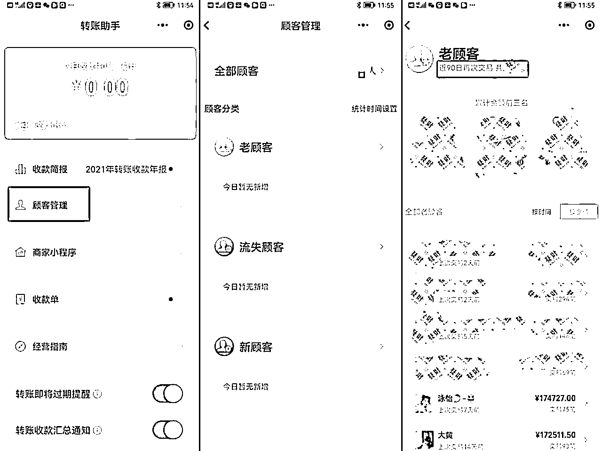

# 6.1.2 CRM 体系提升管理效率

1、用好微信后台统计系统“微信转账助手”

这个工具，可以帮助我们去统计每位顾客的消费动态。比如我们点进去转账助手，会发现有“顾客管理“”这个选项，这个地方的设计就能帮助你做 CRM 管理的基础工作。

点进去之后，你就能看到，你全部的顾客数：老顾客多少个，流失的顾客多少个，新顾客多少个。同时能看到她们分别是谁，这样就方便后续的管理。

老顾客就是每三个月都会一直购买的顾客，没有断过；流失的顾客就是之前他一直在买，但是近三个月没有购买了。

新顾客就是近三个月内才开始购买的客户。这个时间是可以设置的，由于我们都是高客单价产品，我觉得三个月内只要有消费就已经算很好了。

知道了以上的信息，我们就可以开始去分析。老顾客有哪些人，她们交易了多少钱，多少笔。

这些人肯定是我们重点关注的对象，我们可以根据数据分析出她们的下单频率，购买的平均客单价，就能代表大部分客群的消费能力，那么我们在产品定价和选品上面就能有一些参考。

另外一方面，再配合后面我们会讲的顾客信息搜集，我们就能针对性的判断她的购买喜好，以及个人情况，那么作用就是，在选品的时候可以大概知道老顾客喜欢什么。

在做顾客维护的时候，也能知道她会喜欢什么，送到心坎里。

一般，流失的客户也会是我重点跟进的，这些人里，消费金额特别高的会是我重点跟进的对象。三个月没有消费了，是为什么呢？是不小心得罪了这个客户，还是她家里出现了变故，现在买不了了？还是什么原因，要去一个个分析。

分析完后，需要用一些方法，唤醒客户。

1\. 唤醒顾客的方法

1）朋友圈多互动，人都需要被关注，如果顾客流失了，那么多去评论点赞她的朋友圈，让她感觉到被关注，有时候顾客自己就好了。

2）可以偶尔给顾客送个惊喜，流失的顾客一定是消费过才能谈得上流失，那我们可以给客人偶尔送束花，送个下午茶。如果顾客不是本身出现什么变故导致消费不起了，一般以上两个方法足以唤醒。

3）如果唤醒不了，那么一定要想办法在新客户上面下功夫，要补足流失的部分，把新客户发展成老客户或者发展更多新客户，才能保证营业额一直是稳中向上的。

当然这里面的数据还有更多可分析的，在这里我就不做深入讨论了，大家如果感兴趣可以私下探讨。

高客单价，代表着相对来说的高利润。所以值得我们这样花时间去分析，去想办法。另外一方面，数据是不会骗人的，如果只有一个人运营社群，单靠感觉很容易有时候遗忘了有些重要客户。数据统计，可以提醒咱们注意管理重要人员。

当然，这个只是个工具，对于客户的服务等，是需要一对一进行的，要把每个顾客都当成独立的个体的。

OK，那么这个工具分享了之后，我来给大家分享更细致的操作：

2\. 需要搜集顾客信息

和微信转账助手相互配合，这个更精细，如果时间不够，用微信转账助手即可。记录每笔订单信息。

Excel 列好如下信息：顾客姓名，下单日期，所购买的产品名称，图片，数量，拿货价，售价，购买品类。方便日后进行数据分析。

同比，环比，哪些品类卖的比较好，哪些品类是比较缺失的等等。以便后续选品。当然很多人会靠日常积累的感觉进行决策。可能由于我是零售管理出身，我喜欢用数据 + 详细分析进行决策参考。

收集记录顾客信息如下：

1）第一类数据

年龄（生日），性别，职业及职务，工作单位，常见场合，家庭结构，配偶信息，子女信息等

以上信息的搜集是为了方便寻找共同话题，以及提供不一样的价值。

知道顾客的职业和职务，工作单位及常见场合，是为了推荐的产品更加能符合她的身份和出席的场合。

同时，其实我们运营的高客单价社群，群里每个人本身就是很好的资源，说不定多做留意就能帮大家互相链接，提供更多的价值给到大家。

再比如，知道顾客的家庭架构，配偶信息，可以在选品的时候起到作用。比如我群里 98%都是女性客户，那么她们的配偶的吃穿用基本上她们都可以帮忙买。

当我知道大家配偶大概情况后，我推荐的男士产品销量肯定也会不错。另外，我群里客户大部分都和我年纪差不多，都开始有了宝宝，那么，可能高客单价的宝宝母婴产品就会是我未来将要嫁接的方向。

比如，知道顾客子女的出生信息，就可以在顾客子女生日的时候送上祝福或者礼物，因为子女的破壳日，就是母亲的母难日，这个体贴的点做到了顾客的感受肯定非常不一样。

2）第二类数据：顾客的个人风格资料

个人基础风格（优雅，时尚，性感，浪漫等），偏好，发色，肤色，妆容偏好，体型

这部分信息，具体可以根据群内所售卖的商品进行细微的调整。不过这项数据的整理，除了能够帮助自己带货，还能帮助挖掘顾客其它隐形需求，我整理客户的这些信息，除了对我卖品牌的包包衣服有帮助，还会有其它更好的作用。

比如，之后我要开服装店，售卖自己的服装，我就有了具体的客户风格画像了，会非常有助于我选品。假如我要开美容院，我就知道我的客户可能喜欢哪一种类型的。

总之，数据样本量够大的话，这些数据对后续做其它方向的创业也会有帮助。

以上信息如何得知呢？我们有句行话叫做“非销”，从客户的闲聊中获取，另外就是从客户的朋友圈中获取。

以上都是 CRM 的基础数据信息管理。拿到数据后的分析，措施是第二步，第三步的管理。

这个方法的好处，首先是，有个思考方向，作为运营社群的群主，不管你是什么性格，你都可以做，起码做到及格分。

有些群主社交能力非常强，可能她根据自己的感觉就能把群做的非常活跃，每个客户都照顾好。

但是肯定有人没有这种能力或者没有这个时间的，那么方法和 SOP 就可以相对来说不那么考验个人性格和能力的。甚至，变成 SOP 复制后，让员工完成，解脱出你自己的时间。

3\. 把顾客进行分类管理

很多公司会根据顾客的消费能力把顾客进行分类，每类客人会有不同的待遇。美德现在的顾客基数还没大到进行顾客的深度层级分类。

我的顾客，购买 10 次以上都算老顾客，年消费 3 万以上都是我的 VIP，都会认真真心对待。新客户，只要沟通是礼貌的，是否购买都不重要，也会耐心对待。

有了基础的分层之后，就可以设定属于 VIP 客户专属的仪式感，具体上文仪式感打造部分已经详细分享，此处不再赘述。