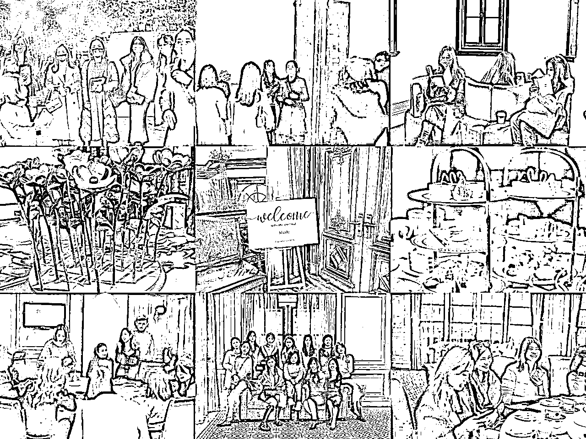
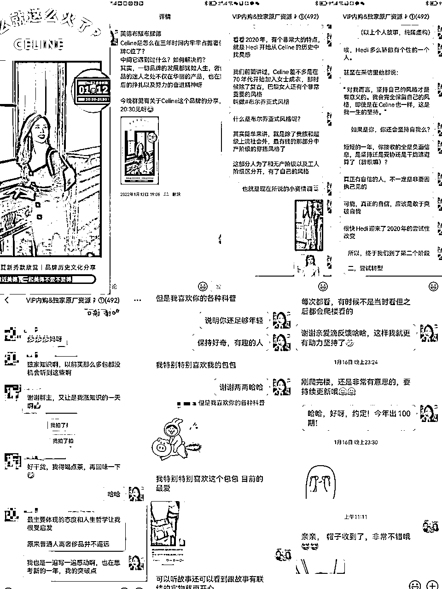

# 6.1.3 学会造梦，提供精神价值

1\. 要有造梦的能力

奢侈品本就不是必需品，如何让普通人想要拥有？那么造梦的能力就很重要。

我们看看奢侈品品牌都是如何造梦的呢？不断的培养你可以拥有更好的东西，通过各种高级大片，广告，告诉你。进入店铺后，你会发现店铺营造的各种氛围：灯光，香水，陈列，甚至服务员的微笑露出几颗牙齿，都是在给你造梦。

这种造梦十分重要，这就是在勾引起人们内心的欲望，渴望。

那么作为线上，私人运营的高客单价产品销售，要如何实现造梦呢？

美德主要是通过以下关键词：品牌产品分级，图片，以及顾客惊喜，来进行造梦。

1）选品要布局，选品也是造梦的一部分

品牌产品分级其实也是奢侈品在玩儿的，比如大部分一线奢侈品品牌都会有高定系列，这些系列非常非常贵，其实并没有太多人能买得起，全世界就 500 人左右吧，但是大部分一线大牌都要做大秀，都要做高定；再比如，主要做包包和服装的，香奈儿，LV，迪奥等大牌也要抢着做高级珠宝。为什么？

其实以上所有操作都是为了提升逼格，抬高其它产品的品牌溢价能力。让顾客花小的钱，感觉到更高级的梦。

针对这一点，美德在社群里上新选品的时候，也会有所涉及，群里一定会保留一定量的爱马仕，以及硬奢，比如卡地亚，江诗丹顿等几十万甚至百万级别手表的内购资源。

虽然几乎很少有客户买，可能一年就几次吧，美德也基本上每个月至少会上新 3-4 次，差不多保证一周一次的频率。

同样的理由，反过来，顾客也需要培养，有很多客人现在虽然对奢侈品有向往，但是买不起。没关系，美德有很多奢侈品的美妆内购资源，有很多平价但也比专柜购买更加优惠的资源。

不赚钱，也会群里上新，为的就是养成客户在美德群里，想买好东西就能想到我的购物习惯。那么等到她真的想要拥有，有能力拥有的时候，也会想到我。

2）图片是梦想实现的第一步

图片很大程度上会决定顾客的购买欲。可能促使客人不再犹豫，直接下单的就是某一张图片。

关于这一点，其实就是奢侈品广告，明星穿搭的重要性。在实体店铺，客人只能看实物，看镜子里自己的上身图。

而线上有巨大的优势，在于可以看长得好看的人的上身图，好看，天然就有吸引力。

为了提高效率，以及前期的投入产出比计算，美德没有选择自己去拍专业的图。而是组织了图片搜集团队，专门找高清的，高级的图片。

全部是官方高清图还不够，因为太过于高端，对我的客群来说，会有距离感。因此小红书上好看的素人图，也很重要，也会是美德上新的一部分。

再有就是到货的实拍，美德自己的上身图等等，都会发出来，以此增加亲切感，起到带货的作用。

3）顾客惊喜：顾客最终梦想的实现

具体就不展开了，总之是让一部分客人能有“哇”的感觉。大家感兴趣可以来做我的 VIP 客人体验一下。

4）为顾客创造惊喜的使用场景

卡地亚每年都会举行高级珠宝展。每年这个展览期间，负责店铺大客户管理的员工都会邀请有购买实力的客户去现场看展，并引导大家消费。这个展的安排一定会有晚宴等很隆重的场合。

目的是什么呢？其实很多高级珠宝价值都是几百万几千万，客户很多时候买回去是搜藏的，也没有太多的机会“展示”，那么为客户创造这样的“展示”机会就很重要。

这个借鉴起来的话：比如，减肥的可以搞走秀走红毯，拍形象照等活动，肥都减完了，当然要给客户展示的机会啦！

而美德，平时也会举办一些活动，让顾客能够穿着她们在我这里购买的服装背着在我这里购买的包包，美美的展示拍照留念。

办活动，有一招，就是利用你所在城市的活动或者展览资源，把格调做起来，这个其实也是造梦的一部分。

美德经常会利用各个品牌的展览资源来办活动。给大家分享一下我们上一次活动的图片。反馈也都特别好。

2\. 会讲故事，提供精神价值

我们经常听到营销课里讲奢侈品的营销，就会说他们很会讲故事。这个故事的最终目的其实就是为了让消费者心甘情愿为自己的感觉而付费给品牌方。也叫用好“价值定价法”。

比如卡地亚的猎豹系列。这个系列最出名的就是翁莎公爵夫妇的爱情故事。翁莎公爵爱美人不爱江山，为了娶翁莎公爵夫人而放弃王位，并让卡地亚给这位夫人设计了猎豹元素的很多经典珠宝。从此，卡地亚的猎豹系列成为了爱情的象征，也是品牌的经典系列。

这个故事太过于经典和典型，以致这个系列到现在还是卡地亚的经典系列。奢侈品的每件作品，都有它的故事，灵感，还有设计师想要传达的理念。

再比如香奈儿，这个品牌的故事相信大家都不陌生，对香奶奶和 14 个男人的故事大家也肯定都很好奇。但这个猎奇的故事之所以为大众所知，不能说不是商业运作的的结果。

香奈儿历经 100 多年，品牌延续到现在靠的早就不是香奈儿和她的后代，而是后面的资本，维德摩尔家族。却有很少的人听过这个家族。

品牌就是专门让背后的资本神隐，而让香奈儿的故事成为传奇，这样才能让品牌故事流传下去。那些风流韵事，本来也是香奈儿的品牌公关宣传之一。

假如我是运作一个新品牌，那么在这方面我一定会研究一下，如何讲好我的品牌故事和我的产品故事。

但我目前售卖的是别人的品牌产品。所以我所做的就是，讲好这个产品的故事即可。

我们很少会像代购或者其它奢侈品的卖家在朋友圈或者群里发产品细节，反而更多的是倾向于讲解背后的故事。以此来和其它的卖家区别开来。

这里美德分享一个案例，是最近我分享的品牌故事。

左上角第一张是分享的宣传海报，海报就要有故事性；第二章是宣传文案，尽量和每个人的生活相结合；第三张和第四张是分享的内容节选，需要有干货知识的传递还能有个人感悟的抒发；最后三张是客户的反馈。

讲故事，也是为了提升客户对于产品的鉴赏力，并且通过课程，我们好好来教大家，怎么去享受。每一个故事，在讲解的时候都会有情感上面的共鸣和享受。

这样客户在购买商品后这个产品就不单单是个产品了，它被赋予了意义，同时还附加了谈资价值。

客户如果只能在你这里享受到这种附加服务，那么粘性自然就增强了。粘性增强就会有源源不断的复购，以及转介绍。

内容来源：《服务流程打造仪式感，CRM 提升管理效率，高客单价社群也能实现 74%转化》

