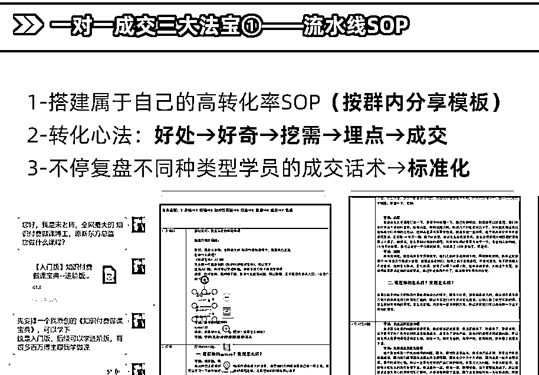

# 6.2.2 转化的终局，是解放 IP

一定要梳理卖产品的 SOP，我目前已经解放自己了。我经常说，私域转化是最费时间的事，同时也是最省时间的事。

费时间，是因为创始人要去自己跑一遍转化流程，磨不同客户的转化话术；省时间，是因为当你标化了一套话术和流程，那后面就可以复制好多个人模仿你转化即可。

所以一定要做这种 SOP，SOP 要包含完整的转化话术，不同种类客户的建议转化话术，我会每晚组织我的团队复盘当日的成交情况，好的话术做留存，不好的话术做迭代，成功的经验固然可贵，但是成功能够复制流水线，更可贵。

