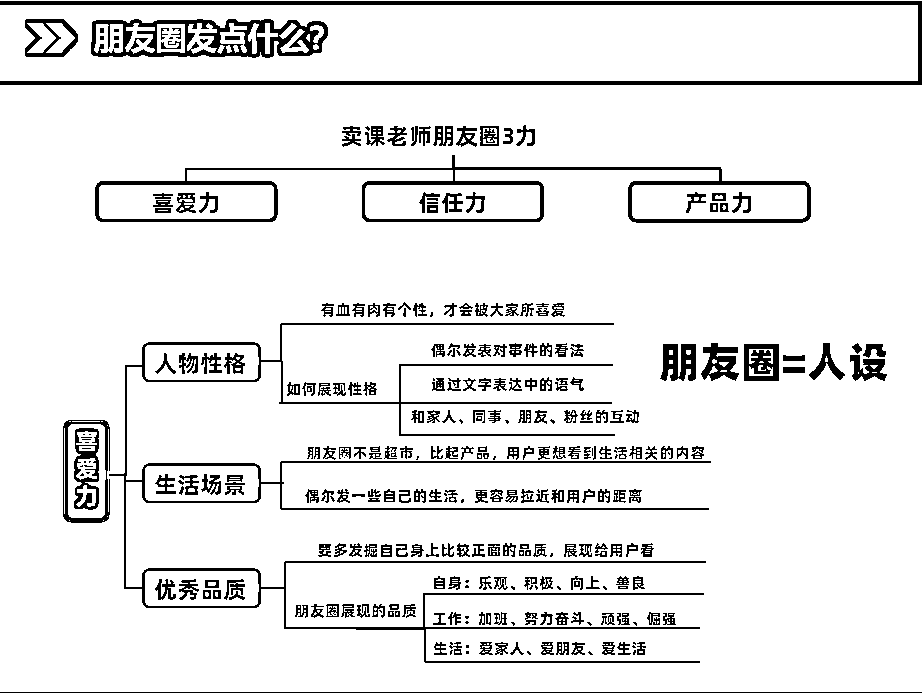
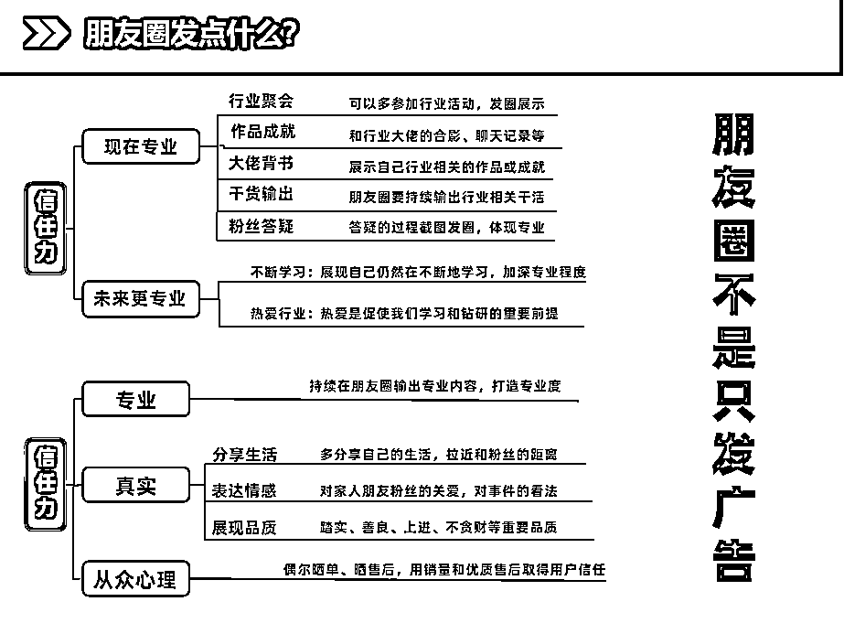
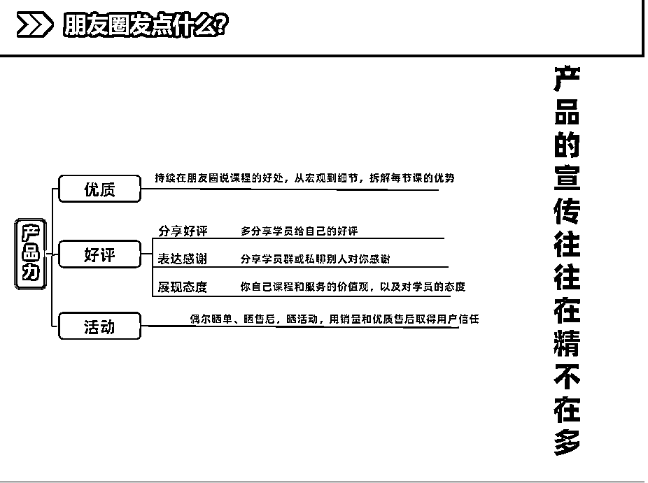

# 6.2.3 你今天用心发朋友圈了么？

私域转化提高成交率，一定要发朋友圈，朋友圈发的好，每天躺着挣钱。朋友圈怎么发，这里我给大家几个公式，方便大家理解：

•高客单朋友圈成交的一定不是货，一定是人

•人的核心，是发的朋友圈有温度，有信任，有专业

我最开始有个误区，就是不好意思发朋友圈，觉得圈里有很多人比我厉害比我牛，所以不敢外化，后来慢慢发现，这些牛人根本没时间看朋友圈，他们只发，只吸引。所以你的朋友圈一定有目前没你厉害的人，他们喜欢看你的朋友圈，所以，「发」比「想」重要。

给三个朋友圈框架，方便大家找朋友圈选题，分别是喜爱力，信任力，产品力这三个模型。

提示一点，朋友圈尽量做到“千人千面”，按不同标签来发适合的朋友圈。这个属于进阶内容。