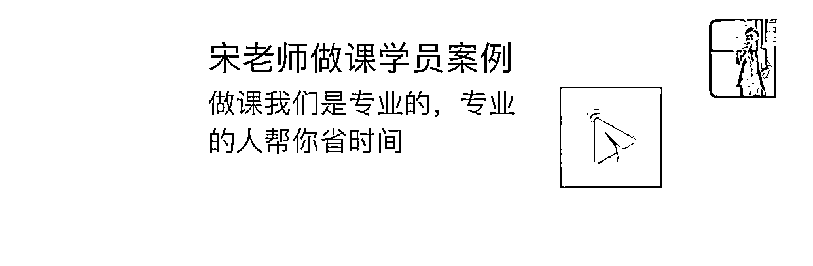
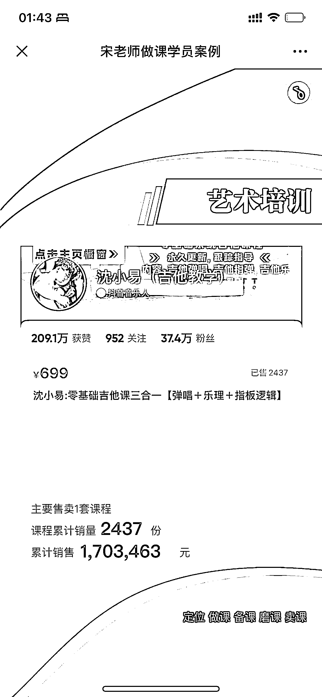
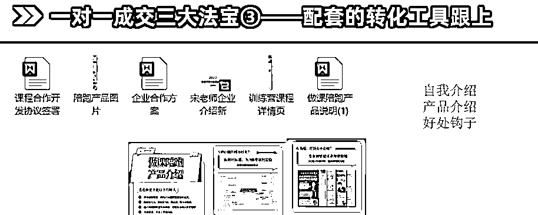

# 6.2.4 高客单成交

这里我说说对于高客单价的转化心得。目前我们每个月 1w 的客户能有 25 个左右，核心转化点有三个：

1、案例能无限缩短成交时间

我们前期没案例的时候，成交特别慢，后期我们做了 H5 页面的案例后，转化大单，特别快。

2、越拒绝，越心痒

最早我收高价的时候，很少面试筛选，后来发现成功率没有达到我的预期，而且客户也不多。

后来就开始拒绝，有的太差的就是不接，拒绝后发朋友圈，有人甚至直接打钱都不要，这种拒绝多了，反而来的人更多了，而且素质能力也高了不少。所以一定要定规矩，没有规矩，没有大单。

3、销售工具一定要配齐，这就好比临门一脚

最近世界杯，好多人到门前，踢不进去，跟很多老师聊转化一样，人家都问你课了你还是成交不了。有的时候并不是你话术不对，而是你的工具跟不上，单靠一张嘴收大单其实挺难的。

你需要配一些转化辅助工具，这是我们的一部分，可以看下：

内容来源：《如何把公域流量转为私域，提高产品转化率》

