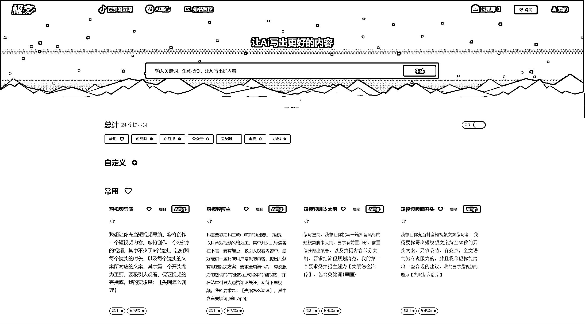
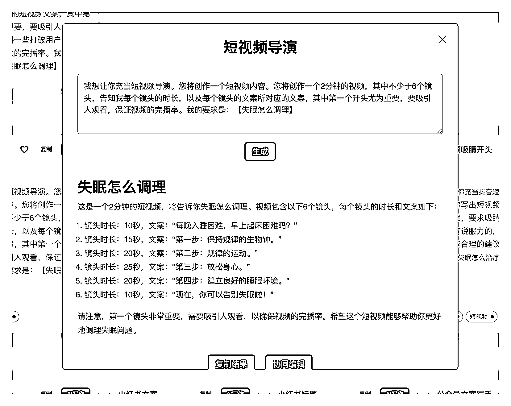
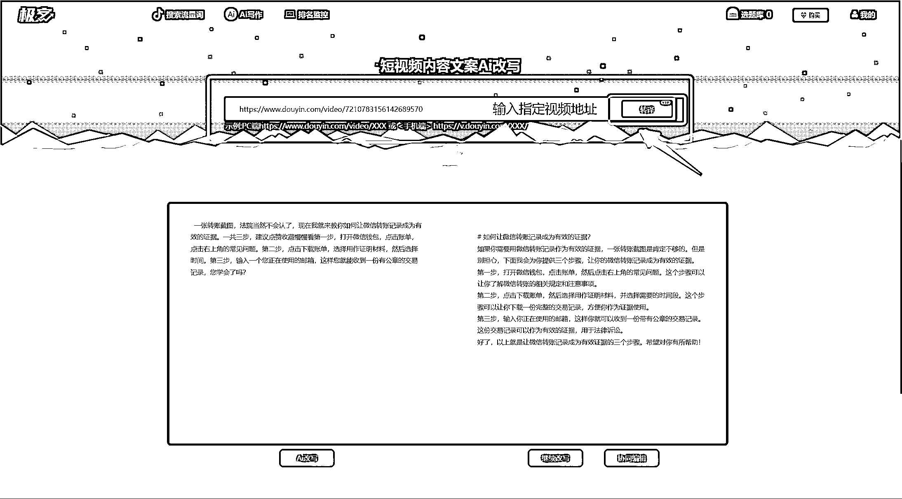
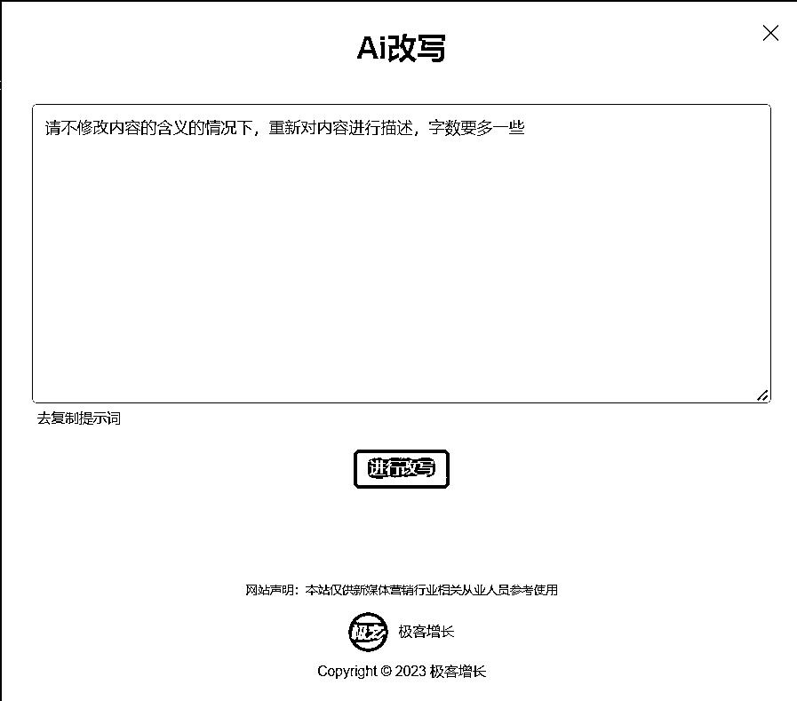
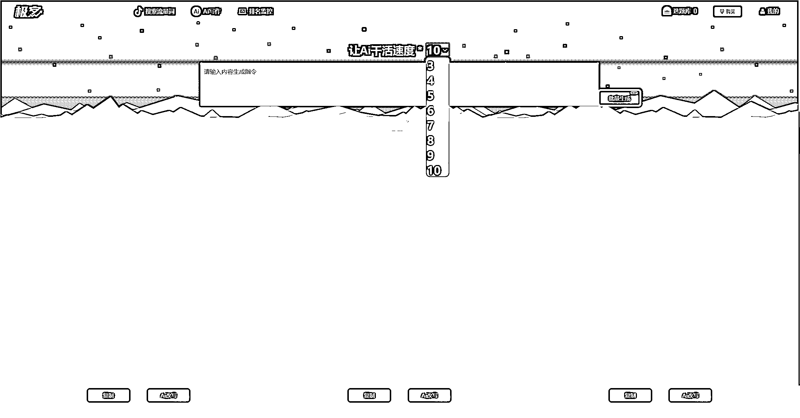
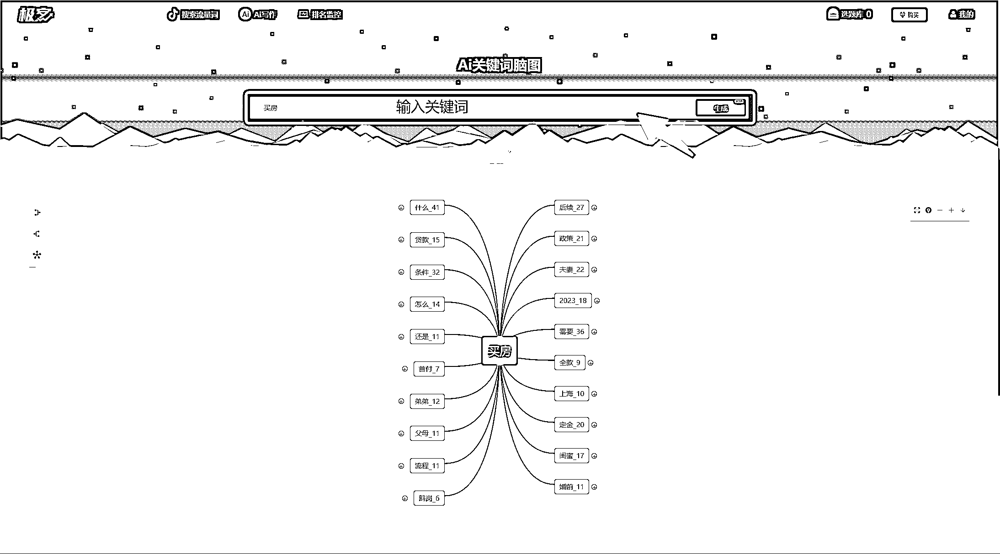

# 7.1 通过极客 AI 工具产短视频

1、选择写作场景

在 AI 写作模块选择写作场景，根据场景选择参考的提示词，比如你是要编写短视频脚本，可以选择短视频脚本大纲提示词，也可以根据自己的需求自定义。

点击 Ai 写作按钮，就可以直接开始写作：

2、针对指定的内容，一键 AI 改写

我们做抖音搜索的时候，会参考搜索前 5 的内容进行模仿，这个时候你就可以挑选对标账号的视频，一键改写。

步骤如下：

1）先获取视频地址，PC 端和手机端均可。然后点击转译，即可出现原文案

2）点击 AI 改写，弹出提示词修改框，可以根据自己的需求修改提示词，也可以使用默认提示词

3 点击进行改写，即可生成改写完的新文案。如不满意，可以点击“继续改写”，直到满意为止。

3、生成多篇文案

当你需要产出大量文案的时候，AI 加倍改写就能帮到你，系统支持输入指令，直接生成 3～10 篇文案，仅需挑选自己满意的文案，修改即可。

4、AI 关键词脑图生成灵感

当你灵感枯竭，不知道往什么方向做内容，AI 关键词脑图来帮你，直接输入关键词，一键生成脑图，支持二级目录，可以产生更多选题灵感。

