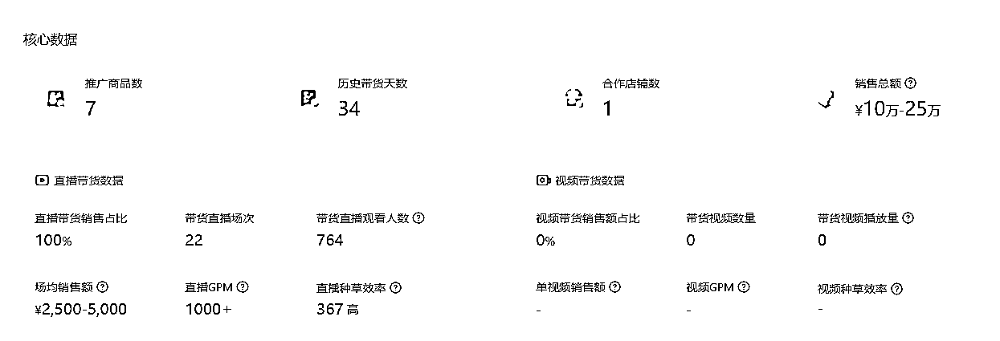
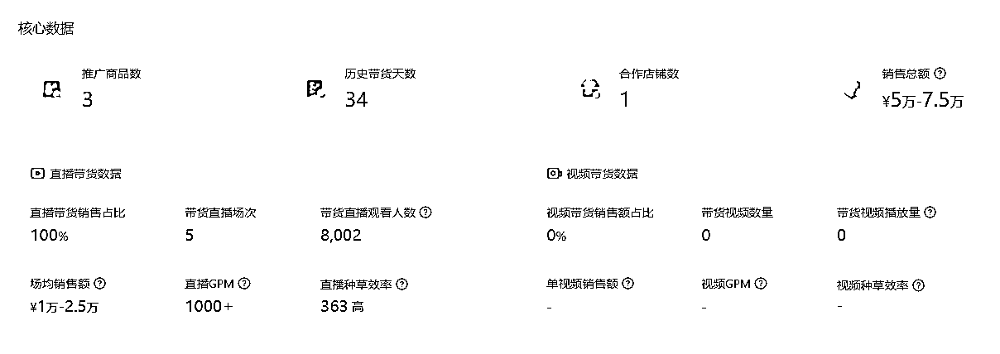
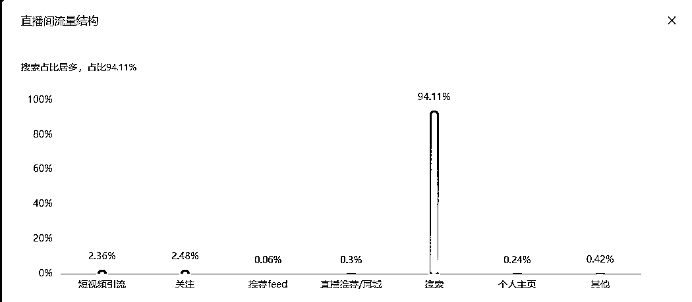

# 案例 1 ：皮肤病喷雾

案例说明：某皮肤用品类品牌方客户，想利用抖音 SEO 建立品牌心智，他们这个品类的月搜索量很大，类目大词的月搜索量为 165 万，产品客单价为 60 左右，复购率高。

1）流量来源

•内容形式：抖音直播

•流量渠道：抖音 SEO 流量

2）变现产品

•形式：实体产品

•品类：皮肤用品类

•货源/渠道：自己做货

•价格：产品客单价 60 元左右

3）变现方法

•载体：在平台成交

•方法：授权达人进行无人直播带货

•工具：抖音直播间

4）抖音 SEO 优化

•流量痛点：品牌在抖音上展现度较低，有其他竞品在抖音占据大量市场，希望通过抖音带动品牌销量，同时占领用户心智。

•优化操作：采用矩阵+无人直播的方式减低成本，具体手法为：账号昵称+直播间标题+个人主页合集+部分视频标题包含的核心关键词形式，最终取得了霸屏关键词搜索结果。

•优化效果：单号 30 天数据和 7 天数据

•直播间流量结构：在不投流的情况下，94% 的流量均来源于搜索，用户通过搜索进入直播间下单：

•案例总结：有实力的品牌方可以采用矩阵霸屏的方式，直接抢占品类流量，占领用户心智。