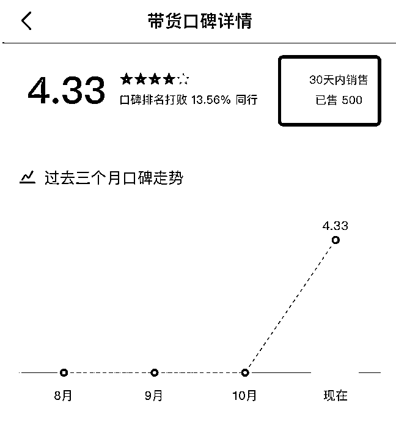
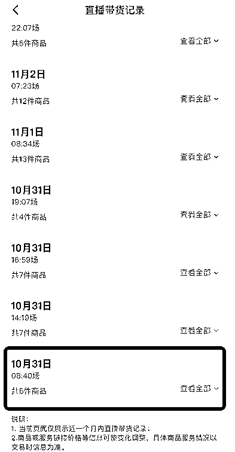
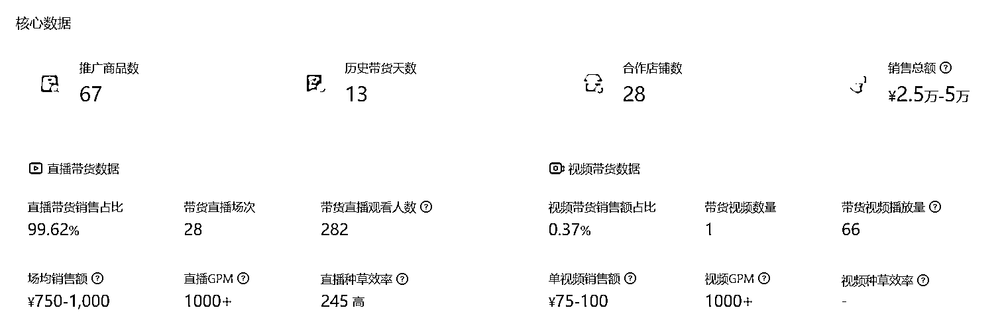
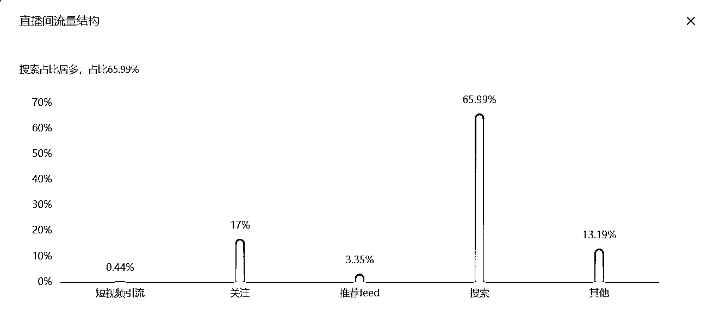

# 案例 2 ：中老年保健

案例说明：某电商行业学员，做中老年产品，学习抖音 SEO ，10 月 31 日开始发视频，然后直播带货，带的个护家清保健品类，客单价 50～70 元，总共开播 22 次，每天直播 2 次。

1）流量来源

•内容形式：抖音短视频

•流量渠道：抖音推荐流量；抖音 SEO 流量

2）变现产品

•形式：实体产品

•品类：中老年个护家清保健品类

•货源/渠道：卖第三方的货

•价格：产品客单价 50-70 元

3）变现方法

•载体：在平台成交

•方法：短视频和直播带货

•工具：直播间

4）抖音 SEO 优化

•流量痛点：学员希望通过抢占热门流量，实现精准带货，提高带货效果。

•优化操作：学员发现品类中有个品牌搜索量非常大，用户会直接搜索品牌名购买产品，于是用户通过「真人出镜直播间」，通过账号昵称+直播间标题+个人主页合集+部分视频标题包含的核心关键词形式，抢占品牌名获取搜索流量。

•优化效果：10 月 31 日才开始的操作：22 场直播，场均销售 750～1000 之间，13 天内带货 500 件：

这是 10 天带货数据和近 13 天的带货数据：

他的直播间搜索流量占 65% ：

案例总结：品牌效应，明星效应也是获取搜索流量的好方法。