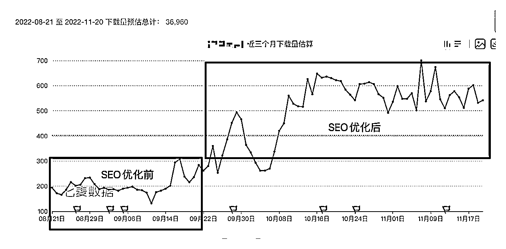

# 案例 3 ：APP 类

案例说明：某工具类 APP 学员，处于早期创业阶段，希望通过抖音 SEO 获得用户数的增长和变现。APP 付费客单价为 99～199 /年，产品用户体验良好。

1）流量来源

•内容形式：抖音短视频

•流量渠道：抖音 SEO 流量

2）变现产品

•形式：软件

•品类：某工具类 APP

•货源/渠道：自营产品

•价格：单用户下载成本大概在 15～20 左右；产品客单价 99～199 /年

3）变现方法

•载体：引流到第三方平台

•方法：下载并使用 APP

4）抖音 SEO 优化

•流量痛点：应用下载和激活成本高，由于产品属于小众 APP ，每个成本大概在 15～20 左右。希望能通过 SEO 取得一定的突破。

•优化操作：客户历史视频数据转化一般，我们指导用户通过极客工具挖掘用户痛点，找到蓝海词，最后通过 1 个月的时间，做了 3 个关键词（关键词涉及客户隐私不做展示）。

•优化效果：从 9 月 21 日开始正式发布抖音相关的内容，只看苹果端下载数据：•下载量：日均下载数量从 200 飙升 600/ 日，一个月新增 1 万多 App 下载量•工具（效率）排名：从 400 排名提升到 200 名•预估年度提升营收：12000*5%*199*12 = 14328000 元•预估年度节约成本（按一个用户最低 15 元估算）：12000*12*15 = 2160000 元

案例总结：大多数人都无法通过数据来发现用户痛点，只要抓住核心几个用户痛点，就能低成本稳定获取流量。