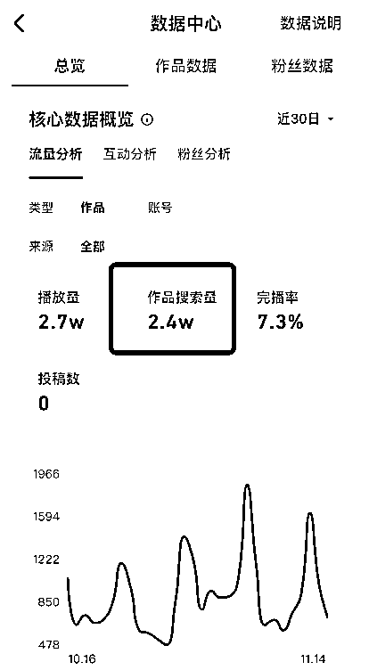
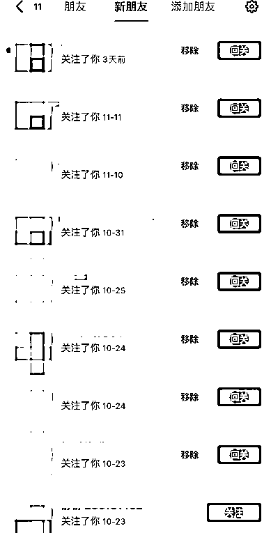
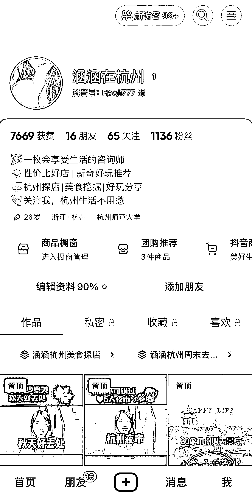

# 案例 4 ：同城团购

案例说明：这是我们自身的案例，为了测试搜索流量的持久性，围绕 SEO 做了做本地生活带货，做了大概 20 个视频，一年之后，到现在每个月都有几万搜索流量，一年 12 个月就是几十万搜索流量，这就是搜索的持久性。

1）流量来源

•内容形式：抖音短视频

•流量渠道：抖音推荐流量；抖音 SEO 流量

2）变现产品

•形式：实体产品

•品类：本地生活带货

•货源/渠道：卖第三方商品

3）变现方法

•载体：引流到线下成交

•方法：直接成交利润款

案例总结：持续吃作品的长尾流量，也是我们的目标之一，通过筛选词避开竞争，从而稳定持续获取流量，尽管一年没有发布作品，但是搜索流量依然很高。