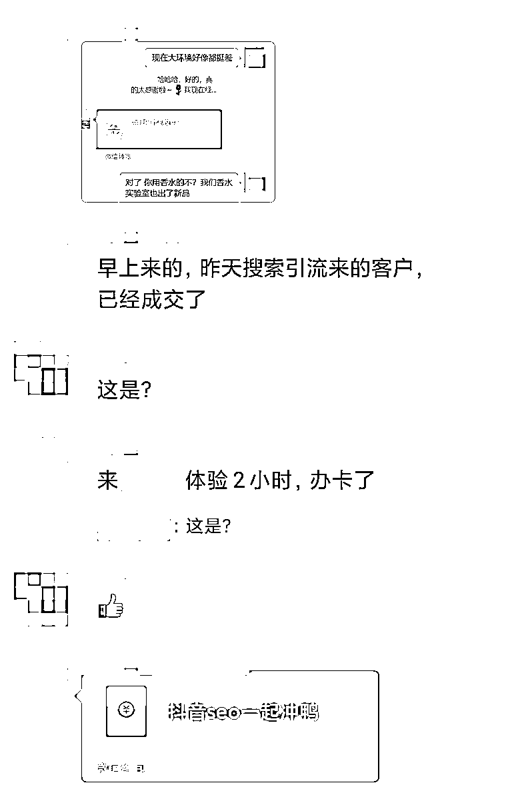
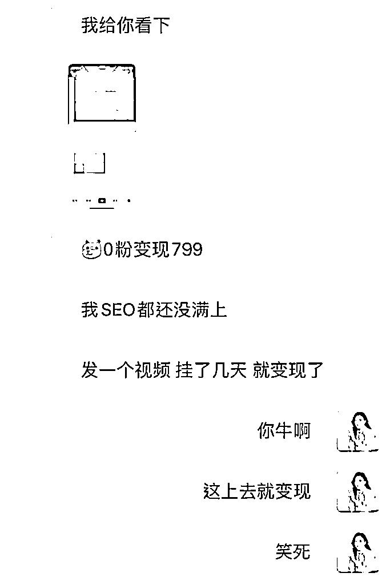

# 案例 5 ：同城实体店

案例说明：某同城业务学员，希望给自己的门店导流客户，客单价在 500～1000 ，前期业务处于亏损状态。

1）流量来源

•内容形式：抖音短视频

•流量渠道：抖音推荐流量；抖音 SEO 流量

2）变现产品

•形式：实体产品

•品类：同城业务

•货源/渠道：自己做货

•价格：客单价在 500～1000

3）变现方法

•载体：引流到线下成交

•方法：直接成交利润款

4）抖音 SEO 优化

•流量痛点：周围商家竞争大，搞低价竞争，流量获取难度高，成本大。

•优化操作：根据同城的特点，选择了同城 + 品类词，结合门店特色，突出老板人设。

•优化效果：学了抖音 SEO 课程后，他开始应用到业务中去，账号 0 粉就引来精准流量开单，并且因为学员在各大平台搜索霸屏，获得了羊城晚报的独家采访。

案例总结：效果立竿见影，抖音 SEO 是避开传统竞争的好方法，可以大大减少实体店的获客成本。