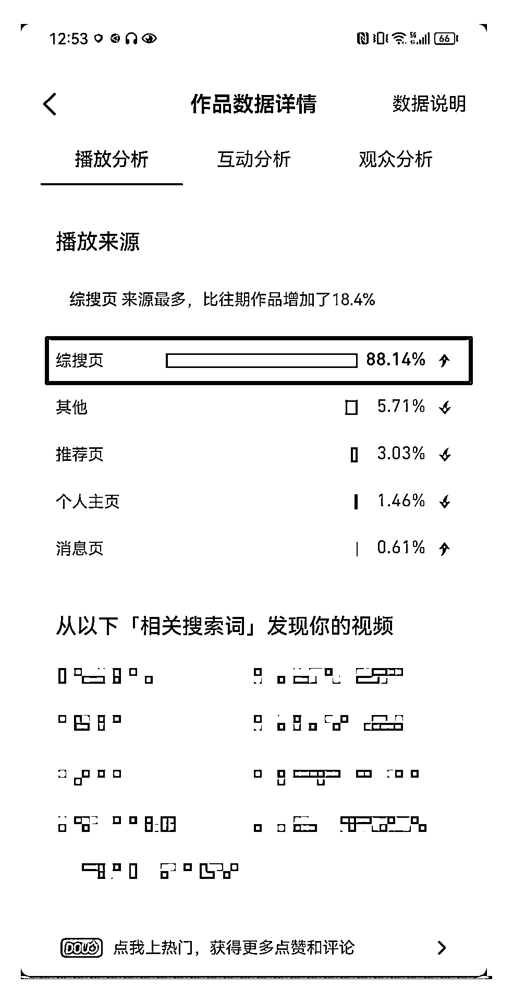

# 案例 6 ：宠物医疗类

案例说明：这是我们线下课的学员，主要做的是宠物医疗领域，客单价 200+ ，学员前期斥资组建了短视频团队，希望能做出成果，结果好长时间都没有效果，参加我们抖音 SEO 线下课之前，已经把短视频团队砍掉，希望能够通过抖音 SEO 来获取精准用户。

1）流量来源

•内容形式：抖音短视频

•流量渠道：抖音推荐流量；抖音 SEO 流量

2）变现产品

•形式：实体产品

•品类：宠物医疗领域

•货源/渠道：卖第三方的货

•价格：客单价 200+

3）变现方法

•载体：引流到私域成交

•方法：直接成交利润款

4）抖音 SEO 优化

•流量痛点和优化操作：学员参与线下课，在课堂上直接梳理用户痛点，挖掘合适的蓝海词，最终确定从宠物疾病入手，选好词后回到公司马上开干。

•优化效果：学员优化的词月搜索大概在 3～4 万左右，优化到第一后，获得稳定的精准流量。

