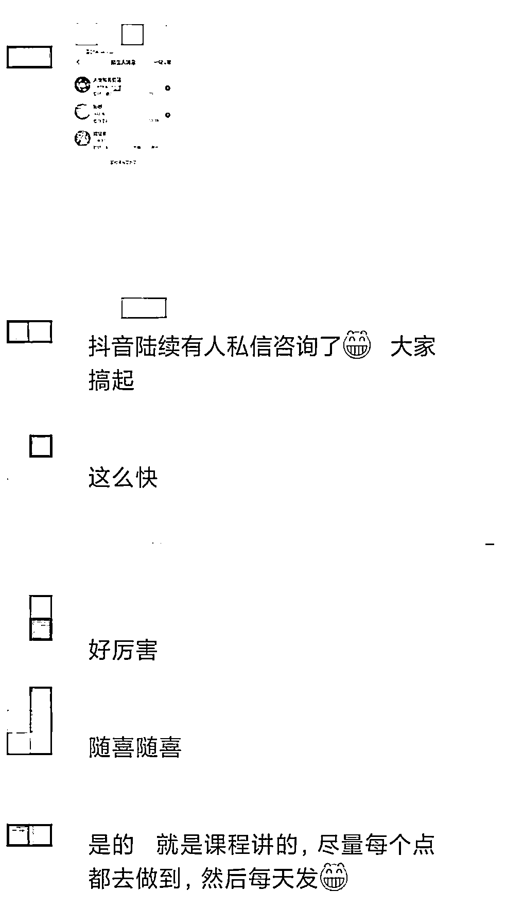
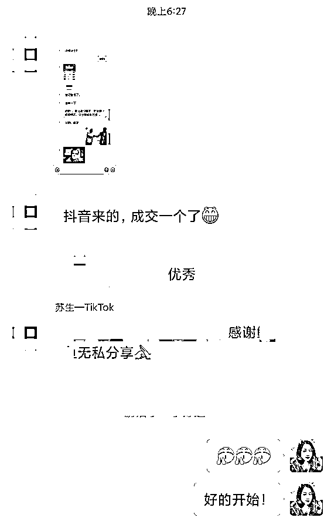
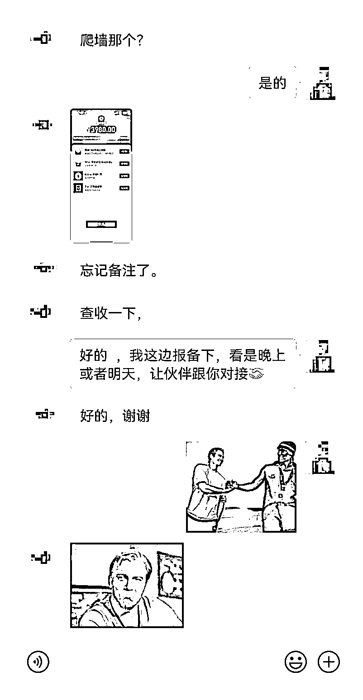

# 案例 2 ：电商培训项目

案例说明：某电商培训学员，他做的是跨境品类的培训，在抖音的搜索量比较小，但流量精准，竞争也不大，他产品的客单价在 4000 左右。

1）流量来源

•内容形式：抖音短视频

•流量渠道：抖音 SEO 流量

2）变现产品

•形式：虚拟产品

•品类：跨境品类的培训

•货源/渠道：自己做货

•价格：客单价 4000 元左右

3）变现方法

•载体：引流到私域成交

•方法：直接成交利润款

4）抖音 SEO 优化

•流量痛点：产品比较小众，前期做视频流量较小，客户不够精准，希望通过抖音搜索获取精准流量。

•优化操作：我们结合他的业务特点，建议先挑选产品词，快速抢占精准流量，后期再扩大成品类词或痛点词，获取更多流量。

•优化效果：他按照课程的内容做了 2 天，就开始有效果，引流了 8 个人。不久之后成交了 1 个，客单价 3980。

案例总结：只要客单价足够高，搜索量小不用怕，只要够精准。