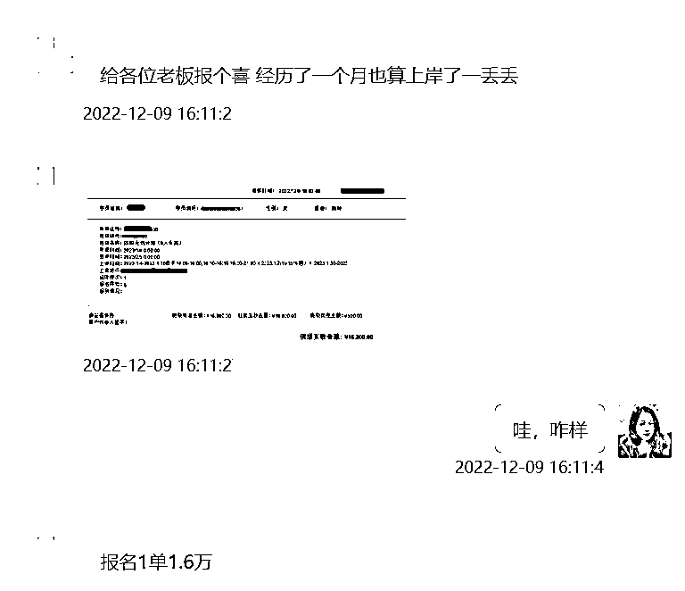

# 案例 3 ：考研类项目

案例说明：某考研类品牌客户，业务以线下为主，单价几千到十几万不等，该品牌在全国有很多校区，找到我们的客户属于总部。

1）流量来源

•内容形式：抖音短视频

•流量渠道：抖音推荐流量；抖音 SEO 流量

2）变现产品

•形式：线下虚拟产品

•品类：考研类品牌

•货源/渠道：自己做货

•价格：单价几千到十几万不等

3）变现方法

•载体：引流到私域或线下成交

•方法：直接成交利润款

4）抖音 SEO 优化

•流量痛点：考研业务竞争比较激烈，业绩压力不仅仅来源于外部，还来源于不同地区业绩排名的压力，希望通过抖音 SEO 获取精准流量。

•优化操作：我们结合品牌的业务特点，选取了考研相关的高转化的词，学员通过发作品抢占相关词。

•优化效果：学员一个月内出了 2 单，1 单 1.6 万左右，1 单 9 万左右，合计 107200 元。

案例总结：低频但是高客单价的业务，精准流量非常重要。