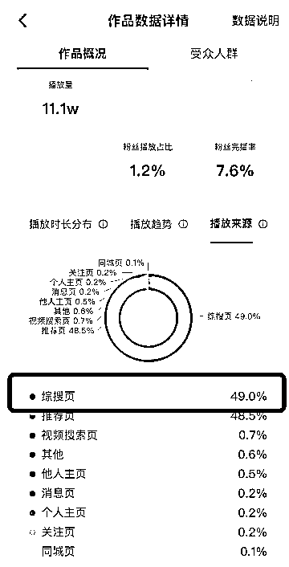

# 案例 4 ：全国二手车项目（含同城）

案例说明：某城市高端二手车学员，有自己的抖音账号，希望学习搜索，带来更多精准流量，客单价在 20～100 万。

1）流量来源

•内容形式：抖音短视频

•流量渠道：抖音推荐流量；抖音 SEO 流量

2）变现产品

•形式：实体产品

•品类：城市高端二手车

•货源/渠道：自己做货

•价格：客单价在 20～100 万

3）变现方法

•载体：引流到私域或线下成交

•方法：直接成交利润款

4）抖音 SEO 优化

•流量痛点：单客户价值大，但是之前拍视频来的流量不太精准，希望能提高精准度。

•优化操作：我们通过线下培训，根据数据分析决定采用品牌词的思路，直接获取品牌 + 二手车流量，因为是全国流量，所以不受地域限制。

•优化效果：单视频 11.1 万播放，有 49% 来源于搜索，搜索量显著提升。学员抢占关键词稳定排名第一。

案例总结：选对此用对方法，基本上都能出效果。