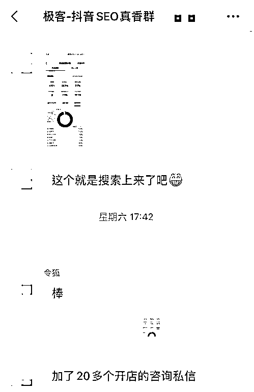
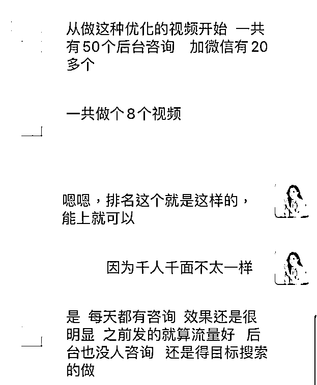
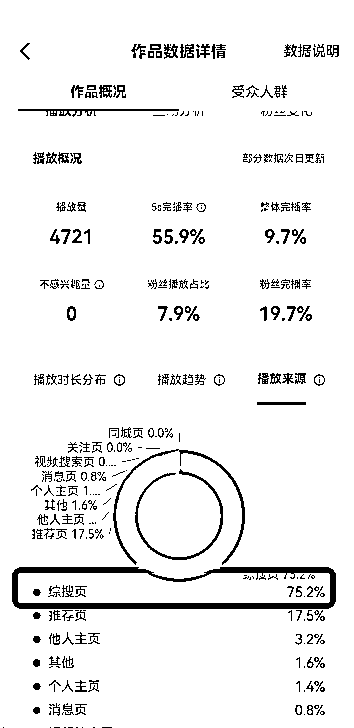

# 案例 5 ：同城加盟类

案例说明：某城市实体店加盟项目，学员希望通过做抖音获取有意向的加盟用户，客单价在 3 万左右。

1）流量来源

•内容形式：抖音短视频

•流量渠道：抖音推荐流量；抖音 SEO 流量

2）变现产品

•形式：实体产品

•品类：城市实体店加盟项目

•货源/渠道：卖第三方的货

•价格：客单价在 3 万左右

3）变现方法

•载体：引流到私域或线下成交

•方法：直接成交利润款

4）抖音 SEO 优化

•流量痛点：前期发视频流量不错，但后台没有什么人咨询，希望能获得精准用户。

•优化操作：根据该实体店的业务情况，我们帮忙挑选了高转化词，直接导向精准用户获取。

•优化效果：客户选词后做了 8 个视频，一个月的时间有 50 个后台咨询，加到私域有 20 多个。

客户说之前发的流量好，但是后台也没有人咨询，最关键的是还需要花费很多精力去不断更新视频，现在围绕搜索做，每天都有咨询。

