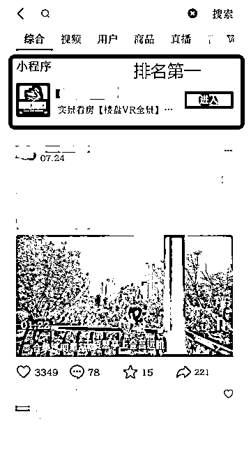
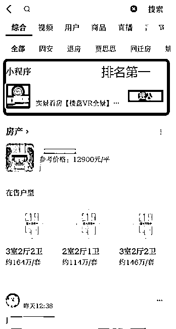
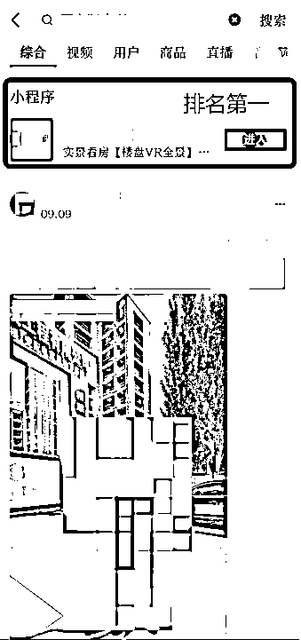
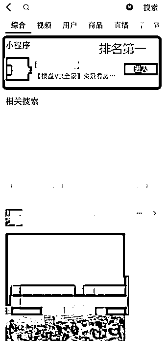

# 案例 6 ：房产类小程序

案例说明：某房产用户，负责北京周边城市的新房，竞争相对比较激烈。

1）流量来源

•内容形式：抖音短视频

•流量渠道：抖音推荐流量；抖音 SEO 流量

2）变现产品

•形式：实体产品

•品类：房产

•货源/渠道：卖第三方的货

•价格：高客单价

3）变现方法

•载体：引流到私域或线下成交

•方法：直接成交利润款

4）抖音 SEO 优化

•流量痛点：同行很卷，大部分渠道都竞争很大，系统通过搜索解决这个问题，主动获客，同时不想有太高的拍摄成本

•优化操作：我们和他系统分析了所有楼盘的搜索数据，最后选择了 10 个楼盘关键词（月搜索量在 1000 左右），注册 10 个小程序，4 个排名第一，其他几个在排名前 5 。

•优化效果：

案例总结：如果行业适合做小程序，同时希望能够省力一些的老板建议做。

