# 抖音图文电商 202308

> 来源：[`remhu1p2pr.feishu.cn/docx/SN95doD42o8mLfxLY99cGp9cnXb`](https://remhu1p2pr.feishu.cn/docx/SN95doD42o8mLfxLY99cGp9cnXb)

# 抖音图文电商

出品时间：2023 年 8 月 15 日

手册使用说明：本文旨在向你展示一个项目的更多可能性，帮助你更好地理解和实操。

建议：如果需要快速定位到精确内容，可以使用快捷键 Ctrl + F/command + F 的形式，搜索「关键字/词」，查找你想要的内容。

# 写在前面

💡Hi,

欢迎大家来到 8 月航海｜抖音图文电商｜实战手册，相信在接下来的日子里，我们将在这里见面很多次。

1)抖音图文电商是什么？现在做，有多大机会？

抖音图文电商，是在抖音上将图文内容和商品销售结合的电商模式。你可以发布商品图文内容，并嵌入商品链接，吸引用户购买。

相较于传统的短视频带货，「抖音图文电商」的门槛更低，作品制作难度更小，产出速度更快，但成交数据并不逊色于短视频带货。

今年 5 月开始，抖音图文带货内容进入爆发期，GMV 突破 12 亿+，其中 5 万粉以下达人通过图文带货创收 8.9 亿元。部分看起来平平无奇的账号，甚至能够单月销售总额破百万。

2）什么样的人适合做抖音图文电商？

如果你在找一个上手快又不占用太多时间的副业项目，或者想在抖音带货分一杯羹，那么现在正处于爆发期的「抖音图文电商」是非常值得尝试的。

制作这类图文作品很简单，只需要获取商品图片，按 9:16 比例裁好，再上传到抖音，添加适当的背景音乐就好。账号运营也不难，持续发作品、持续怼爆款作品即可。

3）怎样正确使用这个手册？

为了让大家更顺利开展项目，我们找到十数篇相关星球贴与官方资料，整理出了这份「抖音图文电商｜实战手册」，大家按照手册的步骤进行实操，就能从 0-1 了解项目全貌，并逐渐上手。

当然，「抖音图文电商」项目也有核心步骤，大家在实操过程中要特别注意一下几步：✅第三步：账号冷启动，达成千粉开橱窗

✅第四步：积累选品与素材

✅第五步：制作图文视频

✅第六步：发布视频，引导成交如果你已经跑通项目闭环，想要进一步优化或放大项目，可以重点阅读：

✅第七步：复盘数据并优化

✅第八步：放大成果（包含三种方法：投放、直播、搭建矩阵）

为了让大家能快找到合适赛道，我们也总结了爆款赛道的案例与公式，供大家参考：✅第九步：学习爆款赛道案例

⚠️需要特别注意的是：

最近「抖音图文电商」的平台审核比较严格，账号会因为内容同质化高等原因被限流 7 天、30 天，概率大约有 30%-40%+。

图文二创本身其实是平台允许的，但近期入场人数增加，内容同质化过高。如果你仍愿意尝试该项目，需要在选品与作品去重上花更多心思，并做好可能被限流的心理准备。但该情况可能也是间歇性，短期红利项目的常态是如此，大家可以结合自己实际情况，选择是否下场。

哪怕本次无法在本项目中赚到钱，在实践过程中，你也能够充分了解「抖音图文电商」和抖音带货的项目逻辑，下次再有类似项目时，你能更丝滑入场~

除了上述内容外，还有个核心就是多提问，多交流，在这里没办法满足你的地方，多问问，我们会一起找到关于难题更多的解法。

希望大家可以在这次航行里收获成果外，结识一群战友。

以下内容由生财有术联合圈友制作而成，仅供航海船员以及生财有术星球圈友学习使用。

同时也欢迎圈友们在实践过程中持续反馈，和我们共同完善，可以联系鱼丸（yuwan387）提供修改建议～

# 第一步：了解抖音图文电商正式了解项目前，有一个最新的平台信息需要告诉大家。

⚠️最近「抖音图文电商」的平台审核比较严格，账号会因为内容同质化高等原因被限流 7 天、30 天，概率大约有 30%-40%+。

图文二创本身其实是平台允许的，但近期入场人数增加，内容同质化过高。如果你仍愿意尝试该项目，需要在选品与作品去重上花更多心思，并做好可能被限流的心理准备。但该情况可能也是间歇性，短期红利项目的常态是如此，大家可以结合自己实际情况，选择是否下场。

## 1.1 什么是抖音图文电商 @盗坤 @唐明杰

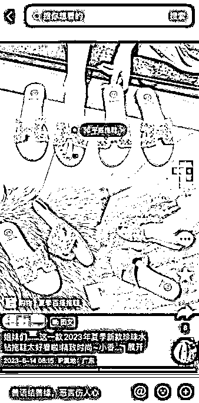

不拍视频，也不用混剪视频，就是把图片进行二次创作，然后通过抖音发布图片视频，接着通过引导橱窗、引导私域或挂车，就能完成变现。

流程也十分简单，找到产品图片，把产品图抠出来，然后换个背景模板，整个过程熟练了一两分钟就搞定。所以，这样的账号，如果你愿意付出一些时间，一个人就能做十个。

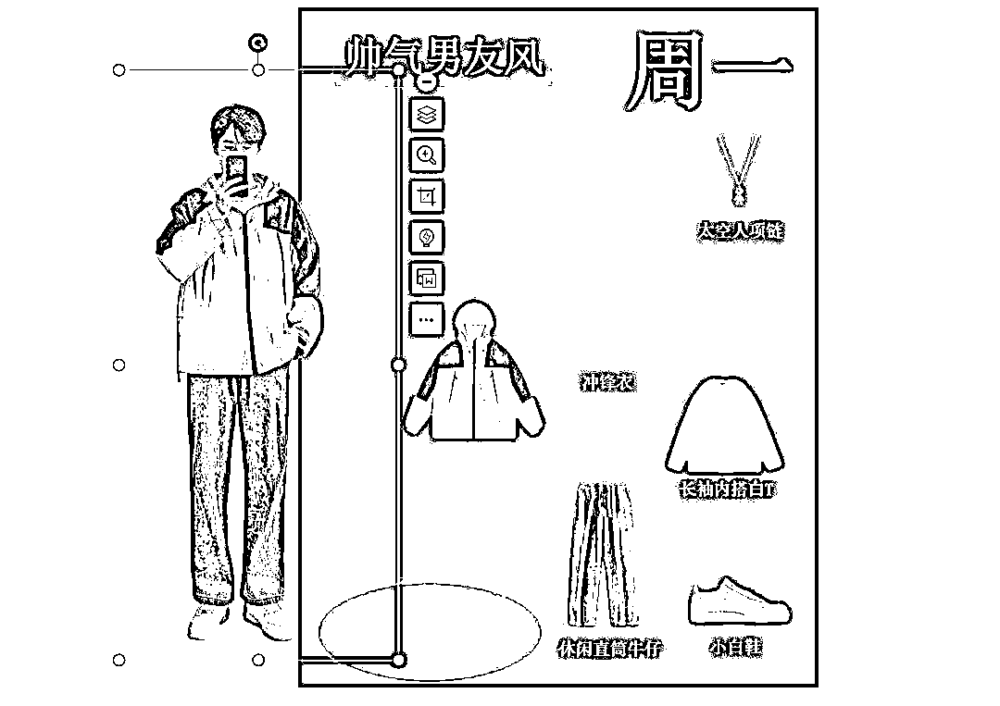

那这样干，能拿到流量吗？又究竟能卖多少钱，赚多少钱呢？有些看起来平平无奇的账号，最近一个月销量 100 万 -250 万，最号，如果你愿意付出一些时间，一个人就能做十个。

那这样干，能拿到流量吗？又究竟能卖多少钱，赚多少钱呢？有些看起来平平无奇的账号，最近一个月销量 100 万 -250 万，最

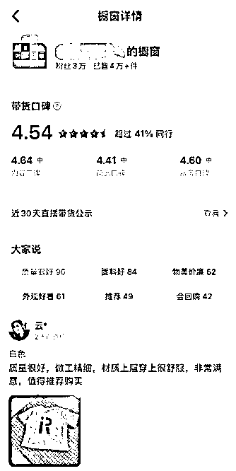

靠着这种模式，在还没挂车、毫无投放时，@盗坤老师 硬靠橱窗和引导微信成交，卖了 20 万。

后来半月，@盗坤老师 的图文也开始直接挂车，在毫无投放且没有直播的情况下，但单账号最高一天卖了五千多。

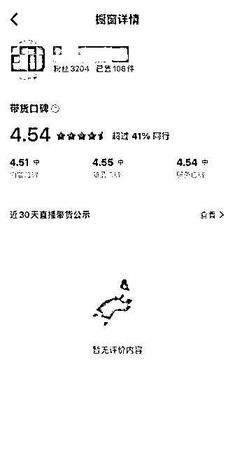

根据观察和官方数据，想要做好这个项目，主要有三大要素：

选择「颜值/新热」商品

制作「高清/有用」图文

选择「热门适配」BGM 上述三点，我们也会在后文中展开说说：

「颜值/新热」商品👉第四步：积累选品与素材

「高清/有用」图文👉第五步：制作图文视频

「热门适配」BGM👉第六步：发布视频，引导成交内容来源：《闷声发财，抖音图文二创带货》《抖音蓝海市场细分用户人群，优化选品，轮播图童装单月利润 2W+》

## 1.2 项目优势与缺点 @抖音电商官方 @刘逍遥

今年 5 月开始，抖音图文带货内容进入爆发期，GMV 突破 12 亿+，其中 5 万粉以下达人通过图文带货创收 8.9 亿元。部分看起来平平无奇的账号，甚至能够单月销售总额破百万。

为什么能做到这些呢？以下是抖音图文带货的 3 点优势：稿均流量高、成交转化高；

创作简单、上手更快；

图文与电商的结合度高，卖点直观稿均流量高、成交转化高

以下是官方的统计数据：

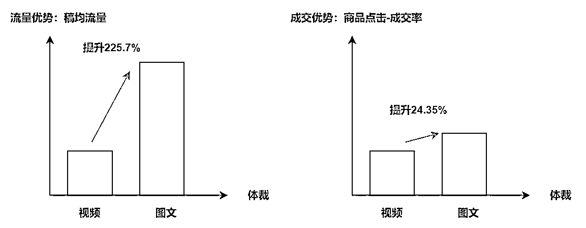

可以看到，图文带货视频的稿均流量，比视频带货提升 225.7%，商品成交率也提升了 24.35%。

部分看起来平平无奇的账号，甚至能够单月销售总额破百万：

8000 多粉丝的穿搭作者，不靠短视频或直播，仅靠一篇图文，用两张图片、一段音乐、几行文字，为粉丝推荐连衣裙，实现单篇带货超 34 万，月带货超 120 万；

一位读书号作者，用图文晒出读后感，为一本书带货超 48 万；

一位美食号作者，拍照分享好吃的巧克力，借助图文带货 32 万；

……

创作简单、上手更快

相较于短视频和直播，图文的创作要简单许多：只需要准备 3-5 张图片，就能轻松发布作品，不需要视频混剪，也不需要真人出镜。

这样的低门槛，对于没有太多经验的作者更加友好，甚至在 P 图软件里套个模板，就能做完图文带货素材。

而且图文带货目前都是用手机发布，所以一个手机完全足够满足制作图片和发布图文带货，不用在局限是否在电脑面前。

图文与电商的结合度高，卖点直观

使用图文种草，能让产品的核心卖点一眼被看到，从而快速打动用户，激发购买兴趣。

搭配购物车、橱窗链接，能为用户的下单购买提供便利，整体成交率随之提升。

当然，一个项目有优点，也肯定有缺点。抖音图文带货的缺点是，对图片的排版有一定要求。

了解小红书的圈友，一定知道图文最重要的一定是首图，就像视频的黄金三秒，首图不吸引人，大概率这条视频就被划走了。所以做图文需要一定的审美，不过对中老年书单号的赛道来说，这点不那么重要，更应该注重的是，如何突出核心内容，使其更加醒目。

内容来源：《单号日入 1000+，抖音图文带货玩法喂饭级教学》

## 1.3 变现方式 @抖音电商官方

「抖音图文电商」的产品来自抖音精选联盟，无需发货、售后、客服等工作，主要出单方式就是赚取相应佣金。

当然，完成变现闭环的路径不止一条。

路径一：开通「商品橱窗」前，可以通过短视频种草，引流至其他渠道成交，如引流至微信成交

在抖音直接带货是有限制的，我们需要开通「商品橱窗」。按照官方规则，开通「商品橱窗」的必要条件有：公开发布视频数 ≥ 10 条

抖音账号粉丝 ≥ 1000 账号已实名认证

在前期还未能达成达到要求时，我们可以发布图文视频后，引流用户至微信成交。

如何在抖音引导用户添加微信？大家可以查看👉【9 月航海｜抖音短视频｜实战手册-章节 11.2.1 如何引流至微信】需要注意的是，这样的引流动作是不被官方允许的，且再谨慎的引流动作一定都有风险。如果想要 0 风险，最好的办法就是等开通「商品橱窗」后，用橱窗、挂车等方式完成变现。

路径二：开通「商品橱窗」后，通过引导橱窗、挂购物车、直播间成交这是「抖音图文电商」最核心的变现路径。

在👉「第三步：账号冷启动，达成千粉开橱窗」中，我们会告诉大家如何实现千粉开橱窗。

开通橱窗后，我们可以在图文视频中挂载购物车，吸引用户点击图文作品的左下角购物车，完成商品购买，从中获得分佣。

如果每天的挂车限额已发完（粉丝数在 1000-3000 的账号，每天限制发布 2 条带购物车视频），我们可以在评论区引导大家点击橱窗完成商品购买。

如果某个视频数据爆了，我们也可以顺势开启直播，放大出单效果，赚取更多分佣。

## 1.4 适合谁做 @唐明杰

如果你在找一个上手快又不占用太多时间的副业项目，可以尝试这个项目。制作这类图文作品很简单，只需要获取商品图片，按 9:16 比例裁好，再上传到抖音，添加适当的背景音乐就好。账号运营也不难，持续发作品、持续怼爆款作品即可。

内容来源：《抖音蓝海市场细分用户人群，优化选品，轮播图童装单月利润 2W+》

1.5【拓展】抖音底层逻辑与算法 @徐立群在抖音做项目，需要了解抖音的底层逻辑与算法，如果你想在后续有更好的项目手感，建议阅读本拓展章节。

我们在抖音上发一个视频或是开一场直播，系统会按怎样的规则来推送这个视频/直播？这个规则就是系统推荐算法。

首先，让我们明确一件事：抖音的算法，短视频与直播是不同的。严谨点来说：短视频的流量池，和直播的流量池，是相对独立的。

所以，我们能看到很多几百万粉丝的短视频达人，直播间只有几个人在线；反之，很多搞直播带货的号，粉丝不过几万人，直播间竟然也有好几万人在线，一场还能卖几百万。

例如下面这个号，1.3 万粉丝，一场直播却能卖 100 万+。

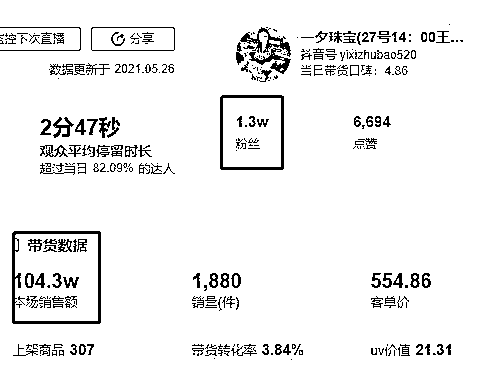

其次，让我们进一步拆解，算法可粗略分为：兴趣标签体系+阶梯流量池体系。

兴趣标签体系，指的是抖音会通过大数据记录与分析，给我们每个人每个帐号，打上 N 个标签。

这些标签，大致又可以分为三类：

基础标签：你的年龄、性别、城市、手机品牌...兴趣标签：你喜欢哪哪一类的内容？汽车、段子还是小姐姐跳舞？

交易标签：你在抖音上会买什么样的产品？价格多少？

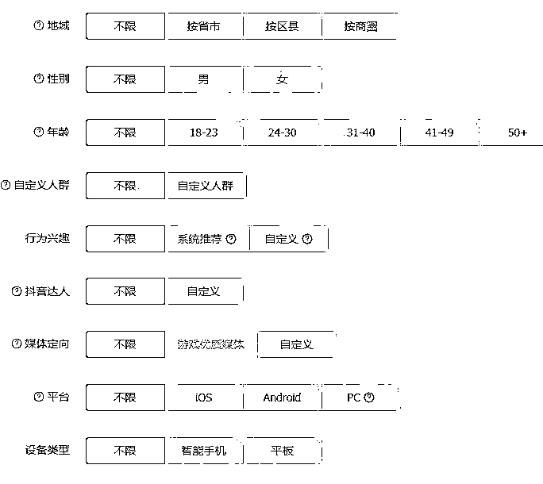

抖音广告后台的部分标签

当我们使用抖音时，就会刷到和我们兴趣标签相匹配的内容，即短视频+直播。所以，打开一个人的抖音，往往就能大致判断平时他在看什么内容，有什么兴趣爱好。

这个兴趣标签体系，一方面决定了，抖音会推什么样的内容给我们看。另一方面，也决定了我们的内容会被推送给什么样的观众。

所以，市面上很多教你养号打标签的办法，大多是错的。因为那一套办法，让你使劲刷同行内容，只能给你的观看习惯打标签，并不能给你的内容打标签。

怎么给自己的内容打标签？一定要发布内容，产生各种数据才行。

阶梯流量池体系，是指无论短视频还是抖音，都有大概 8 个级别的流量池。

一个短视频或直播间，需要在抖音搭建的“斗兽场”中玩命 PK 胜出，才能不断跃迁到下一个流量池。

短视频的 8 级流量池，基本如下：

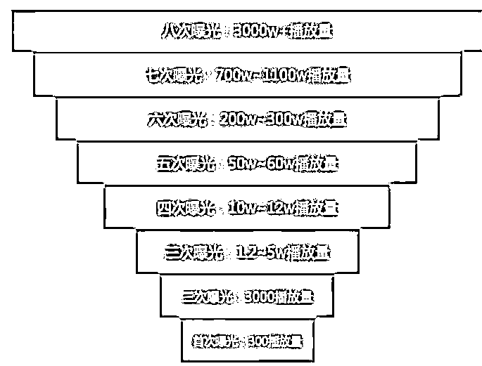

短视频和直播间，考核的标准都可以粗略地分成三大要素。

短视频考核三大要素：

完播率互动率（点赞、评论、转发）

转粉率你的视频/直播间，刚开始都是青铜级别，要在最低的流量池接受考察，如果上述三要素表现不错，打败了一堆青铜中的青铜，就会晋升到下一个流量池，成为一名白银战士。

如果在众多白银选手中胜出，你又可以继续晋升黄金、铂金、直至王者；

如果不幸失败，那么很可能你就只能停留在白银这个级别了；如果屡败屡战，就可能降级到青铜。

需要说明的是，算法是抖音吃饭的看家本领，原则上来说是个“黑盒”，根本不可能公开的，同时也是在不断调整的。

内容来源：《万字长文：抖音直播带货入门保姆级手册 》1.0

# 第二步：前期准备 2.1 设备与环境 @柠柠

设备要手机，不能用 ipad。

苹果手机

建议买苹果 7 以上的型号进行操作。抖音平台会对停产机进行一定的风控。若手机之前有登陆过违规或封号的账号，有设备风控的风险。

安卓手机

安卓手机型号较多，难以进行推荐。若手机之前有登陆过违规或封号的账号，有设备风控的风险。投抖+建议用安卓手机投，更加容易过审。

网络环境

若要矩阵操作，不要批量设备连 wifi，建议连 4g。

内容来源：《抖音图文引流，累积 70w+私域流量，月纯利 5W+》

## 2.2 注册抖音账号 @钱劲

抖音图文电商，最好是准备 3-5 个号，前期不敢这么做，心里没底的话，也可以先准备一个账号先跑通流程，先出一单也是可以的。

如果之前有注册过账号，发过视频没有什么粉丝基础，可以把视频隐藏后，再重新发视频，不需要重新注册账号。

如果之前已经做过短视频，且有了一定的粉丝基础，并且和现在的定位完全不相关，建议重新注册账号。

账号注册时，建议办理新手机号码注册，一个人最多在一家运营商注册 5 个手机号，三家运营商共 15 张。不建议使用移动的和多号或者联通沃小号，有一定的封号风险。15 张已经足够用。

账号注册的过程中，我们仍需要注意以下几点：新账号注册前，建议先短暂的使用新手机卡打电话、发短信、消耗些流量，避免风控

新账号注册时，建议一机一号，不建议使用双开应用注册新账号注册后，不建议立即实名认证，可以在后期账号起号后选择性实名

如果使用的手机设备之前有登录过被封的抖音账号，建议刷机后再注册新账号

如果是批量注册账号，建议控制在同一 WiFi 下的账号数量，或使用手机流量注册，避免风控内容来源：《9 月航海 | 抖音短视频 | 实战手册》《抖音图文带货非常好做，小白，想做副业的朋友可以冲》

## 2.3 确定账号定位

带货账号如何确定自己的定位呢？以下是一些可参考的经验建议。

### 2.3.1 方法一：从自己的爱好出发 @文林

比如我有个爱好是喜欢绿植，爱养花养草，后面验证这个人群出单还不错。那我是怎么选到这个人群的？还原一下这个过程。

从自身爱好出发，找需求

做减法

但是，5 个需求太多了，于是我开始做减法，事实求是的审视我在这 5 个需求里的实际掌握情况。书、绿植、美食、乒乓球这 4 个适合我做，民谣音乐这个因为自己唱歌跑调做不来。

分析市场的供需关系和竞争对手的情况

确定自己的优势过后，我继续做减法。这个时候我采取一种方法：分析市场的供需关系和竞争对手的情况。

好的战略选择是，你找到了一件打得过的事，上去打。

书和美食这两个类目，市场需求大，但市场的竞争也比较大，很多做书单的，也很多做美食，内容生产也相对很成熟，这个时候，我一个刚入行的新手，估计很难在短视频打的过这些竞争对手，所以书和美食，就被我排除了。

剩下乒乓和绿植，乒乓的需求挺大的，但我查了一下在抖音上，做的号的乒乓账号变现方式都是广告为主，然后做乒乓带货很少，哪怕有带货的，但他们的带货账号销量很低的。

头部乒乓产品都是月销售额才几千元，头部乒乓带货变现的都这么少，那么对于新入局的新手来讲，那么就更难赚到钱了，所以乒乓因为天花板太低，就被我排除了。

查看大盘数据

剩下最后一个绿植，我紧接的做法不是因为剩下绿植这个选项，我就脑袋一拍就做绿植这个品了。

而是我接着去看绿植这个类目的大盘，我通过飞瓜（其他工具比如抖查查、蝉妈妈等也可以）去查绿植这个类目的大盘数据。

发现大盘数据还不错，记得当时 7 月的绿植这个在抖音上销售额大盘就已经达到了 2 亿了！

月销售额 2 个亿的这个蛋糕对于新人，还有初创团队来说算是不错的了，而且当时看到的数据，每月绿植的涨幅还不错，近 3 个月月涨幅在 20%，也就是说绿植这个类目在抖音上是越做越大的。

现在是 2 个亿，以后可能每月 5 个亿了，等我 1 月 28 号查到的数据，绿植类目已经由 2 个亿上升到 3.19 亿了。

到这里，我就敲定下来目标客群：18-35 岁，喜欢养花养草养绿植的人群。

小结

从自己的爱好入手最大的好处：

自己本身就是这个人群之一，了解这个人群的需求和痛点，那么上手会更加容易，也能更加能够把握到用户需求，选品和制作内容的成功概率更高。

同时因为做的是自己喜欢的，那么这个过程也更加开心，更加享受，做的不累，而且做的过程很开心。

当然这里有个要避免的坑，一定要注意，就是选择的这个人群不能太小众。

如果这个人群太小众，建议不要碰这类目，天花板低很难赚到大钱，关键还很难得到正反馈，没有及时得到正反馈，最后就容易放弃！

内容来源：《通用能力｜怎么定位和选品》

### 2.3.2 方法二：从自己的熟悉的人群、擅长的人群出发 @文林

有些朋友自己不是宝妈，但在母婴行业做了很久，很熟悉宝妈这群人的需求和痛点，那么也可从这个入手。因为熟悉和擅长的人群，自己在选品时，能够更好的把握这些人的需求，选到合适的品，这样成功率也会更高。

所以想想自己熟悉哪块，擅长哪块，然后由这块去找到自己熟悉和擅长的人群着手。

内容来源：《通用能力｜怎么定位和选品》

### 2.3.3 方法三：蓝海人群 @文林

如果上面两种方法，都没找到适合自己的人群怎么办？那么最后一种方法，就是选蓝海人群。

什么是蓝海人群，也就是竞争对手很少的人群。

比如女性中老年人群、超肥胖女性人群、汽车维修师傅、电工电焊人群、装修工人人群，园林人群、农业种植人群等等。

这种人群竞争少，竞争对手生产的视频也很粗糙。那么对咱们来说，就是如果你做的好，就是一种降维打击，成功概率也大。

像我之前选的人群--装修师傅，当时选了一个吊顶打钉神器，这个品 7 天卖了 42 万，利润率 20% 多。

蓝海类目推荐（抖音可以做的类目很多，这里只是简单展示部分）：

蓝海类目推荐类目

人群

推荐指数

推荐理由中老年女装

中老年女性

5 星

适合人群广；如果有熟悉女装和了解中老年女性用户的匹配度最高

大码女装肥胖女性

4 星

女性最佳；有熟悉女装和了解中老年女性用户的匹配度最高

中老年大码女装

胖中老年女性 5 星

适合人群广；有熟悉女装和了解中老年女性用户的匹配度最高

儿童汉服

宝妈人群

4 星

适合人群广；了解宝妈的、有汉服相关行业经验的最佳

大码男装

肥胖男性

3 星

适合人群广；服装和了解男性用户的最佳绿植盆栽

年轻用户

5 星

适合人群广；喜欢绿植和有绿植供应链的最佳

3C 数码配件大部分人群

4 星

适合人群广

宠物玩具等宠物周边

养宠物人群 4 星

适合人群广；喜欢宠物、养宠物人群最佳

渔具

钓鱼人群

4 星

喜欢钓鱼的人群最佳、渔具从业者最佳

户外/登山/野营/旅行用品

户外人群

5 星

喜欢户外的人群最佳时尚饰品

女性

4 星

对时尚饰品了解的最佳

二次元产品（比如二次元口罩）

二次元人群

5 星

对二次元喜欢了解的最佳

母婴玩具宝妈人群

4 星

人群广；宝妈人群和了解宝妈用户的最佳

美食

喜欢美食人群 5 星

适合人群广；特别适合喜欢吃零食、会做菜、会拍摄的人

做菜调料

喜欢做菜的人

5 星

适合人群广；特别适合会做菜、会拍摄的人

这里有个注意的点是：不要为了蓝海而蓝海，有些人群特别蓝海的话，就千万不要碰。

内容来源：《通用能力｜怎么定位和选品》

### 2.3.4 方法四：参考项目热门赛道

项目玩法不同，热门赛道可能就会有差异。

对于「抖音图文电商」来说，目前比较热门的赛道有：亲子方向、食品方向、服装方向、家具方向和图书方向。

大家可以从这几个赛道尝试找一找对标账号，从而确定自己的定位。

## 2.4 账号设置

「抖音图文电商」的账号设置要求并不高，大家模仿对标账号即可。

头像

跟你的要带的货的形象吻合即可，也可以网上找真人头像，容易建立信任感。

昵称

有辨析度、好记、有趣的名字，专业属性标签最好能加，更有辨析度和真实可信。不要用复杂的符号或特殊语言。

简介

什么样的人设？有什么价值主张？提供什么的价值？

表明我是谁，我是干嘛的，我来为大家提供什么价值。融合你的领域、身份等标签，简单文字表达+适当的 emoji 符号 。

举例：

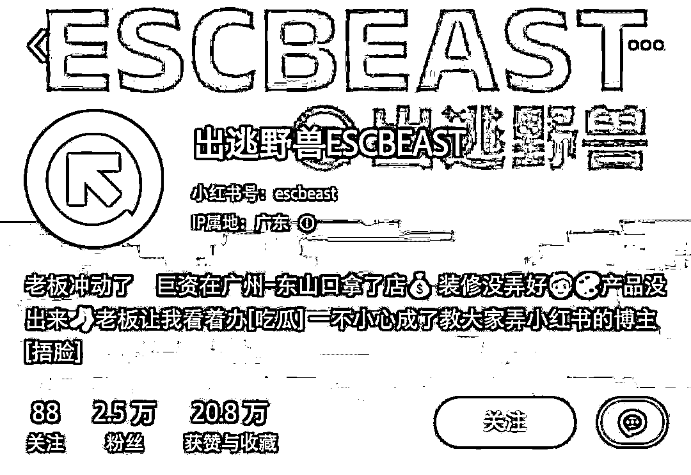

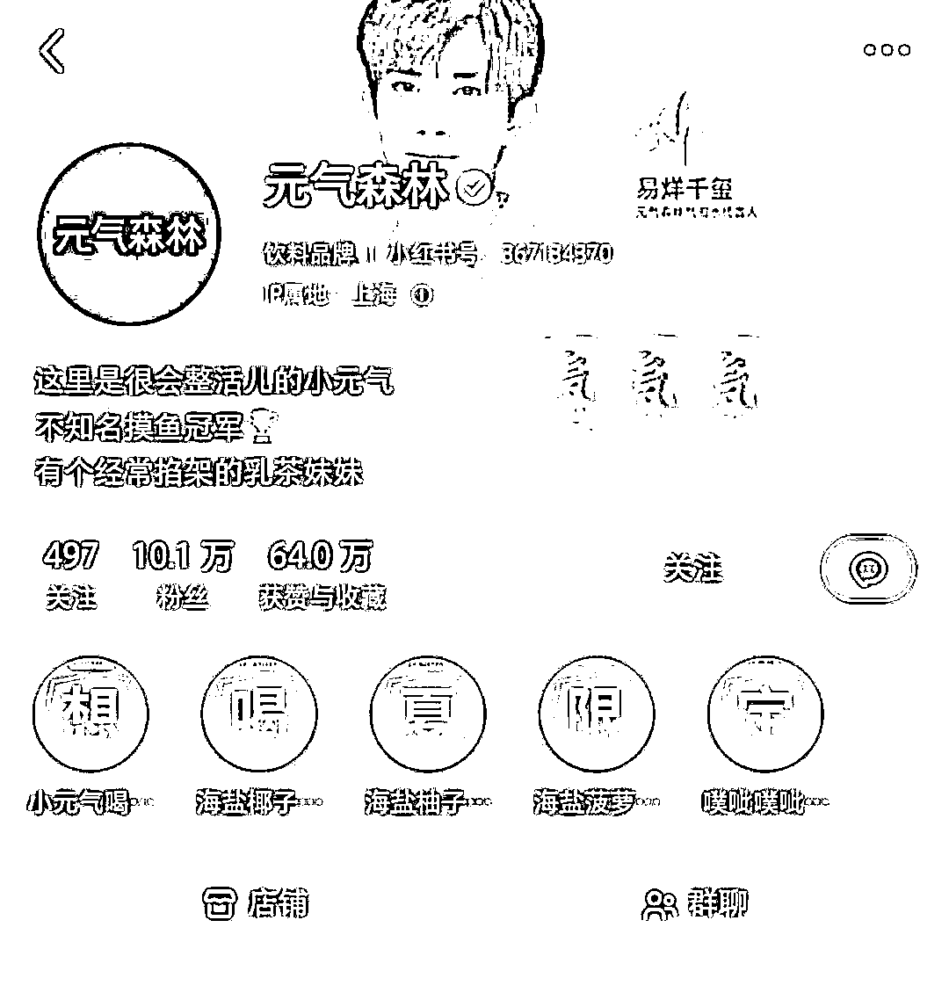

背景图

跟产品、人设、工作场景有关的都可以设置为背景图，增加自己账号人设的真实性。

置顶作品

置顶的内容往往是用来做转化用，对于「抖音图文电商」来说，可以置顶你最近主推的品的视频，或数据最好的视频。

P.S. 前期没有作品的时候，可以先不设置。

# 第三步：账号冷启动，达成千粉开橱窗

💡

章节概要前文提到，「抖音图文电商」的核心变现方式，是开通「商品橱窗」后，通过挂购物车、引导橱窗购买，或点击直播间成交。

但开通「商品橱窗」是有限制的，按照官方规则，开通「商品橱窗」的必要条件有：公开发布视频数 ≥ 10 条

抖音账号粉丝 ≥ 1000

账号已实名认证所以本章节，我们的核心任务是：

✅3.1 抖音带货权限解析：带大家了解商品橱窗是什么

✅3.2 如何快速实现抖音账号千粉：带大家了解如何快速达成千粉，拥有开通橱窗的资格

✅3.3 开通并使用橱窗：带大家一起开通橱窗，添加商品完成这一步，就解决了「抖音图文电商」冷启动的最大难题。

## 3.1 抖音带货权限解析 @徐立群 @抖音电商官方

「商品橱窗」即「抖音带货权限」，指用户在抖音平台获得的短视频挂车、达人推荐橱窗、直播间挂商品的权限，获得权限的用户可以在抖音售卖自家商品或带货。

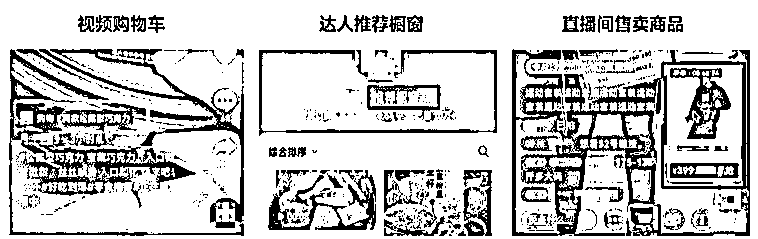

很多人分不清抖音号、商品橱窗、抖音小店的区别，这里一次性给大家梳理清楚。

① 自己有货源，卖自己的货，你需要：

一个开通商品橱窗的抖音号一个交了产品对应类目保证金的抖音小店

② 自己不碰货，帮别人卖货，你需要：

一个开通商品橱窗的抖音号，然后从别人的抖音小店挂商品链接去卖就行了。

所以开通「商品橱窗」，对于抖音带货来说，可以说是必要条件。

按照官方规则，开通「商品橱窗」的必要条件有：公开发布视频数 ≥ 10 条

抖音账号粉丝 ≥ 1000

账号已实名认证其中，前两条要求是需要我们努力达成的，尤其是「抖音账号粉丝 ≥ 1000」。因为一般在达成千粉的过程中，视频数自然也就 ≥ 10 条了。

所以下文我们主要来说，「抖音账号粉丝 ≥ 1000」如何达成。

一般来说，建议粉丝涨到 1000 粉丝以上就可以，想稳一点，粉丝可以多涨一些，可以到 5000 左右，后期全靠自然流量涨粉，不需要额外做投放抖加等动作。

内容来源：《万字长文：抖音直播带货入门保姆级手册 》1.0

## 3.2 如何快速实现抖音账号千粉 @文林 @唐明杰 @九月

### 3.2.1 前置动作：定目标人群

新账号先通过电脑端，开通查看视频数据功能，网址：「抖音创作者服务中心」；

1.

正常发布视频，开始小额投放抖加，给账号快速打上创作者标签；

2.

投放金额：每条视频投放 20-30 元，投放 3-4 条作品；

3.投放设置：性别、年龄、对标账号、粉丝量，对标账号选对标达人即可，达人数量 5-10 人。

这样操作一轮下来，账号新发布的视频，大概率就可以推送给精准目标人群了。

### 3.2.2 方式一：Dou+ 快速涨粉

持续发作品，遇到数据表现比较好的视频（播放量、点赞率等），投达人相似涨粉，投产比在 1：1（即一个粉丝的成本在一块钱以下）情况下，立马追投。

建议粉丝投到 1000 粉丝以上就可以。

如果想更快速完成账号启动，可以根据预算继续投放，到 5000 粉就行。

总结一下，遇到好的投产比应该立马完成冷启动，时间就是金钱。

如果投产比太低，出现一个粉丝 2 块多的情况，看自己接受范围，花费太高了就停掉抖加投放，做法是将作品私密后再公布，会自动停止投放抖加。

内容来源：《抖音如何快速涨到 1000 粉？》《抖音短视频蓝海带货，月利润 2W》

### 3.2.3 方式二：直播间挂榜涨粉

挂榜涨粉的方式是专门针对抖音直播的，只要刷礼物上榜了，就会有人点关注。部分主播也会主动引导用户给榜单上的账号加关注。

需要注意的是，这里的直播间挂榜，不是去大的直播间，而是去那些几百人的小直播间，刷一两块的礼物就可以到达榜一，可以提前把头像换成「在线客服」「xx 助理」来蹭流量、蹭粉丝。

内容来源：《抖音如何快速涨到 1000 粉？》《抖音短视频蓝海带货，月利润 2W》

### 3.2.4 方式三：外部互粉互赞群

通过添加抖音互粉互赞的群来涨粉，可以在 QQ 中搜索「抖音互关」「互赞」等关键词来加群。对于起步阶段的账号，利用社群发动更多的人第一时间观看视频，并完成转发、点赞和评论，可以更好的推动作品进入初级流量池。

通过这种方式涨粉的前提是需要我们加入群聊人数足够多，且活跃度足够高的群聊。

内容来源：《抖音如何快速涨到 1000 粉？》《抖音短视频蓝海带货，月利润 2W》

### 3.2.5 方式四：蹭热点涨粉

通过和热门新闻、热门榜单音乐、热门梗、热门道具、热门视频合拍，蹭热点流量来迅速涨粉。

比如，某部电视剧和综艺很火，可以通过简单的二次剪辑或者合拍来蹭热点，不过需要注意版权的问题。

内容来源：《抖音如何快速涨到 1000 粉？》《抖音短视频蓝海带货，月利润 2W》

### 3.2.6 方式五：相似人群不同赛道起号 @九月

这个方法适合已经非常熟悉中医赛道的朋友。

如果你已经确定自己的定位，可以看看对应的用户画像，选择人群相似的其他小赛道先起号，带货流量也是很好的。

比如中医号相似人群赛道推荐：佛学号、国学号等等，具体需要自己测试。

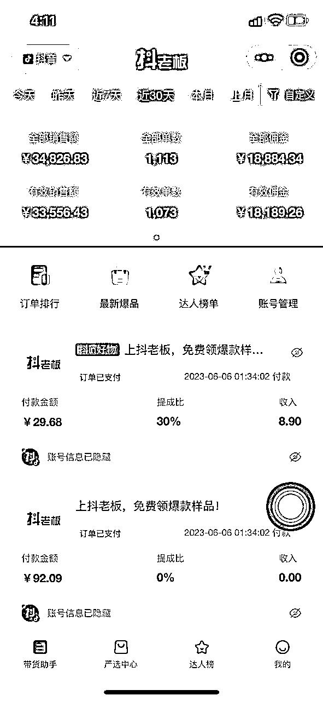

内容来源：《37 天 8w8 佣金，0-1 抖音图文矩阵带货突出重围》以上 5 种方式都可以帮助大家在前期快速涨粉，获得基础粉丝量。不断持续优化作品，直至精准粉丝 1000 以上，视为账号完成冷启动。

如果想稳一点，粉丝可以多涨一些，可以到 5000 左右，后期全靠自然流量涨粉，不需要额外做投放抖加等动作。

## 3.3 开通橱窗并使用

### 3.3.1 开通商品橱窗

达成千粉后，如何开通「商品橱窗」？

打开抖音 APP，选择“我”-右上角“三横杠”-抖音创作者中心-电商带货，就能跳转到「商品橱窗」的开通页面：

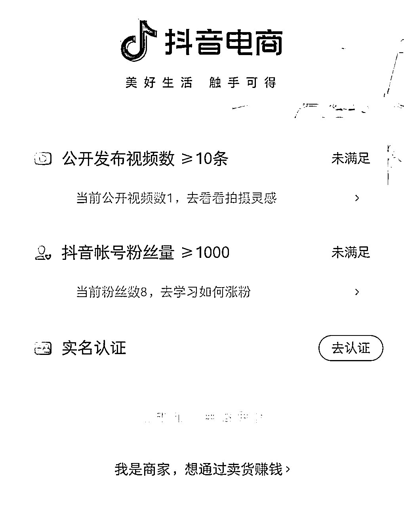

以前开通橱窗时，需要缴纳 500 元保证金，现在改为完成 100 单以上销售，再补交 500 元保证金即可。

满足上述条件，点击「立即加入电商带货」，就可以申请开通橱窗。

权限申请时，可以根据自己的实际情况，选择成为「带货达人」或成为「小店卖家」。

带货达人：

适合自己无货源未开店，帮其他商家带货的用户，对于下场「抖音图文电商」项目的大家来说，基本选这个就可以了。

下一步会让大家选择收款账户，这里主要是为了方便大家结算佣金，佣金会打到对应收款账户中。

如何确认是否开通成功？

返回抖音首页，点击「我」-「商品橱窗」，如果页面提示“恭喜您-已经成功完成电商达人带货权限申请，可以前去选品广场添加商品推广了”，说明已经开通成功。

如提示“推广商品需开通带货权限申请，申请成功即可成为带货达人”，则说明未完成开通，需要根据提示去完善账户信息。

商品橱窗开通成功后，我们可以到选品广场选择精选联盟产品，添加到橱窗进行带货，并且可以查询到订单金额等数据。

开通「商品橱窗」后，：

粉丝数低于 1000 的账号，每周限制发布 1 条带购物车视频；粉丝数在 1000-3000 的账号，每天限制发布 2 条带购物车视频；

粉丝数在 3000-10000 的账号，每天限制发布 5 条带购物车视频；粉丝数在 10000 及以上的账号，每天限制发布 10 条带购物车视频。

### 3.3.2 添加商品 @小马哥 @抖音电商官方

常规的商品添加，大家可以打开👉抖音精选联盟·达人版，浏览或搜索自己的目标商品，添加到橱窗即可：

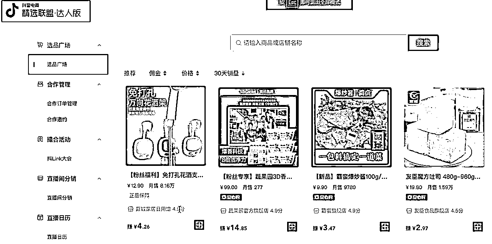

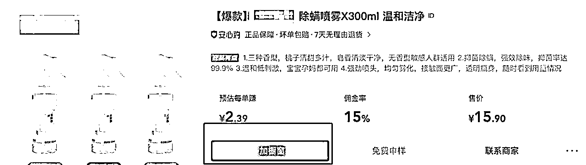

添加成功后，我们就能在后台的「橱窗商品管理」中，看到添加的产品：

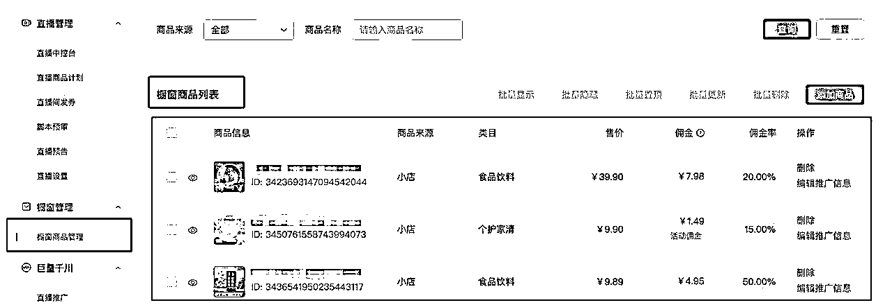

另一种情况，如果我们直接跟商家对接，商家会给我们商品链接。

遇到商家给的商品链接，如果打开后是面向 C 端的购物链接，很多人就不知道如何添加到自己的橱窗。

这时候，我们需要进入巨量百应的后台：

（1）手机端复制商家给到的链接后，进入商品橱窗-选品广场-右上角链接，点击后，粘贴商品链接，点击查找，然后加入橱窗中即可

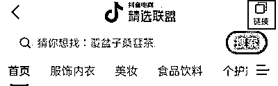

（2）电脑端

电脑端的入口和手机端不太一样，路径是：直播管理-橱窗管理-橱窗商品管理巨量百应电脑端入口：https://buyin.jinritemai.com/dashboard

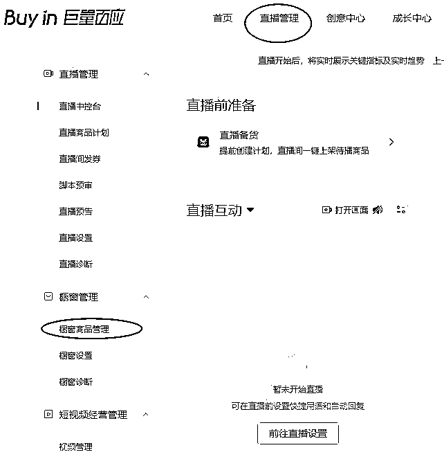

打开后，在商品管理中有个添加商品，将链接粘贴进去就可以添加上商品：

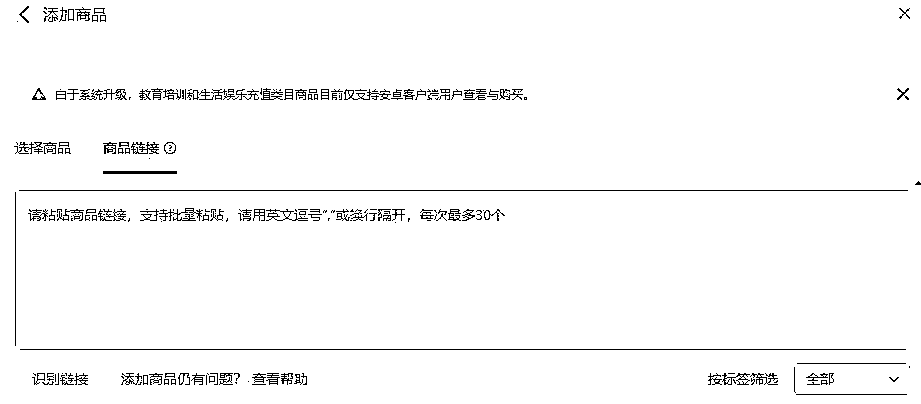

内容来源：《抖音图文带货中的细节操作》

### 3.3.3 橱窗置顶商品 @小马哥

在电脑端的直播管理-橱窗管理-橱窗商品管理中，找到需要置顶的商品，右侧会有置顶的选项，点击就可以进行置顶；手机端操作是，进入商品橱窗-橱窗管理，拉到橱窗商品的地方，有同款以及管理的字样，点击管理，勾选商品，点击置顶即可：

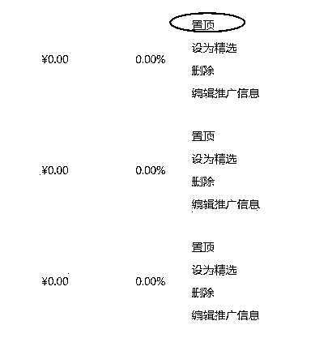

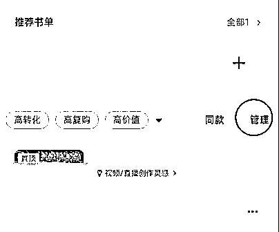

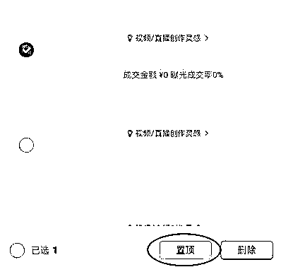

内容来源：《抖音图文带货中的细节操作》

# 第四步：积累选品与素材

💡

章节概要

本章节的动作，可以与「第三步：账号冷启动，达成千粉开橱窗」同步进行。

选品，向来是电商项目的核心。

抖音现在的选品类型已经很丰富了，如果能够结合「抖音图文电商」的图文特点，找到需求量大、竞争小的产品，将在带货领域大大提高竞争力，爆单的几率也会高很多。

如果你是选品新手，建议先了解选品的核心逻辑与原则👇

✅4.1 选品的核心逻辑

✅4.2 选品原则

如果你想要获得更落地的选品方法与步骤，可以参考👇✅4.3 选品方法，其中包含了 6 种更适合「抖音图文电商」的选品方法

✅4.4 更多通用选品法与参考资料，其中包含了「选品特训」手册与抖音选品参考类目

当然，品不是选出来就好，我们需要通过不断测试，淘汰不合适的商品👇

✅4.5 测品选品也有一些注意事项，大家可以避免踩坑👇

✅4.6 选品避坑

除了这些选品方法以外，你还可以通过切入目前抖音上「相对蓝海」的类目，进行差异化竞争，压力小，容易出正反馈。

对于做带货的玩家来说，选品是一个非常长期主义的事，需要不断选品，不断培养、打磨自己对于利基市场的敏锐度，直到找到一个合适的品。

## 4.1 选品的核心逻辑 @钱劲 @唐明杰

在抖音上选品的底层逻辑是怎样的？其实选品的底层是选择需求，选需求的底层是选择目标用户。

所以在抖音选品上最底层的逻辑是：

先确定一个自己想要做的目标用户人群

找这个目标用户人群他们的需求然后细分类目，根据各种方法找到匹配高的产品。

我们在选品的时候要根据市场的需求供应来选品，比如春夏秋冬天气适合卖什么？节日什么东西有需求？也可以看最近卖的好的品，有没有与他相关的产品可以卖？

很多人在家里摆绿植，天气炎热，绿植容易黄，是不是可以想到绿植营养液之类的产品，这样我们可以去深度挖掘一下。

差异化找细分市场是指什么呢？选择不一样的细分风格和细分市场的产品，可以更好避免同质化和激烈竞争。

比如，我们可以选择通过近期爆款、应季新款，形成差异化，新品爆款对平台来说也是较新的视频，这样更容易获得流量。

内容来源：《抖音图文带货非常好做，小白，想做副业的朋友可以冲》《抖音蓝海市场细分用户人群，优化选品，轮播图童装单月利润 2W+》

## 4.2 选品原则 @文林

以下「选品原则」中的数据来源于 2022 年 3 月，数据可能有过时，但是选品原则万变不离其宗，大家可以参考思路。

如果想要获得更落地的选品方法与步骤，可以参考👇

✅4.3 选品方法，其中包含了 6 种更适合「抖音图文电商」的选品方法

✅4.4 更多通用选品法与参考资料，其中包含了「选品特训」手册与抖音选品参考类目 4.2.1 原则一：先选目标人群

选品的第一步是选人，先选你的品对应的目标人群。

那如何挑选适合自己，又适合在抖音上卖货出单的目标人群呢？这里有 3 个经验，分享给大家。

经验 1：从自己的爱好出发，由单一个体投射出目标人群，然后做减法

比如我，有个爱好是喜欢绿植，爱养花养草，后面验证这个人群出单还不错。

那我是怎么选到这个人群的。我还原一下这个过程。

从自身爱好出发，找需求

那时我刚做抖音电商不久，当时在选品时，其实也是想了很久，不知道选什么品。最后我采取了一个方法，就是先从我自身爱好出发，喜欢看书、喜欢养点小绿植、喜欢听民谣，当然也喜欢吃美食、喜欢打乒乓球。

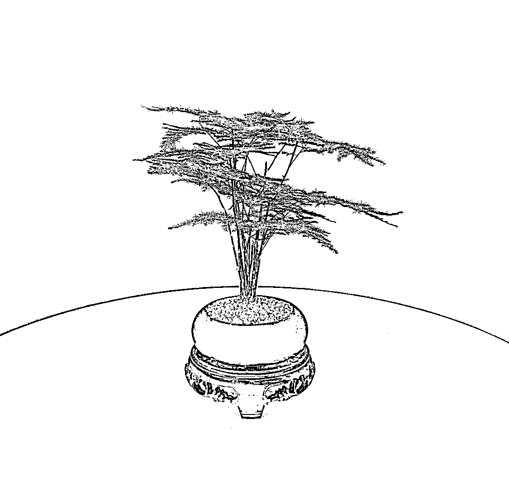

做减法但是，5 个需求太多了，于是我开始做减法，事实求是的审视我在这 5 个需求里的实际掌握情况。

书、绿植、美食、乒乓球这 4 个适合我在抖音上做，民谣音乐这个因为自己唱歌跑调做不来。

分析市场的供需关系和竞争对手的情况确定自己的优势过后，我继续做减法。这个时候我采取一种方法：分析市场的供需关系和竞争对手的情况。好的战略选择是，你找到了一件打得过的事，上去打。

书和美食这两个类目，市场需求大，但市场的竞争也比较大，很多做书单的，也很多做美食，内容生产也相对很成熟。

这个时候，我一个刚入行的新手，估计很难在短视频打的过这些竞争对手，所以书和美食，就被我排除了。

剩下乒乓和绿植，乒乓的需求挺大的，但我查了一下在抖音上，做的号的乒乓账号变现方式都是广告为主，然后做乒乓带货很少，哪怕有带货的，但他们的带货账号销量很低的。

头部乒乓产品都是月销售额才几千元，头部乒乓带货变现的都这么少，那么对于新入局的新手来讲，那么就更难赚到钱了，所以乒乓因为天花板太低，就被我排除了。

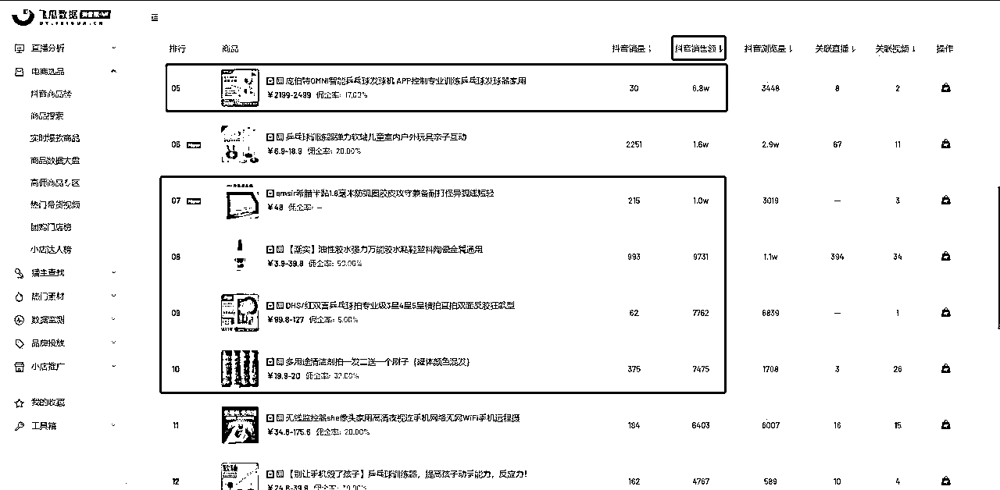

查看大盘数据剩下最后一个绿植，我紧接的做法不是因为剩下绿植这个选项，我就脑袋一拍就做绿植这个品了。

而是我接着去看绿植这个类目的大盘，我通过飞瓜（其他工具比如抖查查、蝉妈妈登也可以）去查绿植这个类目的大盘数据。

发现大盘数据还不错，记得当时 7 月的绿植这个在抖音上销售额大盘就已经达到了 2 亿了！

月销售额 2 个亿的这个蛋糕对于新人，还有初创团队来说算是不错的了，而且当时看到的数据，每月绿植的涨幅还不错，近 3 个月月涨幅在 20%，也就是说绿植这个类目在抖音上是越做越大的。

现在是 2 个亿，以后可能每月 5 个亿了，等我 1 月 28 号查到的数据，绿植类目已经由 2 个亿上升到 3.19 亿了。

到这里，我就敲定下来目标客群：18-35 岁，喜欢养花养草养绿植的人群。

经验二：从自己的熟悉的人群、擅长的人群出发有些朋友自己不是宝妈，但在母婴行业做了很久，很熟悉宝妈这群人的需求和痛点，那么也可从这个入手。

因为熟悉和擅长的人群，自己在选品时，能够更好的把握这些人的需求，选到合适的品，这样成功率也会更高。

所以想想自己熟悉哪块，擅长哪块，然后由这块去找到自己熟悉和擅长的人群着手。

经验三：蓝海人群

如果上面两种方法，都没找到适合自己的人群怎么办？那么最后一种方法，就是选蓝海人群。

什么是蓝海人群，也就是竞争对手很少的人群。

比如女性中老年人群、超肥胖女性人群、汽车维修师傅、电工电焊人群、装修工人人群，园林人群、农业种植人群等等。

这种人群竞争少，竞争对手生产的视频也很粗糙。那么对咱们来说，就是如果你做的好，就是一种降维打击，成功概率也大。

像我之前选的人群--装修师傅，当时选了一个吊顶打钉神器，这个品 7 天卖了 42 万，利润率 20% 多。

这里有个注意的点是：不要为了蓝海而蓝海，有些人群特别蓝海的话，就千万不要碰。

因为抖音跟淘宝不一样，淘宝上用户购买商品时是用户先搜索，然后再买。

而抖音是逛街式消费，没有带着目的的，用户们是刷刷视频刷到才买的，而视频是来自抖音算法推荐的，用户每天刷视频的时间是有限的。

有限的时间内，抖音相对来说还是会给受众广的视频流量更多。

那么我们应该找什么样的领域作为我们去深耕的蓝海呢？这里建议：

最好是这个人群在抖音对应的品月销售额 5000 万以上

哪怕再蓝海也不能低于 1000 万的月销售额标准，要不然会很难做起来。

内容来源：《通用能力｜怎么定位和选品》

### 4.2.2 原则二：先定类目再选品

目标人群定下来后，接下来会遇到一个问题，就是目标人群需求挺多的，吃喝玩乐都有，那么接下来最关键的是选择类目，先定类目再选品。

选择大于努力，特别在抖音选品里面，有时一个选择就决定了你一年赚几千万还是一年赚几千。这个是我踩了损失百万的坑，得到的经验。

最开始做抖音时，我当时想的是选择一个小众的蓝海类目来做，特别小众的一个类目，结果做了两个月发现，身边朋友选其他类目时，有的才做两个月就已经月赚 10 万，而我还没破万，最关键的是的时间也浪费了前期最红利的 2 个月。

那怎么确定类目呢？具体的步骤参考以下：

根据抖音大盘数据选一级类目步入正题：当我们选择类目的时候，千万不要脑瓜子一拍就去做选择，我们一定要有数据作为我们的决策支撑。

最起码要了解抖音上到底总共多少个类目，各自目前类目在抖音上的销售额怎样？前景怎样？这些数据是可以通过飞瓜数据查到的。

等下后面我放下我给大家我通过飞瓜数据查到的抖音 9 月一级类目的月销额数据。

先看大盘，再选一级类目，大盘的天花板就决定了赚钱的天花板。

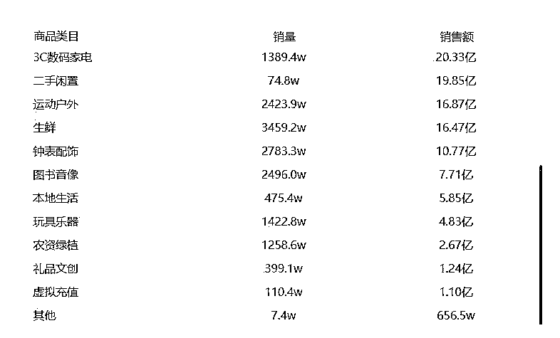

选好一级类目后再细分二级、三级类目

选好一级类目后，发现一级类目，需要再细化到二级类目、三级类目，这样再做抖音账号、做内容时才会更加垂直、更加精准，竞争对手也更少一些，更容易获得流量。

二级和三级类目太多，我这个举个服装的例子给大家做个参考。

一级类目【服饰内衣】细分——二级类目【女装】再细分——三级类目【中老年女装】、【大码女装】。而【大码女装】月销

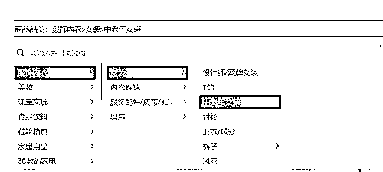

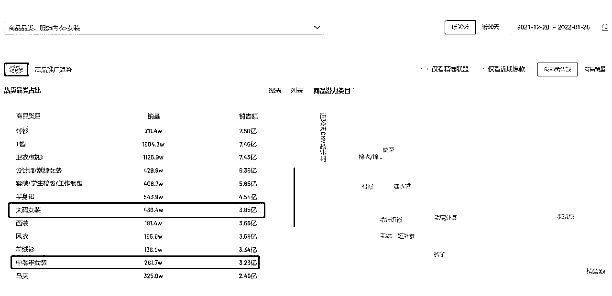

### 4.2.3 原则三：根据市场供需关系选品

如何根据市场供需关系来选择最合适的品，简单来说就是：需求大

竞争对手少竞争对手弱

这三个点，无论是单独去找，还是组合着去使用，都会有着不同的市场和竞争难度。

而怎么快速找到具备上述条件的选品，有两种方法：避开高竞争环境，找市场里的蓝海类目

喝汤也能很舒服，选红海类目里面的蓝海子类目下面我给大家分享下，我是怎么结合使用这两个方法找到蓝海类目的经验，并且我还为大家准备了几个我觉得机会比较大，竞争力度也没那么大的类目合集。

经验一：选红海类目里面的蓝海子类目

比如女装是红海竞争激烈很大，那么选择女装中的蓝海子类目——【中老年女装】、【大码女装】。

中老年女装一个月在抖音上也能卖出 3 个多亿，而且退货率才百分之十几。

而年轻的女装，在抖音上一个月 100 多个亿，但退货率 50%，竞争的激烈度也比中老年高 100 倍。

经验二：避开高竞争环境，找市场里的蓝海类目

怎么判断这个品是否是蓝海，竞争对手多少和强弱呢？

有一个简单的方法，你去竞争对手的视频和直播间，看对手的视频精致还是粗糙，那种制作很粗糙的那种竞争少，大概率是蓝海类目蓝海产品。

比如卖服装，有个直播间直接上雪山直播卖羽绒服，你看这个多卷：

而中老年女装竞争则是这样的：

蓝海类目推荐（抖音可以做的类目很多，这里只是简单展示部分）：

蓝海类目推荐类目

人群

推荐指数推荐理由

中老年女装

中老年女性

5 星

适合人群广；如果有熟悉女装和了解中老年女性用户的匹配度最高大码女装

肥胖女性

4 星

女性最佳；有熟悉女装和了解中老年女性用户的匹配度最高

中老年大码女装胖中老年女性

5 星

适合人群广；有熟悉女装和了解中老年女性用户的匹配度最高

儿童汉服

宝妈人群 4 星

适合人群广；了解宝妈的、有汉服相关行业经验的最佳

大码男装

肥胖男性

3 星

适合人群广；服装和了解男性用户的最佳

绿植盆栽

年轻用户

5 星

适合人群广；喜欢绿植和有绿植供应链的最佳 3C 数码配件

大部分人群

4 星

适合人群广

宠物玩具等宠物周边养宠物人群

4 星

适合人群广；喜欢宠物、养宠物人群最佳

渔具

钓鱼人群 4 星

喜欢钓鱼的人群最佳、渔具从业者最佳

户外/登山/野营/旅行用品

户外人群

5 星

喜欢户外的人群最佳

时尚饰品

女性

4 星

对时尚饰品了解的最佳二次元产品（比如二次元口罩）

二次元人群

5 星

对二次元喜欢了解的最佳母婴玩具

宝妈人群

4 星

人群广；宝妈人群和了解宝妈用户的最佳

美食喜欢美食人群

5 星

适合人群广；特别适合喜欢吃零食、会做菜、会拍摄的人

做菜调料

喜欢做菜的人 5 星

适合人群广；特别适合会做菜、会拍摄的人

## 4.3 选品方法

对于「抖音图文电商」项目来说，平台有一些自己的喜好与倾向。

落在选品这一点上，官方给出的建议是：

类型：商品高颜值、功能/形状/外观新奇特、新品/趋势品/热点品//应季时令品、价格优惠福利品卖点：商品在促销、限时抢购、有专属福利

举例：

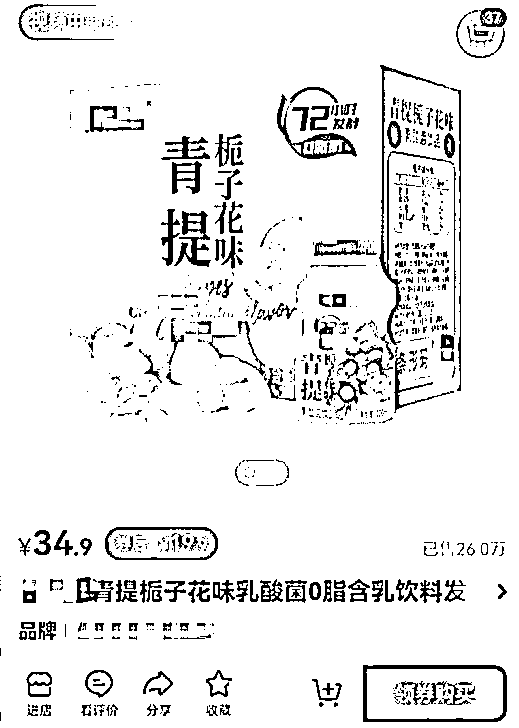

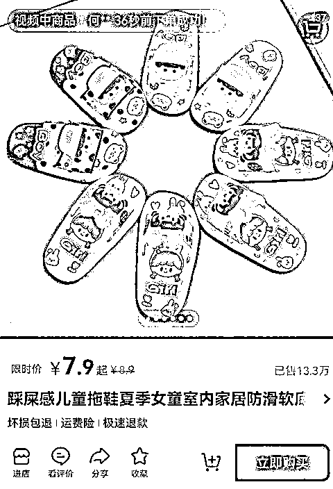

大家在选品时，可以注意一下上述类型与卖点。

### 4.3.1 方法一：观察粉丝画像，用考古加寻找对标 @刘逍遥

① 观察自己账号粉丝的人群属性

什么是粉丝的人群属性呢？比如粉丝男女比例、年龄占比。

你发作品之后，抖音会给你的账号打上标签，而你的粉丝，大几率会决定你后续发视频的推送人群画像。这也就是为什么很多账号一转型，立马就没流量的原因。

那么怎么看自己账号的粉丝人群属性呢？

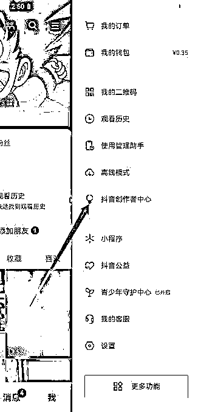

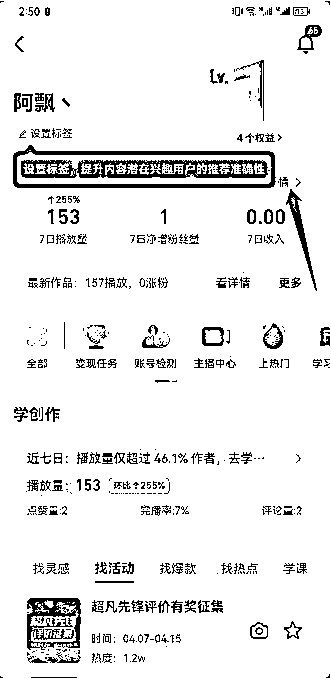

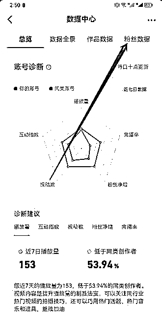

② 从自己账号粉丝画像入手，寻找对标账号当我们足够了解自己的粉丝属性之后（我一般只会着重注意自己账号粉丝的男女比例，年龄区间），寻找和自己粉丝画像差不多的账号，对标粉丝越少越好，并且爆过单的最近的账号最好，它的选品与素材我们就能用来参考。

怎么找和自己粉丝画像一致的账号呢？我采用的是考古加，像官方的巨量百应也是可以做到的。

考古加：https://www.kaogujia.com 巨量百应：https://www.douyinec.com/

以常用的考古加为例。

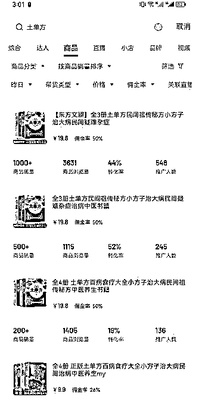

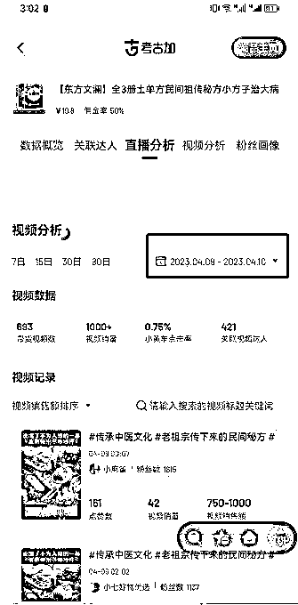

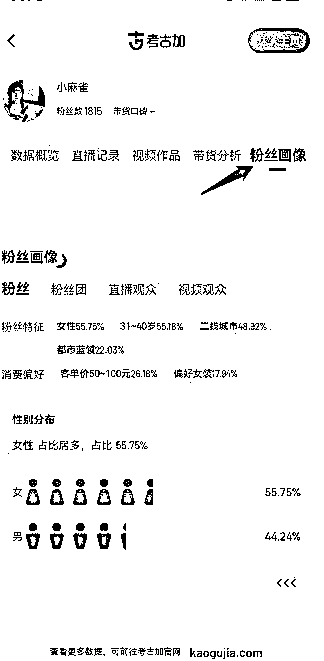

并且，考古加自带了关注功能，这样我们就不用再去抖音关注作者。省去了漫长的筛选过程，而且关注分组也会标记好，年龄和性别分布，这点是很方便的。

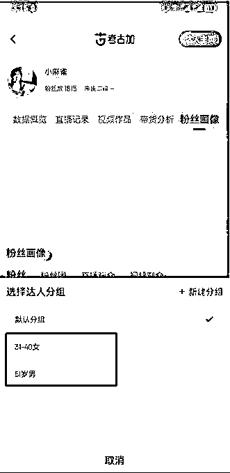

内容来源：《95 后打工人，副业做抖音中老年书单号，单月变现 5 万+的复盘》

### 4.3.2 方法二：巨量百应关键词+销量选品 @唐明杰

在电脑端打开巨量百应，点击精选联盟，进入选品广场，搜索框内搜索对应关键词，然后按销量排序：

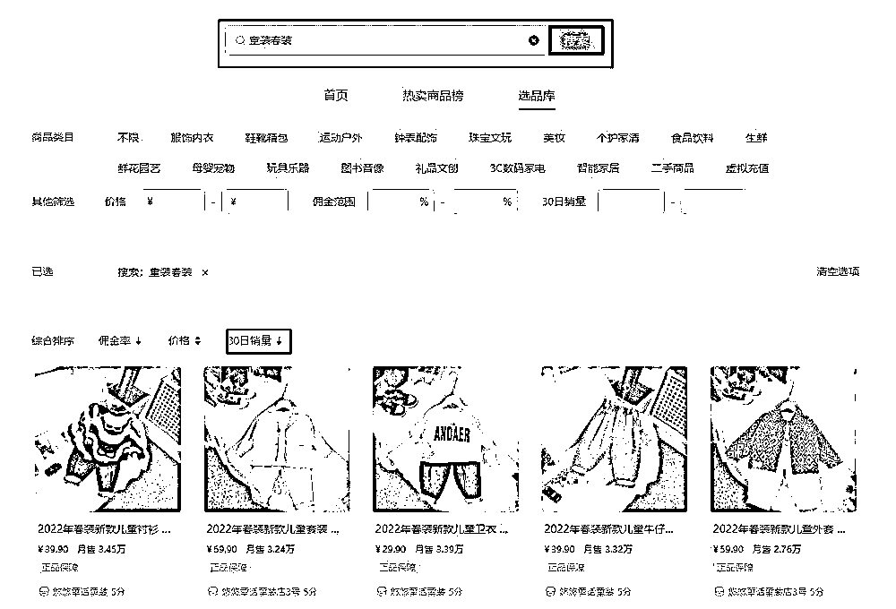

接着往下拉，找到合适佣金和价格的产品，比如：

点击进入分析产品，主要看佣金率、店铺评分、推广数据和用户评价几个维度：

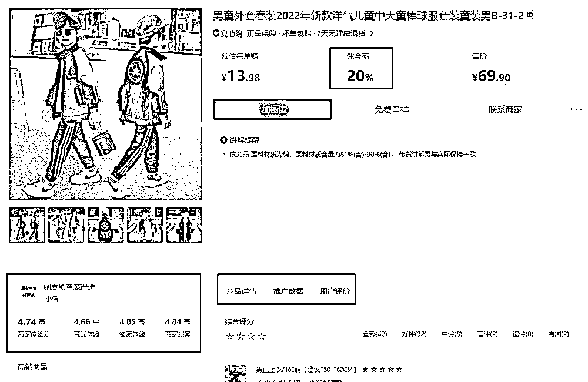

带货佣金率 15% 以上比较合适，体验分一般选择 4.5 及以上，其他三个维度不能太拉胯，这样账号的带货口碑分不会太低。

内容来源：《抖音蓝海市场细分用户人群，优化选品，轮播图童装单月利润 2W+》

### 4.3.3 方法三：考古加+精选联盟达人版 @郭晓文

打开抖音的第三方数据网站考古加：https://www.kaogujia.com

按照下图的方式，来筛选视频：

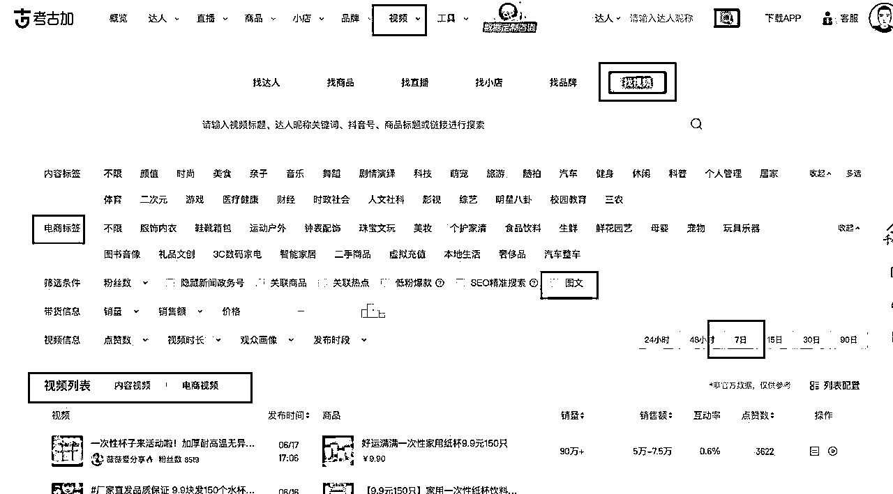

具体操作：

点击视频，进入筛选视频的界面（如上图所示）

筛选条件：勾选图文，目的是只看图文二创形式带货的内容视频信息：勾选 7 日，可以把 7 天内爆的图文都筛选出来

电商标签栏目：一个栏目一个栏目点过去，看除了服装类目外，是否还有其他类目适合用图文的形式带货以下图为例，类似服装这样的大类目（一级类目），你还可以筛出里面的小类目（二级类目）：

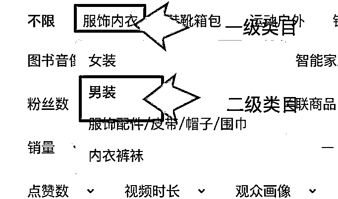

点击栏目后，在视频列表一览，内容视频和电商视频都看看。

内容视频，就是不挂小黄车的视频。在这里，你能找到很多只发电商内容，但是不挂车，引流到微信来变现的账号。

电商视频，就是挂小黄车的视频。在这里，你会看到很多直接用电商内容，直接挂车，在抖音内部变现的账号。

重复前面的操作，就能找到不同类目下面，分别用两种不同形式来变现的账号和他们带货的商品。

找到对标账号后，如何更全面的查看对标账号的各种数据呢？

这里要教大家一个官方的数据工具——巨量百应的用法：

巨量百应网址：https://www.douyinec.com/门槛：需要有一个可以挂橱窗的抖音号

所用插件：https://pan.baidu.com/s/1CSnqvqRefzhB0BLGTFa-Tg?pwd=2c3y，提取码 2c3y，来源 @水哥爱搞钱

具体操作如下列视频所示：如何通过抖音号查看对标账号详情.mov【在线播放】

掌握了上述步骤后，你就可以做到，找到对标账号，并能把对标账号的大部分动作都看清楚，同时解决选品难题。

内容来源：《两个搞钱技能，帮你看清图文二创赛道的全貌》

### 4.3.4 方法四：考古加+精选联盟商家版 @刘逍遥

在电脑端的考古加上方，有个工具栏，里面有爆品探测功能：

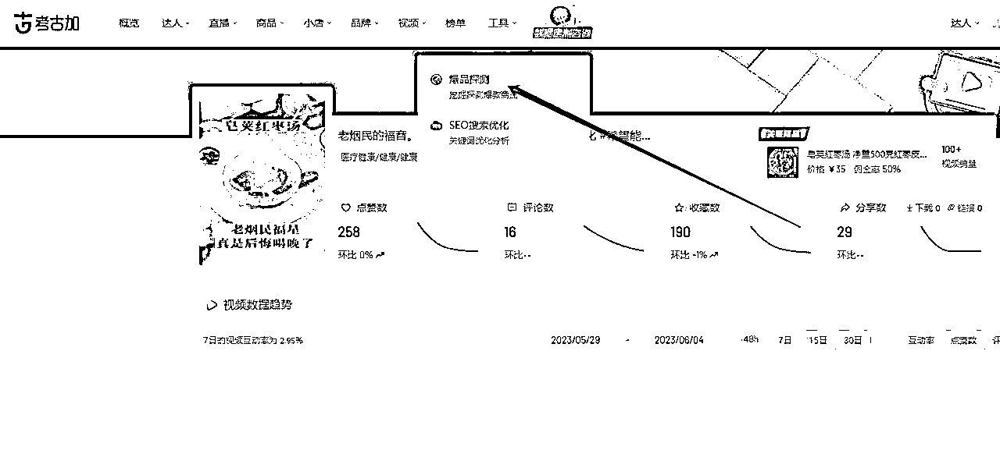

我们设置好筛选范围，时间选择越近越好，然后类型选择自己的赛道。比如我自己是图书赛道，我就选择图书，然后时间选择今天：

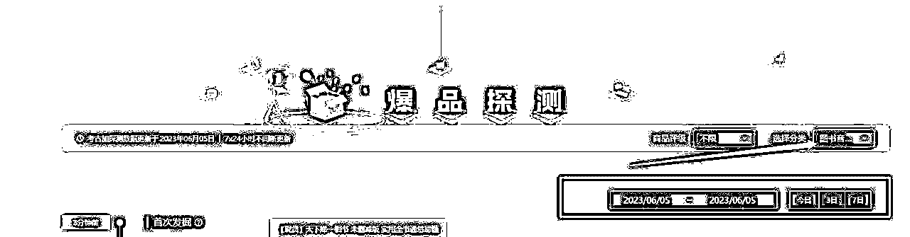

然后假如这个品是我这个赛道的，我也正好想去带这个品：

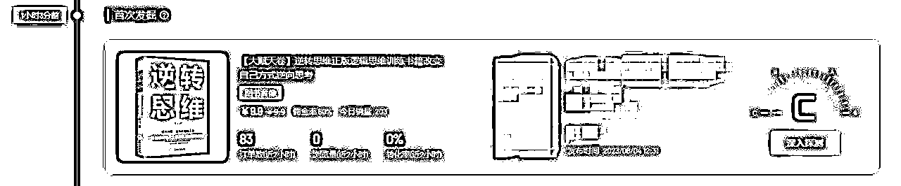

我们直接点击作者的头像，找到作者的抖音 ID，复制：

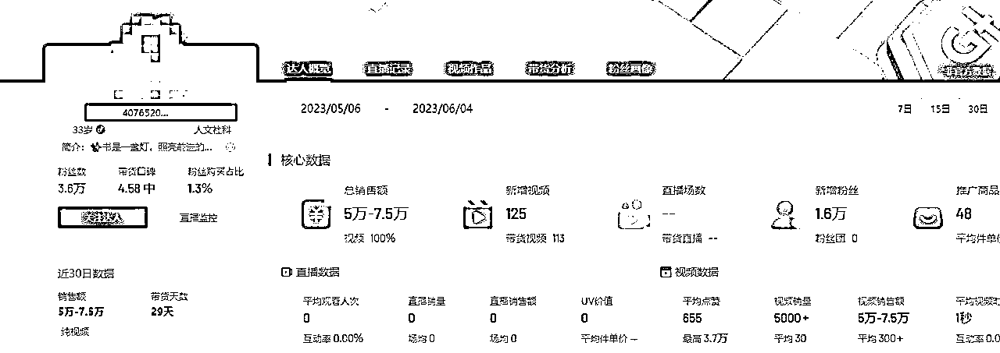

然后我们需要一个抖音小店的商家账号，现在抖音小店都是 0 押金入驻，只要有营业执照都是可以轻松入驻的，无论个体户还是企业都是可以的，实在没有营业执照的圈友，可以去某宝代办一个，大概几十块钱搞定。

进入👉巨量百应商家版（即精选联盟商家版）页面之后，我们选择找合作：

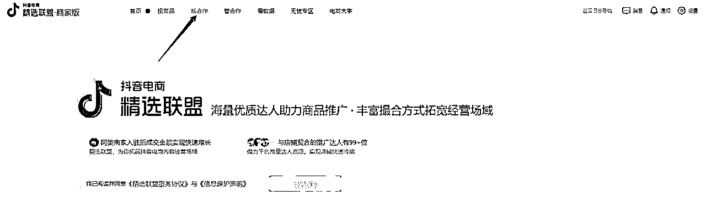

然后把我们刚才复制的作者抖音 ID，粘贴在这个地方，就可以找到这个达人：

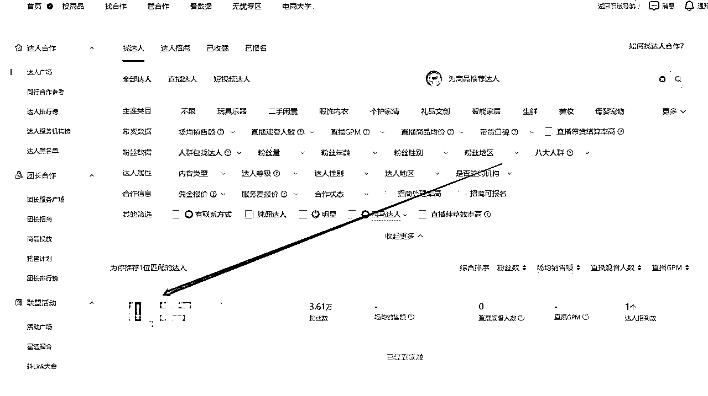

我们进入达人主页，还能看视频数据：

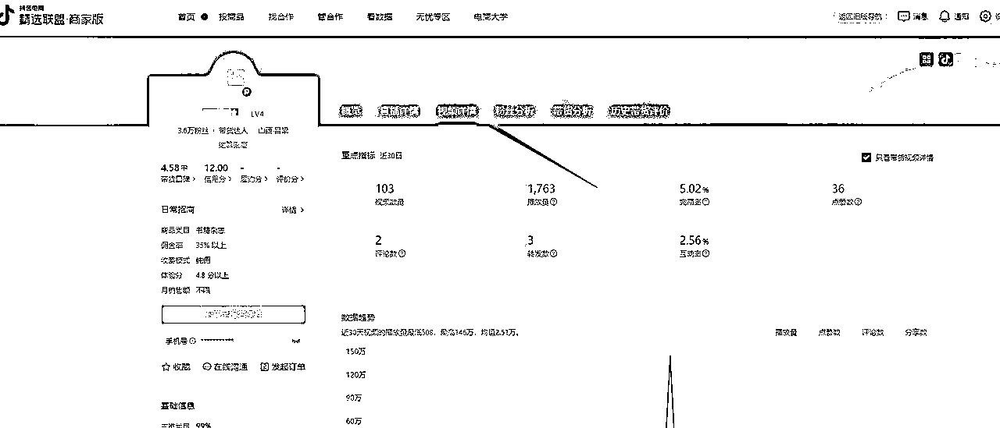

这样我们就可以看到某个视频具体的 GMV 和播放量。官方的数据目前是最准的，测试结果也显示，数据是基本无误的：

我们就可以把两个软件结合起来，找到最精准的爆款视频，与对应的图片素材。

内容来源：《单号日入 1000+，抖音图文带货玩法喂饭级教学》

### 4.3.5 方法五：通过商品橱窗里面的创意中心去找品 @钱劲

在抖音 APP-商品橱窗-创意中心，我们也能看到一些爆款视频，大家可以选择自己的类目，查看是否有心仪选品：

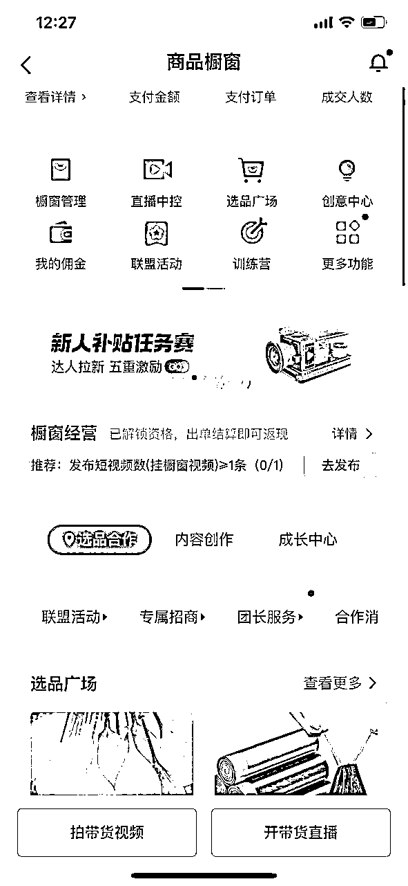

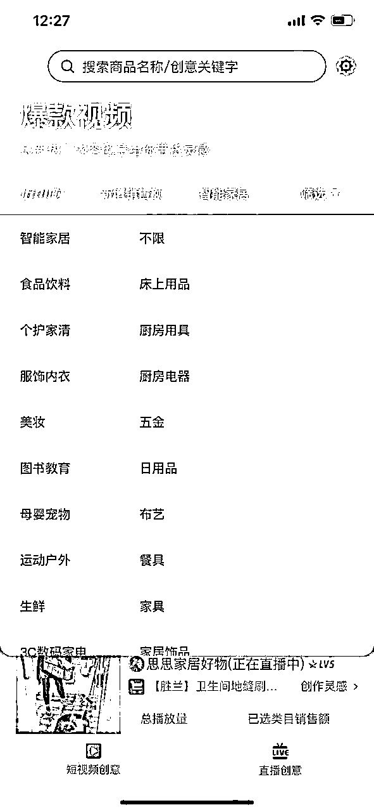

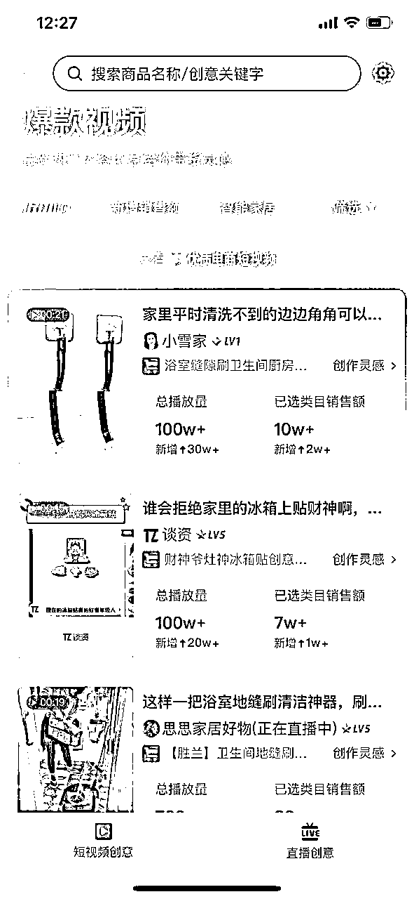

内容来源：《抖音图文带货非常好做，小白，想做副业的朋友可以冲》

### 4.3.6 方法六：选擅长的品类 @抖音电商官方

大家在选品时，也可以选择自己擅长的带货方向。

比如可以从爱好、特长、个人经历、资源等方面入手，分析自己的优势在哪里，要尽可能多地展现出自己的特点、强项，从而提升竞争力。

找爱好：能长期坚持、愿意向他人分享的兴趣、爱好。

找特长：特长、绝活、比别人擅长的地方。

找经历：个人的成长、工作、感情经历，故事能打动人。

找资源：比别人有优势的资源，如货品、场地、道具等。

内容来源：《抖音电商图文带货来啦！3 步走，把握新机遇》

## 4.4 更多通用选品法与参考资料

### 4.4.1 参考选品特训手册

参考 8 月航海中的「选品特训」手册：《8 月航海｜选品特训｜实战手册》

在手册的第一章，我们描绘了选品的基本概念与原则，你可以从中获得前辈总结的的选品原则与建议等。

在手册的第二章，我们给出了一些通用的选品方法论，比如蓝海选品、趋势选品、季节性选品等，你或许可以从中发现适合自己的选品思路。

从手册的第三大章节开始，我们给出了不同平台的具体选品方法，包括但不限于抖音、视频号、淘宝、小红书、跨境平台等，你可以从中了解到更多技巧，将不同方法迁移到「抖音图文电商」项目中～

### 4.4.2 参考图文带货热卖品 TOP10

近 90 天，抖音图文带货热卖品类 TOP10 如下：

三级品类名称

GMV 指数

饮料 5.82 亿

套装/学生校服/工作制服

5.48 亿

连衣裙

5.14 亿

普通膳食营养食品

4.30 亿

饼干/膨化

4.16 亿

方便速食/冷藏食品 3.90 亿

糕点/点心/面包

3.37 亿

纸品/湿巾

3.33 亿

裤子

3.00 亿

山核桃/坚果/炒货

2.34 亿

大家可以从中寻找思路，看看是否有自己擅长的选品方向。

### 4.4.3 参考蓝海选品类目

蓝海类目推荐（抖音可以做的类目很多，这里只是简单展示部分）：

蓝海类目推荐类目

人群

推荐指数

推荐理由中老年女装

中老年女性

5 星

适合人群广；如果有熟悉女装和了解中老年女性用户的匹配度最高

大码女装肥胖女性

4 星

女性最佳；有熟悉女装和了解中老年女性用户的匹配度最高

中老年大码女装

胖中老年女性 5 星

适合人群广；有熟悉女装和了解中老年女性用户的匹配度最高

儿童汉服

宝妈人群

4 星

适合人群广；了解宝妈的、有汉服相关行业经验的最佳

大码男装

肥胖男性

3 星

适合人群广；服装和了解男性用户的最佳绿植盆栽

年轻用户

5 星

适合人群广；喜欢绿植和有绿植供应链的最佳

3C 数码配件大部分人群

4 星

适合人群广

宠物玩具等宠物周边

养宠物人群 4 星

适合人群广；喜欢宠物、养宠物人群最佳

渔具

钓鱼人群

4 星

喜欢钓鱼的人群最佳、渔具从业者最佳

户外/登山/野营/旅行用品

户外人群

5 星

喜欢户外的人群最佳时尚饰品

女性

4 星

对时尚饰品了解的最佳

二次元产品（比如二次元口罩）

二次元人群

5 星

对二次元喜欢了解的最佳

母婴玩具宝妈人群

4 星

人群广；宝妈人群和了解宝妈用户的最佳

美食

喜欢美食人群 5 星

适合人群广；特别适合喜欢吃零食、会做菜、会拍摄的人

做菜调料

喜欢做菜的人

5 星

适合人群广；特别适合会做菜、会拍摄的人

## 4.5 测品 @九月

测品一般可以分为三种情况：出单、播放没过千不出单、过千播不出单。

出单了的品一直怼，直到这个素材这个品再也不出单了；过千播没出单，换素材持续测两天，再不出单就放弃；

没过千不出单，直接放弃；

如果测到爆品爆素材，直接所有的号都怼上去。

当你在犹豫测不测这个品的时候，其实你可以看看在做这个品的同行，也就是对标账号。

一般我们的同行都是矩阵账号，你可以通过考古加搜索这个品的名称，就会出来一堆带这个品的视频，每个视频都点开，看有没有风格相似的视频。

再把相似视频的账号主页点开，看他 IP 归属地在哪里：

视频归属地一样，很大概率证明这是同一个人的矩阵账号。

当一个品里视频中的矩阵账号越多，则证明这个品越爆，当你发现一个品矩阵账号超过 10 个，不要犹豫，用你所有的号去怼这个品。

同行是你最好的老师。

内容来源：《37 天 8w8 佣金，0-1 抖音图文矩阵带货突出重围》

## 4.6 选品避坑

很多时候，当我们花费了九牛二虎之力选出一个很合适的品，正准备在抖音大展身手的时候，结果一上传就被判为违规，商品下架，或者是压根就和我们的预想的不一样，一单都卖不出去。

这就是因为你选的品踩中了抖音选品的坑，每一个在做抖音电商的人都有自己的经验，这里把大家踩过的坑分享出来，希望大家能够避免。

避坑一：商家体验分 @唐明杰商家体验分会影响达人带货口碑分。如果商品太差有些客户可能会投诉带货达人或者给商品差评，会影响带货口碑分（特别是投诉，口碑分会掉得很厉害）。

带货口碑太低会影响带货转化率，所以首先要看下带货产品的商家体验分，具体有三个维度：商品体验，物流体验，商家服务。

如下图

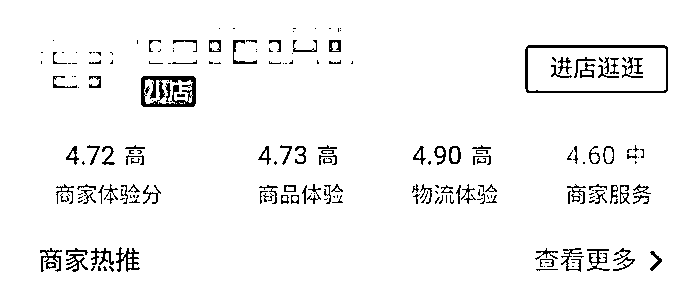

一般我会选择体验分 4.5 及以上，其他三个维度不能太拉胯，这样即使出现账号被投诉，带货口碑分掉得厉害的情况下，后面单量上来后口碑分也能较快涨回来。

内容来源：《抖音短视频蓝海带货，月利润 2W+》

避坑二：产品转化率和带货达人数 @唐明杰

这个是根据选品广场商品数据来算的。通常选择转化率高些而且销量比推广人数高的产品。这个时候要注意，有些产品在某天销量特别高，带货达人又少，这种情况可能是通过直播间带货成交的，所以这种产品也过掉。场景数据情况如下图：

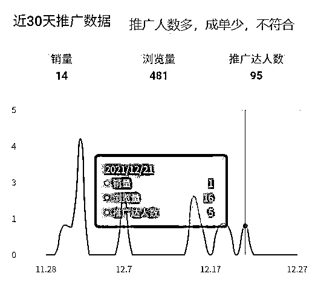

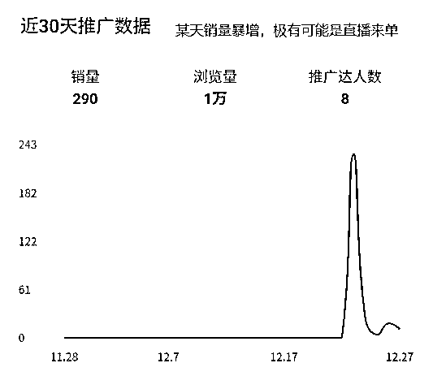

内容来源：《抖音短视频蓝海带货，月利润 2W+》

避坑三：带货佣金 @唐明杰带货佣金高通常售价也高，不好出单，佣金太低又没利润。所以要在这些中间做一个平衡点。大概 15%-30%比较合适。但是这个也要综合考虑。通常佣金低于 10 元我就不考虑了。

这个根据个人想法来，没有对错，有些人就是只做高佣金的，看个人运营和选择。

选定合适的产品后，可以进入其店铺看看其他产品，是否有合适推广的，这样会提高选品效率。在测试出好卖的产品，就可以把这个产品视频进行裂变，其他账号也跟着发，其他账号上大概率也能出单。后面易出单的产品也可以再反复发，提高效率。

这个过程相当于也在选款测款。

内容来源：《抖音短视频蓝海带货，月利润 2W+》

避坑四：选品要合法合规 @文林 10 月上了一个射钉器产品，因为不知道这品是平台不允许上的品，结果没过几天，直接导致了高权重的店铺被封了，损失巨大。所以千万留意平台规则，一些抖音限制的品千万不要上。

在抖音被限制的选品：电商创作者管理总则-抖音电商学习中心 （jinritemai.com）

内容来源：《抖音小店视频带货｜小航海学习手册》

避坑五：不选特别小众的品 @文林

6 月做了一个特别小众的品，花费了很多精力，结果产出很一般，才做了其他品类的 1/10，现在想来，完全就是在浪费时间，导致浪费了 2 个的红利时间。

这里特别小众的定义是整个类目的月销售 1000 万以下（非单一产品）。

内容来源：《抖音小店视频带货｜小航海学习手册》

避坑六：视频展示效果要好 @文林

当我们选出来很多品时，一定要再过一关，就是很多产品的销量数据有的是通过抖音直播成交的，但是直播间成交和短视频成交不一样。

带货视频的视觉效果一定要突出，比如美妆使用前使用后对比。

最好就是让用户看完，能立刻有「我也需要，我也想买」的冲动。

内容来源：《抖音小店视频带货｜小航海学习手册》

避坑七：不选质量差的产品 @文林

选品不要只顾着佣金的高低，同时也要注意产品和店铺的评分，店铺评分最好不要低于 4.5，产品好评高的。

这样不但视频转化率高，而且不会因为差评导致自己的视频账号带货评分降低，影响带货。

内容来源：《抖音小店视频带货｜小航海学习手册》

避坑八：选择供货稳定的店铺、佣金稳定不调整且可谈的店铺 @文林

曾经遇到过一个坑，就是视频爆单了，结果商家货源不足，导致很多单没有成交，所以要选择货物充足的店铺。

这一般会看这个店铺的历史销量，比如家居类目月销量 10 万以上货源是相对充足的，具体看品，有些小众类目月销 1000 也可以。

所以这里方法：大类目选该类目店铺前 10，小类目选该类目销量前 3 名来带。

如果有爆单了，尽量提前找商家说一下，问一下商家的库存情况。带的好的情况下，还可以找商家谈更高的佣金，让他给一个专属佣金的链接。

还遇到一个坑，就是带了货，结果第二天佣金商家下调佣金，能赚 50 一单的，变成 10 元一单。这个只能尽量找靠谱的店铺和商家。

内容来源：《抖音小店视频带货｜小航海学习手册》

# 第五步：制作图文视频

⚠️最近「抖音图文电商」的平台审核比较严格，账号会因为内容同质化高等原因被限流 7 天、30 天，概率大约有 30%-40%+。

为了降低被限流的概率，大家在制作图文视频时需要投入更多心思，例如寻找更多差异化的图文素材，并做好图片去重等步骤。

当然，即使你执行了以上动作，作品仍有可能被限流，但账号本就是消耗品，多起号、多发作品、多尝试，比纠结「我的作品为什么又被限流了」更有价值。

## 5.1 图片素材来源

素材基本有这几个来源：

寻找选品或对标账号的过程中，借鉴同行的素材，修改后变成自己的素材；找到选品后，去其他平台（如淘宝、小红书等）搜索同款，获取图片素材后，裁剪、套模板或抠图；

实拍，自己买来商品，或者找商家邮寄商品，获取实拍照片。a 分享一个抠图网站 @数藏强哥 2：

👉在线抠图软件

如果单纯的截图容易被判重复，这个网站无需登录，直接拖拽上传就能把图抠出来，效果不错。

内容来源：《抖音图文带货实操两个月，谈谈我作为小白走过的十个坑》

## 5.2 图文创作要素 @抖音电商官方

做好选品后，如何放大图文爆单的概率？核心是图片视觉。

文案可以借鉴爆款的进行修改，也可以直接参考同行。

### 5.2.1 图片要求

图片的基本要求是画质清晰，数量大于等于 2 张。

图片的横竖、大小要尽可能保持统一，避免重复、随意拼接；

为了更好地呈现商品，首张封面图片要精致、美观、整洁，背景不要杂乱，不要遮挡主体；其余的图片，可以从多个角度来展示商品特点、制作或使用过程。

关键点：

图片展示商品高颜值外观、好用功能图片构图合理、整洁清晰、主体明确

图片使用真实/高清拍图，对商品颜值、新奇特点充分体首图可使用艺术字对内容进行高度概括，突出重点

优秀案例示范：

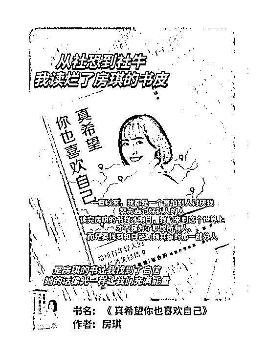

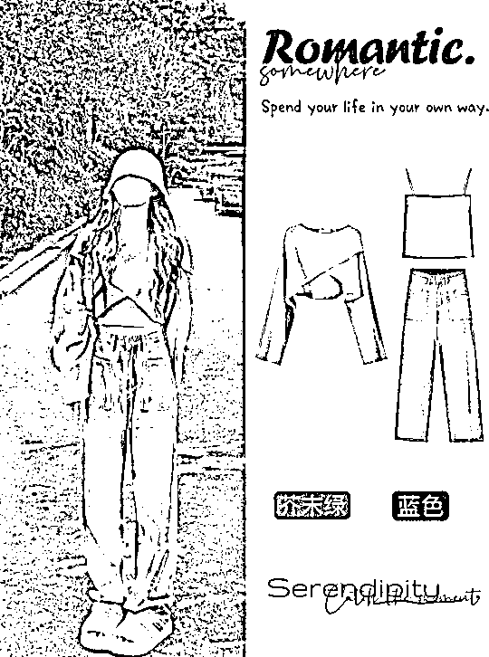

避坑点：

❌使用网图/大字报等非原创图片

❌商品拍摄不清晰/弯斜，无清晰商品主体呈现❌背景杂乱，图片整体美观被破坏

❌图片均为单一视角，同质化严重

反面教材：

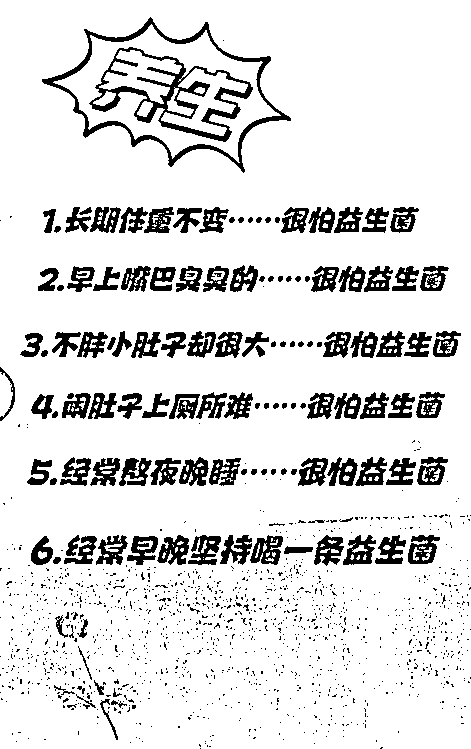

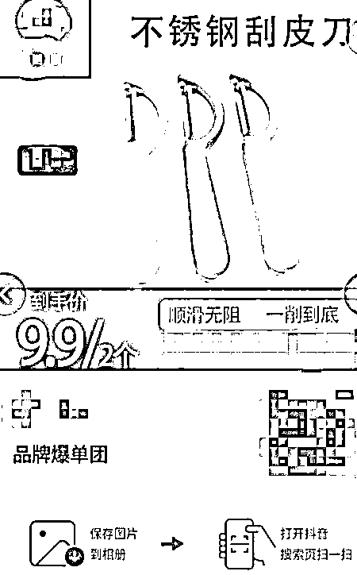

### 5.2.2 文案要求

文字的基本要求是排版清晰，突出价值。

给图片加字幕时，排版不要与原图有重叠、遮挡；

标题文案则要突出信息价值，以清晰的产品卖点或真实的使用感受打动用户。

关键点：

文字内容有用，与图片相关围绕商品特点、卖点、亮点介绍

反映真实测评、攻略分享、体验心得、生活经验

文字排版上条理清晰、段落分明优秀案例示范：

【真实测评】：房琪的新书让我从社恐变社牛。这本书看了好几遍啦，真是太喜欢房琪了，建议敏感脆弱、自卑社恐、内心没有力量的伙伴们都去读读它房琪的文字真的超级有力量！

【攻略分享】：柔甜美优雅的小姐姐看过来，杏色的裙子好温婉，搭配黑色开衩针织衫，显瘦百搭又气质，整套穿起来气质优雅温柔又甜美。

避坑点：

❌和图片无关，搞笑段子、情感鸡汤等猎奇内容

❌夸张介绍虚假说明，摘抄网络段子、广告文案、百度百科等内容❌刻意诋毁等

如果不知道用什么文案，可以参考同行的写法。

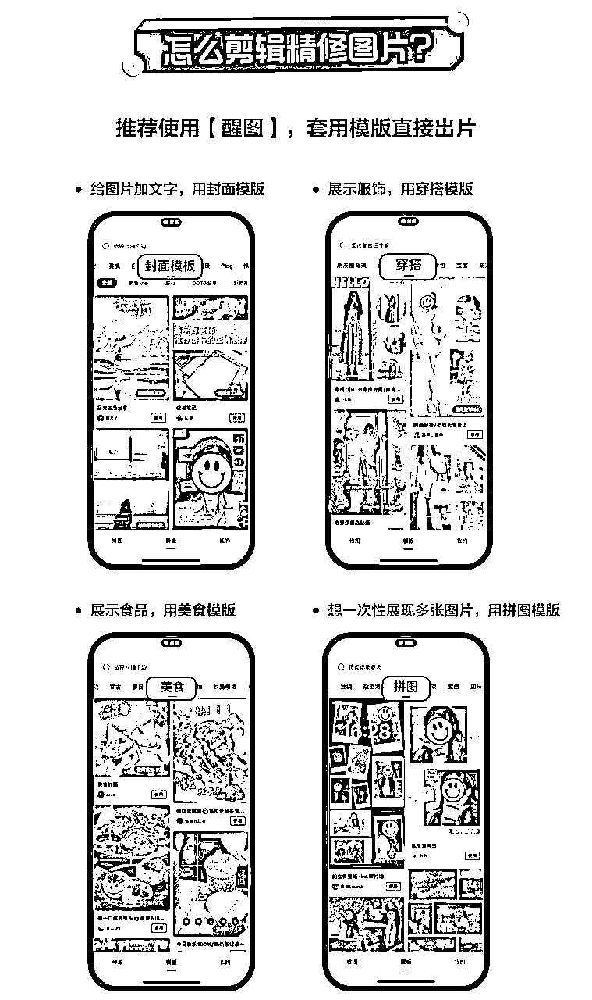

## 5.3 图片制作方法二：用美图秀秀混图去重 @刘逍遥

平台每天这么多人在发布图文，就容易遇到同质化限流。如果你是借鉴同行素材，害怕同质化限流，有下面两种方法解决。

### 5.4.1 单图去重法

以这个为例，我的带货图文，参考对标是这样的图：

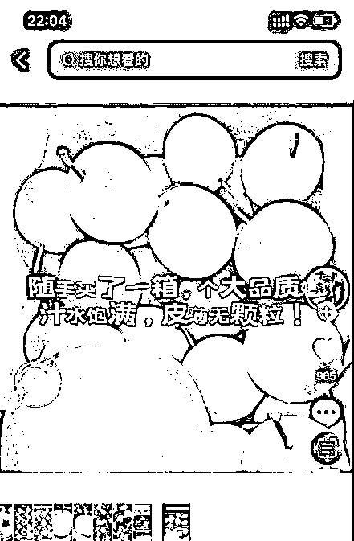

那么我会先去小红书上找到类似的图片，导入美图秀秀：

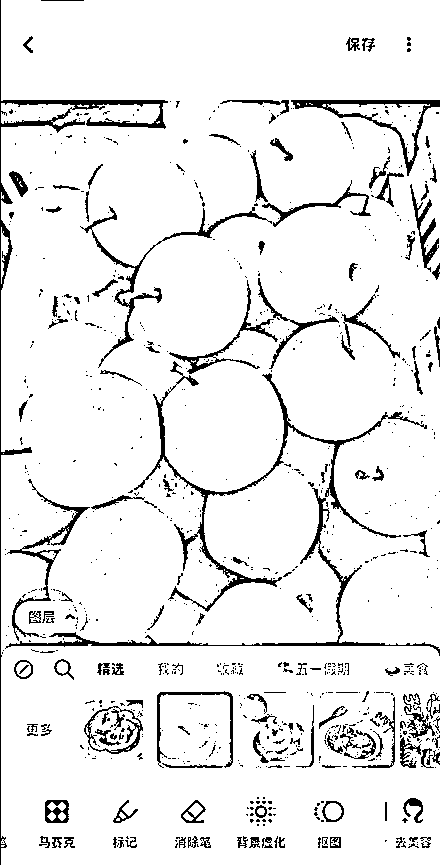

然后再找一个被咬开的梨子图片，在美图秀秀里面抠图处理，然后合成到背景底图上，加上适当的文字，一个按照对标的原创的图片就生成了：

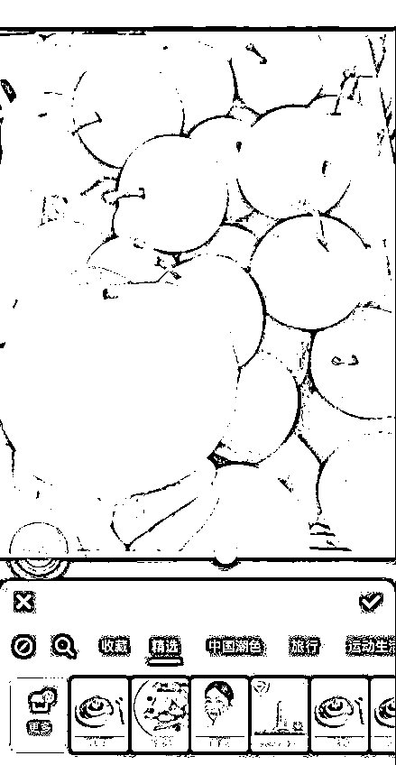

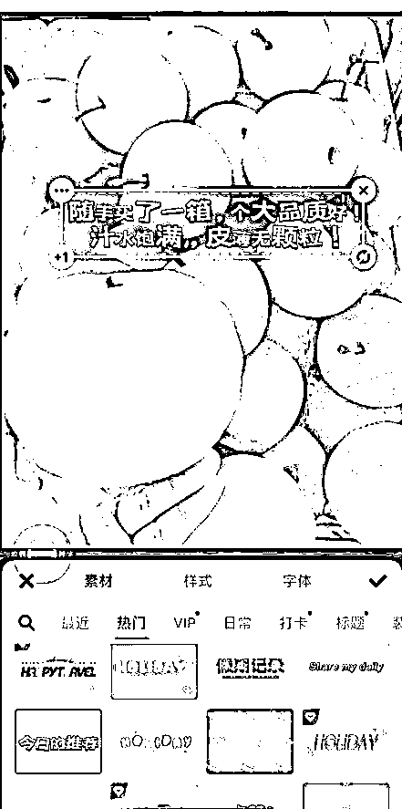

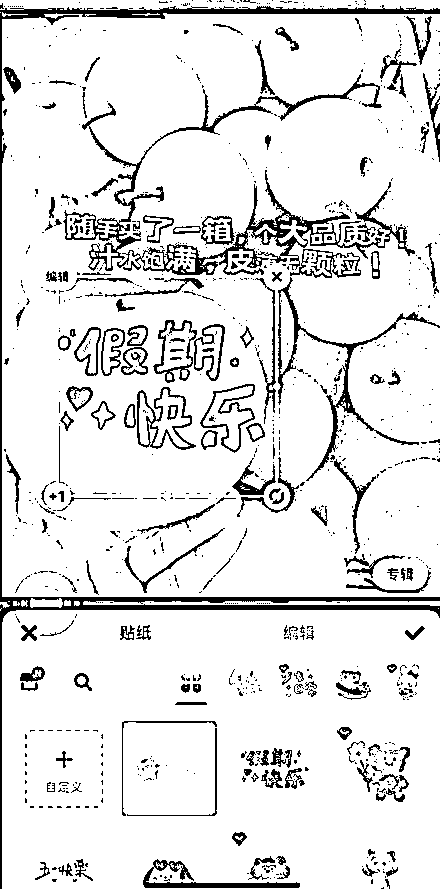

### 5.4.2 拼图去重法

首先打开美图秀秀，点拼图。

我一般都是用四张来拼图，这种拼图主要用来做一些零食，中老年的话就是汤包之类的比较多。

然后导入四张图片，点高级编辑，选中无缝模式，然后点击融合度，就可以拉大缩小所有图片，大家可以按照图片的哪种排版好看，替换图片的位置：

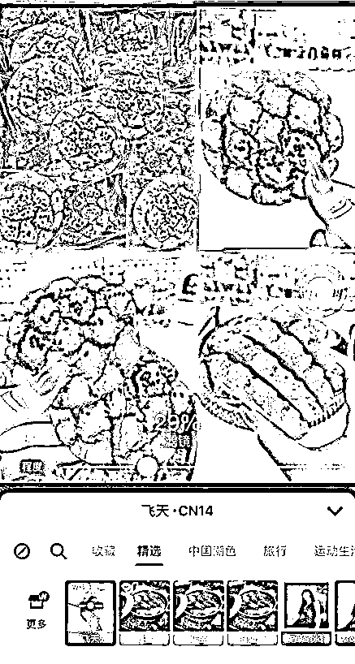

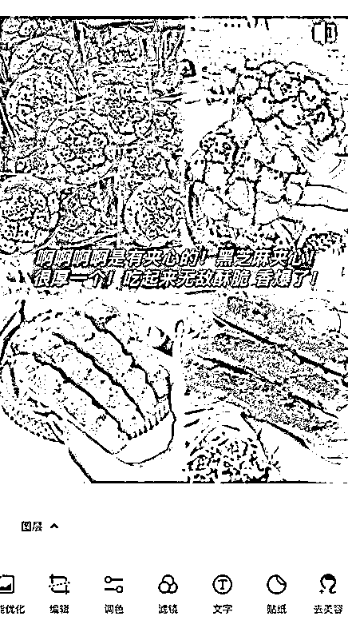

相比较于单图的话，这种拼图的图片，同质化的概率会更低。

### 5.4.3 最后画质提升（选做）

以上两种去重的方法完成之后，我们可以用到「wink」这个软件，来把我们的图片画质变得更清晰。

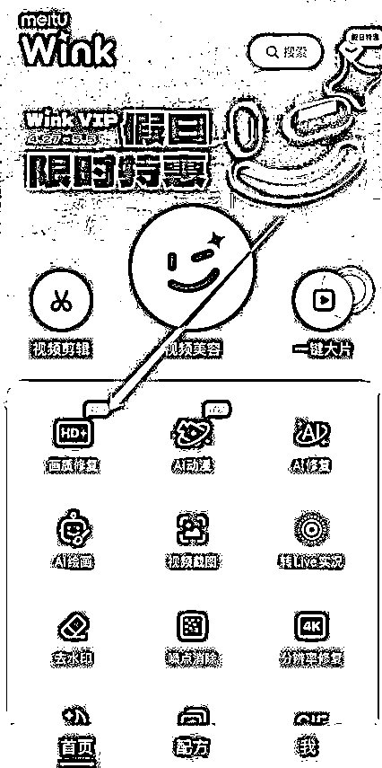

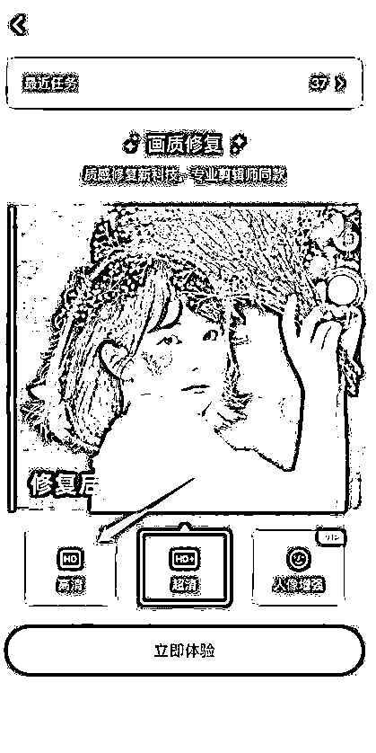

内容来源：《单号日入 1000+，抖音图文带货玩法喂饭级教学》

## 5.5 图片制作方法三：实拍法 @刘逍遥

这种就是需要购买一个俯拍灯，最好用苹果 12 以上手机拍摄，就可以完成。

找商家邮寄样品之后，直接找对标爆款素材，按照对标的来实拍就行了。

为了防止同质化，最好在画面中加一些元素，比如道具花，比如一些其他的道具。实在没有道具的，就把自己手放进去，然后加一些贴纸去重效果最佳。

实拍的话最省时省力的，也是原创度最高的图文，但缺点是需要商家寄过来，可能就会错过商品爆的几天周期，所以建议账号混剪实拍结合。

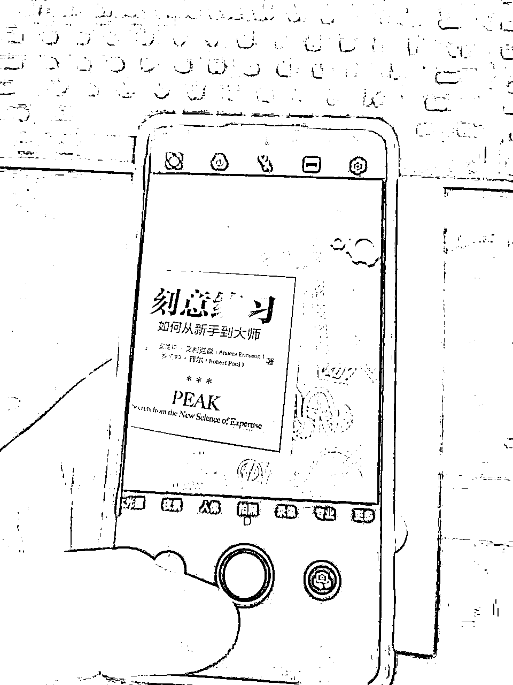

内容来源：《单号日入 1000+，抖音图文带货玩法喂饭级教学》

## 5.6 注意事项 @抖音电商官方

优质的图文内容更容易获得成交，我们可以根据不同行业的特点，进行针对性的内容优化，例如：

服饰方向：从日常穿搭入手，选择应季服装，拍摄场景化穿搭图片，进行产品推荐。

图书方向：选择热销/畅销图书，实拍高清图片，分享阅读收获或内容亮点，引发用户共鸣。

食品方向：挑选好看或有特色的美食，拍摄食物的高清细节图，用真实的体验打动用户。

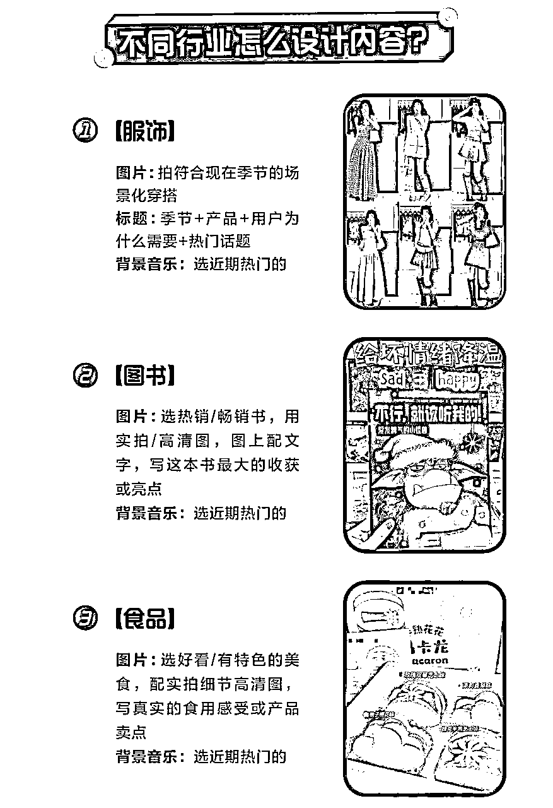

需要特别强调的是：

不要相同图片重复发；

不要图文内容与挂车商品无关；

不要低质量图片；不要标题文案不符合主流价值观。

内容来源：《抖音电商图文带货来啦！3 步走，把握新机遇》

# 第六步：发布视频，赚取佣金 @抖音电商官方

## 6.1 发布挂车视频

发布目前图文视频仅支持手机端发送，选择自己制作好的图片，具体发布流程如下：

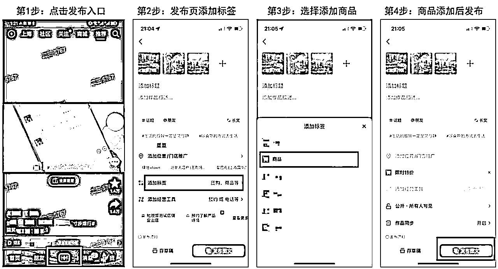

这个过程中，有两点是需要注意的，一个是 BGM，一个是挂小黄车有每日的挂载限额。

如何选择更合适的 BGM？

在选择 BGM 时，我们要注意：

声音的基本要求是音质清晰，无杂音、爆音、卡顿 BGM 紧贴商品卖点、图文调性

选择抖音/全网有热度的音乐

使用卡点音乐与图片切换契合

背景音乐越热门越好，音乐越热门，用户越容易被吸引，从而停留观看。

在选择 BMG 时，我们还可以根据产品面向的购买人群选，匹配合适的氛围感音乐。

小黄车限制开通「商品橱窗」后，：

粉丝数低于 1000 的账号，每周限制发布 1 条带购物车视频；

粉丝数在 1000-3000 的账号，每天限制发布 2 条带购物车视频；

粉丝数在 3000-10000 的账号，每天限制发布 5 条带购物车视频；粉丝数在 10000 及以上的账号，每天限制发布 10 条带购物车视频。

正常发布挂有小黄车的视频后，购买用户的视角如下：

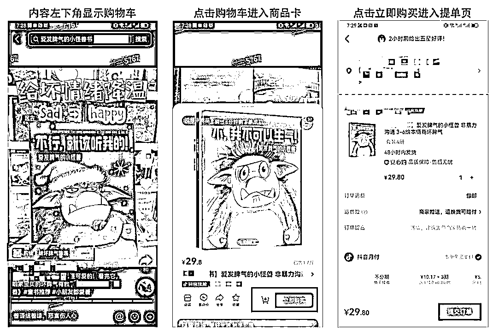

## 6.2 为视频添加橱窗入口 @小马哥

如果你的每日挂车视频数量到达上限了，可以选择在评论区添加橱窗入口，引导大家购买。

手机端入口：

商品橱窗-短视频管理-找到对应视频-点击评论区推荐橱窗。

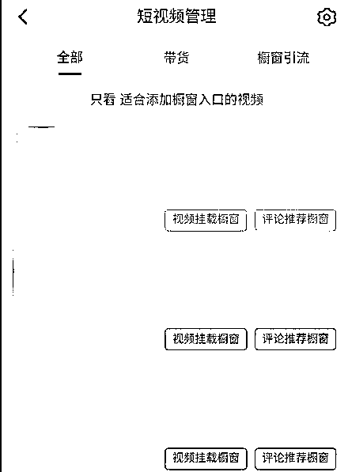

同时，我们还可以设置：自动为电商营销内容添加橱窗入口。

电脑端入口：

直播管理-短视频经营管理-视频管理。

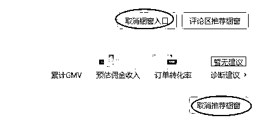

电脑端比手机端好的一点是，如果你想取消挂载或者推荐，可以直接点击取消的，这个手机端操作操作不了。

如果你的挂车数量并没有达到限额，只是不小心忘记挂车了，也可以通过上述方式，在视频中挂回小黄车。

内容来源：《抖音图文带货中的细节操作》

## 6.3 佣金结算

抖音精选联盟-达人版：https://www.douyinec.com/

点击上述链接，进入达人后台，可以在余额管理处看到佣金情况。

佣金结算规则：

单笔订单在用户或系统确认收货 15 日后，该笔订单会发起结算；

若 15 日内商家未完成结算，则等待商家结算完成后，该笔订单会发起达人结算，即确认收货时间 +15 日，为大部分订单的结算时间；

订单结算完成后，订单对应的结算佣金会自动进入可提现余额中；

结算时，平台会扣除 10% 的佣金佣金提现：

路径：抖音 APP-我-商品橱窗-佣金统计-提现到账时间：聚合账户当日打款，微信和支付宝次日打款

# 第七步：复盘数据并优化

## 7.1 查看数据并分析 @抖音电商官方

### 7.1.1 查看图文视频数据

除了选好商品、做好内容，对带货效果定期复盘总结，也是图文经营必不可少的一环。

通过抖音电商罗盘，我们可以查看图文带货的成交情况，也可以对单条图文内容的核心指标（观看、点赞、关注、完播率、商品曝光成交转化率等）进行诊断，获取优化建议。

操作入口：https://compass.jinritemai.com/login

点击上述链接，进入【抖音电商罗盘】，以达人身份登录后，点击一级菜单的【图文】，即可查看具体数据

APP 端：【抖音 APP】-【商品橱窗】-【今日数据】-【罗盘达人】-【内容分析】-【图文】

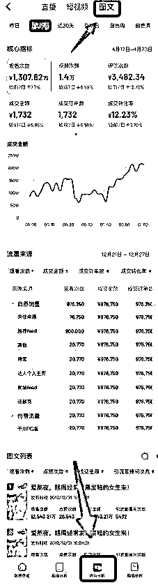

### 7.1.2 分析图文数据，提升图文转化效果

复盘时，可以参考图文带货的核心成交公式，从优化图文短视频观看次数、提高千次观看成交金额（GPM）两个维度出发，进行优化。

Step1：监控核心数据指标和流量来源渠道，分析趋势变化及时调整可以筛选不同时间范围，并筛选图文类型（挂车图文/商品图文）

可以查看图文整体流量价值&成交价值：包括观看次数、点赞次数、成交金额、成交转化率等可以基于上述数据结论，分析流量来源，找到核心流量入口和对比数据变化，通过观看次数、成交金额等指标，识别各渠道来源的流量规模及转化效率，及时调整和优化

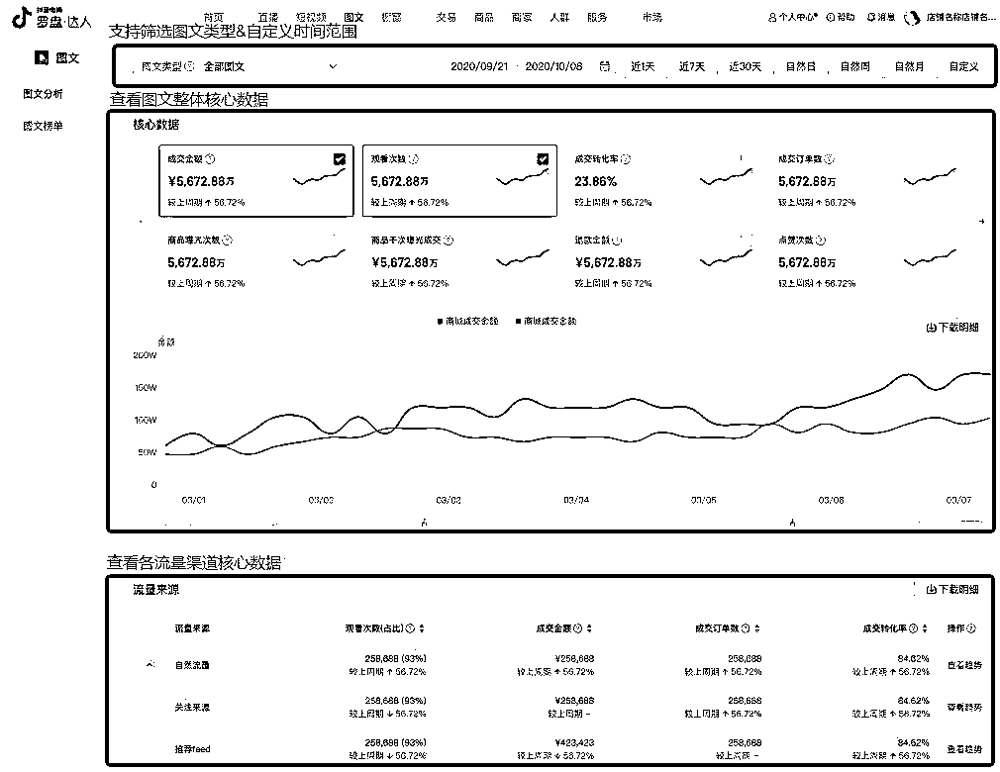

PC 端

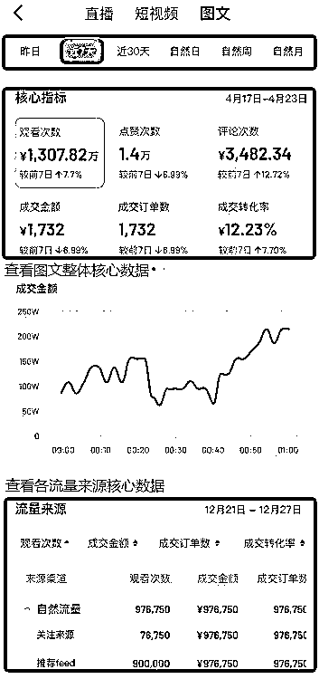

APP 端

Step2：查看单条图文流量及成交数据，找到图文运营突破点

可以自由选择图文视频排序条件（按观看次数、按成交金额等），查看该排名条件下，各条图文流量及成交数据情况，也可以自由搜索商品查看目标商品图文数据。

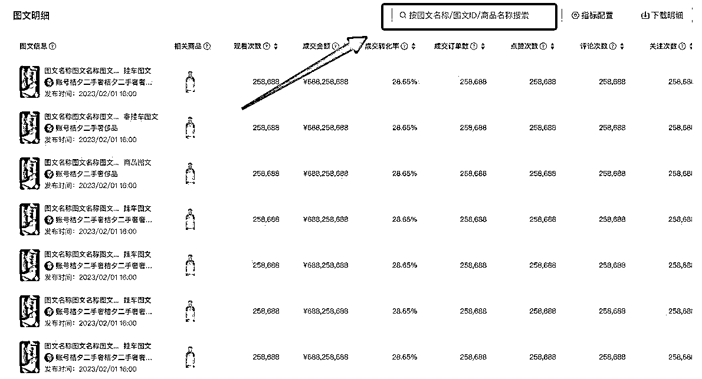

PC 端

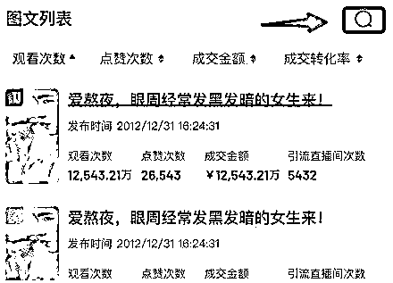

APP 端 Step3: 定位问题图文视频后，如何根据数据分析落地运营动作、优化图文效果呢？

如何提升图文视频观看次数？

根据点赞、关注、完播、商品曝光成交转化率等方向，参照同行了解自己图文内容目前的情况。如果点赞、关注、完播率低，建议参照同行高质量素材进行优化调整

如果商品曝光成交转化率低，建议在选品环节进行优化，从商品评分评价情况、商品类型、适用人群/季节、价格区间等方向进行调整

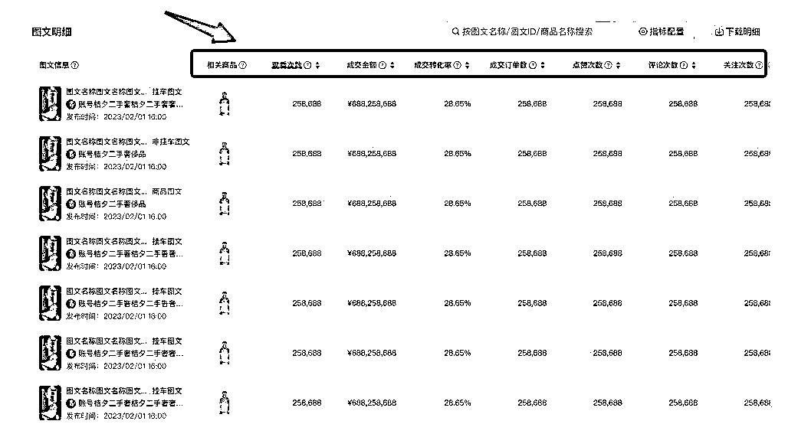

PC 端

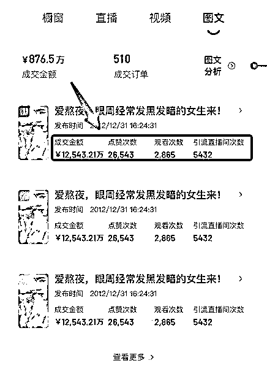

APP 端如何提升千次观看成交金额？

了解用户的喜好和可能未下单的原因，提升单视频成交金额退款比例同样值得关注，一个商品如果退款比例过高，很可能是产品质量、物流等方面出了问题，建议及时跟商家进行沟通，或者跟购买了的粉丝了解具体情况，做好售后工作并及时调整选品

## 7.2 优化重点步骤 @抖音电商官方

围绕图文创作和经营，抖音电商平台总结梳理了“图文带货爆单 3 步走”方法论，即选好商品——做好内容——总结提升，大家在日常项目执行过程中可以重点关注。

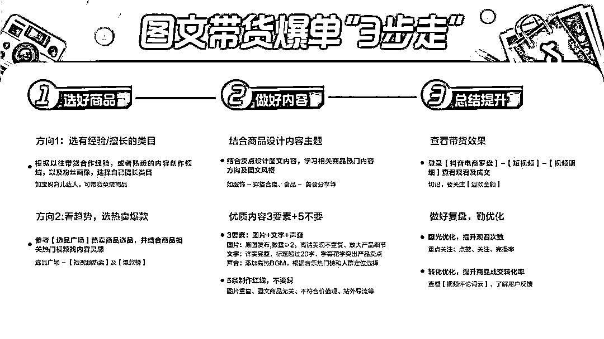

内容来源：《抖音电商图文带货来啦！3 步走，把握新机遇》

## 7.3 违规处理 @小马哥 @抖音电商官方

如何查看视频违规情况？

手机端：短视频管理中会有「建议」的黄色显示，如果是「暂无建议」基本没啥问题，如果有建议，可以去查看后台的提示，有没有更具体的系统通知：

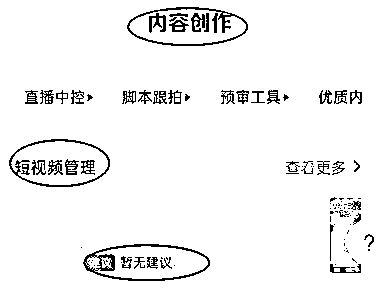

电脑端：在短视频管理中，每条内容都有对应的提示，如果是「暂无建议」基本没啥问题，如果建议优化或者其他的内容，就需要进一步调整。

还可以直接进入抖音创作者中心，查看对应的内容详情，可以看到具体的违规提示情况，大家可以结合实际，看是否要提出申诉

如果图文内容收到处罚通知，但大家不知道原因或不知道如何处理，可以查看以下官方规则文档：如果不了解平台的内容规范，可看👉抖音电商内容创作规范，其中包括平台对电商内容的规范要求：真实、专业、可信、有趣

如果作品/账号违规了但不知道为什么，可看👉电商创作者内容规则全解析，其中包括常见违规场景、违规案例与推荐做法等如果想了解违规带来的后果，可看👉电商创作者违规与信用分管理规则，其中包括违规处理流程、扣分细节、信用分细节等）

如果想了解如何申诉，可看👉创作者违规申诉管理规则，其中包括申诉途径、申诉材料、申诉时效等内容来源：《抖音图文带货中的细节操作》

## 7.4 优化小黄车 @唐明杰 @小马哥

在挂小黄车的时候，可以多添加 2 条及以上相似产品链接。

这个做法的作用是视频播放完以后，小黄车会自动弹窗，另一个是商家如果下架产品后，小黄车里还有其他产品。

小黄车标题也可以做优化，可以做引导性标题，如：视频同款、点击购买等。

小技巧：如何查看出单视频？

手机端：

进入商品橱窗，下拉到创意中心上方，找到短视频管理，点击进入后就可以看到对应的成交数据，这个是以短视频对应的来计算，需要自己对照出单产品与短视频来对比。

还有一种方式，直接点击今日数据，找到对应的内容方式，查看列表中的数据，会有成交数据。

电脑端：

数据参谋-成交详情-成交明细

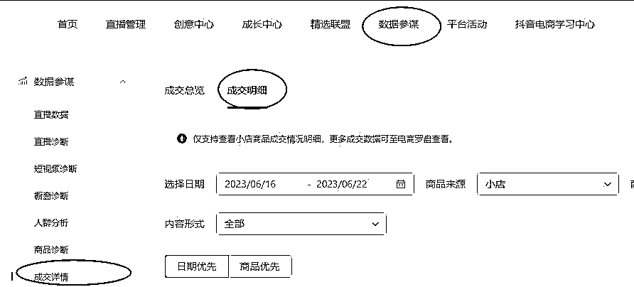

成交形式有橱窗、短视频、直播、其他，那么找对应的内容形式以及内容标题即可。

数据参谋-订单管理-联盟订单明细，会有对应的订单 ID、商品详情，会有详细的佣金明细。

内容来源：《抖音蓝海市场细分用户人群，优化选品，轮播图童装单月利润 2W+》《抖音图文带货中的细节操作》

## 7.5 摆正心态，持续行动 @唐明杰

前面两三个礼拜不出单很正常的，这个时候只要肯放弃，项目就结束，不用再煎熬了。

但是一旦决定坚持下来，最好的方式就放开手去干，一天发够量就行，管他出不出单。

等到某一天终于开始出单了，从一天两单三单，到最后遇到小爆款，一天能有十几二十单或者更多，这个时候 0-1 就真正跑通了。

为啥会是这样的过程？

这种带小黄车视频本就是会一定程度被限流的，新号前期作品少，本来流量就少，不出单很正常。在你累积一定视频量后，有时候你当天发的作品都不出单的，出的单子都是以前发的视频带来的。

很多作品是慢慢被推流，可能过了大几天后才慢慢给的流量。

所以，放平心态，不要过于纠结现阶段视频播放量，选款没问题，视频制作不会太差，都会慢慢出单的。

一定要记住，当天发的不一定马上出单，可能过阵子才会带来单子。

慢慢把视频量做起来，就能稳定出单。

内容来源：《抖音短视频蓝海带货，月利润 2W+》

## 7.6 高频问题解答 @唐明杰

Q：现在童装和中老年女装赛道还适合新手做吗？

A：不可否认，现在这两个赛道相对来说是比较卷的。但是服装需要换季，抓住换季节点，反而有不错的机会。服装类目对于新手来说还是比较好入门，后期可以寻找其他蓝海类目。

Q：新号我用互关互粉完成冷启动可以吗？

A：看具体目标人群。如果你互关互粉能吸引到目标人群，是可以尝试这样做。做一个垂直类目的账号，更建议通过抖加涨粉。

Q：图片的二次剪辑加工，可以做到种草效果吗？

A：可以的，商品是通过短视频种草。服装每年都需要更新换季，每个季度都会有新款，新款对平台来说反而是新数据。上个季度卖得好的达人这个季度不一定也卖得那么好。选对了款式，短视频很容易破播放量，起号速度很快，后期就能完全靠自然流量涨粉并变现。

Q：轮播图相对门槛比较低低，容易批量操作，同质化内容比较多，如何解决这个问题？

A：本质上解决选品和账号的冷启动两个问题。

第一，选择不一样的细分风格和细分市场的产品，可以更好避免同质化和激烈竞争，可以选择通过近期爆款，应季新款，形成差异化，新品爆款对平台来说也是较新的视频。

第二，账号需要打上强标签，有一定基础权重。账号累积一定量基础粉丝后，短视频就能获得稳定播放量。

内容来源：《抖音蓝海市场细分用户人群，优化选品，轮播图童装单月利润 2W+》

# 第八步：放大成果

很多项目在进入稳定运营期后，需要做的，就是持续更新，优化产品、图片、数据，同时持续怼视频，根据视频数据进行优化，直至遇到爆款视频。

这个阶段就是多发作品，看作品观看量和反馈。有挂车的视频看订单成交量，没有挂车的看播放量和评论区，如果很多人评论怎么买、哪里买等等，可以多发对应的款式。

那么这一步之后呢？我们还可以通过哪些方法来放大项目？

总结来说，主要是 3 个：千川投放

直播间开播搭建矩阵号

## 8.1 方法一：千川投放

投放的意义，就是将你原本已经爆款的数据和收益，进一步打爆。

内容创作的加热工具一直是 DOU+，投 DOU+ 相当于还是把作品在内容流量池做曝光，千川更多是商业行为推广工具，千川的流量池覆盖内容流量池与广告流量池。

短视频不挂小黄车投 DOU+，还是在被推送到内容流量池里，短视频挂小黄车再投 DOU+ 则不一样，挂小黄以后的视频推广方式叫 “小店随心推”，小店随心推是千川的一种，属于商业推广行为。

挂车链接则需要接受内容流量池和广告流量池的双重审核。

具体的千川投放技巧，这里不做介绍，大家如果想了解，可以通过查看官方文档的形式获取信息👇《巨量千川平台使用手册》

生财圈友也出过千川保姆级攻略，参考资料👇

【保姆级千川攻略】巨量千川投放经验 120 条，投放新手必看！

建议大家先通过免费流量来获取正反馈，等项目跑通后，再开始通过付费流量翘起更大的流量。

内容来源：《抖音商业 IP 大航海 1.0 丨学习手册（完整版）》

## 8.2 方法二：直播间承接流量

这种方法适用于：你出现了爆款视频，带来爆款出单，这时可以开播承接流量，进一步放大收益。

路径：

短视频获取流量，给直播间导流并获得成交。直播间会打上对应标签，能获得直播间 feed 推荐流量，同时直播间也能促进账号涨粉，从而形成一个良性闭环。

### 8.2.1 直播间搭建

抖音直播本身就是一个非常大的概念与项目，所以本章节中，我们不会展开讲那么多，只告诉大家，完成一场基础直播，可以怎么做。

如果想要了解更多直播间玩法，可以参考👇9 月航海 | 抖音半无人直播 | 实战手册

11 月航海 | 抖音绿幕直播 | 实战手册

直播的关键，无非就是人、货、场，所以我们主要从这三个角度来说。

#### 8.2.1.1【场】直播设备

仅需一部手机+手机支架

考虑到直播地点和预算原因，大家可以有不同选择，可以用灵活便捷可自主操作的手机直播间，也可以用高清效果可玩性强的电脑直播间，还可以用专业导摄支持的演播室直播间。

更多高清效果及专业直播间设备推荐可参考👇

抖音电商的 3 种直播间和 40 种设备-抖音电商学习中心

#### 8.2.1.2【场】场景搭建基础版：在家就能完成

居家布景示例一：直播间内即时装袋并贴单发货，类似风格还有开盲盒、开蚌等直播间内容抖音电商学习中心-抖音电商官方学习平台.mp4【在线播放】

居家布景示例二：从主推品的外观、使用、功能、优惠等多个角度进行讲解阐述抖音电商学习中心-抖音电商官方学习平台 (1).mp4【在线播放】

进阶版：更适合有团队的玩家绿幕/摄影影棚：

适用于各类品牌直播间，搭建与品牌调性统一的背景

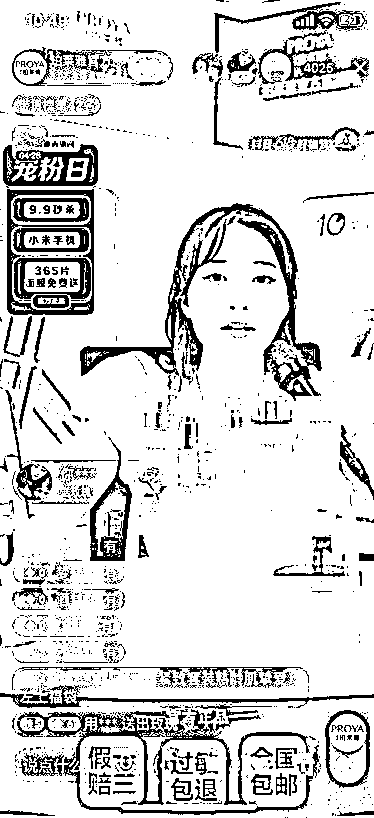

工厂/仓库：突出源头发货，没有中间商赚差价

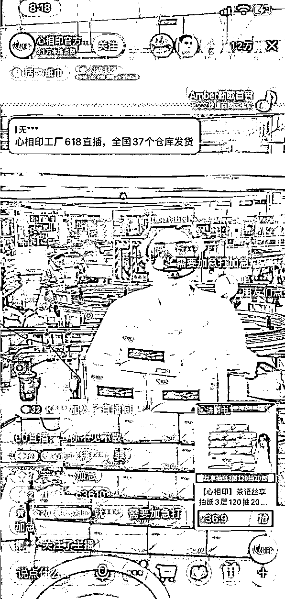

店铺货架式：

适合货品丰富的商家，可以直接在门店进行直播

室内生活景：

适合厨具、家居、百货等产品，在特定的场景内展示

户外场景：

例如商场内、养殖场、种植园，与售卖的产品形成互动

小型舞台/T 台：

使适用于品牌型、运动型已经货品设计感强的直播间，激发整套穿搭的购买欲望

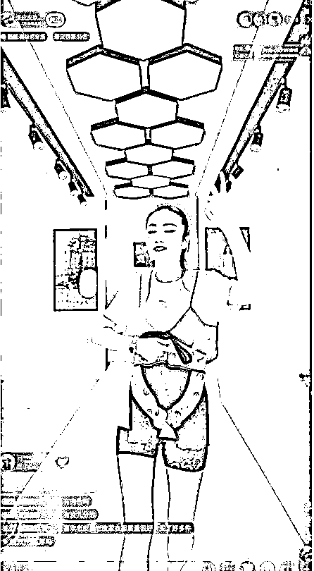

本项目制作基础直播间搭建即可，更多详细内容可以参考官方文档：「从 0-1」实现直播间顺利开播

#### 8.2.1.3【场】直播脚本话术

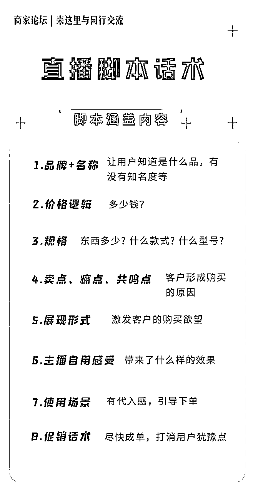

具体话术案例

✅推荐话术

开头引入

马上把我们家的爆款 7 号链接上上来，全屏把 7 号链接扣起来给你们上大三圈，这么长的链子 1 米 6 的长度

给你们看这个长度的珠子到底美不美！

卖点介绍

首先它全网销量一万件以上的，店铺的大爆款。为什么它能年年稳占销量前茅呢？

并不是说 7 号有多么多么好看，美的惊为天人。它是不挑人、小到你刚刚发育，大到你做了奶奶姥姥，全年龄段可穿利益介绍

所有扣了 7 的宝宝，人手一个 29 元的洗衣袋

左上角点好关注领好优惠券了

用户催单

7 号性价比更高，库存不多，秒拍秒付

更多直播话术教程：电商直播玩法及话术

附 1：直播间宣传规范速查字典

【持续更新】达人宣传规范速查字典如果害怕自己在直播中触碰违禁词，可以预先查看字典。

附 2：脚本预审工具网站：巨量百应

如何使用该工具：预审工具全面升级：电商内容前测攻略-抖音电商学习中心

#### 8.2.1.4【人】运营人员个人直播

常见的半无人直播，一般由一个人组成一个直播间。我们需要提前准备好各种直播所需的话术，比如：用户进直播间的欢迎话术、卖货时的话术等。在商品讲解的过程中，同时负责评论区的互动。做好前期准备，照样是可以出单的。

团队直播

如果是两人及以上的小团队，一般来说，一个人负责出镜直播，在直播间与客户沟通。另外一个人在后台进行运营，比如调品和点击商品讲解，根据直播曲线告诉主播进行调整话术策略等。

如果希望最高效率运营，可以同时运营两个号，上午下午各做一个号，前提是两个人都具备主播和运营技能，这样可以同时两班切换，否则一个人口播一天，嗓子基本是受不了的。

内容来源：《初阶 | 抖音-半无人直播｜航海实战手册》

#### 8.2.1.5【货】上传商品 @Erik

选品结束后，在开播之前，还有一件重要的事，就是上传商品，再开播，不然开播后直播间很容易弹出违规。

抖音常规的后台操控中心是巨量百应，操作步骤如下：

1.

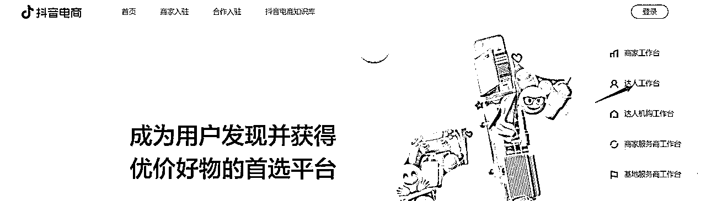

选择抖音账号登录

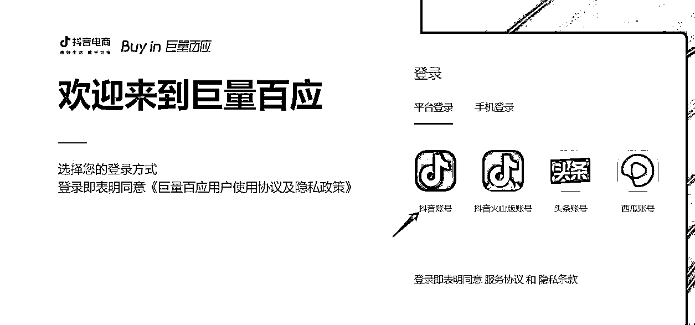

3.

找到直播管理

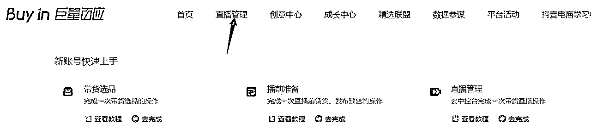

进入直播中控台，添加商品

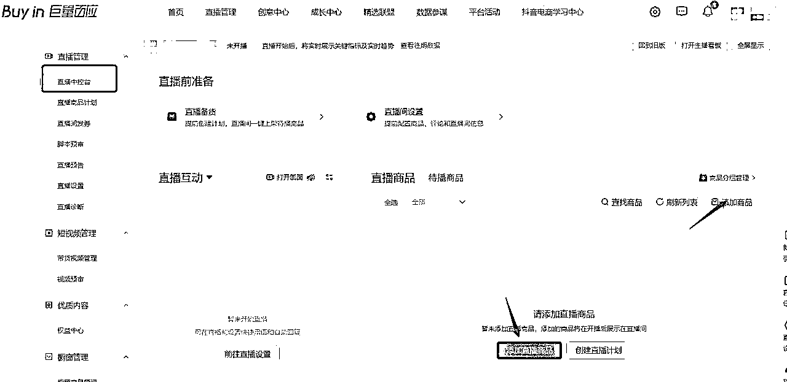

添加完商品后，可在中控台调整商品顺序，上下架商品，添加商品卖点。

#### 8.2.1.6 开启直播

直播入口：

打开抖音 APP，点击下方的【+】号，再点击【开直播】，完成以上步骤就可以开播啦。

### 8.2.2 直播间优化 @唐明杰 @抖音电商官方

直播间可以做哪些优化迭代呢？

直播间的优化主要在直播间素材、直播话术等上：

优化背景视频，背景视频可以是图片轮播、混剪视频循环播放等形式

优化产品结构，把商品进行排序，爆品尽量排在前面优化视频商品标号，视频中把产品和小黄车对应链接号标出来，方便用户查找

优化贴图信息，贴上引导关注、引导点击小黄车、优惠信息等卖点贴图，提高点击率优化背景音乐，不要太嘈杂，适合目标人群音乐

优化直播间话术，话术可以录制同行的，然后用飞书转成文字，自己写一遍出来

前期可多看同行，取长补短。多对比优秀同行，做不足的地方就持续优化迭代，不奢望一步到位。

这个模式可不依赖专业主播，如果有专业主播，当然更好，是后期可以优化升级的方向。可以逐步升级成专业人货场直播间，效果更好。

如何提升直播间曝光？

提升开播时长，覆盖用户核心搜索时间段

直播间本身的内容/转化（停留时长、互动成交等）优质直播间将优先曝光；

直播间口碑分高，无违规；

直播间标题的关键词明确，品牌/商品属性清晰。

目前在「抖音图文电商」项目中，我们只需搭建基础直播间，用于承接流量即可。

如果想学习更多直播细节，可以参考官方文档：「从 0-1」实现直播间顺利开播内容来源：《抖音蓝海市场细分用户人群，优化选品，轮播图童装单月利润 2W+》

## 8.3 方法三：搭建矩阵，放大成果 @思蒙

对于门槛比较低的项目来说，比如「抖音图文电商」，本质上都是用数量博概率的游戏。

在前期，相对于质量，数量才是更重要的。

所以我们能多发作品就多发作品，能多起账号就多起账号。

在航海的过程中，大家会发现，有小伙伴的作品也许和你差不多，根本说不上多么优秀，但他的账号就是爆了。这就是概率的问题。

在掌握了选品和图文制作技巧后，剩下的就是靠【量】了。

发一条视频，能爆的概率是 1%，那发 10 条，或者有 10 个账号呢？每一个都是 1%，加起来是不是能爆的概率就大多了？

而且在这个过程中你会发现，有的号一开始流量就好，有的号却一直奄奄一息的样子（当然前提是质量都过关，作品水平一致）。

这就是账号体质和概率的综合。

搭建矩阵的方式其实很直接，就是批量做号，批量发视频，把本手册上文的项目流程复刻到更多账号上。

我们在矩阵中，可以筛选出一些素质好一点的号继续培养，差的就可以注销另换了。

内容来源：6 月 8 日《短剧 CPS 的进阶技巧及常见问题答疑》@思蒙

# 第九步：学习爆款赛道案例

为了让大家能快找到合适赛道，我们也总结了爆款赛道的案例与公式，供大家参考。

## 9.1 亲子方向 @抖音电商官方

类型

爆款模板书籍分享

数据表现：稿均流量约 50 万，客单价约 20 元，稿均 GMV 约 3 万

爆款公式：热销/畅销数据+实拍/高清图+真实测评+热门 BGM 图片模板：

童装分享

数据表现：稿均流量约 20 万，客单价约 40 元，稿均 GMV 约 1 万

爆款公式：符合时令/可爱/高颜值童装+实拍/高清图+卖点介绍+活泼可爱 BGM 图片模版：

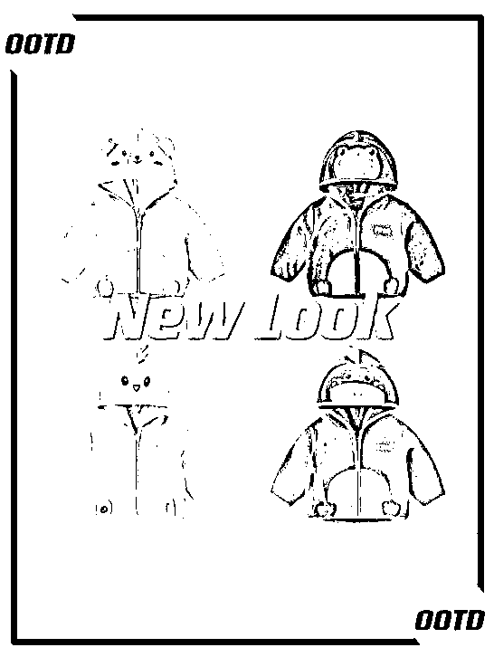

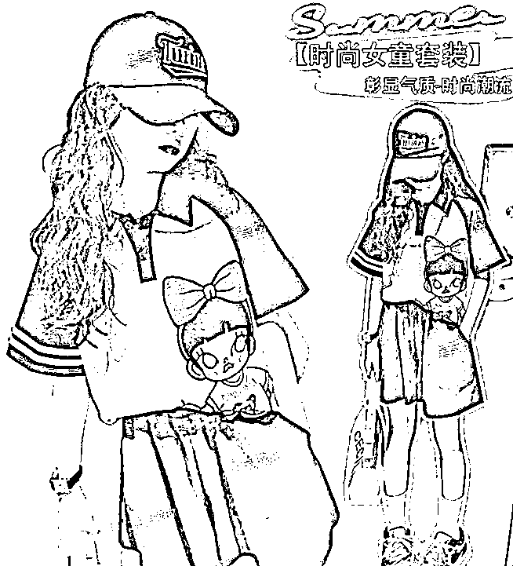

## 9.2 食品方向 @抖音电商官方

类型爆款模板

糕点饮品分享

数据表现：稿均流量约 60 万，客单价约 30 元，稿均 GMV 约 10 万爆款公式：高颜值/新奇特美食+实拍/细节/高清图+真实测评+热门 BGM

图片模板：

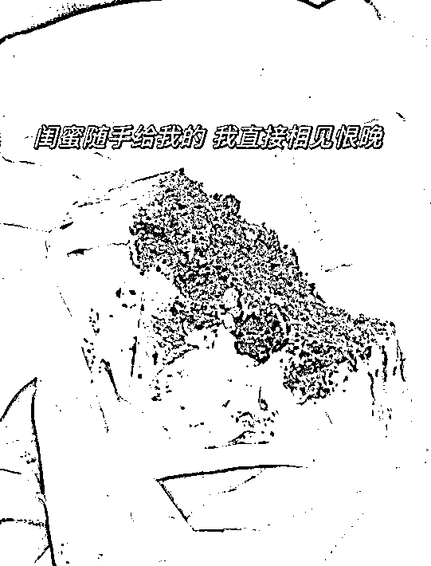

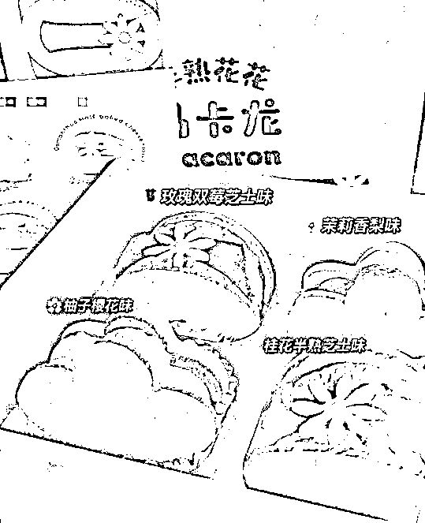

水果零食分享数据表现：稿均流量约 30 万，客单价约 30 元，稿均 GMV 约 1.5 万

爆款公式：热销/爽口美食+实拍/高清/细节商品图+真实测评+热门 BGM

图片模版：

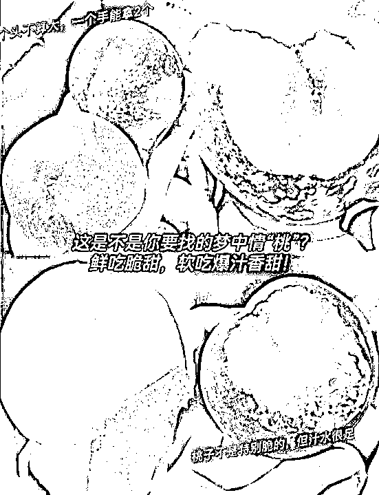

## 9.3 服装方向 @抖音电商官方

类型

爆款模板

日常穿搭分享数据表现：稿均流量约 80 万，客单价约 85 元，稿均 GMV 约 6 万

爆款公式：符合季节时令+人格化/场景/穿搭图+精准文案（季节+品+用户痛点/爽点+热门话题）

图片模板：

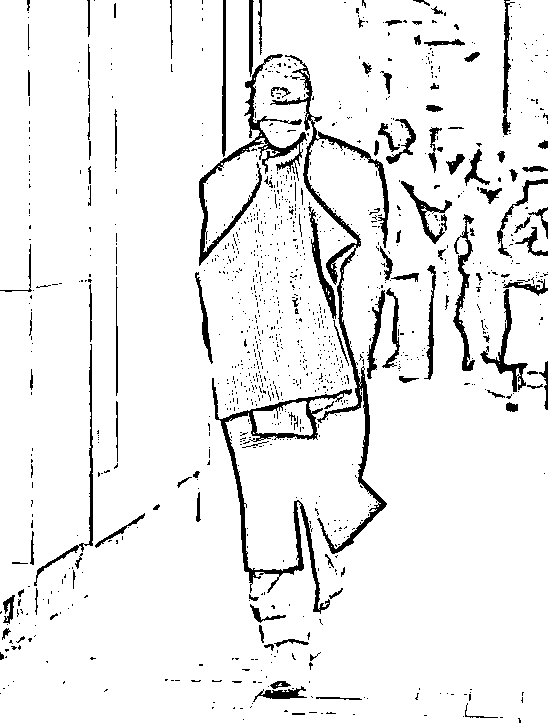

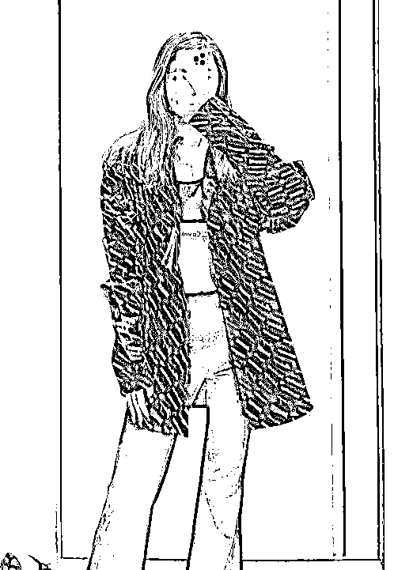

穿搭合集分享数据表现：稿均流量约 100 万，客单价约 60 元，稿均 GMV 约 5 万

爆款公式：符合季节时令+人格化/穿搭图/多张+精准文案（季节+品+用户痛点/爽点+热门话题）

图片模版：

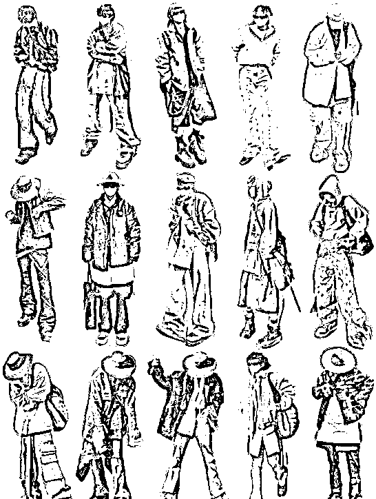

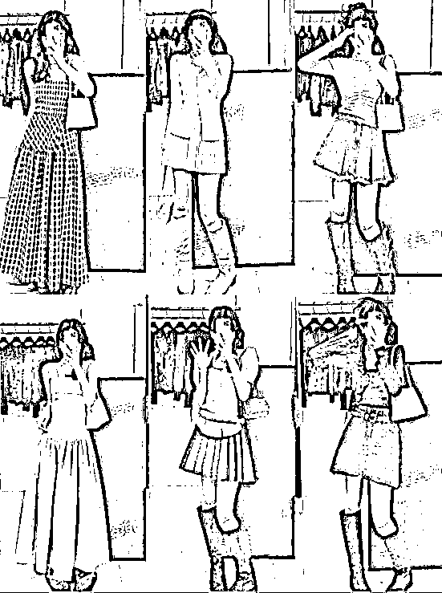

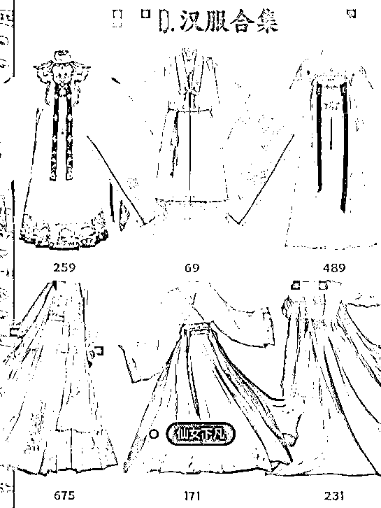

## 9.4 家具生活 @抖音电商官方

类型

爆款模板爆款公式

数据表现：稿均流量约 7 万，客单价约 30 元，稿均 GMV 约 1 万爆款公式：高颜值/实用商品+实拍/使用过程/使用效果/成品展示/高清图+治愈 BGM+热门话题

图片模板：

物品展示

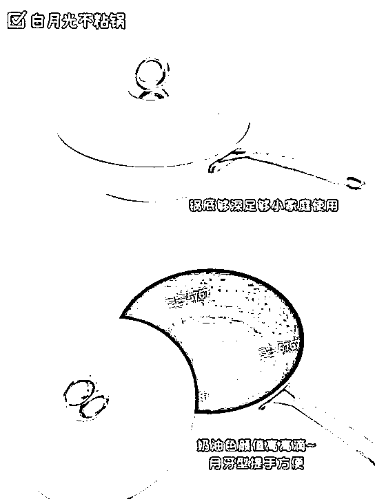

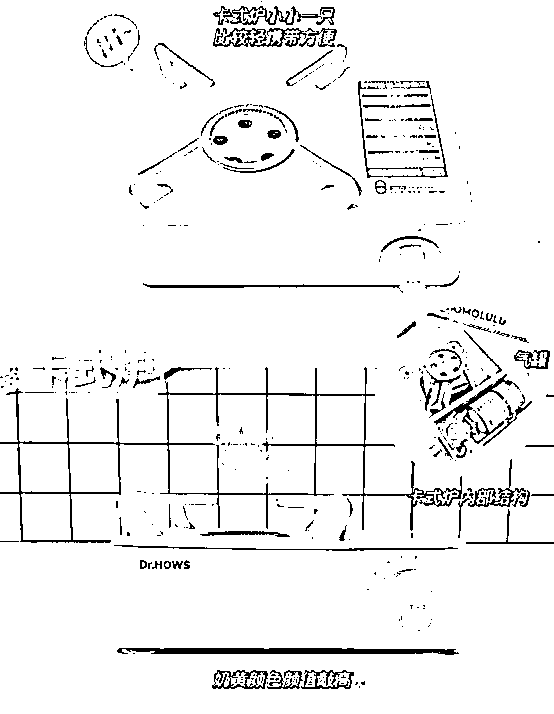

合集分享

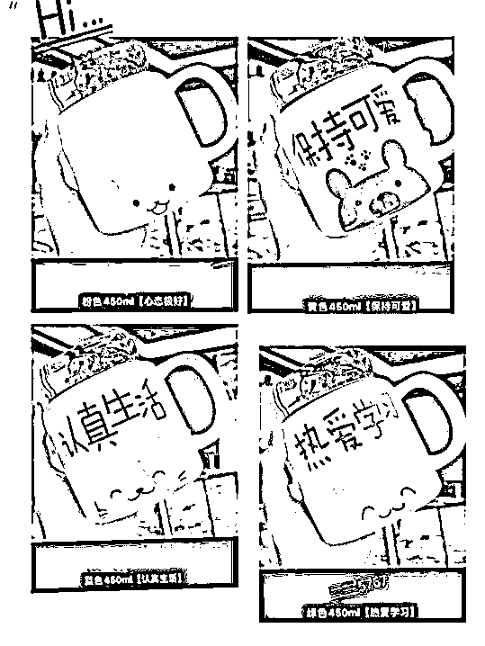

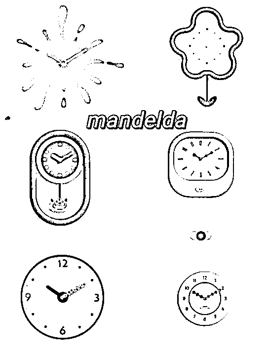

## 9.5 图书方向 @北辰

发现一个纯图文带货做的非常好的账号，产品是唯美绘本，半年 1.7 万粉，橱窗销量 2.1 万。所有内容都是绘本实拍图片加点滤镜，配合怀旧文案和音乐，特别吸引 80 后。

这帮人的孩子刚好是读绘本的时候：

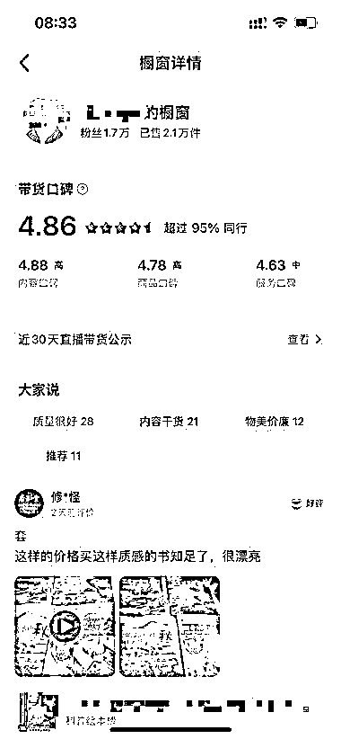

内容来源：《唯美绘本。 半年 1.7 万粉，橱窗销量 2.1 万》

