# 抖音精准引流（SEO）202308

> 来源：[`remhu1p2pr.feishu.cn/docx/O9SZdIXxYoWBJWxDf85cgzDwn9f`](https://remhu1p2pr.feishu.cn/docx/O9SZdIXxYoWBJWxDf85cgzDwn9f)

出品时间：2023 年 8 月 10 日

手册使用说明：本文旨在向你展示一个项目的更多可能性，帮助你更好地理解和实操。

建议：如果需要快速定位到精确内容，可以使用快捷键 Ctrl + F/command + F 的形式，搜索「关键字/词」，查找你想要的内容。

写在前面

💡Hi,

欢迎大家来到 抖音 SEO | 实战手册，相信在接下来的日子里，我们将在这里见面很多次。

本次航海的目标，在 21 天时间内完成抖音 SEO 关键词选取，持续制作内容发布，成功引流或成功开单

由于本次航海实战将会用到商业化「选词」工具，为帮助同学们在短时间内掌握抖音 SEO 相关方法论，顺利拿到实战成果，我们特地为大家申请了一个月的工具免费使用福利，具体操作方法详见手册第四章节「四、抖音 SEO 实操技巧」。在这里我们也要特别感谢福利提供者 @令狐峰 和@Hawli（李小随）两位教练对本次航海的大力支持。

抖音 SEO ，即抖音搜索排名优化，指通过抖音算法规则选好关键词获取的精准流量，实现商品（团购)、直播间、小程序、视频、图文等类型产品的排名的上升。以此来获取更大的流量和商业收入。

在开始抖音 SEO 实操之前，我们先来看几个问题：1）现在做抖音 SEO 有多大机会？

2）什么样的人适合做抖音 SEO？

3）怎样正确使用这个手册，拿到不错的成绩？

1）现在做抖音 SEO 有多大机会？

根据官方公布，截止到 2023 年 5 月底，抖音搜索日活超过 5.6 亿，在抖音平均每人每天至少搜索 3 次，也就是说日搜索人次超过 17 亿次。

搜索行为正在从「找号」过渡到越来越多「找内容」，具体说明为搜索内容占比从 2019 年的 32% 变到 2021 年的 65%，2022 年的数据预计为 90% 。此外用户的搜索意图也越来越明确，这代表着购买欲望越来越强，商业价值越来越高。

从「词」的维度上看，有数据显示在 2600 万关键词中，搜索量大而竞争小的数据有 1831 万条，接近 70% 的蓝海；从「人」的维度看，通过对 2000 万博主视频的数据进行采样发现，99% 的抖音博主都不懂 SEO。

2）什么样的人适合做抖音 SEO？

抖音上内容和群体多元，适合做 SEO 的人也众多，如招商加盟类、本地高客单、电商人群、知识付费、传统工厂、大健康类、金融和消费品等。

从上一期抖音 SEO 航海的实战情况看，抖音 SEO + 高客单项目的方式更容易看到结果。

3）怎样正确使用这个手册，拿到不错的成绩？

第一，在抖音 SEO 中，最最重要的环节是 「选词」，可以说它几乎决定了抖音 SEO 的成败。常规操作中，要想选出合适的有商业价值的蓝海关键词，是一件耗时耗力且难度很大的事情。

为减少同学们在「选词」环节的难度，我们给每一位同学都申请了一个“福利”——「极客增长」个人版选词工具 1 个月免费使用名额。

在本手册的第四章节，我们提供了「极客增长」工具的 福利领取方法 和 详细使用方法 ，这是本手册的重中之重，需要大家结合工具认真理解尽快掌握。

第二，在 2 月份高客单和抖音 SEO 结合的基础上，5 月份我们发现长尾词也是精准选词的一种方式，本期手册中主要新增了长尾词的选词方式和技巧，具体内容详见：4.5 长尾词选词方法第三，除了上述内容，还有个核心就是多提问，多交流，在这里没办法满足你的地方，多问问，我们会一起找到关于难题更多的解法。

希望大家可以在这次航行里收获成果外，结识一群战友。

以下内容由生财有术联合圈友 @令狐峰和 @Hawli（李小随）以及部分在抖音 SEO 领域取得成绩的圈友共同制作而成，仅供航海船员以及生财有术星球圈友学习使用。

创业是搭积木的一个过程，掌握获取搜索流量的能力，可以帮助你更好更快的搭积木。能力的累积，可以复制迁移到其他项目中，会成为你个人的壁垒。

同时也欢迎圈友们在实践过程中持续反馈，和我们共同完善，提供修改建议～

# 一、抖音 SEO 与高客单项目 @令狐峰 @Hawli（李小随）

## 1.1 什么是抖音 SEO

SEO（Search Engine Optimization），搜索引擎优化：利用搜索引擎的规则提高「产品」在有关搜索引擎内的自然排名，目的是让其在行业内占据领先地位，获得品牌收益（产品的代表：网站、商品、视频、直播、图文等泛指）。

有搜索入口的地方就有 SEO ，比如百度 SEO 、微信 SEO 、小红书 SEO 、头条 SEO 。抖音 SEO 就是抖音搜索排名优化，指通过抖音算法规则提升商品（团购）、直播间、小程序、视频、图文等类型产品的排名。

目前抖音总用户已达 9 亿，日活达到 7 亿，57% 的抖音用户会每天至少搜索抖音一次，日搜索量超过 7 亿人次，抖音 App 正在成为获取信息的超级入口，优质的视频内容已经成为抖音的护城河，视频的搜索展现形式信息量更大，也正在成为越来越多的网民首选。

抖音 SEO 适合什么样的人？

抖音 SEO 适合参与的人群有：

招商加盟类：洗鞋、收纳师、洗衣、餐饮等；本地高客单：二手车、装修、家电维修、买房、旅游、宠物、婚纱等；

电商人群：抖音小店、淘宝电商想转抖音小店、抖店代运营等；

知识付费：各种证书、求职培训、自媒体培训、电商培训等；传统工厂：大型机械、小型精密机械等；

大健康类：医药产业、医疗服务等（得有资质）；金融：保险、贷款、券商开户等；

消费品：护发品、个人干净品、化妆品、纸巾（最好有抖店）。

总结起来就是：抖音 SEO 是一个通用性的解决方案，适用的行业较多，是一种客单高频次低类的及时性需求，也可以是普及广但价格相对低的广泛需求。

抖音 SEO 不适合参与的人群有：

没有自己的产品可以销售；黑五类或其他抖音禁止的生意（K12）；

没有接触过抖音。

## 1.2 为什么要做抖音 SEO

因为抖音和小红书的流量正在崛起，而百度、淘宝的流量正在减少。

搜索流量被称为精准的流量入口，因为用户是有明确的问题需要去解决才会去搜索，所以需求是相对比较强烈的，这部分人流量很精准。

互联网早期流量入口是搜索，百度一时风头无两，力压腾讯和阿里，成为 BAT 之首。虽然现在百度没落了，并不代表搜索这个行为没落了。

以前百度和淘宝是主流的搜索渠道，一家代表着信息，一家代表着电商。但百度成立于 2000 年，淘宝成立于 2003 年，已经存在 20+ 年了，竞争对手早把市场给瓜分的差不多了，已经是红海中的红海了。

而如今，抖音和小红书作为新崛起的渠道（抖音成立于 2016 年，坐拥 7 亿日活；小红书成立于 2013 年，也有 1 亿日活），并且 60% 以上的用户都有搜索行为，因此搜索流量是无比恐怖的。

大家可以回顾一下，日常的搜索行为是不是越来越倾向于在抖音或者小红书等平台了。

1、抖音搜索数据梳理抖音平台的发展阶段梳理：

阶段

内容偏向

例子

16-17 年娱乐

颜值、游戏

18-19 年

专业内容

垂直流量扶持 2020 年

电商扶持

罗永浩、李佳琦

21-至今

全面发展本地生活、三农、电商 以及抖音搜索。

根据 2021 年 12 月底抖音公开的数据（ 2022 年数据未公开），可以得到三点启发：

1）搜索习惯正在逐渐养成根据官方公布，截止到 2021 年 12 月底，抖音搜索月活超过 5.5 亿，在抖音平均每人每天至少搜索一次，也就是说日搜索人次超过 6 亿次。

搜索行为正在从「找号」过渡到越来越多「找内容」，具体说明为搜索内容占比从 2019 年的 32% ，正在变到现在 65% ，大

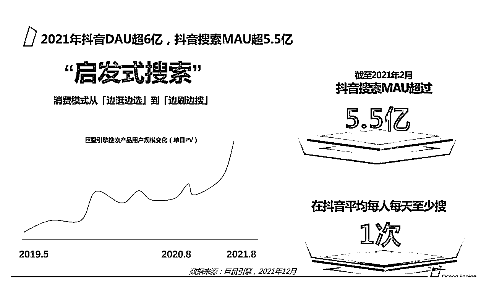

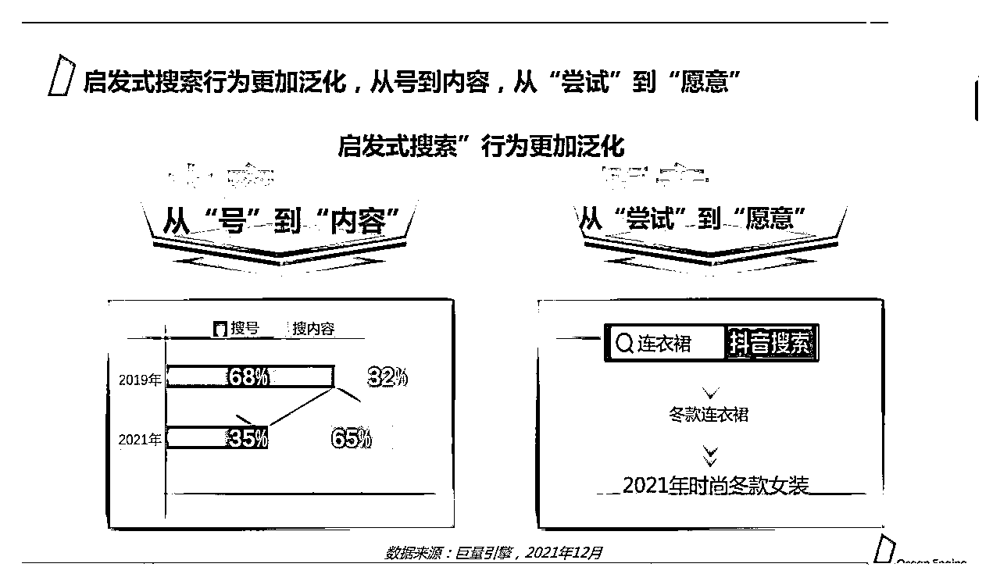

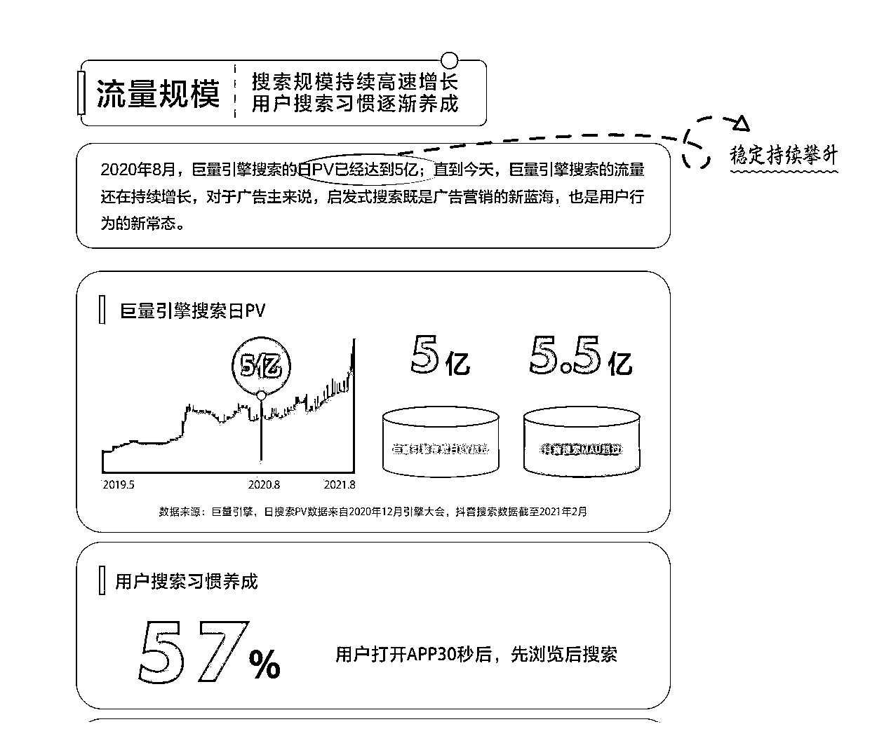

2）商业价值越来越强

用户的搜索意图越来越明确，购买欲望也越来越强，从连衣裙 -> 冬款连衣裙 -> 2021 年时尚冬款女装。

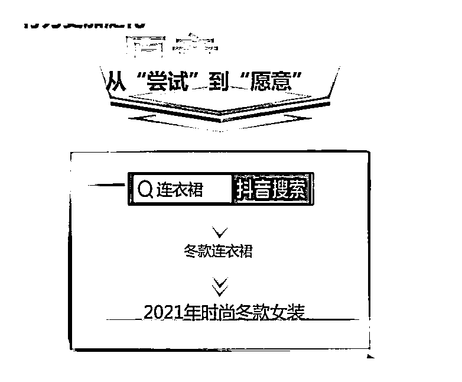

电商类的搜索流量增长率显著提升，比如：零售提升 281% 、食品饮料 223% 、教育培训 155% 。

多个行业的搜索量上升幅度明显增大（超过 200%） ，说明增长势头强劲，流量红利明显。

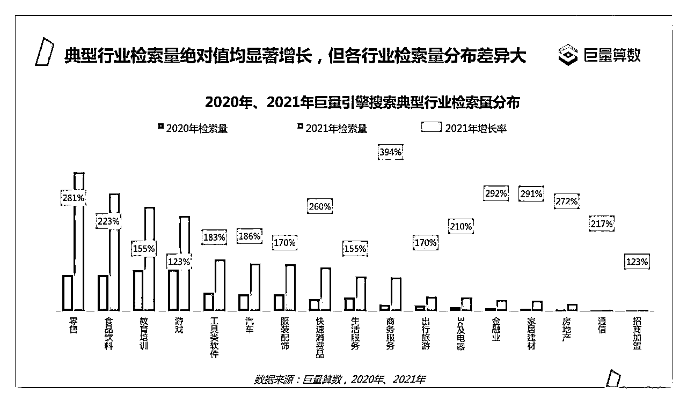

搜索用户的女性占比 52% ，大于男性的 48% ，24～30 岁的用户占比显著增加，一线和超一线城市占比增加，消费能力明显增

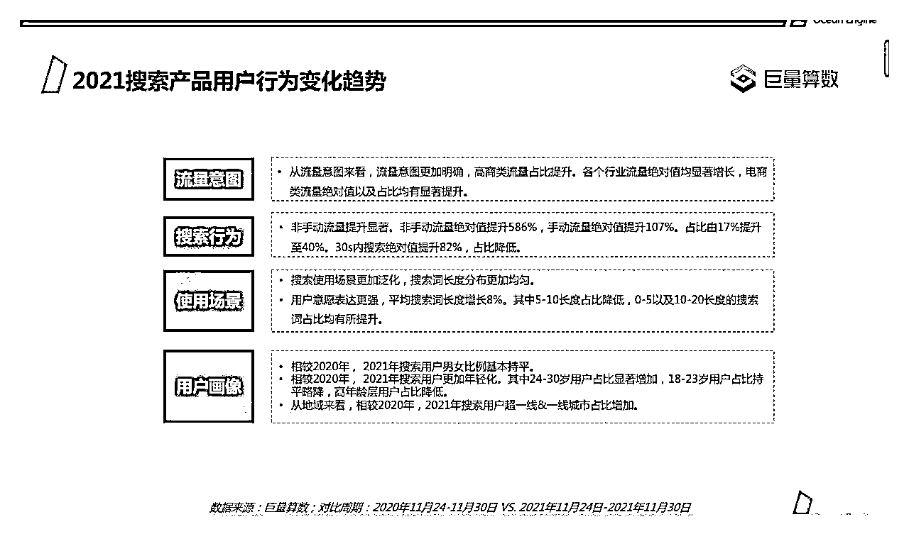

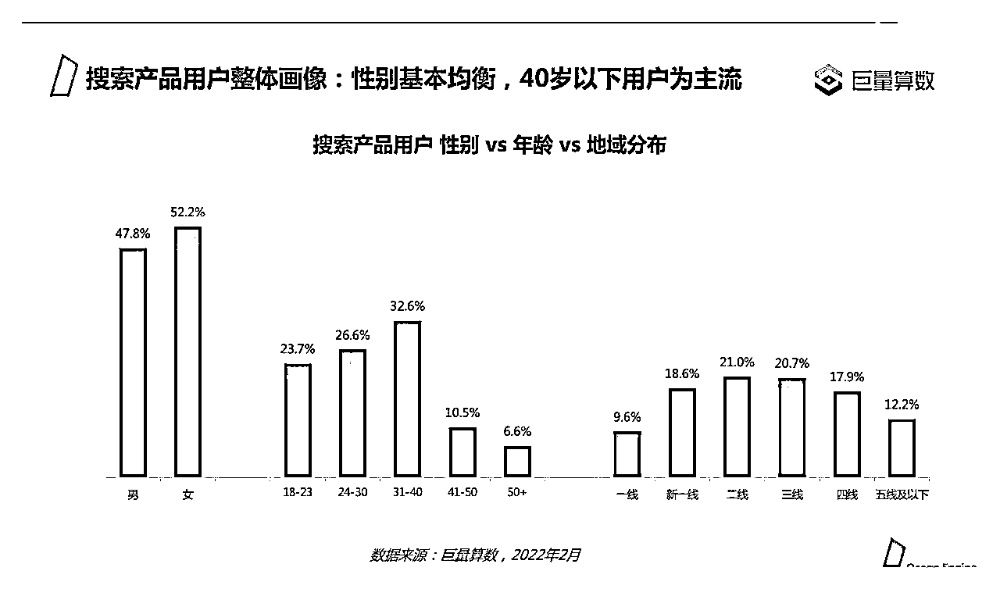

2、抖音搜索是蓝海市场

红海是需求大竞争大的市场， 蓝海相对来说是需求大竞争小的市场。

抖音目前有 2 个比较大的流量入口，分别是「推荐流量」和「搜索流量」，目前「推荐流量」的竞争度正在越来越卷，比如考核指标有 5 秒完播率、 2 秒跳出率、互动数据等等。但是从上面官方的数据增长率中可以看出，目前抖音的「搜索流量」竞争还较为蓝海，至少大部分的关键词都是蓝海词。

接下来我们分别从「词」的竞争度和「人」的竞争度 2 个维度进行查看。

1）词的竞争维度

根据我们自己研发的「极客增长」工具中的数据统计显示，在 2600 万关键词中，其中搜索量大而竞争小的数据有 1831 万条，1831 / 2635 = 69.4%，接近 70% 的蓝海词。

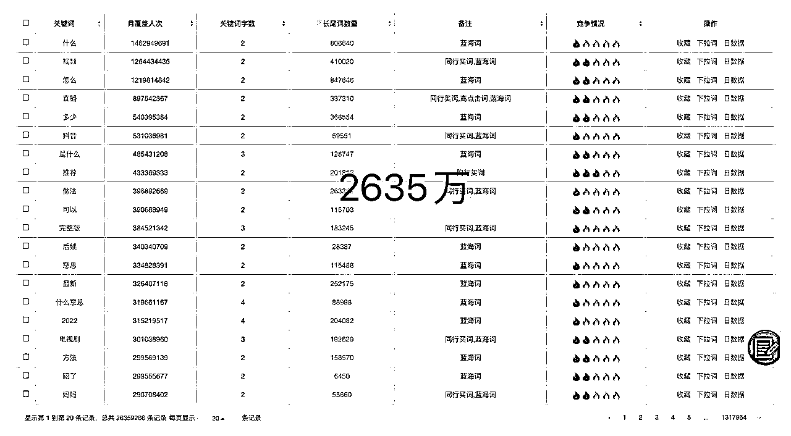

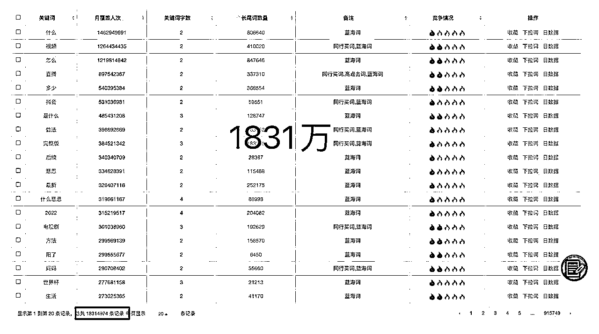

2）人的竞争维度再从「人」的角度看，在我们统计的 5000 万条抖音 kol & koc 中，通过对 2000 万博主视频的数据进行采样数据发现，99% 的抖音博主都不懂 SEO ，他们作品中的标题和话题均较为简短或者无意义。

总体而言，我们可以从搜索上发现很多蓝海机会，比如下图：

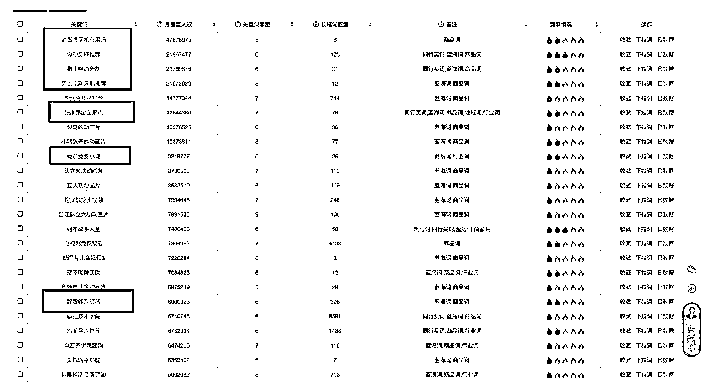

通过工具，一下子就发现了很多有价值的蓝海机会，如“男士电动牙刷推荐”这个词，月覆盖人次 2157 万，竞争度为 2 ；比如“番茄免费小说”这个词，月覆盖人次 924 万，在系统竞争度也是 2。还有大量有商业价值的词可以挖掘。

举个例子来说，去年我们专门做了一个基于抖音 SEO 的旅游账号，虽然一年没有更新了，每天还有 1000 的搜索曝光，并且 93% 的播放都是来自搜索。

点击蓝字可直接进入主页：涵涵在杭州的主页 - 抖音 1662106409518540.mp4【在线播放】

1662106588939932.mp4【在线播放】相比较自然流量需要每日维护更新内容、付费流量成本高，抖音搜索流量的优势在于：

竞争小：目前还属于流量蓝海洼地蓝海，提升排名还比较容易；见效快：小词正常 1～5 天即可见效，快速出效果，大词 1 个月可以见效；

成本低：不需要每日更新视频，只需要每个月更新视频，围绕一个词每个月更新一个视频；

更精准：用户意图明确，成交概率更高；不违规：都是正常的操作手法，无需违规。

## 1.3 什么是抖音高客单项目

一般来说，成交价 4 位数以上的都能算作高客单价，再结合我们的生活工作想想，不论是线上还是线下，我们是不是都见过许多高客单项目？

抖音作为日活超 7 亿的国民级应用，流量池不容小觑。数据证明，除了低客单，高客单在抖音也能卖的如鱼得水。越来越多的线下项目、高客单项目把销售场景在抖音上重塑。

三一重工在抖音上卖卡车，一场直播 GMV 超 5000 万；

新东方烹饪学校在抖音上招生，抖音的生源占全渠道的 35%；众多律师开启抖音普法吸引客户；

线下代办商家到抖音卷流量招客户；香薰蜡烛培训班在抖音直播招生……

相较于复杂的线下营销，抖音的销售场景更为简单，不需要实体搭建、不需要电销员工、一个人也能轻松搞定。

抖音高客单项目适合什么样的人？

有实体经验，希望把线下销售场景转为线上的人

愿意研究项目，对挖掘高客单项目机会、线索有意愿的人执行力较强，热爱短视频和直播，期望通过抖音变现的人

——以上三者满足任意一个即可

## 1.4 抖音 SEO 与抖音高客单项目

在我们的实践过程中发现，抖音高客单价产品更适合抖音 SEO，原因有以下几点：

1、单客户价值大。

高客单价产品一般单客户价值在四位数以上，通过抖音 SEO 获取精准客户，能更好地降低获客成本，同时每获得一个客户，就能获得不错的收益。

很多高客单价项目的客户，获客成本都比较高，而学会抖音搜索的方法，可以最大程度降低成本。加上抖音搜索的长尾效应，收益数据非常可观。目前做高客单价项目的学员，收益都在几到几十万不等。

2、适合精细化选词。

大部分高客单价产品的客户需求是已有需求，而不是触发型需求，对客户的精准度要求比较高，一个精准客户抵得过 100 个泛流量，所以玩法也跟低客单价不一样，刚好很适合抖音搜索的精准选词玩法，切合用户需求，匹配精准用户。

3、搜索用户匹配度高。

大部分客单价产品，用户的决策路径相对较长，需求多方收集资料和信息对比后才能做最终决策。所以搜索是他们必不可少的一个行为路径，而抖音作为目前日活最大的搜索入口，是很多用户会作为参考的一个指标，假如用户搜索后能在你这里获得满意的答案，那么选择你的概率也会增加。

比如你买一个几十块钱的东西，你可能直接就电商平台下单了，也可能是看到一个推送就下单，但是如果买的是一个几千块钱的东西，自然会进行多一些比较，这个时候，搜索就是影响用户心智最好的方法。

# 二、如何挖掘抖音蓝海高客单项目 @安神

💡章节概要

在学习抖音高客单项目如何做 SEO ，如何引流变现之前，有一个重要的前提，就是你找到了适合自己的高客单项目。挖掘项目比引流重要的多，千万不要本末倒置，一定是先有了项目，再去倒推你要做什么类型的流量或者什么样的人群，哪怕是你只有一个变现的雏形，不要让流量成为了你的负担。

所以在这一节，我们将先了解四个挖掘蓝海高客单项目的思路。分别是：

✅思路一：通过问题看到需求

✅思路二：通过已有项目延伸

✅思路三：做高客单项目的中介✅思路四：通过选词工具找项目

接下来我们就一起来看看具体如何挖掘项目吧。你也可以将本节内容结合后面的项目案例库，找到自己能做、愿做的项目方向。

我们在精力有限的情况下，需要快速的得到正反馈，只要精准流量、高转化，特别是这种高客单的项目，往往考虑最多的就是粉丝价值，不要去一味的追求大流量。平台内容同质化带来的就是流量越来越难，我们要尽可能的服务好每一个你引流来的粉丝。

## 2.1 思路一：通过问题看到需求

我自身在做电商的过程中，遇到了很多问题，其实自己解决这些问题本质就是在解决一种需求，其他人（同行）也一样会碰到。

比如我做虚拟商品、微商产品，做电商的朋友都知道，最容易犯的就是侵权的问题。这里的侵权包括故意和无意，但不管是哪一种都要去解决处理。

同时这里又分为了 2 个角色，1 个是被投诉方，1 个是品牌方，被投诉方需要寻求申诉方法，品牌方需要持续维护线上市场，包括不限于淘宝、PDD、JD、抖音、快手，这些平台都有自己的知识产权平台供品牌方维权。

目前卖家违规后市场上申诉 1 次的收费大概在 2000 左右（也有大几千的，看店铺的等级、销量），有的申诉是通过平台规则、法律法规（商标法、著作权法、裁判文书网案例等）来正规抗辩，有的是通过 “特殊” 方法制作各种品牌方全链路的授权资质。

无疑第一种方法基本是没有成本的，就是对于平台规则、法律法规的理解，但是因为是正规抗辩，基于卖家所谓商品势必成功率就有了很多的局限性。

而我把这个做成了一个持续更新的案例库，用来在抖音作为钩子引流，因为这些个经验很多人是不会去讲的，而我偏偏把这个很多的部分拿出来做了分享，让大家觉得真诚。

我目前打算做一个社群，比如 299 元包括 1V1 的咨询解答 + 1 年的社群答疑 + 持续更新的案例库，然后通过社群再去转化第 2 波流量的高客单。

跑通申诉方法以后，前前后后我是用 2 年时间，学习掌握了这些所谓的品牌方维权方法（实际上都是第 3 方代理的控价公司在操作，这个是一个极需技巧和经验的行业，这些个品牌维护公司，一般都在知乎引流，而我为了学习也花了大几万购买过他们的不同服务）最终带来的直接效果就是在某某电商平台你可以很容易的做到 Top1 ，甚至垄断某个单品或者某个大的搜索词，当然前提是你有商标、著作、专利等，或买租、或授权、或自己注册。

这个就是我在抖音知识付费的定位、赛道也只选择了淘宝平台，我不是法务工作者，也不是律师，也不是这个行业里那个最厉害的人，只是基于自己本身的业务的周边演化而来的，常规做电商流量都是补单、开车等，而我是通过另一种方法帮助小个体去拿流量，顺便学会侵权申诉。

怎么样，是不是觉得，一个赛道的选择还挺不容易的。需要自己去掌握一个很基础的技能，当然这样是最容易上手的，但其实也不是这样的，我刚才说过我每年也会尝试一些其他的私域项目。

## 2.2 思路二：通过已有项目延伸

我有 7、8 个的抖音、快手、小红书账号，有男账号，有女账号，有老人年，有年轻人的，为的就是让平台按人群给打上标签，去看看这些人群都喜欢看什么，我基本上所有的项目都是刷出来的，就是一个看， 从自己身边开始发掘。

## 2.2 思路二：通过已有项目延伸

我有 7、8 个的抖音、快手、小红书账号，有男账号，有女账号，有老人年，有年轻人的，为的就是让平台按人群给打上标签，去看看这些人群都喜欢看什么，我基本上所有的项目都是刷出来的，就是一个看， 从自己身边开始发掘。

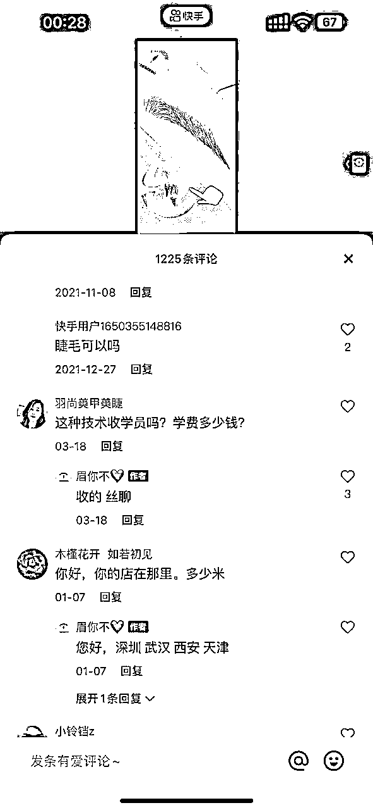

这里面可以切入的点，就是卖线索和线上课，其实这个东西，很多的美容机构都有在做，比如雍禾，但是他们主要业务还是是植发，不是专门做这个，我透个底，这个事情和很多机构合作起来不复杂，感兴趣的小伙伴可以了解一下。

传统的纹绣大家并不陌生吧，我之前做过这个，在淘宝店铺引流，然后卖线索给线下机构，他们在微信群里销售高客单（ 3000 到 1w 多不等）技能培训。

我自己一方面淘宝单店卖教程每个月收入大概有个 4 - 5w，同行都是卖的十几元、几十元的，而我当时卖的客单价是最贵的 199 元的，就是把市面上所有的课程买来后整理、筛选、分类。二就是卖给机构的一个线索几十元。

这个项目的背后其实就是切的一个细分的人群，她们是一群想创业的女性，而纹绣已经到了甚至不需要门店，只需要一套设备就可以上门做了，这些群体只要做好同城的线上引流就行了，但是单纯的线上视频你是根本学不会的，视频里你也只能掌握需要投入多少成本、什么设备，大概的操作流程和手法，还是必须去机构。

你看，是不是植眉就是类似纹绣的升级版，纹绣都是半永久的，一般需要过个一年半载就需要去重新纹一次，而纹绣本身就是一种轻微的创伤，而且也没有自然毛发的自然，大城市做一次它的价格也在大几千甚至上万，而种植是即可效果，永久性的，虽然贵了一点，但是人群都是高净值的，很容易转化。

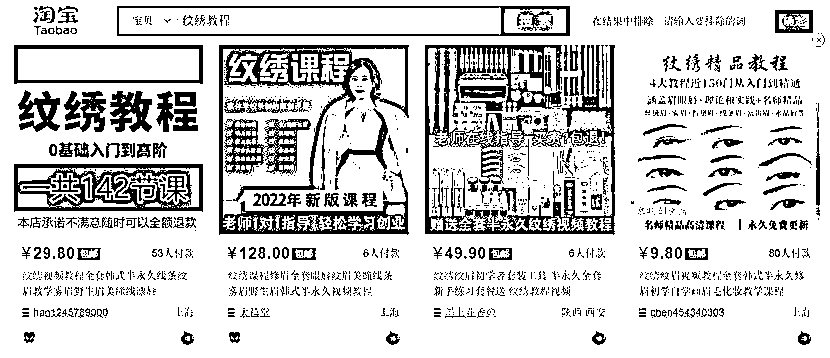

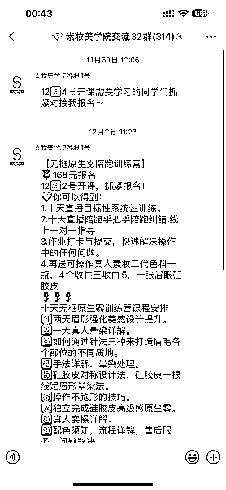

## 2.3 思路三：做高客单项目中介

其实早在生财手册里分享的案例库之前，我就早早注意到了这个做离案公司注册、维护公司（类似国内的年审、代记账服务）

的账号。这个账号大部分是分享的香港公司，因为很多做跨境的都是需要注册香港公司的，而我因为在淘宝做虚拟服务项目，也注册了美国、英国、香港、新加坡等国外的公司。

比如，你通过猪八戒注册一家英国公司的费用在 3900 元，每年的维护费用在 3500 元，可以是你知道吗，我在 fiverr 找一个本地的代办注册的英国公司，也就是 60 美元就可以了。

专业的事情，交给专业的人去做。你不用去研究，他是怎么搞定注册地址、电话之类的，其实就和我们国内注册个体工商户、食品许可、二类医疗器械许可一样的代办服务，相关部门对地址可能根本不去实际核实的，除非你开银行对公账户。

你只要利用好引来流量 + 这个信息差就足以了。何况还有每年几千的维护费，只要这些公司还在运作。

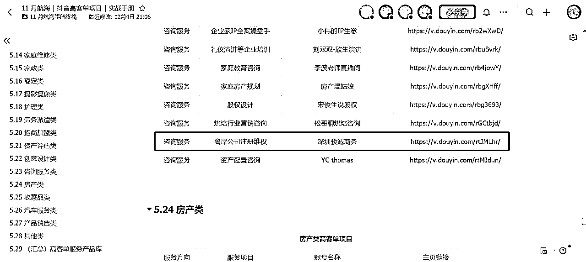

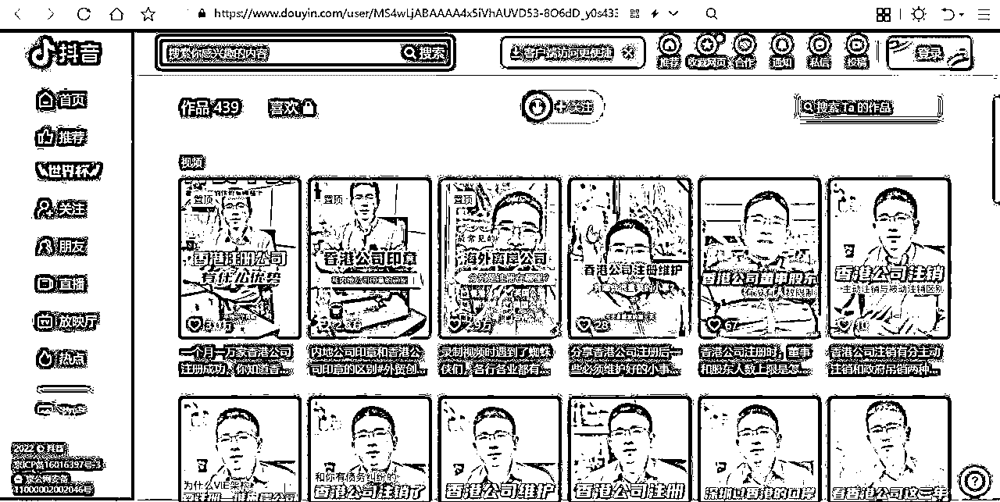

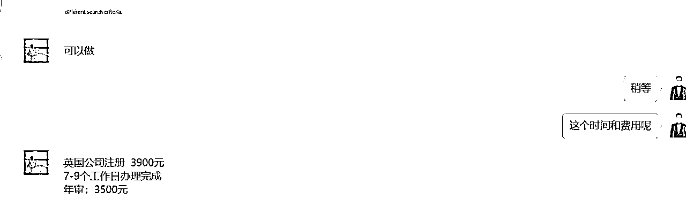

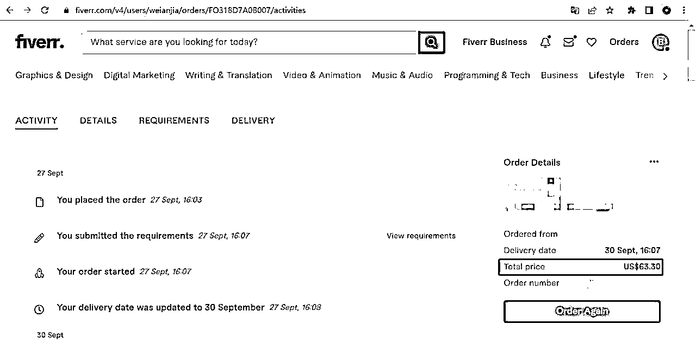

那我通过这个再延伸一个项目给大家，也是我自己调研的哦。一单的利润在 4000+，就是国外公司文件在国内使用时是需要做领事认证的，领事馆是没有任何的第三方代理机构的，费用也不过几十美元。

但是因为这个事情自己去办理又比较生疏，所以就有了这个需求。而国内的很多这种所谓的代办，价格之间相差 1000 多元，本身就已经是一个信息差了，知乎上很多引流的都是倒爷。

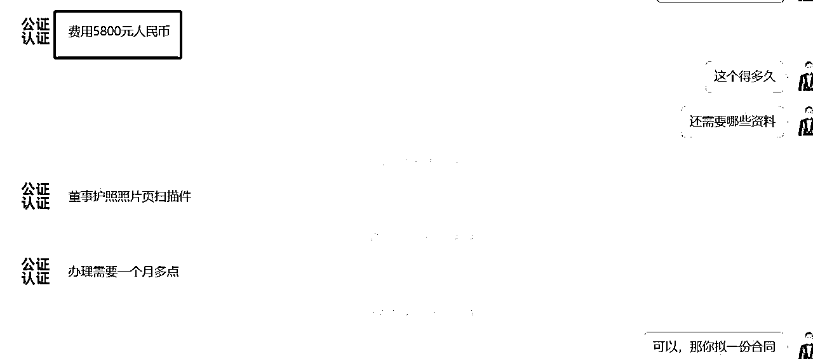

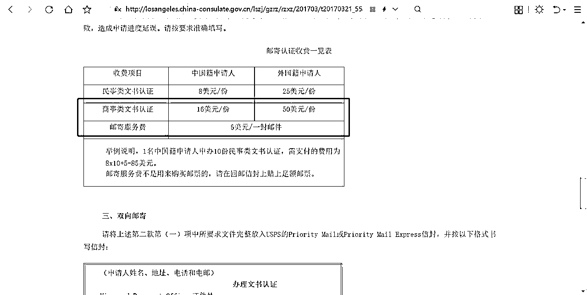

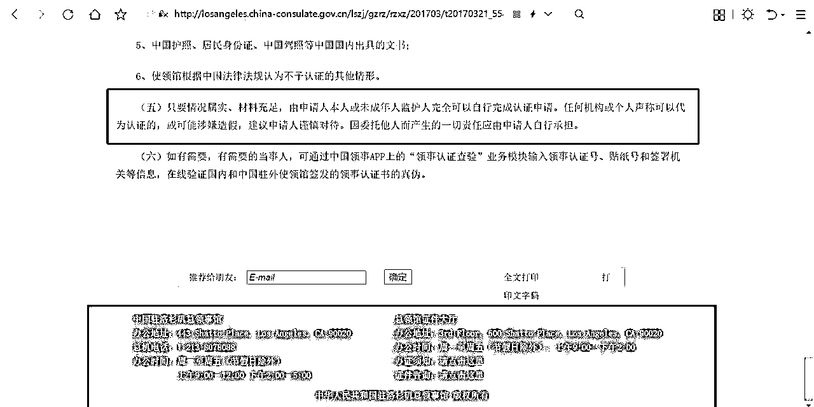

国外的文件在国内使用需要认证或者公证，而国内的文件在国外使用同理。具体还有哪些可以做的，大家去这里细品吧，希望能找到贴合自己的：http://losangeles.china-consulate.gov.cn/lszj/内容来源：《如何挖掘蓝海高客单项目》

## 2.4 思路四：通过选词工具找项目

其实高客单价的项目，小部分靠挖掘，大部分已经存在，于是我们可以通过特定的领域关键词，去挖掘高客单价的需求，从而更好地找到细化的方向。

极客增长大数据选词工具，为大家提供了商机挖掘模块。接下来演示一下如何通过这个模块挖掘高客单需求。

1、根据已有行业词根挖掘商机我们以心理学为例，直接打开极客增长个人版选词工具，搜索词根“心理”，会看到以下词库。

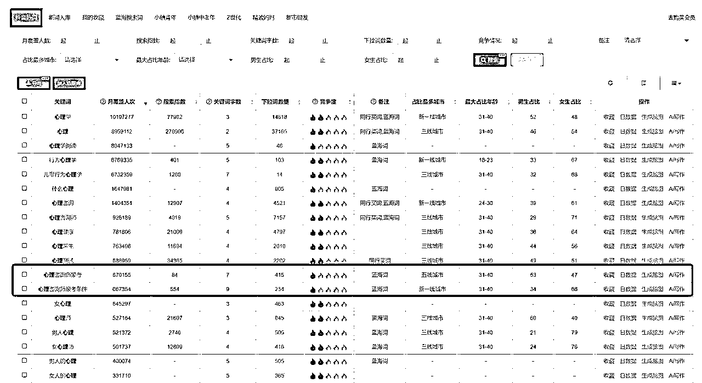

然后根据月覆盖人次排序，我们就能看到搜索心理相关最火的关键词，这个时候我们浏览一遍词汇，发现了一系列商机，比如心理咨询，心理测试，都是比较常见的，然后我们还发现了一个跟高客单价相关的词，就是心理咨询师报考。

如果对心理学有点了解的人会知道，心理咨询客单价基本上 300～800 元/小时，但是大部分咨询师年收入不超过 5 万，说明这目前不算是个很优质的项目，其中的坑只有踩过的才知道。

但是，心理咨询师报考就不太一样了，有心理咨询的需求的人，能去做心理咨询的不算多，但是能去学习心理学，报考心理咨询师的人却一大堆，目前这个市场已经没有国家认可的咨询师证可以报考，那么对于想赚心理咨询培训的人来说是个机会。大部分心理咨询培训的客单价在 3000～100000 左右，确实是个不错的商机。

以此类推，不仅是心理行业，类似的行业也可以通过关键词去挖掘。

2、根据需求词挖掘商机

我们以极客选词工具中的商机挖掘模块为例，词属性筛选“怎么”，关键词字数筛选“5”，然后看看出来的相关需求。

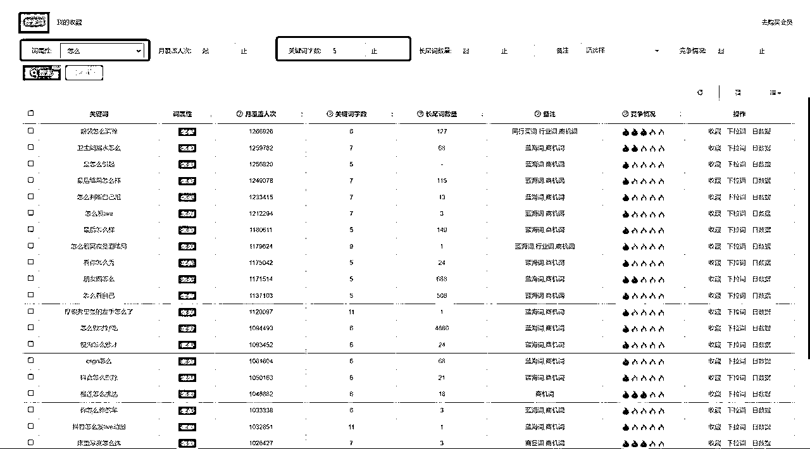

我们可以很清楚地看到，眼袋怎么消除、卫生间漏水怎么办、床垫厚度怎么选，都可以是高客单价的生意，背后代表的是美容人群、装修家居人群等等，都可以挖掘出相对应的高客单价项目。

传送门：https://dyinseo.com/DouyinKeywordBusiness/index.html

## 2.5 高客单项目案例库（含 230+ 案例）

我们结合了解到的高客单项目方向，为大家整理出了一批可执行的项目方向，并在抖音上找到了从事该项目的抖音账号，供大家参考。

为什么要这么做呢？因为行业千千万，我们无法给出每个行业、每个项目的执行细节，只能在前文中给出常规的方法总结。而落地到具体项目上，还需要你自己填充细节。

例如，落户代办需要准备哪些资料？你需要提前了解哪些信息？可办理的时间是什么时候？

再例如，二手拖拉机租赁服务如何找合作商？如何商谈上端与下游价格？租赁协议如何填写？

……

诸如此类的资料，希望你在找到方向后自己寻找并学习。而我们能做的，就是为大家提供一些可选的方向建议，也就是这份案例库。

服务方向：即这个项目属于哪个大类别，例如线下代办、二手贸易、教育培训等

服务项目：即具体可执行的项目，也是这个项目的关键词。你可以根据这个词去寻找各类资料，组建起你的服务体系账号名称：对应项目在抖音上的案例账号

主页链接：案例账号在抖音的主页链接，可以跳转学习

内容来源：2 月航海｜抖音高客单项目｜实战手册

# 三、抖音 SEO 算法排名原理 @令狐峰 @Hawli（李小随）

💡

章节概要用户流量在哪里，商业机会就在哪里。知道了抖音 SEO 目前存在的巨大价值空间后，接下来让我们通过 14 个问题，快速了解一下抖音 SEO 的算法排名原理：

✅ 认证账号

✅ 核心关键词

✅ 粉丝和话题权重✅ 发布时间

✅ 作品类型

✅ 标题内容

✅ 内容收录

✅ 作品互动数据✅ 用户搜索后打分

✅ 提升关键词排名

✅ PC 端和手机端

✅ 作品封面

✅ 抖音矩阵✅ 千人千面

我们需要知道一件事：只要按照抖音 SEO 算法的喜好，发布的每个视频，多花五分钟做好细节，就可以抢占抖音的搜索流量。

大家一起加油吧！

## 3.1 认证账号

问题：账号是否认证对排名会有影响，哪种账号的排名优先级会更高？

选项 A：蓝 V 号和黄 V 号（蓝 V 号是公司认证，黄 V 号是个人认证）

选项 B：普通个人号

正确答案：A 搜索关键词后，选择用户列表，可以看到一些常见的、有价值的搜索词，排在前面的大多都是蓝 V 或者黄 V ，没有加 V 的用户相对较少：

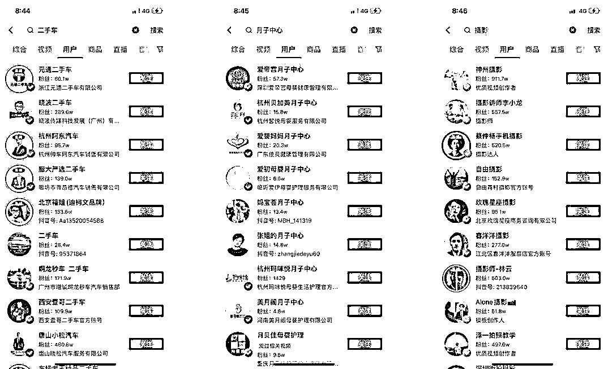

搜索一些竞争度高、可以变现的关键词，基本上也都是蓝 V 或者黄 V ：

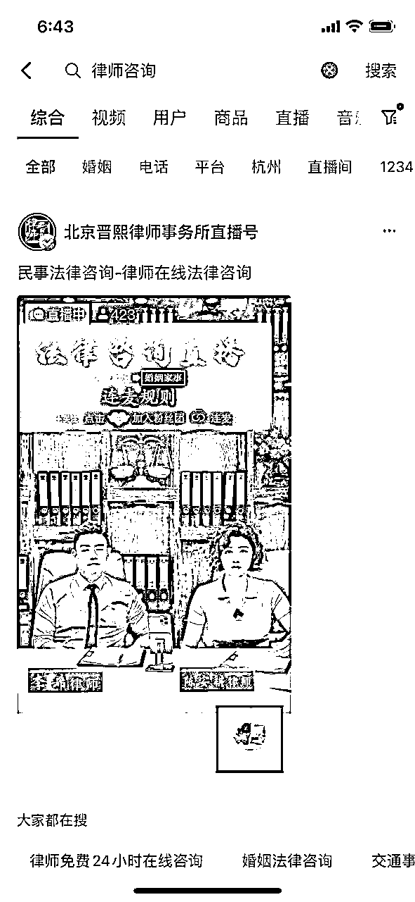

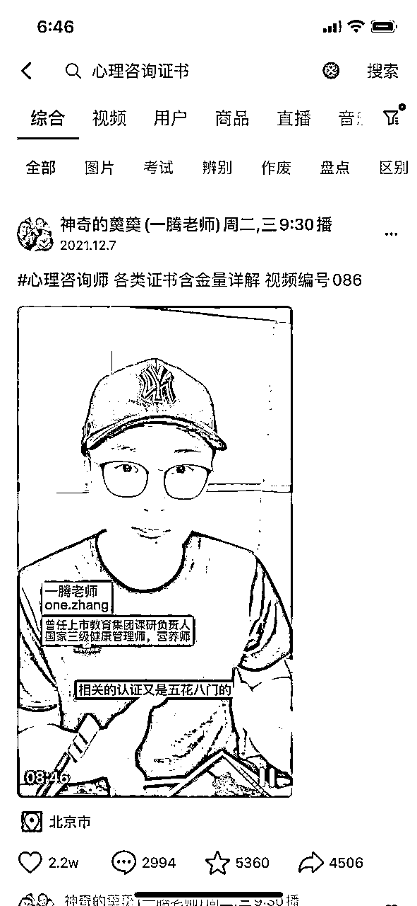

为什么都是蓝 V 或黄 V 呢？因为蓝 V 和黄 V 的权重比较高。

我们知道，在某些领域没有黄 V 是讲不了相关内容的，比如医疗行业，有大量的话题是要有医生资质才能讲。黄 V 代表专业，有门槛，能降低平台的风险。而蓝 V 是企业专属，背后有公司做背书，安全性更高，也降低了平台的风险。因此平台会把账号是否认证作为一个参考因素。

## 3.2 核心关键词

问题：其他条件都不变，内容也一样的情况下，哪种号的排名优先级会更高？

选项 A：账号名称带上想要优化的关键词

选项 B：账号名称不带想要优化的关键词

正确答案：A 带关键词的内容，更能够帮助平台识别和精准推荐。尤其是做直播间抢占搜索流量的时候，名称会起到比较大的作用。

下面这几张图中，前二张图中，名称是包含关系或者同义词关系你可能会好奇第三张，针对「心理咨询证书」这个关键词，账号并没有带对应的优化关键词，排名为什么也在前面？

因为权重元素并不是唯一的，一共有 12 种排名因素，所以并不绝对，只能说这个词竞争还不够激烈：

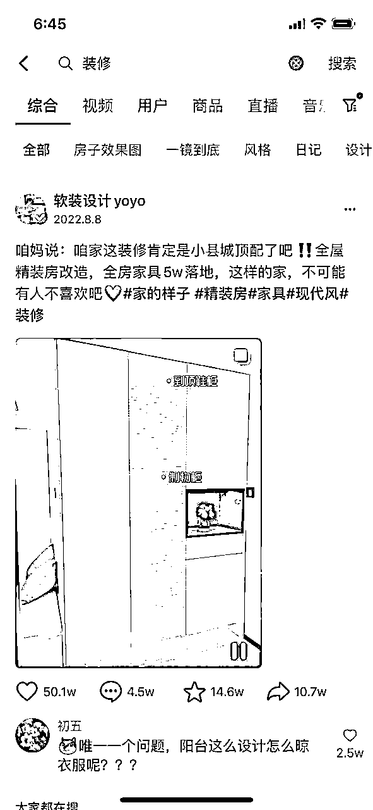

12 个优化排名细节：

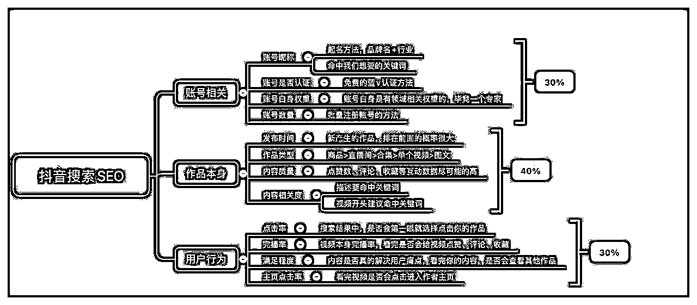

## 3.3 粉丝和话题权重

题目：账号粉丝和话题权重哪个更重要？

选项 A ：粉丝数优先

选项 B ：话题权重优先

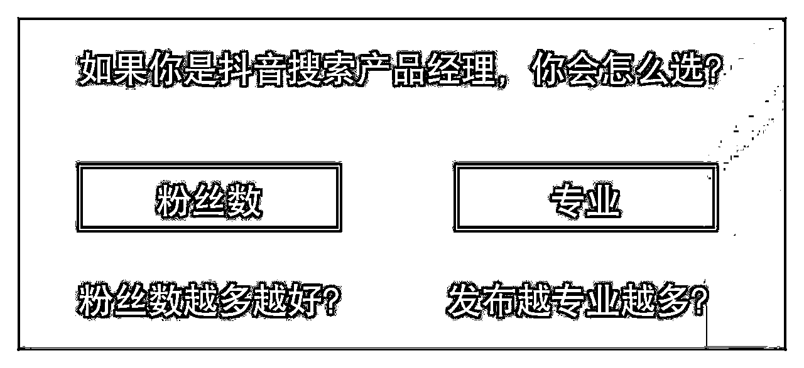

正确答案：B

话题权重优先、然后才是粉丝数。

因为粉丝数多了，领域就会泛，略懂和专业的区别是一个在珠穆拉玛峰的腰部，一个是顶峰。这也就是说：你在一个话题下面的获得的赞同数越高，你在该话题下面的排名就越高。

但是粉丝数也很重要，粉丝数的高低也代表用户对博主的喜欢程度。只能说话题权重高于粉丝数，看到别人的粉丝数高也不用害怕，在垂直领域内多发内容，别人是干不过你的。

如果你的产品是泛流量，比如鞋子、衣服这种消费品，并且喜欢直播间转化。可以考虑买一个几十万粉丝的号，也是性价比比较高的一件事情。

## 3.4 发布时间

问题：发布时间的对排名有没有影响？

大家思考一下：一条内容发布时间新和旧，它们二者之间的区别是什么？

正确答案：信息的准确性

因为时间不同，原本正确的信息，现在不一定继续正确了。比如你写一个产品教程，但是这个产品一年后改版大变样了，原本的信息就不再实用了；再举一个例子，你是卖二手车的，这辆车已经卖掉了，信息也无效了；而信息的准确性和及时性会直接影响到用户体验，抖音最在乎的就是用户体验，这个是它的立身之本，所以时间维度也很重要。

在研究抖音 SEO 的过程中，很少看到 3 年前发布的视频，最多是半年内、 1 年前或 2 年前的视频。

因为有时间的维度影响，所以很多词现在是竞争度高的，如果没有大数据作为支撑，过了一年，反而可能不激烈了。

但是大家也不用过于担心，我们后面也会讲如何延长排名的方法。

当然，抖音更新排名的变化很快，甚至有时候会达到一天一个变化，并且可能会出现轮流展示抖音搜索结果的前几条，用来进行搜索结果的 A/B 测试，也就是我们所说的“千人千面”。

## 3.5 作品类型

问题：下面六个类型，在不考虑内容质量的情况下，权重分别是怎么样的？

1）商品（团购）

2）直播间

3）小程序 4）视频合集

5）单个视频

6）图文

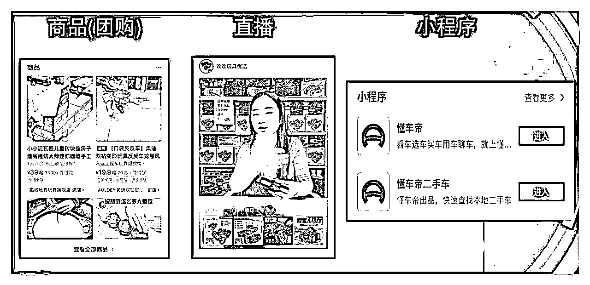

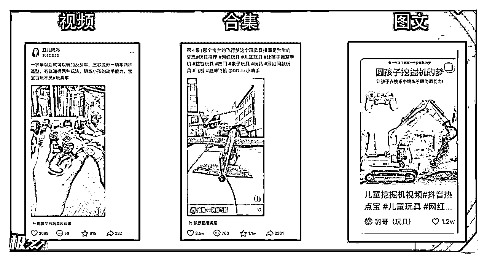

正确答案：1 ＞ 2 > 3 ＞ 4 ＞ 5 ≥6 商品（团购） > 直播间 >小程序> 视频合集 > 单个视频 ≥ 图文

理由是什么？

在不影响用户体验的前提下，尽可能的去商业化。

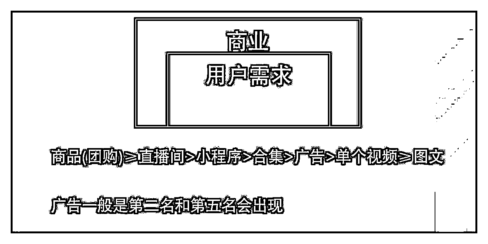

电商是抖音的核心，并且能给商家以及自己带来利润，能赚钱并且能推荐词的卖货词只占一小部分，能卖货就尽量卖货；直播间也是能卖货的，并且能够完美的实现人货场，可以实时互动，解答用户的问题，直播间转化率也非常高；视频合集是算合集下面所有视频的点赞、播放、评论、收藏等数据；视频的优先级比图文高，这个不用讲，大家应该都了解。

## 3.6 标题内容

问题：标题一定要命中关键词么？

正确答案：是（关键词的同义词也可以，但最好是关键词本身）

你想做哪些词的 SEO ，比如想做「录屏软件」这个关键词，就一定要在合集的标题、视频描述、话题、视频中命中这个关键词。这样对抖音的算法很友好，算法不用揣摩你视频到底在解决什么样的问题，一来对用户很友好，二来可以看到自己的搜索词。

关键词要出现在这几个地方出现超过一次：作品描述是否包含关键词

作品内容是否提到关键词作品合集是否包含关键词，合集的描述

作品话题是否包含关键词

作品封面是否包含关键词

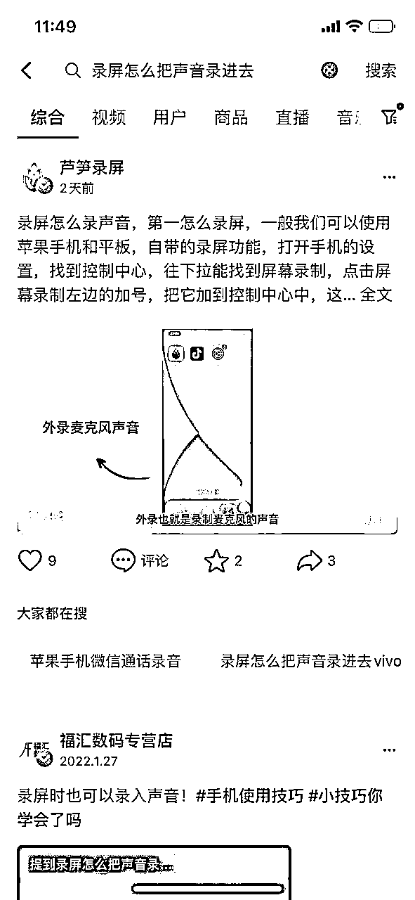

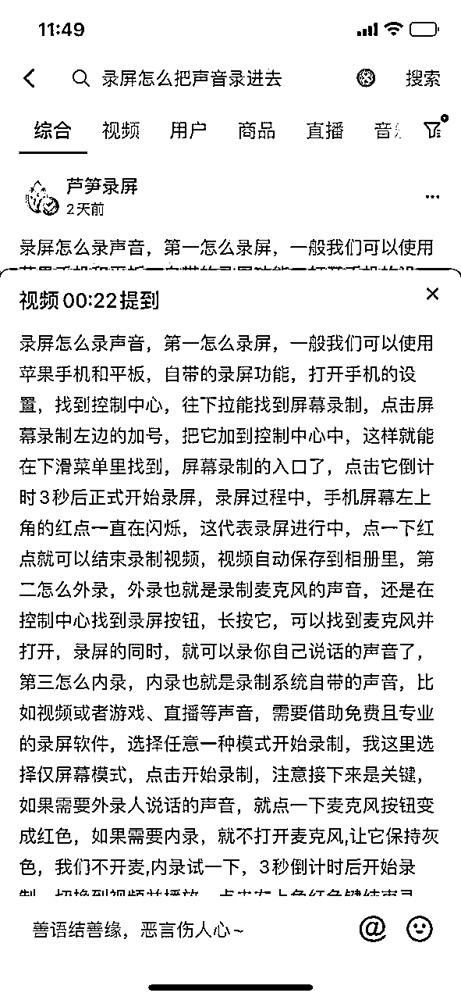

在描述中加话题有那些好处？

你会累计这个话题的权重，做排名更容易；有了话题，排名会更加好；

同时可能可以蹭到对应话题合集下的一些流量；话题最多添加 5 个，并且不要添加与内容无关的话题，会影响推荐流量。

注明：如果是学课程之前发布的视频，没有注意 SEO 的事项，可以选择图 1 中的修改标题，进行优化，搜索流量就会涨起来。

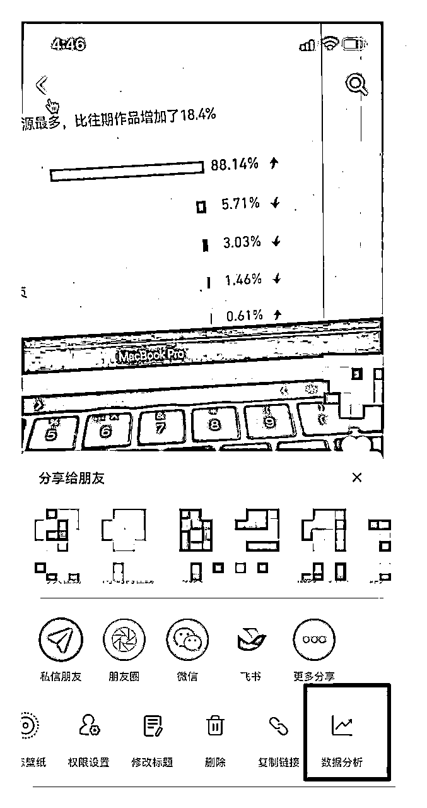

30 天内发布的作品，在手机端还可以修改自己发布的标题、话题、封面等内容。

如果超过 30 天，则需要到抖音创作者中心，电脑端进行修改：https://creator.douyin.com/creator-micro/home

## 3.7 内容收录

问题：发布的内容如何被收录到关键词的搜索结果？

正确答案：相关性算法和用户喜欢程度

1）相关性算法

在百度的算法中，有一条相关性算法，判断文本的内容是否与搜索词相关，比如在你在百度中搜索刘德华的老婆，搜索结果必须是「朱丽倩」，不然答案是不正确的。这个就叫内容相关性的算法。

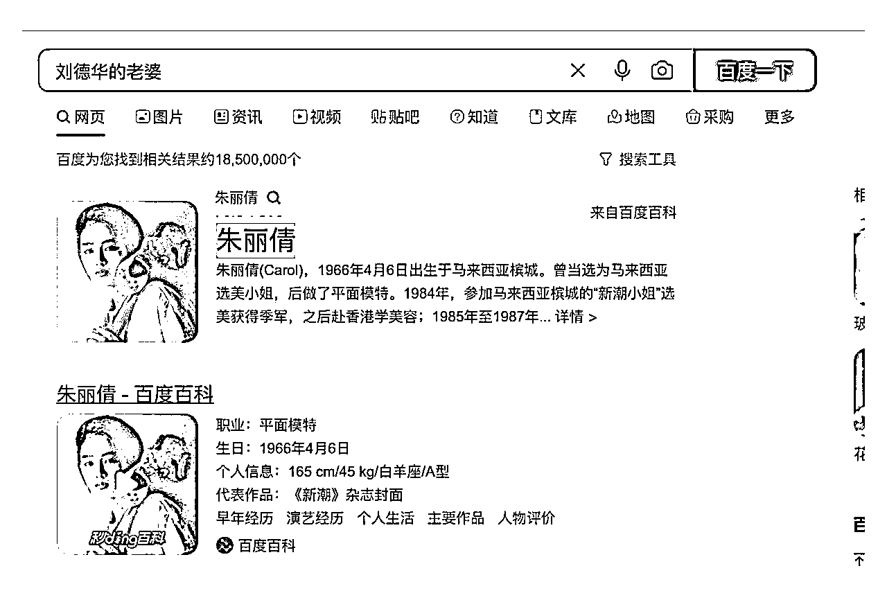

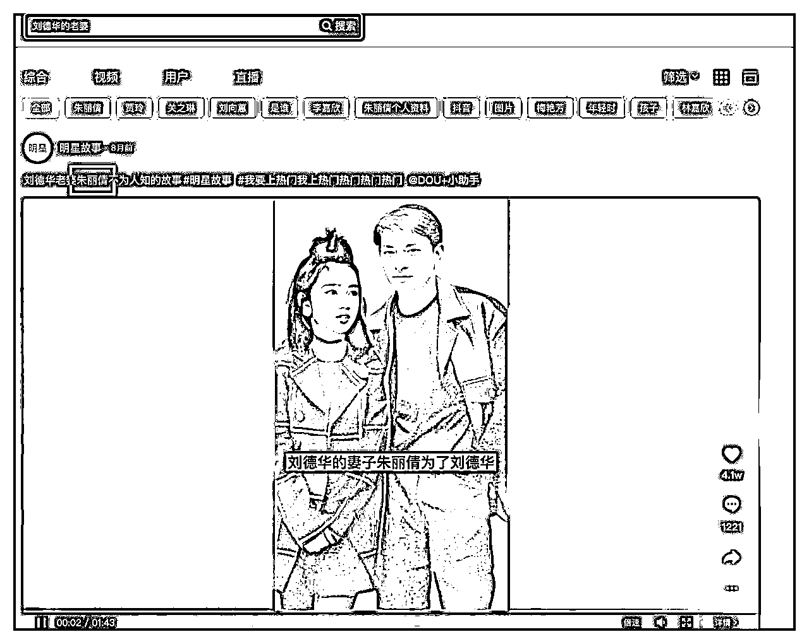

抖音搜索的逻辑也是一样，会根据内容的相关度，进行关键词排名，因此视频内容尤为关键。

如何保证我们的内容既被用户喜欢，又被算法喜欢，最终做出可以获得高排名的内容呢？

方法一：你对这个行业足够了解，可以写出优质的干货内容。这个对部分同学的要求可能会比较高。

方法二：整合抖音搜索的前 5 条内容，取长补短。抖音搜索的前 5 条内容，已经获得了抖音算法和用户的喜欢，那么我们只要把多条视频的内容进行整合一条，就获得抖音算法的认可。

2）用户喜欢程度参与收录的结果，不仅仅要从算法的层面去满足，还有考量用户对你的作品打分。

用户是如何对你的作品打分？最低检测的标准是：用户是否看完前 2 和前 5 秒，2 秒跳出率、5 秒完播率，目前抖音用户已经耐心已经很小，不喜欢的视频可能 2 秒内就会跳出；目前我们测试下来的建议数值：2 秒跳出率要低于 40% ，5 秒完播率大于 50%，整体完播率大于 8% 。

其次检测标准是点赞率，点赞播放比是能否达到 3% 。

达到以上数值的作品，才能更好的参与排名，否则也可能不被收录到搜索结果

3）禁止堆彻关键词

有的用户为了做 SEO，喜欢堆彻关键词，正常我们建议的是，一个关键词，在标题和话题中尽量不要出现超过 3 次，否则可能会被判断为堆彻数据。

这里的不要超过 3 次，是指「标题+话题」一共，尽量不要超出 3 次。

## 3.8 作品互动数据

问题：完播率、点赞数、评论数、收藏数重要吗？

这个问题应该不用多讲，肯定挺重要的，越是竞争激烈的关键词，对数据要求越高。因为完播率、点赞数、评论数、收藏数包含了用户对这条数据的认可，抖音是站在用户的角度去思考的，所以用户赞同的内容，抖音才会推荐。

我们可以通过投放抖+的形式去提高点赞数、评论数、收藏数，来积累作品的得分和权重。

## 3.9 用户搜索后行为

问题：用户搜索关键词后，对作品进行点赞、收藏、关注、评论，是否会对搜索结果有影响？

正确答案：会

之前我们的讲的原理，账号权重和内容权重是基于历史积累，比如你的账号粉丝多，垂直，内容历史点赞量高。

用户打分这项行为是基于大量用户当前的及时性的行为。最近一段时间内这些用户搜索到你的作品，会产生那些行为，更多是近期数据。

抖音会结合历史数据和用户的近期行为数据对搜索作品进行打分，用户近期行为数据有那些？

短视频-比如：点击观看率、点赞、收藏、关注、评论等常规操作；

还有一个比较重要的参数是“问题解决率”，看了你的视频之后，是否还会选择其他的人的视频。如果选择其他人的视频说明了，你的问题没有完全解决其他的问题。这样的数据多了之后，排名也会下降。

直播-比如：

点击进入率、停留时长、评论、礼物、加粉丝团、关注、购买等操作。

商品-比如：

点击率、下单购买、停留、收藏等操作。

总之：用户搜索行为越正面，正面的行为越多，得分则越高。

打铁还需自身硬，把每个细节做好。

## 3.10 提升关键词排名

问题：对于已经有排名了，但是排名比较靠后，如何提升抖音搜索排名？

如果搜索关键词能看到自己的视频了，但是排名比较靠后，比如在第 10 名，如何提升这个关键词的排名呢？

回答：

1）针对视频合集，我们要频繁更新和提升内容质量，积累合集的权重；

2）可以适当投放一下抖加，提高账号和作品的权重；

3）可以换一个更加吸引人的封面可能会有意想不到的效果。

比如这位同学，搜索关键词的时候看得到自己的视频，但是比较靠后，排名第 7 ，通过创建合集积累权重的方式，就排到了第一名：

## 3.11 PC 端和手机端区别

问题：抖音的 PC 端和手机端搜索结果都是一样的么？

抖音电脑端和手机端的排名搜索结果是不一样的，手机端会出现商品、广告等内容，但 PC 端不会出现。

我们举 2 个例子，比如“旅游”，会发现手机端会出现广告，但 PC 端不会：

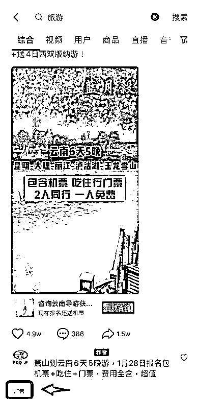

比如搜索“益生菌”，在手机端会出现商品，而 PC 端不会：

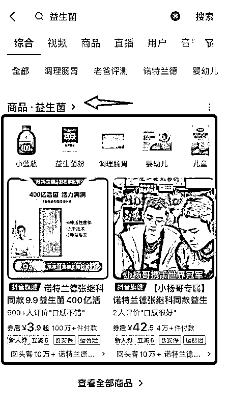

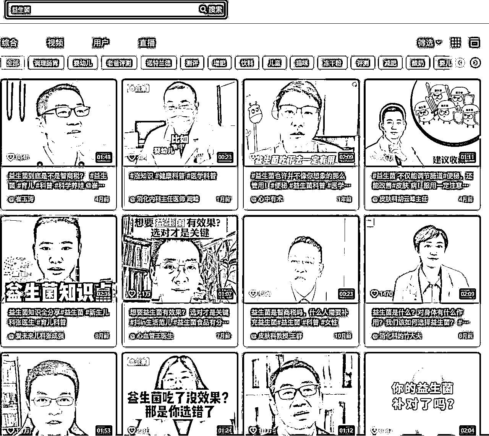

比如说搜“懂车帝”，手机端会出现小程序，而 PC 端不会：

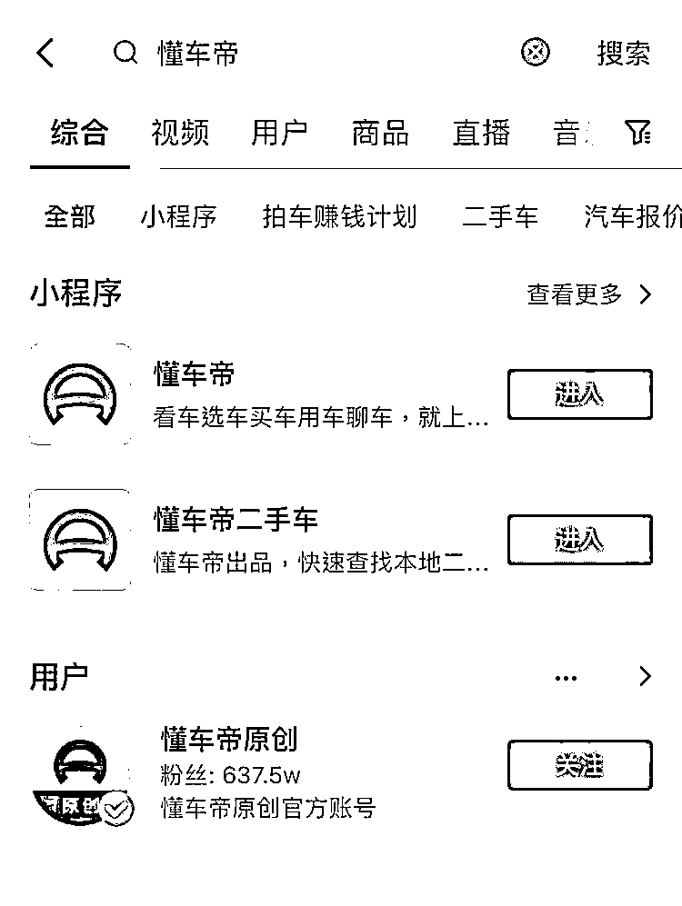

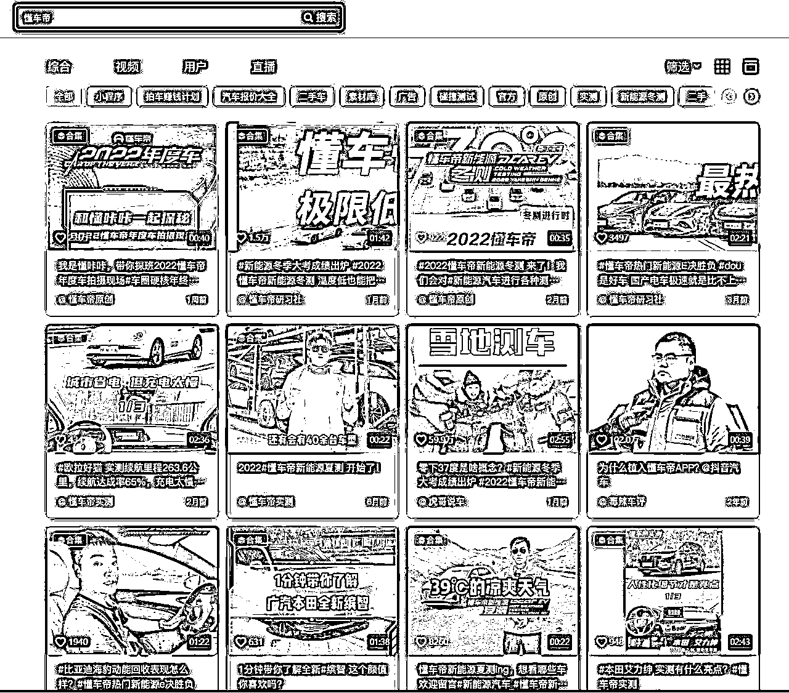

## 3.12 作品封面

问题：作品封面（含开头前 3 秒）对排名 SEO 有影响么？

用户在搜索过程中，会优先点击封面吸引人的作品，会提高搜索结果中“点击率”这个参数。至于什么样的封面吸引人，和行业有关，具体方法就是多搜索多看，多收集。

比如能抢占到“二手车推荐 2 万到 4 万”这个关键词排名靠前的视频，基本上封面都会命中关键词，因为搜索词与展现结果直接

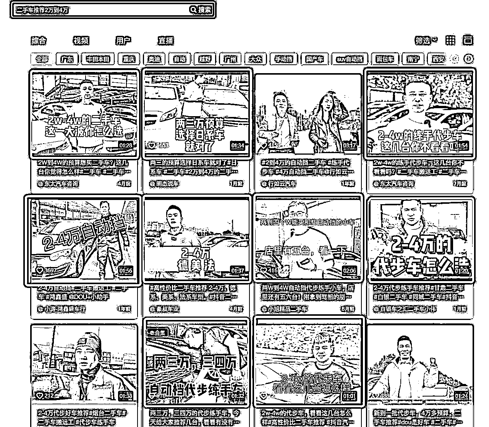

为什么封面会如此重要？

不仅仅设计吸引用户点击，也会涉及到抖音的内容识别算法。

抖音不仅仅会从文字中理解视频的含义，也会识别视频中的文字。具体的操作逻辑就是，视频抽帧检测：会在整段的视频中抽取一定的帧数的画面，来识别文字。

如果你没有提交的封面，那么抖音就会随机取一些截图进行识别。如果你提交了封面，就会识别到你提交封面，封面最好包含 SEO 的关键词。

## 3.13 抖音矩阵

问题：做抖音矩阵有必要么？为什么要做抖音矩阵？

抖音矩阵的核心目的是有 2 个，1 个实现搜索霸屏。何为搜索霸屏？就是搜索结果中都是你的作品。

霸屏有什么样的好处：

1）显示你的专业性，搜索结果都是你，潜在客户会觉得你牛，会认可你；

2）不给展示竞品的机会，不给潜在客户比价选择的机会；

3）分散账号风险的，比如你是做减肥、卖命理服务这种账号的，就需要用矩阵去分担风险。

前期正常情况下，我们只需要做一个账号，抖音一天可以最多发布 75 条作品，基于权重累积这个原理，只做单个账号，可以更好的积累账号权重。

另外 1 个目的突破是人群束缚，有时候你的一个视频在这个账号上发布，不会火，但是换一个账号发布就火了。

这个涉及到推荐算法。总之我们理解为：抖音是有概率性的。

## 3.14 千人千面

抖音的算法是千人千面的，对于竞争激烈的词，尤其是本地生活类的词，不同人的搜索看到的结果可能是不一样，用来测试数据结果。

千人千面具体指的是什么意思？不同的人看到的搜索结果不一样，但是整体一致。

比如说有的人看这条视频的排名是第一名，有的人看则是第五名，不同人看到的展现顺序有可能变。整体搜索结果一致是什么意思？

搜索结果中，展现视频的顺序会发生变化，展现的内容主要还是那些视频，只是排序发生变化。

为什么会有千人千面？

1）有的人看搜索结果是第一，有的人看搜索结果是第十。这是因为抖音有灰测环节，先给你的作品第一名看看数据情况，数据展现不好的话，排名就会下降，数据好的就提升，直至稳定。

比如我们搜团购类型的关键词，会优先推荐离用户近的结果：

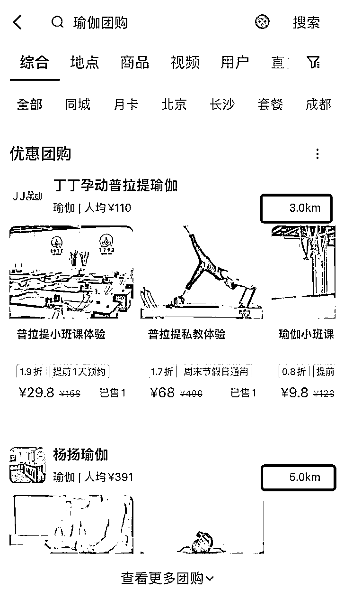

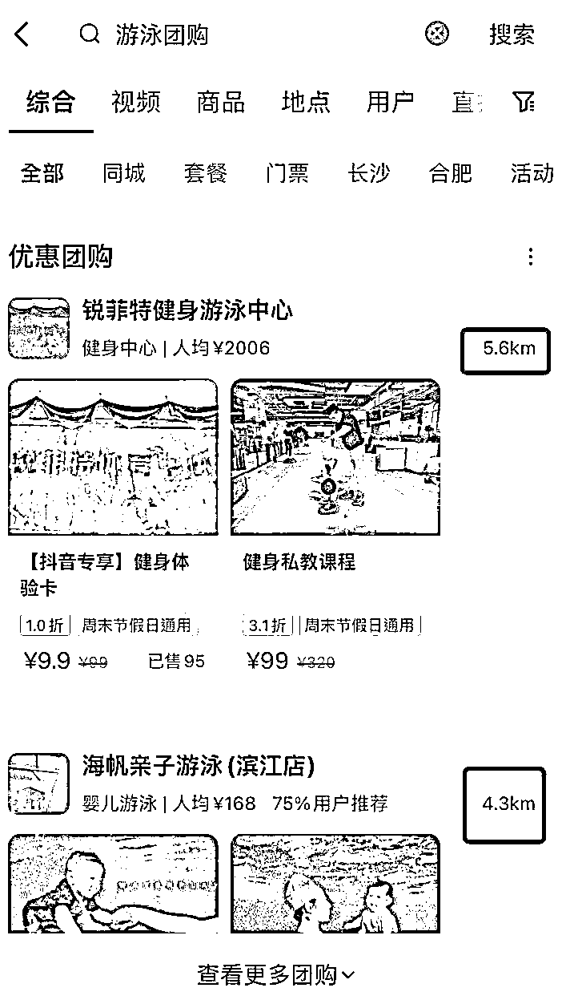

总之：抖音的手机端变化很多，不同的人看到的结果不一样，并且抖音会出现轮流展示索结果的前几条内容，来判断那些内容更能够满足用户的需求。

## 3.15 抖音 SEO 原理总结

抖音搜索 SEO 的排名算法，竞争逻辑是“优胜劣汰”和“蓝海思维”。我总结了一张脑图，将抖音 SEO 分为 3 个部分：账号属性、

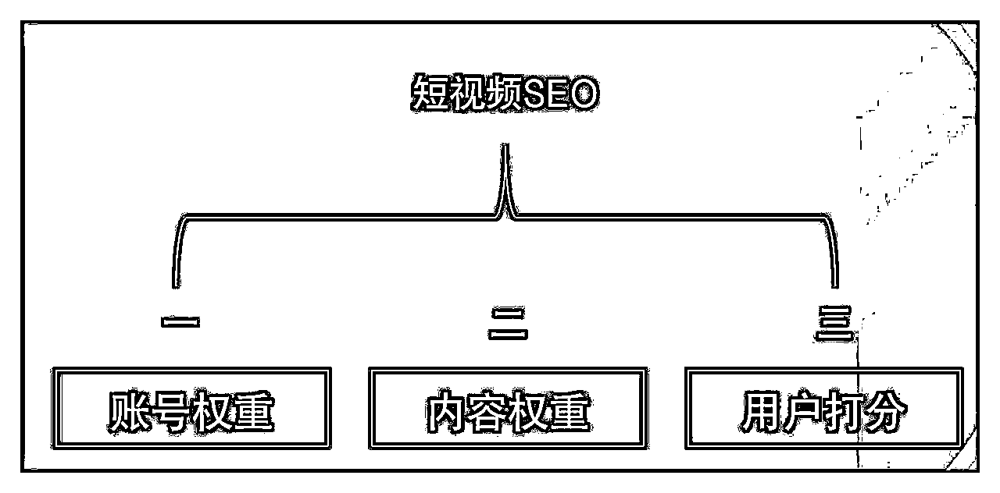

12 个优化排名细节的脑图：

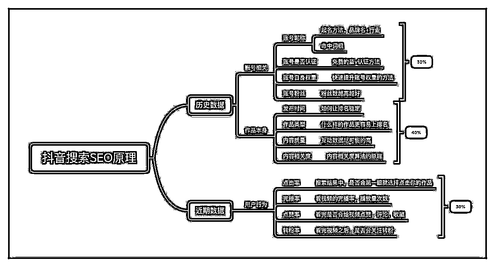

注意蓝海思维，我们要从大量的关键词中，找出自己的蓝海关键词。

因为单个关键词的搜索结果有限，所以我们必须保证自己的作品得分能够战胜竞争对手。

最终才能获得较好的排名。

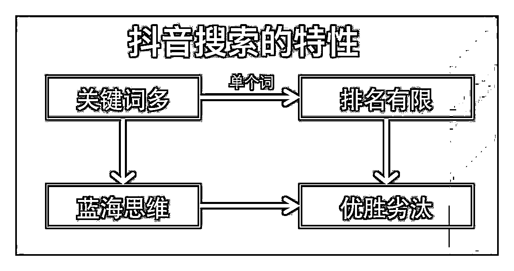

# 四、抖音 SEO 实操技巧 @令狐峰 @Hawli（李小随）

## 4.1 如何查看搜索流量占比

💡

章节概要做抖音 SEO ，一定要有数据思维，通过数据复盘反思，找到更好的选词，提升自己的 SEO 操作效果。

了解搜索流量占比，是开始抖音 SEO 的第一步。如何知道自己目前的流量数据情况？本章节我们从单个视频和多个视频维度，为大家提供了具体的实操方法。

### 4.1.1 单个视频看流量占比

如何知道自己的视频，播放来源在哪里？如何看到用户搜索了那些关键词进入了我的视频？

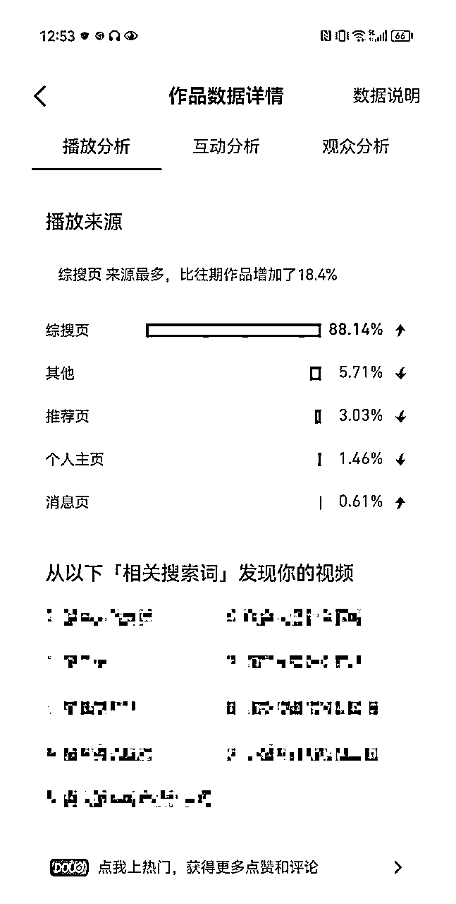

### 4.1.2 查看 30 日内所有视频搜索流量占比

上面讲述了查看单个视频数据分析的方法，但是一个个的查看会比较累，抖音的创作者中心也提供了数据中心，可以看到自己所有作品近 7 日和近 30 日的情况。

具体操作流程见视频：151_1676010352.mp4【在线播放】其中作品搜索量的含义：作品被搜索到，展现出来的数据，不等于实际播放量

## 4.2 抖音 SEO 核心逻辑

上面讲了搜索流量占比，抖音 SEO 的根本价值，在于想办法提升搜索流量占比，也就是提升搜索排名。

如果你问我做抖音 SEO 最重要的是什么？我会毫不犹豫告诉是选词。选词的重要性，占到抖音 SEO 的 50% 以上，选择 > 努力，如果方向错了，一切的排名技巧都毫无用处。

比如“提升记忆力”的月覆盖人数是 11408 ，而“提高记忆力”的月覆盖人数是 96962 ，后者搜索人数是前者的 9 倍多。如果没有数据的加持，即使其他条件都一样的情况下，结果可能也会相差十倍：

做抖音 SEO 最重要的是选词，核心逻辑是找到蓝海词，找词一共有两个流派：蓝海词流派和长尾词流派。

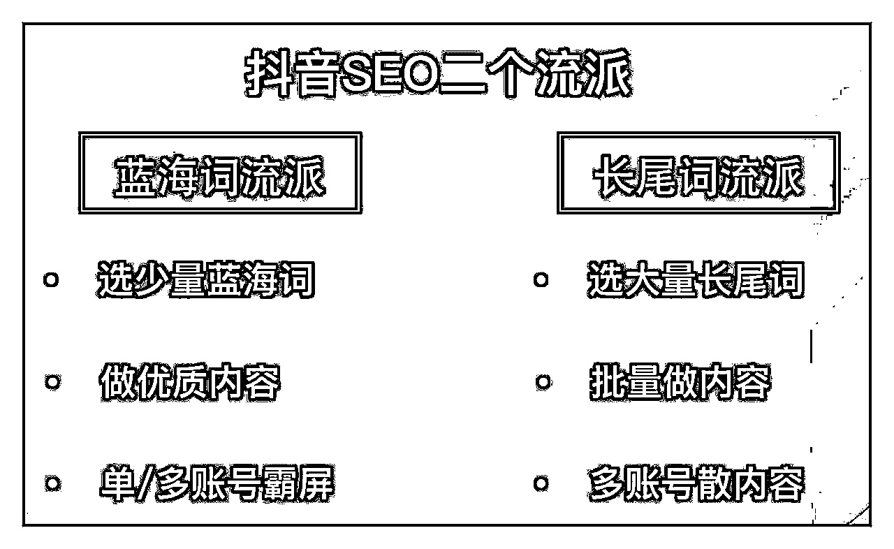

蓝海词流派：选少量蓝海词，蓝海词数量 100 个以内。关键词的月搜索量平均在几万左右，发布内容始终围绕这些来做，做完一轮之后，可以再来一个账号来做一遍这些关键词，实现关键词的霸屏效果。

长尾词流派：选大量的关键词，数量在 1000 以上，不封顶。根据数据显示词越长，竞争度大概率是越小的，毕竟词越长，被抖音博主用运气命中的概率越低。这类关键词为抖音的下拉词居多，月搜索量在 1000 以内，采用批量生成内容的形式，适合生成内容成本比较低的行业。

为了能更好提高搜索数据，一个作品不要只抢占一个关键词，一个作品可以占 3-5 个词搜索排名，前提是这些关键词都是围绕内容来做的。

长尾词流派面临的问题是如何快速找到大量下拉词，可以通过下方链接，快速找到大量的抖音下拉词，并且支持数据导出。

传送门：https://www.dso100.com/DouyinSugKeyword

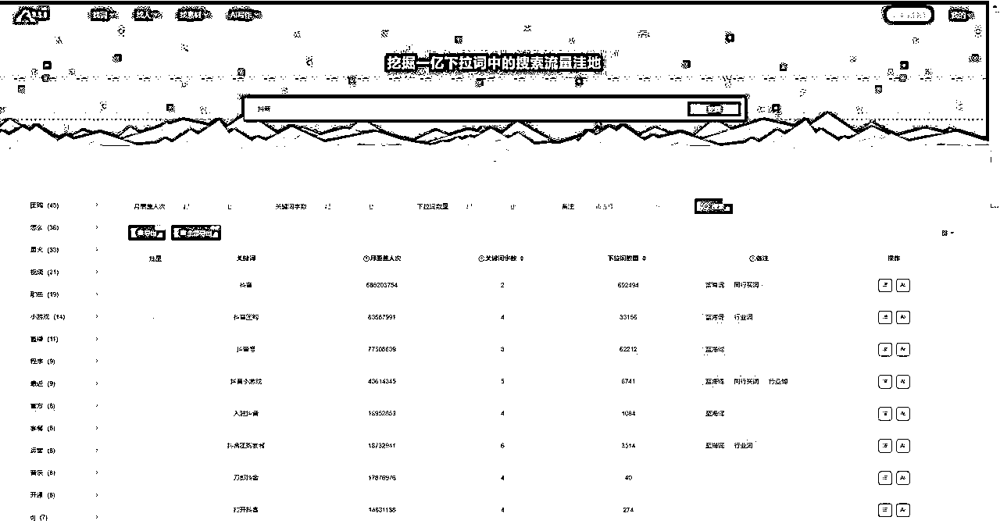

## 4.3 如何寻找蓝海关键词

💡

章节概要在抖音 SEO 中，最最重要的环节是 「选词」，可以说它几乎决定了抖音 SEO 的成败。常规操作中，要想选出合适的有商业价值的蓝海关键词，是一件耗时耗力且难度很大的事情。

受限于航海的时间周期，我们希望减少同学们在「选词」环节的难度，助力大家在 21 天时间里创作出基于关键词的内容，真实看到抖音 SEO 所带来的流量效果。为此，我们给每一位同学都申请了“大福利”——「极客增长」个人版选词工具 1 个月免费使用名额。

在本章节中，我们为大家提供了「极客增长」工具的 福利领取方法 和 详细使用方法 ，这是本手册的重中之重，需要大家结合工具认真理解尽快掌握（有任何不懂的地方，也可在航海中向教练提问）。

### 4.3.1 选词工具使用方法

极客增长选词工具使用地址：

https://www.dso100.com/🔔 1 个月免费名额领取方法：

开船后，会安排统一提交手机号，统一开通权限，请大家留意航海群内官方通知。

极客专业版选词工具使用教程（电脑端）：DSO 工具教程（查词+AI）

极客选词工具使用教程（移动端）：

飞书 20230301-125857.mp4【在线播放】

### 4.3.2 搜索结果字段解释

下面是极客增长工具搜索结果看板，我们为大家解释一下重要字段：


1、日数据

衡量该关键词在抖音的搜索具体数据，代表每日搜索累计搜索过的次数，1 个人是可以搜索多次的。

2、月覆盖人次

累计该关键词和该关键词的长尾词加起来的总的月覆盖人次，1 个人是可以搜索多次的，是多个关键词的累计数据；3、关键词字数

关键词越长说明机会越大，毕竟大家不会注意竞争长的关键词。

4、竞争度 1 表示竞争最小，5 表示竞争最大。但是这个不绝对，只是根据内容数量初步判断，真实的判断还要自己的账号和内容的情况，毕竟竞争度是相对的。你账号粉丝数越多、做内容越强，做关键词越容易。

5、备注字段黑马词：流量呈显著上升趋势的词；

同行买词：同行业广告主覆盖度高的词；高点击词：点击率相对较高的词；

蓝海词：流量大但目前竞争不激烈的词。

## 4.4 用选词工具进行选词

### 4.4.1 选词三大方法

方法一：根据产品/解决方案选词

比如我们提供的是婚礼主持服务，那么他的产品/解决方案就是：婚礼主持/婚庆司仪。这个是大多数人优先会用的选词方法，采用这种方法要注意的要点是，要从用户的角度去看看用户使用的是什么搜索词。

比方说用户要找婚礼主持，可能会搜的词有婚礼主持，司仪，四大金刚。


我们可以看到，不同叫法的搜索量级是完全不一样的。尽量选大众会用的叫法。

方法二：根据用户需求，痛点选词。

比如有人是做失眠调理的，那么失眠，就是用户的需求和痛点，用户可能会围绕失眠这个问题，去搜索相关的内容，而作为提供解决方案的人，就要围绕用户的需求去做内容，让用户觉得解决方案是最适合他的，这样才能提高转化率。

方法三：根据场景/人群选词。

有很多需求是在特定场景和人群中产生的，比如：新房除甲醛。很多人有除甲醛需求，都是在买了房子，刚装修完后产生的，那么围绕这个场景和人群去产内容，用户就会自我代入，觉得你是为他定制的，更容易被你的内容吸引。

### 4.4.2 本地词怎么获取更大流量

当搜索带地域的词的时候，搜索量总是很小，这是因为受到两方面的影响：

第一，主词的搜索量不大，分配到各个地方，自然也会比较小；第二，很多人搜的时候不一定会带地域，系统会根据用户的标签自动推送靠得比较近的店。

基于这个原理，我们在做本地词的时候，可以直接挑选主词，然后带上地理位置 poi，这样系统就会自动推送给附近的人，就不会因为仅仅用地域词，过滤了那些搜索的时候不带地域的用户。

### 4.4.3 多少的搜索量值得做，要学会算帐

那选词的时候，要选择多少月覆盖人次呢？其实这个问题没有标准答案，选择多少月覆盖人次，取决于我们所在的阶段，客单价，还有转化能力。

收益=客单价搜索量曝光量线索率（转私域率）转化率

假如客单价是 5000，搜索量（月覆盖人次是 10000），排名前 5 获得 50%的曝光，然后这些曝光后引流到私域是 10%，转化率是 5%，那么这个月获得的收益是 5000100000.50.1*0.05=125000。

算完这笔账，我们就可以知道这些词该不该做，需要花多少心思，投入多少成本去做。

所以更建议老板们做高客单价产品，因为客单价高，对词的要求就不会那么苛刻，搜索量小的也可以做，因为只要转化一个就很香。

选词的时候能注意以上要点，做搜索就成功了一大半。

## 4.5 长尾词选词方法 @马钱钱

### 4.5.1 搜索意图

长尾关键词的底层逻辑是输出的内容和用户的搜索意图是否匹配。

意图假设：

这个人换工作，需要换城市生活，他有一辆电动车，但是扔了又很可惜，当二手的卖了又很亏，如果他托运到另一个城市还能继续用啊。这时候，他的需求就是电动车托运。

那么，与电动车托运相关的话题，会想到什么？你是用户，你会关心什么呢？

电动车托运的运费、价格？电动车能不能托运到 XXX 城市？电动车托运的注意事项？会不会弄坏、刮花、怎么打包等等，电动车托运的保险等等。

这些相关的话题做成一个视频合集，分享的内容从对用户有价值的角度出发，真诚分享，用户会有所感知。

如果我们做物流或托运的服务商，可以定位到骑行的群体，需要托运业务，也可以有针对性的输入内容，完成了「电动车托运」到「摩托车托运」延展。

因此，从产品、业务角度出发，去挖掘用户背后的搜索意图，才会吸引客户，也会是更精准、垂直的潜在客户。

### 4.5.2 字母调研法

我们可以利用 【关键词+字母】的方法，来选择长尾关键词。

以电动车为例：


一个关键词，和 26 个字母组合，可以找到至少 260 个相关的话题。再从这些话题里，筛选过滤，找出跟自己业务相关的词去进行短视频创作，按照对应的话题提炼爆款标题放到封面，就可以完成作品的创作。

【电动车】这个关键词，也是可以更换的，再结合 26 个字母， 会出现更多的长尾关键词

### 4.5.3 工具组合法

这个方法可以帮助我们创作话题，有更多的灵感和提示。

第一步：根据自己的产品和业务，收集话题方向，越多越好，将它和不同的流量词结合。

公式：非同义词的流量词 + 和“XXX”组合 + 可以创作的话题比如流量词：电动车 + 和“XXX”组合（需要自行发挥）+ 可以创作的话题

需要整理一些和电动车相关的话题，同时最好和业务相关，越相关，粉丝越精准，越容易转化。

以「电动车」为例：

和“价格”组合

和“电池”组合

和“瑕疵品”组合第二步：使用组合工具

https://seoscout.com/tools/keyword-combiner

http://kombinator.org/

可自行在谷歌上搜索 Merge words or Keywords Combinator


第三步：将话题创作提示放到关键词库表格里，开始头脑风暴，借助爆款标题的公式来创作


内容来源：《如何用谷歌 SEO 的内容营销方式做抖音 SEO》

## 4.6 如何提升抖音 SEO 效果

### 4.6.1 方法一：精细化选词

想查询抖音当前热词，可批量查看关键词数据，传送门：https://www.dso100.com/KeywordDouyin

想精细化查询其他关键词，可以参考下列方法：

第一步：在极客增长工具中搜索意向关键词以「创业」举例，可以看出在返乡创业、餐饮创业、农村创业等关键词，都是搜索量很大、竞争度很低的关键词，这就是我们所说的流量洼地（备注：工具里面的竞争度和蓝海词都是系统提供的参考，还得结合自身的制作能力来综合评估）：


第二步：点击下拉词看详细数据

找到一个蓝海关键词的方向之后，我们可以点击下拉词标志，通过下拉词发现更多的用户需求。比如：


会看到以下搜索需求：


关键词查询技巧：搜索关键词的时候，会发现搜索出来的结果有比较多的干扰选择，比如搜索二手车，会出现二手车的价格、推荐、交易市场、直播等其他维度信息。但是我们只想看宝马二手车的相关词，直接搜索结果也只能展现跟“宝马二手车”相关的词，会少了一些词汇量。


那我们可以使用宝马 + 二手车的形式，就可以出来更多搜索结果。也就是包含多个关键词：关键词 A + 关键词 B。


如果我们不想在搜索结果中看到二手车，这个时候可以采用 “-” 的。也就是屏蔽这个关键词的意思：关键词 A - 关键词 B 。


包含任一关键词是：关键词 A 关键词 B 。

选词时需要注意的点：

同城业务需要注意区域；

月搜索量只有几十的不建议做；月搜索量超百万的建议留在后面做，先积累经验再操作大词；竞争度高的词不是好词；

意图不明确的词不是好词（词越长说明需求越明确，词越短需求越不明确，建议在 4 个字以上）；不要做别人视频中大概率会提到的，比如：社群营销的六大核心流程及打法；

品牌词基本上转化率高（不一定是自己的品牌词，可以是对方的品牌词）；

客单价尽量高，低客单价除非搜索量大，否则没必要做搜索流量；


不完全正确，因为存在 2 条隐藏变量：

关键词搜索量会影响转化率；关键词搜索量会影响客单价。

所以并不是关键词的搜索量越大越好，而是转化率高、客单价高的关键词，搜索量越大越好，具体要看业务。

部分关键词解析：

如果你是做本地同城业务卖二手车的，下面关键词那些值得做，那些不值得做？

实操案例：

场景模拟：如果你是做本地同城业务卖二手车的，下面关键词那些值得做，那些不值得做？


正确答案


补充技巧一：多词覆盖法 @雅士哥哥

视频中尽可能使大词和小词并存

比如你想做「草莓蛋糕」你可能会去搜：草莓蛋糕怎么做？草莓蛋糕的做法关键词可以选做「草莓蛋糕做法」，蛋糕的做法是大类，草莓蛋糕做法的小类，可以全部覆盖到

内容来源：《通过五个操作方法，实现快速上排名的技巧分享》

### 4.6.2 方法二：申请蓝 V 和黄 V

蓝 V、黄 V > 关键词精确匹配 > 真人出镜口播 > 其他因素，这三项因素对排名带来的增益远大于其他因素，所以申请蓝 V 或黄 V 是很有必要的。

所以接下来给大家介绍一下如何申请蓝 V 号。

蓝 V 号，一般是公司或者个体户才能申请的，正常的话，需要 600 块钱。但是如果你申请了抖音小店，可以免掉这 600 块钱，


如何申请黄 V 认证？设置 -> 账号与安全 -> 申请认证：


### 4.6.3 方法三：创建视频合集


我们再看一个例子，“买房攻略”这个词，月搜索在 15 万左右，为何这个 66 个赞的视频能排名靠前？因为他采用了合集的策略，完全命中关键词，即使数据效果没有其他人好，也能上排名：


如何创建合集？

可以前往抖音创作者服务平台：https://creator.douyin.com/creator-micro/content/collection/manage


合集注意事项

注意事项一：制作合集时，内容需要有相关性，避免一些不合适的内容出现在合集中影响排名。

内容来源：《我是怎么做到连续 3 天，视频达到 10w 播放和关键词排名第一的》注意事项二：每周至少检测一次作品是否有违规限流，违规作品要移出合集。移出需要补录视频替代违规视频位置

查看作品是否违规的方法：登录 PC 端创作者中心，内容管理-作品管理，如果出现“需优化”，就说明是违规作品。


内容来源：《抖音 SEO 如何维持排名，提高引流效率》

### 4.6.4 方法四：提高视频质量

（一）视频拍摄

如果刚开始做高客单产品的 SEO，建议先以大字报形式呈现：实拍+文案+BGM（或配音解说）

这类视频形式简单、可以量产，且完播率数据较高，值得尝试。

内容来源：《如何通过抖音 SEO 卖一套房，我选词的小技巧和文案查重避坑分享》以下是拍摄流程，可供参考：

1）设备推荐 @封伟-自动化变现

拍摄设备：剪辑操作软件：剪映、智能剪辑、美图秀秀、PR、AE 类软件

拍摄操作硬件：手机 / 相机、三脚架、稳定器、收音设备场景布置：幕布、小摆件、补光灯、灯箱

人员安排：建议 3 人 1 组。（拍摄，表演，提词）

人员要求：真人出镜（平台喜欢、有 IP、过滤性强、操作长久）

内容来源：《3 人新手团队，0 投放抖音涨粉百万，转化注册用户 20 万》

2）常见的拍摄流程 @光光总的来说，整体的视频创作到发布的流程是这样的：

先写好脚本，想清楚故事发展方向、人物、场景等

根据脚本简单分镜，然后去进行拍摄 / 录屏拍摄好了之后，再去配音

剪辑视频发布作品

内容来源：《实操分享：一个人、零基础、业余时间、从 0 到百万粉的【保姆级教学】》

3）常用拍摄方式手机怼脸拍摄

手机怼脸拍摄，降低拍摄成本和行动成本，脚本准备好以后随手即拍，但是这种拍摄方式是建立在你有很强的内容输出能力和人格魅力的基础上，同时还需要有画面「视觉锤」，最好有一个特殊记忆点让观众记住你，印象深刻。

采访问答式

采访人先抛出争议性问题，然后引导出被采访人的滔滔不绝，这种模式更真实更有亲和力，适合一些自身阅历丰富有不凡谈资的大佬们，只需要做好选题策划，通过问题引导出大佬的内容，适合多机位内容量产，然后批量产出批量剪辑。

侧机位念台词

固定机位拍摄，准备好提词器念台词即可，适合记不住台词的同学，同时要求肢体动作和表演情绪要到位，念台词也要念的有张力有重点有信服力，适合多机位拍摄批量产出。

场景化拍摄

口播叙事讲述自己的故事，再匹配与文案部分契合的画面，需要专业的拍摄团队，需要懂镜头语言和画面设计，对拍摄和画面要求都比较高。带入自己生活部分更有说服力，也可以不经意间展现自己的财富实力，起到秀肌肉的目的。

内容来源：《航海实战｜抖音-垂直 IP 号｜实战手册 》

4）拍摄技巧语速不要太快

因为语速太快会给人紧张的感觉，用户会跟着紧张。

视频内容要清晰、明亮

选择合适的灯具或明亮场景，保证人脸和场景看起来明亮、柔和，不要黑黢黢的。

声音要带入情绪短视频更多的就是一种情绪，而声音是最容易调动用户的情绪的。声音里传递出的能量、情感是最容易激发引导情绪的。这个东西不直观，但它却非常重要。

选择适当的背景音乐音乐可以烘托情绪渲染氛围，尽量选择一些耳熟能详的歌，听过很熟悉又叫不上名字来，降低用户的接受成本。

音乐本身有明确的情绪传达，尽量寻找热榜上符合你情绪要求的歌。但是，背景音乐不应该大于人声，始终应该以人声为准，注意自己作品的音量，避免自己作品声音过小而导致的听不清问题。

发布作品以后，同等的音量下听一下自己的作品与别人作品的差距。

内容来源：《航海实战｜抖音-垂直 IP 号｜实战手册 》（二）视频剪辑

1）剪辑工具 @Alan

pc 端：剪映 pc 版、pr、ae、final cut（操作相对较容易）

移动端：剪映、快影、秒剪（视频号官方）、字说（文字弹幕生成软件）、来画动画（ ppt 转视频）

对于刚接触视频的新手来说，建议直接用剪映。

剪映电脑版非常适合新手。如果你之前没接触过视频剪辑，啥都不会，看啥都两眼一抹黑，那不要犹豫，就选它！如果用 Pr 和 Final cut pro，可能做着做着就很烦躁，很容易被操作方法劝退。

用剪映就很爽，因为它的操作真的非常简单！非常有利于建立正反馈。

具体的视频拍摄和剪辑教程有非常多，这里就不过多赘述。有需要的同学可以去「剪映」学习具体的视频拍摄和剪辑技巧：


「下载剪映，点击下图里这个按钮即可学习」


资料包：《剪映 APP》49 节零基础入门视频教程

剪辑小技巧：https://articles.zsxq.com/id_rez6536bn6so.html

内容来源：《航海实战｜抖音-垂直 IP 号｜实战手册 》

### 4.6.5 方法五：投放抖 +

如果是新号，前期因为用户模型和铁粉没有建立，即使花费了很多时间做了优质作品，系统也无法推荐给用户模型，因为用户不精准，所以作品的互动数据自然不会高，所以大部分的作品都比较难火，点赞数也会比较低。

付费投放其实是一个巨型杠杆，通过付费投放，可以达到如下效果：

通过付费流量，撬动抖音的自然流，当互动数据好的时候，可以进入抖音更大的流量池；通过提升作品的互动数据，提高作品权重，从而达到 SEO 的目的；

通过挖掘爆款作品，提高涨粉数量，快速撬动粉丝数量。

什么样的作品选择抖 + 投放？

能够在 SEO 关键词下面找到你的作品，但是作品的排名还比较靠后（比如第 20 名）；

找到有异常值的作品，则投放效果最好。

什么是异常值？

作品互动的点赞、收藏、评论、转粉率，有一项比平常作品高三分之一以上。举例：正常作品发布的数据是点赞、收藏、转发综合互动数据在 50 以内，评论数量 10 以内，异常值则是高出 1/3 （比如自己的作品突然点赞、收藏、互动综合在 80-130 之间或以上）。

当然，这条作品是可以体现你的专业内容，涨的不是泛粉，那个就值得投放抖 + ，如果这条内容的标题有你想做的 SEO 关键词，效果会更好，可以蹭到搜索流量。

1）如何选择投放目标？

在起号的过程中，对短视频做抖 + 有一个投放目标，你觉得我们目标应该选择那个？

选项 A：点赞评论量

选项 B：粉丝量

选项 C：主页浏览量


正确答案是：A（点赞评论量）

为什么要选择点赞评论量？

因为前期起号的过程中，作品的基础点赞、评论、收藏数据肯定较差，投点赞评论可以帮助作品快速积累互动数据。只有有了基础的数据，别人才更加愿意点赞评论。

很多用户都有观看评论的习惯，你连评论都没有，别人都没有机会看评论，你的作品完播率也会大概率比别人低。另外，因为人人都有从众心理，只有看到数据较好的作品，才更加愿意点赞。

为什么不应该投放投粉丝量？

如果我们选择投放粉丝量，抖音是必须完成这个值的，因此很可能投来的都是目前喜欢点击关注人群，而不是选择你的目标人群，比如 50 岁的大妈，虽然选择粉丝量可能会更快的完成目标，但是会影响后续的流量分发效果。

为什么会影响后续的流量分发效果？

因为靠钱买来的粉丝，不一定都是真正认可你的人，他们可能只是一时兴起关注了你，但是对你的作品并不感兴趣，很有可能后来都不会看到你的作品，即使看到了，也不会对你的作品感兴趣，这可能会对账号之后发布的作品有负面的影响。

投放点赞评论很有可能会帮你突破当前的流量池，因为互动数据会给作品加分。

互动行为

得分

完播 10 分

点赞

8 分

评论

5 分

转发

3 分

当投放起来一条作品的点赞评论互动数据比较高之后，比如 2000+点赞，评论在 200 以上，并且能够吸引精准粉丝了，这个时候的涨粉效果正常情况下，可以投涨粉。

2）如何选择投放时间？

目前你面临投放选择时长的问题，会怎么选择？

选项 A ：2 小时

选项 B ：6 小时


我们先看一下时间的区别：2 小时，快速的跑点赞评论数据，肯定不够精准；

6 小时，也是快速跑完点赞评论数据，精准了一些；

12 小时，给抖音足够的时间，也足够精准了；

24 小时，整整跑 1 天时间，时间拉的较长，最精准。

24 小时以上的数据我们就不看了哈。

正确答案是：先 1 后 4，或者直接 4。

为什么是这样的投放方法，得先知道我们要什么？

短视频的基础权重

精准的粉丝

根据上面的用户从众心理知道，当点赞数少的时候，别人是不愿意点赞的，评论数少的时候，完播率会比较低。所以我们要先投放 100 块钱 2 小时的点赞评论，虽然 2 小时的精准匹配度不如 24 小时那么高，但是可以帮助作品快速拉高基础数据值，然后再追投一单 24 小时，让系统慢慢跑。

如果你对自己的作品互动数据比较有信心，那么就可以只投 24 小时，让系统慢慢的进行精准匹配，获得性价比最高的流量效果。

6 小时和 12 小时，更适合覆盖固定时间上线的人群，比如说你是投深夜人群的。

蓝 V 投放的时候是没有 2 小时的选项的，我们用 6 小时替代，也可以。

3）如何选择投放人群？

投放人群是投放智能推荐，还是投放达人相似？

选项 A：系统智能推荐，100 块钱 5000 播放

选项 B：达人相似投放，100 块钱 2500 播放


如果粉丝模型已经建立：正确答案是 A ；如果粉丝模型还未建立：正确答案是 B 。

如果视频的点赞数不是大爷大妈，评论区都是精准的人群，说明粉丝模型是对的。选择智能推荐，可以获得 5000 的播放量，因为抖音的算法是全球顶尖的，算法机制甚至是抖音的壁垒之一，我们要相信抖音的算法。

新手起号阶段，推荐投达人相似。达人相似怎么投？达人相似投的不是对标达人，而是近期对标作品所搭建起来的观众画像模型。比如一个刚火的博主，是因为说了某个产品好，火起来的，但是他没有卖这个产品，这时候你投放一个这个产品的链接，会起到事半功倍的效果。

找对标达人是一件极其重要的事，对标达人有几个要求：

1.对标达人的粉丝要垂直精准，最好是对标达人刚起号成功。

2.对标达人的粉丝数量不建议太高，否则粉丝人群会比较泛，建议在 1～10 万之间。

如果实在找不好对标达人，建议选择自定义模式，对年龄、地域、兴趣偏好、性别进行详细的划分。

4）如何选择自定义模式？

我们什么时候选择自定义模式？当我们的作品对性别、年龄、地域、兴趣等限制的时候，可以选择自定义模式。


5）Dou+不让投放是什么原因？

平台希望优质内容能够获得更多展示机会，但以下类型视频，无法投放 DOU+：1.视频质量差：无内容、视频模糊、产品 bug、静帧视频、视频拉伸，破坏景物 3s 及 3s 以下的视频、观看后让人感到极度不适的视频。

2.搬运视频：视频中 ID 与上传者 ID 不一致、账号状态标签为搬运号、明显截取的 pgc 内容、录屏视频、视频中出现其他平台水印的视频。

3.调性不推荐：视频内容低俗含有软色情、视频内容引人不适、视频内容不符合本平台的调性，视频非正向价值观。

4.隐性风险类：视频或文案中出现广告、出现欺诈内容、标题党、医疗养生类、抽烟喝酒的行为、违规饲养野生动物、视频中出现虐童现象、视频中出现疑似赌博的场景。

5.明显的营销、广告类信息、视频：视频内容中含有明显的品牌定帧、品牌词字幕、品牌水印、口播；视频背景中含有明显的品牌词、商业元素。

6.未授权明星/影视/赛事类视频。视频涉及侵权，无法使用 DOU+；请提供相关授权证明至 feedback@douyin.com。

7.视频标题和视频描述包含以下元素， 无法使用 DOU+：

（ 1 ） 联系方式：电话、微信号、QQ 号、二维码、微信公众号、地址

（ 2 ） 招揽信息：标题招揽、视频口播招揽、视频海报或传单招揽、价格信息 8.标题产品功效介绍

（ 3 ） 曝光商标：品牌定帧、商业字幕、非官方入库商业贴纸

（ 4 ） 指向性的企业店铺名称

内容不符合抖音站内社区公约的视频。

6）投放抖 + 技巧 @张棪

1.视频有营销性质不能投抖+，可以挂小黄车使用小店随心推，使用时不用投放商品购买，自定义设置投放点赞评论，效果和投放抖+类似。

注意① 视频挂小黄车后，权重会明显降低，需要针对数据做一些动作。

② 小店随心推投放结束后，点赞评论才会计入排名，如果是新视频投放期间视频可能无法被搜到。

2.蓝 V 用户使用官方的表单获客工具如果被拒绝使用，可以尝试投放一个 200 元以上的单，只包含这一个视频，会有概率通过。蓝 V 可以一开始不挂表单，排名提高后去抖音企业号后台再添加，然后评论区里做置顶引导。

3.合集法，使用没有营销性质的视频做数据，再建一个合集包含这个视频，把营销性质的视频放在第一位，开始比较好用，现在会有一定概率不展示第一位视频。其他方式均受限，可尝试使用合集法。

内容来源：《抖音 SEO 两个月获客 600+，我的经验分享》7）投放抖 + 总结

对于新号，投对标达人，时间选择投 24 小时，把所有的作品投一遍，最终筛选出点赞涨粉数最好的那条。

对标达人怎么选？对标达人作品质量不如你，但是粉丝数很多，因为对标达人很重要，所以找对标达人的时间花费的多一些。

如果对标达人实在找不准，或者心理没底，也可以使用自定义选项，把年龄、性别、喜好、地域等数据精细化选择。

起号阶段建议准备至少 2000+，1500 块钱投点赞评论、500 块钱投涨粉；投放的时候一次选择 5 个作品，每次投 100 ，选择点赞评论，先把所有的作品投放一遍，剩余的钱给点赞评论互动数据最好的；

找出涨粉最好的那个作品，投涨粉，投 500 块钱，看粉丝单价。

之后有预算的话，粉丝数单价小于 1 元，可以围绕涨粉率高的作品，把粉丝数拉到 5000 以上。

8）投放抖 + 常见问题


投放 DOU+省钱的小技巧关注【Dou+小助手】直播间会在节日期间发放一些优惠券

及时止损：在投放 30-50 元后效果并不好，就需要把视频设置为私密，就可以终止投放

提高效率：只给作品过关，符合模型数据好的作品就投放系统推荐的“火伴计划”就是 DOU+赠送的满 98 赠 30 的优惠券，等到要投放的时候再点开

DOU+审核不通过怎么办？

作品显示不适合继续推荐，查看理由来进行申诉，申诉通过可以再继续

作品显示不能投放，作品要隐藏起来。当违规作品超过阈值后，可能会对账号进行处罚审核不通过后，隔半天再投放一次，避免在同一个审核员再次打回

其他投放目标的作用和时机是什么？

1.点赞评论帮助新号打标签，前 1-3 条作品可以用

帮助红线在蓝线之上，5 秒完播率在 40%—50%以上的作品加分来撬动自然流量流量卡在 1K、5K、1W、10W 左右时，来突破流量池（此时停止不涨可能是在排队审核），计算播放量要减去 DOU+投放出来的流量

2.粉丝量

账号还没有达到 1000 铁粉前，就选择精准涨粉，快速建立粉丝模型（泛类 3 毛，垂直 2-3 元，同城价格更高）

3.主页浏览

增加作品停留时长（点开视频会跳转到主页，时间会计入视频时长）

主页有很强的背书，看了主页产生转化，主页浏览与转粉达到：10 比 1，可以投（主页浏览转化粉丝是真爱粉）

关注粉丝也会成为铁粉，成为铁粉会帮助你拓展为基础播放量。

### 4.6.6 方法六： 排名时间延长

如何延长自己关键词在抖音搜索 SEO 的排名时间？

任何一个关键词的排名，都不会长期稳定。如果我们一个关键词获得抖音排名之后，想要延长时间，需要尽可能保证下面的三个点：

1）视频要真实的去解决用户的问题

视频要真实的去解决用户的问题，否则在“用户满意度”这项会很低， 要围绕抖音的相关性算法进行发布内容。

2）用户搜索满意度

短视频-比如：点赞、关注、评论等常规操作；

如果视频的点赞与收藏接近 1:1，收藏大于点赞，视频会有一定概率变成“搜索精选问答”。 搜索精选问答可以稳定排在第一位，不受千人千面影响。

还有一个比较重要的参数是“问题解决率”，看了你的视频之后，是否还会选择其他的人的视频。如果选择其他人的视频说明了，你的问题没有完全解决其他的问题。这样的数据多了之后，排名也会下降。

直播-比如：停留时长、互动、关注、购买等操作。

3）合集

合集注意要点自身排名高的视频无需加入到合集，合集在搜索结果里呈现的不一定是设置的第一个视频，影响转化。如果视频已经被选为精选问答，加到合集反而弱化效果。

合集更新频率创建合集，合集的更新频率至少 1 个月一次，积累合集的权重，保证时间维度上的新颖。

4）人工干预法 @雅士哥哥视频发布的半个小时后，邀请 5-10 位朋友搜索视频关键词，筛选最新发布，先随机浏览其他视频，再将你的视频完播后模拟正常用户点赞、评论。

注意：① 评论内容需要和视频内容强关联

② 避免使用同一个 WIFI

内容来源：《通过五个操作方法，实现快速上排名的技巧分享》

## 4.6 【拓展】如何搭建团队做抖音 SEO @魏其琛

搭建团队做抖音 SEO 的优劣势很明显，使用人海战术快速铺量，提升视频发布效率。

这里就为大家拓展一下，@魏其琛 利用团队打法下场抖音 SEO 的经验

团队的工作可以分为“成员分工”和“团队协作 SOP”。

### 4.6.1 团队成员分工

员工 A：筛选 SEO 关键词、制作选题、制作文案。

员工 B：手动修改文案、快速布置镜头、真人出镜、配音、剪辑视频。

员工 C：拍摄视频、剪辑视频、发布视频、创建合集、投流与数据分析。

### 4.6.2 团队协作 SOP

准备阶段

员工 A 负责筛选和整理 SEO 关键词、寻找可参考对标视频执行阶段

时间

员工

执行内容执行结果

9:00 — 11:00

员工 A

① 制作选题

② 利用 ChatGPT 生成文案① 获得初稿

② 获得当日稿量

11:00 — 12:00

员工 B

① 微调文案② 筛选无法用素材替代或必须真人出镜的镜头

① 获得“必拍镜头”线索

② 由 IP 出镜或利用与场景互动的口播补充

13:00 — 14:00

员工 B① 出镜

员工 C

① 拍摄，将“必拍镜头”拍摄完毕① 获得“必拍镜头”

14:00 — 14:30

员工 B

① 配音

① 获得配音作品 14:30 — 17:00

员工 B

① 剪辑

① 获得剪辑作品员工 C

17:00 以后

员工 C① 完成视频发布

② 创建视频合集

次日 9:00 — 11:00

员工 B① 查看视频数据

② 投放抖+

③ 客户追踪员工 C

内容来源：《冷门行业，如何从 0 获取高质量客户》

# 五、抖音如何引流至私域

💡章节概要

抖音 SEO 是核心是为了获取更多流量，当我们通过 SEO 优化了排名，实现了流量获取之后，还需要思考如何承接和消化这些流量。

如果本身有商品，可以在账号或店铺中直接转化成交，自然是最好的。但对于大多数人而言，变现途径或许离私域更近，比如引导到微信或者线下成交。

本章节，我们为大家提供了 7 种比较常见的抖音引流技巧，包括：

✅ 账号简介中留引流内容✅ 资料包里留下引流内容

✅ 视频中留下引流内容

✅ 评论区引导引流内容

✅ 私信回复引流内容

✅ 【推荐】使用官方引流工具✅ 【推荐】通过链接引流到私域

这里需要提示的是，由于抖音平台的规则变化很快，再隐蔽的引流方法也有一定程度风险，我们这里所提供的方法虽然在路径上是通的，但如果被举报多了还是可能违规，因此最推荐的方式，是最后 2 种。

流量获取不易，成交转化更是不易。希望这些引流方法可以让大家的努力离钱更近一些，当我们的商业闭环越完善，就越容易看到成果。

## 5.1 视频内添加引流内容 @创度

引流核心：根据用户的痛点，找到产品价值以及满足用户需求

这个价值我也把他称为钩子，给用户一个添加你的理由。怎么留钩子？要站在用户的角度来考虑，他想要的是什么。

以自己为例，我做的是项目拆解，ChatGPT 刚火起来的时候，我出了一期讲述 ChatGPT 背景介绍、应用场景以及变现方式的视频。通过观察评论区、查看用户搜索等方式，发现最大的问题是很多人不知道该怎么注册，怎么使用。

所以我整理了一套完整教程，放在视频里面作为钩子，让用户找我免费领取。

结果那条视频爆了，50W 的播放，加爆了 3 个微信，无法承接过大流量，最后只能往公众号导流。

后面统计了一下，这条视频给我引流了上万的私域。这就是钩子的重要性。

内容来源：《抖音 SEO 如何维持排名，提高引流效率》5.2 账号简介中留引流内容 @木易 Troy

简介中留联系方式，抖音查的不是特别严格，但我们要注意避免微信，VX 这种字眼，可以用符号代替，比如地球，卫星这种自带的符号，后面写上 + 的符号及自己的微信，没有被封过。

个人简介每天可以修改三次，也就意味着可以替换 3 个微信，如果被加频繁了，可以再次修改即可。

## 5.3 资料包里留下引流内容 @木易 Troy

你想让别人加你微信，就必须要给人家一个加你微信的理由，至少你要能给他提供价值，或者是一份特别想要的东西，这个就要每个人根据所从事的行业提前准备好，我的电商账号准备的是一张关于抖音小店的思维导图，淘宝拉爆手淘搜索的排单计划表格，对于一些电商新人而言都是干货。

## 5.4 视频中留下引流内容 @木易 Troy

视频结束的时候可以晒一下你这个领域的干货思维导图，XX 文档之类的东西，可以说：需要的直接评论区留言，私我 666 之类的话语。有时候这一类话语可能会导致作品不能投放豆荚加热，需要仔细打磨话术，不要被系统检测到。

## 5.5 评论区引导引流内容 @木易 Troy

有时候我们很多作品爆了，但却没有留下钩子，这个时候我们就要快速的在评论区留言，并且将自己的评论置顶。

很多人看完视频都会有点开评论区查看的习惯，这个时候就能看到你的引导话语，进一步提升转粉率。

话术和视频导流差不多：有需要 XX 东西的铁子们可以私信我 666 领取！一条不行的话，还可以多发条。

## 5.6 私信回复引流内容 @木易 Troy

抖音对私信是有监测的，不能反复的发同样的引导话术，不能提及微信，VX 等谐音字太多次。我们需要多变的调整自己的话术。

你好，可以查看我主页的联系方式哦！

你好，被加频繁了，你的联系方式/电话是多少？

家我 XXXX，佳我 XXX，用错别字来代替加我这样的字眼。

表情包，可以制作一个带有+我：XXXXXX 这种格式的表情包，直接发送表情包给对方，简单明了。

....等等，上述很多方式都可以，每次话术我都只会持续发送 5 个人左右，就要修改自己的相关的话术，以免抖音系统会识别出来，禁止私信功能，这样就很惨了，7 天之内根本没办法回复，只能看着流量擦肩而过。

内容来源：《抖音 IP 小航海复盘，一条视频引流 500+私域，2 天变现 2W 元》5.7 【推荐】使用官方引流工具 @令狐峰

蓝 V 号，可以使用官方推荐的引流工具。正常是通过 https://e.douyin.com/ 然后在短视频或者直播间挂载：


具体方法，见官方推荐的视频：

企业号线索行业常用工具使用指南-抖音企业号经营工具使用指南-巨量学官网

## 5.8 【推荐】通过链接引流到私域 @令狐峰

在关注自动回复（限企业号）、社群欢迎信息中、私信回复 的时候添加超链接，可以快速一键引流到私域。

工具地址：https://ixiaguo.com/，视频演示：ABUIABA6GAAg4o_WkwYo0vHUoQY.mp4【在线播放】

# 六、高客单项目如何做转化 + 复购

💡

章节概要

高客单的产品其实需要的客户不一定要很多。虽然客流越大越好，但如果你只是想把营业额和利润维持在一个自己比较舒适的范围，那么找到一群精准的客群就够了。抖音 SEO 正是协助寻找这一部分精准客群。

有了精准流量之后，还需要对其进行转化，本小节分享了提升转化率的几个小技巧，分别从以下几方面展开：

✅整体服务流程

✅CRM 体系✅提供精神价值

✅高客单成交的关键点

大家还可以结合自己的产品特性，发散思维，在星球上寻找更多资料，丰富自己的转化路径。

## 6.1 高客单价社群如何实现 74% 转化 @美德布耀布耀德

精准流量获取之后，更为核心的部分就是后续的运营。这一板块我会围绕如何提高顾客粘性这一目的给大家做重点分享。

奢侈品或者高客单价产品与大众消费品最大的区别是，这些产品的溢价非常高，如果想要客户能够为高溢价买单，那么必然要提供产品本身以外的价值。

产品以外的价值包括，品牌本身带来的身份认同，社会地位的认可，虚荣心的满足。还包括消费的体验，以及让顾客感受到产品或者品牌背后的精神价值。

这两点做到了，那么就能够提供其他人无法提供的价值，就能够提升顾客的粘性。围绕这两点，我尝试了很多方法，总结下来，有以下三个方面可以和大家进行分享：

1、整体服务流程需要打造仪式感 2、CRM 体系提升管理效率

3、学会造梦，提供精神价值

### 6.1.1 整体服务流程需要打造仪式感

奢侈品这个行业最需要仪式感的打造，也是仪式感打造的最好的行业。外界听起来似乎是非常高大上，但实际上，奢侈品行业并未发明什么特别的操作，它们只不过是把每个环节做到极致。

在奢侈品行业，我们把顾客从进店到离店过程中的每个环节，设置为不同的接触点。每个品牌都是围绕顾客的这些接触点去做设计。

根据顾客的动线，接触点无非就包括以下几个环节：欢迎 - 探索 - 介绍产品 - 体验产品 - 处理问题 - 结束销售 - 送别 - 售后维系。

这些接触点里 “欢迎” “介绍产品” 在线上是最重要的提供仪式感的环节，下面将详细和大家拆解线上如何通过这两个环节做好服务体验。

1、欢迎环节仪式感打造

欢迎这件事，是由 3 个小细节组成的。

橱窗

欢迎的话术和动作破冰话术

1）橱窗的仪式感打造

在奢侈品店铺，从你看到店铺外观的那一刻就开始了。举个最简单的例子，奢侈品每一次的橱窗设计都不单单只是产品的堆放，每一次都会是有主题的故事。


这是爱马仕的橱窗，这已经不仅仅是橱窗了，而是一个个的艺术作品。任何顾客走到橱窗附近就会多看几眼，而且是以欣赏艺术作品的眼光。

比如，这组橱窗就融合了希腊神话故事和美感，还展示了产品。这是品牌的做法，那么平移到个人线上，如何在“橱窗”上，增强仪式感和美感呢？其实就是注意设计我们的朋友圈。

朋友圈封面，朋友圈的每个文案和图片，我们的头像，个性签名，都需要特别设计。因为，这些，就像奢侈品的橱窗一样重要。

2）欢迎话术的仪式感

每位新朋友加上微信后，都需要先做自我介绍，再邀请他进群。群里也设置了邀请须经群主同意。如果是群里朋友邀请新朋友，也会先告知这位群友，需要新朋友加微信。当我们友好的互相介绍完，我再通过。

以上的准入门槛，就是一种仪式感。亮明身份，提升自身价值，互相了解，平等对待。高客单价产品的售卖，做到最高级，你应该和客户的平等交流的状态，而不是一个小客服。那么从第一步，就很重要了。

3）破冰话术的仪式感

打完招呼后，就可以聊聊天，以达到破冰的效果。在奢侈品的销售里，我们会让员工准备 100 个破冰话术，用于欢迎完毕后和顾客聊天。

那么线上其实也非常需要设计这个破冰的语言。具体聊什么，线上来说，其实客户的头像，微信签名，自我介绍里的内容都可以作为破冰话术来聊一聊。具体大家也可以上一下线上沟通课。需要注意的是，聊天的内容氛围需要和你的社群格调保持一致。

很多时候我们私域流量进来了，如果不打招呼这个人就不会和我们有链接。那么光打个招呼还是不够的。还必须在初始的聊天中，展示出自己的价值，但又不能让客人感觉你是在“显摆”。

4）介绍产品的仪式感

最后我们再来看看关于，产品介绍的仪式感。

每一个产品，它都有很多很多个 FAB，我们在描述的时候，是通过前期对顾客的了解之后，针对性的去谈的几个点，一般来说我们描述两个即可，最多不超过三个，那方向是从哪几个方向来看呢。

我们不要自自说自话告诉顾客，这个产品他设计的多么好，剪裁的多么好，细节做的多么好就结束啦。

而是应该重点告诉他，他穿上之后，在什么场景下可以得到什么样的一个效果。就是这个场景描述出来之后，让客人更有代入感，而且他会幻想自己穿上这个产品以后的样子，那么他购买的几率就会更大。

举个例子，假如是一件黑色绸缎的衣服，在上新的时候如何用文字描述出“场景呢”？

如果你是去参加朋友婚礼，这件衣服再适合不过了！低调经典，能够在不经意间让人对您的气质过目不忘。

如果你是去去参加小姐们聚会，这个丝绒的泡泡袖设计和复古可爱，一定能让你成为姐妹中的亮点。

如果你是上班穿这件衣服也不会太过，因为她虽是丝绒质感，但是黑色非常低调，设计也不浮夸，剪裁利落，能够把您衬托的非常大气！

这就叫有场景感的描述。

综上 “1+2+1” 这个公式可以在线上上新的时候使用，也是为了营造仪式感，能让客人体验干巴巴的产品刷屏外的另一种销售感受，在这个过程中还能收获精神内涵，谈资，以及欣赏搭配。

### 6.1.2 CRM 体系提升管理效率

这个工具，可以帮助我们去统计每位顾客的消费动态。比如我们点进去转账助手，会发现有“顾客管理“”这个选项，这个地方的设计就能帮助你做 CRM 管理的基础工作。


点进去之后，你就能看到，你全部的顾客数：老顾客多少个，流失的顾客多少个，新顾客多少个。同时能看到她们分别是谁，这样就方便后续的管理。

老顾客就是每三个月都会一直购买的顾客，没有断过；流失的顾客就是之前他一直在买，但是近三个月没有购买了。

新顾客就是近三个月内才开始购买的客户。这个时间是可以设置的，由于我们都是高客单价产品，我觉得三个月内只要有消费就已经算很好了。

知道了以上的信息，我们就可以开始去分析。老顾客有哪些人，她们交易了多少钱，多少笔。

这些人肯定是我们重点关注的对象，我们可以根据数据分析出她们的下单频率，购买的平均客单价，就能代表大部分客群的消费能力，那么我们在产品定价和选品上面就能有一些参考。

另外一方面，再配合后面我们会讲的顾客信息搜集，我们就能针对性的判断她的购买喜好，以及个人情况，那么作用就是，在选品的时候可以大概知道老顾客喜欢什么。

在做顾客维护的时候，也能知道她会喜欢什么，送到心坎里。

一般，流失的客户也会是我重点跟进的，这些人里，消费金额特别高的会是我重点跟进的对象。三个月没有消费了，是为什么呢？是不小心得罪了这个客户，还是她家里出现了变故，现在买不了了？还是什么原因，要去一个个分析。

分析完后，需要用一些方法，唤醒客户。

2）可以偶尔给顾客送个惊喜，流失的顾客一定是消费过才能谈得上流失，那我们可以给客人偶尔送束花，送个下午茶。如果顾客不是本身出现什么变故导致消费不起了，一般以上两个方法足以唤醒。

3）如果唤醒不了，那么一定要想办法在新客户上面下功夫，要补足流失的部分，把新客户发展成老客户或者发展更多新客户，才能保证营业额一直是稳中向上的。

当然这里面的数据还有更多可分析的，在这里我就不做深入讨论了，大家如果感兴趣可以私下探讨。

高客单价，代表着相对来说的高利润。所以值得我们这样花时间去分析，去想办法。另外一方面，数据是不会骗人的，如果只有一个人运营社群，单靠感觉很容易有时候遗忘了有些重要客户。数据统计，可以提醒咱们注意管理重要人员。

当然，这个只是个工具，对于客户的服务等，是需要一对一进行的，要把每个顾客都当成独立的个体的。

OK，那么这个工具分享了之后，我来给大家分享更细致的操作：

2\. 需要搜集顾客信息和微信转账助手相互配合，这个更精细，如果时间不够，用微信转账助手即可。记录每笔订单信息。

Excel 列好如下信息：顾客姓名，下单日期，所购买的产品名称，图片，数量，拿货价，售价，购买品类。方便日后进行数据分析。

同比，环比，哪些品类卖的比较好，哪些品类是比较缺失的等等。以便后续选品。当然很多人会靠日常积累的感觉进行决策。可能由于我是零售管理出身，我喜欢用数据 + 详细分析进行决策参考。

收集记录顾客信息如下：1）第一类数据

年龄（生日），性别，职业及职务，工作单位，常见场合，家庭结构，配偶信息，子女信息等以上信息的搜集是为了方便寻找共同话题，以及提供不一样的价值。

知道顾客的职业和职务，工作单位及常见场合，是为了推荐的产品更加能符合她的身份和出席的场合。

同时，其实我们运营的高客单价社群，群里每个人本身就是很好的资源，说不定多做留意就能帮大家互相链接，提供更多的价值给到大家。

再比如，知道顾客的家庭架构，配偶信息，可以在选品的时候起到作用。比如我群里 98%都是女性客户，那么她们的配偶的吃穿用基本上她们都可以帮忙买。

当我知道大家配偶大概情况后，我推荐的男士产品销量肯定也会不错。另外，我群里客户大部分都和我年纪差不多，都开始有了宝宝，那么，可能高客单价的宝宝母婴产品就会是我未来将要嫁接的方向。

比如，知道顾客子女的出生信息，就可以在顾客子女生日的时候送上祝福或者礼物，因为子女的破壳日，就是母亲的母难日，这个体贴的点做到了顾客的感受肯定非常不一样。

2）第二类数据：顾客的个人风格资料

个人基础风格（优雅，时尚，性感，浪漫等），偏好，发色，肤色，妆容偏好，体型这部分信息，具体可以根据群内所售卖的商品进行细微的调整。不过这项数据的整理，除了能够帮助自己带货，还能帮助挖掘顾客其它隐形需求，我整理客户的这些信息，除了对我卖品牌的包包衣服有帮助，还会有其它更好的作用。

比如，之后我要开服装店，售卖自己的服装，我就有了具体的客户风格画像了，会非常有助于我选品。假如我要开美容院，我就知道我的客户可能喜欢哪一种类型的。

总之，数据样本量够大的话，这些数据对后续做其它方向的创业也会有帮助。

以上信息如何得知呢？我们有句行话叫做“非销”，从客户的闲聊中获取，另外就是从客户的朋友圈中获取。

以上都是 CRM 的基础数据信息管理。拿到数据后的分析，措施是第二步，第三步的管理。

这个方法的好处，首先是，有个思考方向，作为运营社群的群主，不管你是什么性格，你都可以做，起码做到及格分。

有些群主社交能力非常强，可能她根据自己的感觉就能把群做的非常活跃，每个客户都照顾好。

但是肯定有人没有这种能力或者没有这个时间的，那么方法和 SOP 就可以相对来说不那么考验个人性格和能力的。甚至，变成 SOP 复制后，让员工完成，解脱出你自己的时间。

我的顾客，购买 10 次以上都算老顾客，年消费 3 万以上都是我的 VIP，都会认真真心对待。新客户，只要沟通是礼貌的，是否购买都不重要，也会耐心对待。

有了基础的分层之后，就可以设定属于 VIP 客户专属的仪式感，具体上文仪式感打造部分已经详细分享，此处不再赘述。

### 6.1.3 学会造梦，提供精神价值

这种造梦十分重要，这就是在勾引起人们内心的欲望，渴望。

那么作为线上，私人运营的高客单价产品销售，要如何实现造梦呢？

美德主要是通过以下关键词：品牌产品分级，图片，以及顾客惊喜，来进行造梦。

1）选品要布局，选品也是造梦的一部分品牌产品分级其实也是奢侈品在玩儿的，比如大部分一线奢侈品品牌都会有高定系列，这些系列非常非常贵，其实并没有太多人能买得起，全世界就 500 人左右吧，但是大部分一线大牌都要做大秀，都要做高定；再比如，主要做包包和服装的，香奈儿，LV，迪奥等大牌也要抢着做高级珠宝。为什么？

其实以上所有操作都是为了提升逼格，抬高其它产品的品牌溢价能力。让顾客花小的钱，感觉到更高级的梦。

针对这一点，美德在社群里上新选品的时候，也会有所涉及，群里一定会保留一定量的爱马仕，以及硬奢，比如卡地亚，江诗丹顿等几十万甚至百万级别手表的内购资源。

虽然几乎很少有客户买，可能一年就几次吧，美德也基本上每个月至少会上新 3-4 次，差不多保证一周一次的频率。

同样的理由，反过来，顾客也需要培养，有很多客人现在虽然对奢侈品有向往，但是买不起。没关系，美德有很多奢侈品的美妆内购资源，有很多平价但也比专柜购买更加优惠的资源。

不赚钱，也会群里上新，为的就是养成客户在美德群里，想买好东西就能想到我的购物习惯。那么等到她真的想要拥有，有能力拥有的时候，也会想到我。

2）图片是梦想实现的第一步图片很大程度上会决定顾客的购买欲。可能促使客人不再犹豫，直接下单的就是某一张图片。

关于这一点，其实就是奢侈品广告，明星穿搭的重要性。在实体店铺，客人只能看实物，看镜子里自己的上身图。

而线上有巨大的优势，在于可以看长得好看的人的上身图，好看，天然就有吸引力。

为了提高效率，以及前期的投入产出比计算，美德没有选择自己去拍专业的图。而是组织了图片搜集团队，专门找高清的，高级的图片。

全部是官方高清图还不够，因为太过于高端，对我的客群来说，会有距离感。因此小红书上好看的素人图，也很重要，也会是美德上新的一部分。

再有就是到货的实拍，美德自己的上身图等等，都会发出来，以此增加亲切感，起到带货的作用。

3）顾客惊喜：顾客最终梦想的实现具体就不展开了，总之是让一部分客人能有“哇”的感觉。大家感兴趣可以来做我的 VIP 客人体验一下。

4）为顾客创造惊喜的使用场景卡地亚每年都会举行高级珠宝展。每年这个展览期间，负责店铺大客户管理的员工都会邀请有购买实力的客户去现场看展，并引导大家消费。这个展的安排一定会有晚宴等很隆重的场合。

目的是什么呢？其实很多高级珠宝价值都是几百万几千万，客户很多时候买回去是搜藏的，也没有太多的机会“展示”，那么为客户创造这样的“展示”机会就很重要。

这个借鉴起来的话：比如，减肥的可以搞走秀走红毯，拍形象照等活动，肥都减完了，当然要给客户展示的机会啦！

而美德，平时也会举办一些活动，让顾客能够穿着她们在我这里购买的服装背着在我这里购买的包包，美美的展示拍照留念。

办活动，有一招，就是利用你所在城市的活动或者展览资源，把格调做起来，这个其实也是造梦的一部分。

美德经常会利用各个品牌的展览资源来办活动。给大家分享一下我们上一次活动的图片。反馈也都特别好。

2\. 会讲故事，提供精神价值

我们经常听到营销课里讲奢侈品的营销，就会说他们很会讲故事。这个故事的最终目的其实就是为了让消费者心甘情愿为自己的感觉而付费给品牌方。也叫用好“价值定价法”。

比如卡地亚的猎豹系列。这个系列最出名的就是翁莎公爵夫妇的爱情故事。翁莎公爵爱美人不爱江山，为了娶翁莎公爵夫人而放弃王位，并让卡地亚给这位夫人设计了猎豹元素的很多经典珠宝。从此，卡地亚的猎豹系列成为了爱情的象征，也是品牌的经典系列。

这个故事太过于经典和典型，以致这个系列到现在还是卡地亚的经典系列。奢侈品的每件作品，都有它的故事，灵感，还有设计师想要传达的理念。

再比如香奈儿，这个品牌的故事相信大家都不陌生，对香奶奶和 14 个男人的故事大家也肯定都很好奇。但这个猎奇的故事之所以为大众所知，不能说不是商业运作的的结果。

香奈儿历经 100 多年，品牌延续到现在靠的早就不是香奈儿和她的后代，而是后面的资本，维德摩尔家族。却有很少的人听过这个家族。

品牌就是专门让背后的资本神隐，而让香奈儿的故事成为传奇，这样才能让品牌故事流传下去。那些风流韵事，本来也是香奈儿的品牌公关宣传之一。

假如我是运作一个新品牌，那么在这方面我一定会研究一下，如何讲好我的品牌故事和我的产品故事。

但我目前售卖的是别人的品牌产品。所以我所做的就是，讲好这个产品的故事即可。

我们很少会像代购或者其它奢侈品的卖家在朋友圈或者群里发产品细节，反而更多的是倾向于讲解背后的故事。以此来和其它的卖家区别开来。

这里美德分享一个案例，是最近我分享的品牌故事。

左上角第一张是分享的宣传海报，海报就要有故事性；第二章是宣传文案，尽量和每个人的生活相结合；第三张和第四张是分享的内容节选，需要有干货知识的传递还能有个人感悟的抒发；最后三张是客户的反馈。

讲故事，也是为了提升客户对于产品的鉴赏力，并且通过课程，我们好好来教大家，怎么去享受。每一个故事，在讲解的时候都会有情感上面的共鸣和享受。

这样客户在购买商品后这个产品就不单单是个产品了，它被赋予了意义，同时还附加了谈资价值。

客户如果只能在你这里享受到这种附加服务，那么粘性自然就增强了。粘性增强就会有源源不断的复购，以及转介绍。

内容来源：《服务流程打造仪式感，CRM 提升管理效率，高客单价社群也能实现 74%转化》

## 6.2 高客单课程如何实现转化成交 @宋老师

把粉丝导流了之后，该如何触达，如何聊天，才能提高课程转化率呢？那就进入【转化篇】来看看。

### 6.2.1 即时加人是第一要务

很多人不知道费劲半天加了微信，到底该咋聊才会成交。我建议大家做几件事，能够快速提高你的转化率

破冰话术破冰话术很重要，我们测试过，不同长度的破冰话术，发现越短的话术往往成交效率最高，给大家看一幅图


右边有两张聊天记录，一个是参哥，一个是卢战卡，大家看到第一句话的感受是什么？那种打招呼你会回复？“卢”还是“参”？破冰，切记有来有回。

### 6.2.2 转化的终局，是解放 IP

一定要梳理卖产品的 SOP，我目前已经解放自己了。我经常说，私域转化是最费时间的事，同时也是最省时间的事。

费时间，是因为创始人要去自己跑一遍转化流程，磨不同客户的转化话术；省时间，是因为当你标化了一套话术和流程，那后面就可以复制好多个人模仿你转化即可。

所以一定要做这种 SOP，SOP 要包含完整的转化话术，不同种类客户的建议转化话术，我会每晚组织我的团队复盘当日的成交情况，好的话术做留存，不好的话术做迭代，成功的经验固然可贵，但是成功能够复制流水线，更可贵。


### 6.2.3 你今天用心发朋友圈了么？

私域转化提高成交率，一定要发朋友圈，朋友圈发的好，每天躺着挣钱。朋友圈怎么发，这里我给大家几个公式，方便大家理解：

高客单朋友圈成交的一定不是货，一定是人人的核心，是发的朋友圈有温度，有信任，有专业

我最开始有个误区，就是不好意思发朋友圈，觉得圈里有很多人比我厉害比我牛，所以不敢外化，后来慢慢发现，这些牛人根本没时间看朋友圈，他们只发，只吸引。所以你的朋友圈一定有目前没你厉害的人，他们喜欢看你的朋友圈，所以，「发」比「想」重要。

给三个朋友圈框架，方便大家找朋友圈选题，分别是喜爱力，信任力，产品力这三个模型。


提示一点，朋友圈尽量做到“千人千面”，按不同标签来发适合的朋友圈。这个属于进阶内容。

### 6.2.4 高客单成交

这里我说说对于高客单价的转化心得。目前我们每个月 1w 的客户能有 25 个左右，核心转化点有三个：

1、案例能无限缩短成交时间

我们前期没案例的时候，成交特别慢，后期我们做了 H5 页面的案例后，转化大单，特别快。


2、越拒绝，越心痒最早我收高价的时候，很少面试筛选，后来发现成功率没有达到我的预期，而且客户也不多。

后来就开始拒绝，有的太差的就是不接，拒绝后发朋友圈，有人甚至直接打钱都不要，这种拒绝多了，反而来的人更多了，而且素质能力也高了不少。所以一定要定规矩，没有规矩，没有大单。

3、销售工具一定要配齐，这就好比临门一脚

最近世界杯，好多人到门前，踢不进去，跟很多老师聊转化一样，人家都问你课了你还是成交不了。有的时候并不是你话术不对，而是你的工具跟不上，单靠一张嘴收大单其实挺难的。

你需要配一些转化辅助工具，这是我们的一部分，可以看下：


内容来源：《如何把公域流量转为私域，提高产品转化率》

# 七、抖音 SEO 效率提升工具

💡

章节概要为了帮助大家在操作抖音 SEO 效率更高，体验更流畅，本章节我们为大家提供了 5 种比较常见的效率工具，包括：

✅ 极客 AI 工具产短视频

✅ 提取视频文案工具

✅ 引流私域丝滑工具✅ 虚拟主播（部分免费版）

✅ 自动写文案工具

✅ 视频剪辑工具

有了这些宝藏工具加持，大家就可以把更多时间精力放在提升内容排名上，在看到正反馈时甚至可以批量复制和放大效果，拿到属于自己的“流量”资源。

## 7.1 通过极客 AI 工具产短视频

1、选择写作场景

在 AI 写作模块选择写作场景，根据场景选择参考的提示词，比如你是要编写短视频脚本，可以选择短视频脚本大纲提示词，也可以根据自己的需求自定义。

点击 Ai 写作按钮，就可以直接开始写作：


2、如何改写爆款内容？

我们做抖音搜索的时候，会参考搜索前 5 的内容进行模仿，这个时候你就可以挑选对标账号的视频，针对指定的内容，一键 AI 改写。


# 3 点击进行改写，即可生成改写完的新文案。如不满意，可以点击“继续改写”，直到满意为止。

3、生成多篇文案

当你需要产出大量文案的时候，AI 加倍改写就能帮到你，系统支持输入指令，直接生成 3～10 篇文案，仅需挑选自己满意的文案，修改即可。


有了 AI 写出来内容之后，如何配合抖音剪映工具，快速生成短视频？

在剪映的 PC 端和手机端都有一个图文成片的功能，整体功能非常傻瓜式，一直下一步就可以生成内容，可以快速帮助你做出一个初稿的视频文件出来，但是图文成片里面的素材大多别人都用过，所以原创度不高，需要我们手动替换其中一些素材，才能作为最终视频上传。


4、AI 关键词脑图生成灵感

当你灵感枯竭，不知道往什么方向做内容，AI 关键词脑图来帮你，直接输入关键词，一键生成脑图，支持二级目录，可以产生更多选题灵感。


## 7.2 提取视频文案工具

1）手机单个视频提取文案工具——轻抖复制短视频链接（抖音，快手，头条等）

打开微信搜索“轻抖”小程序

点击提取文案选项黏贴链接，一键提取视频文案

2）电脑批量视频提取文案工具——轻抖 & 飞书妙记需要将提取文案的视频下载下来，同样是轻抖可以实现，或者：https://vtool.pro/

打开飞书妙记网站：：https://www.feishu.cn/product/minutes/

批量上传视频，即可批量提取文案 3）极客增长的提取 & AI 改写

复制短视频链接（抖音电脑端或者手机端）

打开极客增长提取视频文案：https://www.dso100.com/copyWriters?isBatch=true

提取完成之后支持 Ai 改写

## 7.3 引流私域丝滑工具

虾果（爱短链）：https://ixiaguo.com/

ABUIABA6GAAgprC0mwYo2Oaw2AI.mp4【在线播放】7.4 虚拟主播（部分免费版）

腾讯智影：https://zenvideo.qq.com/7.5 自动写文案工具

Ai 写文案：https://www.dso100.com/DouyinVideoOcr

支持批量 Ai 写作、以及 Ai 改写 7.6 视频剪辑工具

pc 端：剪映 pc 版、pr、ae、final cut（操作相对较容易）

移动端：剪映、快影、秒剪（视频号官方）、字说（文字弹幕生成软件）、来画动画（ ppt 转视频）

# 八、抖音 SEO 成功案例拆解 @令狐峰 @Hawli（李小随）

💡章节概要

本章节我们针对抖音常规 SEO 和高客单 SEO ，分别选取了 6 个真实的用户案例，为大家分享其通过抖音 SEO 实现数据增长的成功经验。

他山之石，可以攻玉。希望这些成功案例可以提升大家的实战信心！

## 8.1 抖音常规 SEO 成功案例

案例 1 ：皮肤病喷雾

案例说明：某皮肤用品类品牌方客户，想利用抖音 SEO 建立品牌心智，他们这个品类的月搜索量很大，类目大词的月搜索量为 165 万，产品客单价为 60 左右，复购率高。

1）流量来源

内容形式：抖音直播流量渠道：抖音 SEO 流量

2）变现产品形式：实体产品

品类：皮肤用品类

货源/渠道：自己做货价格：产品客单价 60 元左右

3）变现方法载体：在平台成交

方法：授权达人进行无人直播带货工具：抖音直播间

4）抖音 SEO 优化流量痛点：品牌在抖音上展现度较低，有其他竞品在抖音占据大量市场，希望通过抖音带动品牌销量，同时占领用户心智。

优化操作：采用矩阵+无人直播的方式减低成本，具体手法为：账号昵称+直播间标题+个人主页合集+部分视频标题包含的核心关键词形式，最终取得了霸屏关键词搜索结果。

优化效果：单号 30 天数据和 7 天数据


直播间流量结构：在不投流的情况下，94% 的流量均来源于搜索，用户通过搜索进入直播间下单：


案例总结：有实力的品牌方可以采用矩阵霸屏的方式，直接抢占品类流量，占领用户心智。

案例 2 ：中老年保健案例说明：某电商行业学员，做中老年产品，学习抖音 SEO ，10 月 31 日开始发视频，然后直播带货，带的个护家清保健品类，客单价 50～70 元，总共开播 22 次，每天直播 2 次。

1）流量来源内容形式：抖音短视频

流量渠道：抖音推荐流量；抖音 SEO 流量 2）变现产品

形式：实体产品品类：中老年个护家清保健品类

货源/渠道：卖第三方的货

价格：产品客单价 50-70 元 3）变现方法

载体：在平台成交方法：短视频和直播带货

工具：直播间 4）抖音 SEO 优化

流量痛点：学员希望通过抢占热门流量，实现精准带货，提高带货效果。

优化操作：学员发现品类中有个品牌搜索量非常大，用户会直接搜索品牌名购买产品，于是用户通过「真人出镜直播间」，通过账号昵称+直播间标题+个人主页合集+部分视频标题包含的核心关键词形式，抢占品牌名获取搜索流量。

优化效果：10 月 31 日才开始的操作：22 场直播，场均销售 750～1000 之间，13 天内带货 500 件：


这是 10 天带货数据和近 13 天的带货数据：


他的直播间搜索流量占 65% ：


案例总结：品牌效应，明星效应也是获取搜索流量的好方法。

案例 3 ：APP 类案例说明：某工具类 APP 学员，处于早期创业阶段，希望通过抖音 SEO 获得用户数的增长和变现。APP 付费客单价为 99～199 /年，产品用户体验良好。

1）流量来源内容形式：抖音短视频

流量渠道：抖音 SEO 流量 2）变现产品

形式：软件品类：某工具类 APP

货源/渠道：自营产品

价格：单用户下载成本大概在 15～20 左右；产品客单价 99～199 /年 3）变现方法

载体：引流到第三方平台方法：下载并使用 APP

4）抖音 SEO 优化流量痛点：应用下载和激活成本高，由于产品属于小众 APP ，每个成本大概在 15～20 左右。希望能通过 SEO 取得一定的突破。

优化操作：客户历史视频数据转化一般，我们指导用户通过极客工具挖掘用户痛点，找到蓝海词，最后通过 1 个月的时间，做了 3 个关键词（关键词涉及客户隐私不做展示）。

优化效果：从 9 月 21 日开始正式发布抖音相关的内容，只看苹果端下载数据：

下载量：日均下载数量从 200 飙升 600/ 日，一个月新增 1 万多 App 下载量工具（效率）排名：从 400 排名提升到 200 名

预估年度提升营收：120005%19912 = 14328000 元预估年度节约成本（按一个用户最低 15 元估算）：1200012*15 = 2160000 元


案例总结：大多数人都无法通过数据来发现用户痛点，只要抓住核心几个用户痛点，就能低成本稳定获取流量。

案例 4 ：同城团购

案例说明：这是我们自身的案例，为了测试搜索流量的持久性，围绕 SEO 做了做本地生活带货，做了大概 20 个视频，一年之后，到现在每个月都有几万搜索流量，一年 12 个月就是几十万搜索流量，这就是搜索的持久性。

1）流量来源内容形式：抖音短视频

流量渠道：抖音推荐流量；抖音 SEO 流量

2）变现产品形式：实体产品

品类：本地生活带货货源/渠道：卖第三方商品

3）变现方法载体：引流到线下成交

方法：直接成交利润款


案例总结：持续吃作品的长尾流量，也是我们的目标之一，通过筛选词避开竞争，从而稳定持续获取流量，尽管一年没有发布作品，但是搜索流量依然很高。

案例 5 ：同城实体店

案例说明：某同城业务学员，希望给自己的门店导流客户，客单价在 500～1000 ，前期业务处于亏损状态。

1）流量来源内容形式：抖音短视频

流量渠道：抖音推荐流量；抖音 SEO 流量 2）变现产品

形式：实体产品品类：同城业务

货源/渠道：自己做货价格：客单价在 500～1000

3）变现方法载体：引流到线下成交

方法：直接成交利润款

4）抖音 SEO 优化流量痛点：周围商家竞争大，搞低价竞争，流量获取难度高，成本大。

优化操作：根据同城的特点，选择了同城 + 品类词，结合门店特色，突出老板人设。

优化效果：学了抖音 SEO 课程后，他开始应用到业务中去，账号 0 粉就引来精准流量开单，并且因为学员在各大平台搜索霸屏，获得了羊城晚报的独家采访。


案例总结：效果立竿见影，抖音 SEO 是避开传统竞争的好方法，可以大大减少实体店的获客成本。

案例 6 ：宠物医疗类

案例说明：这是我们线下课的学员，主要做的是宠物医疗领域，客单价 200+ ，学员前期斥资组建了短视频团队，希望能做出成果，结果好长时间都没有效果，参加我们抖音 SEO 线下课之前，已经把短视频团队砍掉，希望能够通过抖音 SEO 来获取精准用户。

1）流量来源

内容形式：抖音短视频流量渠道：抖音推荐流量；抖音 SEO 流量

2）变现产品形式：实体产品

品类：宠物医疗领域货源/渠道：卖第三方的货

价格：客单价 200+

3）变现方法载体：引流到私域成交

方法：直接成交利润款 4）抖音 SEO 优化

流量痛点和优化操作：学员参与线下课，在课堂上直接梳理用户痛点，挖掘合适的蓝海词，最终确定从宠物疾病入手，选好优化效果：学员优化的词月搜索大概在 3～4 万左右，优化到第一后，获得稳定的精准流量。


## 8.2 抖音高客单 SEO 成功案例

案例 1 ：留学类项目

案例说明：学员专门做留学项目，客单价较高，前期有抖音账号，在抖音获取不少流量。

1）流量来源内容形式：抖音短视频

流量渠道：抖音推荐流量；抖音 SEO 流量 2）变现产品

形式：咨询服务品类：留学项目

货源/渠道：自己做货 3）变现方法

载体：引流到私域成交方法：直接成交利润款

4）抖音 SEO 优化流量痛点：推荐流量达到瓶颈，希望能找到突破口，带来更多的线索。

优化操作：根据学员的情况，线下课直接根据选定关键词更改合集。

优化效果：早上改完合集，下午直接出效果，1 个月前的视频，操作后新增了 11 万播放，2000 个点赞，150 条潜在客资：

案例总结：有抖音视频经验的客户，只要稍作调整就能很快出成果。

案例 2 ：电商培训项目

案例说明：某电商培训学员，他做的是跨境品类的培训，在抖音的搜索量比较小，但流量精准，竞争也不大，他产品的客单价在 4000 左右。

1）流量来源内容形式：抖音短视频

流量渠道：抖音 SEO 流量

2）变现产品形式：虚拟产品

品类：跨境品类的培训货源/渠道：自己做货

价格：客单价 4000 元左右 3）变现方法

载体：引流到私域成交方法：直接成交利润款

4）抖音 SEO 优化流量痛点：产品比较小众，前期做视频流量较小，客户不够精准，希望通过抖音搜索获取精准流量。

优化操作：我们结合他的业务特点，建议先挑选产品词，快速抢占精准流量，后期再扩大成品类词或痛点词，获取更多流量。

优化效果：他按照课程的内容做了 2 天，就开始有效果，引流了 8 个人。不久之后成交了 1 个，客单价 3980。


案例总结：只要客单价足够高，搜索量小不用怕，只要够精准。

案例 3 ：考研类项目案例说明：某考研类品牌客户，业务以线下为主，单价几千到十几万不等，该品牌在全国有很多校区，找到我们的客户属于总部。

1）流量来源内容形式：抖音短视频

流量渠道：抖音推荐流量；抖音 SEO 流量 2）变现产品

形式：线下虚拟产品品类：考研类品牌

货源/渠道：自己做货价格：单价几千到十几万不等

3）变现方法载体：引流到私域或线下成交

方法：直接成交利润款

4）抖音 SEO 优化流量痛点：考研业务竞争比较激烈，业绩压力不仅仅来源于外部，还来源于不同地区业绩排名的压力，希望通过抖音 SEO 获取精准流量。

优化操作：我们结合品牌的业务特点，选取了考研相关的高转化的词，学员通过发作品抢占相关词。

优化效果：学员一个月内出了 2 单，1 单 1.6 万左右，1 单 9 万左右，合计 107200 元。


案例总结：低频但是高客单价的业务，精准流量非常重要。

案例 4 ：全国二手车项目（含同城）

案例说明：某城市高端二手车学员，有自己的抖音账号，希望学习搜索，带来更多精准流量，客单价在 20～100 万。

1）流量来源

内容形式：抖音短视频流量渠道：抖音推荐流量；抖音 SEO 流量

2）变现产品形式：实体产品

品类：城市高端二手车

货源/渠道：自己做货价格：客单价在 20～100 万

3）变现方法载体：引流到私域或线下成交

方法：直接成交利润款 4）抖音 SEO 优化

流量痛点：单客户价值大，但是之前拍视频来的流量不太精准，希望能提高精准度。

优化操作：我们通过线下培训，根据数据分析决定采用品牌词的思路，直接获取品牌 + 二手车流量，因为是全国流量，所以不受地域限制。

优化效果：单视频 11.1 万播放，有 49% 来源于搜索，搜索量显著提升。学员抢占关键词稳定排名第一。


案例总结：选对此用对方法，基本上都能出效果。

案例 5 ：同城加盟类

案例说明：某城市实体店加盟项目，学员希望通过做抖音获取有意向的加盟用户，客单价在 3 万左右。

1）流量来源

内容形式：抖音短视频流量渠道：抖音推荐流量；抖音 SEO 流量

2）变现产品形式：实体产品

品类：城市实体店加盟项目

货源/渠道：卖第三方的货价格：客单价在 3 万左右

3）变现方法载体：引流到私域或线下成交

方法：直接成交利润款 4）抖音 SEO 优化

流量痛点：前期发视频流量不错，但后台没有什么人咨询，希望能获得精准用户。

优化操作：根据该实体店的业务情况，我们帮忙挑选了高转化词，直接导向精准用户获取。

优化效果：客户选词后做了 8 个视频，一个月的时间有 50 个后台咨询，加到私域有 20 多个。

客户说之前发的流量好，但是后台也没有人咨询，最关键的是还需要花费很多精力去不断更新视频，现在围绕搜索做，每天都有咨询。


案例 6 ：房产类小程序案例说明：某房产用户，负责北京周边城市的新房，竞争相对比较激烈。

1）流量来源内容形式：抖音短视频

流量渠道：抖音推荐流量；抖音 SEO 流量

2）变现产品形式：实体产品

品类：房产货源/渠道：卖第三方的货

价格：高客单价 3）变现方法

载体：引流到私域或线下成交方法：直接成交利润款

4）抖音 SEO 优化流量痛点：同行很卷，大部分渠道都竞争很大，系统通过搜索解决这个问题，主动获客，同时不想有太高的拍摄成本

优化操作：我们和他系统分析了所有楼盘的搜索数据，最后选择了 10 个楼盘关键词（月搜索量在 1000 左右），注册 10 个小程序，4 个排名第一，其他几个在排名前 5 。

优化效果：


案例总结：如果行业适合做小程序，同时希望能够省力一些的老板建议做。

