# 抖音直播（教育）202312

> 来源：[`remhu1p2pr.feishu.cn/docx/HFOOdjaHqo3S2exxwqdcbIgHnge`](https://remhu1p2pr.feishu.cn/docx/HFOOdjaHqo3S2exxwqdcbIgHnge)

出品时间：2023 年 12 月 27 日

建议：如果需要快速定位到精确内容，可以使用快捷键 Ctrl + F/command + F 的形式，搜索「关键字/词」，查找你想要的内容

写在前面

💡

欢迎大家来到 12 月航海 | 抖音直播（教育） | 实战手册，相信在接下来的日子里，我们将在这里见面很多次。

本次航海主要通过带大家做高中升学细分赛道，来跑通这个项目。

那么在开始做抖音直播（教育）项目之前，让我们先来解决几个问题：

1）为什么做抖音直播（教育）？

抖音直播（教育）项目，简单来说就是在直播间讲解学科相关知识，吸引到有学习相关知识需求的人群，通过直播挂车售卖课程相关的课程或图书产品。对于没有课程后端的普通人来说，可以通过直播转化小课包，给教育机构提供线索，赚取佣金。

根据《2022 教育行业研究白皮书》，抖音知识直播的看播时长增长 165%，且超过 55% 的抖音教育兴趣用户有相关购买行为，其中小课包占比最高，可见这个赛道的需求空间之大。

而从官方数据来看，升学赛道是一个逐步增长的蓝海市场，目前整个行业的问题就是规划师严重不足，尤其是暑期高峰期，而一个规划师能服务的学员是有限的，那这个赛道就是天然的弱内卷行业。内容上重服务轻产品，那对初入者也相对友好，没有头部品牌效应。

可见这是一个目前有空白，且较为容易做成个人 IP 的市场。

2）什么样的人适合现在开始做抖音直播（教育）？

① 适合新手作为副业选择之一，目前该项目有入场空间，无需自己有后端课程，认真准备话术和直播，起号不会太难

② 愿意在抖音进行知识类内容直播，或是对抖音直播和知识付费相关内容感兴趣的朋友，这是一个值得尝试的方向

而且这个项目如果可以做到直播流量稳定增长，引流课转化效果不错，后续我们可以往升学规划师的方向发展，做成一个长期的个人主业项目。

虽然目前这个项目有一定入场空间，但也有一些限制，希望在开始操作之前，你可以了解清楚：

① 因为是高中升学的细分赛道，因此需要学习许多升学相关专业知识，如果你有高中以上学历，会更容易掌握相关专业知识

② 抖音直播起号环节直播的稳定性也很重要，所以建议你每天都可以有 1-2 小时以上的时间用来直播，做项目，将更容易跑通。

另外需要注意的是：知识直播需要先有大量的知识学习和积累，才能更好的在直播间进行内容输出，更好的完成后续转化，这算是该项目的一个门槛，也是变现周期可能比较长的原因。

建议你做好持续的学习相关的专业知识的准备，不断的精进自己的直播内容，在一次次的直播和复盘中熟练直播技能。

先做好一个好学生，其次是好老师，最后才是好主播。虽然对新手来说周期可能会比较长，但每个节点自己都能直观感受到成长。

最后，希望大家可以在这次航行里收获成果外，结识一群战友。

以下内容由生财有术联合圈友制作而成，仅供航海船员以及生财有术星球圈友学习使用。

同时也欢迎圈友们在实践过程中持续反馈，和我们共同完善，可以联系鱼丸（yuwan387）提供修改建议～

【更新提示】新手册使用方式

在开始前，我们来简单了解一下这个手册的正确打开方式，方便你根据自己的情况来灵活使用。

在这里，手册整体的步骤顺序是按照从 0 - 1 完成直播起号到转化，再到复盘的整个环节进行的，你可以参考航线图，按顺序开始实操。也可以根据自己的实际需求选择性阅读。

需要注意的是：本次手册相较于过往航海，进行了较大的改版。之前的手册尽可能的展示更多可能的玩法供大家自由选择，本次改版后的手册，分为必修和选修两个大的章节：

必修篇内容：为该项目从 0 到 1 跑通一个最小 MVP 的所有步骤，即航线图对应行动路径。如果你还在前期摸索中，想先完成一次整体的项目流程，那么建议从必修篇开始认真阅读和实操，不在玩法选择上做过多的纠结。

选修篇内容：则为该项目的更多玩法和项目放大等相关内容。如果你已经跑通了项目的最小 MVP，想进一步了解该项目的更多可能，获得灵感，那么选修篇一定不要错过。

📌如果你还未接触过抖音直播（教育）项目：

建议在正式实操前，先初步了解下项目全貌，并建立正确的认知👇

✅【项目概述】抖音直播（教育）赛道的机会和玩法

📌

如果你对项目整体已有大致的了解：请开始完成航线图第一阶段的步骤，这个阶段你可以从手册的第三章开始阅读👇

✅【项目实操 1/4】做好前期筹备，准备开播话术完成后即可开始熟悉内容，并开启直播进行起号👇

✅【项目实操 2/4】练习话术，完成起号经过上一个环节，你已经在抖音直播了 3-5 场，成功突破风控起号，那么接下来即可通过提高互动、停留等直播数据，突破流量层级，达到带货标准后即可开始挂车👇

✅【项目实操 3/4】突破流量环节

✅【项目实操 4/4】转化带货环节

在必修篇最后一章，我们也给到了一些复盘和优化的方法，帮你持续提高直播的质量👇

✅【复盘和优化】持续提升直播质量

📌

如果你已跑通 MVP ，想了解更多玩法：可以阅读以下章节，扩展更多玩法，使自己的抖音账号更健康👇

✅七、抖音短视频图文制作

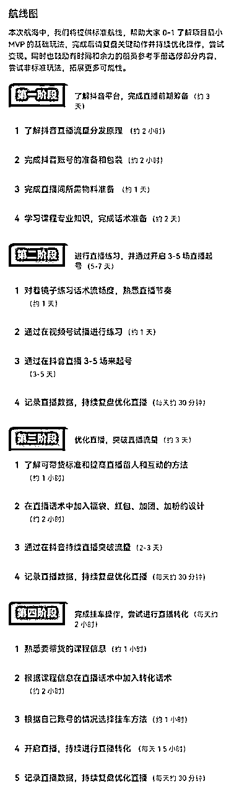

航线图和手册是高度关联的，因此你可以根据自己所在的环节，进行相关步骤的学习。

必修篇

💡

章节概要在这一章节，我们将从认识抖音直播（教育）项目开始，一步步带你完成整个项目流程的学习。你可以根据本章的步骤内容进行实操，跑通最小 MVP。

如果你是本项目新手，建议在正式实操前，先初步了解下项目全貌：✅【项目概述】抖音直播（教育）赛道的机会和玩法

如果你对项目整体有了大致了解，就可以按照项目核心步骤，开始学习实操：

✅【项目实操 1/4】做好前期筹备，准备开播

✅【项目实操 2/4】练习话术，完成起号✅【项目实操 3/4】突破流量环节

✅【项目实操 4/4】转化带货环节

在必修篇，航线图和手册顺序相对应，你可以按照手册的顺序进行学习，即可逐一完成航线图的每一个任务。

在后续的每个关键步骤的章节概要中，我们也将提到相关航线图，提醒你完成相关步骤。

接下来就正式开始吧！

# 一、【项目概述】抖音直播（教育）赛道的机会和玩法

💡

章节概要

本章节中，我们将一起逐渐认识抖音直播（教育）项目。

抖音平台上做教育的空间目前如何？需求大不大？为什么选择在抖音上做该项目？……这些，都是我们在本章节中会解决的问题。

在这一章节，我们会通过这两个问题向你展示整体的项目情况：

❓ 抖音教育直播的市场机会有多大？

❓ 我们如何做抖音教育直播项目？

除此之外，本次航海还帮大家对接了一个引流课包的渠道，帮助大家解决找不到合作课源的问题，降低个人对接教育机构的风险。

但我们对接的渠道也只是你的选择之一，最终可以根据自己的需求自行选择。

⚠️ 当然，无论你选择哪个渠道，都请务必了解清楚产品、结算规则等重要信息再做决定。

本次航海的重点，就是告诉大家如何从 0-1 跑通抖音直播（教育）项目。那么对整体的项目概况了解是必不可少的，一起来了解一下。

## 1.1 抖音教育直播的市场机会有多大？

抖音日活用户已经达到 7 个亿，全球有 32 亿人在刷抖音，这意味着每天有大量用户在使用抖音，流量大，商业空间自然就大。

而根据《2022 教育行业研究白皮书》，抖音知识直播的看播时长增长 165%，且超过 55% 的抖音教育兴趣用户有相关购买行为，其中小课包占比最高，可见这个赛道的需求空间之大。

抖音教育直播简单来说就是在直播间讲解课程知识，吸引到有学习相关知识需求的人群，通过直播挂车售卖课程相关的课程或图书产品。像我们在抖音上刷到的学而思、高途、网易有道等等教育机构的直播，以及一些升学规划、成长规划的老师账号，都是这样一个直播间的形式。

而作为个人来说，我们怎么通过这个项目赚到钱呢？

我们可以采取【直播间镜头展示专业知识内容，通过手上拿笔划重点】的形式（即下图的“手播”）去讲明白对应的知识点。

通过这个直播形式，我们吸引到目标用户，再通过和像上面说的这样的教育机构合作，在直播后半段销售知识相关联的课程或者图书产品，比如在直播时带这些机构的低价引流小课，拿到购买小课的客户线索给到机构，赚取分销佣金。

直播形式如下：

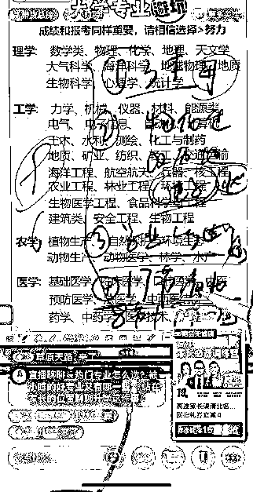

目前大多数个人的教育直播变现方式都是”卖流量“。比如上面直播卖的看似是 15 块钱的小课包，实则课程方会私下结算 60 甚至更高的佣金（佣金多少会根据流量最终 ROI 产出决定具体数额）。

本次航海，我们主要带大家做升学赛道，升学赛道赚钱的机会大不大，值不值得去深耕呢？

先看官方数据：

教育部数据显示，2023 年高考报名人数达到 1291 万人，比去年增加 98 万人，创历史新高。这是竞争空前激烈的一届，同时，也是求学过程格外曲折的一届：他们经历了中考延期，高中三年大部分时间都在疫情中度过，与他们同期毕业的高校学生就业困难。

伴随着这些背景，“高考志愿规划师”（以下简称“规划师”）成为热门职业，根据我们的采访，今年的高考志愿报考的市场人均单价基本已达到 5000 元或以上。根据艾媒咨询今年 6 月 8 日发布的相关报告，2022 年，中国高考志愿填报市场付费规模达 8.8 亿元，预计 2023 年高考志愿填报市场付费规模达 9.5 亿元。

最少从官方数据来看，升学赛道是一个逐步增长的蓝海市场，目前整个行业的问题就是规划师严重不足，尤其是暑期高峰期，而一个规划师能服务的学员是有限的，那这个赛道就是天然的弱内卷行业。内容上重服务轻产品，那对初入者也相对友好，没有头部品牌效应。

确定了整个市场是蓝海市场，下一步就是看线上能不能做？有没有头部 IP？线上的发力点在哪？

整个升学规划行业都是集中在线下市场，自 12 年逐步向上发展至今，新高考改革可以算是行业的一个爆发点。

线上业务的现状是：只有头部 IP 张雪峰，没有头部机构。张雪峰也是从考研转入升学行业。可见这是一个巨大的空白市场，而且是一个非常好做个人 IP 的市场。

上面也说了，这个行业的交付内容是重服务轻产品，内容知识面广。张雪峰的 IP 不管流量多大，他的公司能服务的人是有限的。这个内容的个性化要求非常高，那头部 IP 和机构所带来的压力很小。从教育行业的来说，这是一个可持续做高价续费和转介绍的项目。

目前升学规划行业都是集中在线下业务，线上凤毛麟角。再基于内容的属性，线上就大有可为：

个性化+内容深度，两个因素就决定了线上可批量复制，并且可以深耕。足够的深度就代表有门槛、可持续；个性化那不同风格的规划师都有自己的受众群体，用户的个性化也给了规划师 IP 塑造和变现的抓手。

## 1.2 如何做抖音教育直播项目？

### 1.2.1 第一步：做好基础筹备

别急，别急，在开始第一场直播之前，我们其实也有一系列事项要准备。前期准备充分，后续的直播也能更加游刃有余。

在这个阶段，我们需要做的准备有：1.

直播用的实名抖音账号的准备

更建议你用一个没有直播过的抖音账号。直播过的账号有可能已经被系统打上了其他内容下的标签，想要再洗对标签是有一定难度的。

如果是新号，建议先进行 3-5 天的养号，能让你的抖音账号更加健康。

直播设备准备，包括直播支架和闪光灯等

3.

学习课程专业知识，完成直播话术准备（重点环节）

抖音教育直播间需要靠教育相关的专业知识来吸引目标用户，学习升学考试、所带课程的相关知识是至关重要的。我们要先做好一个好学生，其次是好老师，最后才是好主播。

### 1.2.2 第二步：起号，突破流量

流量是成交的前提，在项目操作中占据了绝对关键位置，要知道，流量是 1，其他都是 0。

因此在刚开始直播时，我们并不需要马上关注在是否变现，而是先通过稳定的直播，突破抖音的流量池，让我们的直播间被更多用户看到。

这个环节需要注意：

1.

直播先不要挂车，否则抖音官方会容易认为这个账号是一个带货的账号，会影响流量突破的速度；

2.

注重互动量、粉丝灯牌、加团转粉等数据的提升。通过一些互动技巧来辅助流量突破。

### 1.2.3 第三步：成交转化

当我们突破了一定的流量池，至少连续两场直播的场观连续两场 1500+ 后，就可以开始挂车带货了。

这里相较于之前突破流量环节的直播，有明显不同的操作有两个：

1.

挂车：1000 粉以上就可以挂小黄车，为了达到这个要求，我们在第二步就需要有一些引导转粉的动作；不过暂时没达到但想带货转化的小伙伴也不要着急，我们可以先挂小雪花来带货，等到达 1000 粉后再换成小黄车即可。

话术调整：在直播话术中加入所带产品的信息和转化话术，促使目标用户在直播间完成下单。

具体每个步骤如何操作？我们将在接下来的实操环节跟大家具体展开。

## 1.3 🎯课包渠道和结算说明

通常情况下，账号直播起量后，会有商务在抖音主动找过来，也会有一些渠道商（二道贩子）找上门，寻求合作。如果有这样的合作请求，建议提前了解以下主要风险：

渠道商跑路的情况时常发生，如果自己对接，建议直接对接甲方商务；如果是个人直接对接甲方商务，需要有公司主体才可以合作，一般次月结算，不过年底可能结算会慢一些；

自己对接甲方，在引流数量不稳定的情况下，这批流量的后续转化情况也变得不稳定，有可能出现 ROI 不满足标准，佣金结算单价比较低，甚至没有佣金的情况。

为了避免以上两个风险，航海期间我们也为大家提供了渠道，以下是该渠道的相关信息：

1.

目前我们对接的渠道是高途 19 元课包，有高一、高二、高三 3 个 SKU，都是升学提分引流课，对应不同的用户人群。

大家出的订单会合并到一起来算，这样可以和甲方谈更高一些的佣金价格，且 ROI 的稳定性上有一定保障。当然，每个人的带货链接都是定向的，哪个客资完成转化，都会明确到人。

这里的 “客资” 指的是在你的直播间购买了 19 元课包的用户，一个拿到了收货地址和手机号的用户即为一个有效客资。

“客资完成转化”指的是这个在体验了 19 元课包后，在甲方处购买了后续的高客单课程。

3.

一般单个客资的佣金在 60-100 元不等，保底（即有客资没有后续转化）在 60 元左右，具体实际单价也会根据订单的转化情况（即 ROI ）来确定，达到一定转化，佣金会在这个范围内浮动。

我们会在每月月初对账，15 号左右为大家进行结算上一个月的佣金。

5.

如果选择该渠道，我们会在航海期间提供定向的商品链接，明确每一个引流客资的来源，方便结算。

当然，当你准备挂车时，我们的渠道可以作为其中一个考虑，其他渠道也可以考虑选择。无论是哪个渠道，可以结算的客资一定是真实的目标用户，禁止刷单，否则很容易被判定为无效订单无法结算。

最终如何合作对接和带货，大家谨慎分析，自行选择即可。

# 二、【项目实操 1/4】做好前期筹备，准备开播

💡

章节概要

了解完抖音教育直播项目的整体情况后，我们就要正式开始启动了。在抖音上顺利完成一场教育直播的前提，是完成前期的账号准备和话术准备。

所以在这一章节，我们整理了直播之前需要筹备的事项，包括：

✅了解抖音直播流量的分发原理

✅完成抖音账号的包装和养号✅准备抖音直播所需要的设备

✅学习专业知识，完成话术准备

其中话术准备是正常直播内容的核心，章节 2.4 为大家展示了在升学的教育赛道里常见的五个话术方向，并且提供了一个话术拆解步骤，方便大家找到对标账号后也能够自己拆解出对应的内容。

但因话术中包含的专业信息细节较多，这一节的内容目前难以用文字清晰全面的展开。

因此我们会在第一场高手领航直播中，重点教大家如何准备一场直播的话术，你一定不要错过。

💡

本章航线图完成本章节的学习和实操，即可完成航线图的第一阶段：了解抖音平台，完成直播前期筹备（约 3 天）

了解抖音直播流量分发原理 （约 2 小时）

完成抖音账号的准备和包装（约 2 小时）

3.完成直播间所需物料准备 （约 1 天）

学习课程专业知识，完成话术准备（约 2 天）

那么现在，就请开始完成这几个步骤的筹备吧。

## 2.1 抖音直播流量分发原理

想要做好抖音，第一件事一定是搞清楚流量分发机制。

这部分内容，我们从 4 个方面进行介绍：

第一，流量进入的 8 个入口，分别有哪些类型的流量，不同类型的直播间，应该重点关注哪个入口。

第二，抖音是按照什么原理来进行流量划分的，为什么有的直播间流量大，有的直播间流量小。

第三，开始直播后，大家会经历的 4 个不同的流量阶段，应该采取哪些措施才能更快进入下一阶段。

第四，抖音重点考核的关键数据有哪些，应该如何提升？

了解清楚这 4 部分，抖音基本就被我们了解清楚了，接下来的行动也就更有目的性。

### 2.1.1 直播流量的 8 大入口

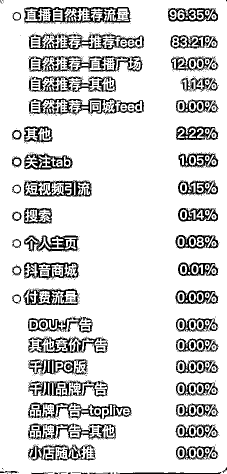

上面的图片是抖音后台的流量来源统计表，代表我们直播间进入的所有流量分别来自于哪些渠道。

每个入口代表的具体含义，可以参考下表，给大家做了详细注解。

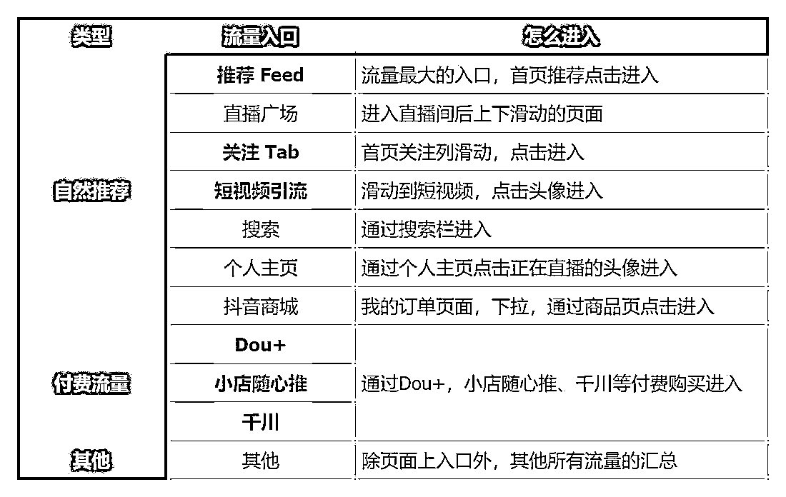

需要注意的是：

1.

以上流量入口中，推荐 Feed 是我们直播间人气想要做高，最重要的一个流量来源，这个渠道推来的主要都是新流量。

关注 Tab 是后续直播间有基础粉丝后，比重才会逐渐增加的一个流量来源，以粉丝流量为主。

短视频引流带来的用户精准度会比推荐 Feed 更高，所以知识付费的博主一定不能忽略这部分的流量。

### 2.1.2 同级竞争流量池原理

在抖音平台，所有开播的直播间都会被划分在不同的等级中，共有 SABCDE 六个等级，每个等级对应不同的流量大小：S 级：每小时平均场观 186 万人，有 262 个直播间在这个级别，占直播间总量的 0.03%

A 级：每小时平均场观 36 万人，有 3348 个直播间在这个级别，占直播间总量的 0.36%B 级：每小时平均场观 6.7 万人，有 3.3 万个直播间在这个级别，占直播间总量的 3.56%

C 级：每小时平均场观 1.1 万人，有 15.4 万个直播间在这个级别，占直播间总量的 16.52%

D 级：每小时平均场观 1540 人，有 32.1 万个直播间在这个级别，占直播间总量的 34.37%E 级：每小时平均场观 165 人，有 42.1 万个直播间在这个级别，占直播间总量的 45.16%

从上面的流量池分布可以看出，抖音是一个非常提倡内卷的平台，能获得极大流量的永远都是少部分人。

超过 70%的直播间其实都处于每小时场观在 1600 人以下，只有不到 20%会进入每小时场观破 10000 人的流量池。剩余的 5%有可能进入单小时场观在 5 万人以上的流量池。

但流量并不完全等同于变现能力，对于知识付费的直播间来讲，单个用户的价值能做到 1 元以上，那么即使我们在 500 人的流量池，单场直播 2 小时，也会获得 1000 元以上的销售额。

当我们开始直播后，前期流量少，不精准都是正常现象，经过了一段时间的内容输出后，抖音才能帮我们找到更加精准的用户。

所以谁能坚持冲破前期的黑暗，才能获得最终的胜利果实。

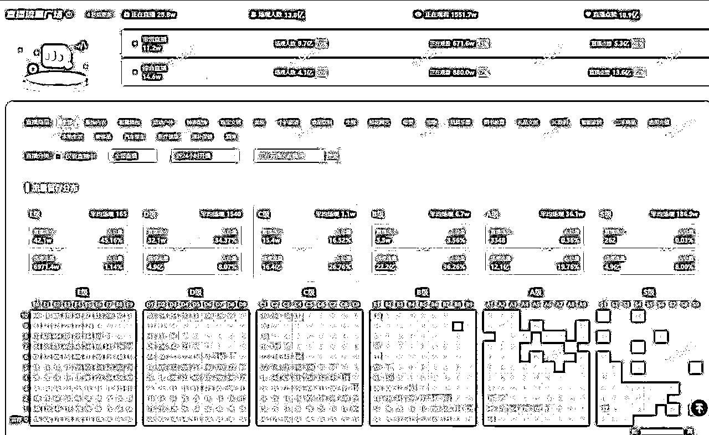

整个层级是倒三角模型，所有新账号开始会从低层级开始，当整体的数据指标高于同层级的其他账号时，才有可能升级到上一个层级，就像游戏里升级打怪一样。

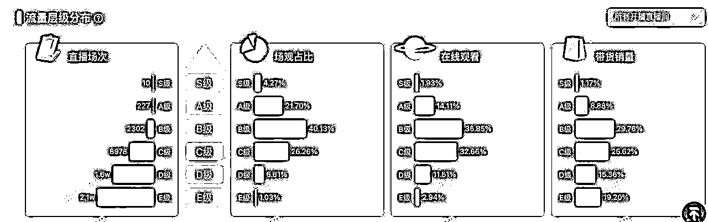

### 2.1.3 直播起号 4 大阶段

上一节我们讲到了，账号流量是由流量层级决定的，而层级是由你的数据和其他直播间的排名决定的，所以这一节我们重点讲一下对于一个新账号，如何把流量层级做高。

对于新账号而言，大概率会经历的 4 个阶段，在不同阶段分别做哪些动作，能够帮助我们更快突破进入下一个流量池。具体的时间段特点以及需要重点完成的动作和数据指标，大家可以参考下面的表格：阶段

特点

目标动作

数据参考

注意事项风控期

1h 场观<200

这个时间段直播间会有很多大头人，不说话也不走

并且整场下来，总流量很低，这是抖音在对账号进行风险控制，前期不会来大流量。

这是正常现象，往往会持续 1～7 天左右，正常直播练习直播话术即可。

破风控，让抖音认为你是一个正常的直播间

直播 1 小时以上

人均看播时长>20 秒互动率>1%

一。这个流量非常小的时间段，尽量不要做以下事项，后续流量正常后再做没关系

1.不要主动找人搜索/分享/大量小号同 WiFi 进入直播间

2.不要频繁切换地区登录

3.不要用注册卡/物联网卡 4.不要一证多实名

5.不要开始就违规

6.不要拉黑大头娃娃

# 二、测时段

1.选择你能长期坚持开播的时间段以及你的目标用户活跃的时间段（最开始可以先参考同行，后期可以查看自己的分析画像分析）

2.分别开播 1～2h，对比哪个时间段流量相对更大一些 3.可以一天开播 2～3 场，场与场之间尽量相差 2 小时以上。

# 三、练话术

一定要保持开播时间段内一直在讲解当前领域的内容，抖音每时每刻都在监听你的直播间在讲什么内容，所以越早让抖音抓到你的关键词数据，会越容易度过风控期

同时，这个阶段也是熟悉话术和直播流程最好的时间段。

冷启动期

1h 流量 200～500 左右

提升流量层级

直播 1 小时以上人均看播时长>30 秒

互动率>1%

有成交人数

冷启动期，我们的在线人数往往在 10～20 人左右，所以这时去做产品售卖难度很大，这个阶段，我们主要做用户停留和互动数据。

可以选择福利产品/福利资料，配合互动话术做直播间的互动数据。

基础数据达标后，5～7 场左右，单场流量有可能突破到下一个流量池

增长期

1h 流量 2000 左右

打上账号标签

直播 1 小时以上人均看播时长>1 分钟

互动率>1%

成交人数（或粉丝团人数）>观看人数 1%

口碑分 4.8 分以上增长期的账号，抖音会推荐更多流量进入，此时也是决定这个账号后续更大流量精准度的关键时刻

在这个时间段，成交（或粉丝团人数）

是决定账号标签的重要指标，因为付费用户对账号标签的影响更大。

【带货直播间，按照成交人数计算，非带货直播间按照粉丝团计算。】在这个阶段，重点可以上架一些低价 1 元链接，用于赠送课程相关福利资料，或者提醒用户，成为粉丝团成员后，下次开播会第一时间通知，以及成为更高等级的粉丝团后，可获得高级资料包。

用于提升本场直播的粉丝团加入率。

成交单量大于 30 单后，账号口碑分会出现。口碑分降低，自然流量的推流会有明显减少，所以口碑分尽量维持在 4.8 分以上。

成熟期

1h 流量 5000 及以上

账号商业价值直播 1 小时以上

人均看播时长>1 分 30 秒

互动率>2%

成交人数>观看人数 1%

uv 价值>1 千次观看成交金额>1000

稳定期的账号，抖音对于商业价值的指标考核会更加严格，所以在这个时间段，想要稳定维持大流量，需要在稳定基本停留、互动数据之外，产生更高的销售额数据。

销售额可以通过提升客单价/增加转化率两个手段来进行。

### 2.1.4 直播间的核心数据

以下数据，通过巨量百应后台 - 数据参谋 - 直播数据 - 单场直播数据详情都可以进行查看。

或下播后在抖音手机端 - 右上角三道杠 - 创作者服务中心（企业号为企业服务中心）- 主播中心可查看

抖音在流量分发的过程中，最根本的依据一定是直播间用户实时产生的数据，利用这些数据量化每个直播间的能力水平，从而进行排名，再按照排名进行流量分发，所以弄清楚关键的数据指标，对我们来讲意义重大。

下面的表格给大家整理了在做抖音直播过程中，最应该重点关注的几项数据指标，以及如何提升这项指标的方法：

直播重点数据

数据指标

含义

注意事项内容数据

曝光点击率

看到直播间画面曝光后，点击进入的用户比例

抖音给的推流是直播页面的曝光，只有看到曝光的用户愿意点击进入直播间，才能成为直播间的一次场观，所以这个指标直接决定了直播间 90%以上的场观人数。

这个指标重点与直播间的场景设置、主播的讲解状态，以及当前讲解的话题内容相关。

场观/累计观看人数正常直播间进入的用户数量

随着直播时间增加，总场观人数一定会增加。

但衡量直播间流量大小的方式不是看总人数，而是单位时间内的人数，如 1 小时推流总人数为 1 万人，和 5 小时总推流 1 万人，直播间的成交转化效率是完全不同的。

所以我们在分析流量大小时，一般会换算至每小时的推流人数，去和同行对标账号进行对比。

人均看播时长

进入直播间所有用户平均停留时长

计算方式为所有用户停留的总时长除以场观人数，反映的是直播间用户的感兴趣程度，也是最重要的决定直播间总场观的关键指标。

40 秒以上有效观看人数

整场所有进入直播间的用户中观看 40 秒以上的用户人数

只看几秒就划走的用户意味着对我们的直播内容并不感兴趣，对于抖音来讲，这样的用户被称为无效观看人数，所以在整场观看直播的用户来讲，抖音设定有效观看时长为 40 秒的用户才作为真正的有效看播用户，而这样的用户比例越高，证明我们直播间的内容越优质。

所以抖音后台有一个非常重要的数据指标，叫做 40 秒以上有效观看人数，这个指标目前只能看到自己的，还没有第三方平台可以查看同行的数据，我们公司内部，对于这个指标的及格值为 20%的观看用户。

点赞比

本场直播点赞人数/本场总观看人数

反映直播间用户活跃度，提升直播间热度，让新进入的用户更愿意停留，间接提升直播间总场观评论比

本场评论人数/本场总观看人数

反映直播间用户活跃度，提升直播间热度，让新进入的用户更愿意停留，间接提升直播间总场观互动率

本场点赞、评论的总人数/总观看人数

反映直播间用户活跃度，提升直播间热度，让新进入的用户更愿意停留，间接提升直播间总场观

转粉率

本场关注主播的人/本场总场观人数反映直播间内容的价值感，间接影响直播间推流

粉丝团

愿意花 1 抖币（0.1 元）成为粉丝团的用户粉丝团用户是愿意在直播间付费的用户，对流量的影响权重大于关注，但小于成交，对于非带货直播间，这个数据指标非常关键。

商业数据

gmv / 销售额本场总销售额

反映本场总销售金额，不直接影响流量

商品点击率

商品点击人数/商品曝光人数反映单个产品对用户的吸引力，10%以上为合格值，20%为爆品

商品转化率

商品成交人数/商品点击人数

反映直播间逼单成交能力，5%以上为合格，10%以上为优秀 uv 价值

销售额/场观人数

反映抖音推荐的每个用户，在直播间创造多少价值，当场观大于 5000 人以上时，对流量精准度和是否能进入下一流量池有影响

gpm/千次观看成交金额

销售额/场观次数*1000 反映抖音推来的每次观看，在直播间创造多少价值，作用同 uv 价值，但表现的更精准，因为每个用户可以重复进入直播间多次，所以 uv 价值为 1，千次观看成交金额可能小于 1000。

## 2.2 抖音账号包装和养号

### 2.2.1 抖音账号注册

具体注册的步骤这里不再赘述，但需要注意的是：

注册时，尽量做到一机一卡，并且使用流量注册，增加账号的安全性。

### 2.2.2 抖音账号包装

无论是新注册的账号，还是准备使用老账号进行该项目，我们都需要对账号进行一定的包装，让目标用户清晰的看到我们的业务内容，并通过昵称、头像和简介建立专业人设，获取第一眼的信任，为后续的留存和转化做好准备。

昵称我们在昵称上直接写明自己的业务内容，方便目标用户看到。以下是一种可参考的昵称组合方式：

A：升学、升学规划、升学指导、生涯规划、升学课堂

B：XX 老师、XX 主任、XX 校长、名字昵称可以为 A+B 随意组合，比如：升学指导 - 小桃老师

需要注意的是：为了账号安全，昵称中不可带有广告性，也不可以留 V。

头像一般有两种常见的头像：

① 有亲和力的照片/形象照（推荐）

② 纯文字照片

需要注意的是：头像需要符合定位、符合昵称调性，不要用一些浮夸的动漫形象。

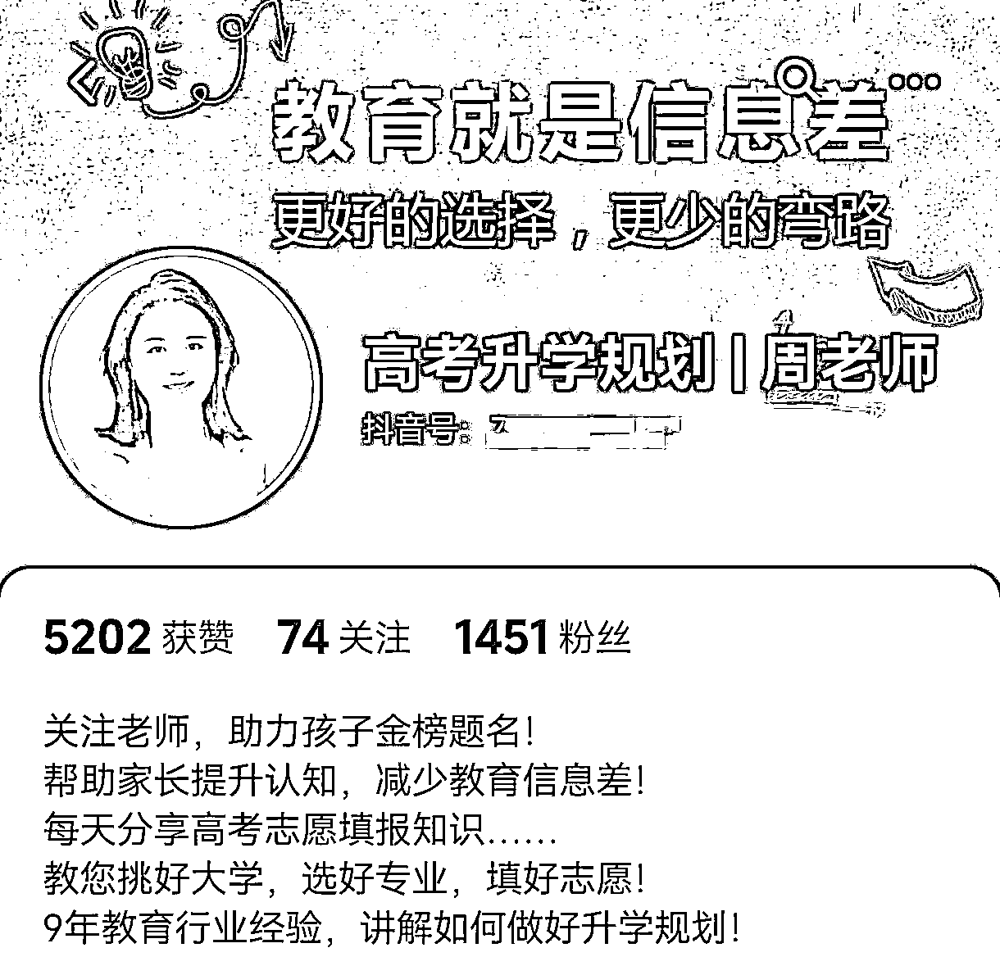

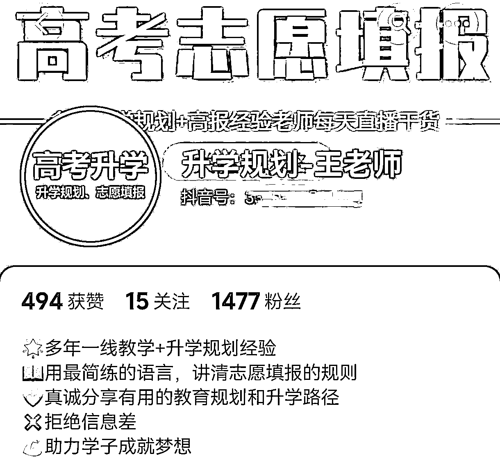

照片类的大家自行拍摄即可，这里给大家一个文字版头像的制作方法：第一步：打开醒图，点击导入，然后点击添加画布、选择 1：1、选择喜欢的颜色。

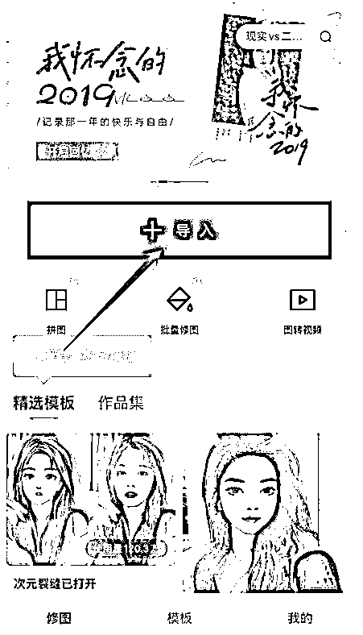

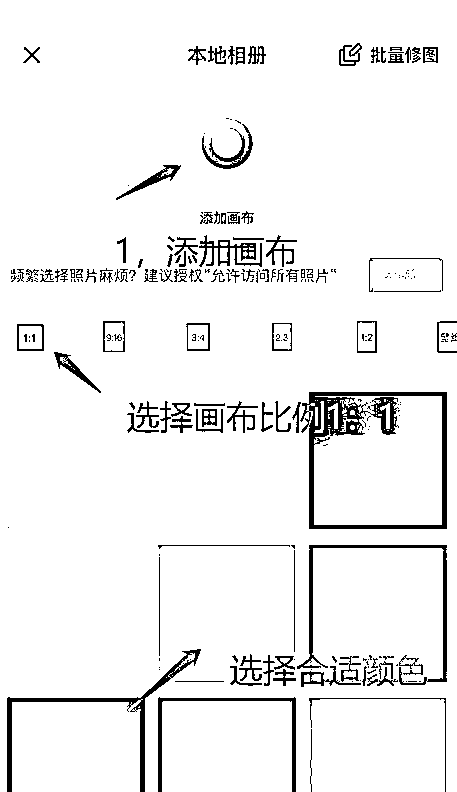

第二步：点击文字，输入自己想要的文字，选择合适字体，并且点击 “样式” 选择颜色，用双指调节大小和位置。

注：输入后如果希望文字变成两行，在对应分开的地方按回车即可分行

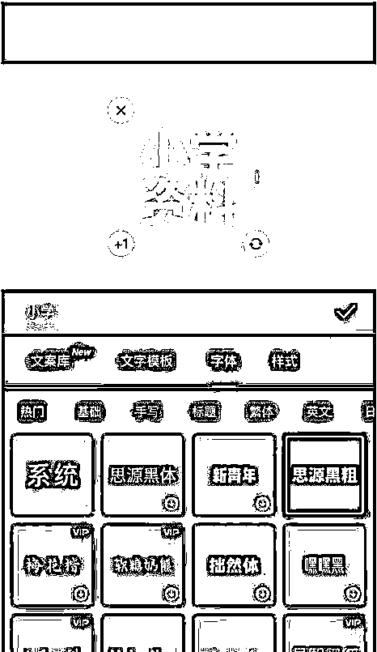

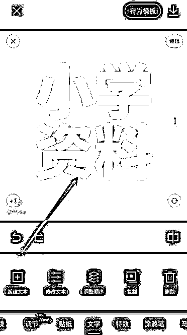

第三步：点击右上角下载即可保存到相册。

简介简介中可以简单明了的告诉用户你是什么人，能够做什么，通常有以下四个信息：

我最擅长什么我有多厉害

我能给你提供什么

能给你带来什么样的理想结果示例：

高考志愿填报专家 硕士研究生

辅导上万名考生志愿填报与升学规划

教你挑大学、选专业、填志愿、祝你金榜题名

初一初二初三高一高二高三家长重点关注

也可以参考头像处举例的两个案例的简介来编辑自己的简介。

### 2.2.3 抖音账号养号

新账号注册完成之后，正常使用 3 - 5 天，每天刷的时间不限制，有时间就多刷一会，没时间就少刷一会，但一定要去使用。

刷的时候可以看看直播、视频、同城都可以，正常点赞、收藏、评论他人作品。

最好可以通过此抖音号购物（不购也可），抖音无需定向浏览内容，想看什么看什么。

另外，没开过直播的老账号，将原先的作品隐藏后，一样可以使用。

## 2.3 直播设备准备

我们的直播形式为手播，只需要露出手部位置，能够拍摄清楚手部的写写画画，或者可以拍摄清楚我们展示的屏幕即可。因此建议刚开始直播的时候准备以下相关设备即可：

1.

直播用的手机，推荐使用苹果手机

2.展示内容用的纸笔（有电脑也可以展示电脑屏幕）

放直播手机用的直播支架

4.

补光灯

直播支架和补光灯可以参考以下的产品准备：

1.直播支架

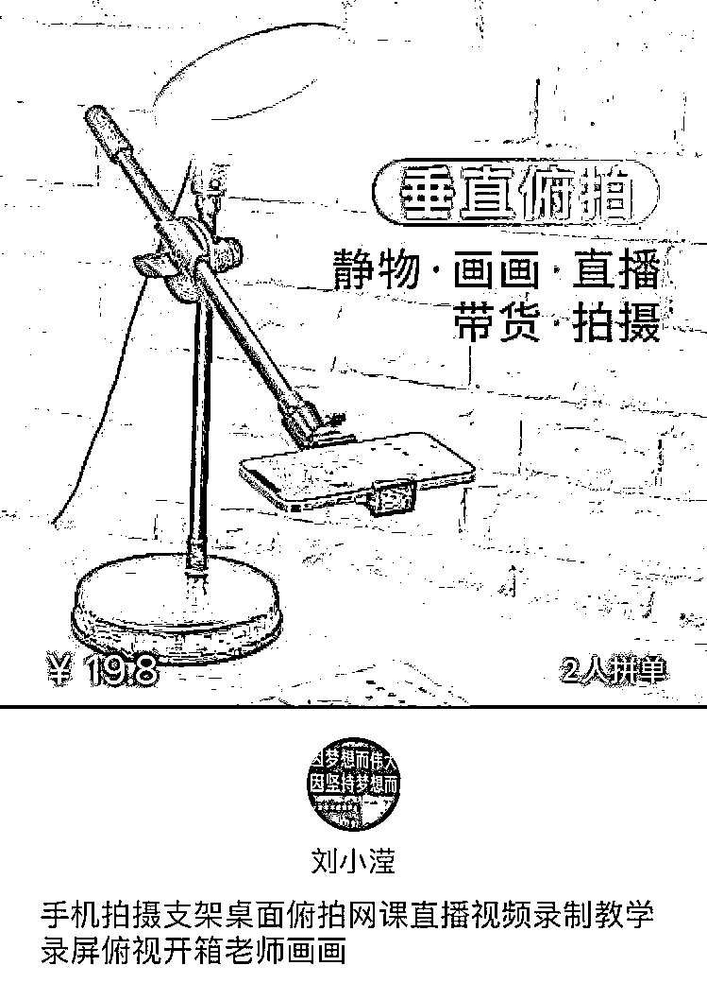

补光灯

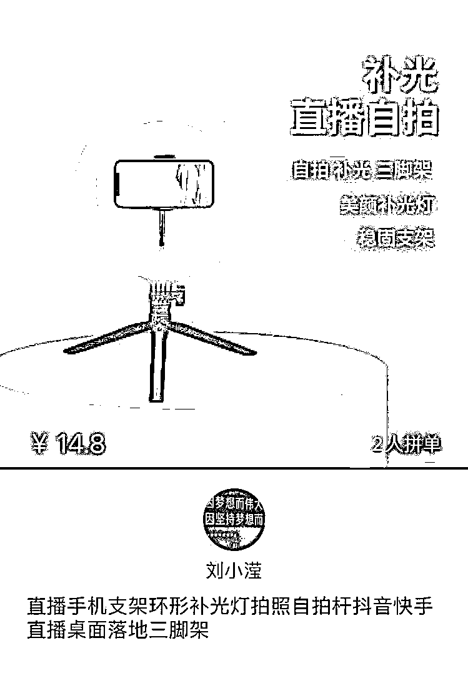

## 2.4 学习专业知识，完成话术准备

话术是开启直播的第一步，平时我们看到的知识直播间都是”脚本化“的存在，也就是说必须先准备好话术，才能开启直播。

直播是否成功，80%取决于话术。

首先要保证用户能听得懂，其次保证用户听得下去，只有准备好一份好话术，才能做好直播间的停留互动各项数据。

做升学赛道，我们可以通过阳光高考网获取直播所需的专业知识，网站包含政策、招生章程、专业解读、各地报考安排、院校查询、报考指南等等各类信息：

阳光高考网：https://gaokao.chsi.com.cn/

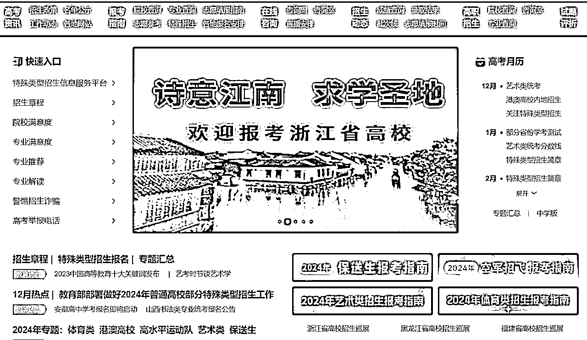

接下来我们通过常见的直播形式，来说明都需要哪些专业知识作为话术筹备。所需话术大部分都可以在阳光高考网中找到，也可以通过互联网搜索做一些信息补充。

### 2.4.1 常见直播形式所需话术

通常来说，以下这几种形式都是比较主流的直播形式，在搜其他升学直播间作为参考时，相信你也看到过。

需要注意的是，不同的时间点推荐直播的方向不同，这些直播形式对应的是学生的时间节点，我们要根据不同的节点调整自己的直播形式。

比如选课覆盖的是高一的用户和新高一的用户，所以说他基本上在五月到十月会特别好；

志愿填报和特殊升学更多覆盖高三的用户，所以基本上在每年的十月之后，到第二年的五六月比较爆。

#### 2.4.1.1 形式一：【特殊升学】33 种升学路径

除高考出成绩靠裸分可上大学外，新高考政策下还有 30 多种多元升学路径，特殊升学直播间旨在帮助家长了解多元升学路径下的信息差。

说明：直播形式只是直播形式，不用考虑知识点完全匹配，比如“33 种升学路径”只是一个标题，不可能真的讲 完 33 种不同的升学路径，而是会根据近期热点，以及直播间的用户需求进行灵活调整。

常见直播间讲解形式如下：

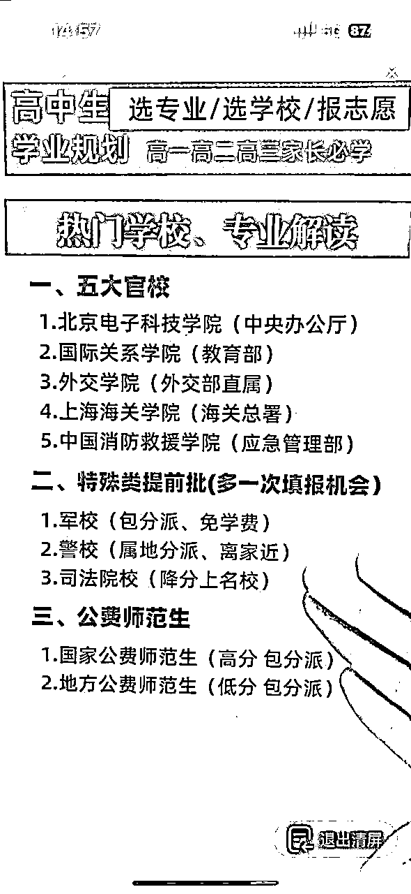

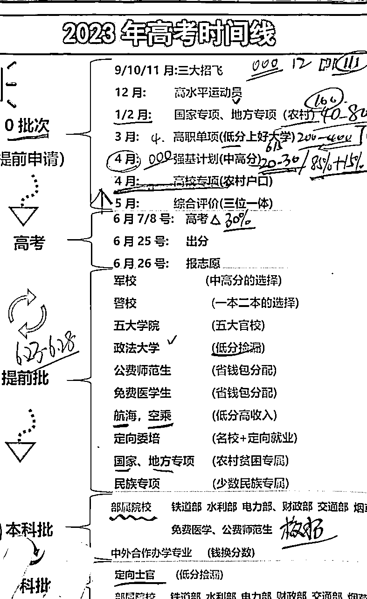

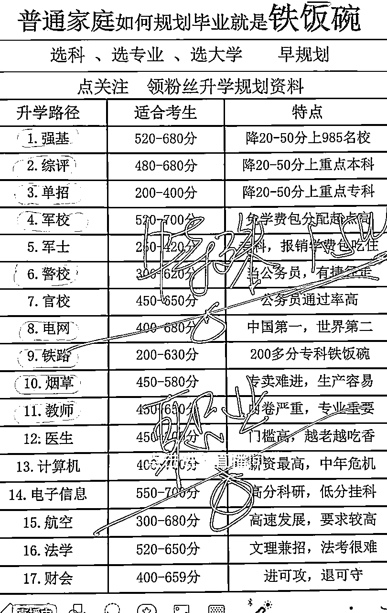

直播间常见知识提炼，话术中主要准备以下四部分内容：（具体知识细节查询阳光高考网）

各类升学路径报考时间

各类升学路径报考方式

各类升学路径报考条件各类升学路径报考步骤

这里也做了一个特殊升学下的机会点汇总。供你参考：

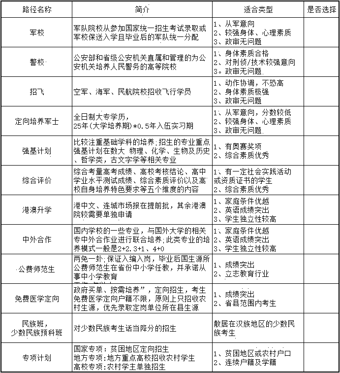

脚本参考：特殊升学方向

注意：该脚本仅作为参考，里面的相关内容，需要你通过阳光高考网查询到最新信息后，完成一个自己的脚本。

#### 2.4.1.2 形式二：【选专业】热门专业解读

热门专业，即为 2023 年招生计划数量排名前 20 专业。招生计划越多的专业，意味着家长关注度越高，我们在抖音直播选专业

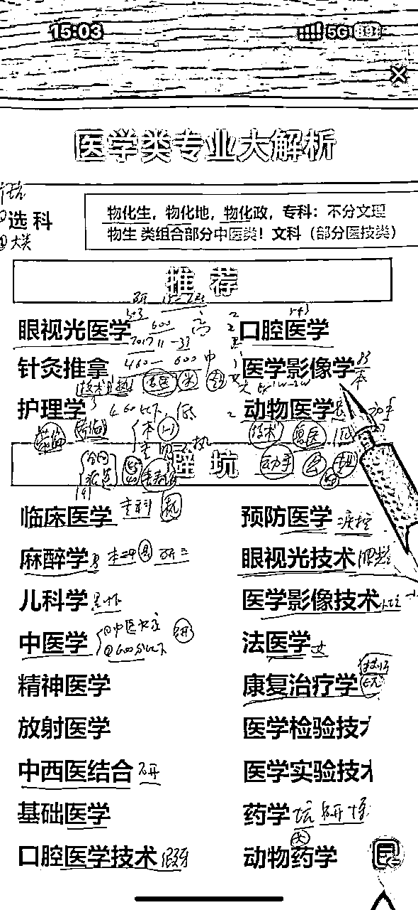

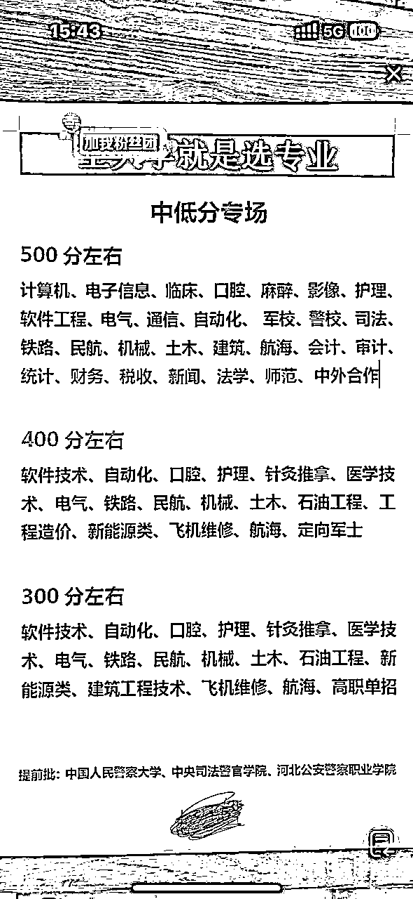

直播间知识点提炼：

热门专业对应就业方向热门专业对应就业薪资

热门专业对应院校热门专业对应选科要求

这四个知识点的具体内容，可参考对标直播间及短视频内容、小红书相关笔记内容、通过百度搜索等方式，找到资料，整理为自己的话术，部分内容可参考以下脚本。

脚本参考：专业方向

#### 2.4.1.3 形式三：【选科】新高一选科必学知识点

新高考政策下选科不再是传统的文理分科，而是按省份分别有 3+3 模式和 3+1+2 模式。其中北京、上海、浙江、天津、山东、海南属于 3+3 省份，除语文数学外语之外的其余 6 小科学生可随机 3 科组合选择，共有 20 种选择，其中浙江 6 小科之外又多了 “技术” 单科，相当于 7 小科随机组合选择 3 科，共有 35 种选择。

除此之外的省份属于 3+1+2 模式，6 小科中物理、历史必选其一，剩下 4 门随机组合选择 2 门，共有 12 种选科组合。

组合复杂，家长孩子都不知道如何选择，如果我们能够在直播间帮助家长学生全面了解选科政策，最终做出科学合理的选择，那么也就可以吸引到这些目标用户。

常见直播形式：

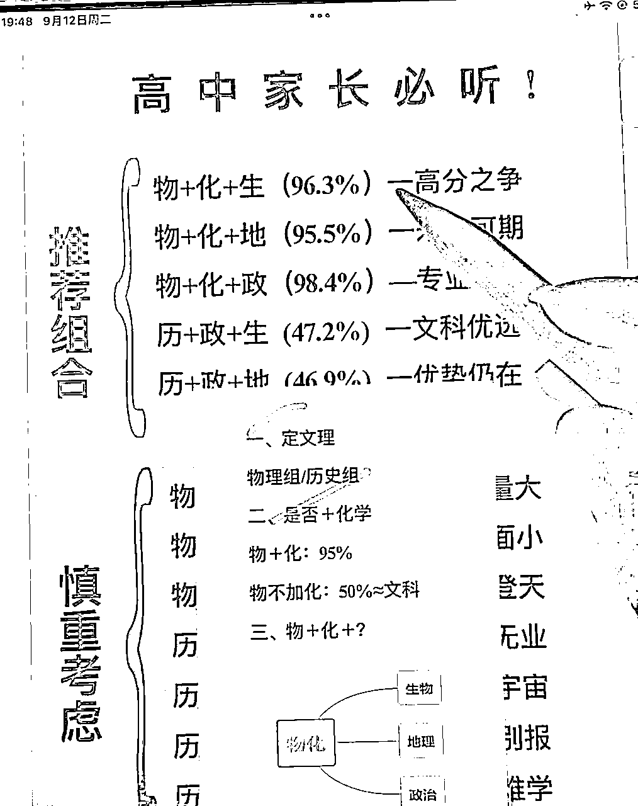

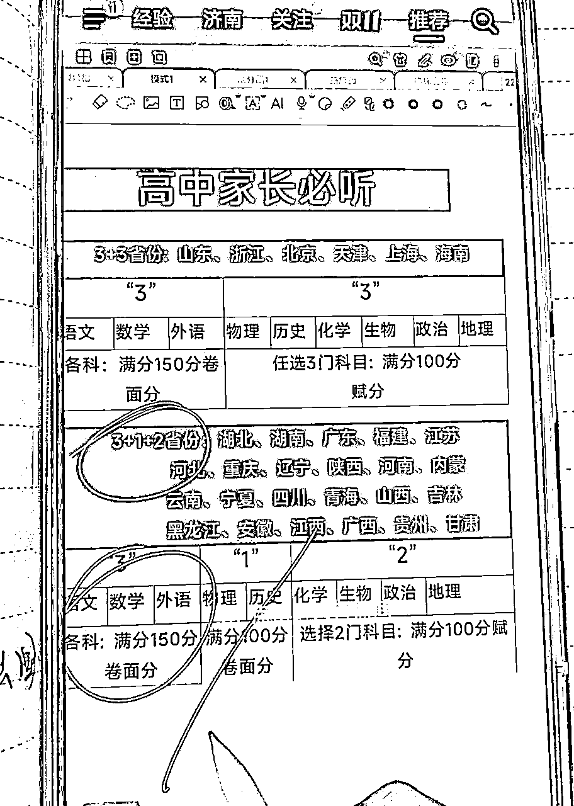

直播中覆盖知识点提炼：各选科覆盖率

选科组合对比各省份政策

选科专业方向

这四个知识点的具体内容，可参考阳光高考网、对标直播间及短视频内容、小红书相关笔记内容、百度搜索等方式，找到资料，整理为自己的话术，部分内容可参考以下脚本。

脚本参考：选科方向

#### 2.4.1.4 形式四：【志愿填报】平行志愿下的填报技巧和案例解读

新高考政策下几乎所有省份都开始实行平行志愿。

平行志愿不同于传统的顺序志愿，既要保证分数的有效利用还不能退档滑档，该直播内容旨在帮助家长全面了解平行志愿下的填报规则和填报方法学习。

常见直播形式：

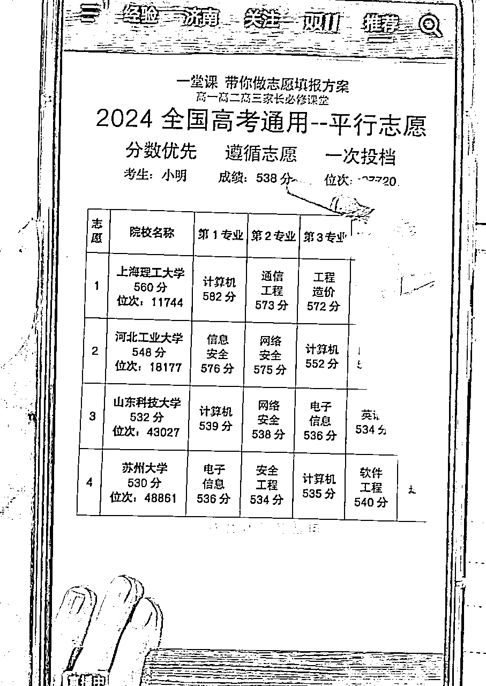

直播间知识点提炼（可参考对标直播间学习）：

志愿填报流程近 3-5 年分数线

退档滑档等分数计算

院校和专业分析案例分析解读

脚本参考：志愿填报方向

#### 2.4.1.5 形式五：【综合直播】专业+填报

这种形式的直播，不再单单讲一个方向的内容，而是可以随机组合以上 4 个方向内容，给到更加综合的建议，解答更多元的用户问题。

常见的直播话术内容构成有以下三块：专业解读对应院校

志愿填报流程规则

填报中遇到的问题退档滑档部分话术内容可参考以下脚本：

脚本参考：专业+填报方向

### 2.4.2 话术拆解的步骤

#### 2.4.2.1 录制对标话术

这里我们可以使用小绿点+飞书工具来录制对标直播间的话术。

小绿点安装升级 2023.rar

飞书官网下载地址：https://www.feishu.cn/使用步骤：

第一步：按照「小绿点安装升级 2023.rar」工具压缩包中的安装步骤，安装好小绿点第二步：网页版抖音搜索想要录制的升学规划账号直播间名字，进入直播间，然后点击进入详情

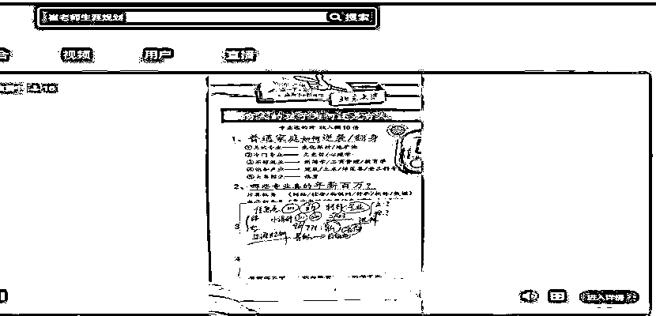

第三步：进入网页后复制网页链接

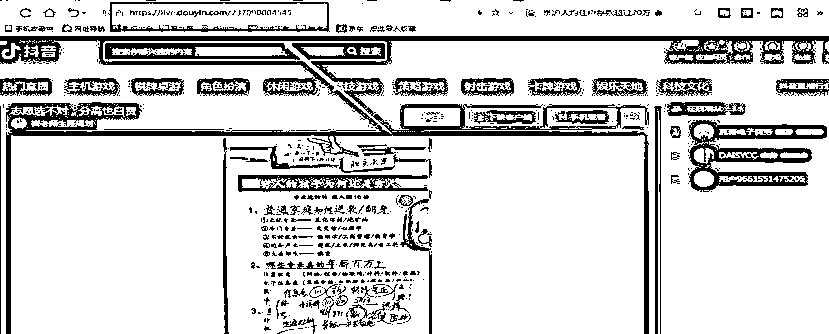

如果是手机上查找的直播间，拿到以下这个分享链接也可以：

第四步：将链接复制后，打开小绿点找到添加主播，单击空白处将链接粘贴上，点击添加到主播列表，然后检测录制，选择我已知晓，开启守护

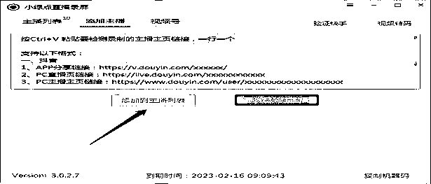

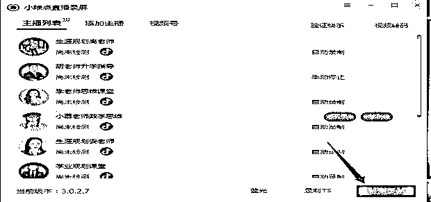

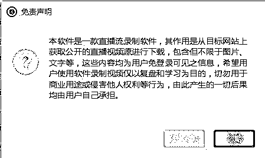

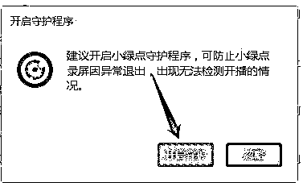

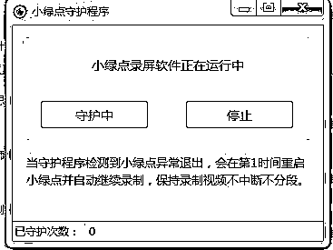

第五步：添加完成后则开始自动录制，添加过后下次录制不用再次添加，打开小绿点后主播开播会自动录制

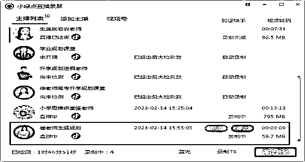

第六步：右击已经录制完成的找到打开视频目录则可找到刚录制的视频

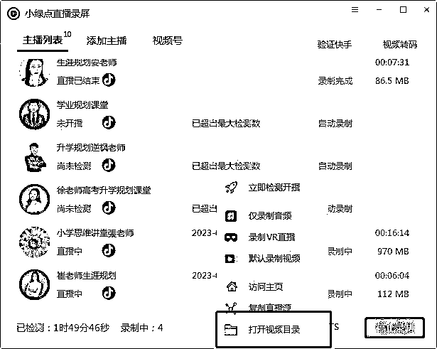

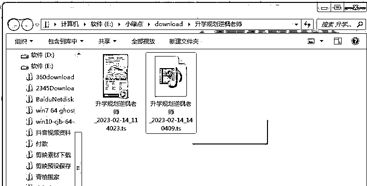

第七步：右击视频找到视频转 MP4 格式，找到视频转码 MP4，点击开始转码，转码完成后在原文档会出现一个 MP4 的文档，将此文档上传到飞书妙记，即可进行视频转记提取文字。

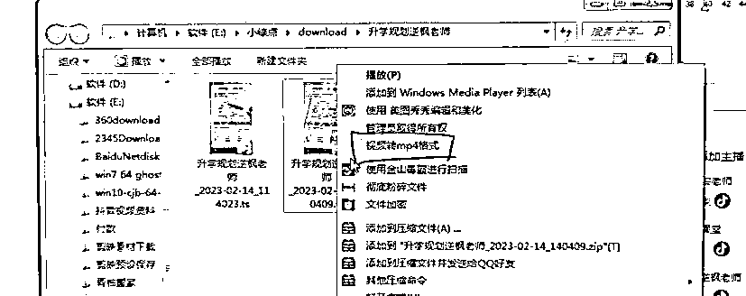

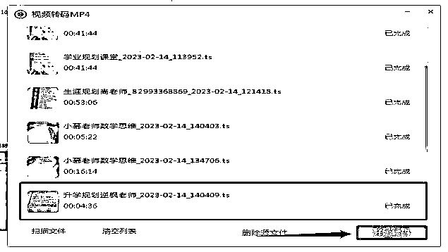

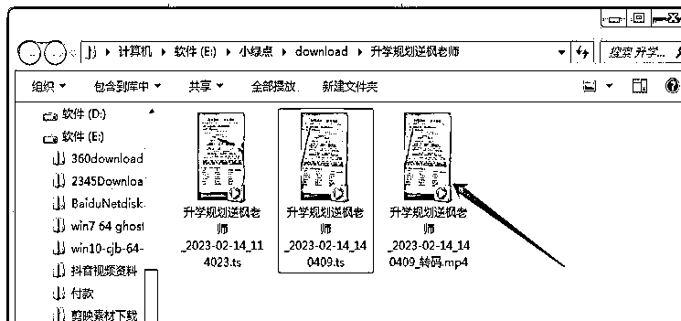

#### 2.4.2.2 专业知识拆解

跟着上一节的步骤，我们已经拿到了对标直播间的话术，那么接下来就开始提炼该话术下所有专业知识点，形成知识模块。

以「选科原稿」为例：

以下段落大多数是暖场抛出几个问题：1、没有选政治能不能报军警院校

2、什么情况下应该选文科？

3、选科 3 种模式（3+3、3+1+2、文理）

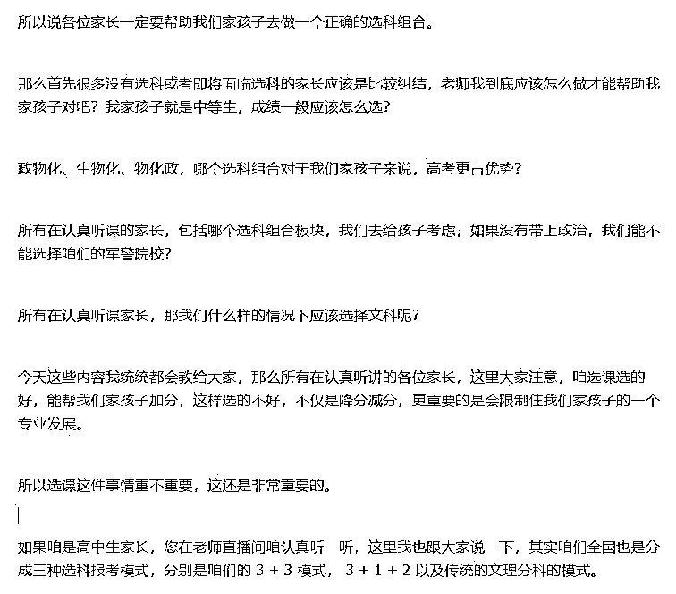

以下 3 段讲解哪些省份是 3+3，哪些省份是 3+1+2：

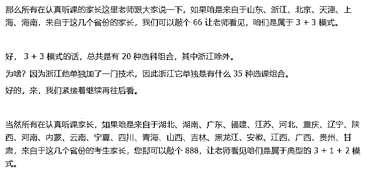

以下段落讲解知识模块：

1、什么是 3+3，什么是 3+1+2？

2、每个组合分别能报的专业差别

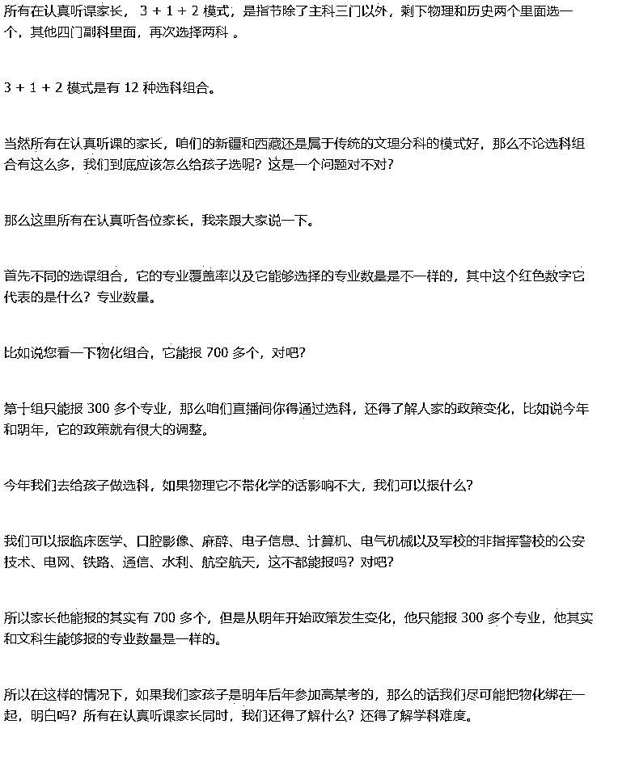

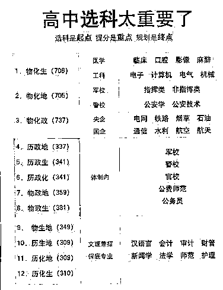

以下段落讲解知识模块：学科难度讲解

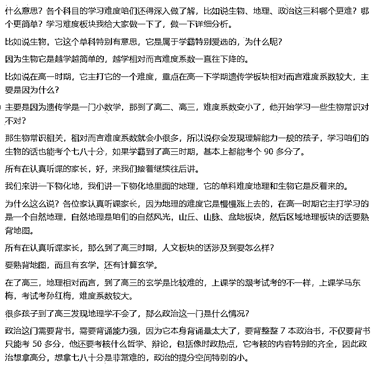

#### 2.4.2.3 互动话术拆解

专业内容的话术拆解出来后，我们来看看对标直播间是如何设计互动话术的，一般来说我们要做到每 5 分钟 1 次互动，每 3 分钟一次点赞。

例如在以上案例话术中标红的部分即为他的互动话术，我们也把互动话术拆解出来并且做一个明显的标识，方便区分和参考。

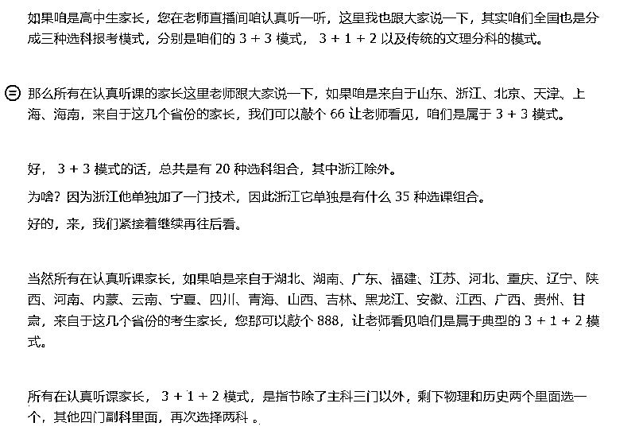

#### 2.4.2.4 带货话术拆解

这一步主要拆解挂车后，直播后半段时间主播在推荐挂车商品时所讲的转化话术。我们可以在可以挂车，准备增加转化话术的时候再对这部分内容进行拆解。

这份话术就直播期间从专业知识转到推荐挂车商品的话术原稿，给大家作为参考：19 元课带课话术

# 三、【项目实操 2/4】练习话术，完成起号

💡

章节概要话术准备好，我们就可以马上开启直播了吗？

先等一等。一场直播可没有暂停重来的机会，你如何表达你的内容和观点，将第一时间传播到用户端，因此我们在开直播之前，还需要做好联系，确保直播时能够流畅、自然的完成内容讲解，这样也将很大程度下影响起号速度。

所以在这一章节，我们来看看如何练习以及开启直播起号的：

✅练习内容熟练度和流畅度：经历四个阶段，掌握直播话术

✅成功开启一场直播，并通过 3-5 场直播进行起号

💡

本章航线图完成本章节的学习和实操，即可完成航线图的第二阶段：进行直播练习，并通过开启 3-5 场直播起号（5-7 天）

对着镜子练习话术流畅度，熟悉直播节奏（约 1 天）

通过在视频号试播进行练习（约 1 天）

3.通过在抖音直播 3-5 场来起号 （3-5 天）

记录直播数据，持续复盘优化直播（每天约 30 分钟）

那么现在，就请开始练习吧。

## 3.1 练习内容熟练度和流畅度

主播的能力，本质上是一种熟练度练习。当直播内容准备好后，为了讲解时更顺畅，你可以完成以下 4 个阶段的练习。

注意：每一个阶段的练习，都要把自己的稿子至少读三遍，并且进行录音，每一遍都听回放。再和高赞的直播间同样的 5 分钟进行对比，找到优化点继续优化。

### 3.1.1 阶段一：流畅度练习

直播是一个实时进行的过程，所以主播本人对内容的熟悉程度非常关键。

一旦卡壳，会大大降低用户的信任感，所以话术准备好后，至少要进行 3-5 次的通读，达到讲解不卡壳不停顿、不卡壳、不重复的熟练度。

本阶段完成目标：一份逐字稿+一份大纲，只看大纲，可以把逐字稿完整讲述出来即可。

### 3.1.2 阶段二：声音穿透性练习，重点话术练习情绪

声音穿透性 - 增强个人气场

本阶段完成目标：找 10 米远的距离，站在一头，想办法让另一头的人听清楚你的直播内容，通过这种方式，打破心理畏惧，练习声音穿透性，提升直播间的曝光进入率。

### 3.1.3 阶段三：重点话术练习

这时候我们可以对着镜子进行练习。每个知识点中的重点字词，讲解时需要进行强调，让整体话术内容输出时有抑扬顿挫的感觉。

本阶段完成目标：录制自己的直播内容，结束后回听，没有念稿的感觉，听得出有情绪的起伏变化。

### 3.1.4 阶段四：练自信，练动作

对着镜子练习还是缺少一些真实感，因此我们可以选择通过视频号上进行一次试播，直播后通过回放检查自己的话术掌握程度。

当直播内容进入可以自由发挥的阶段，适当加入手部动作，辅助讲解内容中的一些态度与观点，可以加强情绪价值。

本阶段完成目标：录制直播内容，结合声音和动作，能让人产生代入感。

视频号开播试播步骤：

第一步：搜索视频号进入

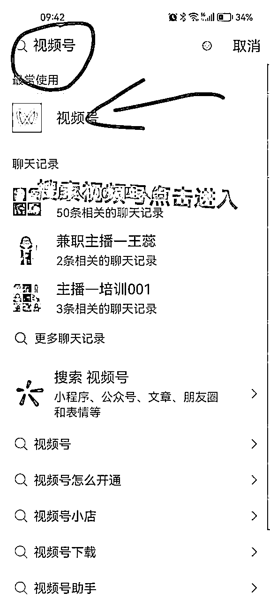

第二步：右上角进入个人中心

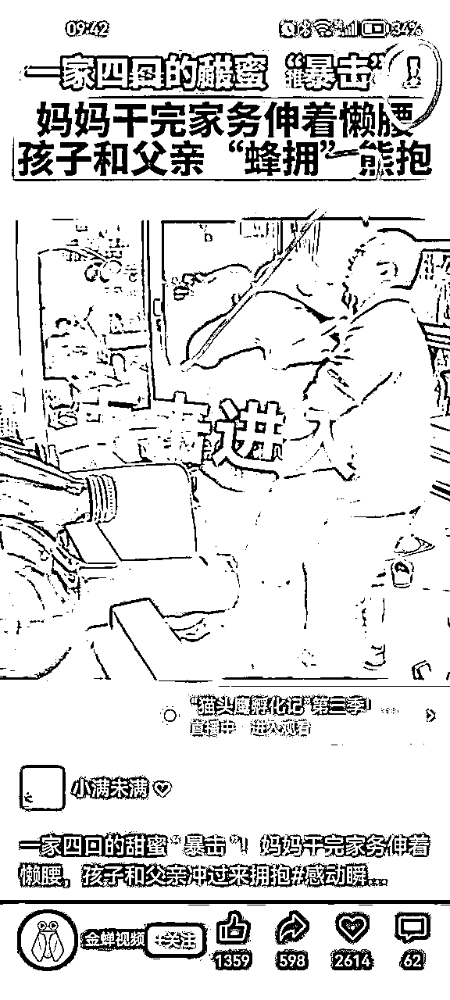

第三步：点击发起直播

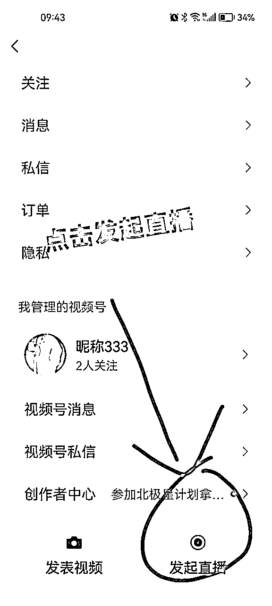

第四步：点击直播模式进入进行修改

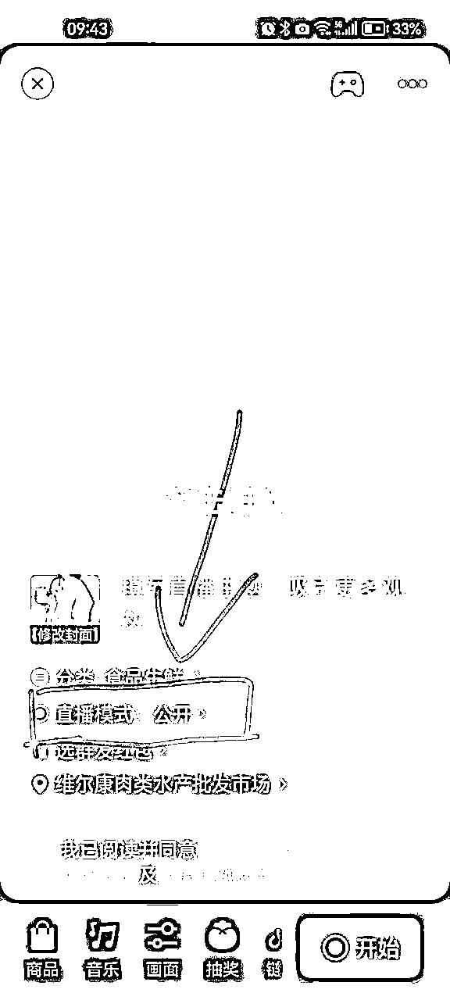

第五步：选择直播模式为部分可见

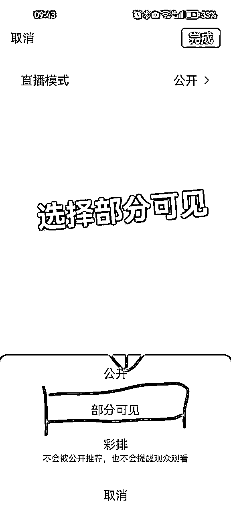

第六步：点击“画面”

第七步：点击翻转

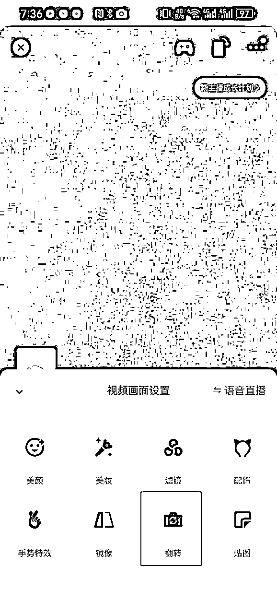

第八步：设置好后点击开启直播即可，等直播结束后记得生成回放。

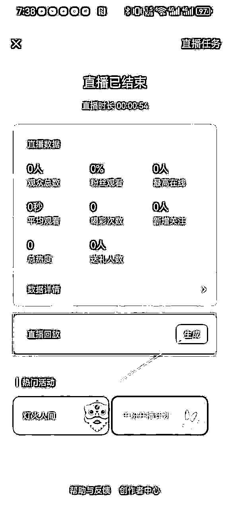

## 3.2 成功开启一场直播

再多的练习也抵不过一次真枪实战，当我们在自我练习时，已经可以流畅且富有情绪的完成一场直播的讲解话术后，就可以开始在抖音上开启直播起号了。

起号阶段不要挂车，先全程讲解专业知识点，播 3-5 场，第一场试 45 分钟以上，后续几场都需要在 1 小时以上，在这几场过程中边熟练内容，边起号。

起号成功的标准：连续 3 场有 3 个以上有效互动和有效转粉，停留高于 0.7 分钟。

### 3.2.1 开播流程和设置

首先我们来搭建一下直播场景，这里通过侧面拍摄，展示直播搭建的各个设备的摆放情况：

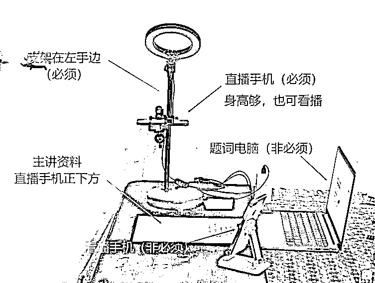

开启第一场直播比较简单，这里主要是通过展示开直播的具体步骤演示，如果已经在抖音开过直播的同学，这个部分可以不用看。

第一步：打开抖音 APP，点击下方的【+】号，再点击【开直播】，即可看到直播前准备界面

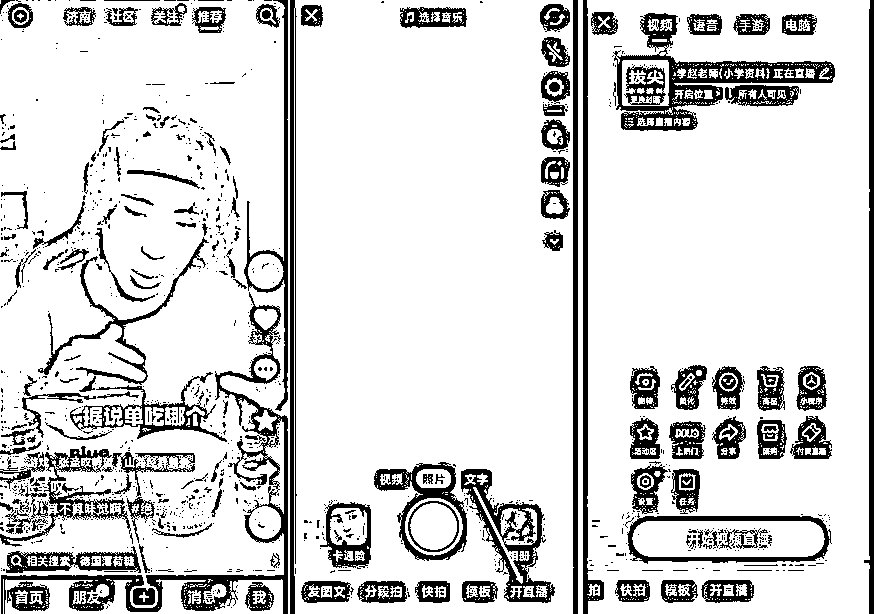

第二步：完善直播信息

需要填写的字段有：

1.

封面: 贴合直播内容/真人照片，有助于用户进入直播间 (正方形最佳)

标题: 反映直播内容，吸引用户观看 (10 字以内)

3.选择直播内容：搜索“综合教育”，并选中，有助于获得更多兴趣相投的观众

4.

直播间介绍：良好的直播间介绍能获得更多进入。

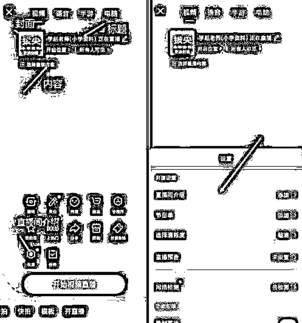

第三步：关闭所有美化效果，点击【开启视频直播】开播。

### 3.2.2 直播起号注意事项

尽量固定时间开播

2.

起号期间的直播不要换内容

3.

保持每场直播 1 小时以上

# 四、【项目实操 3/4】突破流量环节

💡

章节概要在第二章我们聊到了抖音直播流量的分发原理。但放到实际的项目中，我们该怎么突破流量池，让直播间的目标用户越来越多呢？

所以在这一章节你将看到从这几个维度来突破流量，包括：✅直播内容和状态

✅直播场次的数量

✅直播数据的运营提升，比如加团数据、互动数据等等

在这个环节，我们参考的目标是：流量达到的目标：互动转粉做到 1% 以上，停留 0.8 分钟

可带货的标准：场观连续两场 1500+流量是一切转化的前提，请一定要在每场直播后进行复盘，逐渐达到一个好的流量表现。

💡

本章航线图

完成本章节的学习和实操，即可完成航线图的 第三阶段：优化直播，突破直播流量（约 3 天）

1.

了解可带货标准和提高直播留人和互动的方法 （约 1 小时）

在直播话术中加入福袋、红包、加团、加粉的设计（约 2 小时）

通过在抖音持续直播突破流量（2-3 天）

记录直播数据，持续复盘优化直播（每天约 30 分钟）

那么现在，就请开始在直播中不断优化，并加入互动相关直播话术，拿到更多流量吧。

当我们达到起号成功的标准之后，就要进入下一个环节——突破流量环节了。有了足够多的精准流量，挂车后才会有源源不断地转化。

影响流量层级的因素有这几个：

直播内容和状态（影响停留时长）

场次数量

直播数据（如：加团、互动、停留）

注意：这个阶段也不建议挂车。因为流量不好的时候带货是对账号有影响的，平台容易给账号带上电商属性，有了电商属性，后续是很难突破流量池的。为了长远的利益，放弃暂时的少量转化机会是值得的。

在这个环节，我们参考的目标是：流量达到的目标：互动转粉做到 1% 以上，停留 0.8 分钟

可带货的标准：场观连续两场 1500+

## 4.1 直播内容和状态

教育直播的核心留人原理，是给用户提供有价值的内容，能够让用户想到自己的痛点，在直播间是能听到有用的内容。但很多直播过的小伙伴会发现，大部分进入直播间的人是悄无声息地进来又出去的。首先内容先解决两点：

① 不流畅 —— 讲的不顺畅、不熟练不流畅② 听不懂 —— 不好理解的内容不去讲，明确用户群体认知情况

解决基础的内容后，就需要根据每场的直播数据进行复盘。有互动的内容保留，没有互动的内容做优化。

内容的设计公式可以参考：痛点+干货+钩子；注意每一个阶段内容讲解完时，提前做好下一阶段的内容铺垫。

有痛点：能够描述出用户最想要解决的问题

有干货：真的能够解决大量用户问题的内容有钩子：直播间里的每一个板块的内容结束时，都为下一个部分的内容做铺垫

而且教育直播相对于其他直播，状态的影响会大一些。因为教育主播是作为一个老师，通过内容输出来做数据、做转化。所以直播状态对数据有比较大的影响。

在直播状态这方面没有特别多的技巧。保持好状态，提前 10 分钟熟悉脚本。务虚一点说就是：始终保持对教育的热爱和初心。

## 4.2 直播场次

直播突破风控后，想快速突破数据最简单最直接的方法 —— 增加场次。

在条件允许的情况下，可以从每天 1 场增加到每天 2-3 场。时间需要固定，每场尽量在 70 分钟左右。

其实突破流量就像是在爬山。

技巧能让你爬的更快更省力，但学技巧是要时间的，每个人领悟时间不同。那么能最快拉平的方式就是增加爬山时间。山就在那，俯下身向上爬，山不就我，我就山。

## 4.3 直播数据

账号的流量是由流量层级决定的。

流量层级突破是靠基础数据来突破。这个阶段就需要重点去关注加团、互动、停留等几项数据。

### 4.3.1 加团

在增长期的账号，抖音会推荐更多的流量进入，这个阶段因为数据较比还没办法开始带货，需要重点去做加团数据。可以通过三个方式来增加数据：

① 直播间发福袋；

② 发红包；

③ 福利资料，配合互动话术做直播间的互动数据；4.3.1.1 直播间发福袋拉互动

福袋是抖音官方提供的一个互动功能，可以降低用户互动的门槛，前期账号刚开播，没有基础种子用户时，主播可以利用在福袋里放上干货、资料等进行留人，提高大家互动。

一场直播可以发三次福袋，规定评论一句话参与福袋，拉互动。参与抢福袋的用户必须先参与互动才可领取，福袋一般在刚开场、开场 20 分钟、开场 40 分钟穿插发放。

福袋的设置步骤如下：

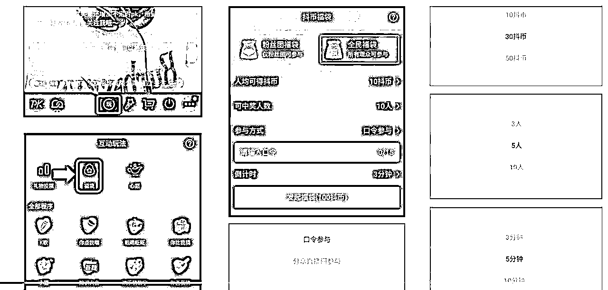

一般来说，对于知识型直播间来说，福袋里一般放的有 3 种：

1.

痛点问题解决方案

2.

让用户觉得很有价值的资料

3.提供服务型

痛点问题解决方案

不提供大而全的解决方案，只解决某一个痛点问题的方案

如英语满分作文：通用的作文框架以及常用词让用户觉得很有价值的资料

操作步骤型：如何掌握语文阅读大题的技巧

数量取胜型：英语考点的 108 问

与众不同型：其他直播间送模拟题，我们送母题提供服务型

1 对 1 进行一次问题解答，一定要限时

在设置福袋的具体玩法时，根据不同目的，设置不同的领取方式，常见的有 2 种方法：1）利用福袋好评提升信任度

2）福利资料抽取幸运用户赠送

第一种，利用福袋好评提升信任度

具体设置如下：选择全民福袋

中奖人数 10 抖币数量 10 抖币

倒计时：10 分钟

参与方式：口令参与：某某老师干货满满/讲得很好/学会了每 10 分钟发一次，每个账号一天可以发 10 次

通过这种方式，可以带动直播间整体氛围，让新进入的用户对主播的信任度天生增强。

第二种，福利资料抽取幸运用户赠送

福利资料免费领取，提升直播间的新用户停留时长。

赠送福利资料时，一定不是让用户自己去领，而是通过福袋/截屏送的方式，让用户参与，提升互动率，营造稀缺性。

具体设置如下：

普通价值的资料选择全民福袋，高价值的资料选择粉丝团福袋

中奖人数 3 抖币数量 10 抖币

倒计时：10 分钟参与方式：口令参与：福袋有 xxx（切记，不能说福袋送 xxx，否则会违规）

截屏抽：

要求：点了关注，并且是粉丝团成员主播念到名字的，私信，下播后回复赠送资料。

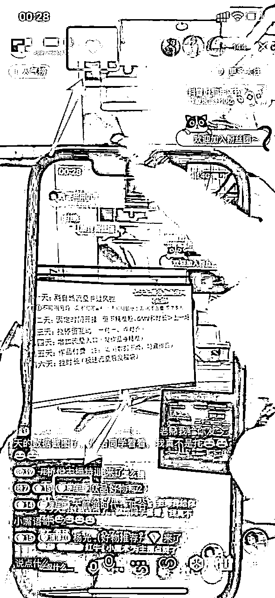

#### 4.3.1.2 红包拉灯牌

红包一般是为了拉灯牌发的，红包一般是助理号以礼物的形式发出的，通常一个红包 20 个抖币，可以 15 个人抢到。

一场可以发 4-5 个 5 分钟倒计时的 20 抖币红包，整场随机穿插发即可。主播口播配合“左上角给大家发了个红包，祝所有孩子金榜题名，大家都去沾沾福气，抢到红包的家长给老师卡个粉丝灯牌进粉丝群领取全套直播课件。”

具体的发红包教程可以直接去抖音搜索：

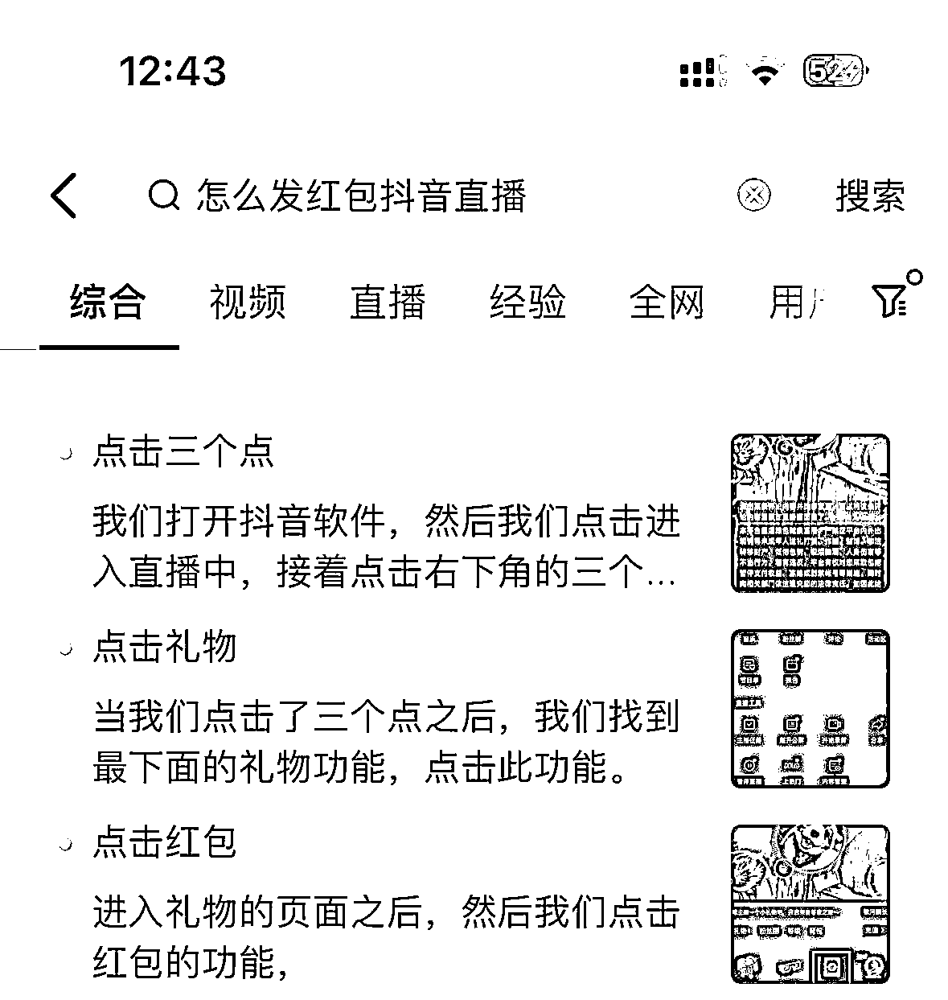

#### 4.2.1.3 加团送福利资料

第一步，描述资料的价值：能解决什么问题，有多珍贵，有多少人想要，平时什么条件才能有第二步，说明如何才能获得这份资料，一般有以下几种类型：

点赞满多少

评论区打某某字样福袋抽取

截屏抽取等第三步，前期直播间人数较少时，可以直接点名完成动作的用户名字，并且告诉他已经获得，通过这种方式给到第一个用户奖励，从而带动其他人进行互动。

以下是直播间加团话术参考：

所有在认真听各位家长，没有抖币是吧？没有抖币我给你发，等我你们这么多家长支持我，给我送礼物，我还一些给你们，我发 200 个。好吧，听我说。所有在认真听课家长，没有的家长左上角去领，有了的咱就不领了好不好？给没有的一点机会。左上角点黄星，点了黄星之后会出现一个加入粉丝团，加入粉丝团抖币你自己留着加团找到 43 抖音粉丝群。

下播一分钟之内发全套的电子版资料，那么如果确认自己有没有进，如何进行确认？

就是你左上角这里有个红色的福袋，咱们这个福袋能够点的开在这个位置，能点的开的就说明已经进了，你就回头来继续听课。

好，回头来继续听课。下播会发电子版全套资料。

#### 4.2.1.4 强转粉设计

新增粉丝的数据也会影响我们的流量情况，且用户成为粉丝后，将会收到直播提醒。

这个转粉的环节不宜太多，建议在一场直播里安排两次。

话术举例：还没有给老师点关注的左上角的关注点一点，所有点了关注的家长都可以申请进老师的专属资料发放群，下播之后老师会把讲课的全套课件发到群里。

### 4.3.2 互动

直播间的互动是非常重要的一个评判指标，互动越高新进入直播间的用户越容易被带进直播节奏，从而增加停留和互动，进一步帮助我们获得更高的场观流量，所以增强互动也是我们非常重要的一个步骤。

互动话术=诱饵+价值+互动内容+领头羊。

#### 4.3.2.1 诱饵-给用户带来的好处

对于知识付费直播间来讲，每一个用户来到抖音，都是来娱乐的，所以听知识内容本来就是一项反人性的操作，而我们还需要调动这些用户的积极性。

所以这时候，选取一个对普通用户来讲吸引力极强的诱饵，让用户愿意配合主播进行互动操作，就是我们想要拉起互动中最重要的一个部分。

千万不要在直播间为了做互动而互动，比如反复强调来给主播点个关注，来给主播亮个粉丝灯牌，你会发现，对于老粉丝还没有积累起来的新号来讲，几乎是没有作用的，所以这时候我们要选择一些行之有效的诱饵。

常见的诱饵有两种类型：

1.

实物诱饵：如赠送福利产品，配合上面我们讲的福利留人的方式来调动互动

2.

知识诱饵：想听某个知识点，或者有某个问题的用户，来给主播互动一下，我们给大家重点讲解某个部分。

长期效益：想每天来学习的，点个关注，每天开播会第一时间通知你

#### 4.3.2.2 规则-现场演示如何操作

直播间在听讲解的观众，往往有很大一部分是新人，所以我们想要点关注、加粉丝团、点赞等操作复杂度稍高的互动类型，一定要在直播间现场进行操作演示，让用户手把手地跟着我们进行操作。

最好准备另外一台手机，能在直播页面让用户看到操作过程。

#### 4.3.2.3 领头羊效应-找到第一个做互动的用户

直播间有一个明显的效应，叫做领头羊效应，当直播间没有出现第一个互动的人时，这时想要带动互动，是一件非常难的事，而出现了第一个人，主播及时对这个人进行奖励后，直播间的其他人会更愿意模仿，从而提升直播间的互动率。

综上三个部分来结合使用，咱们教育直播的互动话术设计起来就比较简单了，能停在直播间听的用户一定是有明确的痛点。

这个话术设计就可以按照：痛点+解决问题（送资料）+拉互动（粉丝团+评论点名送）+讲资料+点名。

场景化讲解痛点，重点去塑造问题解决和不解决的差别。在流量不多，互动效果比较差的时候，可以直接点名互动，甚至一对一的解决问题来做诱饵。

# 五、【项目实操 4/4】转化带货环节

💡

章节概要当流量达到要求，我们的账号也达到带货要求后，即可开通带货权限，在直播中挂车做转化。

这一章节，将会和大家讲讲千粉以下如何挂小雪花，千粉以上如何挂小黄车的操作，以及怎么调整直播话术脚本，提高转化：

✅熟悉所带课程的信息✅学习提高转化的技巧：如何转场？如何塑造产品价值？如何逼单促单？

✅不同情况下如何挂车：小雪花和小黄车分别有什么限制，如何操作挂车？

具体每个细节怎么做，一起往下看。

💡本章航线图

完成本章节的学习和实操，即可完成航线图的 第四阶段：完成挂车操作，尝试进行直播转化（每天约 2 小时）

熟悉要带货的课程信息（约 1 小时）

2.根据课程信息在直播话术中加入转化话术（约 2 小时）

根据自己账号的情况选择挂车方法（约 1 小时）

开启直播，持续进行直播转化 （每天 1.5 小时）

记录直播数据，持续复盘优化直播（每天约 30 分钟）

那么现在，就请开始挂上商品，尝试进行转化，赚取第一笔佣金！

## 5.1 熟悉所带课程信息

熟悉课程才能更好的做转化。我们作为一个专业的升学规划老师的形象，了解家长和孩子的痛点，了解我们的产品能怎么解决这些痛点，才能更好的让直播间的用户信任我们并且下单。

一般我们需要了解至少以下几个课程信息：

1.课包所带图书信息（比如三本语数外各一本 / 或者语数外合并一本通）

图书附赠课程信息：包含哪些学科的课程，课程的上课方式是怎么样的，什么老师来教学，有其他什么配套服务等信息

3.

上课信息：比如课程的时间安排，每节课是讲什么主题，怎么上课等等信息 4.

书籍里面具体涉及的知识点，内容构成等。这块信息可以通过你拿到书籍样品来了解。比如高途的三本书需要先拍回样品，熟悉书的内容以及赠品内容。

## 5.2 提高转化的技巧

### 5.2.1 转场话术

转场话术相当于从知识到卖货的过渡，如我们原本在讲解选科，要想过渡到卖课，就必须要在合适的位置用合适的话术转场。

从前面知识讲解到开始带货，中间如何衔接的自然是会很大的影响用户留存的，因此认真设计一个转场话术，如何把用户的兴趣从干货知识引导到我们所带的课程上，至关重要。

举个案例来说明如何做，达到提高转化的目的：

如：选科不仅是要看各个组合的优劣势，还有结合咱家孩子的实际情况，打铁还需自身硬，成绩越好选择空间自然也才越大，所以说成绩一般的孩子咱们优先考虑的是给孩子去提分...

提炼出不同孩子家长的痛点，分别给到解决方案。如：语文不好，数学不好，英语不好，上课听明白了做题就是不会，孩子很努力成绩就是中等...来看一下 XXX 课程，会有 XX 服务帮助孩子解决卡点。

以此从选科过渡到提分，实现最终卖课的目的。

### 5.2.2 产品介绍：产品价值塑造的 3 大维度

#### 5.2.2.1 维度一：课程本身的价值

这部分重点讲解所带书籍本身包含的内容，包括师资力量、行业地位、课程解决的核心问题

师资力量：课程的老师本人具有哪些荣誉、经历

行业地位：课程所在机构在全行业的排名，以及代表性奖项课程问题：核心解决哪些问题，以及课程内包含的主要内容，在 3 个点之内讲解清楚

#### 5.2.2.2 维度二：课程后续服务的价值

对于课程来讲，后续服务的内容有时比课程本身的价值还要更高，后续服务一般有以下 4 类：

赠品：随书籍赠送相关的课程和额外资料

助教：后续一对一进行答疑解惑社群：行业交流群，日常进行信息交流

陪跑：专人指导，进行课程后续执行过程中的辅导 5.2.2.3 维度三：课程和其他人不同的价值

前面两个部分讲解结束后，可以重点强调一下，与其他同行课程相比与众不同的地方，可以从以下方面进行设计：如服务时限：很多课程讲完就结束，我们的课看一次就会生成回放，可以观看三年。

如课程质量：九节录播课，讲解的高中九科全科的重难点知识，孩子在课堂上有什么遗漏的点，可以让孩子看这个视频课查漏补缺，也可以用来假期预习和复习，同样三年的回放权限。

如课程讲解形式：数学怎么提分，英语怎么提分？语文怎么提分？物理怎么提分？化学怎么提分？生物怎么提分？每周五周六周天周一晚上 7:00，会直播讲解。

### 5.2.3 逼单促单的 5 个方法

直播间用户的平均停留时长在 1 分钟左右，所以提升成交还有一环必不可少的内容是逼单，让用户尽快决策下单，今天给大家介绍几种我们常用的方法。

#### 5.2.3.1 方法一：精准定位人群

划定人群，让直播间的用户被精准地安排在某个人群中，从而产生明确的行为感受：“对，我就是这样的人，这个适合我”

例如：让直播间观众对号入座

描述提分后的愿景：提分空间、提分前后的差距、公办本科和民办本科的差距等描述未来发展空间：热门专业、同一专业不同学校的差距等

应用实际案例增强说服力（往期学员、朋友、亲戚...）

#### 5.2.3.2 方法二：比较法展示优势

只描述自己的优势，难免产生王婆卖瓜的感觉，而通过和同行的对比，能够更快让用户发现我们的课程是最好的选择。

例如：抓住我们具有核心竞争力的点进行描述授课机构实力展示：所获荣誉、行业地位、师资力量等等

学习成效描述：讲解课程目录，阐述不同板块学员将会学习到什么内容，学成或通过考试后的利益点

教学方法及特点描述：有直播课程，有 1 对 1 指导，有答疑交流群等等...5.2.3.3 方法三：降低机会成本

让用户下单的犹豫点减少，提前准备用户可能担心的问题，可以给用户更强的下单指令。

例如：降低下单的心理负担

描述上课方式的简单和灵活：用什么方式上课，回看功能，有效期承诺..

描述价格的换算：19 块钱，买不了一碗拉面，买不了一顿早餐，但是可以给我家孩子买这三本书，哪怕一科让孩子学会两个大招，提高 10 分，怎么算都是划得来的。

学习节奏和学习方法建议：所有家长拍了之后周三到周五，会有老师叮叮您，教给大家怎么去听课，保持畅通就可以了。您用谋信主动添加一下老师，老师就会给你发听课方式了，用手机，平板，电脑看都行。

#### 5.2.3.4 方法四：稀缺性和紧迫感

所有的课程内容一定不能给用户的感觉是想什么时候买都可以，因为一旦失去了直播间强烈的下单氛围，离开这个环境后，用户很容易忘记这件事，所以一定要给到强烈的提示：现在买是最好的。

例如：营造稀缺+薅羊毛心态

限时限量的报名机会：设置下单倒计时，操作上下架商品营造稀缺感

限时赠送的赠品 or 服务：专属群、赠品课、实体礼品等限时的价格：过了时间后就没有这个价格了

#### 5.2.3.5 方法五：羊群效应

任何人多的环境里，一定存在羊群效应，当你发现身边的其他人都在做这个动作时，你也会更愿意做同样的事，所以在直播间成交阶段，一定要营造好用户纷纷下单的感受。

例如：利用好羊群效应积极引导弹幕评论：“报名成功的打 1，课程助理会私信联系你”，“买到的朋友们打买到了，联系客服领取限时奖品”

细致讲解后续的上课流程，让其他用户感知到有人买了

必要时可以设置水军，在公屏上刷屏显示：拍了，已拍，怎么听课，现在拍还有名额吗？等证明下单的弹幕内容

### 5.2.4 脚本参考

如果你看完以上内容，还是不清楚如何设计自己的转化话术，可以看看这份脚本话术，作为参考：19 元课带课话术

包括：转场过渡话术、挖掘用户痛点、课程介绍、上课方式、以及价格优惠等等内容参考。

## 5.3 挂车操作

通过挂小雪花或者小黄车，我们可以让用户在直播间下单，完成转化。用户下单后，我们需要拿到的信息有：姓名，电话，收件地址，拿到这些信息，算是有效客资，可以结算佣金。

如果用户在小黄车里购买，这些信息用户都会填写，而在小雪花购买，苹果手机下单的用户可能会不填地址，这个风险需要注意。

### 5.3.1 如何挂小雪花

这个挂车方式 0 粉也可以添加，如果想快速变现的话，可以使用这个方法，但需要注意风险。

挂小雪花的风险：小雪花是抖音上的第三方小程序，如果是苹果手机下单的用户，我们是有可能拿不到他的邮寄地址信息的，出现这种情况时，需要给用户打电话拿到相关信息，一定程度上可能影响后续转化。

另外，过早的挂车带货可能会影响后续流量增长速度，达成千粉的速度可能比不挂车时稍慢。

且需要注意：手机开播时，小雪花需在开播之前，进行配置，直播途中小雪花无法上架。

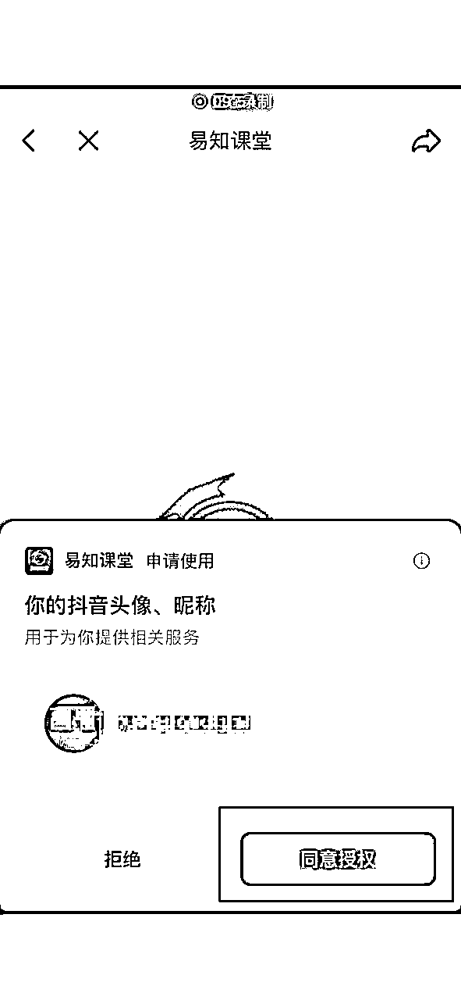

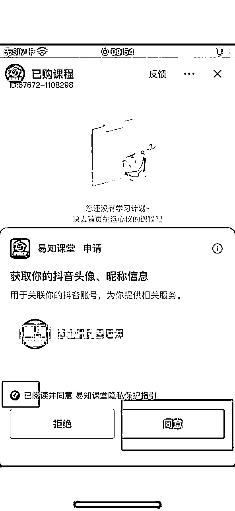

第 2 步：回到抖音主界面，找到【消息】-点击【服务通知】

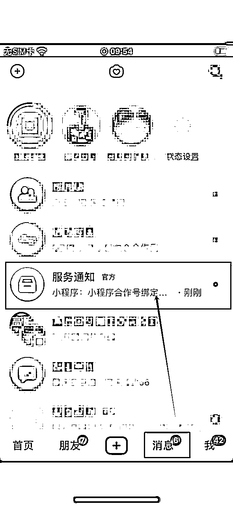

第 3 步：在服务通知里面找到【绑定申请】-点击【同意】

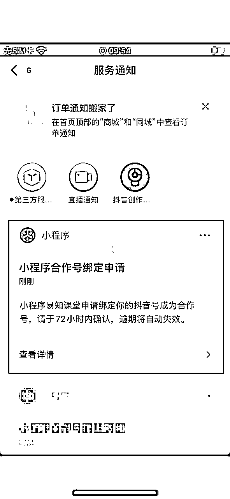

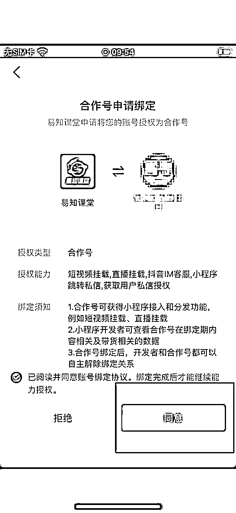

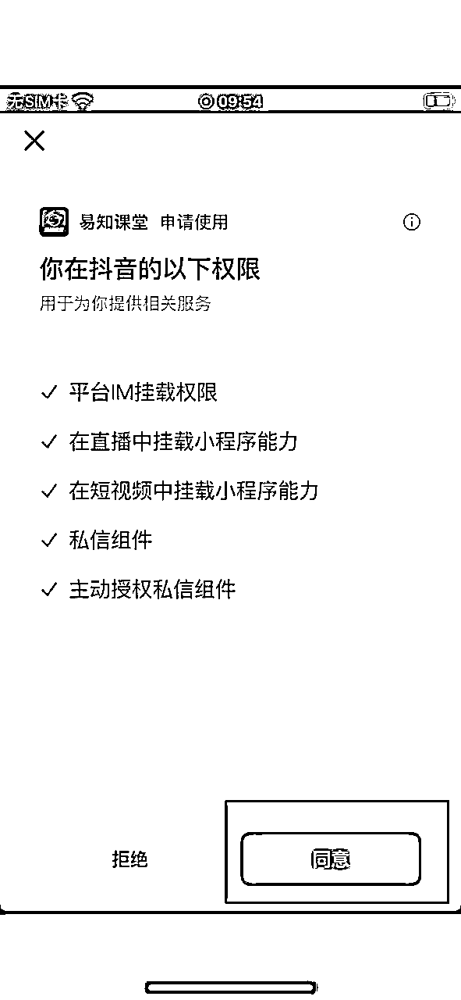

#### 5.3.1.2 阶段二：直播开播前挂载

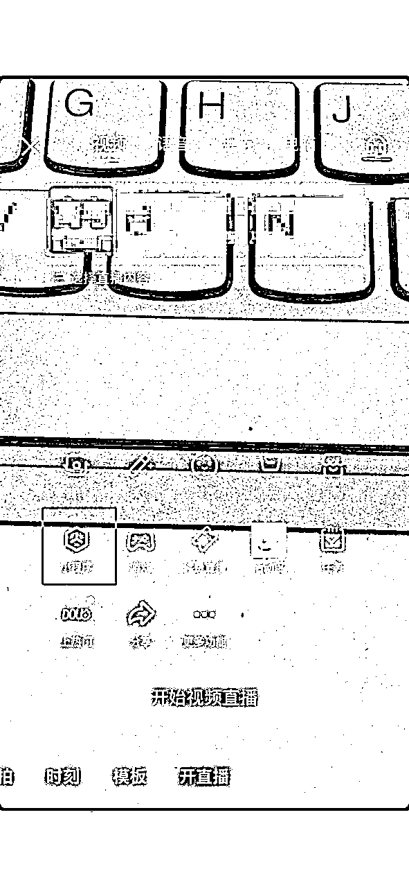

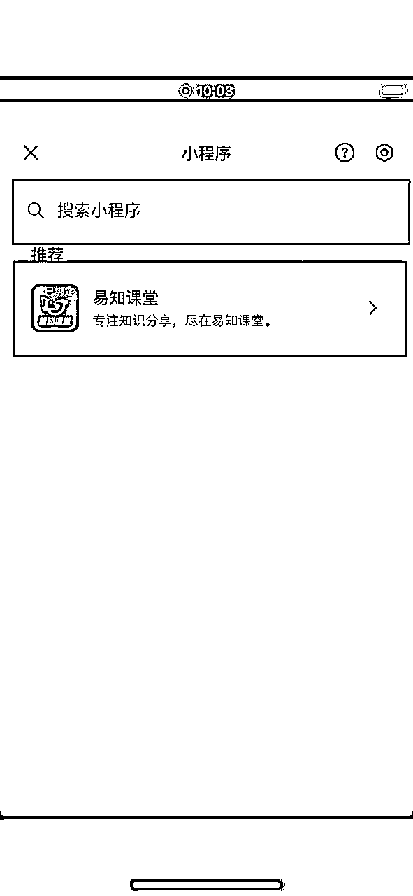

第 2 步：在小程序【个人中心】，点击【我的讲师】

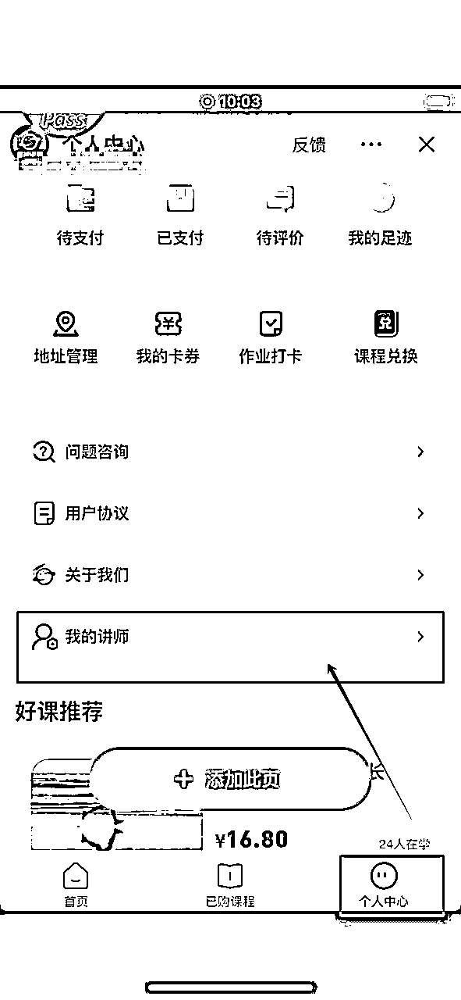

第 3 步：选择【分销课程】，点击下方【挂载课程】（G1、G2、G3 都需要分别挂载）

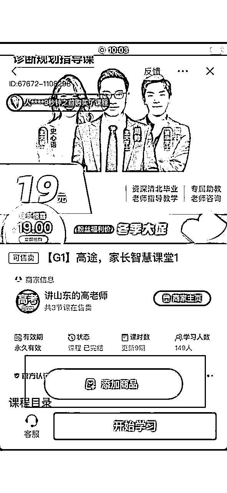

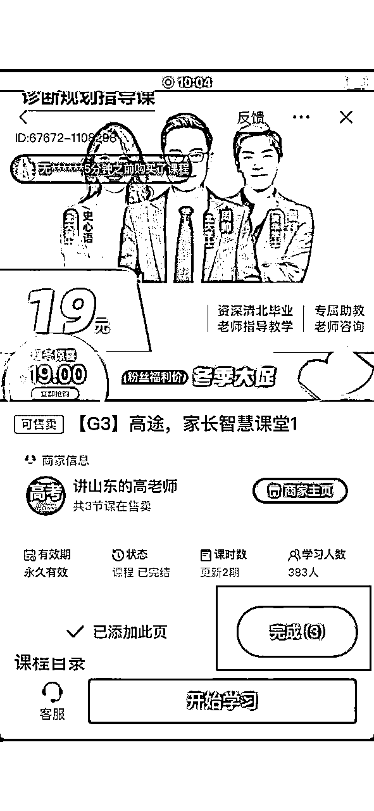

第 5 步：点击【去开播】-【继续开播】，即可完成，开播前挂载。

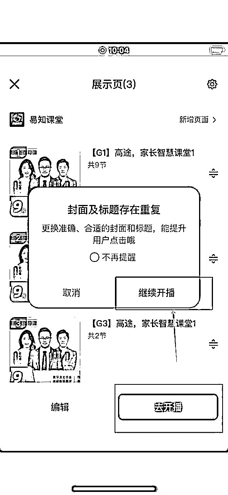

### 5.3.2 如何挂小黄车

挂小黄车是抖音的官方渠道，可以看到更多电商数据，所有下单用户的信息都可以抓取到。

但要挂小黄车有个硬性的要求：1000 粉才可以开通权限。

如果你还没达到千粉但希望尽快开始变现，可以参考上一节挂小雪花的方式来做转化，但要注意风险；如果不急于一时，可以先专注于涨粉突破流量池，到达千粉后再开通小黄车。

开通权限的操作流程：

打开抖音个人主页 --> 点击右上角三条杠 --> 点击抖音创作者中心 --> 全部 --> 电商带货 --> 成为带货达人 --> 带货条件申请 -->满足条件进行开通。

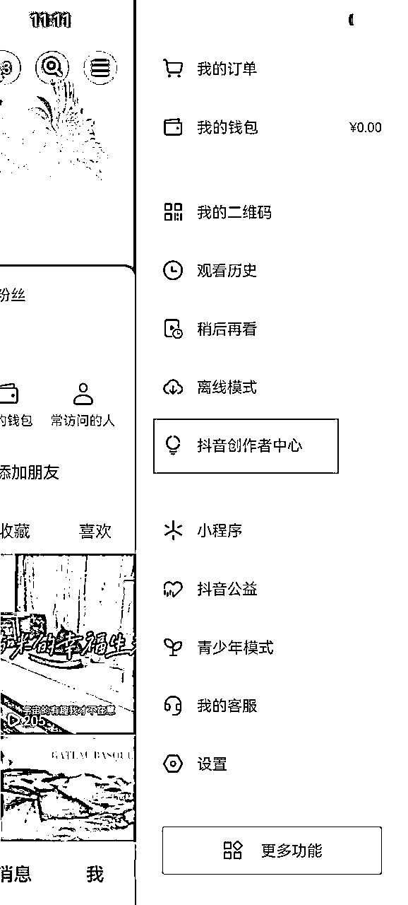

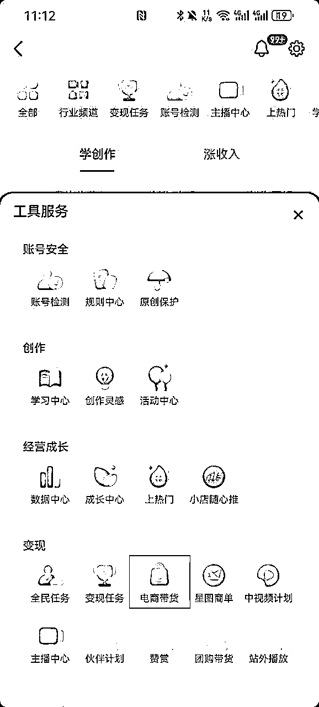

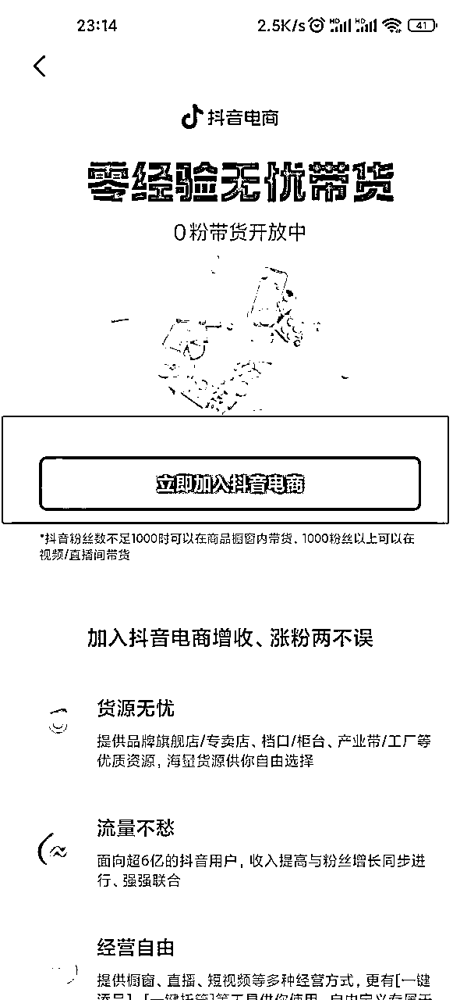

课程如何加入橱窗?

航海群内申请拿到课程定向链接 --> 进入商品橱窗 --> 点击选品广场 --> 点击右上角的链接图标 --> 粘贴对应的链接并添加 --> 在橱窗管理里就可看到已有的商品。

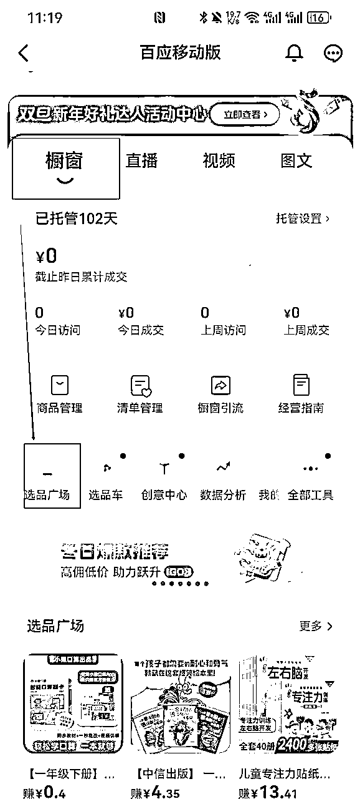

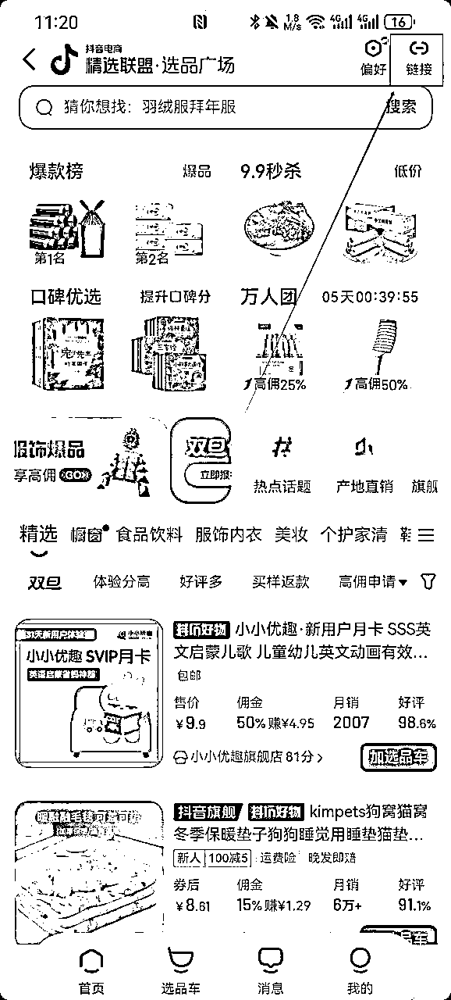

如何在直播中挂车？

手机端挂车操作：

打开抖音 APP 开直播，在直播前的准备界面有一个购物车的图标“商品”，点一下“商品”之后，能进入选品页面。这个页面可以选橱窗商品，选中要带的课程之后，确认添加就可以了。

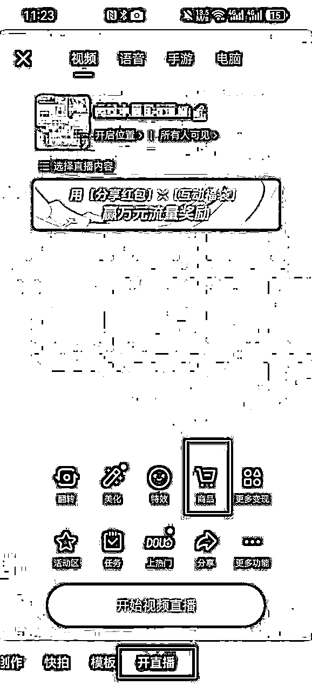

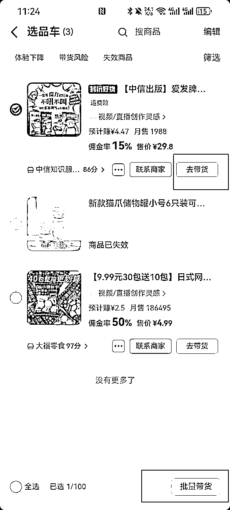

电脑端挂车操作：

打开巨量百应达人端页面 --> 点击“直播商品计划” --> 编辑商品名称和备注，并点击添加商品 --> 通过橱窗已有商品或者直接复制商品链接，添加到直播计划中，接下来即可开启直播，选择该计划并进行直播。

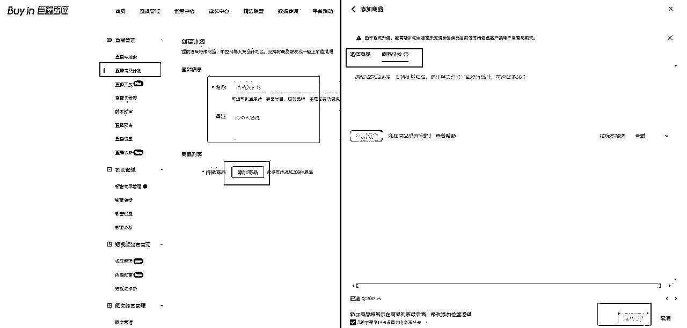

### 5.3.3 自己对接甲方时的注意事项

自己对接资源时，一定要注意甄别甲方和代理，并且谨慎对接，仔细了解信息。

怎么判断甲方和代理呢？有这三个点可以留意下：

可以直接问对方是机构还是代理机构合同主体都是甲方公司

一般甲方不会和个人签约

那么我们怎么规避在甲方和代理对接时遇到的问题？

一定要把所有承诺落实到合同里

我们一般会直接在甲方公司约对接的商务，了解清楚他的上下级情况，避免商务跑路没人对接。

# 六、【复盘和优化】持续提升直播质量

💡

章节概要不做直播复盘，这场直播等于白播。

抖音直播是一个效果立竿见影的事情，如果本场数据反馈不够好，一定是哪里出现了问题，及时修改优化，下一场就能看到效果。

而复盘方法也是有一套完整的操作逻辑的，下面我们从两个方面进行复盘方法的讲解。

✅ 直播数据复盘：场观人数、停留时长、互动率、40 秒以上有效看播人数、成交转化率

✅ 直播内容复盘：第一遍加速听，快速定位 3 个问题：讲完花了多久，不同内容的观众反应，高潮或是异常环节。

第二遍放慢听，重点听数据不错的部分，最好总结成逐字稿，下一场直播时保持住。

现在请带着自己的直播数据和内容，对他们进行一次复盘，看看自己还可以如何优化，把项目做的刚好~

## 6.1 直播数据复盘

很多人会陷入的误区是，这场直播下来，我感觉哪里哪里有问题，开个会，讨论一下就结束了。但事实上，人的感觉是很容易出数据复盘很简单，每场直播时，按照下面的表格，重点记录数据，每场进行对比，即可反映问题所在。

直播时间

场观人数

销售额人均看播时长

40 秒以上有效看播人数及比例

互动人数及比例

成交单量及转化率

uv 价值

复盘优化点

20:00~ 21:00

10000

15000

1 分 38 秒

4589/45.9%387/3.87%

50/0.5%

1.5 本场课程讲解次数少了一次，导致成交转化偏低，明天提升频率，多讲解一次。

本场观看人数

1 分钟以上合格

注：小店后台-电商罗盘-直播分析-直播详情-人群分析可看，非小店后台无法查看该数据 40%以上合格

3%以上合格

客单价越高，转化率越低，一般 100 元左右产品做到 1%合格

客单价越高，uv 价值越高，200 元以下产品，uv 做到 1 算合格

复盘模版

复盘的数据指标，能反映什么问题？

### 6.1.1 场观人数

场观人数：单小时的场观直接反映流量层级。

如如果其他数据没有异常，还有可能是以下原因导致：

突然换了开播时间段导致了流量下滑系统异常，如直播推荐流量为 0%，此时应立即下播，再重新开播

大盘流量变化，检查同行其他直播间是否同样下跌

### 6.1.2 停留时长

停留时长：反映本场直播内容对用户的吸引程度，非常影响下一场抖音的推流

如果本场停留还不错，但下一场流量降低了，那么需要重点查看平均在线人数，去除老粉丝停留，新粉停留对于流量推荐的影响更大。

在直播间人少的时候，尽量不要让太多自己人的账号大量进入直播间，并从头呆到尾，很容易影响直播间的真实停留数据。

如果停留大幅下跌，可能是以下问题：本场状态不对，开场大量流量进入的时候没有发挥好，需要回头听录屏找问题进行优化。

当前的讲解内容已经被观众听腻了，尤其是内容同质化严重的类目，应该立刻考虑用新的讲解形式去进行内容升级

### 6.1.3 40 秒以上有效看播人数

40 秒以上有效看播人数：这个数据只有小店后台可以查询，它的含义是，在本场直播中，个人看播超过 40 秒以上的用户有多少人。

这个人数反映的是本场真正被内容吸引的用户有多少人，这些人才是有可能成交的深度用户。

如果这个数据偏低：

需要考虑内容设计的完整性，是否一环扣一环能够持续吸引目标用户回看互动环节和福利赠送环节，是否时间太过拖沓，导致用户大量离开

### 6.1.4 互动率

互动率：反映主播内容对用户的吸引力，反映信任度是否建立起来。

如果这个数据偏低：

考虑直播内容是否太过生硬无趣，需要加入一些有意思的案例讲解，问答环节调动用户的兴趣，改善直播间的氛围考虑直播间的福利赠送，及转粉、粉丝团的话术环节是否设计完整，有没有真正吸引用户

### 6.1.5 成交转化率

成交转化率：反映直播间的成交能力如果数据偏低

主播从干货内容转到课程内容的部分是否生硬，调整课程植入的话术课程介绍过程中，是否抓住重点，时间有没有控制在 3 分钟之内，太长的课程介绍容易让用户失去耐心

逼单促单环节有没有做到位，评论区有没有用户反映不相信

## 6.2 直播内容复盘

直播内容的复盘能帮助我们的进步速度大大提升，一场有效的复盘，甚至可以减少一个月的无效努力。

直播内容的拆解可以按照以下步骤进行。

开播前

用注意：一定不能用正在直播的手机同时进行直播和录屏，否则无法录制到声音。

下播后

用可以倍速播放的软件打开录屏，按照以下三个方面进行拆解：

1.时间节点当下的人气分析

2.

不同环节的内容分析

3.

直播间弹幕分析

### 6.2.1 第一遍加速听

第一遍加速听，快速定位 3 个问题：讲完花了多久，不同内容的观众反应，高潮或是异常环节。

1.内容框架讲完花费的时间点：

如干货内容讲解多久，课程售卖的时间有多久，回答用户问题的时间有多久 2.不同内容讲解时的人气节点：

人气大幅度上涨的时间点，下跌明显的时间点，并记录这个时间段主要讲解的内容和人气数值

3.讲解过程中，某些环节用户弹幕反馈明显的部分：

如？”

综合内容、时间和弹幕和人气数值，判断这部分内容是否要进行时长、方向的变动。

如：课程讲解时间超过 5 分钟，人气下滑超过了 100 人，那么有可能是由于讲解时间过长让用户觉得营销感太重，那么下场直播这部分拆解的内容，可以按照以下我的复盘表格进行记录

本场直播：1.26 xx 账号 21:00～00:57 直播内容拆解，总场观 2 万人，销售额 2.1 万元。

时间节点

直播内容

在线人数变化备注

重点话术记录

21:00~ 21:43

0 粉丝账号如何起号

0～536 人这部分完全是干货内容讲解，开场 10 分钟左右用福袋送了一份话术资料

21:51~ 22:10 介绍线上 300 元直播课

21:51~ 21:53 484-43721:56~ 22:01 430-364

卖课过程中，人数下降比较快所有在我直播间的所有小伙伴们大家看一下，你们可以去看一下我的一号链接和我的二号链接，我的一二号链接对你们直播都是非常有用的，我的二号链接是干什么？刚才我讲的突破百人在线的方法，你们可以直接去拍，更详细的放在了二号链接，如何突破百人在线，直播带货一定最缺的是方法，如果你是老板，如果你是运营，如果你需要对自己做直播带货，这件事情赚钱这件事负责的，直接去拍我的二号链接，

我的二号链接，如果你需要对自个儿赚钱这个事情负责的，直接拍我二号链接，我的二号链接是一个运营方法课，它非常的落地，是我们自个儿直播间看一下，刚才给你们看的我们自个直播间第一天 33，第 2 天 380，第 3 天 4300，第 4 天 100 万这样的直播间 10 平方米两个人一个主播一个助播，我们如何做到突破百人在线，并且复制到多个直播间的方法，你说你干直播带货你就埋头苦干，你不如花 299 拍我二号链接，学习干直播带货应该怎么

干，你如何运营好一个账号，你怎么对标，你怎么样打标签，你怎么样把钱花在刀刃上，你怎么样用运营手段去掉大头娃娃，这些问题都是新人遇到最多的问题，随便一个小问题都能困扰你 10 天半个月，你不如直接拍我个二号链接，二号链接自个直接去拍，如何突破百人在线，刚才没有听到的，觉得没有听够的细节的东西的去拍我二号链接，二号链接里面有，你说你起号难道是不重要吗？

今天拍了我二号链接的，不仅学习突破百人在线，不仅学习如何快速让你直播间达标，不仅学习如何让你的账号干嘛可以运营起来，拍了二号链接我再给你们送这个东西，这东西是啥？是一个价值 999 的 30 分钟千川入门课，看一下他为什么只有 30 分钟却价值 999，因为我们打开了自个的后台，很详细的一步一步告诉你这怎么点，这怎么戳，来看一下对新手是非常友好的，千川付费怎么搞，我们打开后台一步步告诉你怎么样去拉计划，拍二号链接的送这个东西，然后拍我一号链接的是什么，有没有主播拍了怎么联系，拍了的点开这儿左下角去找客服

然后后期更新还不需要你花钱，并且拍了的兄弟去找我的，我的客服会给你们安排一个助教，做带货主播一号二号都要学，你看你的需求，如果你直播间已经突破百人在线了，不要拍二号好吧？

一二号都拍了，在学习马上开播了，来我说一下有没有一家二号都去拍的兄弟，我今天给你们多送个东西好不好？拍一号，教你如何构建话术，教你如何卖得出去货，教你逼单能力强，教你能够说好话，还送你 8 份话术做参考，2 号链接教你突破百人在线的方法，教你如何运营好一个账号，教你如何把钱花在刀刃上，还送你千川课

如果兄弟们你们一二号一二号都拍了的，我多送你们个 120 分钟的基础课，一二号都拍了的，今天算是什么重粉福利，我多送你 120 分钟基础课放在外面最起码又要再卖一个 299 的课，今天我直接送你个基础课，告诉你抖音变现的一些路径，希望你们学习下来可以提升认知，少走弯路好吧？

一二节课都是线上课，后期会陆续更新，比如说我们卖爆了或者有新话术了，或者是有新的更好的 逼单方法了，会给你进行一个更新，为期一年

22:10~ 22:44

直播间主播如何逼单，才能获得更高的成交

364~ 660

应该是投了付费，补充了一些流量进入直播间 22:44~ 23:05

介绍课程内容

22:53~ 23:12 523-400

卖课导致人数下降，以及直播间送话术，导致一部分老粉离开

23:05~ 23:56

直播间如何拉停留 23:33~ 23:43 515-485

活动留人部分讲解掉人比较严重，证明这部分用户不敢兴趣，应该少讲 23:56~ 00:05

介绍课程内容

23:56~ 23:59 485-427 介绍课程掉人

00:05~ 00:23

互动答疑

00:02~ 00:12 423-289

纯互动掉人严重，这部分大概率是因为主播说要下播了，也没有更多的内容介绍，所以很多用户觉得不是自己感兴趣的内容，所以离开比较多

00:23~ 00:42

卖课 00:42~ 00:50

互动答疑 00:50~ 00:57

卖课 6.2.2 第二遍放慢听

第二遍需要放慢听，重点听本场数据不错的部分，也就是高潮部分。最好总结成逐字稿，下一场直播时保持住。

如：用户提问：“老师，抖音直播带货太难了吧，我们小白怎么做？”，主播回答后，直播间弹幕反馈：“老师说的太好了”“听完立马有信心了”，类似这样的经典瞬间，一定要把本次回答的内容总结记录下来，下一场可以直接加入到主播本身讲解的知识内容中。

这样的经典内容，可以按照以下表格进行记录：

直播间讲解内容

对应话术个人能力证明

干货知识点

当前项目的发展前景

课程售卖话术所有在我直播间的所有小伙伴们大家看一下，你们可以去看一下我的一号链接和我的二号链接，我的一二号链接对你们直播都是非常有用的，我的二号链接是干什么？刚才我讲的突破百人在线的方法，你们可以直接去拍，更详细的放在了二号链接，如何突破百人在线，直播带货一定最缺的是方法，如果你是老板，如果你是运营，如果你需要对自己做直播带货，这件事情赚钱这件事负责的，直接去拍我的二号链接，我的二号链接，如果你需要对自个儿赚钱这个事情负责的，直接拍我二号链接，我的二号链接是一个运营方法课，它非常的落地，是我们自个儿直播间看一下，刚才给你们看的我们自个直播间第一天 33，第 2 天 380，第 3 天 4300，第 4 天 100 万这样的直播间 10 平方米两个人一个主播一个助播，我们如何做到突破百人在线，并且复制到多个直播间的方法，你说你干直播带货你就埋头苦干，你不如花 299 拍我二号链接，学习干直播带货应该怎么干，你如何运营好一个账号，你怎么对标，你怎么样打标签，你怎么样把钱花在刀刃上，你怎么样用运营手段去掉大头娃娃，这些问题都是新人遇到最多的问题，随便一个小问题都能困扰你 10 天半个月，你不如直接拍我个二号链接，二号链接自个直接去拍，如何突破百人在线，刚才没有听到的，觉得没有听够的细节的东西的去拍我二号链接，二号链接里面有，你说你起号难道是不重要吗？

今天拍了我二号链接的，不仅学习突破百人在线，不仅学习如何快速让你直播间达标，不仅学习如何让你的账号干嘛可以运营起来，拍了二号链接我再给你们送这个东西，这东西是啥？是一个价值 999 的 30 分钟千川入门课，看一下他为什么只有 30 分钟却价值 999，因为我们打开了自个的后台，很详细的一步一步告诉你这怎么点，这怎么戳，来看一下对新手是非常友好的，千川付费怎么搞，我们打开后台一步步告诉你怎么样去拉计划，拍二号链接的送这个东西，然后拍我一号链接的是什么，有没有主播拍了怎么联系，拍了的点开这儿左下角去找客服

用户常见问题的回答客户问为什么你的口碑分这么低？

如果觉得我评分低而不去拍我课程的没有关系，你直接不要拍就好。

好。在我直播间我直接说一下，你们做生意的有没有自个干直播带货的有没有？第一口碑分到，我就问你你能做到你们家产品很好的情况下，100 买了 100 个人满意吗？我想说做不到好吧，最起码我做不到 100 个人我，只能做到 98 个人满意，那么剩下的两个人不满意，现在都把平台的口碑分的标准它就是这样，差评问题好吧？第一个。

第二个我就问你，你做生意的人干过电商的，我就问你们一句话，你没有被同行搞过吗？你应该知道这个问题的。

第三个问题是什么？因为我每天我都是晚上直播，白天太忙了，白天我管直播间还有培训主播，晚上直播了之后我整个团队都是排着王大爷不及时，整个上午时间段都没有人回复，所有干直播带货都知道，我说的这三个问题就是影响口碑分到，如果你觉得说你在我的直播间好吧，里面不能选择到干货，你就不要拍我的课，如果你听下来觉得创业的逻辑思维，你觉得 ok 听半小时你觉得好你直接去拍我的课，口碑分这么低，我也在想办法在慢慢拉着了，这不是问题，如果介意的就不要拍好吧？

每场直播结束后，如果能踏踏实实地把直播数据和内容按照以上方法进行详细复盘，并总结下一场的优化点，我相信 99% 的直播人都能在最短时间内看到非常明显的提升。

机会，永远都是留给有准备的人。

选修篇

💡

章节概要

当我们完成项目最小 MVP，基本掌握项目的操作流程后，可以尝试看看选修篇的内容，无论是想要挖掘更多玩法，或者关注更多细节，都可以重点阅读本章节：

✅ 抖音短视频图文制作

✅ 直播间敏感词汇总抖音短视频图文制作虽然不是必备的，但是可以提高抖音账号的健康程度，也可以通过短视频方式来获取一定的流量。如果你在直播之外有余力，可以通过本章节来看看如何做一个简单的图文短视频，增加内容丰富度。

现在，快来发掘项目的更多可能性～

# 七、抖音短视频图文制作

## 7.1 做图工具

作图工具主要有以下九种方式，美图秀秀、黄油相机、创可贴都有简单实例操作步骤，可展开 ，批量化的话建议 WPS，操作简单 ，也是不错的方式。

### 7.1.1 美图秀秀（电脑/手机）做图

下面说一下美图秀秀如何制作图文笔记，下面方法仅供参考，给大家简单操作一下。也可看同行账号看他们的封面，按照自己的想法来设计封面。

首先，会给大家纯色背景模板，手机打开美图秀秀软件---选择图片美化，选择刚刚保存好的纯色背景图片。

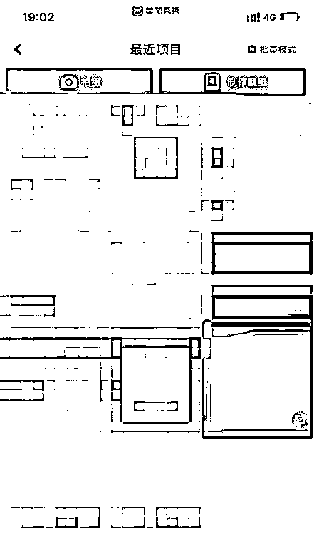

选择“编辑”---选择“裁剪”下的 3：4 比例---点击右上角“√”，然后选择文字

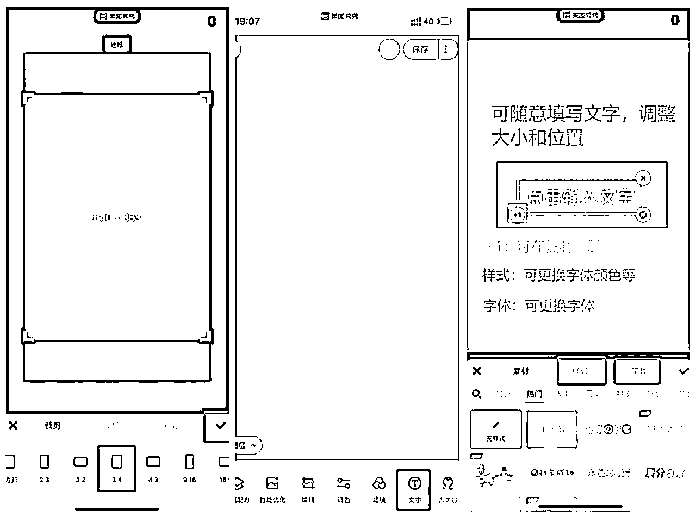

添加“贴纸”，增加封面视觉效果（注意：贴纸按照自己的喜欢搭配就可以）

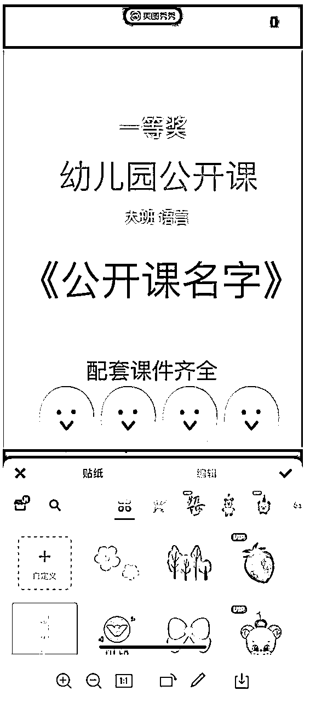

最后存为模板，方便下次使用，存为模板后，下次可直接改名字就可以，点截图内我框选出来的图标可存为模板。

一定要存为模板！！！一定要存为模板！！！一定要存为模板！！！

另外记得做好的封面记得点“保存”。

此外小红书封面美图秀秀也有模板，可以参考

进入美图秀秀，点击海报模板，下滑选择小红书封面，很多小红书封面可以参考

### 7.1.2 黄油相机 APP

黄油相机使用方法和美图秀秀差不多，这里简说。

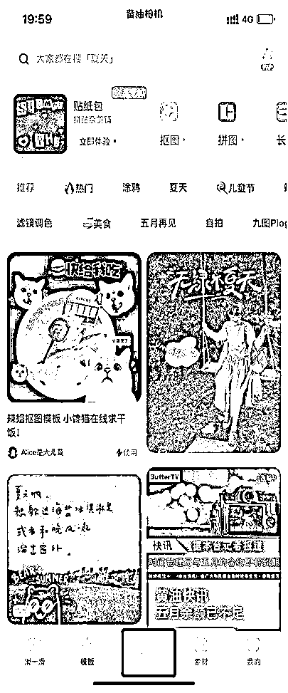

2.选择”布局“---”画布比“---”3：4“---”√“

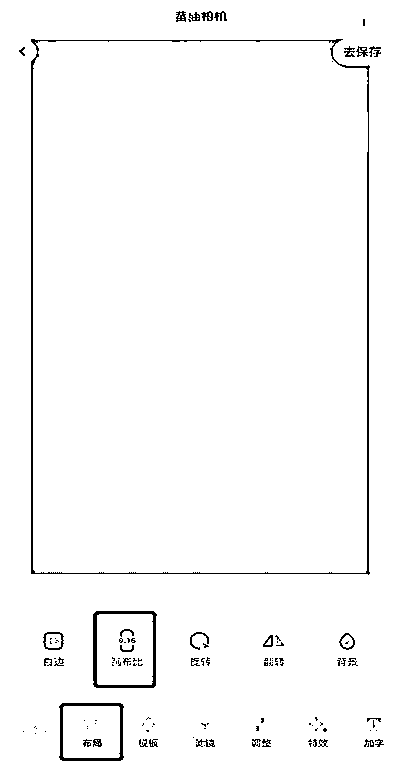

3.点击”文字“---”输入文字“

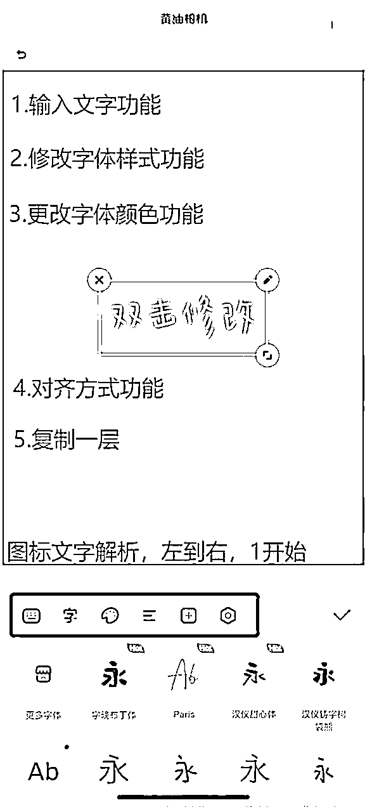

4.添加”贴纸“

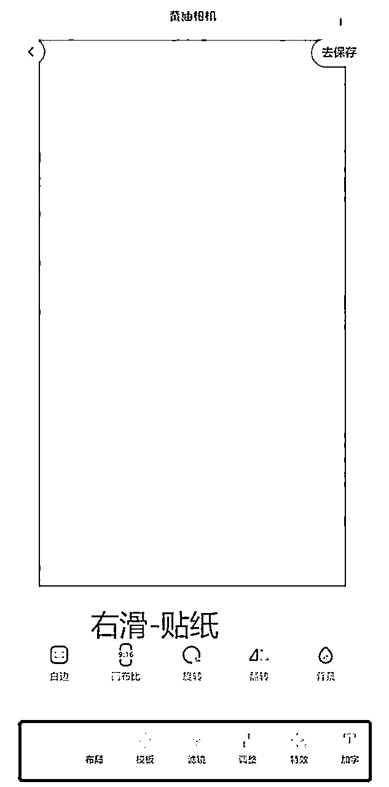

5.制作好的封面怎样保存？怎样存为模板？

（1）点击”去保存“

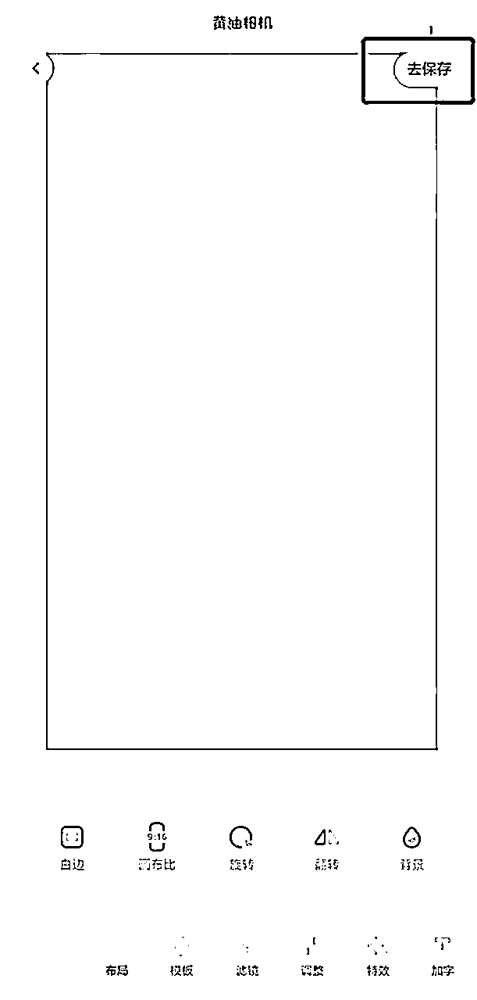

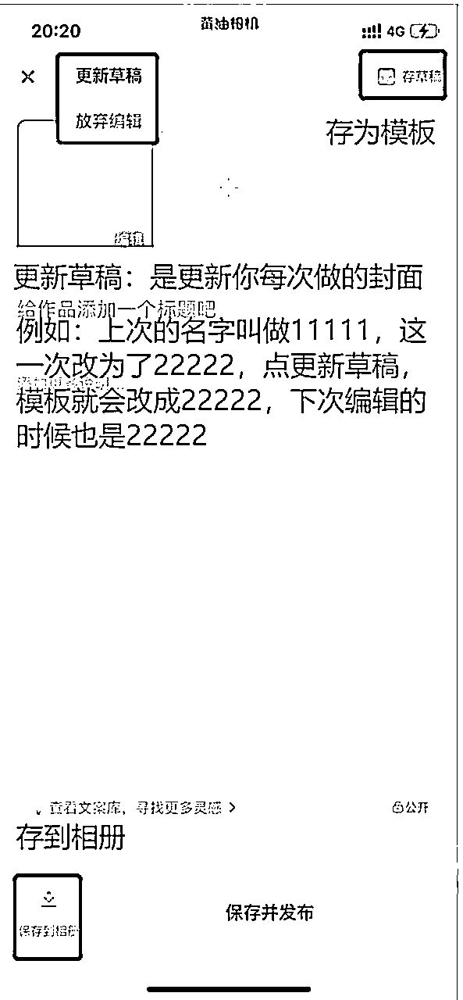

（3）右下角“我的”---“草稿箱”---"选择上次存为的模板"---选择“编辑”即可使用上次存为的模板

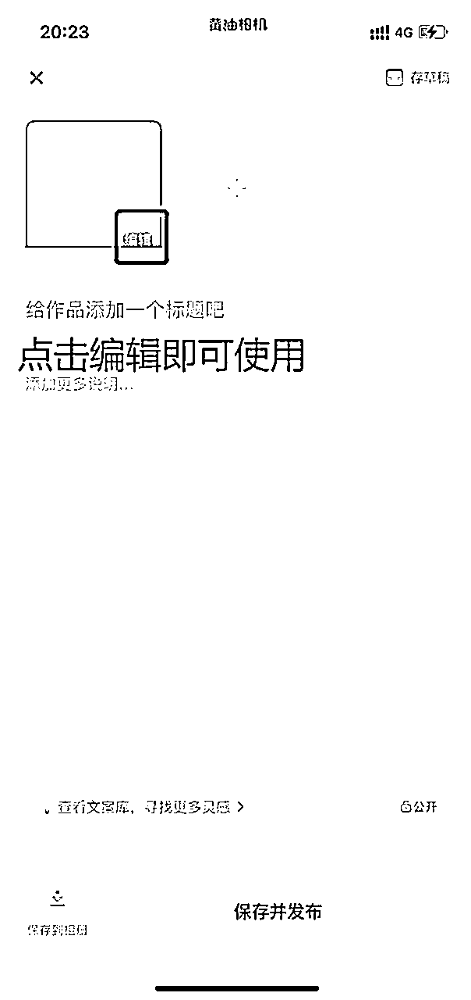

### 7.1.3 创客贴

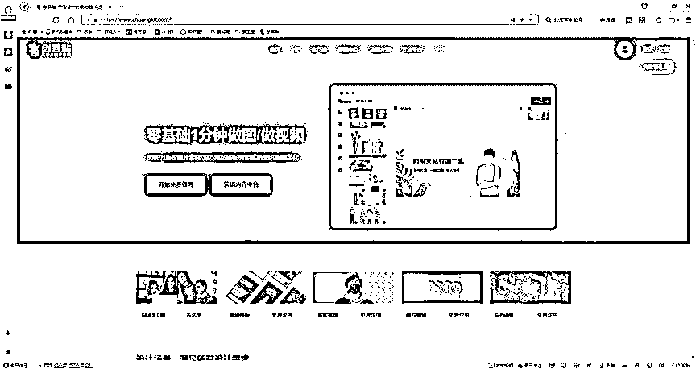

选择“新媒体”---选择“小红书封面配图”---选择“免费”

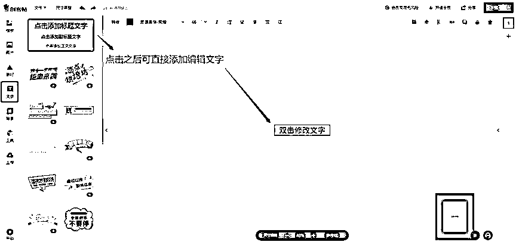

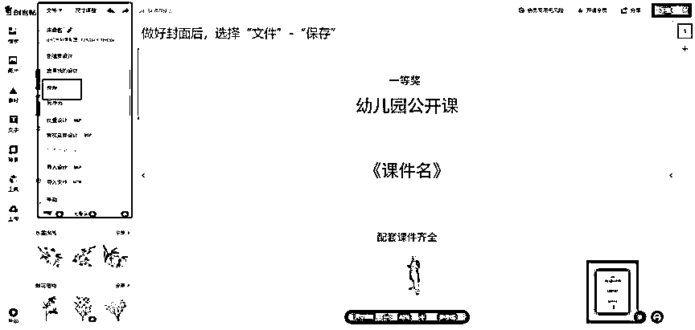

存为的模板哪里可以找到？怎样再次编辑使用？

选择“我的设计”---选择保存好的封面

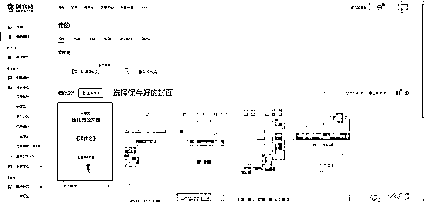

除了以上的三种工具，我们还可以用：醒图 APP、Canva 可画 APP、Picsart APP、稿定设计、图司机、WPS 等来做图，你可以尝试找到自己用的最顺手的工具。

## 7.2 制作流程（推荐比例 4:3）

注：不建议原创 7.2.1 找对标作品

内容来源：小红书、抖音、视频号、快手上，搜索升学规划、高考报考等相关内容

标准：百赞以上即可。

### 7.2.2 无水印下载对标内容

工具：微信小程序：去印（注 1。建议电脑使用，可免广告。注 2：如程序不能使用，搜索其他微信小程序即可，搜索关键词：去印）

优势：

### 7.2.3 内容提取

内容提取方式：电脑截图提取内容

### 7.2.4 违禁查询

违禁词查询网址：http://www.ju1.cn/

注：理论上别人已经跑起来的内容，违规的几率是很小的，但是考虑到不同平台规则的不同，新账号内容发布初期权重比较低，建议查询是否有违禁词。

### 7.2.5 改样式（去重）

### 7.2.6 选配乐（图文发布流程）

注：图文制作完成之后，即可上传抖音，在上传过程中一定要选上配乐

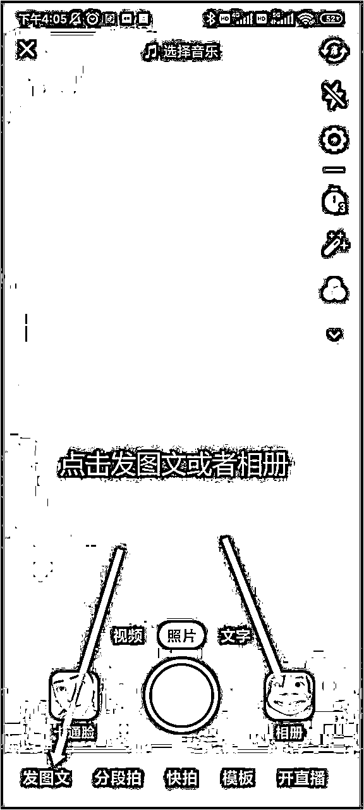

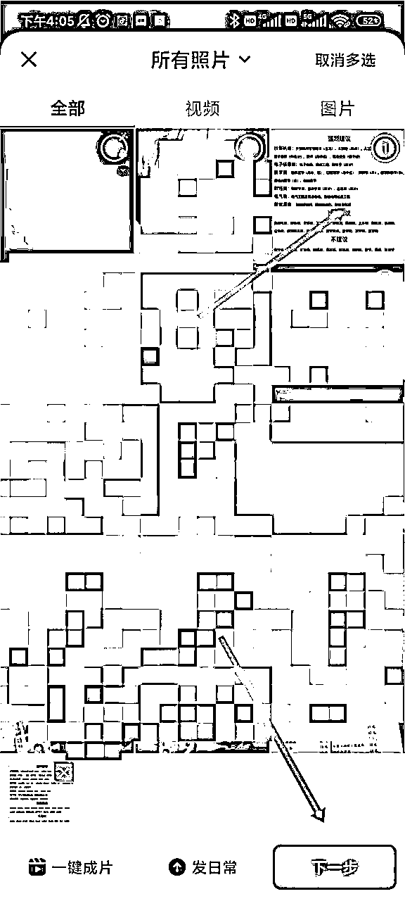

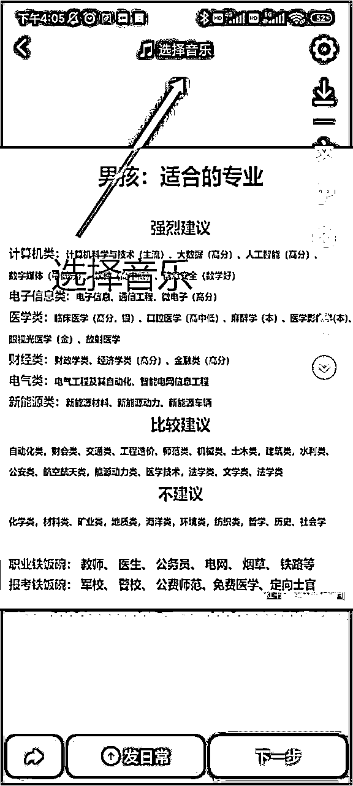

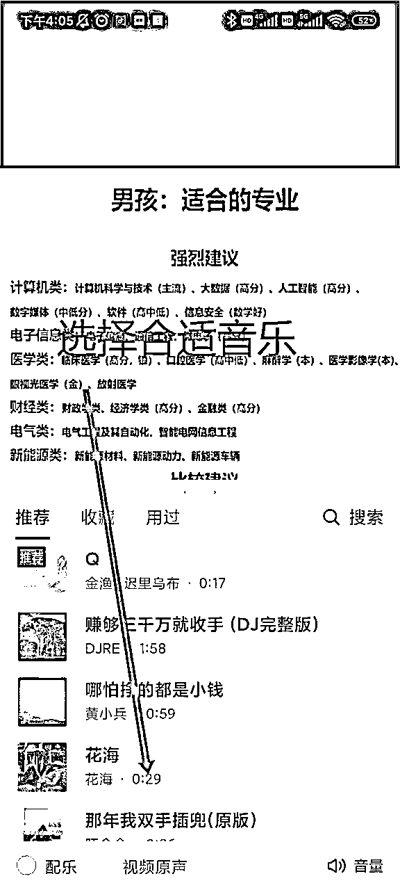

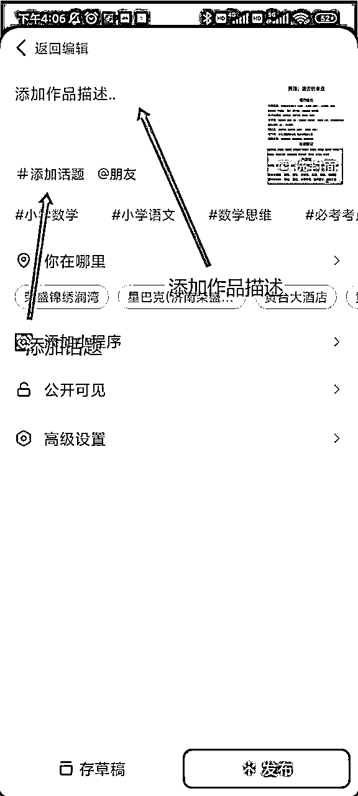

注：平时在刷对标的时候，可以收藏对标作品使用的音乐。

### 7.2.7 作品描述及添加话题

作品描述：根据作品组织即可

添加话题：大话题：#高考#升学#升学规划#升学#志愿填报。 小话题：根据内容选择

## 7.3 抖音图文违规自检

找到刚发布的作品，点击右下角“三个点”，点击上热门，如果开放了上热门功能，则说明作品过审，如果显示“当前内容不适合加热”则说明内容违规。

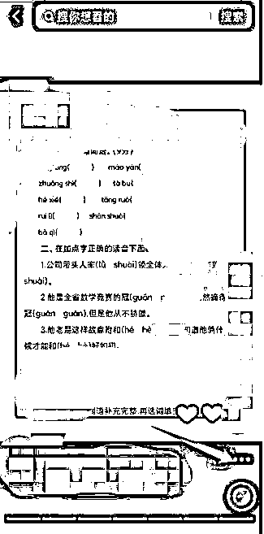

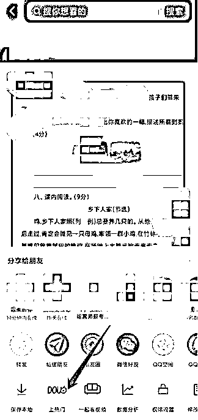

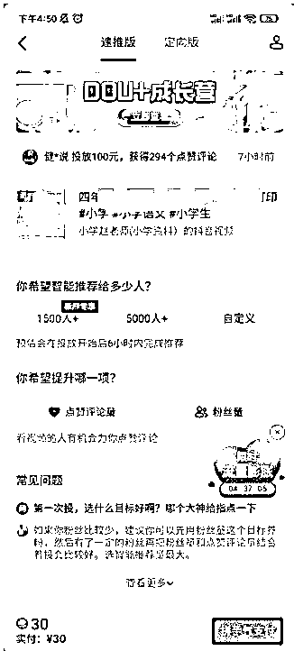

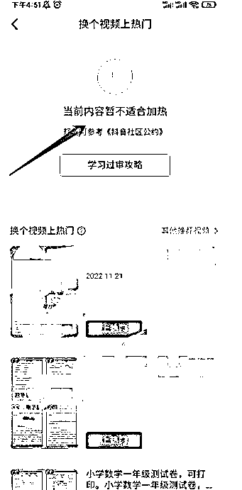

## 7.4 违规处理方法

违规主要是因为图文中有违禁词，把违禁词去掉即可。

1.

违禁词查询网站：句易网 http://m.ju1.cn/

2.

去掉违禁词，重新制作新内容。

# 八、直播间敏感词汇总

直播间敏感词，我们得到的反馈是：一直都是众说纷纭，没有比较明确的说，但一旦踩到坑，就会明显的流量下滑。

参考往期大航海的一些资料，你可以根据自己的实际情况，进行调整。

官方《电商创作者管理总则》https://school.jinritemai.com/doudian/web/article/102117?from=href

官方《抖音电商高频违规避坑指南》

https://school.jinritemai.com/doudian/web/article/109560?from=href《抖音直播违规行为大全及违禁词（全行业）》

https://xtx0o8yn7x.feishu.cn/docs/doccnxxVLaCSgnYYYIpJFlLeS9e《抖音直播高频违规场景和对应规则》

https://bytedance.feishu.cn/docs/doccngEDA56qf4RnbouyajlUgqd

