# 短剧 CPS 202308

> 来源：[`remhu1p2pr.feishu.cn/docx/KAn0dbY1AoBy0NxZj9OcNe8nndh`](https://remhu1p2pr.feishu.cn/docx/KAn0dbY1AoBy0NxZj9OcNe8nndh)

出品时间：2023 年 8 月 11 日

手册使用说明：本文旨在向你展示一个项目的更多可能性，帮助你更好地理解和实操。

建议：如果需要快速定位到精确内容，可以使用快捷键 Ctrl + F/command + F 的形式，搜索「关键字/词」，查找你想要的内容。

写在前面

💡

Hi,

欢迎大家来到 8 月航海｜短剧分销 CPS | 实战手册，相信在接下来的日子里，我们将在这里见面很多次。

短剧是从 2022 年底开始在短视频平台爆火的一种新的剧集模式剧情跌宕起伏，非常抓人眼球。

和小说推文类似，短剧 CPS 项目也是通过展示部分精彩剧情，再引导用户前往版权方付费观看完整内容，从而赚取观众充值金额的佣金，佣金一般为 50%-60%。

但与小说推文不同的是，短剧的视频节奏比文字要快，短视频的爆发力更猛，变现效率会更高。目前，短剧市场目前正呈现爆发式增长，相对比较适合新手下场入局。

那么「短剧 CPS」项目更适合谁呢？

✅ 对短视频有一定了解，且熟悉网络用语的人

✅每天能拿出 2 个小时，来发展副业的人

✅执行力强，可长期持续输出作品的人

如果你还想在各大短视频平台分一杯羹，「短剧 CPS」项目无疑是值得一试的。

「短剧 CPS」的项目步骤非常直接，找到合作的素材渠道后，你就可以获得对应短剧的素材，剪辑后直接发布即可。为了节约大家寻找素材渠道的时间，本期航海，我们为大家提供两个渠道。

大家可以点击下方链接了解对应渠道的注册方式与功能：平台一：麻雀 Matrix

平台二：创作猫当然，「短剧 CPS」项目也有它的核心执行步骤。

如果你想提高出单的概率，就要在选剧目、选剧情，以及剪辑上多下功夫。以下三个章节就是你需要在本次航海中，重点关注的内容：

✅四、选择短剧并获取素材✅五、重组素材剧情，提升爆款概率

✅六、剪辑视频

如果你已经跑通了项目基础闭环，那么在本次航海中需要做的就是提效+搭建矩阵。如果发一条视频，能爆的概率是 1%，那发 10 条，或者有 10 个账号呢？

为此，我们在手册中新增了两块核心内容：

✅进阶剪辑法：快速混剪+CRV

✅第九步：矩阵思维，放大项目结果根据高手分享和平台新政策，我们还在手册中新增+更新了许多内容，希望能帮助大家更好开展项目。

如果你还没有迈出第一步，却被脑海中的想象吓住，希望这篇手册能解决你的拦路虎，助你顺利起航。

除了上述内容外，还有个核心就是多提问，多交流，在这里没办法满足你的地方，多问问，我们会一起找到关于难题更多的解法。

希望大家可以在这次航行里收获成果外，结识一群战友。

以下内容由生财有术联合圈友制作而成，仅供航海船员以及生财有术星球圈友学习使用。

同时也欢迎圈友们在实践过程中持续反馈，和我们共同完善，可以联系鱼丸（yuwan387）提供修改建议～

# 第一步：项目介绍

## 1.1 了解短剧 @老严干货 CPS @精准侠 @思蒙

### 1.1.1 短剧是什么？

不知道大家平时刷短视频的时候有没有刷过那种几分钟一集连载的视频，剧情有点像小说，又有点像影视剧的感觉，这就是短剧。

短剧是从去年年底开始在短视频平台爆火兴起的一种新的剧集模式，主要是赘婿，神医，战神，总裁，言情等题材，剧情紧凑，时长精简，没有拖泥带水，精准的抓住了短视频平台下沉市场用户的兴趣点。短剧一般单集时长 1-5 分钟，剧情连续，单部作品有 100 集左右，展现形式主要为竖屏视频。

短剧有非常多的剧场，如九天剧场、阳光剧场、微剧吧等等。这些剧场可以理解为我们平时看的腾讯视频、爱奇艺、优酷等平台，不同剧场的短剧片单也不尽相同。不同于影视 APP 的是，这些剧场通常为短视频平台内部的小程序，用户通过短视频平台进行观看。

目前，短剧市场正在呈现爆发式的增长。仅去年上半年，进行规划备案的短剧就达到了 2859 部，单月内备案的微短剧数量均超过 400 部。

作为优秀的“下饭神器”，短剧的短平快节奏符合现代人的观看习惯；短剧自带的神转折、密集爆发的剧情爽点都正戳中年轻人的“心巴”，简直就是我们最好的“互联网嘴替”。

短剧的受众群体短剧的受众群体，大部分是三四线城市或者乡镇的成年男性。还有少部分，比如最近大火的一部“顾少”短剧，吸引的观众多为 30-40 岁的女性，充值比例特别高，10 万播放可以做到 4000+的充值金额。

短剧中剧情紧凑，各种反转，视频中有意设置的各种精彩爆点，虚幻的 YY 情节，无疑都是吸引目标用户充值的利器。

短剧我们一般又分为免费短剧和付费短剧。

这种就是免费短剧，主演基本就是 IP 主本人，这种的变现方式主要是星图、接广告。

### 1.1.3 付费短剧

付费短剧的推广和小说推文类似，用户看剧看到高潮部分，我们就不给他看了，需要充值才能继续往下看。

付费短剧的变现方式主要是吸引用户充值付费，单集解锁或者充会员：

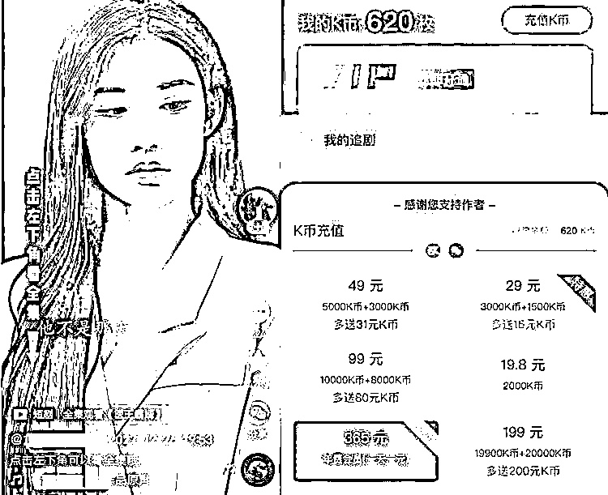

这些短剧主要都是由一些爽文小说改编拍摄而来，近年来很火的剧情通常是一些扮猪吃老虎、屌丝反转逆袭的 YY 爽剧，比如在抖音里被很多用户调侃的“歪嘴龙王”“歪嘴战神”那种赘婿系列，相信很多人可能也刷到过。

内容来源：《目前为止最详细的【短剧推广实操手册】，没有之一！》《短剧 cps 怎么赚大钱》《短剧分销 CPS 推广：红利期新项目科普+保姆级教程》

## 1.2 了解短剧 CPS @老严干货 CPS @精准侠 @思蒙

### 1.2.1 什么是短剧 CPS 项目

了解完短剧，我们就能更好理解什么是「短剧 CPS」项目。

「短剧 CPS」常见的玩法，是达人对素材进行二创后发布作品，挂上短剧小程序，用户点进去充值后达人就可以拿到分佣，非常丝滑。

一般来说，短剧前几集都是免费的剧情，当你看到精彩的剧情时，需要你付费才能解锁下一集，观看用户开通会员后，达人通常能获得 50%-60%左右的分佣（偶尔有 70%-80%分佣）。

短剧视频素材一般由官方（即你所绑定的推广平台）提供，达人们进行简单的二次剪辑后，上传抖音、快手平台，挂上版权方提供的小程序，然后引导观众点击小程序付费观看完整版，从而赚取观众充值金额的返佣即可。

做过小说推文的朋友都知道，这个模式和小说推文的模式很相似，但是视频的节奏比文字的节奏要快，短视频的爆发力更猛，变现效率会更高。

目前正常的转化率参考：100w 播放收益是在 3～4 千左右（供参考，以实际转化为准）。

当然这个是有浮动的，决定转化量和收益高低的关键因素就是选剧和剪辑手法。

短剧 CPS 的二创视频，目前主要有这两种形式：

混剪视频解说视频

混剪切片类视频需要做好去重，解说类视频则文案是关键。

但解说类视频目前并不是创作主流，主要原因有二：

1.解说类视频制作周期较长，需要你自己写文案，对综合能力要求较高，产出效率较低；

2.

有时你的文案写的很出彩，确实能带来很高的播放量，但转化很低，比如 10 来万播放，但收益是 0。

分析其中原因，可能是你解说以后，用户会按照你的思路来看剧，尤其爽剧被解说以后，观众可能会觉得你的解说更有意思，就不愿意去付费看了，还会等你继续给他解说，这样不仅不需要花钱，还不需要动脑。

综上，本次手册侧重讲「如何制作混剪类短剧视频」，不细聊解说类视频的做法，学有余力的朋友可以自己探索。

### 1.2.2 实操步骤概述

先来简单了解一下「短剧 CPS」的实操步骤，每个步骤我们都会在后文详细展开，这里先让大家有个心理预期。

其中，核心步骤第三步、第四步和第五步：第一步：准备短视频账号，即抖音账号、快手账号、视频号账号等；

第二步：选择短剧推广平台，本期航海，我们为大家提供两个渠道，麻雀 Matrix 和创作猫；⭐️第三步：选择短剧并下载视频素材，上述渠道会直接提供，大家在各平台主页一般就能看到，下载即可进行剪辑；

⭐️第四步：素材二次创作，将短剧素材重新组合剧情，遵循爆款视频的原则，能提高视频爆款概率；

⭐️第五步：视频剪辑，将下载好的视频素材导入剪辑软件，按照你的剧情进行重新剪辑，做去重与混剪等工作；第六步：视频发布，即发布到抖音、快手等短视频平台进行推广，发布时挂载看剧小程序就算成功。

内容来源：《目前为止最详细的【短剧推广实操手册】，没有之一！》《短剧 cps 怎么赚大钱》《短剧分销 CPS 推广：红利期新项目科普+保姆级教程》

### 1.2.3 注意事项

⚠️需要注意的是：

素材原片千万不可以直接发送，必须经过剪辑，剪辑方法我们将在「六、剪辑视频」细说。如果直接在各短视频平台上传原片，不但会被判为违规，甚至有封号危险，收益也会被短剧推广平台没收。

## 1.3 适合人群与项目门槛 @晓飞 @思蒙

就像去年的小说推广项目一样，短剧推广目前正在红利期，不乏有一条视频就收入上万的例子。

但同样，你需要做好如下心理准备：

① 项目收益不稳定，有一定难度，需要有耐心

这里谈一谈平台的一些真实情况：播放量高的，充值不一定高

如果直接搬运内容，抖音快手限流，封号，有点废号需要对视频内容做剪辑去重，否则完全按照爆款模板一点不改，数据很难好

总体来说，「短剧 CPS」收益不那么稳定，这就是量变博质变，有一定运气成分。素材大家都是二创的，而且一款爆剧，上万个人去推，然后精彩的视频素材，就那几个片段。

这跟你做视频混剪去带货或者影视混剪解说不一样，区别就是「短剧 CPS」是湖泊里面的素材，后者则是大海里面的素材。

短剧素材就是湖泊里面找，一分钟的精彩视频才能转换付费，一部剧大概 100 集，100 分钟素材，而且这种视频素材很容易被平台检测搬运。虽说这会有授权解封，但是费时间废号。

② 真的很吃剪辑技巧

如果只做普普通通的批量化剪辑，不做精简，你在「短剧 CPS」只能是量变博质变，运气成分很大。因为我们要做的是一部剧，虽说一分钟爽点集中，但是你如果精简的话，这剪辑出来的效果，就会呈现另一部剧。

就比如有一部剧，叫顾少的隐婚罪妻 这把台词声音去掉，按照画面来重新制作，精简下来，这剧情就可以天翻地覆，因为这个剧我让同事剪辑了一下，他说这剧前后上下链接，真的是随心所欲。

为了让大家在剪辑上有更多操作空间，本次手册我们也用了较大篇幅讲解剪辑👉「六、剪辑视频」那问题来了，这「短剧 cps」不能做吗？

能做，可以做，但「短剧 CPS」更适合：

对短视频有一定了解，且熟悉网络用语的人每天愿意投入至少 2 个小时，来发展副业的人

自制力强，可短期熟悉短剧内容的人执行力强，可长期持续输出作品的人

所以我们的入场建议是：

至少准备 1 个及以上的抖音和快手账号至少准备 1 个及以上用来运营账号的手机（建议一机一号）

有一定剪辑能力，用剪映剪过视频，知道剪映基础操作加分项：

曾在视频平台输出过自己剪辑的内容

因为「短剧 CPS」素材是现成的，变现方式也流畅，成本就是自己的时间和账号。当然，新手做也可以，没啥可以学的特殊技巧，就是剪辑+发视频，靠量取胜。

内容来源：《目前为止最详细的【短剧推广实操手册】，没有之一！》

# 第二步：前期准备

## 2.1 硬件准备 @思蒙

苹果手机

建议使用苹果 7 以上的型号进行操作，主要是使用剪辑工具时不会卡顿即可。若手机之前有登陆过违规或封号的账号，有设备风控的风险，建议选择无违规记录的手机。

安卓手机

安卓手机型号较多，只要不是太老的，能用【剪映】不卡顿即可。若手机之前有登陆过违规或封号的账号，有设备风控的风险，建议选择无违规记录的手机。

网络环境

如果只做一两个账号，正常家里 WiFi 即可；

若要矩阵操作，不要批量设备连 wifi，建议使用手机网络。

内容来源：《目前为止最详细的【短剧推广实操手册】，没有之一！》

## 2.2 账号搭建 @思蒙 @惟乔 @清欢 @云珞 YunL

抖音、快手、视频号这三个短视频平台都可以做短剧 CPS 项目，快手与视频号审核的会更严一些，目前抖音最好做。

账号注册抖音：一台手机，一张电话卡，建议只登一个账号，用流量还是家用 WIFI 其实无所谓，但若要矩阵操作，不要批量设备连 WIFI；

快手：只要账号没违规，新旧都可以；

视频号：建议新号。

抖音能用老号吗？

这里有个误区，我们认为老号是注册很久的号，抖音不这么认为。

注册很久，没发过视频的号算新号。注册很久，发过几百条视频但只有几百几千粉丝的号也算新号，因为没打上标签。

真正的老号，是已经在一领域里打上了标签，有几万粉丝那种，如果要换一个新领域来做，相关性不强的领域，最好重新注册。比如原本有 5 万粉，换内容，至少要有 5 万粉才能对冲掉（来自抖音官方的解释）。

我用新号和旧号都做了，结果同样的视频，旧号爆的效果更好，还提升以前视频的播放量。抖音官方的说法，只要粉丝基数少，没有打上标签的，不管你什么时候注册的，有没有发布过作品，都算新号。

当然前提是不能违规。如果有违规，最好是注销后，卸载抖音，重新下载抖音注册。

如果你不放心，就想用新号，参考以下操作：① 可以直接拿另一张手机卡换绑，老号被释放出来后，重新注册抖音，这样可以节约注销要等 7 天的时间成本；

② 如果你没有其他手机号可以换绑，可以去淘宝花钱找人换绑，几块钱就能解决问题、注册新号；

③ 但如果账号已实名绑定，那么建议你注销账号，换绑有被盗用风险。

要不要养号？

养号很简单，每天刷 2-3 小时视频或者直播，刷视频过程中正常点赞关注即可。没时间刷视频的，找个直播把手机放在一边就可以。不用特意刷短剧方面的视频，让抖音知道你是个正常人即可。

发布视频后，依旧每天要刷 2 小时抖音，发布前刷 10 分钟+，发布后刷 10 分钟+。

当然，上述养号之说也有一定「玄学」的感觉，建议把更多时间用在出作品上，大家如果很在意养号，可以尝试这样操作。

快手没有抖音这样讲究，视频号也没有养号的要求。新号开始几天流量比较大，要珍惜这个时间段。

内容来源：《目前为止最详细的【短剧推广实操手册】，没有之一！》《新手用生财的方法做短剧 CPS，一个月 1.4w+收益》《短剧 cps，小白也能月入过万的蓝海项目》《我用生财教我的方法做短剧》

## 2.3 账号定位 @猫柠

短剧大致分为两种类型，男频短剧和女频短剧。

男频剧一般主角为男生，剧情多为男主逆袭，以打脸爽剧为主，粉丝群体多为男性。

女频剧一般主角为女主，剧情常有心机女二，以感情故事为主，粉丝群体多为女性。

首先要进行账号定位，确定要发布的视频类型属于男频短剧还是女频短剧，一个账号尽量只选择一个方向做。

男频女频各有优势：男频剧剪辑尺度大的片段流量很高，但也容易违规、掉链接；

女频剧容易引起共情，女主经常被男主和女二欺负，评论相对会多一些。大家可以自己选择一个喜欢的方向去做。

如果发布了男频剧，那么这个账号发布的其他短剧也最好符合男频属性，反之亦然；

如果发布女频剧，这个账号发布的其他短剧也需要符合女频剧的属性。

内容来源：《短剧推广：每天 1-2 条视频，单个账号月变现 1w+经验复盘》

## 2.4 账号设置 @思蒙

从需求出发，分别对：

头像昵称

简介背景图

这几个账号参数进行设置。

头像：在小红书上直接搜好看的女生/男生头像，或者比较有趣，可爱的头像等等都可以，图片要高清。

昵称：这个网上直接搜好听的昵称，有很多，按照自己喜好选择，一般 3-4 个字比较好，如果不会起名，参考同行即可。

简介：积极向上正能量不违规的句子就可以，可以百度或者小红书上直接搜索正能量句子，直接拿来用。

背景图：同样从小红书等平台找好看的图片即可。如果想要更进阶，可以用 PS 或创客贴（网址：https://www.chuangkit.com/）等图片编辑工具，在背景图中加上文字引导信息。

注意：设置好账号资料后，不建议频繁更改。

如果你仍然不知道如何设置账号，同行是最好的老师。

怎么找同行？搜行业关键词，比如#关关剧场 #东方剧场 #九州视频等，或者行业爆火剧名，如「顾少的隐婚罪妻」等，就能看到一堆同行的账号。

找到以后，参考模仿即可，这些东西不是很重要，不要浪费时间，几分钟搞定就好：

内容来源：《目前为止最详细的【短剧推广实操手册】，没有之一！》《短剧 cps，小白也能月入过万的蓝海项目》

# 第三步：了解短剧推广平台

💡

章节概要

搭建完账号，我们需要做的动作就是选择适合的推广平台。现在各平台对新人创作者更加友好了，无需像之前一样授权绑定账号。

为节省大家寻找平台的时间，本章节中我们为大家推荐两个渠道：

## 3.1 麻雀 Matrix

完成后进入小程序：

点进「我的」看到这个页面，我们的微信小程序就注册完成了。

### 3.1.2 下载 APP，登录账号

在已经注册完的小程序里下载麻雀 APP，复制链接到浏览器打开即可：、

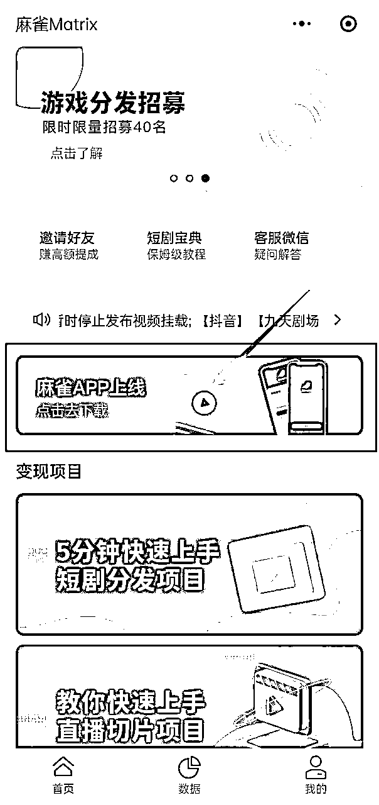

需要注意的是，我们可以看到每部剧都有三个推广页面和不同剧场，其对应了三个不同平台的推广方式和剧场名字，大家可以在页面右上角，或者进入页面后的剧名下方看到。

### 3.1.3 了解麻雀 Matrix 功能

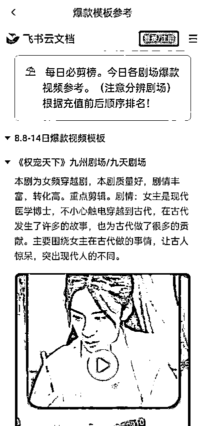

再下滑，可以看到**「热门短剧」****，我们可以直接点击进进入对应页面，创建对应剧目的推广即可（截图页面仅为举例，不做推荐）；如果不会挂载，可以点击左侧的「查看如何挂载推广」：**

需要注意的是，我们可以看到每部剧都有三个推广页面和不同剧场，其对应了三个不同平台的推广方式和剧场名字，大家可以在页面右上角，或者进入页面后的剧名下方看到。

以下图为例，同一个剧场，在 3 个平台，分别叫「微剧吧」、「红火剧场」和「章章剧场」。这并不影响我们做分发，发布时，看清对应平台即可。

**「分佣比例」**等信息则在小程序和 APP 的「变现」-短剧列表页面可以看到，点进去也可以看到，如图所示，结算周期为 T+7：

也可以在首页的「抖音小程序推广计划」，看到每个平台的对应佣金。

需要提示的是，8 月 8 号抖音更新新规以后，原先所有佣金都由麻雀打款，现在变为走「抖音小程序推广」，其中一部分金额会在抖音小程序里结算，其余部分还在麻雀里提现，但总佣金比例不变。

所以在这个页面，收益会显示为【推广计划分佣比例】+【平台补贴】两部分。

快手和视频号平台，目前还是全部在麻雀提现。

### 3.1.4 麻雀 Matrix 如何实现短剧推广🔥

然后点「创建推广」按钮，就会让你选择相册的视频（第一次选择需要授权读取相册权限），选择好视频后，会**自动跳转到抖音****/**快手。

然后我们选择手机相册里已经制作好的视频，上传到抖音，填写相关#标题、话题等，点击发布即可。

❗️这里选择的视频就是你剪辑制作完毕，要用来发布作品的视频。如何剪辑视频，详见👉《六、剪辑视频》

另外，在近期**「抖音平台」**政策调整之后，我们挂载小程序，可能会出现掉链接或者看不到链接的情况，原因是我们的账号不足千粉，不支持抖音小程序的挂载。

具体的挂载方式法，可观看下列视频。其中的第 3 种，经后期再次测试，也存在掉链接的情况，如果掉链接，我们可复制对应短剧口令置顶到评论区即可，先以涨粉为主。

## 3.2 创作猫

选择不同的短剧推广平台，下载对应 APP，就可以看到各自平台的剧场内容、视频素材、推广教程、信息通知、推广收益等。你在整个推广过程中涉及到的各个步骤，都在对应 APP 中有解法。

一个账号可以同时推广多个平台的剧场。

好啦，开始了解平台吧，看到眼花缭乱的素材的那一刻，我们才算真正踏入「短剧 CPS」的大门。

## 3.1 平台一：麻雀 Matrix @思蒙

麻雀 Matrix 是目前比较主流的短剧推广平台之一，大家可以按照以下流程注册并使用该平台，来完成你的短剧推广。

### 3.1.1 注册微信小程序账号

在微信里，直接长按识别以下小程序码（截图本页即可）：

打开小程序，选择微信登录注册：

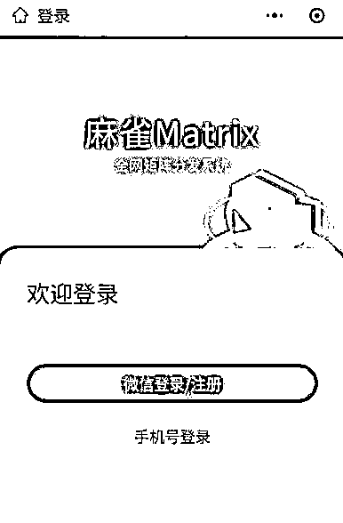

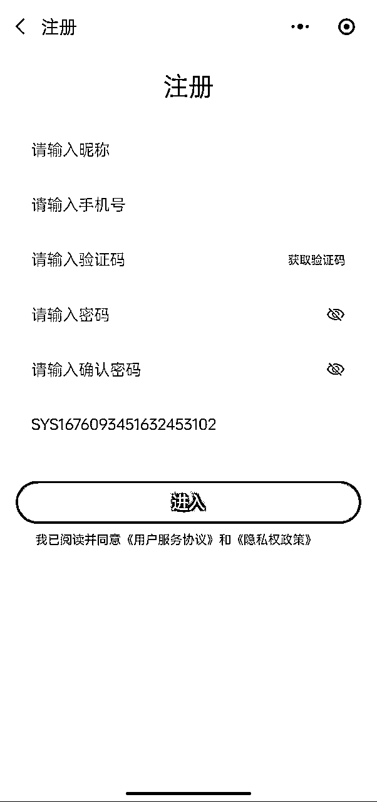

完成后进入小程序：

点进「我的」看到这个页面，我们的微信小程序就注册完成了。

完成后进入小程序：

点进「我的」看到这个页面，我们的微信小程序就注册完成了。

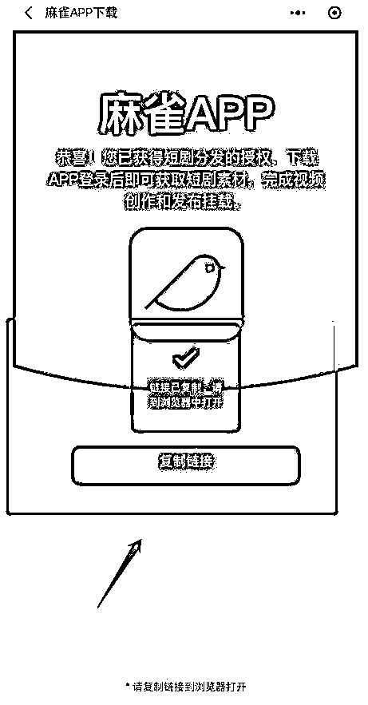

下载以后，用刚才注册的账号登录即可。

### 3.1.3 了解麻雀 Matrix 功能

进入 APP 后，我们能看到这样几个界面，简单介绍一下。

「重要通知」栏，即顶部 Banner，会发布一些「近日热门短剧」，以及平台政策的变化，比如最近抖音政策改变引起挂载方式改变，就有及时通知新的「小程序推广计划操作流程」等。

再下滑，可以看到「热门短剧」，我们可以直接点击进进入对应页面，创建对应剧目的推广即可（截图页面仅为举例，不做推荐）；如果不会挂载，可以点击左侧的「查看如何挂载推广」：

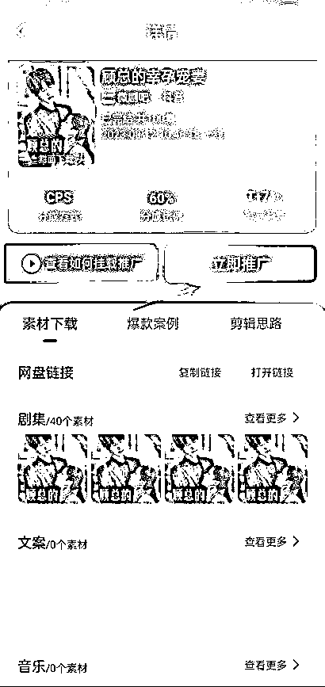

需要注意的是，我们可以看到每部剧都有三个推广页面和不同剧场，其对应了三个不同平台的推广方式和剧场名字，大家可以在页面右上角，或者进入页面后的剧名下方看到。

以下图为例，同一个剧场，在 3 个平台，分别叫「微剧吧」、「红火剧场」和「章章剧场」。这并不影响我们做分发，发布时，看清对应平台即可。

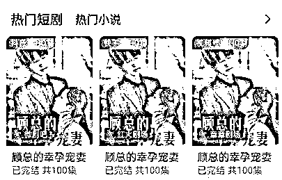

「分佣比例」等信息则在小程序和 APP 的「变现」-短剧列表页面可以看到，点进去也可以看到，如图所示，结算周期为

也可以在首页的「抖音小程序推广计划」，看到每个平台的对应佣金。

需要提示的是，8 月 8 号抖音更新新规以后，原先所有佣金都由麻雀打款，现在变为走「抖音小程序推广」，其中一部分金额会在抖音小程序里结算，其余部分还在麻雀里提现，但总佣金比例不变。

所以在这个页面，收益会显示为【推广计划分佣比例】+【平台补贴】两部分。

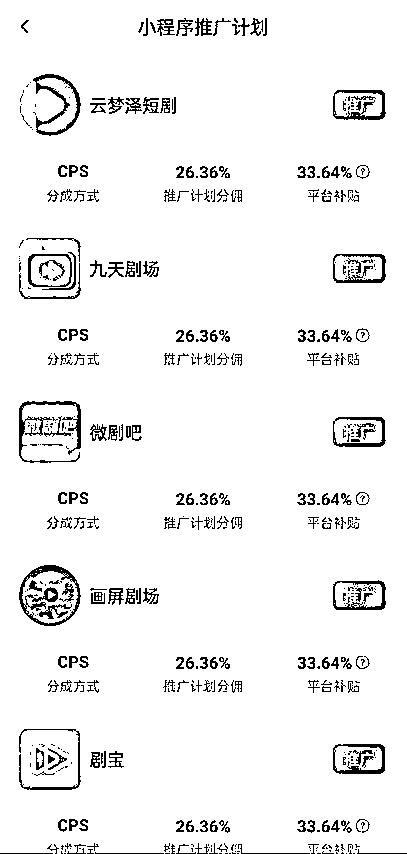

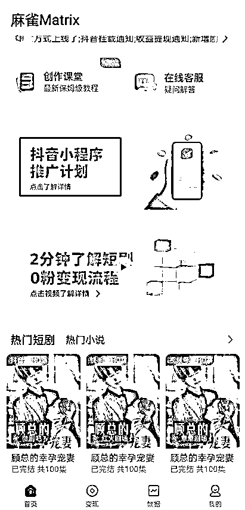

信息默认填写的即可：

然后点「创建推广」按钮，就会让你选择相册的视频（第一次选择需要授权读取相册权限），选择好视频后，会自动跳转到抖音/快手。

然后我们选择手机相册里已经制作好的视频，上传到抖音，填写相关#标题、话题等，点击发布即可。

❗️这里选择的视频就是你剪辑制作完毕，要用来发布作品的视频。如何剪辑视频，详见👉《六、剪辑视频》

另外，在近期「抖音平台」政策调整之后，我们挂载小程序，可能会出现掉链接或者看不到链接的情况，原因是我们的账号不足千粉，不支持抖音小程序的挂载。

发布视频时，把口令粘贴到标题里，等待发布完成，同时也粘贴到评论区并置顶。

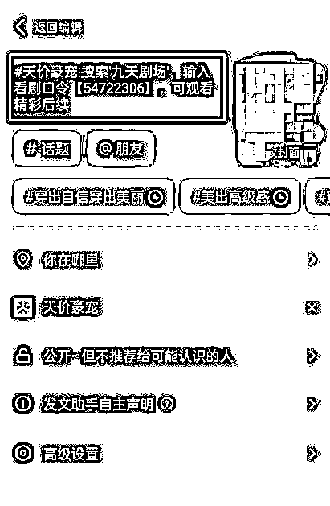

等待我们发布一些数量的视频，有作品小爆之后，迅速涨到千粉，就可以直接用挂载小程序的方式，也不会掉链接了。

注意，其他平台无千粉限制，可以正常挂载。

具体的挂载方式法，可观看下列视频。其中的第 3 种，经后期再次测试，也存在掉链接的情况，如果掉链接，我们可复制对应短剧口令置顶到评论区即可，先以涨粉为主。

8 月 10 日麻雀 app 挂载方式.mp4【在线播放】

## 3.2 平台二：创作猫

创作猫是一个兼具内容创作+变现的一站式服务平台，它即提供短剧剧目与素材，支持你完成短剧推广，同时也具备视频创作功能，让你在 APP 上直接完成视频剪辑等创作。

### 3.2.1 下载 APP，登录账号

创作猫官网：https://chuangzuomao.cn/，打开官网后，按提示扫码下载 APP 即可。

APP 注册流程与常规 APP 大同小异，填写你的账号密码等信息，并填写手机号，获取验证码即可，这里不再赘述。

### 3.2.2 了解创作猫功能

创作猫兼具推广和创作功能，所以界面相对更丰富，我们来了解一些核心功能。

#### 3.2.2.1 短剧推广功能

学习页面

进入 APP 后，我们看到的第一个页面就是「学习」，这里包括一些操作教程、任务介绍等，主要是引导你了解各个项目。如果你对「短剧 CPS」的某个环节不理解，尝试在这里搜索可能会有答案：

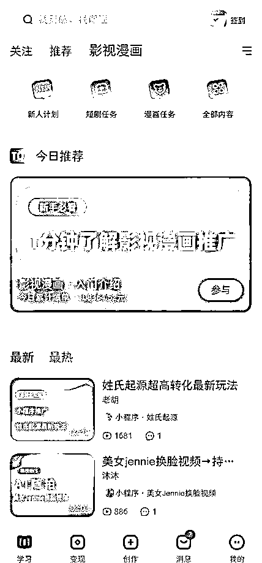

⭐️ 变现页面 ⭐️

点击页面底部的「变现」，能看到创作猫 APP 中对我们来说最核心的模块之一。在这里你能看到可推广的短剧，并点击对应短

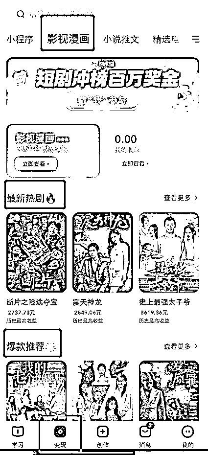

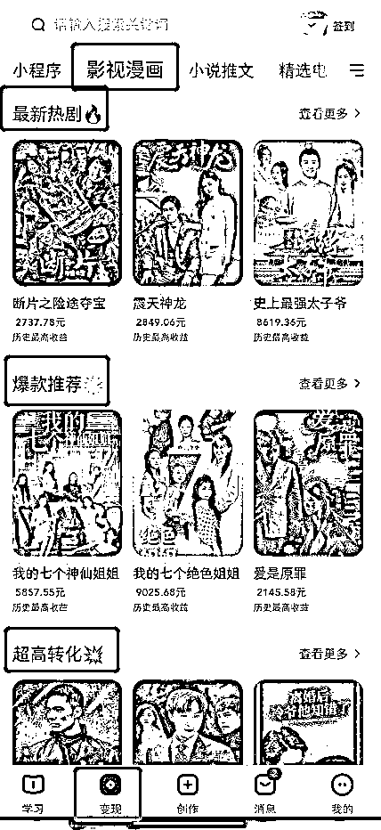

再把页面往下拉，你还能看到更多短剧，并且还能根据渠道、分成类型、上架时间等对短剧进行筛选与排序：

点击你感兴趣的短剧，能看到推广素材（即视频素材）与推广按钮等：

具体如何推广我们在「3.2.3 如何实现短剧推广」会讲到。

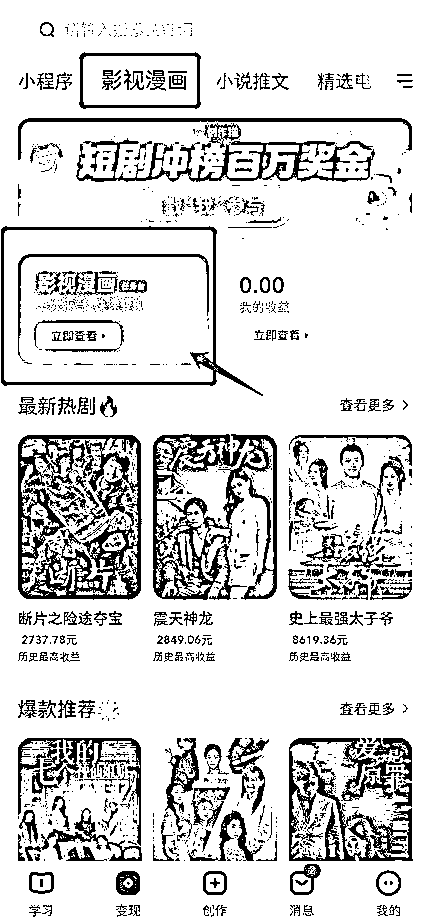

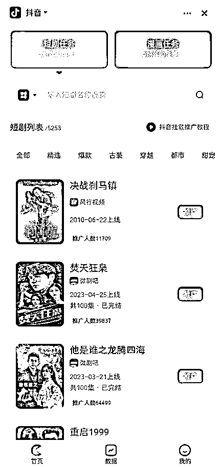

我们选择其中的「短剧任务」就能看到非常多的短剧，你还可以按照精选、爆款、古装、穿越……等等标签进行短剧选择。在左上角，你还能选择你要发视频的平台：

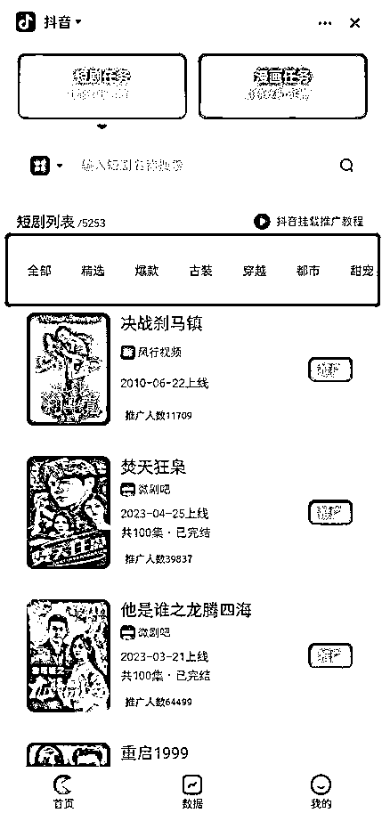

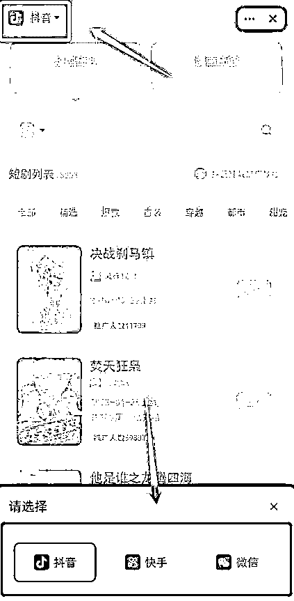

点击你想要推广的短剧后，同样就能跳转至推广页面，并且能显示该剧的分成方式、分销比例、推广素材等，左上角同样能选择你想要发视频的平台：

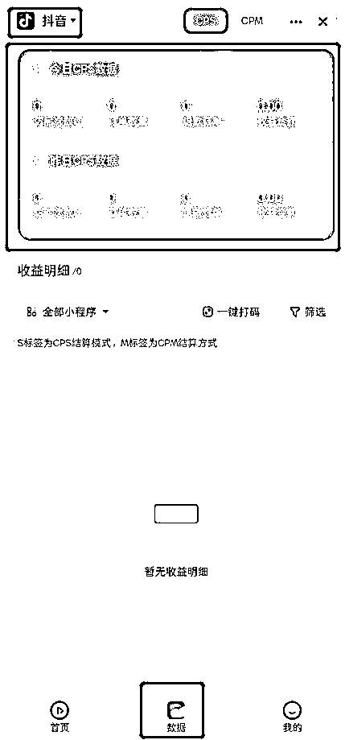

支持绑定银行卡或者支付宝进行提现，结算周期：

CPS：T+7

CPS 即按销售金额结算，比如有多少用户通过你的作品或链接进行充值，你就可以从中获取分佣 T+7，即收益发生后，再过 7 天（一般指工作日），收益就可以被结算并提现

CPM：T+30CPM 即按千次展示结算，一次展示表示被一个用户完整浏览

T+30，即收益发生后，再过 30 天（一般指工作日），收益就可以被结算并提现

创作猫的短剧推广功能，主要涉及到的就是以上界面，大家可以多多探索，熟练使用。

#### 3.2.2.2 创作功能

创作猫的特殊之处在于，我们能在这个 APP 内部完成视频的创作与剪辑。

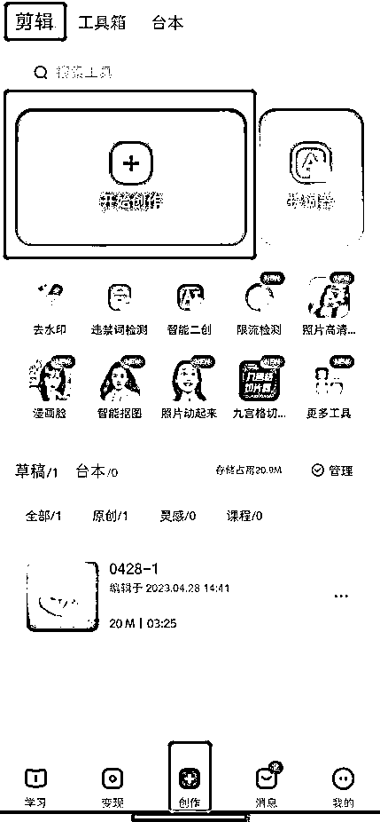

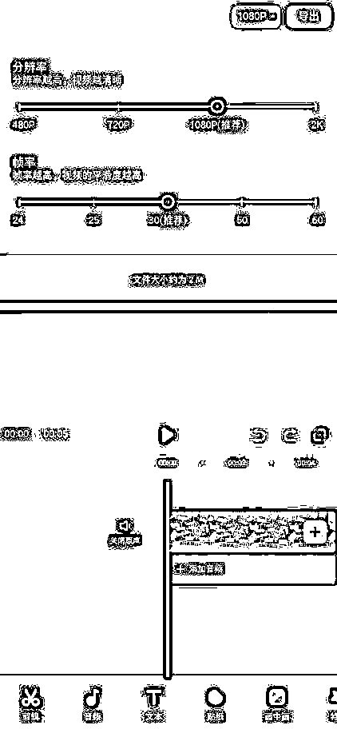

这里的剪辑方式与剪映的剪辑方式同款，会剪映就会用创作猫剪辑，不再赘述。

工具箱中也有许多彩蛋，大家可以选择自己感兴趣的功能进行尝试：

#### 3.2.2.3 收费说明

使用工具 or 观看教学灵感这些是收费的，比如以下功能，会在我们实际剪辑过程中有一些收费限制，但不影响整体短剧推广：

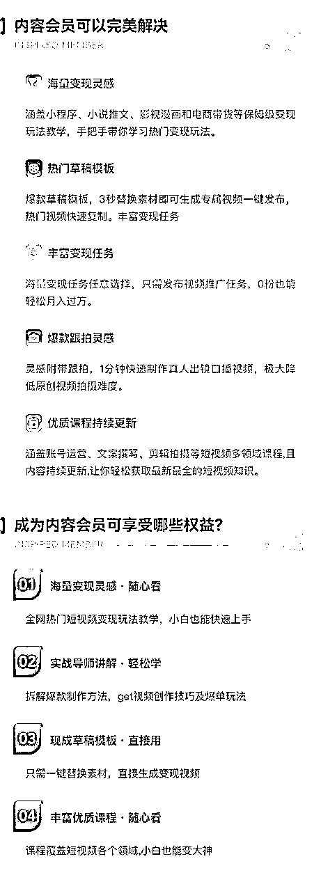

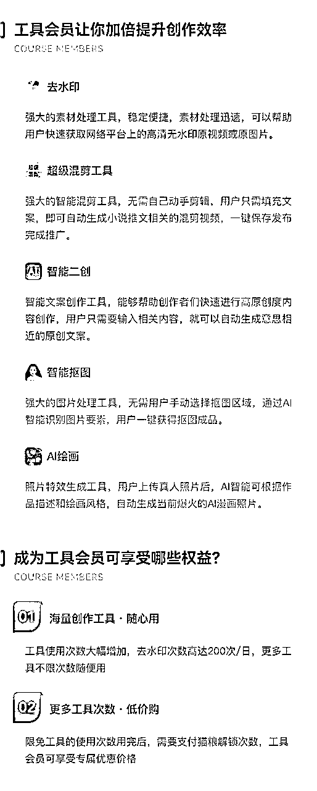

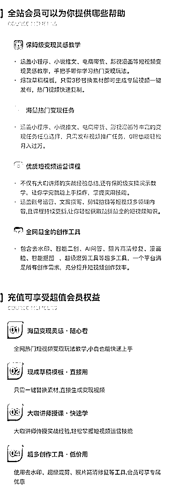

### 3.2.3 创作猫如何实现短剧推广🔥

创作猫的短剧推广方式与麻雀 Matrix 大同小异，这里就不再做文字详解，大家可以点击官方教程视频学习：

创作猫短剧推广教程.mp4【在线播放】

# 第四步：选择短剧并获取素材🔥

💡

章节概要相信大家在了解平台的过程中，已经看到非常多类型各异的短剧了。那么我们如何选择适合的短剧进行推广呢？这就是本章节要解决的核心问题。

一般来说，尤其是新手，很难单靠自己找到更容易爆的短剧，毕竟「短剧 CPS」是个在很大程度上需要搏一搏概率的项目，老手翻车都是常有的事。适当使用一些技巧才能让我们事半功倍。

麻雀 Matrix 与创作猫也了解这一点，所以这两个平台也会总结一些爆款，让大家在选剧时更有方向。

综上，本章节将从以下角度为大家提供一些选剧方法：

✅通用方法：从视频数据反推爆款短剧✅平台方法一：麻雀 Matrix 的爆款参考

✅平台方法二：创作猫的爆款参考

✅进阶玩法：选择新剧，大胆尝试

⭐️ 航海期间，教练们也会在群里分享最近的爆款短剧和一些对标视频，大家都可以跟进学习。

找到你觉得值得推广的短剧后，别忘记获取素材哦～

需要注意的是，素材原片千万不可以直接发送，必须经过剪辑，剪辑方法我们将在「六、剪辑视频」细说。如果直接在各短视频平台上传原片，不但会被判为违规，甚至有封号危险，收益也会被短剧推广平台没收。

百闻不如一见，百见不如一练，找到适合你的小技巧，尝试找找更适合推广、更容易爆的短剧吧。

## 4.1 选择适合推广的短剧

### 4.1.1 方法一：麻雀 Matrix/创作猫的爆款参考 @猫柠

我们通常用的平台有麻雀和创作猫，两个平台中都会有一个爆款剧情的推荐。

麻雀 Matrix

首先看麻雀平台，它有一个【热门短剧】的标签页面，里面会推荐现在比较火的短剧。并且下方有一个筛选功能，可以筛选出不同剧场，以及不同时间内的热门短剧。

7 天内的热门短剧基本上都是可以挑出来直接用的。

当然对于特别火的剧，我们挑选的时间要求可以适当拓宽，例如之前火过好几个月的「顾少的隐婚罪妻」。

同时，在右侧【全部】标签页中，我们也可以筛选出最新推出的短剧。有的小伙伴会更喜欢找新剧做，因为会想：是不是做的内容越新，竞争力越小，效果也越好。

其实，平台上几乎每天都会有新剧推出，但不是所有新剧都可以成为爆剧。

我们要追求的，不是什么新做什么，而是什么火做什么，顺着平台的调性走，做用户喜欢的内容，这样平台才会给我们流量。

创作猫

对比两个平台的热门短剧推荐，肯定有眼尖的小伙伴已经发现了：其中是有重合的短剧的！

那就是：叔的小祖宗闪婚后宠爆了

那有的小伙伴可能会疑惑：为什么两个平台的推荐热剧不完全相同？

因为不同的平台牵涉到不同的剧场授权、以及推广用户数量和粉丝量的差别，数据多多少少会有些出入。

但是，一部剧如果两个平台都把它收录到热门推荐中，足以说明这个剧的数据是非常不错的！

拓展延伸：【爆剧】与【新剧】，怎么选择？

那么由此我们就可以讨论一个拓展议题：【爆剧】与【新剧】怎么选择？我的经验如下：

①优先做爆剧：爆款剧＞新剧

②如果两个爆款剧火热程度不相上下：爆款新剧＞爆款老剧整体来说，也就是，爆款新剧＞爆款老剧＞新剧。

内容来源：《如何选择爆款短剧，并做到先借鉴后超越 @猫柠》

### 4.1.2 方法二：从视频数据反推爆款短剧 @猫柠 @惟乔 @清欢

火过的内容还会再火，这是做短视频的原则，任何时候，任何领域都适用。我们可以在各大短视频平台搜索短剧，看看最近哪些剧热度高。

搜索关键词：短剧、九州小剧场、抖音短剧、抖音短剧新番计划、触摸短剧、超爽短剧、热门短剧、短剧推荐、好剧推荐、热门短剧推荐、因为一个片段看了整部剧……等。

以抖音为例，首先我们输入其中一个关键词，在搜索结果处进行筛选，筛选条件为：

一般来说，近期热门短剧通常符合以下两个条件：第一个看点赞量，点赞量越高的剧，热度越高，建议选择视频点赞量>1000 的短剧；；

第二个看视频数量，视频量占比越多的剧热度越高。可以看到，在上图中一天内点赞量最多的 6 条视频中，有两条都是同一个短剧（我在民国当少帅），那么就说明这个短剧的热度还是不错的。

再来看个例子，同样用上述方法搜索，可以找到《慕总的隐婚罪妻》与《医王龙婿》这两部剧点赞量高且视频数量多，因此女频可以做《慕总的隐婚罪妻》，男频可以做《医王龙婿》。

我们筛选的时候，优先选择一天内的数据，如果找不到合适的，可以尝试把范围扩大到一周内，或者更换其它关键词继续筛选，直到找到一个点赞量以及视频占比数量都不错的短剧。

当然，在其他短视频平台筛选也是同样的方法。

如果我们通过在抖音搜索关键词筛选出来的短剧，也恰恰正好在麻雀、创作猫等平台推荐的热门短剧中，那说明这部剧真的很不错，我们做的时候可以首选这种同时符合多种方法的短剧～

如果发现数据还不错的剧，主要看这几点：剪的什么剧（可以作为选剧参考）

视频多长时间（作为剪辑时长参考）

剧的开头和结尾是什么（后续剪辑时可以参考）

爆款剧账号粉丝量：如果粉丝数很少但视频为爆款，那这个作品可参考的优先级就很高

来看个例子，以搜索《顾少的隐婚罪妻》这部剧为例，搜索结果如下图：

像这种点赞有成千上万个的，都是被市场验证过的爆款短剧，可以放心选择，然后我们可以参考爆款视频进行剪辑，一般可以参考爆款的开头和结尾，直接一比一拿来用，中间剧情可以适当调整和改变。

内容来源：《短剧推广：每天 1-2 条视频，单个账号月变现 1w+经验复盘》《新手用生财的方法做短剧 CPS，一个月 1.4w+收益》《短剧 cps，小白也能月入过万的蓝海项目 @清欢》《如何选择爆款短剧，并做到先借鉴后超越 @猫柠》

### 4.1.3 方法三：通过热点宝搜索关键词选择短剧 @猫柠

抖音搜索热点宝，进入小程序：

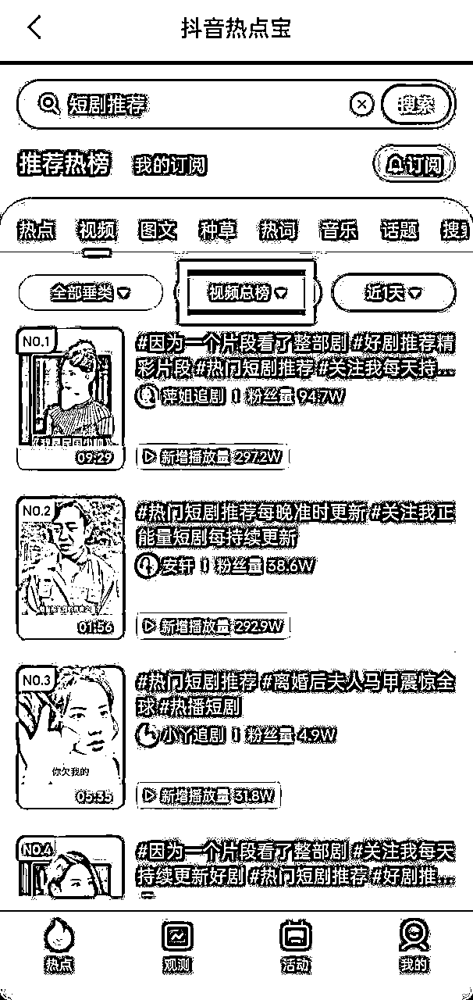

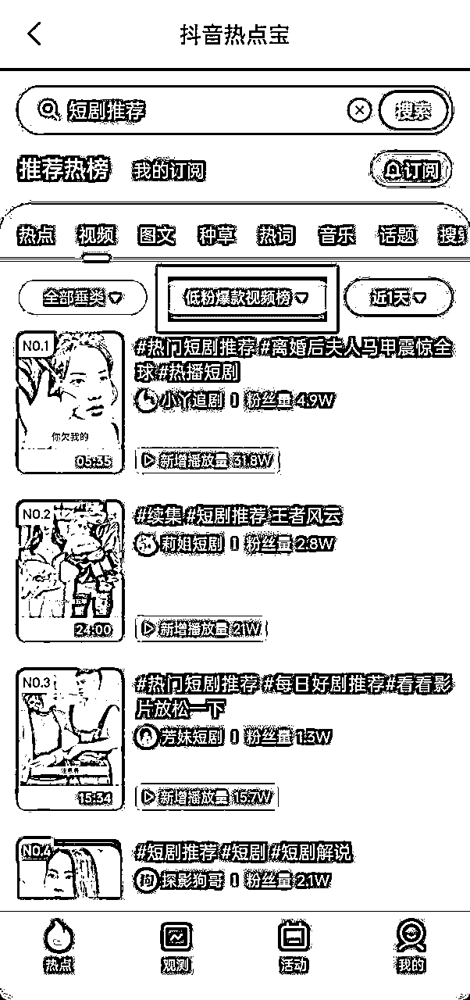

其中，视频总榜第一条：我在民国当少帅

低粉爆款视频榜第一条：离婚后夫人马甲震惊全球

都在麻雀的热门短剧推荐片单中。

这恰恰说明了，这几种方法其实是相辅相成的。热门短剧只有那几个，我们选择短剧的时候，通过一种方式选择出来的热门短剧，其实也是可以通过其他方式去相互验证的。

对于新人来说，上手最快的方式一定是找到对标视频，对已经被平台验证过的内容加以模仿，也就是“借鉴作业”。

内容来源：《如何选择爆款短剧，并做到先借鉴后超越 @猫柠》

### 4.1.4 进阶玩法：选择新剧，大胆尝试 @惟乔

这种方法比较进阶，新手不建议尝试，建议有一定内容判断能力的玩家尝试。

新剧没什么可参考的视频，需要自己按自己的逻辑来剪，在「五、下载素材并组合剧情」中我们会提到，如何更好地组合剧情。

新剧的质量也不稳定，但主要是抢先机（麻雀 Matrix 和创作猫均能通过筛选看到新剧）。

如果说做短剧 CPS 是做短视频的蓝海领域，那么做新剧就是做短剧 CPS 的蓝海领域。

在选择新剧时，还需要结合自己的账号定位。目前短剧的垂直领域没有分得那么细，主要就是分男频、女频。

如果你的剧是男频爆了，观察粉丝的男女比情况，确认是不是真的男性在看，那么后续重点就剪男频剧，新剧自然也就选男频新剧。

主流女频剧都是虐剧，虐完后反转，女主与男人、女主与小三、女主与家人，大多都是 HE（happy end）。

男频剧都是爽剧一一复仇、扮猪吃虎、穿越、艳遇。

内容来源：《新手用生财的方法做短剧 CPS，一个月 1.4w+收益》

### 4.1.5 注意事项

讲完找剧方法，在这里也给大家提个醒，什么样的短剧不推荐做：

1.

剧场没有授权的剧不建议做，因为没有授权的剧，剪了我们也没有收益。

一发出去就掉链接的剧不建议做，因为没有链接的话，我们依然是没有收益的。

男频、女频剧不建议混做，我们前期起号需要精准流量，发布内容越垂直越好。

内容来源：《如何选择爆款短剧，并做到先借鉴后超越 @猫柠》

## 4.2 获取视频素材 @思蒙

如果你找到了自己想要的短剧，在麻雀 Matrix 或创作猫搜索即可，找到对应短剧即可获得素材。

### 4.2.1 渠道一：麻雀 Matrix

麻雀 Matrix 的素材一般都以百度云盘的方式展现。

你从主页进入每一部剧的推广页面后，都会看到对应的云盘链接，我们复制链接到浏览器打开，或直接点击打开链接即可：

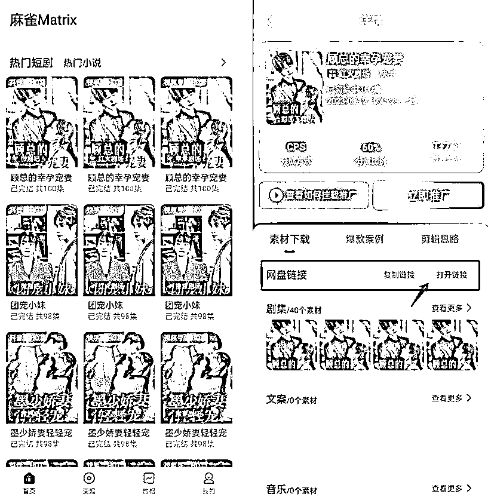

然后，点击【全选——箭头指的这个小框】，点击【保存到我的百度云盘】，这时提示要登录百度账号：

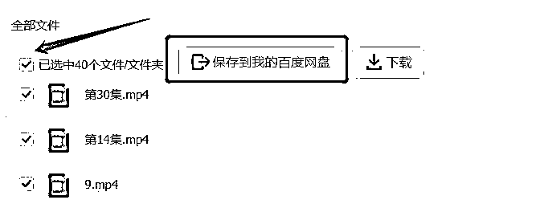

有百度账号的自行登陆，没有百度账号直接注册一个。然后我们到云盘里下载全部剧集就行。

也有的剧集，在「网盘链接」的下方，会直接提供「剧集素材」。我们可直接点进去，选中以后下载即可。

官方剧场提供的剧集，一般都是 1-20 集，或 1-40 集的，不会提供全部素材（牵扯到版权问题）。

但有的精彩模板里，会出现个别不在官方素材库里的内容，比如《顾少的隐婚罪妻》的爆款开头，用的是 96 集和 97 集，这时我们就要自己想办法，去找对应素材。

一般是找有可能有资源的同学或前辈，问问他们有没有拿到这类资源，或者去其他平台（如 B 站，或淘宝拼多多）搜一搜，一般可以找到相关资源。

我们就要自己想办法，去找对应素材。一般是找有可能有资源的同学或前辈，问问他们有没有拿到这类资源，或者去其他平台（如 B 站，或淘宝拼多多）搜一搜，一般可以找到相关资源。

# 第五步：重组素材剧情，提升爆款概率🔥

💡

章节概要为了追爆款，很多人都会剪同一部剧，那么怎么从中脱颖而出，做出爆款呢？

这就要求我们要有拆分并组合剧情的能力，让剪辑后的视频更加吸引人。

当然，这种能力是需要打磨的，在未打磨出来之前，我们可以参考别人的剧情组合方式：

✅初级方法一：抖音搜索找对标视频

✅初级方法二：掐头去尾，浓缩剧情

✅初级方法三：参考麻雀 Matrix 的爆款模板如果你逐渐形成了自己的思路，有了一定手感，就可以开始尝试自己组合剧情了：

✅进阶方法：拼接精彩剧情，遵循爆款逻辑

⭐️ 航海期间，教练们也会在群里分享最近的爆款短剧和一些对标视频，大家都可以跟进学习～这个过程中，我们要耐得住寂寞，有时候爆与不爆存在一定运气成分。多试多练，爆款并不遥远。

## 5.1 剧情的重要性 @思蒙

「短剧 CPS」项目的重点之一，就是选剧+对剧情的把握。

选剧相当于选品，是项目的核心，然后是对剧情的把握，也就是创作思路的培养。

对新人来说，在还不会选剧、没有创作能力的时候，只需要模仿，去跟着最热门的剧、爆火的模板，模仿着剪就好。选剧的诸多方法，我们也在「第四步：选择短剧并获取素材」中告诉了大家。

到后期，我们就可以根据模仿爆款的思路，加上之前积累的经验，按照剧情创作出新的剪辑思路，把一个剧剪出很多精彩的故事了。

短剧之所以能够火，是因为它符合当前的短视频平台调性，符合观众对内容的预期形式。

它万变不离其宗的核心，就是“爽”，我们千万不要把自己的情感因素带进去，觉得这里太假，那里太作。我们的主要用户，可能和咱们不在一个认知频道，所以尽量要有用户思维。

剪辑时主要围绕一个“爽”字，赢的“爽”，虐的“爽”，打脸“爽”，复仇“爽”……情绪越激烈，观众越爱看。

播放量高的剧，一定是剪辑的内容，在某些方面击中了一个点，所以观众才爱看。那这个点，我们就要一直去用烦的用，用到它没有价值为止（一般不会）。

在剪辑剧情时，可以把作品分为：开、中间、结尾，三大部分

开头为了拉停留，一定要精彩；

中间情节最好不是爽，就是惨，跌宕起伏，揪住用户心理；

结尾留悬念提高转化（如果你不会，学电视剧每一集结尾即可）；

总时长控制在 3-6 分钟内。

后续的几种教程，基本都是围绕这个核心理念展开的。

内容来源：5 月 23 日《短剧 CPS 的项目现状及航行路径》@思蒙

## 5.2 初级方法一：抖音搜索找对标视频 @云珞 YunL @猫柠 @张柯 Ker

优质对标视频应当符合以下几个条件：一天内发布

点赞量超 1000 视频播放量远远高于其他视频播放量

粉丝量越少越好

第一步： 搜索关键词「短剧」，筛选条件为一天内最多点赞。如果一个关键词找不到合适的对标视频，就换其他关键词继续搜，关键词可以是「短剧、短剧推荐、好剧推荐、热门短剧、因为一个片段看了整部剧、"短剧名称”」 等等，或者点击任意一个视频，看看别人用的什么标签，我们就搜什么关键词：

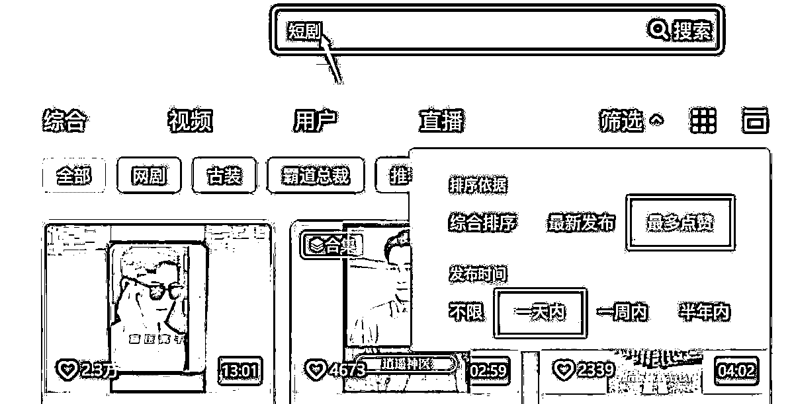

第二步：根据点赞数量排序，找符合自己所做方向（男频/女频）的短剧，挑选 1000 赞以上的点击进去查看。

找到符合条件的视频，前期进行 1: 1 模仿剪辑，后期可适当创新。

如果发现数据还不错的剧，主要看这几点：剪的什么剧

视频多长时间（作为剪辑时长参考）

剧的开头和结尾是什么（作为剪辑剧情参考）

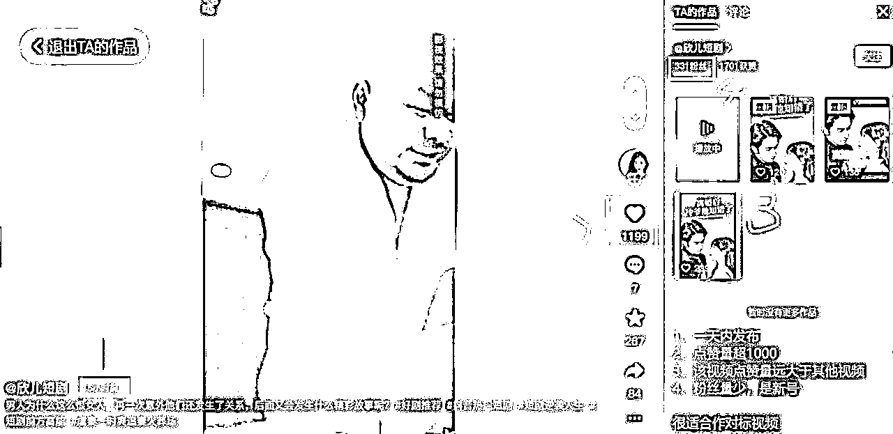

比如我们以最近的热门，《史上最强太子爷》这部剧为例：

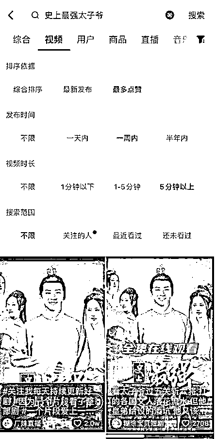

以下这些视频的数据表现都非常好：

https://v.douyin.com/UMxXY1s/

https://v.douyin.com/UMQMYpV/https://v.douyin.com/UMQ8F2v/

https://v.douyin.com/UMQPmoj/

https://v.douyin.com/UMQjXM7/

https://v.douyin.com/UMQ2C7n/大家可以看到，爆款都是类似的，甚至开头都几乎一样，前面几个万赞视频甚至只是做了去重。

所以如果有时候你不知道怎么剪一部剧，找对标，多看多学习，就有手感了。

内容来源：《我用生财教我的方法做短剧》《短剧推广：每天 1-2 条视频，单个账号月变现 1w+经验复盘》

## 5.3 初级方法二：选 5 集内容掐头去尾 @老严干货 CPS

短剧的素材一般 1-2 分钟一集，我们最少挑选 5 集以上的素材，通过掐头去尾，删掉平淡剧情的方法浓缩成一集 3-4 分钟的作品，通过这样的方法，耗时 10-20 分钟即可创作一部作品，并且能过原创。

这里的核心做法是，最少选 5 集以上的剧情拼成作品。如果不清楚该删掉哪些内容，可以先简单学习下爆款剧情的逻辑，去掉不必要内容即可👉《5.4 进阶方法：拼接精彩剧情，遵循爆款逻辑》内容来源：《短剧 cps 怎么赚大钱》

## 5.4 初级方法三：参考麻雀 Matrix 的爆款模板

根据平台整理的爆款模板，每日都会更新几个爆款视频，找到要剪辑的短剧，根据视频模板 1: 1 剪辑。其中不仅可以找模板，还可以学习剪辑思路。

进入麻雀 Matrix 后，点击「短剧宝典-近期大爆模板」就能看到链接：

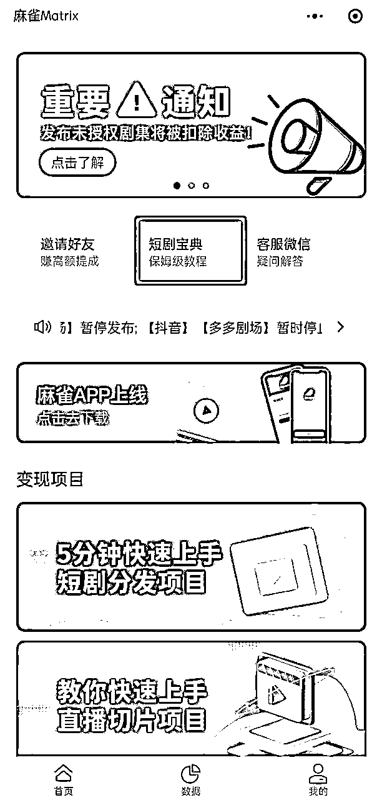

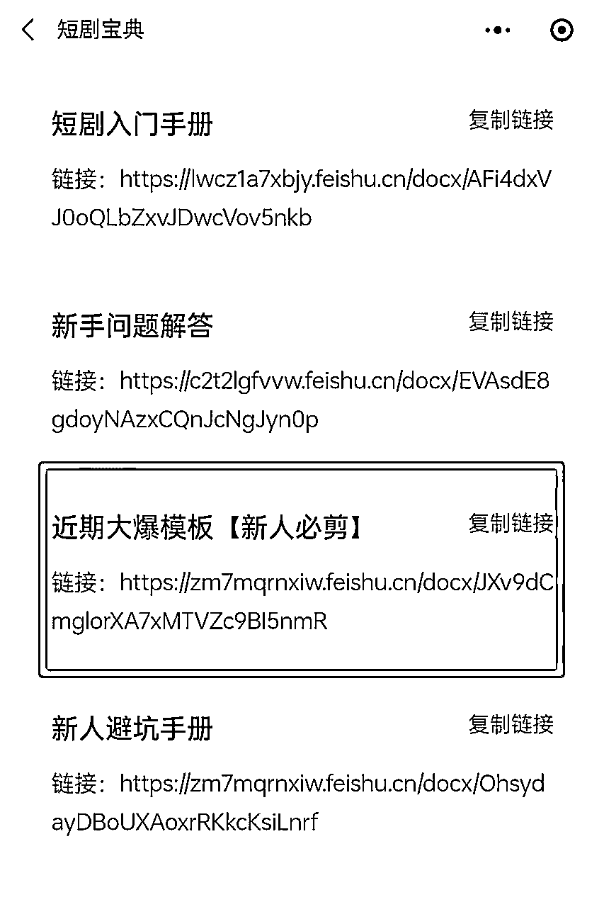

将链接复制到网页或微信就能打开：

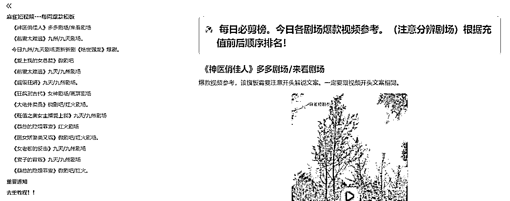

这里的爆款模板里，主要包含爆款短剧推荐+一两句话的剪辑重点+剪辑后的视频参考。

对于爆款剧来说，80% 的开头结尾本就是相似的，这里的模板也能帮助大家减少不少无用功。

## 5.5 进阶方法：拼接精彩剧情，遵循爆款逻辑 @思蒙 @猫柠 @老严干货 CPS @云珞 YunL @惟乔

该方法需要你对短剧剧情和短剧受众都有一定理解，建议在积累一定经验后再尝试。

操作方法其实说起来很简单：

通篇观看剧情内容，一部剧时长在 2 个小时之内，用 2 倍速不到一个小时就能看完。对短剧有了了解之后，也可以用对应软件 3 倍速甚至 5 倍速去快速预览。

看的时候记录下精彩的地方，然后把这些精彩片段剪辑成一个视频，视频时长大概 4-6 分钟。

但如何「将精彩片段剪辑成一个视频」，我们需要了解以下几点。

### 5.5.1 爆款逻辑

爆款视频遵循一个原则： 开头黄金 5 秒，中间精彩片段，结尾戛然而止。

开头：

黄金 5 秒很重要，挑选那些不符合观众预期的、离奇的、有爆点的、有吸引力、有悬念的开头内容；

通常会介绍人物、环境和故事背景，在这个阶段，通常会设定故事的基本冲突；中间：

冲突性片段：可以是反转剧情、争斗之类，展示主要人物面临的各种挑战或问题；高潮片段：这是冲突达到顶峰的时刻，通常是故事的转折点，在这里，主要的冲突或问题通常会达到最紧张的状态；

中间剧情不是爽，就是惨，跌宕起伏，揪住用户心理，尽量剪去配角的戏份和平淡的剧情；

结尾：留悬念，让用户好奇接下来会发生什么，吸引观众点击小程序去付费观看全集

比如，女频短剧看男主知道女主受伤后是不是会后悔，但不把男主后悔剪辑出来；又比如，男频短剧是炮灰挑衅男主，用户都知道男主要装逼打脸了，但不把男主装逼打脸剪辑出来，引导用户去看正版短剧，自己去看男主如何花式装逼打脸，向用户提供愉悦感；

或者你看剧情时，很想知道后续是什么，你就把那情节放入结尾，不要把后续放出来。

大家也可以参考 @思蒙老师的这个爆款模板，大致结构是差不多的：

不管如何起承转合，模板万变不离其宗：

一虐一反转算一个循环，刺激观众情绪的起伏，最后在反转前停住，引导看后续。

虐只是一个指代词，与虐剧无类，所有的剧种剪辑都可循环这个逻辑。

以此为基础，我们就能明白，其实常见爆款剧情就三类。

男频

男主扮猪吃虎+反转打脸+复仇+悬念结尾穿越+YY+堆积爽点+悬念结尾

女频：女主被虐（非常毁三观那种），比如开幕雷击（暴力、暧昧）+男女主虐恋+反派搞事+悬念结尾

或者是真相大白的剧情，比如，女主被女配冒充，女配从嚣张跋扈到绝望，但结尾留一点悬念

而我们剪辑视频时，可以行生出更细化的主线。比如女主被虐，可以细化为：男主直接虐女主，二者直接冲突：

女二陷害女主，引发矛盾冲突；

婆媳矛盾冲突；

利用小孩博同情；

……

每条线可以单拎出来成一个视频，也可以多条线交叉在一起，对于过渡就要把握好。

### 5.5.2 选用素材

有了开头中间结尾，选哪些素材呢？

从角色来选：比如女频，今天你剪辑的情节围绕男女主和恶毒女配，那就选与男女主恶毒女配有关的剧情。

但若你今天剪辑的情节围绕男女主和婆婆，那就选男女主婆婆有关的剧情，恶毒女配不要出现，或者少出现。

一集 5-10 分钟为佳。实在是没有灵感，也可以剪辑 3 分钟的视频。

从剧情来选：剧情按照开幕雷击+虐+小逆袭+虐+小逆袭+虐+悬念来排序

虐是指什么呢？ 就是男主虐女主、女配虐女主、炮灰虐女主，主角处于不利的境地。

小逆袭是指女主反击伤害她的人，不管是语言反击，还是肢体反击，还是男主或其他人帮女主说话，都是小逆袭很多时候虐与小逆袭的剧情是连在一起的。

我们在剪辑时，就是不断重复循环「虐-反转」。如果是剪 2 分钟的视频，可能中间只反转一次，一共两个循环就结束如果是剪 10 分钟的视频，那么 5-6 次循环再结束。那些非必要的过渡剧情，全部不要。

如何判断剧情非必要？

删除这些剧情后，仍然看得懂，不会让观众云里雾里的：怎么突然出现一个人物，他是谁，为什么要帮主角？

这个逻辑玩熟以后，剧热不热门，在你这里都一样，你都能剪得精彩，你就是爆款制造机。

当然要熟练掌握这个套路，首先在拿到素材时，必须把视频完整的看一遍，然后做上笔记，如图所示：

当然，你必须了解抖音发布规范，可能违规、你把握不准的情节不要放。

### 5.5.3 分割台词

比如，现在有 A 情节、B 情节，在原剧情中，A 在前，B 在后，你剪辑时，B 剧情放到 A 剧情前面，也不影响观看，那就用 B A 剧情。

具体到一句话时，也是这样。

比如，A 这句话在前，B 在后，如果不影响意思，你就把 B 放在 A 前面。

除此之外，你还可以删除多余的话、无用的话。

比如，某人情节，男主夸奖女配，贬低女主，原话是：我从高中就喜欢你，那时候的你，天真善良，像天使一样反倒那个顾安然娇蛮任性，让人吵闹。

你做第一版保留原话。

第二版： 我从高中就喜欢你，那时候的你，天真善良，反倒那个顾安然娇蛮任性。

第三版： 我从高中就喜欢你，那时候的你，天真善良。

第四版： 我从高中就喜欢你。

换言之，只要不影响剧情，影响观看，你可以按照自己的想法修改，这就是按照台词分割的意义所在。

### 5.5.4 案例讲解

案例一：《顾少的隐婚罪妻》

以《顾少的隐婚罪妻》为例，每次参考完爆款视频后，我会把对标视频中涉及到的片段整理出来，以「开头、冲突、结尾」进行分类，总结出常用的几个片段，对片段进行排列组合，可以组合出非常多内容。

案例二：《神豪保安》

经过剪辑，这个视频现在的剧情是这样的：

男主给狗下跪，一虐，男主继承家业，一反转；男主被保安拦下，二虐；管家来救主；二反转

爷爷给男主配秘书，这是过渡剧情；男主再次来到小区；三虐；

秘书驾到；三反转：此时结尾，引导看后续

这个视频是加了解说的，不加解说原理也是一样的。

内容来源：《目前为止最详细的【短剧推广实操手册】，没有之一！》《短剧 cps 怎么赚大钱》《短剧推广：每天 1-2 条视频，单个账号月变现 1w+经验复盘》《我用生财教我的方法做短剧》《新手用生财的方法做短剧 CPS，一个月 1.4w+收益》

# 第六步：剪辑视频

⚠️需要注意的是：

素材原片千万不可以直接发送，必须经过剪辑，所以本步骤是必不可少的。如果直接在各短视频平台上传原片，不但会被判为违规，甚至有封号危险，收益也会被短剧推广平台没收。

对于新手来说，视频剪辑推荐两个工具：

剪映：剪辑老伙伴，操作便捷，教程丰富；创作猫：本身有视频推广素材，可直接导入剪辑，操作方式类同剪映

所以本章节的内容，我们依旧以剪映的剪辑方法来展开。

## 6.1 基础剪辑方法

完全新手的朋友，可以看一下这个教程视频，并自行操作一下，了解剪映结构和基础功能即可：

mmexport1677167802702.mp4【在线播放】看完自己跟着操作一边，直到导出视频这里就行。

如果想要更进一步学习剪映，可以参考本期航海的剪辑特训手册👉「8 月航海｜剪辑特训｜实战手册」，其中包含剪映的基础功能与进阶功能教学。

剪辑完的视频时长一般建议在 4-6 分钟，太短的话用户看完不够爽，点击看全集的冲动低；太长完播率会降低，用户可能中途划走。

导出视频格式一般为竖屏，9:16，导出时格式为 1080p，60 帧：

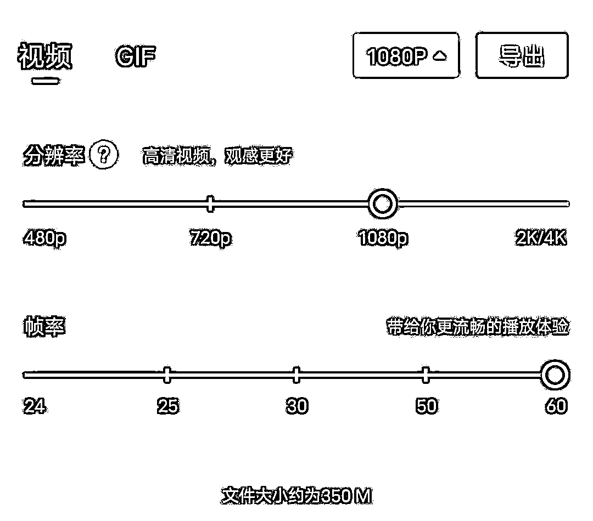

## 6.2 如何视频去重🔥

去重就是不让视频限流，如果你的视频和别人的一样，被判抄袭，就会限流，严重的会封号，对于没有混剪经验的新手来说，去重是个难题。

算法检测你的视频是不是抄袭，最重要的手段就是抽帧对比。

视频是由图片组成的，一张图片为一帧。

当我们上传视频后，系统会抽一定数据的图片，与库存做对比，如果重复度达到多少，就会判断为抄袭。

原理如此，实际更复杂。

因此，去重的关键就是让画面变得和别人不同，让系统检测不出来

下面是一些老师自用的去重方法，大家可以参考。

去重工具：

剪映：https://www.capcut.cn/CR VideoMate: http://www.cr-soft.net/crvideomate.html

crvideomate.rar 使用说明：

对于「短剧 CPS」项目来说，用剪映的常规剪辑手法已经能应对许多去重情况，再加上「CR VideoMate」能基本完全覆盖视频去重需求；下文主要介绍如何使用「剪映」完成去重处理，「CR VideoMate」并不是必备技能，如果想要让自己的去重技巧更进一步，欢迎自己多多探索～

### 6.2.1 去重通用思路 @思蒙

去重，是几乎做所有短视频项目都绕不开的一点。

所以如果大家深度理解了去重，不光能对这个项目有帮助，对以后你做的所有相关项目，都会有很大的帮助。

关于去重，奇杰老师在星球分享过，大家有空最好去看一下，好好理解一遍：

【短视频混剪进阶】单人日产 200 条实战攻略：https://t.zsxq.com/0eHtHeLXs

批量混剪-单人日产 200 条实战教程：https://t.zsxq.com/0eCtPxXXv 另外，在去重实操时，大家可以记住这 2 个要点：

1 是【多不如细】；

2 是【副不如主】；

什么叫【多不如细】？经常有小伙伴问我，我明明做了很多去重元素了，但为什么还是过不了原创呢？

我一般都先会回他一句：

去重，不在多，而在细。

请大家一定记住这句话：

去重，不在多，而在细。

什么意思呢？

先给大家看个图↓

众所周知，这是一张剪映（电脑版）工程图。给大家 5 秒的时间，请大家来回答一下，这样的去重，做的多不多？

好的，我们先不说答案，然后大家再来看下一张图片：

这个看起来不如上一个多，对吧？但是，第 2 个的过审率，一定是远高于第一个的。

为什么呢？

首先，我们能看到，在特效方面，第 2 个加了很多碎特效，而不是一个特效用到底。这个就是“细”——细碎的细。

另外，我们继续看图就明白了：

虽然都是一个贴纸，但是加了很多关键帧。

关键帧是什么作用？就是让贴纸不是单纯的放在那里，它会随着时间移动、或者旋转、缩放……等等。

去重效果，肯定是动态好于静态的。

这个也是细——细节的细。

最后呢，大家也可以看到，第 2 张图片把主轨素材切的很碎。

切碎有两个作用：

一是能增加更多的转场效果，增加去重作用；

二是抽帧，每 20 秒抽一次帧的效果，肯定是好于 60 秒抽一次的。

最后，还有一个点，就是主轨，也要做画面大小的缩放，和左右上下移动，甚至旋转等效果。

这个也是细——颗粒度很细。

那什么叫【副不如主】？

意思就是，相同效率下，给副轨道增加很多贴纸、特效的去重效果，不如给主轨画面做缩放、移动、旋转、抽帧的效果好。

当然，副轨道肯定还是要做的。主副结合，无敌组合，再加 CR-V（一个去重软件），飞龙在天。

总结一下：

去重要做到细，可以是细碎的细、细节的细、颗粒度细的细；

可以从碎特效、关键帧、主轨素材等角度去操作；

当然更重要的是，要多给主轨画面做缩放、移动、旋转、抽针等。

内容来源：6 月 8 日《短剧 CPS 的进阶技巧及常见问题答疑》@思蒙

### 6.2.2 基础方法一：基础去重手法 @清欢

这里分享一些我常用的剪辑去重手法，比较基础，新手也能很快上手并且安全过审。

去重步骤：1）一个剪辑好的 5 分钟左右的视频大概有几十个小片段组合而成，鼠标右键选择复合片段，将视频合成一段，方便剪裁。

2）添加多个滤镜，贴纸和特效，并调整参数，以不影响整体观看为准

3）对画面进行自由剪裁，保留带字幕和人物主题部分

4）选择画面模糊，以填充被剪辑掉的上下部分，并达到再次去重目的

5）调整视频速度，加速 1.1x-1.3x 就可以

内容来源：《短剧 cps，小白也能月入过万的蓝海项目》

### 6.2.3 基础方法二：多用常见剪辑手法 @狼魂小毛 @云珞 YunL

@狼魂小毛 老师和 @云珞 YunL 老师的去重方法，本质上都是相似的，即多用剪辑手法，完成去重。

@云珞 YunL 老师主要使用的剪辑手法共有如下 20 种：

加叠化转场、加游动水印、加贴纸、加滤镜；

加画中画，透明度 1%-30%，选择不影响视频效果的透明度；

加特效，透明度调小不影响观看的 1%-15%；加扫光特效、旋转、加调节、添加音乐、变速、镜像

加字幕、添加解说、加封面、加标题、加文字、加音效、加转场视频、剪裁

视频教程如下，大家可以对照学习：短剧去重 20 个方法.mp4【在线播放】

如果你更习惯阅读图文，也可以查看 @狼魂小毛 老师的教程：处理字幕

我们下载好的原创视频有些有字幕的，我们可以先把字幕去掉（没有的就不用），后续再通过剪映添加上。

或者在剪视频的时候一开始先不去字幕，后续把视频剪完再处理字幕，有的小伙伴是直接加了个白底，重新加字幕上去的，具体如下：

在这里给大家提供一个方便快捷的方法，用【智影】去字幕，在这里说下，这个方式不太稳定，时好时坏，有时会把字幕抹除的不好，会导致视频之前有字幕的地方模糊。也有其他去字幕的方法，比如用蒙版、裁剪、放大法等方法。

【智影】去字幕：https://zenvideo.qq.com/smart/waterMask

把链接复制到浏览器打开，点击本地上传或者右上角登录，登录上去后，点击本地上传：

把之前下载好的视频上传上去，把需要去掉字幕的地方框起来，点击确定，这样就把字幕给去掉了：

最后把去掉字幕的视频下载下来即可。关于字幕也有其他小伙伴用 PR 和剪映混着操作。

修改封面

封面就相当于一个人的门面，封面选的好，相对来说就会更加让人有想点进去的欲望从而提高播放量。

这一步用剪映操作就行，相对基础，不多赘述。

片头片尾

我们剪辑的视频不要跟原视频一样，先掐头去尾，后期再用剪辑软件制作片头片尾，不需要太长，几秒钟就好。

片尾可以从视频库搜谢谢观赏或者下集更精彩的素材添加上去，方法不是唯一的，有其他想法也可以使用上。

最终导出视频保存，导出来的视频可以传到手机上：

变速

视频导入后将视频常规变速，选择变慢 0.9，然后进行第二步操作，抽帧。

抽帧完导出。然后再导入视频，再对视频进行加速，选 1.1，这样视频时长与原视频时长非常接近。

抽帧

视频抽帧就是在一段视频中，通过间隔一定帧抽取若干帧的方式，模拟每隔一段时间拍摄一张照片并接合起来形成视频的过程（即低速摄像）。

具体操作如下：

拖动时间线到你要抽帧的位置，点击分割或者使用快捷键 CTRL+B 进行分割视频，把分割的视频删除即可。

⚠️注意事项：

抽帧的时候，要在没人讲话的时候，或者在视频里的人讲完话及上下句的空白处抽帧，不要在人讲着话的时候去抽，否则会把说的话给抽没了，影响视频的前后连贯性。

在不影响视频的观赏效果的前提下，尽可能的多抽帧，这样去重效果更好。

转场点击转场，里面有很多的转场效果都可以使用。

如果想把某部分视频加上转场，先点分割，再点想要的转场就可以了，右边标注的地方还可以调整时间，按自己想要的时长调整即可：

镜像

镜像作用就是使视频里的画面左右翻转，具体步骤如下：把需要的部分分割后直接添加镜像即可：

镜像前后的视频效果对比：

导入视频和音频以及加上滤镜

可以按照自己喜欢去加，也可以随便去拍段视频，随便放上段音乐，随便加个滤镜都行，然后把强度设置到最小。

目的不是为了单纯去加这些东西，而是为了让平台检测到我们是对视频做了创作的。

素材库好好利用好里面的素材库，里面有很多热门素材也都是咱们平时在别人发的视频看到的，想用什么素材也可以在搜索框搜，加到咱们视频里面会起到事半功倍的效果：

加特效、贴纸

加特效可以改变原始的一些风格，可以增加原视频相搭配的一些特效。在视频不同的地方增加不同的特效，来改变与原视频的相似度。

画中画

也是改变原视频 md5 值的一个关键操作。

增加画中画中导入一张自己拍的图片，拉长布满整个视频时长，布满整个视频画面。

或者导入一个自己拍的纯色视频，可以拍自家的墙壁，或者地板，时长与原视频一样长，同样布满整个视频画面，把不透明度调到最低。

调节视频参数调节亮度、对比度、饱和度、光感、锐化等参数，这些参数微调一点，10 以内即可，调整的数值越大可能会改变原视频的清晰度。

视频混剪找剧里的几个亮点拼成一段视频，剪掉中间啰嗦没有用的部分，然后拼接起来，或者把视频亮点加到视频开始的地方，再或者也可以加个前情回顾等。

实操心得：

只要剪的散一点，然后多加一点转场，就没什么问题，也没有出现不能上热门的。也可以适当加些自己的东西，解说之类的原创专场。

这些是我们常用到的一些剪辑手法，不过说实在的这些手法也并不能做到完全去重，还可以在此基础上，配上一些解说画外音（就是平时大家看到的影视解说的，对剧情做一些解说），以及多集混剪。

内容来源：《短剧自然流打法 1 个月变现 2w 的实战经验分享》

### 6.2.4 基础方法三：通过改变剧情去重 @惟乔

可以通过删减掉一部分台词，甚至将台词进行调换顺序的方式来改变剧情。比如原本是 A、B、C、D 台词，你改成 C、D、A、B，或者增加一段台词 E。

多用插叙。先讲最精彩的部分，然后再通过回忆交代背景。

内容来源：《新手用生财的方法做短剧 CPS，一个月 1.4w+收益》

### 6.2.5 进阶方法：快速混剪+CRV @思蒙 🔥🔥

对于很多人而言，剪辑一条视频就会花费很多的时间和精力，发出去之后也很难有好的效果。于是，我们邀请了短剧 CPS 航海教练 @思蒙，分享 10 分钟就能快速剪辑出视频的方法，给大家做混剪视频提供更多的思路和参考。

希望大家跟着教程，都能学会这个快速混剪的方法，为项目赋能，做出爆款视频涨粉变现。

快速混剪-视频教程：

10 分钟混剪有封面版本.mp4【在线播放】如果想要进一步加快视频产出，还可以借助 CRV 工具，让一条原视频裂变为多条。

CRV 教程如下：CRV 教程.mp4【在线播放】

借助 CRV 后，你想要把原视频裂变为几条，就可以在设置里将「裂变次数」调整为几，产出视频的效率直线上升。

对于大部分同学而言，学到这一步并熟练掌握，就已经足够应对「短剧 CPS」的混剪去重需求。如果你对自己有更高的要求，可以继续阅读下一个章节。

但需要注意的是，技法不是越多越好，熟练掌握你最顺手的那种方法，不断优化放大，多发视频或搭建矩阵，才能放大「短剧 CPS」出爆款的概率。

内容来源：《10 分钟快速混剪》@思蒙

## 6.3 素材批量处理与批量混剪 @牛顿 273

如果你想要提升视频剪辑效率，那么本章节就是可以学习的一个方向。

在 5 月航海期间，@牛顿 273 老师还做过一次高手分享，大家可以搭配该高手分享来理解本章节，进一步提升自己的剪辑能力与效率：5 月 30 日《短剧剪辑进阶：复现爆款与流程优化》@牛顿 273

### 6.3.1 工具合集

以下是在后续操作中可能用到的工具，大家有需要时，自取即可。

链接：https://pan.baidu.com/s/15dtlJU3ZHljFwEshmiMS9g?pwd=rtq1

提取码：rtq1

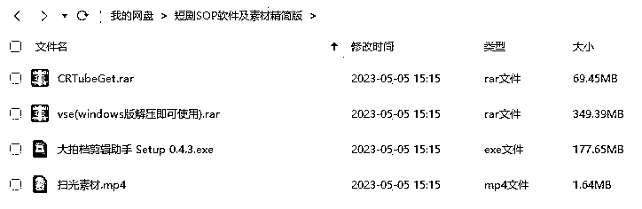

VSE 开源地址：https://github.com/YaoFANGUK/video-subtitle-extractor

VideoSrt 开源地址：https://github.com/wxbool/video-srt-windows

大拍档剪辑助手官方下载地址：http://spdpd.net/

### 6.3.2 前期处理

#### 6.3.2.1 素材片段分割

Step1，将短剧全集导入剪映，复制主轨道中的全部视频（Ctrl+C），粘贴到副轨道（Ctrl+V），并将副轨道中的素材合并为一个片段（选中副轨道所有素材，右键，点击“新建复合片段”）。

1.1.mp4【在线播放】Step2，对副轨道添加蒙版（右上角蒙版-镜面），将蒙版调整到遮挡字幕的位置和粗细，最后对副轨道添加模糊特效（特效-画面特效-基础-模糊），将模糊特效拖动到副轨道，设置模糊度为 20-40（在遮住原字幕和不影响无字幕区域观看体验两个标准下适当调整）。

1.2.mp4【在线播放】

Step3，从头到尾拖动进度条，检查模糊的副轨道蒙版是否遮挡住所有字幕，如果全部遮挡，进入 Step4；否则，将未遮挡住字幕的部分的副轨道分割出来（选中副轨道，将进度条放到未遮挡住字幕的片段开头和结尾各按一次 Ctrl+B（分割操作的快捷键）），调整未遮挡住字幕部分模糊蒙版的上下位置，再进入 Step4。

1.3.mp4【在线播放】Step4，创建文件夹“模糊原字幕”，将视频分段导出到该文件夹（以 30 集一段为例，将进度条放在第 1 集开头，按键盘上的“I”键，再将进度条放到第 30 集结尾处，按键盘上的“O”键，这一步是用 I/O 快捷键将导出时间范围限制在 1-30 集内，最后按右上角“导出”按钮，导出设置中选择 720P，更低的码率，24fps 的帧率来减少剪映及后续软件的处理时间，命名为 01-30）。

对 Step3 中调整过蒙版位置的片段，单独导出即可。

这里有个进阶操作，可以将副轨道先按照 1-30，31-60 的区间分割好（选中副轨道，将时间轴拖到在 30/60 集的结尾处，按 Ctrl+B 做分割操作即可），导出的时候只要选中副轨道 1-30 集对应的片段，按 Shift+X，这样就能将导出范围限制为 1-30 集，然后再按导出键即可。

1.4.mp4【在线播放】

Step5，创建文件夹“提取字幕”，将副轨道隐藏，更改导出目标文件夹为“提取字幕”，再次导出视频，这部分视频后续用于字幕的提取。

1.5.mp4【在线播放】

Step6，打开 VSE（硬字幕提取软件），选择文件夹“提取字幕”中的文件，调整字幕识别区域，点击开始识别字幕。一般建议选择该软件的快速识别模式，速度相对较快（大概 20 分钟就能识别 30 集合集，具体速度和电脑配置挂钩），缺点是可能会漏掉极少量的字幕。

对提取出的字幕存在的漏字幕和极个别错别字问题，可以在 Step7 精修字幕时进行更正，也可以在后续要用到字幕有问题的片段时再进行手动修正。

这一步将内嵌字幕提取为 srt 外挂字幕，也可以使用其他基于 OCR 图像识别的内嵌字幕提取工具，例如付费软件 Videosrt Pro（性价比很高，如果 VSE 软件不能正常运行，可以试着用这个软件代替 VSE 进行这一步的操作，VideoSrt 开源地址 https://github.com/wxbool/video-srt-windows）。

1.6.mp4【在线播放】Step7，创建文件夹“精修字幕后”，将 VSE 提取的字幕和“模糊原字幕”中对应的视频文件导入到剪映。对视频文件进行镜像操作。

将字幕导入轨道中（注意开头要和视频文件开头对应好）调整字幕的风格大小缩放，将字幕移动到被模糊蒙版遮挡的位置。之后点击任意字幕，在右上角的字幕窗口检查是否有过长的字幕，如果有，可以在该字幕最后一两个字之前按下 Enter 回车键即可。

导出精修字幕后的视频和字幕文件（点击右上角导出，导出设置中选择勾选字幕导出）。

1.7.mp4【在线播放】

Step8，打开大拍档剪辑助手（按字幕分割视频的软件）的素材裁剪器功能（APP-素材裁剪器），导入 Step7 中精修字幕后的视频，点击自动分割裁剪，选择按字幕分割，选择 Step7 中生成的字幕文件，选择分割方式一“用于文件名被搜索”，点击分割，再点击右下角“裁剪设置”，都按照默认设置确定即可，导出分割好的视频。

新建文件夹“分割后片段”，将分割好的视频移动到该文件夹中。

1.8.mp4【在线播放】执行完 Step1-Step8，就完成了素材片段分割的工作。

#### 6.3.2.2 去重模板制作

Step1，任意选择一段 4-5 分钟的视频导入剪映（该素材为可替换素材），将该视频复制一份到副轨道 1 上（副轨道 1 也是，之后要替换成需要去重的半成品视频），删去副轨道 1 视频的声音（选中副轨道素材，右键，选择分离音频，再把分离出来的音频删去）；Step2，模糊背景去重：对主轨道的视频添加模糊特效，对副轨道的视频添加矩形蒙版，调整矩形蒙版的大小，露出大部分画面；

Step3，扫光去重：将扫光素材导入副轨道 2，使用裁剪功能把扫光素材剪成 9:16，将混合模式调为滤色（画面-基础-混合模式），播放倍速设为 0.5（右上角“倍速”选项）；

Step4，画中画去重：导入一段无关素材到副轨道 3，删去其声音，将透明度设为 2%（画面-混合-不透明度）；

Step5，贴纸去重：找到剪映左上角的贴纸功能，选 2-3 个贴纸添加到轨道中，时间长度和主轨道视频保持一致 Step6，结尾引导制作：对主轨道以及副轨道 1 做定格操作（选中主轨道/副轨道 1，将进度条放到副轨道 1 的结尾处，点击定格按钮）。接着选择一个箭头贴纸，调整箭头大小方向，使之指向左下角（这个位置在抖音观众视角是跳转付费的链接）。最后添加一段文字“点击观看精彩后续”，使用朗读功能转化为音频（点击文本，剪映右上角有“朗读”功能，选择合适的音色，点击“开始朗读”即可），将转化得到的音频放在定格的画面下方，删除文本（文字引导可能会导致视频被判营销而被限流）

Step7（可选），在剪映左上角音频-音效素材中搜索“咚”的音效，选择合适的音效放在定格画面的起始处。

具体实操流程如视频所示，如果有不理解的步骤，建议对照视频多看几遍：2.去重模板展示.mp4【在线播放】

经过以上步骤，我们就得到了自己的去重模板，后续混剪完一个视频之后，将该半成品视频导入到去重模板中，替换掉 Step1 中主轨道和副轨道的素材，就可以完成对半成品视频的去重工作。

### 6.3.3 批量剪辑流程

通过上述两个步骤获得的素材该如何使用呢？

Step1，在抖音中搜索目标短剧近一天或近七天内点赞最多的混剪作品，使用 CRTubeGet 下载（不下载直接在线观看也可以，我们只需要得到对应片段的几句台词就行）。

4.1.mp4【在线播放】

Step2，在分割好的视频文件夹“分割后片段”中搜索 Step1 中爆款作品的开头，结尾以及若干中间片段的台词，将相关的视频片段导入剪映（一般建议将台词所在的片段前后相邻的片段也一起导入，确保该剧情片段的完整性）。

Step3，对 Step2 中导入到剪映的片段进行裁剪，在剧情逻辑连贯的前提下，尽可能删去其中无用的过场，留下精彩的台词对白。将裁剪好的片段导出为“开头 01”“结尾 01”“中间 01”“中间 02”...这样的片段。

通过爆款视频结尾的一句台词，在“分割后片段”文件夹中定位到对应的视频片段，将目标片段前后的一两个片段也一起导入，再进行抽帧（删去没有对白的无用过场片段）剪辑，形成自己的结尾片段：

4.2、4.3.mp4【在线播放】Step4，将 Step3 导出的视频导入到新的剪映草稿中，将中间的片段打乱顺序，例如从“中间 01”“中间 02”“中间 03”“中间 04”调整为“中间 04”“中间 03”“中间 03”“中间 01”。

Step5，在分割好的视频文件夹“分割后片段”中随机选取 3-4 个视频片段（这里选择时尽量避开爆款视频里出现过的片段），随机插入到 Step4 的剪映草稿中，微调随机片段，使之与前后片段衔接不突兀，最后导出整段视频，也就是我们的半成品视频。

如下演示视频里只演示了插入一个原剧片段，剪辑的也很粗糙，实际操作中可以多插入几个，剪辑更细致些，这一步主要起降重的目的：

4.4、4.5.mp4【在线播放】Step6，将 Step5 导出的半成品视频导入我们之前准备好的去重模板，用半成品视频替换去重模板中主轨道和副轨道 1 的素材（操作是将剪映左上角媒体库中的半成品视频拖动到要替换的素材上，记得将勾选复用原视频效果）。

因为替换素材只能用长素材替换短素材，所以可能要先将主轨道和副轨道 1 中的视频缩短一些，替换完成后再调整半成品视频的时间长度（替换素材会使导入的半成品片段时长和原来缩短后的的素材片段相等）。

Step7，对主轨道和副轨道 1 的最后一帧进行定格操作（选中主轨道/副轨道 1，将进度条放到主轨道/副轨道 1 的结尾处，点击定格按钮），调整其他轨道（音频，视频，贴纸）的时间轴，最后导出视频，就是我们的混剪去重完的成品视频。

4.6、4.7.mp4【在线播放】

内容来源：《短剧 CPS 实操心得——素材批量处理 SOP 及批量混剪思路》

## 6.4 注意事项 @正帆

### 6.4.1 字幕对不上的解决方法

字幕对不上怎么办？

解决方案：将素材拼接好的完整视频，按照时间点逐个导出，比如素材总时长为 1h，那么我会 20min 为第一段导出，分为 3 个段分别导出，并做好分类。

这样分段导出的如果还是有字幕对不上问题，那就再减少时长导出片段，比如 15min 为一段。这样就解决了字幕对不上的问题。

### 6.4.2 剪辑时有哪些小技巧

技巧一：做好封面

封面是相当于门面，用户在点击进入你的主页之后，封面漂亮，而且一眼就可以看到剪的是什么剧，那么就会特别吸引粉丝关注。

封面的寻找主要就是：

麻雀平台直接下载提供的素材（有能力的可以再用 PS 修一下），使得画面更为有美感，点进我的主页，就可以清晰的看到剧集的名称（注意：封面不要打序号） 。比如给封面加上统一的外边框。

外边框模板（可直接把封面拉入其中）

三连封面，单连封面.zip 技巧二：调整好清晰度（依据平台下载的清晰度为主）

视频的观感也是吸引和留住用户观看的一个重要的点。

这里的清晰度，按照麻雀上面下载的封面清晰度就可以，不用过多修改，当然 PS 修一下也是可以的（我是直接使用的没修改），按照自己的喜好，将主页里面的封面都设置成一样的亮度、清晰度就可以了。

导出视频的清晰度（仅供参考，这是自用的）：

分辨率：1080p

码率：更低帧率：30 帧

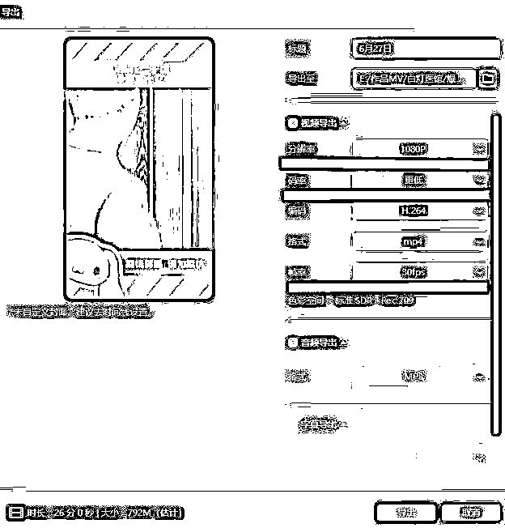

技巧三：视频结尾的引导需要重点关注在剧情上，我们提过需要注意结尾的引导，所以在剪辑时，结尾贴纸、音效、语音引导等都不可少，我们可以通过这种方式抓住大家的注意力。

片尾制作视频如下，大家可以参考：AirPortal 空投快传 _338942886.mp4【在线播放】

内容来源：《新人 0-1 跑通短剧 CPS 并盈利 1k+》@正帆 _

# 第七步：发布视频并维护评论区

## 7.1 发布视频

完成视频剪辑后，我们就可以在抖音、快手、视频号等地发送我们的视频了。

流程非常简单，我们打开麻雀 Matrix 和创作猫这两个 APP 就能操作。只要发布视频时，我们能看到发布页有对应小程序就是成功，例如：

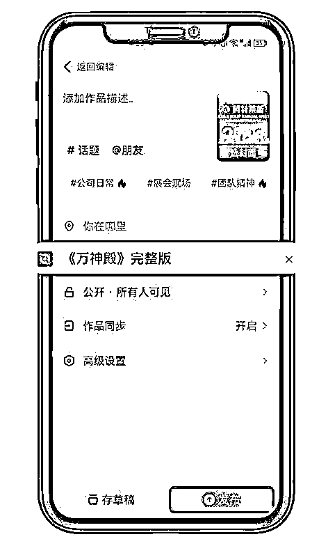

具体做法我们再来复习一遍。

### 7.1.1 麻雀 Matrix 如何实现短剧推广 @思蒙🔥

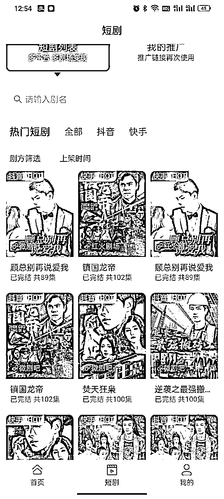

信息默认填写的即可：

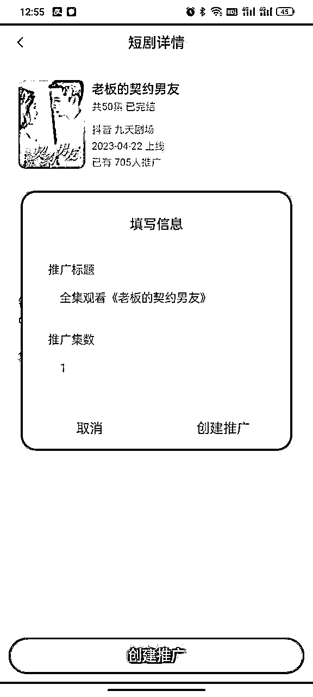

然后点「创建推广」按钮，就会让你选择相册的视频（第一次选择需要授权读取相册权限），选择好视频后，会自动跳转到抖音/快手。

然后我们选择手机相册里已经制作好的视频，上传到抖音，填写相关#标题、话题等，点击发布即可。标题、话题的写法可以参考爆款账号。

另外，在近期「抖音」平台政策调整之后，我们挂载小程序，可能会出现掉链接或者看不到链接的情况，原因是我们的账号不足千粉，不支持抖音小程序的挂载。

解决办法：

我们可以先选择【九天剧场】口令挂载的方式（其他剧场暂不支持），点【立即推广】，然后先【复制口令】，再点击【立即

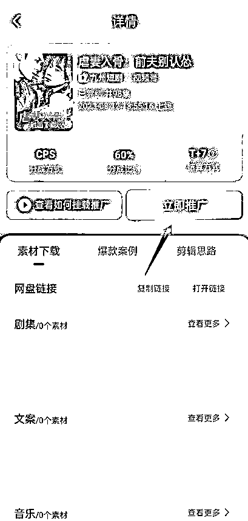

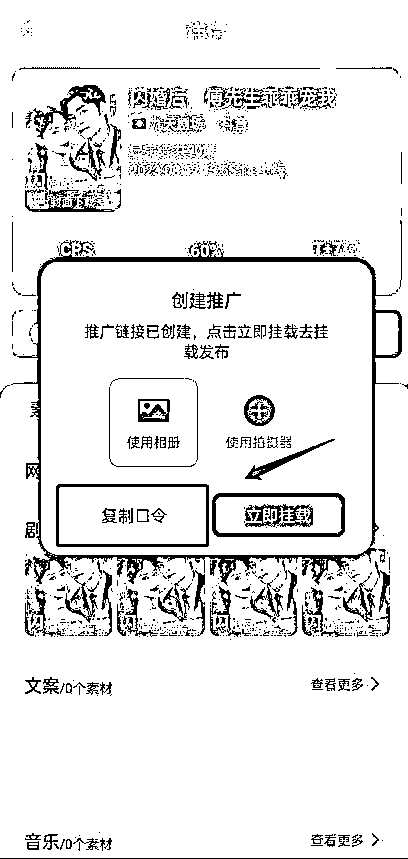

发布视频时，把口令粘贴到标题里，等待发布完成，同时也粘贴到评论区并置顶。

等待我们发布一些数量的视频，有作品小爆之后，迅速涨到千粉，就可以直接用挂载小程序的方式，也不会掉链接了。

注意，其他平台无千粉限制，可以正常挂载。

具体的挂载方式法，可观看下列视频。其中的第 3 种，经后期再次测试，也存在掉链接的情况，如果掉链接，我们可复制对应短剧口令置顶到评论区即可，先以涨粉为主。

8 月 10 日麻雀 app 挂载方式.mp4【在线播放】

### 7.1.2 创作猫 APP 如何实现短剧推广🔥

创作猫官方教程如下：

创作猫短剧推广教程.mp4【在线播放】

此教程为 7 月以前的官方教程，最新版和麻雀挂载方式大同小异，大家可在官方 APP 里找到。

### 7.1.3 注意事项 @云珞 YunL @思蒙 @张柯 Ker @猫柠

发布视频时有一些隐性小技巧，虽然根据账号情况不同会略有差异，但是大家可以做个参考：

一部剧可以更新十几个视频（视频需要去重），但每个成品视频内容不要上下关联，不然用户会期待你更新下一集，不会充值看；同一个原视频，即视频本身未经过修改或去重等操作的话，不能在抖音重复发，会被查重（当然，也有重复发但没收到违规的，甚至流量也不错，但这跟账号本身也有关系，是否要冒险发一样的视频你可以自己判断）；

在同一个抖音账号上，相同/相似剧情等可以重复发，但需要做去重，且不要超过三次。这种情况最容易出现的情况是，你爆了一个视频，那么将同样的剧情/视频去重处理后再发布，第二遍大概率还会再爆；

快手视频如果隐藏了，不要发第二次，容易违规。

目前短剧 CPS 最值得深耕的平台仍然是抖音，快手较难过去重。

视频号的特殊之处在于，新号时期会给很多流量，有时不经意就会爆一条视频，但 7 天后流量就会回落，所以一定要抓住新号红利期。

所以对于在发布视频时，我们仍然以抖音平台为主，快手和视频号同步即可，其中视频号注重新号红利期，如果废号了及时更换。

当某部短剧精心剪辑出来，流量却差强人意的时候，不要太灰心，换一个发布平台，有时候却有很高的播放量。

短剧发布两三个却仍没有出单，可以再多剪 2 个，以数量博概率，如果流量依然没起色，再放弃，有时候爆款就查那么一两个视频。

内容来源：《我用生财教我的方法做短剧》、《如何使用 ChatGPT 辅助产出短剧解说类视频》@+1

## 7.2 评论区维护 @某人周

短剧 CPS 项目跟小说推文项目在评论区维护上还是有一定区别，小说推文需要在评论区做引导引流，短剧 CPS 项目则不需要。

但为了视频能获得更高流量，从而获得更高的视频转化，建议大家在评论区积极引导回复，也可以学习一些热评发在评论区，引起讨论。这个动作依旧可以学习小说推文评论区的玩法，万变不离其宗。

以下内容均为小说推文的评论区维护玩法，大家可以参考学习。

### 7.2.1 方法一：回复评论，增加互动

好数据需要良好的评论区互动支持，及时点赞、回复观众评论，让观众感受到博主的关心和支持；讨论剧情的说两句，吐槽文章角色的表个态，只发表情的咱也回个表情。

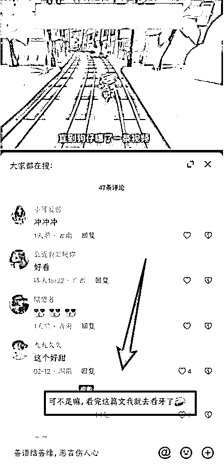

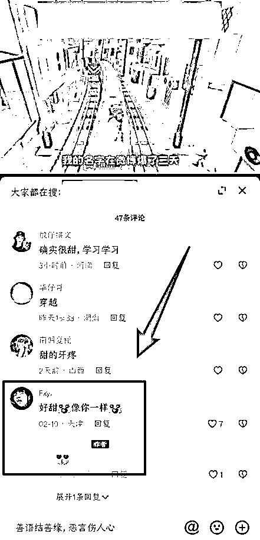

### 7.2.2 方法二：主动发起话题，挑起热度

在评论区提出一些有趣的话题，可以是文章相关或者无关的，鼓励观众发表自己的意见看法，带动观众的情绪，增加评论区活跃度。

比如吐槽文中某个角色“真下头，就该 xxx，早该 xxx” 或者抛出一些离谱的事情吸引观众，如 “邻居家老婆快生了，我姓王，能帮起个名吗” 等，甚至可以适当拱火增加热度。

### 7.2.3 方法三：清理评论区

清理掉不合适的评论，包括辱骂、广告等违规评论，以免不必要的违规限流。尤其是那些和视频内容无关的引战吵架，互骂几十条评论的情况都有，直接给它删除，酌情拉黑。

还有部分推文博主会开小号来截流，在“在哪看” “叫什么” 等评论下回复他们的关键词，先删除他们的评论，然后在消息通知中点开他主页并拉黑，最后在原评论下引导自己的关键词。

比如下图这种情况就是需要删除的：

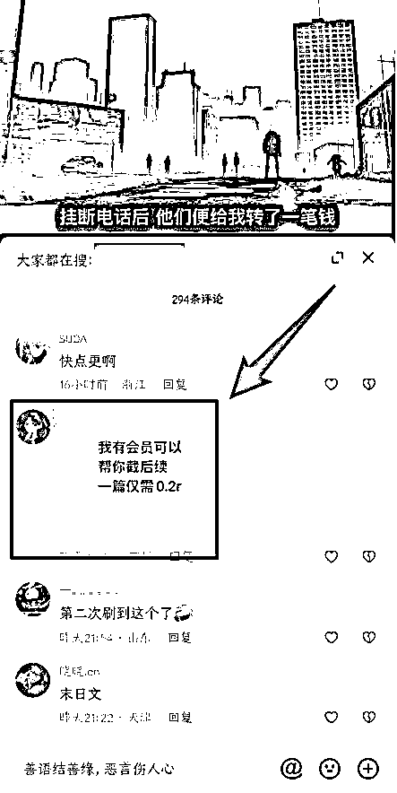

### 7.2.4 方法四：看视频、造互动

开大号小号先把自己发布的视频看完，点赞和收藏安排上。用小号在评论区适当留言，如“尊贵的会员先走一步” “看完回来了，是很好看的 xx 文”等，为后续可能的互动埋下伏笔。

甚至可以稍微剧透一下，给点进评论区的观众留下悬念吸引观看，比如“结局很好” “这渣男的下场很爽” 等，适当性挑动一下观众对后续剧情的好奇心。

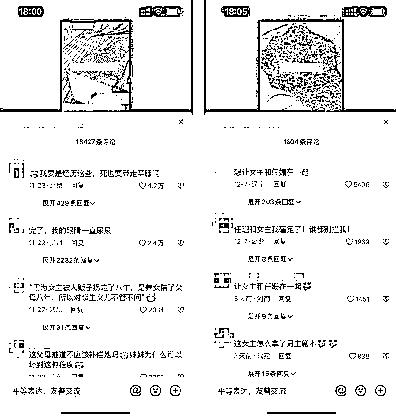

内容来源：《小说推文进阶玩法，精细化运营所带来的稳定出单》

# 第八步：结算收益

并不是播放量越高，收益就越高，但这两个是成正相关的，具体转化还要看实际情况。

会存在别人 10w 播放，不如你 5w 播放转化的多这种情况。也有可能你 1 万播放没出单，别人 4 千就出单的，别太在意，持续输出作品就好，好运自然会来。

这里跟大家说明一下，如何在「麻雀 Matrix」和「创作猫」查看自己的收益并结算。

## 8.1 麻雀 Matrix 收益与结算 @思蒙

### 8.1.1 如何查看收益

❗️注意：发视频在麻雀 APP 里发，收益在 APP 和小程序都可以看到。小程序可以看到更详细的数据。

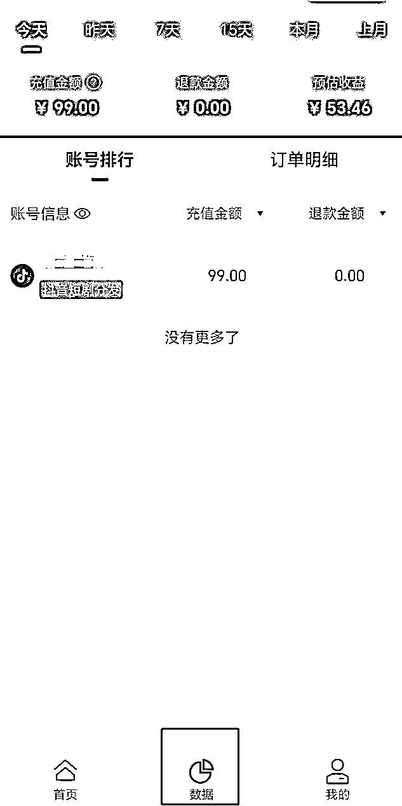

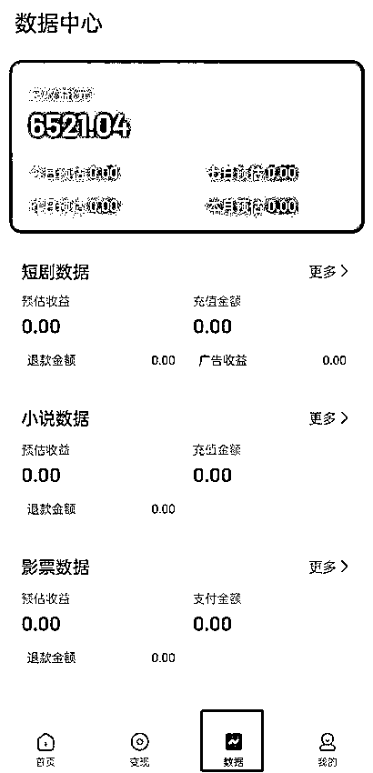

这里的数据分别有，今天、昨天、7 天、本月和上月等。

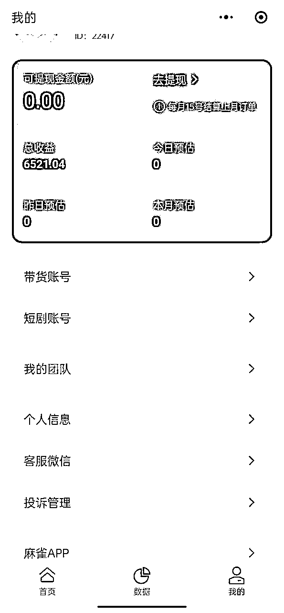

### 8.1.2 分佣和结算

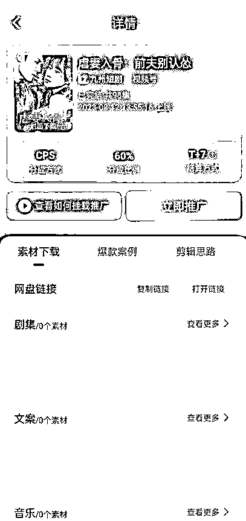

也可以在首页的「抖音小程序推广计划」，看到每个平台的对应佣金。

需要提示的是，8 月 8 号抖音更新新规以后，原先所有佣金都由麻雀打款，现在变为走「抖音小程序推广」，其中一部分金额会在抖音小程序里结算，其余部分还在麻雀里提现，但总佣金比例不变。

新人建议先做九天剧场/世纪剧场，或者微剧吧/红火剧场的剧，这两家相对容易出爆款，转化也能相对高一些。

### 8.1.3 关于提现

在麻雀小程序/APP【我的】页面，点击【去提现】，然后【去绑定】个人银行卡，按照需要填写的信息，完成绑定：

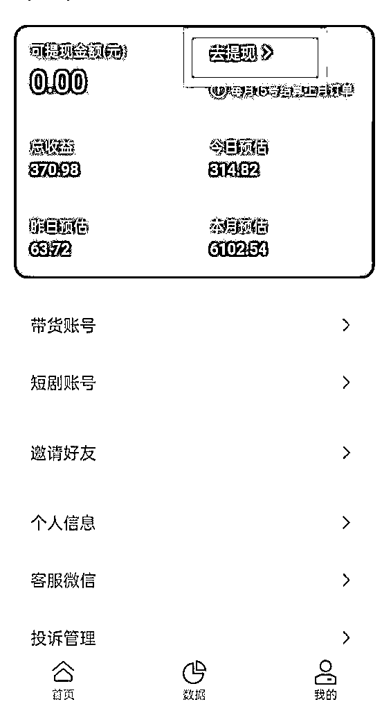

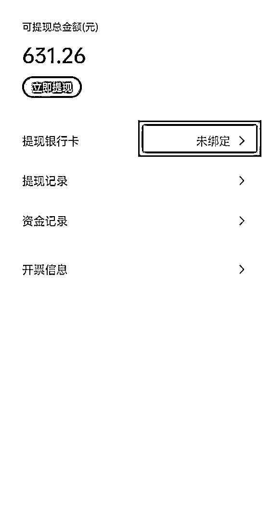

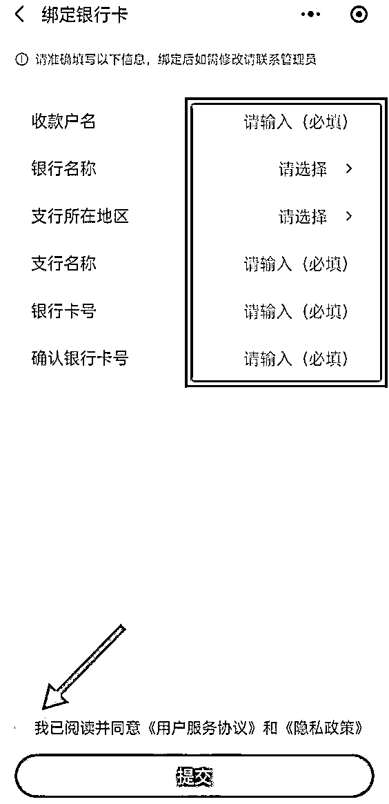

点进去绑定银行卡，即可提现。没有结算前不用绑定，等收益到账，可提现时再绑定。提现扣税 2%。

绑定银行卡以后，点击【立即提现】，我们会看到下方有个【去签约】，咱们点击输入自己身份证号，并勾选协议，然后【确定】即可，这时页面显示【已签约】，咱们直接【立即提现】即可。

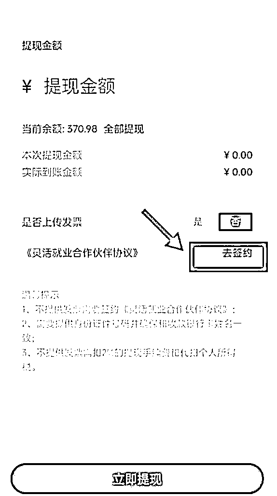

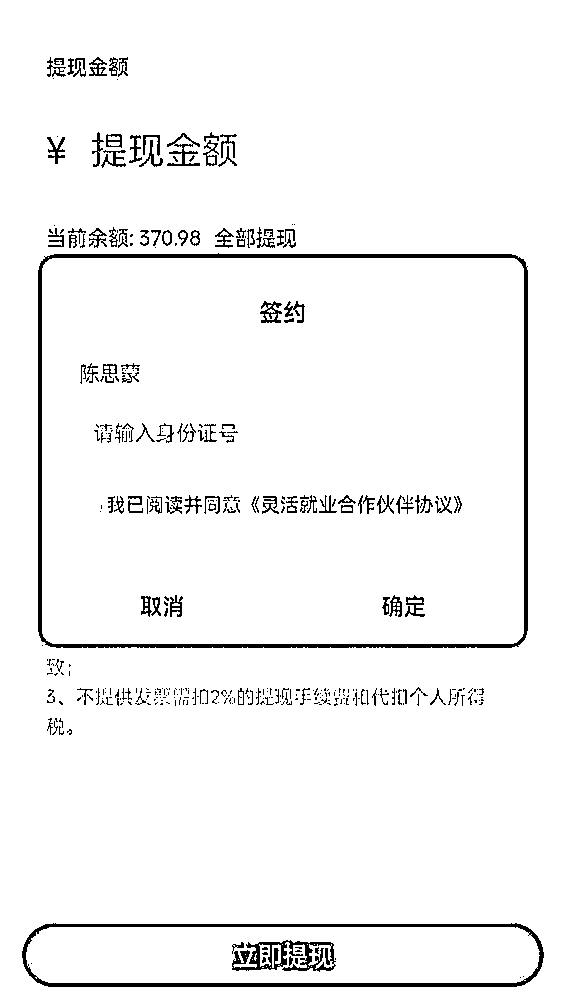

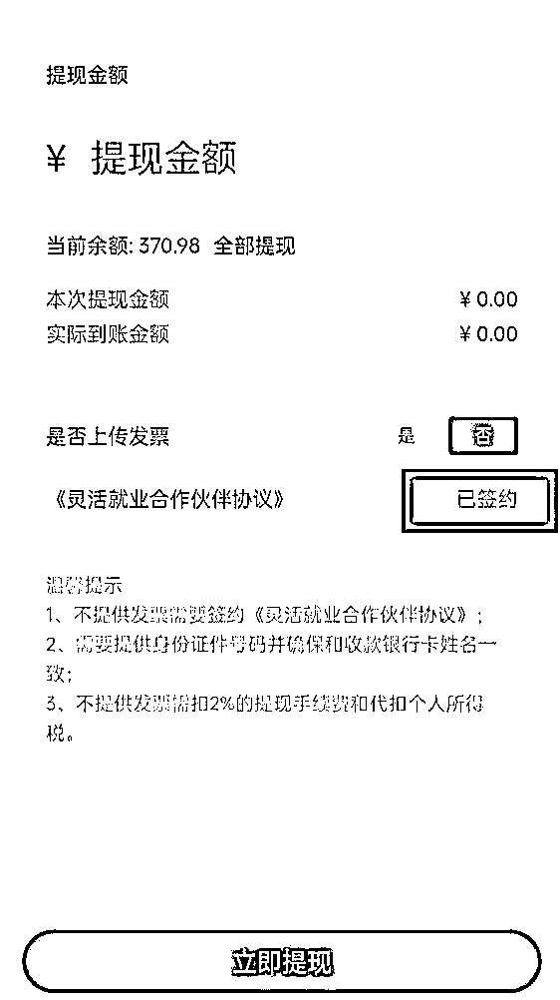

提现款一般 1-3 个工作日到账。

内容来源：《目前为止最详细的【短剧推广实操手册】，没有之一！》

## 8.2 创作猫收益与结算

进入创作猫 APP，点击变现-影视漫画，进入后点击页面底部的「数据」和「我的」，就能看到自己的推广数据与收益：

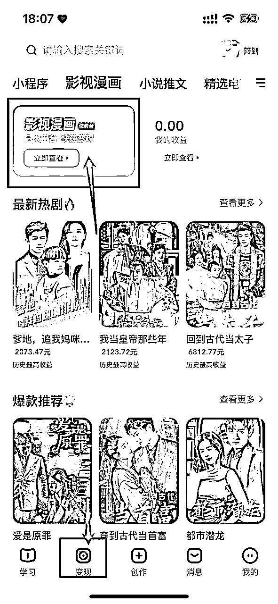

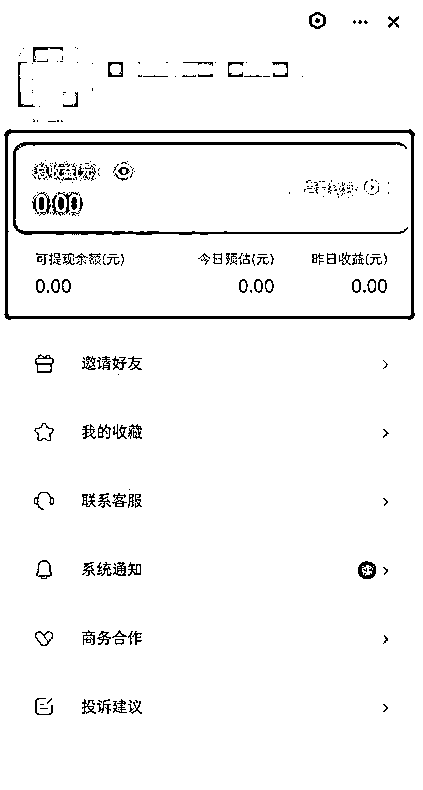

支持绑定银行卡或者支付宝进行提现，结算周期：CPS：T+7

CPS 即按销售金额结算，比如有多少用户通过你的作品或链接进行充值，你就可以从中获取分佣

T+7，即收益发生后，再过 7 天（一般指工作日），收益可以被结算并提现 CPM：T+30

CPM 即按千次展示结算，一次展示表示被一个用户完整浏览 T+30，即收益发生后，再过 30 天（一般指工作日），收益可以被结算并提现

提现可以绑定银行卡或者支付宝进行提现。

# 第九步：矩阵思维，放大项目结果🔥🔥

## 9.1 为什么要做矩阵 @思蒙

对于「短剧 CPS」这类门槛比较低的项目来说，本质上都是用数量博概率的游戏。

在前期，相对于质量，数量才是更重要的。

所以我们能多发作品就多发作品，能多起账号就多起账号。

在航海的过程中，大家会发现，有小伙伴的作品，也许和你的差不多，根本说不上多么优秀，但他就是爆了。这就是概率的问题。

在掌握了基础的选剧和剪辑技巧后，剩下的就是靠【量】了。

发一条视频，能爆的概率是 1%，那发 10 条，或者有 10 个账号呢？

每一个都是 1%，加起来是不是能爆的概率就大多了？

而且在这个过程中你会发现，有的号一开始流量就好，有的号却一直奄奄一息的样子（当然前提是质量都过关，作品水平一致）。

这就是账号体质和概率的综合。

我们在矩阵中，可以筛选出一些素质好一点的号继续培养，差的就可以注销另换了。

内容来源：6 月 8 日《短剧 CPS 的进阶技巧及常见问题答疑》@思蒙

## 9.2 AB 账号测试法搭建矩阵 @神仙姐姐

这种方法主要是告诉大家，如何快速测出哪个账号适合哪部剧，达到快速出单。

第一步：AB 账号测试

找出异常值：一条视频发 3 套（3 个抖音 +3 个快手 +3 个视频号）

有些账号，适合扮猪吃老虎类型的，有些账号适合苦情剧（虐剧），有些账号适合甜宠剧，但是我们刚开始并不知道哪些账号适合什么剧。

明明大家都是借鉴同行，为什么有的伙伴已经出单了，有的伙伴还卡在 500 播放，这就是因为我们没找到适合这个账号的剧。

我们一个账号测剧和 3 个账号测剧有区别吗？没啥区别，一起测呗～把自己辛辛苦苦剪了 1-3 小时的视频，套上 3 套模板分别发 3 套就可以啦。

一个剧发 4-6 条视频，如果这些视频在所有账号中都没有异常值，那么就换剧～异常值：平时播放都在 500 左右，有一个视频比较突出，有 1000+2000+的播放

这样测几个剧下来，都能测出一两个账号来。

我之前有一个账，一开始发战神的，500 左右播放，pass 掉，之后发了甜宠的，有过异常值，但是因为我没及时跟上的原因又或者有其他原因，反正就是起不来，pass 掉。

接着又换了特异功能的剧，还是没能起来，播放都在 500 左右，pass 掉。最后怎么着，这个账号居然是适合发古惑仔类型的。

第二步：复制异常值

方法一：同个剧情不断去重、不断发（俗称炒冷饭），毕竟会出现异常值，肯定是有爆点的，那抖音快手用户那么多，每次推荐的人又不一样，肯定是可以继续发的。

方法二：同个剧，不同的剧情继续发。

「方法一」适合账号起流量后快速发第二第三个视频用，后续的流量是否能有更大的突破，还是得有新的剧情；

如果有新剧情，就用「方法二」发 4-6 个视频。

ok，没有测出异常值的账号咋办呢？

继续测，一个剧，测 4-6 个视频，3 个剧没效果就换类型（例如男频换女频，虐剧换甜宠剧，战神剧换逆袭剧），不断的换，直到测出合适的剧为止。

男频优先战神类，女频优先虐剧（这种类型就是我虽然知道接下来就是打脸情节，但是我还是想把打脸看完，就比较符合当下看短剧的人的心境）。

如果目标是做 2 个账号，那我建议你准备 4 个账号去测剧，这样可以快速测出 2 个合格的账号。这样的做法就好比赛马，我们从 4 匹马中选出两匹好马继续前行~内容来源：《短剧 AB 账号测试法，快速出单技巧分享》@神仙姐姐

第十步：数据复盘与优化迭代这部分，建议先去做 20 个作品出来以后再看。

视频数据和账号动态，是我们复盘优化后续作品的关键参考因素。

这部分，建议先去做 20 个作品出来以后再看。视频数据和账号动态，是我们复盘优化后续作品的关键参考因素。

这部分，建议先去做 20 个作品出来以后再看。视频数据和账号动态，是我们复盘优化后续作品的关键参考因素。

然后系统会提示，我们大约在次日 10 点，就能看到自己已发布作品的数据分析了。次日我们点开自己已经发布的视频，左下角会出现【数据分析】字样，点进去就能看到本作品的详细数据：

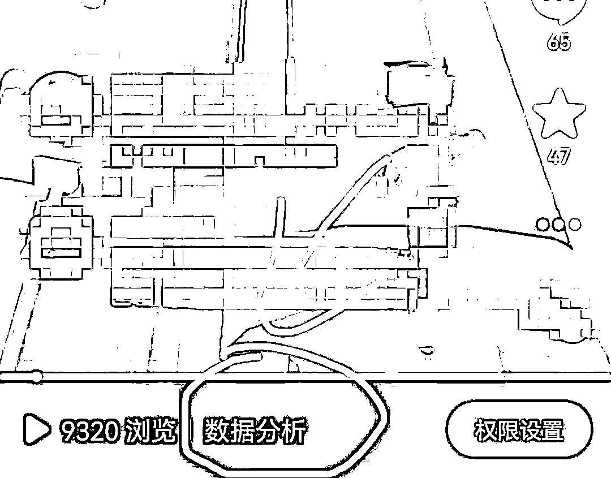

其中需要着重关注的数据为 5s 完播率和完播率，一般情况下，这两个数据基本基本能判断作品的质量，以及大爆的可能性。

这里简单粗暴的总结一下——

5s 不好：

就是开头不够有吸引力，下次尽量选有吸引力的开头；

完播不好：剧中冲突不够，或者剧情跳转的过分厉害，下次注意就行。

一个数据，看一眼，判断一下，不要超过 30s 就行了。

但是，如果你看完数据之后，下个作品还是不知道怎么办，那不如把这些时间，放到尽快出下一个作品上。

不是说不要在意参数，而是，“不要把注意力，过分停留在参数上”。

数据（5s 播放、整体完播、2s 退出……）是给我们参考的，给我们之后的创作提供帮助的，如果研究半天还没有结果，那就索性不看。

如果你爆过单，一定会发现：有的爆单作品，参数明明不如另一个好，为什么它的播放量比那个没出单的作品高？

或者反过来：我这条的参数明明比小明的那条好，为什么小明爆单了，我只有几千播放？

因为你没有理解平台的目的，甚至都忘了自己的目的。

举个例子：

你是老板，让小红和小明分别开了两家水果店。

小红的店装修豪华，灯光明亮，陈列漂亮，吸引了很多顾客进去看，在店里平均停留时间至少 10 分钟以上，每天营业额，2000 块；

小明开的店，比较常规，普通装修，不算差，但绝对比不上小红，顾客进去不怎么留意装修，进去转两眼就买完走人了。平均停留 3 分钟，日营业额，8000 块。

如果你是老板，你会把后续更多的资源，推给小红，还是小明？

这个例子就是想说明，单纯的参数好，不能说明什么，我们的目的是转化，是挣钱。

所以，答案不言自明。你能以最高效率转化客户，你就是最牛的。

我们看有的作品，虽然 5s 播放、整体完播这些参数不好，但播放高，因为用户点进去没看几秒就直接点左下角进去了；而有的参数好的，顾客把视频都看完了，还没点左下角链接。

当然，提高装修档次（5s 播放），拉长顾客停留时间（完播率），肯定是有用的，但它们的目的，都是为了【转化】。

不要本末倒置。

另外，粉丝量也一样，粉丝有用，但用处不大，尤其在新号阶段。

我们的目的是转化，转化一般是靠高播放带来的。一条播放高点的视频，比如大几万的，粉丝观看的数据能占多少？

也许连 1%都不到，几乎可以忽略，而且这些关注你的粉丝，一般是什么动机？——为了看你更后续，这样，他就不用去左下角付费看了。

关注=粉丝对你的期望所以我们的重心，应该放在更大的公域流量，放在持续出好作品上，让更多人看见我们的作品。而不是几个粉丝的增长上。

内容来源：《目前为止最详细的【短剧推广实操手册】，没有之一！》、6 月 8 日《短剧 CPS 的进阶技巧及常见问题答疑》@思蒙

## 9.2 调整创作方向 @思蒙

在创作了一定数量的视频以后，我们对剪辑软件的掌握就更加熟练了，也积累的大量的素材和创作方法，这时候就可以适当的增加作品细节，根据个人情况调整自己的作品风格了。

还是去多学习同行和各平台的爆款分享，看那些类型转化是比较好的。其中包括，他们开头用的什么剧情？对你有没有吸引力，是否能引起好奇？中间使用了什么剧情？结尾怎么引导转化的？以及视频中间有没有用其他素材？

同时，也可以多学习本手册「五、重组素材剧情，提升爆款概率」「六、剪辑视频」中的内容，提升自己的创作能力与剪辑能力。

内容来源：《目前为止最详细的【短剧推广实操手册】，没有之一！》

## 9.3 使用 ChatGPT 辅助产出短剧解说类视频 @+1

虽然本期航海中，我们并不推荐大家用解说的方式来做「短剧 CPS」，这种玩法投入时间长，门槛高，且短期很难有比较好的效果，容易劝退。

但如果你已经熟练掌握「短剧 CPS」的玩法，并且想尝试突破，可以试试做短剧解说类视频。

当然，我们不瞎做，可以适当结合工具开展项目，比如借助 ChatGPT。

2 月份的 AI 绘画与 ChatGPT 航海中，黄小刀教练有视频分享过如何训练属于自己的 ChatGPT，大家有时间的话可以查看那期的回放：https://i.shengcaiyoushu.com/t/BOA7hbp3，干货非常多。

寻找素材、发布视频等步骤，与常规「短剧 CPS」玩法一样，下文就不再重复提。

### 9.3.1 使用 ChatGPT 辅助

第一步：训练自己的 ChatGPT 首先要明确 ChatGPT 是一个影视解说的博主：

第二步：投喂数据大家都知道视频开头的黄金三秒非常重要，直接关系到媒体后台的算法是否推流，所以视频开头的投喂数据，我列举一些，大家有更好的可以增加：

（1）是什么样的一个人，被豆瓣网友称之为史上最牛 P 的老太太，都 70 岁了还要去贩毒……

（2）他是我见过屌丝逆袭最成功的一个男人，三天时间成为亿万富翁，然而好景不长…

（3）他是史上最 NB/惨/猖狂/冤枉……的囚犯/抢劫犯/……

（4）这是一部让所有人看得荷尔蒙飙升的爽片……

（5）看，这个女人竟然用刀划破自己的手腕，是什么事让她如此绝望呢？原来，在一天前，她和丈夫大壮因为……

（6）你绝对想不到……/你敢相信吗？/万万没想到…..

（7）他叫……你以为他是……的吗？不。他是来……然后开始叙述

（8）如果你男朋友出轨了，他不爱你了，还对你家暴，怎么办？接下来这部电影就会教你如何让老公服服帖帖的呆在你身边！

女主是一个……开始叙述了。

修饰人名（给他们起外号）：钢蛋、翠花、阿 XX，小哥、大哥、大壮、小美、小凤、二狗等等，以一些市场泛滥/热词注入视频内容的人物描写，方便粉丝和用户快速记住每个人物。

调皮调侃：

谁被打死了————就说谁领了盒饭谁被打死了/失去了自由————可惜他再也刷不到我的视频了

### 9.3.2 配音工具配音

配音工具在选择上，入门级用剪映就足够，付费的我习惯用微信小程序「配音 pro」，一次付费终身使用：

抖音上一些专业的影视解说账号，一般都会用「魔音工坊」进行配音：https://www.moyin.com/

这个配音是不是很耳熟，都是用它进行配音的：魔音工坊配音.mp4【在线播放】

优点是人物声音多，无机械感，有感情，缺点是，有点贵，就算单独购买某个配音也要搭配 VIP 才能使用：

### 9.3.3 剪辑

1）将从巨量创意或者有米云下载下来的解说视频，在剪映里面识别字幕，导出 txt 文档：

接下来我们开始正式实操改文案。

以《你是天堂，也是地狱》导出的文案为例：

顾念偷偷参加完成他的婚礼后顾念选择结束生命

她和他是青梅竹马两小无猜

而自己只是他在深夜寂寞时的一剂良药

当顾南易深夜回到公馆

看到浴缸里的顾念他彻底惊慌了 2）把文档粘贴到 ChatGPT 里面，进行二创改编，对 GPT 进行提问和角色定位：

如果对回答不满意，可以点击下面的按钮，重新生成回答：

可以看到 GPT 回答了很多，我们要提炼里面有用的文案，一些不通顺的句子，我们手动修正，

3）接下来将文案导入配音软件，输出音频：

加上 BGM，氛围感是不是就来了～

5）导出前别忘添加视频封面，用麻雀 APP 里面剧集的封面即可，一条视频就制作完成了：

7 月 2 日 (1)(4).mp4【在线播放】内容来源：《如何使用 ChatGPT 辅助产出短剧解说类视频》@+1

## 9.4 关于违规 @思蒙 @惟乔

在平台混，最重要的就是清楚平台的规则，千万不要和平台做抗衡，除非收益远大于成本。

抖音大平台的规则，咱们在【抖音安全中心】都能看到，基本要点就是，不能违反国家政策、法律法规；不涉黄涉暴涉毒、要有正向价值观等。

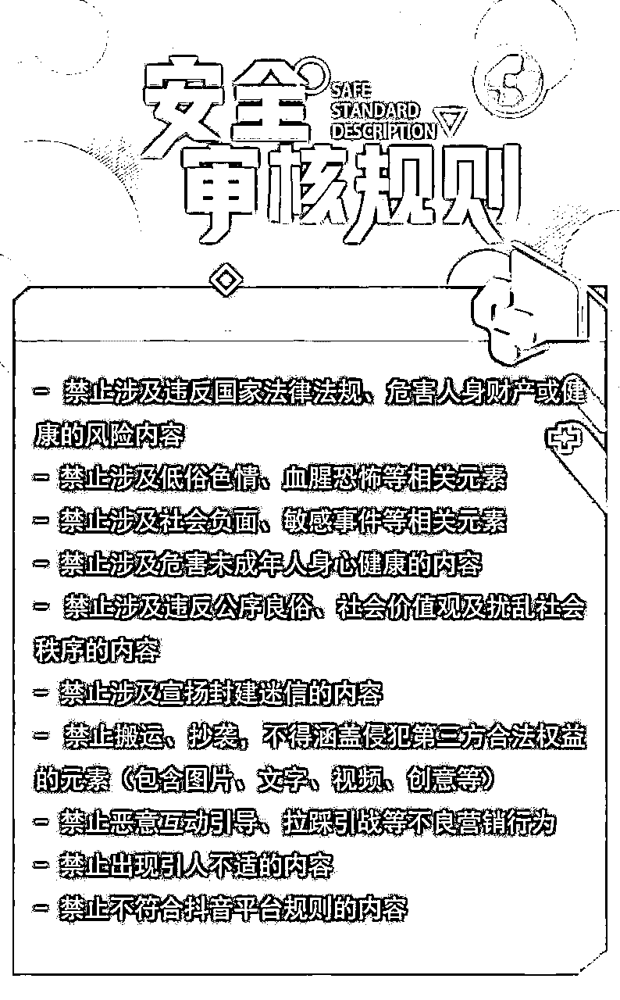

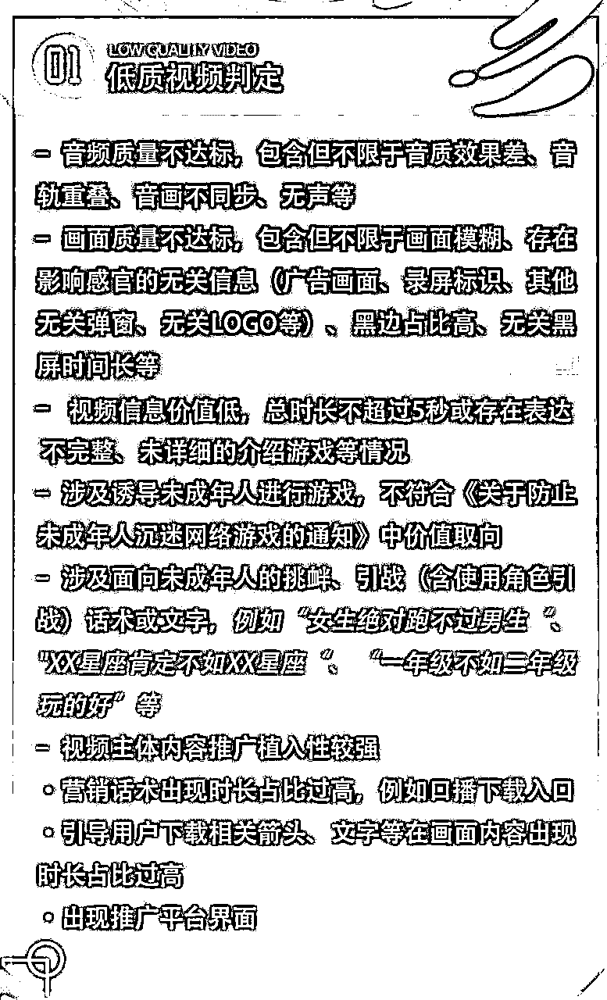

所以一切可能违规的素材最好别用，不冒险，就不危险。

这其中，最危险的素材有以下几种：

穿得少，漏得多侮辱人格：例如「狗东西、呆子、贱人」等

暴力：打架，侮辱别人，复仇，这种不要太多。

特别是又是脏话、又是威胁，然后再打架，这种特别容易违规。

如果非得剪上述内容，可以采用解说的方式

关于违规，还经常会存在的一个问题就是，可能使用了同样的素材，你发就违规了，别人就没有。

这是因为每个账号体质不同，还有不同审核员的审核尺度不同，所以别太在意和纠结，删除修改重发就行了。

要始终在心里算清一件事，你的时间花在哪里更值钱？纠结抱怨等申诉的时间，能不能多出一个作品？

一定记住，你的时间是最值钱的。

内容来源：《目前为止最详细的【短剧推广实操手册】，没有之一！》《新手用生财的方法做短剧 CPS，一个月 1.4w+收益》

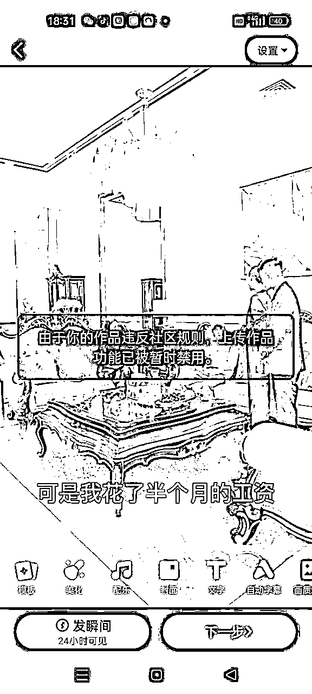

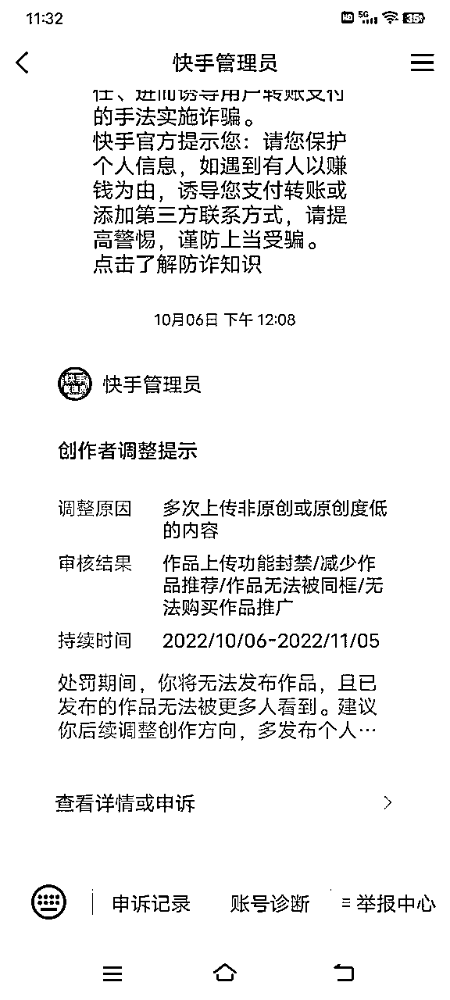

如何解决呢？

第一步：开具短剧作品授权的证明上传平台，进行申诉（电子版即可）。

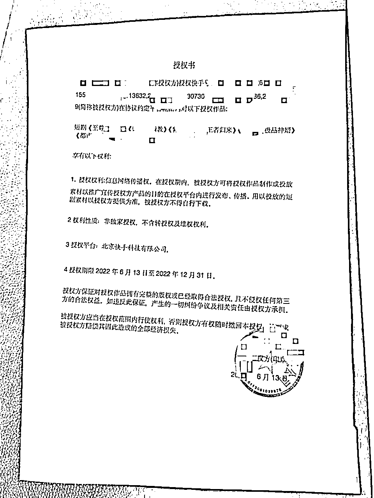

申述文案：与该影视剧拍摄公司达成推广合作协议，已同意授权推广。

如果不知道怎么操作该步骤，可以在航海大群中求助。

第二步：提升优化作品原创的技能，避免重复犯错。

内容来源：《短剧自然流打法 1 个月变现 2w 的实战经验分享》

## 9.6 保持心态，持续行动 @思蒙🔥

很多小伙伴看到别人都有爆单的，再看看自己发了 10 来条作品了，疑惑自己的视频怎么还不爆？

首先，你要看到的爆单的小伙伴，可能在航海之前，自己都已经开始实战，熟悉了一段时间了。

另外，有一些小伙伴，很可能是之前就有剪辑基础，相对新人，已经有能快速做出视频的能力了。

看看他们，平均已经发了多少个视频了。

自己发了多少个？

排除技术和能力差异之后，我们需要做的，只是尽量的多出作品，快速迭代自己出作品的效率，闭眼干就完了。

我在做第一个线上项目的时候，

前 3 个月，没有赚到钱，

第 4 个月，赚到了 1 千多块。

第 5，6 个月，又遇到转型危机。

直到 7，8 个月以后，才开始平均每月赚到 1，2 万以上。

所以，航海不是结束，而是新的开始。

做线上项目不是和上班一样，只要做，每个月都有工资拿。而是这个月没有，下个月 5000，下下个月可能几百，再之后又过万。

所以心态要稳定。

虽然我从没把做项目当成创业来看，但是我们确实需要创业的心态。

做得好，不一定有好结果；但是不做，肯定没有结果。

用永澄老师直播的话来说，“不是得到，就是学到，最大的失败是不参与。”

只要我们坚持在做，好结果，一定就在靠近自己的路上。

最后希望大家，都能坚持做下去，航海不是结束，而是新的开始。

哪怕你目前没有拿到结果，但是你的剪辑水平，去重方法，是不是学到了很多？

在以后的时间和项目里，是不是也都用得上？就省去了下一次需要学习的时间。

大家之后有问题，也可以尝试从航海手册、索引站百问百答等地方寻找答案，那里已经沉淀下许多前人的经验。

内容来源：6 月 8 日《短剧 CPS 的进阶技巧及常见问题答疑》@思蒙

## 9.7 「短剧 CPS」高频问答 @老严干货 CPS @清欢 @云珞 YunL @惟乔

【提问】：什么时候需要换剧？

【回答】：如果一个剧一直有流量有不错的收益，就不要换剧！一直做到没有流量和收益，再换。

如果有收益但是不高的话，可以在继续做这个剧的同时，尝试发一下相同类型的热门剧。

【提问】：视频爆了如何做？

【回答】：① 做合集；② 在评论区引导，文字引导容易吞评论，使用图片/表情包更安全；③ 尽快新发作品，蹭流量

【提问】：你觉得适合什么团队做，不适合什么团队做？

【回答】：我觉得只要有时间的团队，都可以的，这项目目前门槛很低。

【提问】：封号率高不高 ？

【回答】：很高，特别是在快手，90% 以上都会遇到封号的问题。但是我们有版权方提供的授权书，拿收取书去解封，通过率在 80%以上。

但是所谓的封号，其实就是被平台限制一段时间不能上传作品，因为这些短剧有很多暴力、擦边等的镜头，容易被判违规【提问】：暴力 擦边内容 是会封号还是限制几天呢？

【回答】：不会永久封号，都是限制上传。

【提问】：用于上传作品的抖音号，是老号好一点还是要新号，如果是新号，需不需要前期养号、做标签的一些动作？

【回答】：老号新号都行，快手的话，刚注册的账号就可以发，不需要养号，抖音刚注册的号一般不会给流量，所以需要简单养号，不需要做标签，作品发多了，系统会给匹配。

【提问】：我有兼职团队，这个可以让兼职发吗？

【回答】：完全可以啊，特别适合你这样有团队的资源的【提问】：经过你们的数据分析，抖音好做还是快手好做，哪个收入高？

【回答】：必须抖音，但是，剪好一条视频，可以发多个平台

【提问】：目前就抖音和快手对吧？

【回答】：抖音是去年 12 月 16 日才打通的，微信视频号也可以。

【提问】：需要实名吗？

【回答】：不需要实名

【提问】：有版权的短剧库量有多少，会不会人越做越多类似同质化内容产生。如果同质化内容太多会影响收益吗？

【回答】：素材管够目前还处于初期，不存在这个问题。

【提问】：会有退款的问题吗？

【回答】：退款很复杂，好像是需要联系到人工客服，我们几十万的充值，退款才一两百。

【提问】：自己批量账号来做这个项目。账号是否会有限流的？

【回答】：限流的主要原因，还是作品质量不高。

【提问】：要不要加解说？

【回答】：账号流量正常的情况下，不加解说视频依旧可以达到很高的播放量当然，有影视解说基础或者感兴趣也可以尝试，加了解说能更好解决原创度低的问题。

如果你文笔比较好，或者你是影视解说转行的，可以加解说比如，你可以做轻解说，用原剧情+解说+原剧情的模式，不用全部解说。等能力提高了，整个视频全程解说。

新人成长路径是混剪、轻解说、全程解说，如果你以前没有做过短视频，千万别抱着我做全程解说原创高、我一定能更赚钱的想法跳过混剪，直接做解说。

你做消费者，看别人解说当然简单，自己上手挺花时间、挺难的。

【提问】：一天发几个视频合适？

【回答】：2-3 个都可，可根据自己时间适当调整，最低保持一天一个。

【提问】：视频发布时间段有没有要求？

【回答】：尽量在下午五点之后，每隔两小时发布一个视频，晚上 11 点发视频流量也不会低的。建议多看优秀账号的发布时间，或者自己可以测试一下不同时间发的流量情况（一般 5-6 点，9-10 点，11-12 点，流量都还不错）。

【提问】：视频播放量高，转化低是什么原因？

【回答】：原因很多：

链接没有挂对，只挂了小程序，没有挂到指定的剧集

视频结尾或者评论区没有引导连续更新同一部剧也会受到一定影响

本身剪辑逻辑的问题，把观众想看的全部都剪进视频了，结尾没有悬念，用户充值欲望不强。

【提问】：作品提示可优化该怎么处理？

【回答】：流量低的直接隐藏即可，流量达到 20w 以上被提示可以按照要求重新剪辑发布，把被提示视频隐藏掉。

【提问】：短剧剪辑都是用电脑吗？

【回答】：不是的，手机也可以，当然电脑操作更简单，速度更快，细节更容易把控。

【提问】：账号没流量怎么办？

【回答】：看一下是不是账号流量的问题，账号流量在 1000 以上就是个人剪辑的问题了。

【提问】：播放量太低怎么办？

【回答】：爆了以后，同样会面临播放量低的问题。特别是那种只爆了一两条就涨了几千上万粉的账号，系统打不上标签，再发新的内容，由于话题不一致，吸引的人群不同，按已有人群模型推不出去，播放量就会越来越低。

如果突然只有 100-200 的播放，那多半是账号没标签，推流不精准，找不到人群怎么办呢？

就是多发，一天发 2-4 条，坚持一周以上。做短视频项目，一定要有心理准备。不可能天天 high。关键是执行力，靠量来搏上热门概率。一天单账号干 2-4 条视频上去，干他一个月。

【提问】：去重要用多少？

【回答】：去重并不是越多越好，原则是不能影响画面观感

【提问】：小程序链接掉了怎么处理？

【回答】：链接掉了大多数是作品违规平台规则了，直接删除或隐藏就好。

【提问】：发布视频之后，看不到自己挂载的短剧怎么办？

【回答】：自己可以用另一个账号就可以看到，不影响其它人观看。

内容来源：《短剧 cps 怎么赚大钱》《短剧 cps，小白也能月入过万的蓝海项目》《新手用生财的方法做短剧 CPS，一个月 1.4w+收益》《我用生财教我的方法做短剧》

