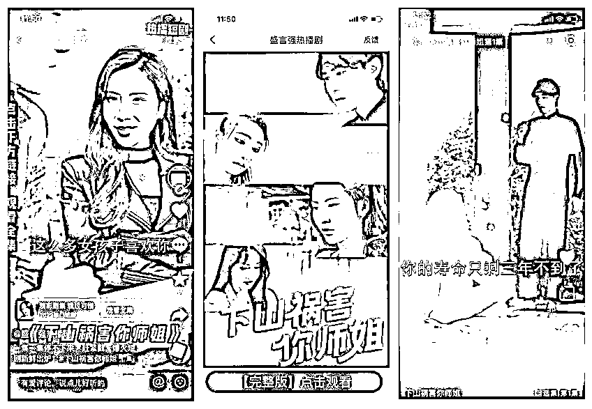

# 1.1.1 短剧是什么？

不知道大家平时刷短视频的时候有没有刷过那种几分钟一集连载的视频，剧情有点像小说，又有点像影视剧的感觉，这就是短剧。

短剧是从去年年底开始在短视频平台爆火兴起的一种新的剧集模式，主要是赘婿，神医，战神，总裁，言情等题材，剧情紧凑，时长精简，没有拖泥带水，精准的抓住了短视频平台下沉市场用户的兴趣点。短剧一般单集时长 1-5 分钟，剧情连续，单部作品有 100 集左右，展现形式主要为竖屏视频。

短剧有非常多的剧场，如九天剧场、阳光剧场、微剧吧等等。这些剧场可以理解为我们平时看的腾讯视频、爱奇艺、优酷等平台，不同剧场的短剧片单也不尽相同。不同于影视 APP 的是，这些剧场通常为短视频平台内部的小程序，用户通过短视频平台进行观看。

目前，短剧市场正在呈现爆发式的增长。仅去年上半年，进行规划备案的短剧就达到了 2859 部，单月内备案的微短剧数量均超过 400 部。

作为优秀的“下饭神器”，短剧的短平快节奏符合现代人的观看习惯；短剧自带的神转折、密集爆发的剧情爽点都正戳中年轻人的“心巴”，简直就是我们最好的“互联网嘴替”。

•短剧的受众群体

短剧的受众群体，大部分是三四线城市或者乡镇的成年男性。还有少部分，比如最近大火的一部“顾少”短剧，吸引的观众多为 30-40 岁的女性，充值比例特别高，10 万播放可以做到 4000+的充值金额。

短剧中剧情紧凑，各种反转，视频中有意设置的各种精彩爆点，虚幻的 YY 情节，无疑都是吸引目标用户充值的利器。

短剧我们一般又分为免费短剧和付费短剧。

