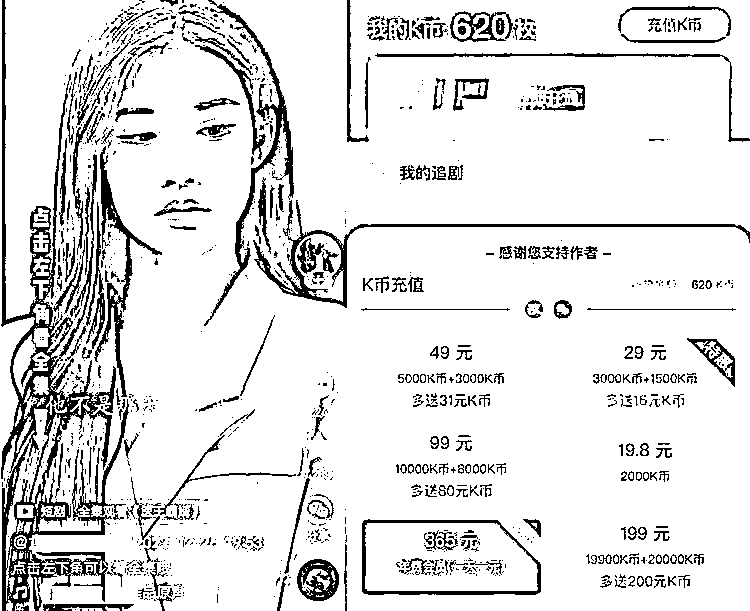

# 1.1.3 付费短剧

付费短剧的推广和小说推文类似，用户看剧看到高潮部分，我们就不给他看了，需要充值才能继续往下看。

付费短剧的变现方式主要是吸引用户充值付费，单集解锁或者充会员：

这些短剧主要都是由一些爽文小说改编拍摄而来，近年来很火的剧情通常是一些扮猪吃老虎、屌丝反转逆袭的 YY 爽剧，比如在抖音里被很多用户调侃的“歪嘴龙王”“歪嘴战神”那种赘婿系列，相信很多人可能也刷到过。

内容来源：《目前为止最详细的【短剧推广实操手册】，没有之一！》《短剧 cps 怎么赚大钱》《短剧分销 CPS 推广：红利期新项目科普+保姆级教程》

