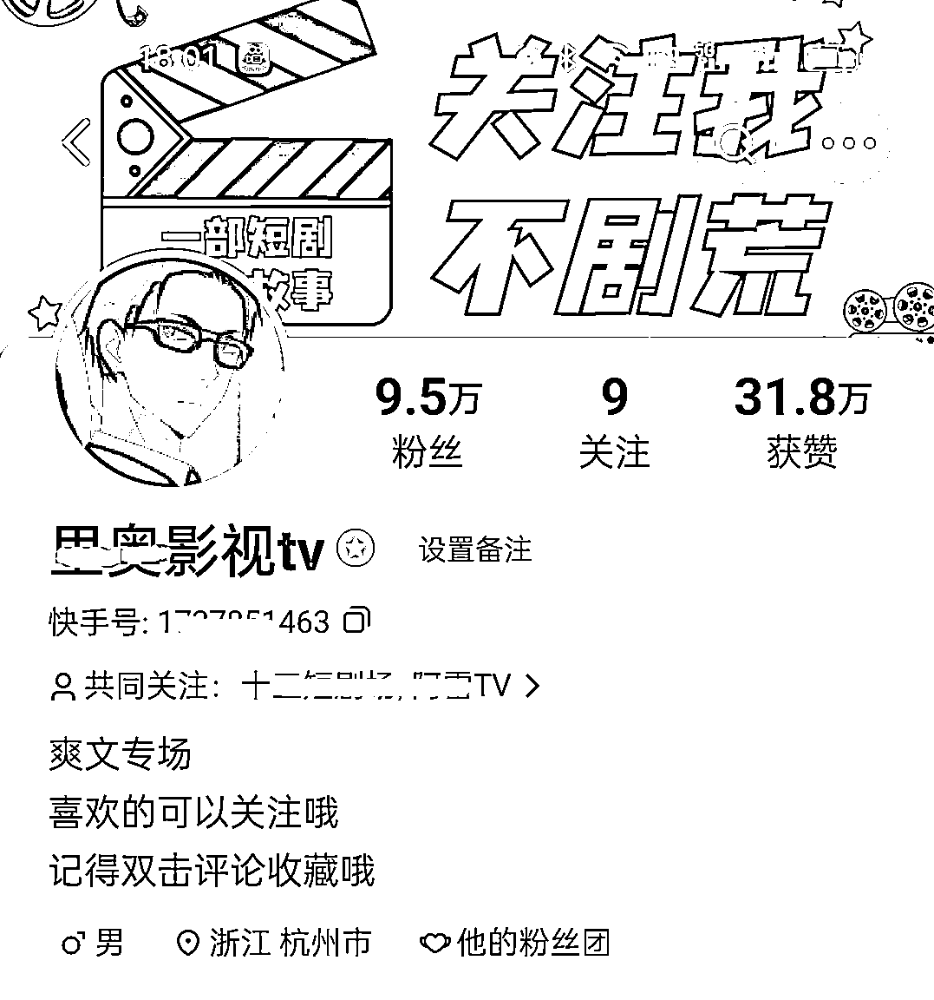

# 2.4 账号设置 @思蒙

从需求出发，分别对：

•头像

•昵称

•简介

•背景图

这几个账号参数进行设置。

头像：在小红书上直接搜好看的女生/男生头像，或者比较有趣，可爱的头像等等都可以，图片要高清。

昵称：这个网上直接搜好听的昵称，有很多，按照自己喜好选择，一般 3-4 个字比较好，昵称里不需要带上短剧 2 个字，当然想带也可以，不影响。

简介：积极向上正能量不违规的句子就可以，可以百度或者小红书上直接搜索正能量句子，直接拿来用。

背景图：同样从小红书等平台找好看的图片即可。如果想要更进阶，可以用 PS 或创客贴（网址：[`www.chuangkit.com/`](https://www.chuangkit.com/)）等图片编辑工具，在背景图中加上文字引导信息。

注意：设置好账号资料后，不建议频繁更改。

如果你仍然不知道如何设置账号，同行是最好的老师。

怎么找同行？搜行业关键词，比如#关关剧场 #东方剧场 #九州视频等，或者行业爆火剧名，如「顾少的隐婚罪妻」等，就能看到一堆同行的账号。

找到以后，参考模仿即可，这些东西不是很重要，不要浪费时间，几分钟搞定就好：

内容来源：《目前为止最详细的【短剧推广实操手册】，没有之一！》《短剧 cps，小白也能月入过万的蓝海项目》

