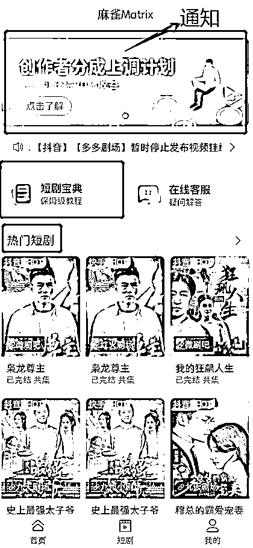
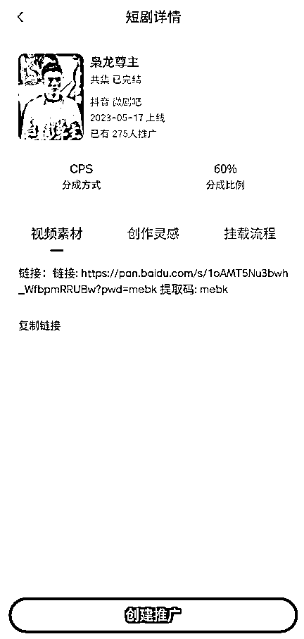
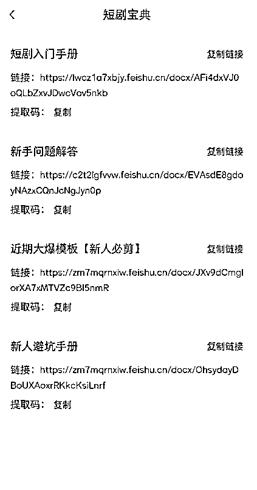
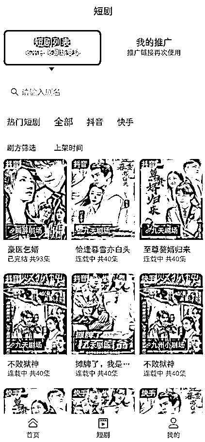
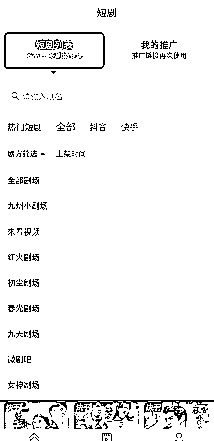
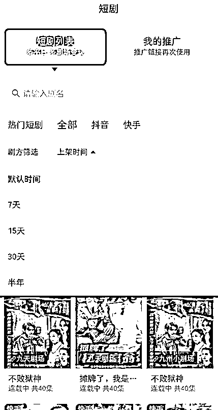
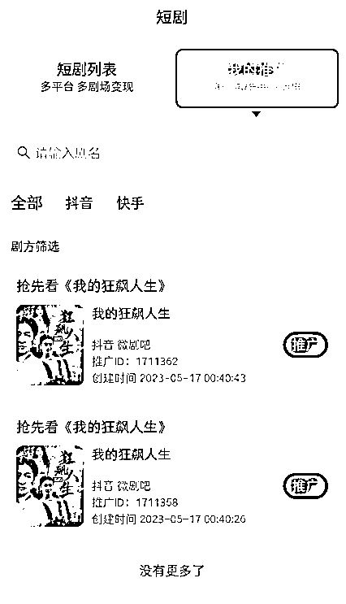

# 3.1.3 了解麻雀 Matrix 功能

进入 APP 后，我们能看到这样几个界面，简单介绍一下。

首页，主要内容为「重要通知」「短剧宝典」和「热门短剧」：

「热门短剧」可以直接点击进去，创建对应剧目的推广（截图页面仅为举例，不做推荐）；

「短剧宝典」内即为官方的手册、新手答疑、爆款模板等资料，大家可以按需获取：

点击页面底部的「短剧」，我们能看到「短剧列表」和「我的推广」两个模块。

其中，「短剧列表」里为麻雀 Matrix 所有可推广的短剧，你还可以筛选剧方与上架时间：

在「我的推广」里，你可以看到自己曾经创建过的其他短剧链接，可以将推广链接再次使用：

分佣比例等信息则在小程序主页，如图所示，点进去可自行查看，结算周期为月结:

