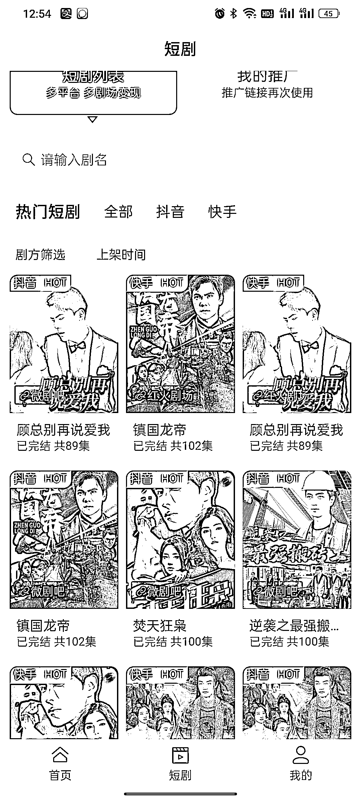
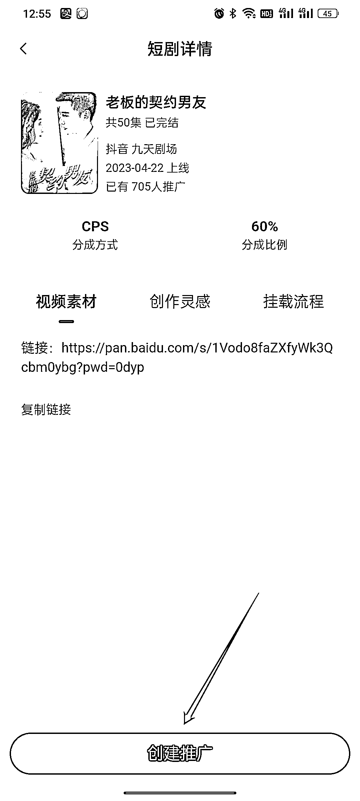
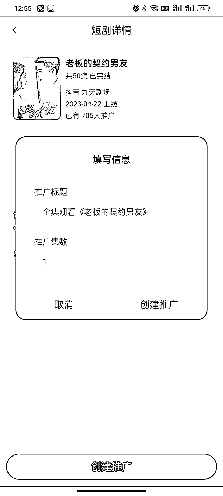
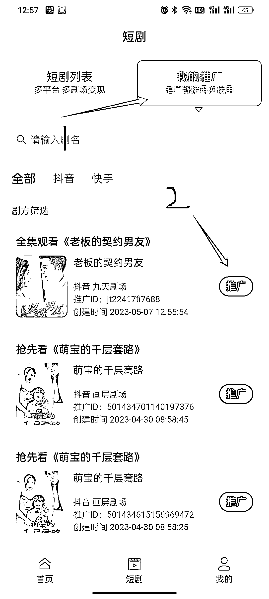

# 3.1.4 麻雀 Matrix 如何实现短剧推广🔥

进入「短剧」页面，在列表选择我们要制作的短剧，进入以后，点击「创建推广」：

信息默认填写的即可：

然后点「创建推广」按钮，就会让你选择相册的视频（第一次选择需要授权读取相册权限），选择好视频后，会自动跳转到抖音/快手。

❗️这里选择的视频就是你剪辑制作完毕，要用来发布作品的视频。如何剪辑视频，详见👉《六、剪辑视频》

如果没有跳转，请先回到手机主页手动把抖音/快手打开，再回到麻雀 APP 里点击我的推广，找到刚才生成的链接，点「推广」即可：

然后我们选择手机相册里已经制作好的视频，上传到抖音，填写相关#标题、话题等，点击发布即可。

