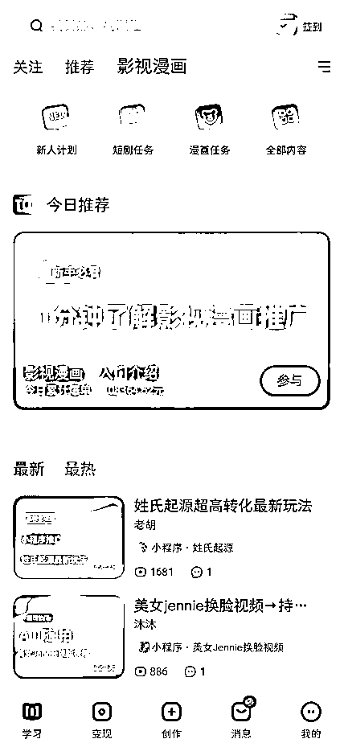
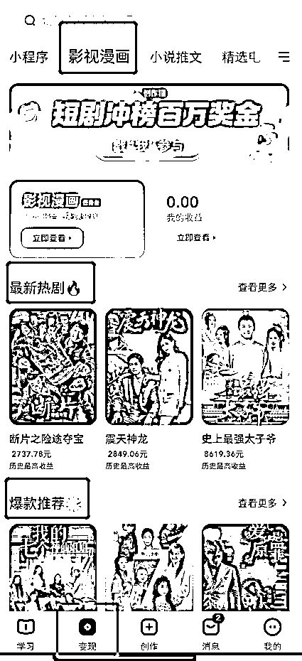
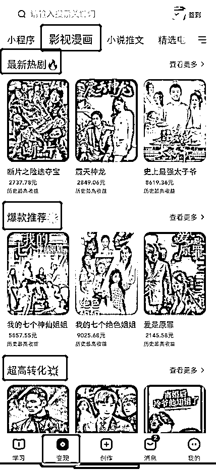
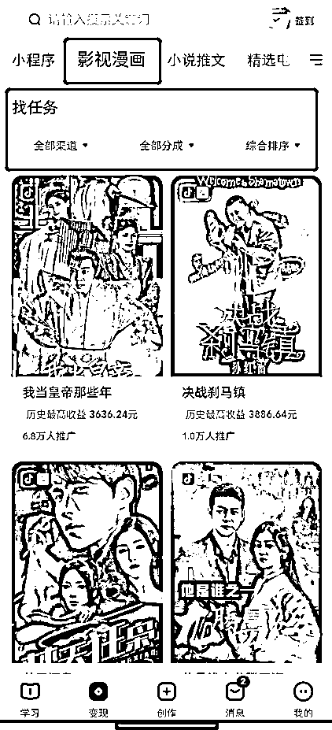
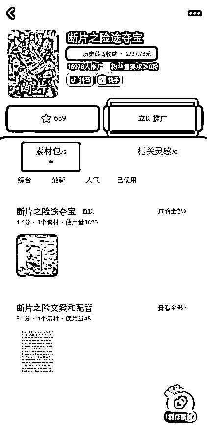
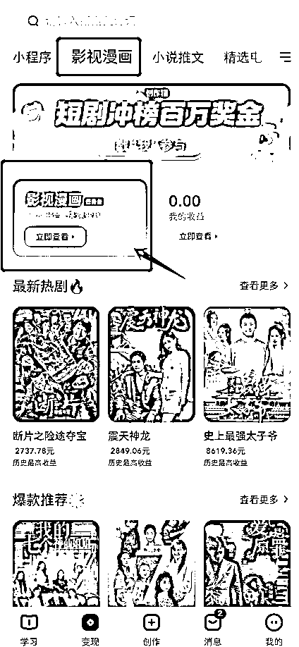
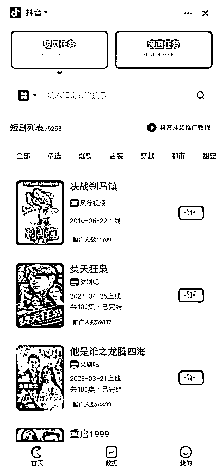
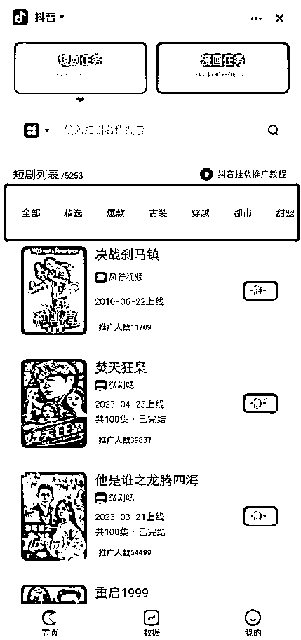
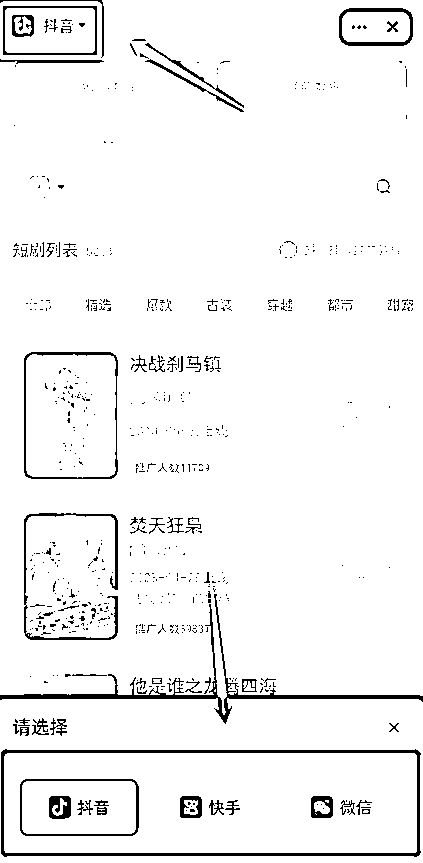
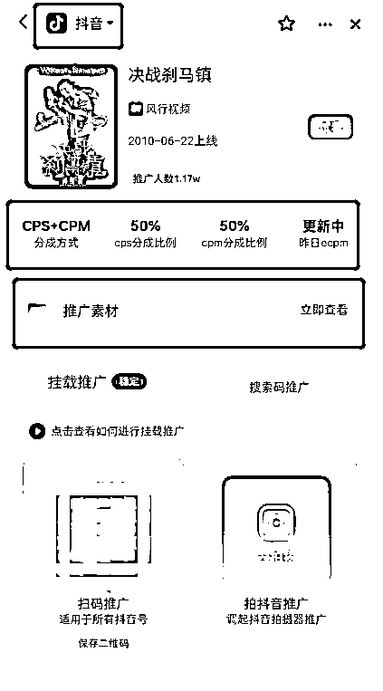

# 3.2.2.1 短剧推广功能

•学习页面

进入 APP 后，我们看到的第一个页面就是「学习」，这里包括一些操作教程、任务介绍等，主要是引导你了解各个项目。如果你对「短剧 CPS」的某个环节不理解，尝试在这里搜索可能会有答案：

•⭐️ 变现页面 ⭐️

点击页面底部的「变现」，能看到创作猫 APP 中对我们来说最核心的模块之一。在这里你能看到可推广的短剧，并点击对应短剧进行推广。

选择「影视漫画」后，你能看到非常多种类的短剧。平台也对他们做了分类，比如「最新热剧」「爆款推荐」「超高转化」等，你可以直接从中找到爆款概率更高短剧：

再把页面往下拉，你还能看到更多短剧，并且还能根据渠道、分成类型、上架时间等对短剧进行筛选与排序：

点击你感兴趣的短剧，能看到推广素材（即视频素材）与推广按钮等：

具体如何推广我们在「3.2.3 如何实现短剧推广」会讲到。

•⭐️ 影视漫画页面 ⭐️

这里是我们推广短剧的主战场，如果在「变现」页面点击「影视漫画（任务台）」，就能跳转至这样一个新页面：

我们选择其中的「短剧任务」就能看到非常多的短剧，你还可以按照精选、爆款、古装、穿越……等等标签进行短剧选择。在左上角，你还能选择你要发视频的平台：

点击你想要推广的短剧后，同样就能跳转至推广页面，并且能显示该剧的分成方式、分销比例、推广素材等，左上角同样能选择你想要发视频的平台：

回到刚刚的页面，如果点击页面底部的「数据」和「我的」，就能看到自己的推广数据与收益：

支持绑定银行卡或者支付宝进行提现，结算周期：

•cps：T+7

•cpm：T+30

创作猫的短剧推广功能，主要涉及到的就是以上界面，大家可以多多探索，熟练使用。