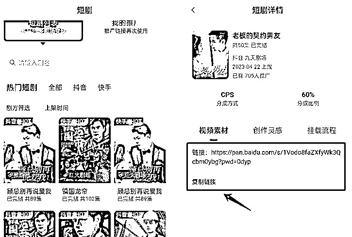
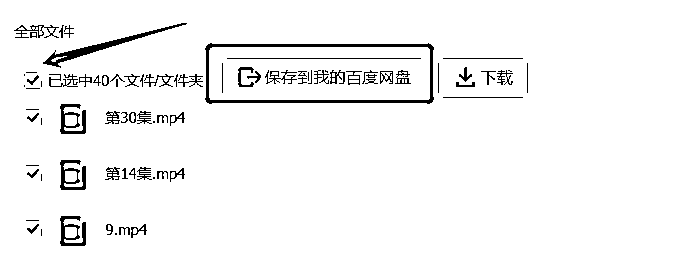

# 4.2.1 渠道一：麻雀 Matrix

麻雀 Matrix 的素材一般都以百度云盘的方式展现。

你从主页进入每一部剧的推广页面后，都会看到对应的云盘链接，我们复制链接到浏览器打开即可：

然后，点击【全选——箭头指的这个小框】，点击【保存到我的百度云盘】，这时提示要登录百度账号：

有百度账号的自行登陆，没有百度账号直接注册一个。

然后我们到云盘里下载全部剧集就行。

官方剧场提供的剧集，一般都是 1-20 集，或 1-40 集的，几乎不会提供全部素材（牵扯到版权问题）。

但有的精彩模板里，会出现个别不在官方素材库里的内容，比如《顾少的隐婚罪妻》的爆款开头，用的是 96 集和 97 集，这时我们就要自己想办法，去找对应素材。

一般是找有可能有资源的同学或前辈，问问他们有没有拿到这类资源，或者去其他平台搜一搜，有没有相关资源。

