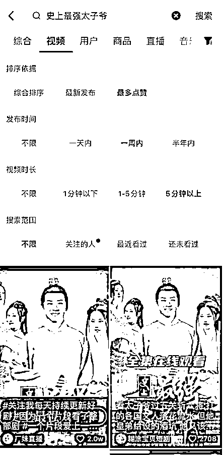

# 5.1 初级方法一：抖音搜索找对标视频 @云珞 YunL @猫柠 @张柯 Ker

优质对标视频应当符合以下几个条件：

•一天内发布

•点赞量超 1000

•视频播放量远远高于其他视频播放量

•粉丝量越少越好

第一步： 搜索关键词「短剧」，筛选条件为一天内最多点赞。如果一个关键词找不到合适的对标视频，就换其他关键词继续搜，关键词可以是「短剧、短剧推荐、好剧推荐、热门短剧、因为一个片段看了整部剧、"短剧名称”」 等等，或者点击任意一个视频，看看别人用的什么标签，我们就搜什么关键词：

第二步：根据点赞数量排序，找符合自己所做方向（男频/女频）的短剧，挑选 1000 赞以上的点击进去查看。

找到符合条件的视频，前期进行 1: 1 模仿剪辑，后期可适当创新。

如果发现数据还不错的剧，主要看这几点：

•剪的什么剧

•视频多长时间（作为剪辑时长参考）

•剧的开头和结尾是什么（作为剪辑剧情参考）

如果找到多个符合条件的视频，点赞量相近的情况下，优先选择粉丝量少的账号模仿：

比如我们以最近的热门，《史上最强太子爷》这部剧为例：

以下这些视频的数据表现都非常好：

[`v.douyin.com/UMxXY1s/`](https://v.douyin.com/UMxXY1s/)

[`v.douyin.com/UMQMYpV/`](https://v.douyin.com/UMQMYpV/)

[`v.douyin.com/UMQ8F2v/`](https://v.douyin.com/UMQ8F2v/)

[`v.douyin.com/UMQPmoj/`](https://v.douyin.com/UMQPmoj/)

[`v.douyin.com/UMQjXM7/`](https://v.douyin.com/UMQjXM7/)

[`v.douyin.com/UMQ2C7n/`](https://v.douyin.com/UMQ2C7n/)

大家可以看到，爆款都是类似的，甚至开头都几乎一样，前面几个万赞视频甚至只是做了去重。

所以如果有时候你不知道怎么剪一部剧，找对标，多看多学习，就有手感了。

内容来源：《我用生财教我的方法做短剧》《短剧推广：每天 1-2 条视频，单个账号月变现 1w+经验复盘》

