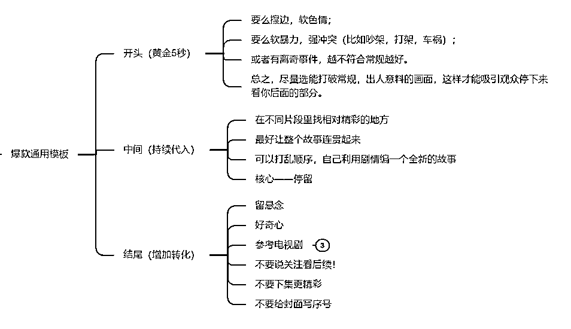
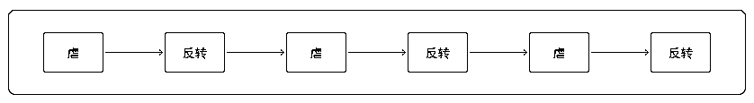

# 5.4.1 爆款逻辑

爆款视频遵循一个原则： 开头黄金 5 秒，中间精彩片段，结尾戛然而止。

•开头：•黄金 5 秒很重要，挑选那些不符合观众预期的、离奇的、有爆点的、有吸引力、有悬念的开头内容；•通常会介绍人物、环境和故事背景，在这个阶段，通常会设定故事的基本冲突；

•中间： •冲突性片段：可以是反转剧情、争斗之类，展示主要人物面临的各种挑战或问题；•高潮片段：这是冲突达到顶峰的时刻，通常是故事的转折点，在这里，主要的冲突或问题通常会达到最紧张的状态；•中间剧情不是爽，就是惨，跌宕起伏，揪住用户心理，尽量剪去配角的戏份和平淡的剧情；

•结尾： •留悬念，让用户好奇接下来会发生什么，吸引观众点击小程序去付费观看全集•比如，女频短剧看男主知道女主受伤后是不是会后悔，但不把男主后悔剪辑出来；•又比如，男频短剧是炮灰挑衅男主，用户都知道男主要装逼打脸了，但不把男主装逼打脸剪辑出来，引导用户去看正版短剧，自己去看男主如何花式装逼打脸，向用户提供愉悦感；•或者你看剧情时，很想知道后续是什么，你就把那情节放入结尾，不要把后续放出来。

大家也可以参考 @思蒙 老师的这个爆款模板，大致结构是差不多的：

不管如何起承转合，模板万变不离其宗：

一虐一反转算一个循环，刺激观众情绪的起伏，最后在反转前停住，引导看后续。

虐只是一个指代词，与虐剧无类，所有的剧种剪辑都可循环这个逻辑。

以此为基础，我们就能明白，其实常见爆款剧情就三类。

•男频•男主扮猪吃虎+反转打脸+复仇+悬念结尾•穿越+YY+堆积爽点+悬念结尾

•女频：女主被虐（非常毁三观那种），比如•开幕雷击（暴力、暧昧）+男女主虐恋+反派搞事+悬念结尾•或者是真相大白的剧情，比如，女主被女配冒充，女配从嚣张跋扈到绝望，但结尾留一点悬念

而我们剪辑视频时，可以行生出更细化的主线。比如女主被虐，可以细化为：

男主直接虐女主，二者直接冲突：女二陷害女主，引发矛盾冲突；婆媳矛盾冲突；利用小孩博同情；……

每条线可以单拎出来成一个视频，也可以多条线交叉在一起，对于过渡就要把握好。