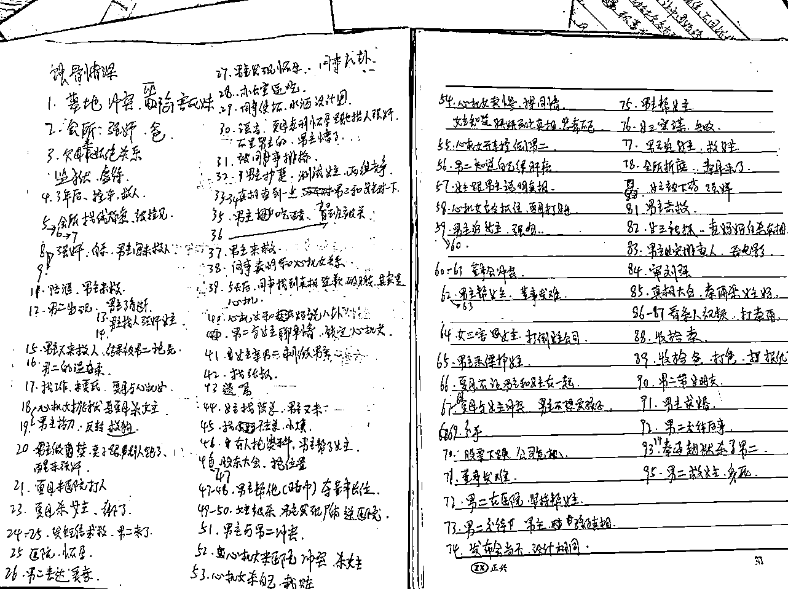

# 5.4.2 选用素材

有了开头中间结尾，选哪些素材呢？

从角色来选：比如女频，今天你剪辑的情节围绕男女主和恶毒女配，那就选与男女主恶毒女配有关的剧情。

但若你今天剪辑的情节围绕男女主和婆婆，那就选男女主婆婆有关的剧情，恶毒女配不要出现，或者少出现。

一集 5-10 分钟为佳。实在是没有灵感，也可以剪辑 3 分钟的视频。

从剧情来选：剧情按照开幕雷击+虐+小逆袭+虐+小逆袭+虐+悬念来排序

虐是指什么呢？ 就是男主虐女主、女配虐女主、炮灰虐女主，主角处于不利的境地。

小逆袭是指女主反击伤害她的人，不管是语言反击，还是肢体反击，还是男主或其他人帮女主说话，都是小逆袭很多时候虐与小逆袭的剧情是连在一起的。

我们在剪辑时，就是不断重复循环「虐-反转」。如果是剪 2 分钟的视频，可能中间只反转一次，一共两个循环就结束如果是剪 10 分钟的视频，那么 5-6 次循环再结束。那些非必要的过渡剧情，全部不要。

•如何判断剧情非必要？

删除这些剧情后，仍然看得懂，不会让观众云里雾里的：怎么突然出现一个人物，他是谁，为什么要帮主角？

这个逻辑玩熟以后，剧热不热门，在你这里都一样，你都能剪得精彩，你就是爆款制造机。

当然要熟练掌握这个套路，首先在拿到素材时，必须把视频完整的看一遍，然后做上笔记，如图所示：

当然，你必须了解抖音发布规范，可能违规、你把握不准的情节不要放。