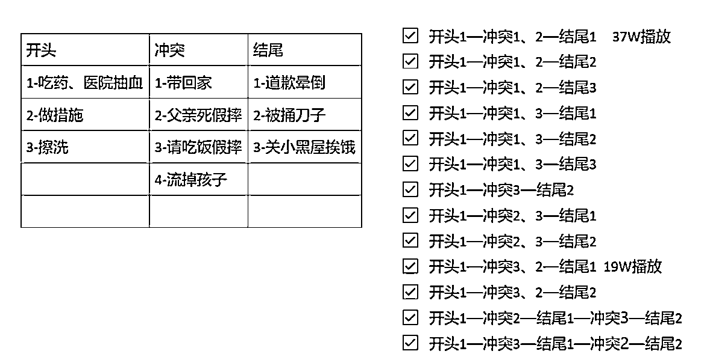

# 5.4.4 案例讲解

•案例一：《顾少的隐婚罪妻》

以《顾少的隐婚罪妻》为例，每次参考完爆款视频后，我会把对标视频中涉及到的片段整理出来，以「开头、冲突、结尾」进行分类，总结出常用的几个片段，对片段进行排列组合，可以组合出非常多内容。

因为挑选的片段都是经过验证的，所以自己排出来的视频播放量也不会太差：

•案例二：《神豪保安》

经过剪辑，这个视频现在的剧情是这样的：

•男主给狗下跪，一虐，男主继承家业，一反转；

•男主被保安拦下，二虐；管家来救主；二反转

•爷爷给男主配秘书，这是过渡剧情；

•男主再次来到小区；三虐；

•秘书驾到；三反转：此时结尾，引导看后续

这个视频是加了解说的，不加解说原理也是一样的。

内容来源：《目前为止最详细的【短剧推广实操手册】，没有之一！》《短剧 cps 怎么赚大钱》《短剧推广：每天 1-2 条视频，单个账号月变现 1w+经验复盘》《我用生财教我的方法做短剧》《新手用生财的方法做短剧 CPS，一个月 1.4w+收益》

