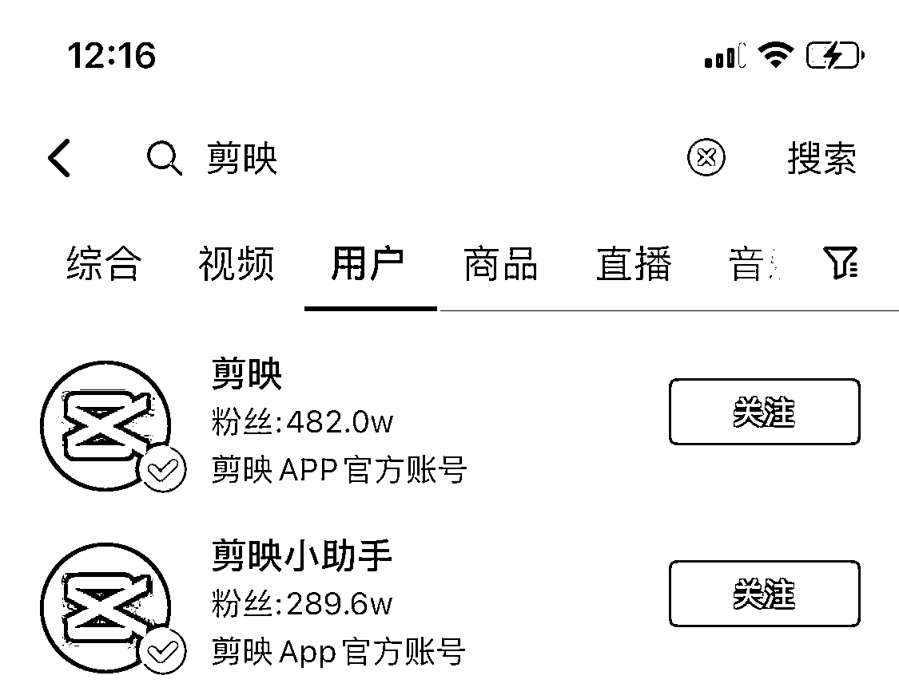
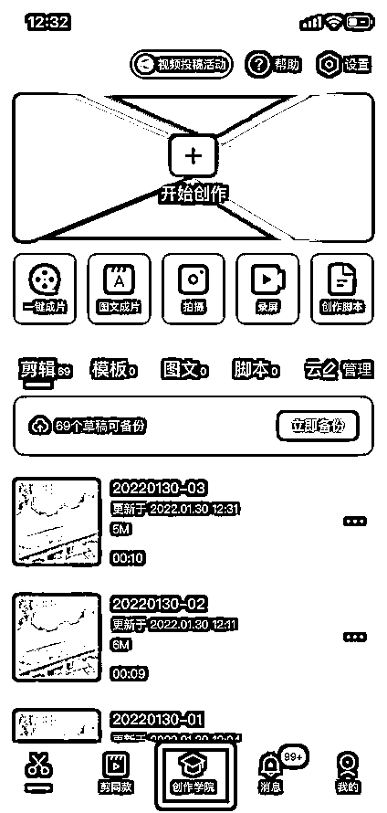
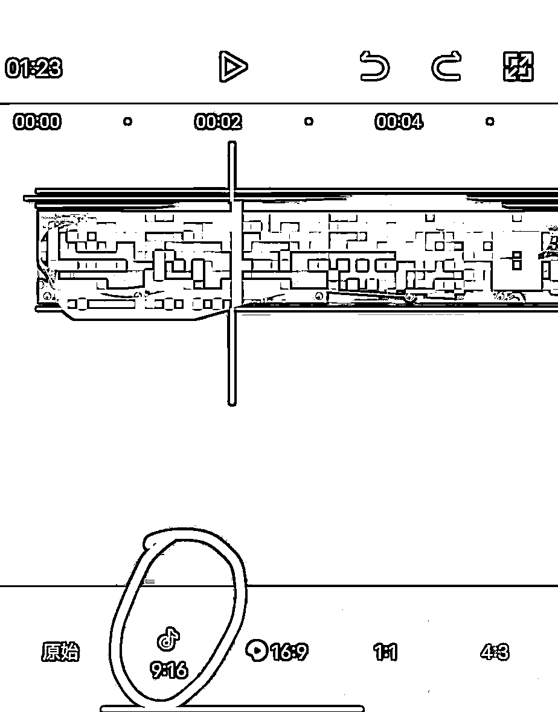
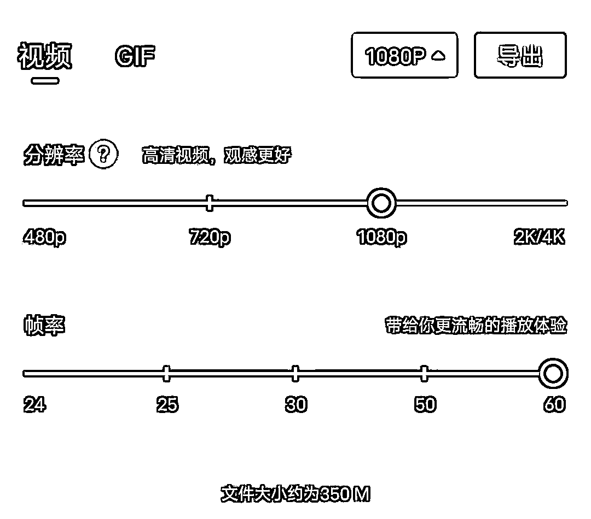

# 6.1 基础剪辑方法

完全新手的朋友，可以看一下这个教程视频，并自行操作一下，了解剪映结构和基础功能即可：

[mmexport1677167802702.mp4](https://search01.shengcaiyoushu.com/upload/doc/SUYad816hofSjmxGHeWcbjoEnpc/JELWbCAkXosvqpxq45wcrGBGnHe)

看完自己跟着操作一边，直到导出视频这里就行。

更进阶的剪辑技巧可以在抖音搜索【剪映】、【剪映小助手】这两个官方账号上学习各种技巧；

也可以在抖音搜索具体的剪辑问题来找到教程，比如搜如何用剪映进行镜像翻转；

更加专业的可以在剪映软件中——点击【创作学院】——搜索具体剪辑问题；

或者是点击【剪辑入门】——点击【剪映剪辑】，查看各种课程合集，找到适合自己的课程。

剪辑完的视频时长一般建议在 4-6 分钟，太短的话用户看完不够爽，点击看全集的冲动低；太长完播率会降低，用户可能中途划走。

导出视频格式一般为竖屏，9:16，导出时格式为 1080p，60 帧：

注意：用旧版剪映的同学导出时，可能会自带【剪映片尾】，如有，请提前删除。

