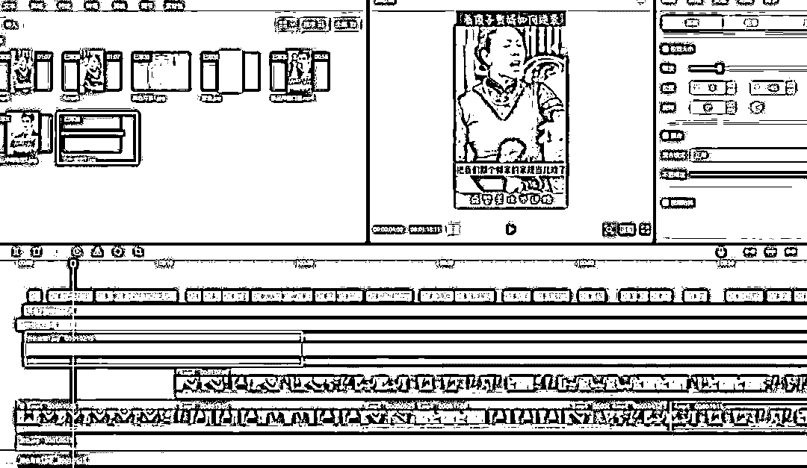
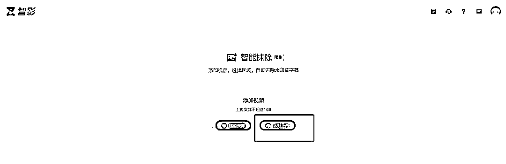
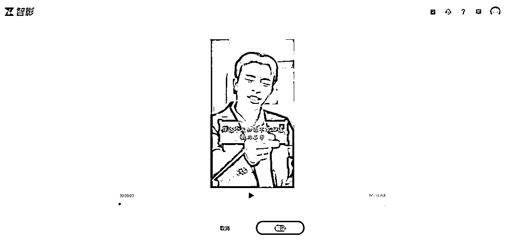
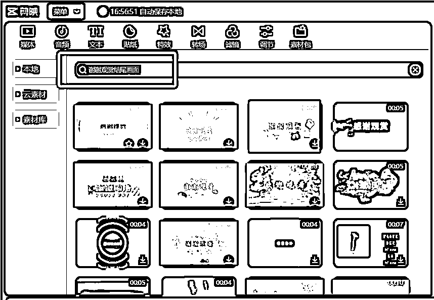
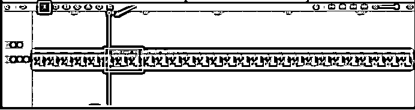
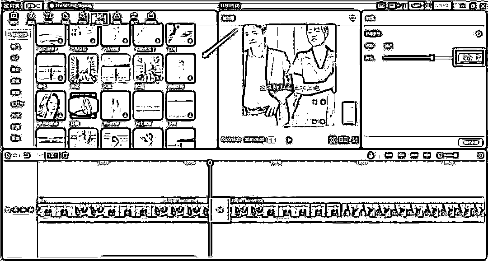
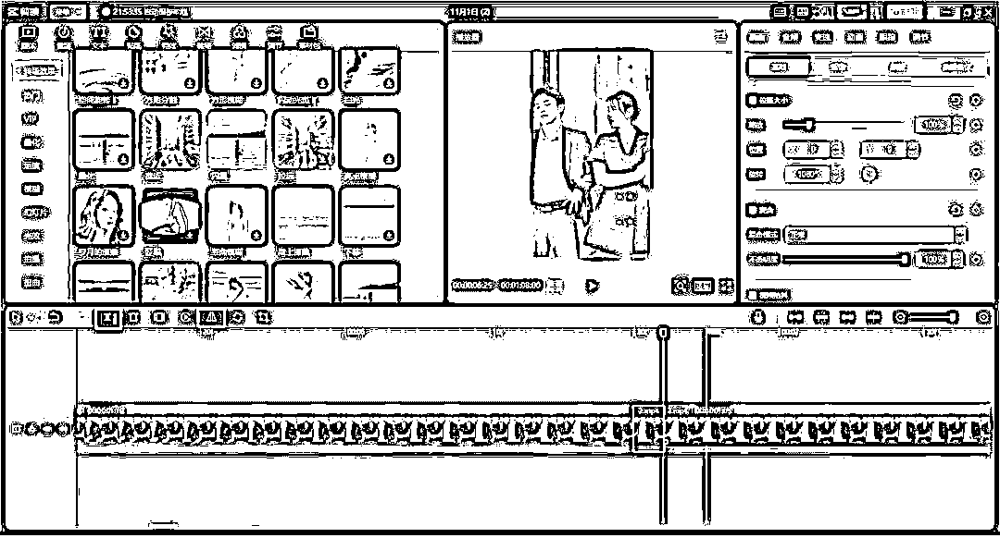
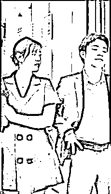
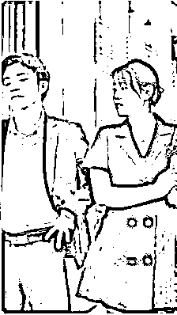
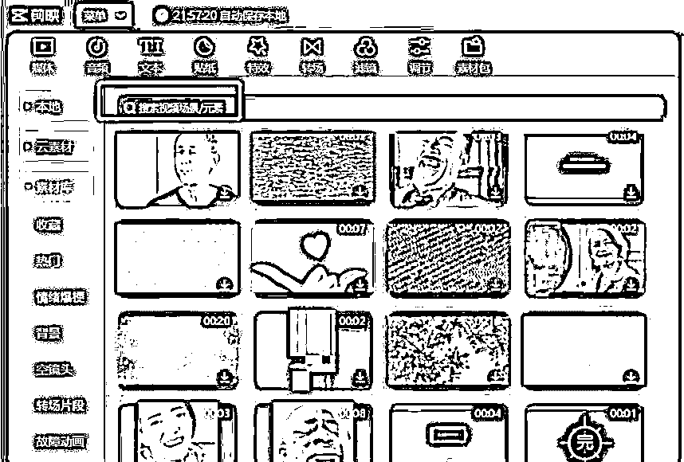

# 6.2.2 方法二：多用常见剪辑手法 @狼魂小毛 @云珞 YunL

@狼魂小毛 老师和 @云珞 YunL 老师的去重方法，本质上都是相似的，即多用剪辑手法，完成去重。

@云珞 YunL 老师主要使用的剪辑手法共有如下 20 种：

加叠化转场、加游动水印、加贴纸、加滤镜；加画中画，透明度 1%-30%，选择不影响视频效果的透明度；加特效，透明度调小不影响观看的 1%-15%；加扫光特效、旋转、加调节、添加音乐、变速、镜像加字幕、添加解说、加封面、加标题、加文字、加音效、加转场视频、剪裁

视频教程如下，大家可以对照学习：

[短剧去重 20 个方法.mp4](https://search01.shengcaiyoushu.com/upload/doc/SUYad816hofSjmxGHeWcbjoEnpc/GVHabRdIPoO6ePxBe42cFQFanxc)

如果你更习惯阅读图文，也可以查看 @狼魂小毛 老师的教程：

•处理字幕

我们下载好的原创视频有些有字幕的，我们可以先把字幕去掉（没有的就不用），后续再通过剪映添加上。

或者在剪视频的时候一开始先不去字幕，后续把视频剪完再处理字幕，有的小伙伴是直接加了个白底，重新加字幕上去的，具体如下：

在这里给大家提供一个方便快捷的方法，用【智影】去字幕，在这里说下，这个方式不太稳定，时好时坏，有时会把字幕抹除的不好，会导致视频之前有字幕的地方模糊。也有其他去字幕的方法，比如用蒙版、裁剪、放大法等方法。

【智影】去字幕：https://zenvideo.qq.com/smart/waterMask

把链接复制到浏览器打开，点击本地上传或者右上角登录，登录上去后，点击本地上传：

把之前下载好的视频上传上去，把需要去掉字幕的地方框起来，点击确定，这样就把字幕给去掉了：

最后把去掉字幕的视频下载下来即可。关于字幕也有其他小伙伴用 PR 和剪映混着操作。

•修改封面

封面就相当于一个人的门面，封面选的好，相对来说就会更加让人有想点进去的欲望从而提高播放量。

这一步用剪映操作就行，相对基础，不多赘述。

•片头片尾

我们剪辑的视频不要跟原视频一样，先掐头去尾，后期再用剪辑软件制作片头片尾，不需要太长，几秒钟就好。

片尾可以从视频库搜谢谢观赏或者下集更精彩的素材添加上去，方法不是唯一的，有其他想法也可以使用上。

最终导出视频保存，导出来的视频可以传到手机上：

•变速

视频导入后将视频常规变速，选择变慢 0.9，然后进行第二步操作，抽帧。

抽帧完导出。然后再导入视频，再对视频进行加速，选 1.1，这样视频时长与原视频时长非常接近。

•抽帧

视频抽帧就是在一段视频中，通过间隔一定帧抽取若干帧的方式，模拟每隔一段时间拍摄一张照片并接合起来形成视频的过程（即低速摄像）。

具体操作如下：

拖动时间线到你要抽帧的位置，点击分割或者使用快捷键 CTRL+B 进行分割视频，把分割的视频删除即可。

⚠️注意事项：

抽帧的时候，要在没人讲话的时候，或者在视频里的人讲完话及上下句的空白处抽帧，不要在人讲着话的时候去抽，否则会把说的话给抽没了，影响视频的前后连贯性。

在不影响视频的观赏效果的前提下，尽可能的多抽帧，这样去重效果更好。

•转场

点击转场，里面有很多的转场效果都可以使用。

如果想把某部分视频加上转场，先点分割，再点想要的转场就可以了，右边标注的地方还可以调整时间，按自己想要的时长调整即可：

•镜像

镜像作用就是使视频里的画面左右翻转，具体步骤如下：把需要的部分分割后直接添加镜像即可：

镜像前后的视频效果对比：

•导入视频和音频以及加上滤镜

可以按照自己喜欢去加，也可以随便去拍段视频，随便放上段音乐，随便加个滤镜都行，然后把强度设置到最小。

目的不是为了单纯去加这些东西，而是为了让平台检测到我们是对视频做了创作的。

•素材库

好好利用好里面的素材库，里面有很多热门素材也都是咱们平时在别人发的视频看到的，想用什么素材也可以在搜索框搜，加到咱们视频里面会起到事半功倍的效果：

•加特效、贴纸

加特效可以改变原始的一些风格，可以增加原视频相搭配的一些特效。在视频不同的地方增加不同的特效，来改变与原视频的相似度。

•画中画

也是改变原视频 md5 值的一个关键操作。

增加画中画中导入一张自己拍的图片，拉长布满整个视频时长，布满整个视频画面。

或者导入一个自己拍的纯色视频，可以拍自家的墙壁，或者地板，时长与原视频一样长，同样布满整个视频画面，把不透明度调到最低。

•调节视频参数

调节亮度、对比度、饱和度、光感、锐化等参数，这些参数微调一点，10 以内即可，调整的数值越大可能会改变原视频的清晰度。

•视频混剪

找剧里的几个亮点拼成一段视频，剪掉中间啰嗦没有用的部分，然后拼接起来，或者把视频亮点加到视频开始的地方，再或者也可以加个前情回顾等。

实操心得：

只要剪的散一点，然后多加一点转场，就没什么问题，也没有出现不能上热门的。也可以适当加些自己的东西，解说之类的原创专场。

这些是我们常用到的一些剪辑手法，不过说实在的这些手法也并不能做到完全去重，还可以在此基础上，配上一些解说画外音（就是平时大家看到的影视解说的，对剧情做一些解说），以及多集混剪。

内容来源：《短剧自然流打法 1 个月变现 2w 的实战经验分享》

