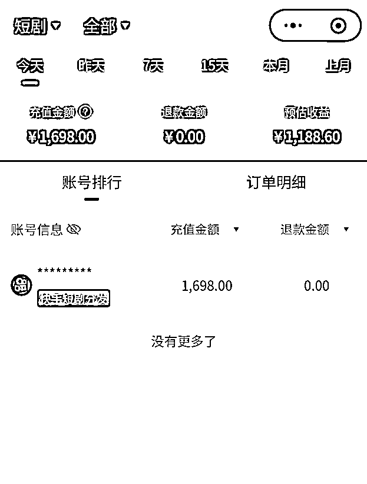
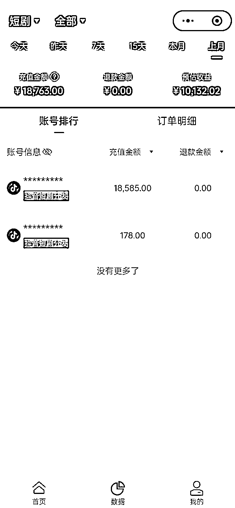
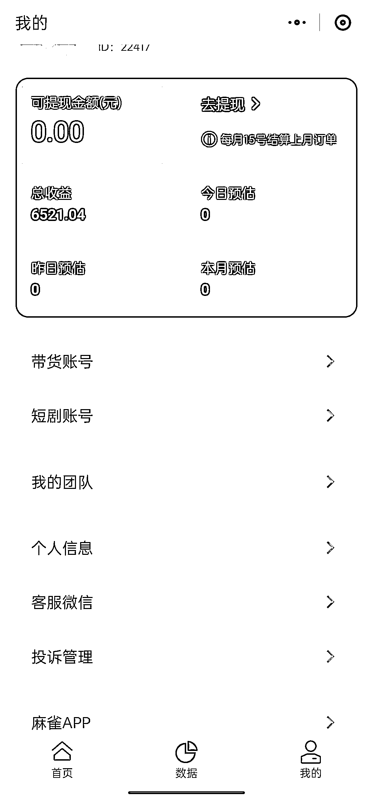
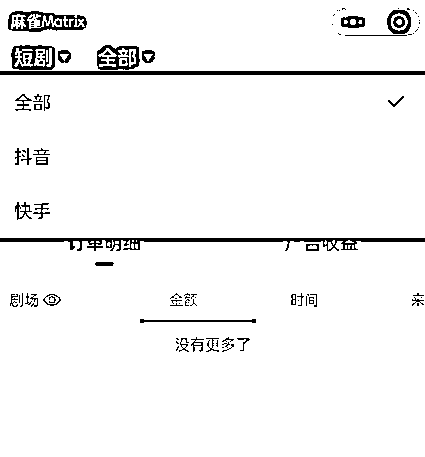
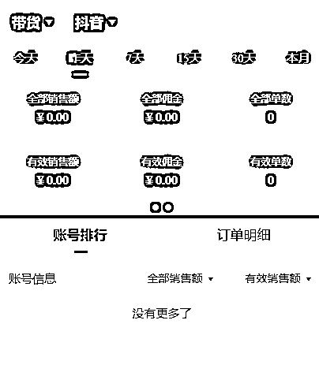

# 8.1.1 如何查看收益

❗️注意：发视频在麻雀 APP 里发，收益还是在小程序里看。

点击小程序底部「数据」，就可以查看自己的收益了，请注意分清充值金额和真正的「预估收益」：

这里的数据分别有，今天，昨天，7 天，本月和上月等。

注意，在每月初数据更新后，上个月的数据会合并到「上月」里，并不会出现在个人中心的数据页，只有在 10-15 日结算完成以后，才会出现在个人中心的「可提现金额」里。

另外，点击「抖音」或「快手」，可切换平台查看，如图：

如果你视频爆了，第二天还没看到收益，点一下这里，看看是不是「带货」，我们要切换到「短剧」，才能看到收益：

