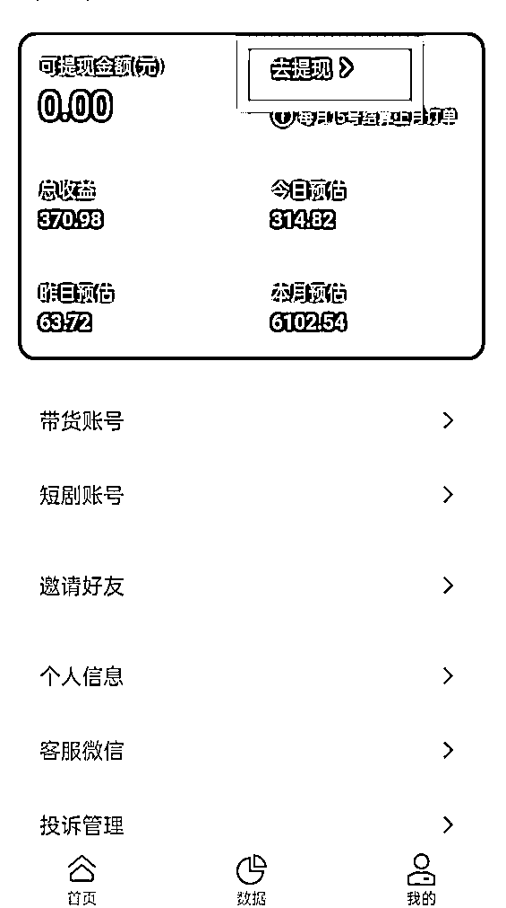
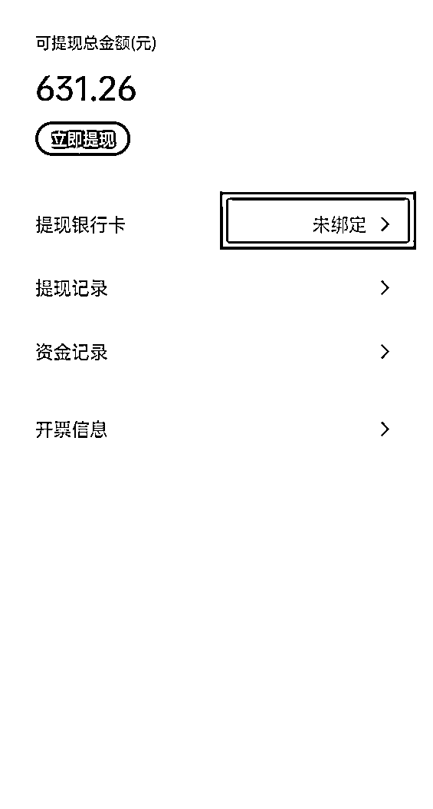
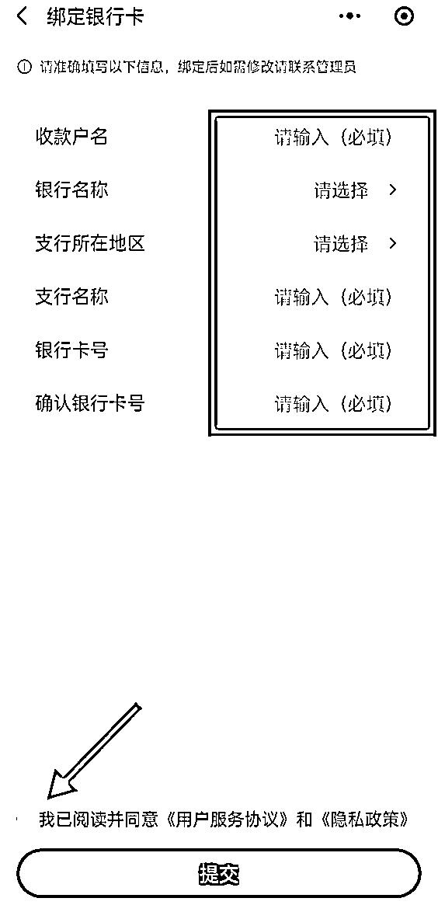
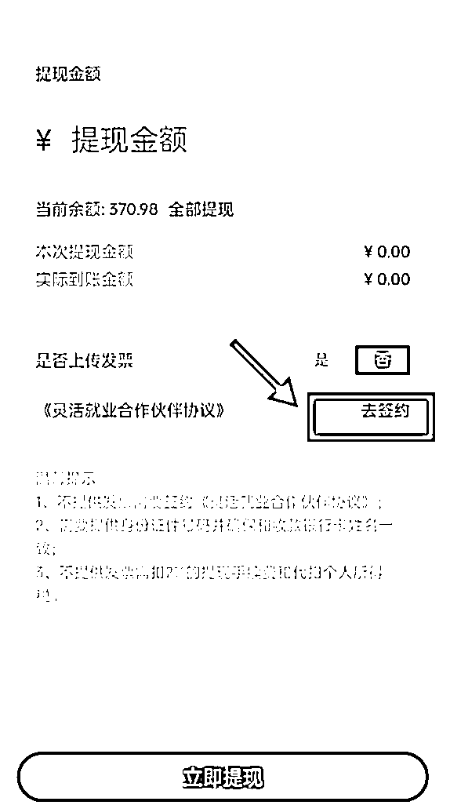
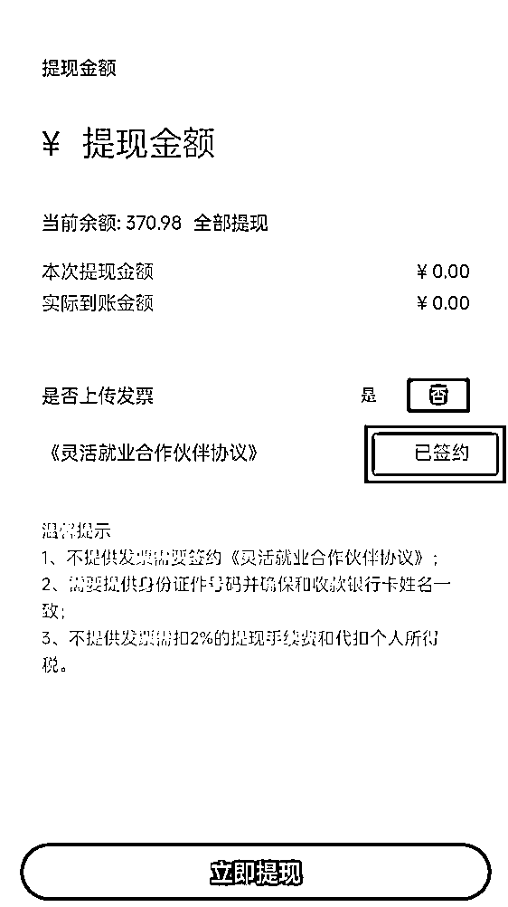

# 8.1.3 关于提现

在麻雀小程序【我的】页面，点击【去提现】，然后【去绑定】个人银行卡，按照需要填写的信息，完成绑定：

点进去绑定银行卡，即可提现。没有结算前不用绑定，等收益到账，可提现时再绑定。提现扣税 2%。

绑定银行卡以后，点击【立即提现】，我们会看到下方有个【去签约】，咱们点击输入自己身份证号，并勾选协议，然后【确定】即可，这时页面显示【已签约】，咱们直接【立即提现】即可。

提现款一般 1-3 个工作日到账。

内容来源：《目前为止最详细的【短剧推广实操手册】，没有之一！》

