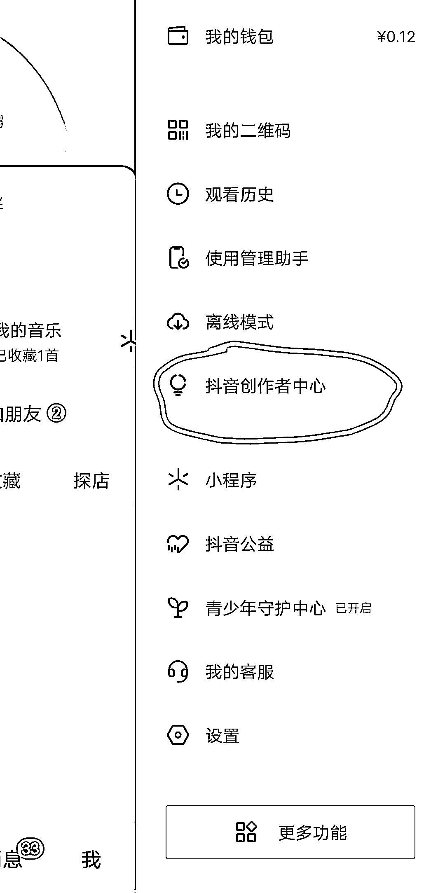
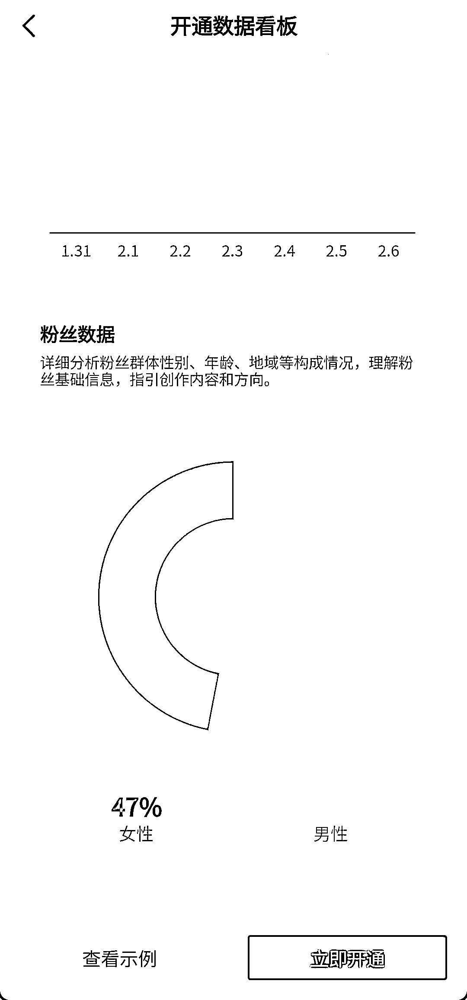
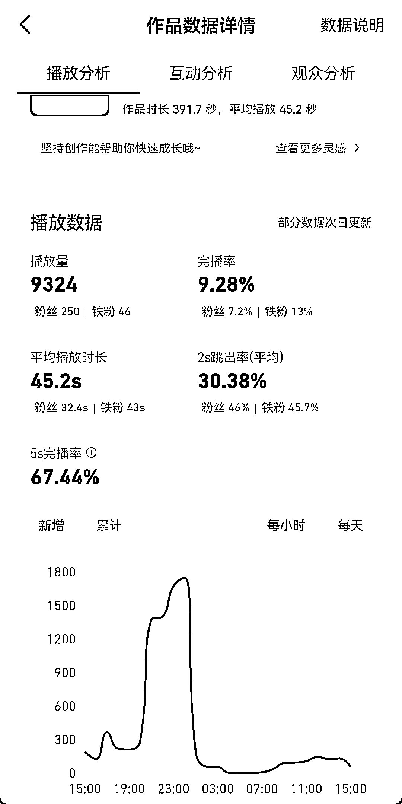

# 8.1 数据看板查看 @思蒙

新账号搭建完成以后，我们可以在个人主页右上方的【三】——三道杠里看到【抖音创作者中心】：

点进去以后，我们就可以看到，这里有一个【开通数据看板能力】：

我们点击进入数据看板之后，下滑到底部，点【立即开通】：

然后系统会提示，我们大约在次日 10 点，就能看到自己已发布作品的数据分析了。次日我们点开自己已经发布的视频，左下角会出现【数据分析】字样，点进去就能看到本作品的详细数据：

其中包括播放量，完播率，平均播放时长，2s 跳出率和 5 秒完播率等数据，还有【互动分析】，及【观众分析】等数据，我们可自行浏览查看：

其中需要着重关注的数据为 5s 完播率和完播率，一般情况下，这两个数据基本基本能判断作品的质量，以及大爆的可能性。

但是，由于我们的作品是带了推广链接的，其最终目的是为了变现，也就是一条视频的转化率才是衡量这条视频的最重要的因素。

所以很有可能经常会出现如下情况：

我的作品数据分析明明显示各项数据都很好，完播率甚至达到了 50%，但是播放量才跑了 4，5 万，而别人完播率只有 13%的作品，播放量却跑了几十万。

那就是因为，别人的转化比你高很多。

内容来源：《目前为止最详细的【短剧推广实操手册】，没有之一！》

