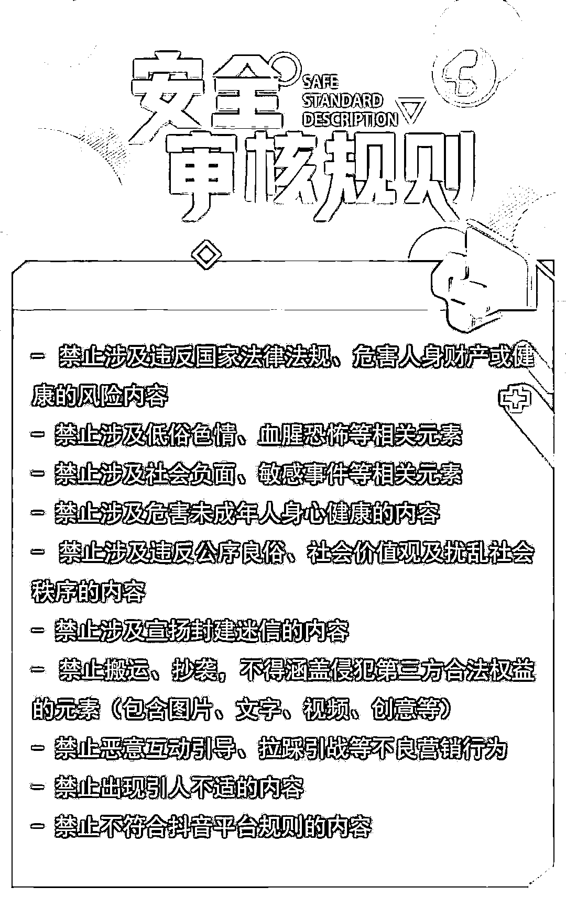
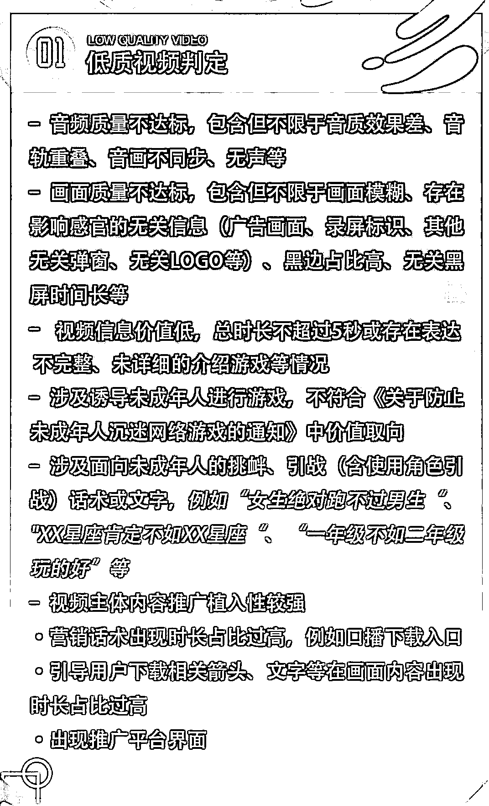

# 8.3 关于违规 @思蒙 @惟乔

在平台混，最重要的就是清楚平台的规则，千万不要和平台做抗衡，除非收益远大于成本。

抖音大平台的规则，咱们在【抖音安全中心】都能看到，基本要点就是，不能违反国家政策、法律法规；不涉黄涉暴涉毒、要有正向价值观等。

所以一切可能违规的素材最好别用，不冒险，就不危险。

这其中，最危险的素材有以下几种：

•穿得少，漏得多

•侮辱人格：例如「狗东西、呆子、贱人」等

•暴力：打架，侮辱别人，复仇，这种不要太多。

•特别是又是脏话、又是威胁，然后再打架，这种特别容易违规。

如果非得剪上述内容，可以采用解说的方式

关于违规，还经常会存在的一个问题就是，可能使用了同样的素材，你发就违规了，别人就没有。

这是因为每个账号体质不同，还有不同审核员的审核尺度不同，所以别太在意和纠结，删除修改重发就行了。

要始终在心里算清一件事，你的时间花在哪里更值钱？纠结抱怨等申诉的时间，能不能多出一个作品？

一定记住，你的时间是最值钱的。

内容来源：《目前为止最详细的【短剧推广实操手册】，没有之一！》《新手用生财的方法做短剧 CPS，一个月 1.4w+收益》

