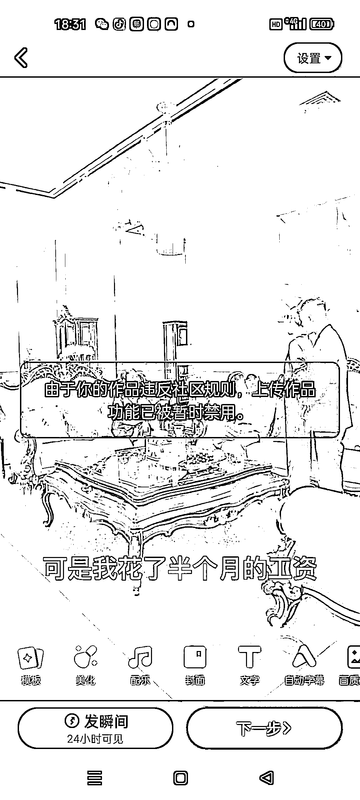
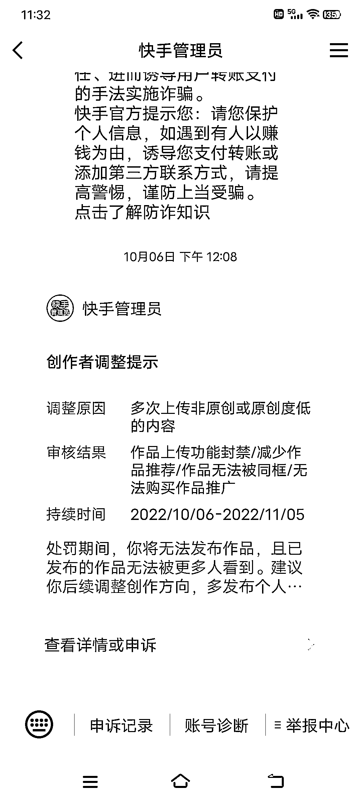
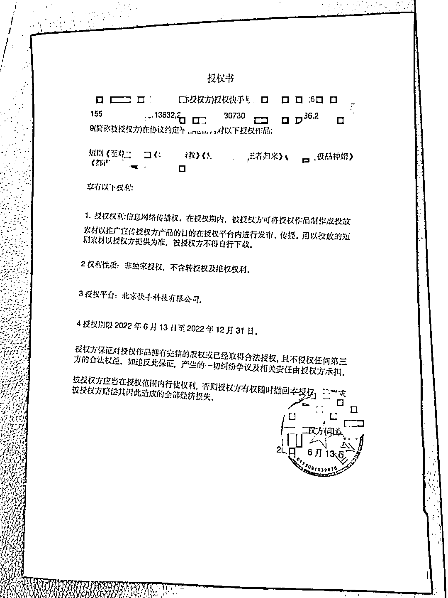

# 8.4 原创度低如何解封 @狼魂小毛

因为一开始对作品二次创作的处理不太够，多个账号都被判原创度低，限制了发布功能：

如何解决呢？

第一步：开具短剧作品授权的证明上传平台，进行申诉（电子版即可）。

申述文案：与该影视剧拍摄公司达成推广合作协议，已同意授权推广。

如果不知道怎么操作该步骤，可以在航海大群中求助。

第二步：提升优化作品原创的技能，避免重复犯错。

内容来源：《短剧自然流打法 1 个月变现 2w 的实战经验分享》

