# 风向标挖掘 202312

> 来源：[`remhu1p2pr.feishu.cn/docx/Qw67da1ohoMyq9xzwwUcRn7Fnze`](https://remhu1p2pr.feishu.cn/docx/Qw67da1ohoMyq9xzwwUcRn7Fnze)

出品时间：2023 年 12 月 22 日

手册使用说明：本文旨在向你展示一个项目的更多可能性，帮助你更好地理解和实操

建议：如果需要快速定位到精确内容，可以使用快捷键 Ctrl + F/command + F 的形式，搜索「关键字/词」，查找你想要的内容

写在前面

💡欢迎大家来到 12 月航海 | 风向标挖掘 | 实战手册，相信在接下来的日子里，我们将在这里见面很多次。

在开始做风向标挖掘项目之前，让我们先来解决几个问题：

1）风向标是什么？为什么要挖掘风向标？

生财的风向标项目大家应该很熟悉了，主要用于收集和分享与赚钱相关的短情报和玩法。所有圈友都可以发布，可以说是最新、最快的赚钱方式信息汇集点。

可以说：赚钱的机会是风向标；

有可能性，有空间的项目是风向标；

之前有案例，时间上又开始循环了的是风向标，比如考研、双 11、还有今年的花卉种子；

帮助大家降本增效的工具/分享是风向标，比如怎么用好 ChatGPT 为文案赋能，RPA 可以怎么做一些重复性的工作；

项目运营过程中观测到了一些相较于往常的异常值是风向标；平台的一些内部趋势、新动向是风向标；

有人开始花钱、投广告趋势的内容是风向标；

小范围流露出来的消息也是风向标；

……

而挖掘风向标也为很多圈友提供了赚到百万的机会。

可以说，挖掘风向标代表着足够多的信息源和判断信息源是否可靠的能力，这是生财过程中的关键一步。

2）什么人适合风向标挖掘项目？

① 想提升自己的商业敏锐度，提高信息挖掘和判断能力。

② 想更早发现潜在商机。

都适合参加本项目。

在航海中，希望大家可以积极行动起来，根据手册中的方法持续挖掘风向标，在生财星球发布风向标，和大家交流，相信你的商业认知、商业判断能力会逐渐提升。

最后，希望大家可以在这次航行里收获成果外，结识一群战友。

以下内容由生财有术联合圈友制作而成，仅供航海船员以及生财有术星球圈友学习使用。

同时也欢迎圈友们在实践过程中持续反馈，和我们共同完善，可以联系鱼丸（yuwan387）提供修改建议～

【更新提示】新手册使用方式

在开始前，我们来简单了解一下这个手册的正确打开方式，方便你根据自己的情况来灵活使用。

📌

如果你不知道风向标是什么：

建议在正式实操前，先初步了解下项目全貌👇

✅【项目概述】了解风向标挖掘项目

📌如果你对项目整体已有大致的了解：

挖掘风险标的核心步骤和方法，看这里👇

✅【项目实操 1/2】如何挖掘风向标

找到风向标后，还要进一步分析判断，验证风向标👇

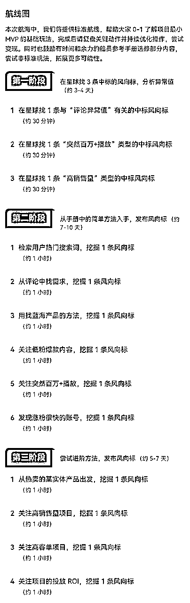

可以看出，这个项目的重点就是：挖掘风向标。

手册中讲了十几种挖掘风向标的方式，每种都讲了详细的操作步骤，建议大家对照手册中的方法，结合航线图任务实操起来，才会进步更快。

具体如何实操，我们继续往下看。

# 一、【项目概述】了解风向标挖掘项目

💡

章节概要

本章节中，我们将一起更清晰地了解风向标挖掘项目。

1.星球的【风向标】发布规则是什么？

挖掘&发布风向标的价值？

挖掘风向标的思路？

## 1.1 星球的【风向标】发布规则是什么？

星球的【风向标】模块，主要用于收集和分享与赚钱相关的短情报和玩法。所有圈友都可以发布，可以说是最新、最快的赚钱方式信息汇集点。

风向标重在[短]与[快]，140 字以内的赚钱信息，只说重点，言简意赅，表达清楚核心玩法即可。有图为佳，有数据为佳。

挖掘到好的机会，可以直接在星球发帖并加上#风向标 标签。

## 1.2 挖掘&发布风向标的价值？@苍述 @az

先人一步获得好的商业机会。

大家看星球的精华帖，应该经常会看到，很多圈友赚到钱都来源于自己挖掘【风向标】时发现的机会，或者在星球的【风向标】里看到的机会。

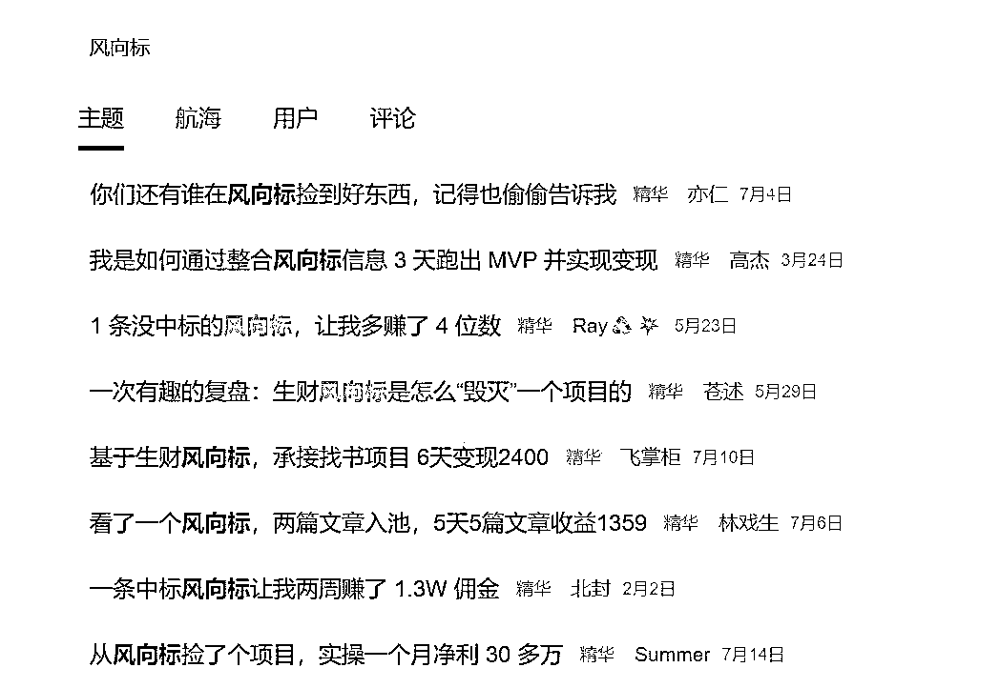

圈友 @苍述：我自己到目前跑通的三个项目，全都是从风向标中获取的，你说有多少。

每一个中标的风向标，背后蕴含的价值都可能超乎你的想象，你没用它赚到钱，很可能只是你思路不行或者你不匹配它的行业方向。

圈友 @az:在连续发布风向标两星期后，当我在寻找风向标的时候，看到我朋友正在欢呼某个海外电视剧上线了，而很多人想看却没找到相关的内容。

于是，我用最快的速度上架了闲鱼，并为他们找到了可以观看的内容，好评很多。通过这件小事，我赚到了风向标的第一桶金。

除此之外，还有更多实打实的业绩：

一条小红书禁言群的信息差风向标，陆陆续续涌现了不少案例，月入过万、月入 5000 的大有人在；6 月有圈友收到一条风向标的启发，跑通抖音四维彩超 AI 项目，实现 17 天收入过万；

7 月有圈友看到企业信用管理的中标，从验证需求小范围 MVP，一个月净利 30W+；

8 月有圈友看到一条养老金加精的风向标，快速搭建了从引流到转化的实践框架，快速变现 9000+；9 月 AI 小和尚的风吹了起来，有圈友借势而起，单月播放破 3 亿，变现利润 10w+；

10 月 P 掉路人的风向标，延伸了一个小红书蓝海项目，圈友观察 12 天，执行 5 天，收益 1159，引流私域 260 人；11 月一条夜校的风向标，也有圈友下场实操，7 天加满 6 个微信群变现 2W+；

可见，风向标确实是发掘商机的好办法。但是，等待别人发风向标，好的机会可能很快会被抢占。

所以，我们得自己掌握挖掘风向标的方法，去挖更多的风向标，才能掌握最一手的信息。

与更多圈友探讨，验证机会猜测

有伙伴可能觉得，如果我发布了某条风向标，不就多了好多个竞争对手，干嘛不自己直接去操作赚钱。

这是新手思维，其实，做生意赚钱，别老是想着做不一样的事情，切入点可以有一些区别，但放到足够大的空间里面看，大概率不是什么新东西，只是你不知道而已。

所以，你以为的商机，可能并不是一个真正被需要的、可以用来盈利的需求。

通过发布风向标，有亦仁大佬判断是否中标，还有这么多圈友共同探讨、交流，也是帮我们进一步筛选验证了。

上周我在星球看到一篇帖子，里面有一个这样的观点，大概的意思是：“发风向标就是赚到了，因为亦仁看过很多赚钱的项目，他对项目和信息的敏锐度，大概率是超过 99% 的圈友的，所以，当你找到一个你认为有价值的风向标的时候，可以发出来，让亦仁来评判一下能否中标，这就可以更进一步的印证自己的敏锐度。如果你发现自己中标的内容越来越多了，这就说明你的洞察力，其实也在稳步提升，慢慢的向高手靠近了。”

当然，或许还会有一些额外的收获——加精，这背后可能就是百万的机会了。

可以获得术值奖励。

如被评上[中标] ，目前几乎是 90% 以上中标，可以获得至少 1 点[术值]。

只要内容能在某些维度对生财有术圈友有帮助，也有机会被评为精华，被加精后可以获得 1 颗龙珠碎片 ～ 2 颗龙珠之间的感谢奖励。

50 点[术值]可以兑换 1 枚龙珠碎片，100 点[术值]可以兑换一张生财有术礼品卡，7 枚龙珠碎片可以兑换一颗龙珠。

内容来源：《一次有趣的复盘：生财风向标是怎么“毁灭”一个项目的》、《发了快 700 条风向标后，我总结出「风向标收集创作指南」》

## 1.3 挖掘风向标的思路？@沐风 @老黄牛

挖掘风向标的关键是：发现异常值。

一个项目的底层逻辑：需求-产品/服务-流量-变现。当项目的任意环节出现异常值，背后都藏着风向标机会。

那什么是异常值呢？

事出反常必有妖。

比如，百万大 V 出 10 万加文章很正常，但百粉账号出十万加，就是异常。异常就非常有价值。

这样的异常值有很多，比如：

在朋友圈频繁刷到某个产品的投放广告，这也是异常。很可能这个产品利润可观，才能一直花钱投放。点击进去，假装顾客了解信息，可能就会挖到有价值的项目思路。

某条视频的留言区，频繁出现【求图】【跟团】【怎么领】等等直白的需求表达，那背后大概率藏着机会。

刷短视频，看到某个新号涨粉很快这也是异常，现在起号这么难、他为何可以快速涨粉，挖掘背后原因就是机会。

粉丝量不多但销量不错的，很可能藏着蓝海小众赛道。比如，星球的这个风向标。

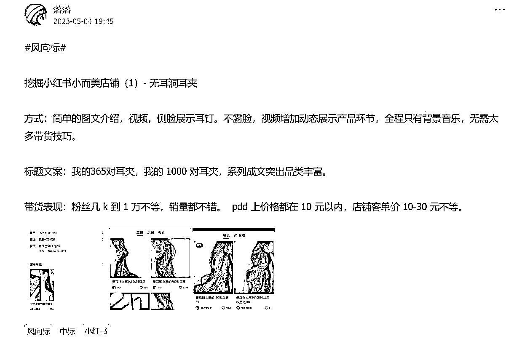

不只数据好值得关注，数据一般也可能是异常；某个账号粉丝不多、笔记数据也普通，但一直坚持日更；很可能说明他虽然粉丝少，但转化很稳定。背后可能就藏着蓝海小众赛道。

......

大佬也用异常值。

著名投资人徐新在一次论坛上，揭秘了美团如何逆袭饿了么。

美团有一个专门的监控系统，跟踪市场 上所有的 APP，谁的日单量超过 1000，就拿过来照抄。

就在这个时候，饿了么进入了他们的视野。王兴很快下达了公司的战略，三个字：抄抄抄！这样的战略持续了半年，不用做任何创新。避开饿了么的中心城市，美团的外卖业务很快就发展起来。

这个案例中，超过 1000 单量，就是很异常，异常就是机会。

那我们如何发掘这些异常值呢？

在需求-产品/服务-流量-变现这四个项目环节中，会出现不同的异常值，这个异常值可能是数据上的波动，可能是平台政策变化、或者一种新的赚钱模式出现。

在手册的【项目实操 1/2】如何挖掘风向标。我们就会从需求、产品/服务、流量、变现四个环节出发，用真实案例教大家如何通过不同类型的异常值，来挖掘风向标。

## 1.4 如何更好挖掘风向标？

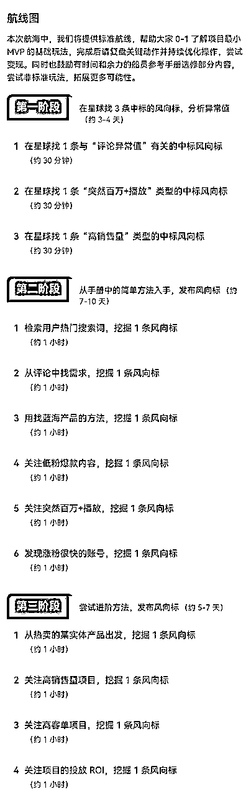

第一阶段 在星球找 3 条中标的风向标，分析异常值我知道，有些新手伙伴没有挖掘过风向标，可能一下子不知道从何下手。我们可以先尝试分析别人的风向标。

具体如何分析呢？只需要关注异常值就好。挖掘风向标的关键就是异常值，所以，我们可以先看看别人一般都关注的是哪些异常值。

我们可以在星球中点击【中标】，逐条看中标的风向标。对照手册中的十几种方法，分析它的异常值。

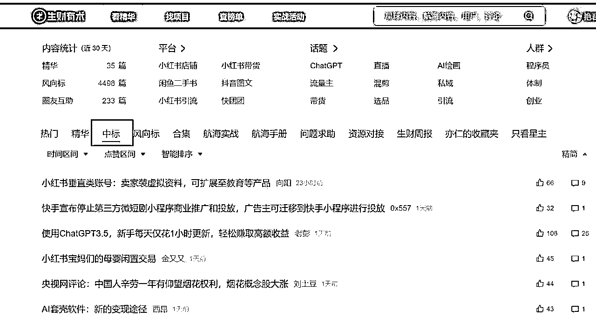

手册中提到了十几种异常值，建议大家可以先从简单的入手分析，分析不出来的可以先放下。

1.

异常值一：内容突然百万+浏览/播放。（具体挖掘方法见【2.3.2 突然百万+播放】）

下面这条风向标，就可以这样分析：

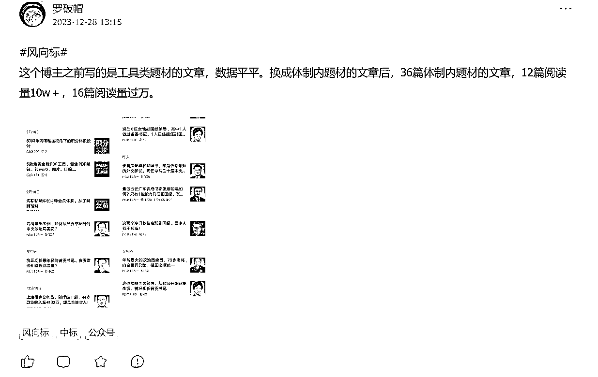

先分析异常值

“之前数据平平，换成体制内题材后，36 篇文章有 12 篇 10w+”，是典型的突然 10w+。属于手册中“从流量出发，挖掘风向标”中的“突然百万+播放”。

再尝试思考这条风向标是如何挖掘到的。

有可能是关注公众号爆文领域的圈友，看到某条爆款文章后，点击进入该号主页，看了它的粉丝量，并翻了几乎所有历史发布文章。发现这个号之前写的工具类题材数据一般，更换体制内题材后，数据才变好了。

这里分享个方法，如果自己想不出来，可以直接链接该圈友去咨询。不但能够学到方法，也是非常好的链接圈友的方式。就某个共同问题进行深度探讨，大家也更容易打开话题、了解彼此。

更进一步，如果是自己，可以如何参考这个方法，挖掘风向标。

平时在刷公号文章时，可以多留意文章下方的推荐文章，一般是浏览量比较高的、数据较好的，再点击进入主页留意粉丝量和历史文章数据，看是否有异常值。比如，低粉爆款、突然 10w+等等。

异常值二：：某个新账号涨粉很快或者爆款很多。（具体挖掘方法见【2.3.3 涨粉很快】）

比如，分析下面这个风向标。同样三步走分析。

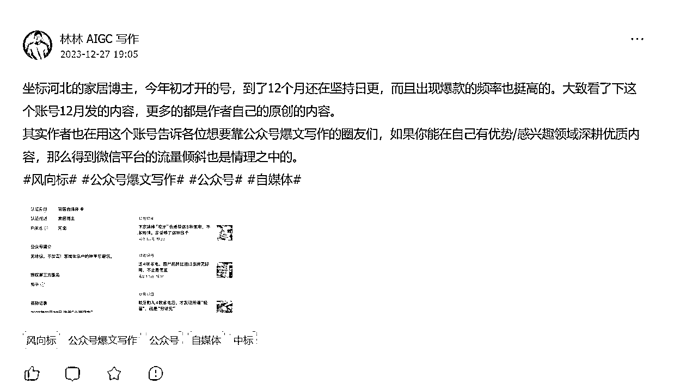

先分析异常值“今年年初才开的号”说明是新号，“爆款频率高”。符合手册中“从流量出发，挖掘风向标”的涨粉快或爆款多。

“还在坚持日更，更多都是作者自己的原创”，号主会坚持投入时间原创日更，说明账号大概率正反馈还不错。

再尝试思考这条风向标是如何挖掘到的。

这条，我就去链接了这位圈友@林林 AIGC 写作，问了他是如何挖掘到这个风向标的。

他当时是在撰写一篇与家电消费有关的推文，就尝试在公众号内部找资料，结果就发现了河北这位博主。写了 1 年多的家居公众号，而且出现了不少爆款。

一是自己平时关注的领域；二是搜索关键词；三是看到数据好，就去进一步看了账号的成立时间、粉丝量、更新频率、历史文章爆款率这几个数据。

他强调：如果一个公众号它成立时间越短，但是爆款越多，那就说明他越厉害。分享价值=爆款数量÷成立时间。

更进一步，如果是自己，可以如何参考这个方法，挖掘风向标。

上面提到的几个关注数据，就非常值得学习，尤其是成立时间和爆款率。以后看到数据不错的文章，就可以去看下这两个指标。

异常值三：某个品短时间有很高销售量。（具体挖掘方法见【2.4.1 高销售量变现】）

比如，下面这个风向标。同样三步走分析。

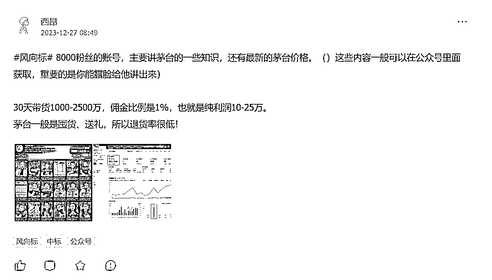

先分析异常值

“30 天带货 1000-2500 万，纯利润 10-25 万”，就是短时间（30 天）有很高销量（1000-2500 万）。

另外，它还有很多其他异常。低粉高销量，只有 8000 粉丝却做出了千万销量。

再加上内容门槛低、退货率低等等，说明门槛低，可以快速上手实操。

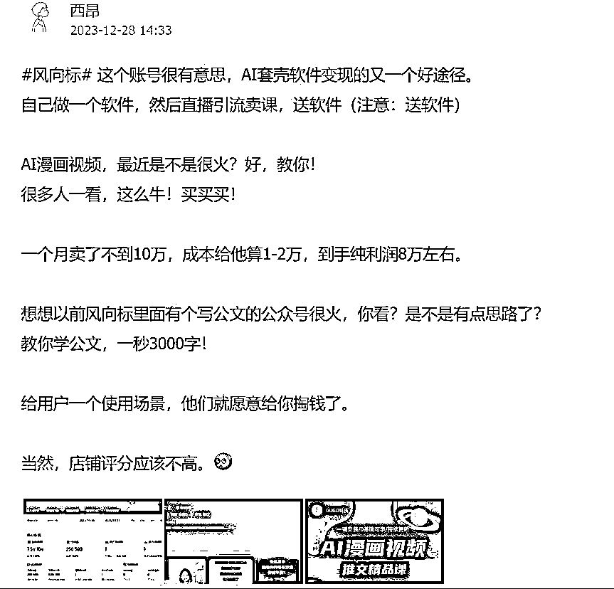

更进一步，如果是自己，可以如何参考这个方法，挖掘风向标。

可以用任意自己熟悉的数据平台，分析自己感兴趣的平台和垂直赛道。比如，找小红书平台+日用品赛道+近 30 天销量，找粉丝量低于 1 万，但销售量高的；抖音平台+家居赛道+近 30 天销量，找粉丝量低于 1 万，但销售量高的；

等等。

大家可以参考以上分析思路，尝试分析星球中的中标风向标。航线图任务是一共分析 3 条，但我建议大家可以一天多看几条，你看的越多对异常值的理解也会更深刻。

如果你已经是风向标挖掘老手，也可以跳过这一阶段，直接挖掘并发布风向标！

第二阶段 从手册中的简单方法入手，发布风向标手册中从做生意的四个环节：需求-产品-流量-变现，讲了 14 种方法。里面有些比较复杂，但也有很多方法很简单。比如，关注低粉爆款——粉丝量很少内容却爆了；关注赞藏量高的笔记留言区，是否有很多人表达需求等等。

手册把这些简单的方法和相关的异常值整理成了一张表格，新手可以先从这些简单的方法入手。《12 月航海|风向标挖掘|常用异常值方法汇总》当然，如果你是老手，也可以使用自己的方式挖掘风向标哦！

第三阶段 尝试更多挖掘方法，发布风向标

使用手册中的更多方式、或者自己探索的方式，挖掘风向标。

注意：航线图中的方法仅作为建议，不是强制要求，用自己的方法挖掘&发布风向标，打卡后都算完成任务。

内容来源：《作为普通人，我们该如何挖掘商机？ 》、《把生财有术当兼职网，这是有多可惜！》

# 二、【项目实操 1/2】如何挖掘风向标？

💡

章节概要本章节中，我们将一起学习如何挖掘风向标。

从需求、产品/服务、流量、变现四个环节来看如何寻找异常值，挖掘到风向标。

✅2.1 从需求出发，挖掘风向标

✅2.2 从产品/服务出发，挖掘风向标

✅2.3 从流量出发，挖掘风向标

✅2.4 从变现出发，挖掘风向标每个部分我们都会给出 3-4 种挖掘方法，并且配以一个实操案例，给大家演示操作步骤。

最后，还给出了十几个常用的信息挖掘网站。

✅2.5 常用的信息挖掘渠道

1.挖掘风向标的方法建议融会贯通使用，一个信息可以通过需求、产品、价格等多方面，挖掘出很多种可能性；

2.

手册里虽然提供了十几种方法，但依然只是一部分，机会挖掘的方法甚至可以说是很难穷尽的。希望大家实际操作中，不要局限于手册内容，可以尽情展开想象，多多讨论交流，挖掘更多可能性。

赶快开始行动吧！

## 2.1 从需求出发，挖掘风向标

### 2.1.1 如何从需求出发，挖掘风向标？@沐风

我们前面说讲过，任何一个项目的底层逻辑基本上都可以概括为：需求-产品/服务-流量-变现。

也就是说，需求其实是一切商业活动的起点。需求也是我们挖掘风向标机会的重要切入点。

在进行需求挖掘的时候，我们最好是基于自己当前所处的行业或者已经有一定了解的行业去挖掘，这么做有两点原因：

1.

对于我们当前所处的行业或者已经有一定了解的行业，我们可以利用自身经验，更快地判断出来这些需求到底是真需求还是伪需求。

2.在判断需求的确存在的情况下，我们就可以直接利用现成的行业资源和优势，更快的围绕着这个需求去为目标用户提供产品或服务，并最终实现变现。

而对于一个我们不熟悉的行业，我们挖掘出来的需求则很有可能是伪需求，或者即便这个需求的确存在，我们也不具备相应的资源去快速落地，而对于大多数普通人来讲，想要整合这些资源，可能又会增加不少难度，那么，这样的需求，即便我们发现了，对我们来说价值可能也没有那么大。

理解了这一点之后，我们就可以开始进行需求挖掘了，那么，我们该如何下手呢？

一共有 3 种方式：

1.找用户热门搜索词。

从评论中找需求。

从用户、场景、需求三个维度，拓展更多需求。

下面，我们就逐个来讲这 3 种方法，并各用 1 个案例进行演示。

内容来源：《作为普通人，我们该如何挖掘商机？ 》

### 2.1.2 找用户热门搜索词 @亦仁

#### 2.1.2.1 方法

我们可以在各类平台的搜索框中，检索自己工作中或者生活中常接触到的词，找用户热门搜索词。

1.

可以用的平台非常多。搜索类的，比如：百度、Google 等等。流量类的，比如：小红书、抖音、微信、知乎、微博、淘宝等等。只要有搜索功能的平台，都可以试试。

在上述平台检索自己工作或者生活中接触到的词。

自己生活、工作中常用的 APP ，比如，微信、微博、支付宝、instagram、Facebook 等等。

这些产品一般用户基数都很大，围绕他们挖掘出的需求，体量一定不小。

日常的任何需求，比如，你想要去西藏旅游，可以搜“西藏旅游”，你想买电动牙刷，可以搜“电动牙刷”等等......

3.

检索之后，浏览器会自动跳出一些用户搜索量大的关键词，就值得我们关注。会被用户大量搜索，说明需求不小。

4.继续在各大平台搜索，看市面上有没有人做出了相关的产品，需求量如何、变现如何，还有没有空间等等。就会发现需求量大、变现好的机会。

#### 2.1.2.2 案例

下面，就分享如何从【Instagram】这个产品出发，找到真实痛点和产品机会。

第一步，在浏览器上搜索【互联网巨头产品名】，发现需求。

此处用 Google 搜索『Instagram』。

搜索后，发现有以下几组关键词。

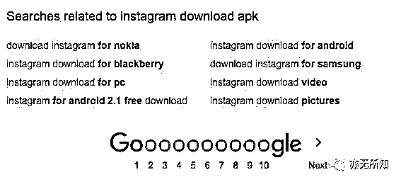

找其中官方没有满足的需求。

除了最后两个词『instagram download video』、『 instagram download pictures』，其余的搜索官方都已经满足了需求。

第二步，确认痛点。

难道在 Instagram 上下载图片和视频有什么需求未被满足吗？

继续 google ，果然，在网页 Instagram 上确实无法右键保存别人上传的图片，右键另存为的功能被限制了。这一设置，也许就难倒了 90%以上的普通用户。

事实上，用户确实会有这样下载图片和视频的需求，这个痛点真实、有效。

第三步，挖掘现有产品，分析盈利模式。

继续 Google『instagram download pictures』，在搜索结果的第一页出现了 6 个解决此痛点的小工具。

点开排名第一的网站，功能和模式都比较简单，直接通过输入 Instagram 图片的链接就可以将图片直接下载下来，盈利方式是 Google Adsense 广告系统。

内容来源：《通过 Google 挖掘细分市场的一个案例》

### 2.1.3 从评论中找需求 @梨云

就是在文章/视频的留言区，找用户高频使用的需求词。

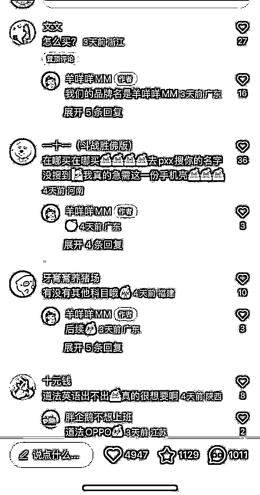

这些词能被用户频繁使用，这些词的背后，都是一个个真实的用户需求。

#### 2.1.2.1 入门方法

平时刷小红书或者其他平台时，可以多关注评论区，里面往往藏着大量需求。

比如，【求图】【跟团】【怎么领】等等，这些评论区里直白的需求表达，对应的都是商机满满的笔记。

如果能找到这些笔记，找到对应产品，摸清变现模式，评估收益，就能挖到一些正在低调赚钱的项目。

把留言区看到的需求词，比如【求图】【跟团】【怎么领】，放到各数据分析平台，见 2.5 【放链接】。小红书看到的就用小红书数据平台，抖音看到的就用抖音数据平台。

按笔记评论搜索，顺藤摸瓜就能找到了笔记、对应的产品或服务。

#### 2.1.2.2 案例

这里以小红书为例。

把三个需求词【求图】【跟团】【怎么领】，放到千瓜数据的按笔记评论搜索，顺藤摸瓜就能找到了笔记、对应的产品或服务。

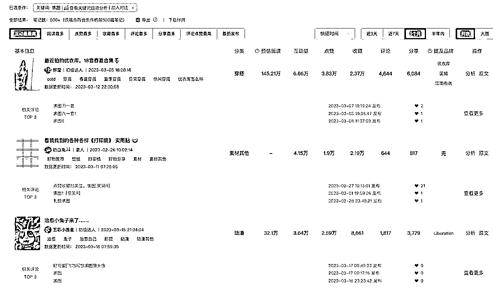

ps：千瓜这玩意儿其实价格挺贵的，大几千，当然你也可以闲鱼上找会员 25 天一天。

2.通过标题、笔记原文和主页，逐个看、整理，筛选了不少有意思的变现项目，我整理了一个思维导图。

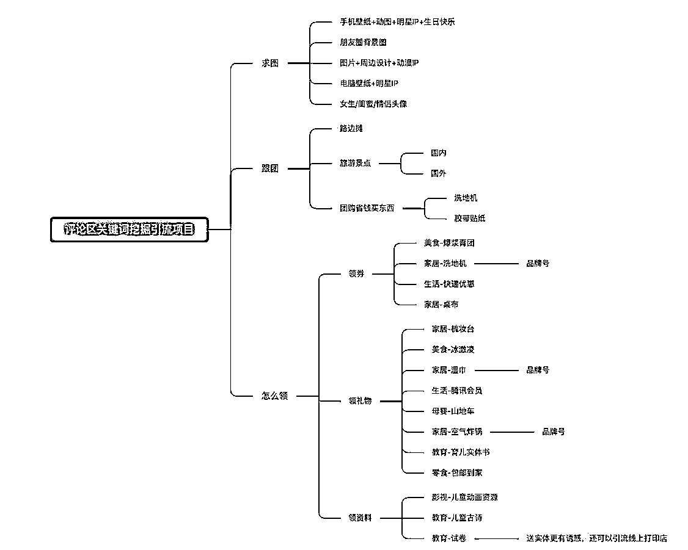

我们会看到，引流不止送资料的方式，更不止在学习考试赛道。

光是 3 个评论区的需求词，就已经能发现这么多东西了，如果我们有一个，能涵盖全部小红书赚钱项目类型的需求词库呢？

#### 2.1.2.3 进阶方法

汇总平台近期的笔记，至少一百多篇，收集评论区的需求词。

将上面的需求词逐个放到数据平台按笔记评论检索，找到笔记、对应的产品或服务。

对笔记进行批量分析，看各赛道的占比。哪个赛道占比越大说明需求越大。

找到细分赛道后，就要利用标题分析，挖掘细分赛道上的赚钱项目。

可以把该赛道的标题投喂给 ChatGTP，让他先提炼出营销产品，然后再根据营销产品，拓展出相关品类，以品类，倒推细分赛道。

#### 2.1.2.4 案例

继续以小红书为例。

第一步，汇总平台近期的笔记，收集评论区的需求词。

如果已经有百来篇笔记的汇总，然后通过链接收集评论区需求词，效率就会高很多。

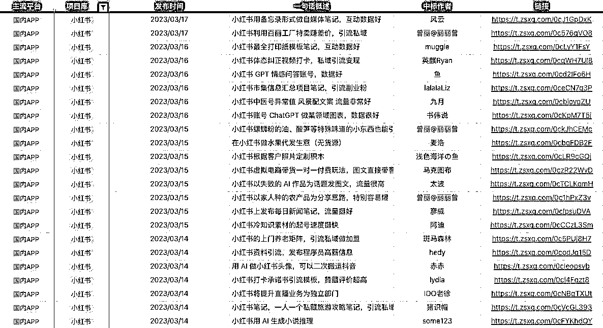

生财团队汇总并且分类了 2000 多条中标的风向标，其中小红书有 200 多条，可以直接用了！

风向标中标合集｜生财有术第六期

这里的每一条，都可以追到评论区，取得需求词。

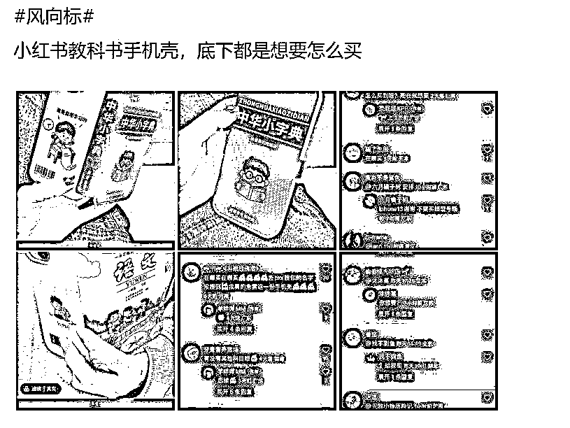

但因为这些评论的关键词都太乱了，于是继续手动分类，构建起一个评论区需求词库。

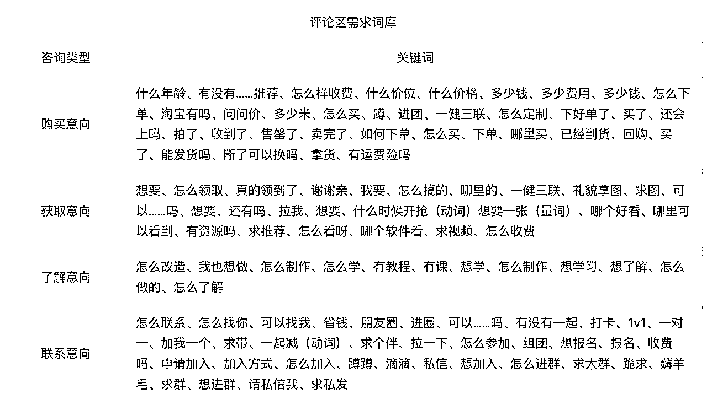

ps：这个需求词库不只小红书可以用，其他平台其实也可以用。

第二步，将上面需求词逐个放到千瓜数据的按笔记评论搜索，顺藤摸瓜就能找到了笔记、对应的产品或服务。

比如，【求资料】这个词，搜索出来近一个月的相关笔记，一共 1000 多条。

第三步，对这些笔记进一步批量分析。

先去重，相同的 ID 只留 1 个。然后重点观察笔记所处的赛道占比。

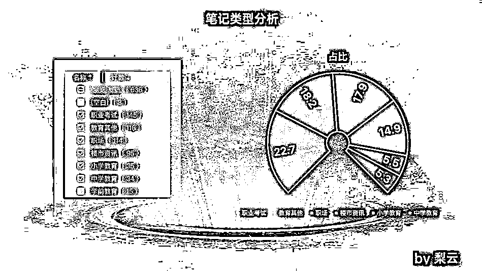

在我的认知中，学科号是非常卷的，没想到，并非如此。

这样，我们就了解了资料赛道，哪些方向需求量比较大。

第四步，找到细分赛道后，就要利用标题分析，挖掘细分赛道上的赚钱项目了。

这里，用到 ChatGTP。通过投喂标题，让他先提炼出营销产品，然后再根据营销产品，拓展出相关品类，以品类，倒推细分赛道。

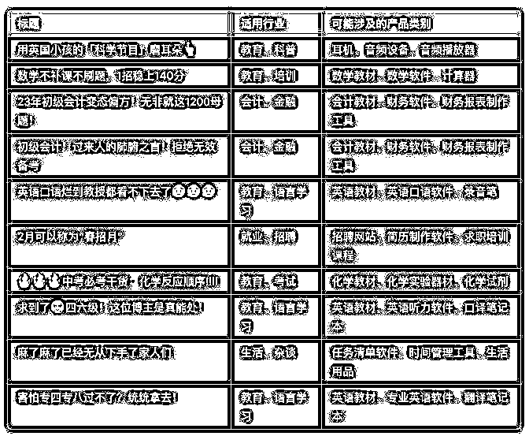

内容来源：《在小红书上，如何挖掘出 1000 个适合普通人的赚钱项目》

### 2.1.4 从用户、场景、需求拓展更多需求

#### 2.1.4.1 方法

基于上面方法找出的需求，如果想找到竞争更小的市场或者在这个细分市场做到更大甚至垄断，我们就可以进一步使用拓展思考法，挖掘更多需求。

具体思考下面三个问题：用户是否可以拓展？

就是需求的主体可以切换。

比如，前面去西藏旅游的是你自己，如果换成父母呢？爷爷奶奶？老人？孩子？

场景是否可以拓展？

就是需求所在的地理位置可以灵活切换。

依然是旅游的例子。全国有这么多省市，我们是不是可以根据自己所在的区域，来尝试一下看看会不会有什么我们意想不到的需求呢？

需求是否可以拓展？

比如，去西藏可以不只旅游，还可以有其他需求，比如西藏穿搭、西藏朝拜等等。

还有一个方法：将需求中的三个词拆分开，分别替换同类词。

比如，『西藏旅游』可以拆为：西藏+旅游。

#### 2.1.4.2 案例 @亦仁

以前面案例中找到的需求--Instagram picture download 为例。

我们继续拓展思考下面三个问题，挖掘更多用户需求。

用户是否可以拓展？

场景是否可以拓展？

需求是否可以拓展 4.

从用户维度拓展：

从 Quora 上看到 Instagram 用户量前十的国家分别为：美国、俄罗斯、巴西、土耳其、英国、波兰、加拿大、法国、日本、德国。

聪明的你可能已经想到，做其他语言的网站。

是的，我们中国人在搜索的时候是习惯搜索『Instagram picture download』还是『Instagram 图片下载』？明显是后者。同样的，其他国家的用户也会习惯于用自己的国家语言来搜索相关关键词表达需求。

我通过 Google 翻译将『Instagram picture download』翻译成俄语与日语，通过 Google 搜索试了下，发现均有相关的工具站，虽然流量少了点，但竞争也明显小了很多，其他语言的网站也许是个不错的机会。

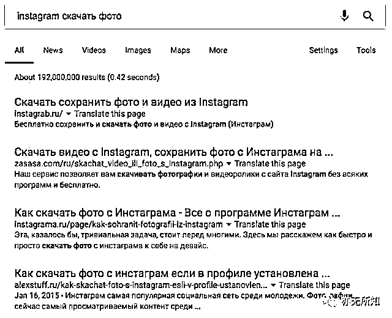

5.从场景维度拓展：

用户会在哪些场景里搜索『Instagram picture download』？

Google Paly，App Store，微博，微信，微信小程序，Quora，淘宝，浏览器插件商店等等！

对应的，也许是一款安卓 App，一款 IOS App，一款微信小程序，一个微信服务号，直接提供下载图片的服务；或者是一篇详细的下载图片方法介绍，在微博、微信、Quora 搜索时直接呈现出来；也或者是直接在淘宝用很低的价格提供下载或者相关的服务。

我们继续来找找有没有相关的产品以及数据如何。

在 Google Play 下载市场上

搜索关键词，可以找到提供图片下载服务的 Android 应用 InstaSave，达到了惊人的 1000 万- 5000 万次下载，14 万的点评！

Instagram 的下载次数是 10 亿～ 50 亿次，也就是说，1%安装 Instagram 的人会安装 InstaSave。

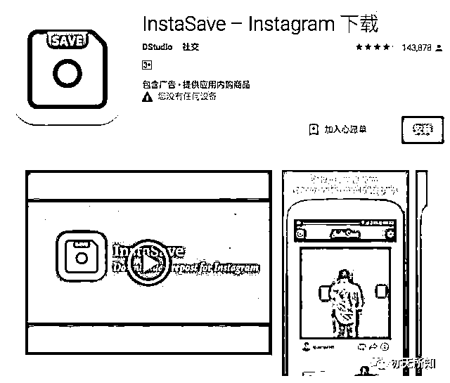

在微博上

搜索 Instagram，若干个粉丝量几百万的微博账号。

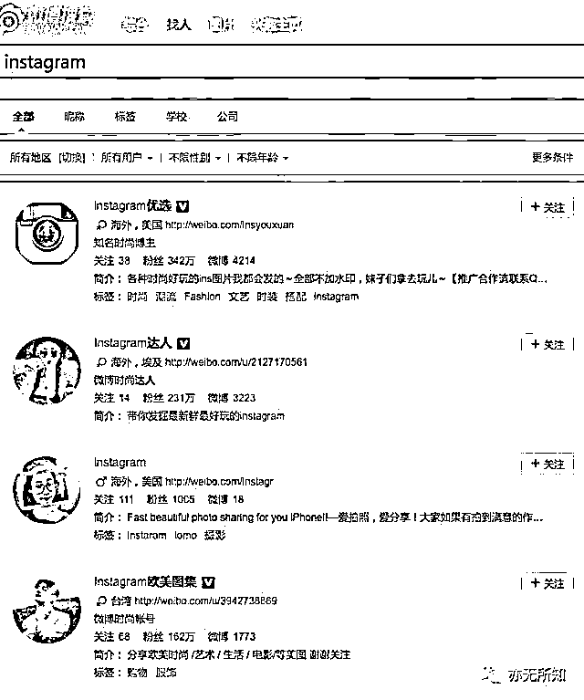

在淘宝上

搜索 Instagram 关键词，标价 1 元的 Instagram 的相关服务售出 10 万多份。

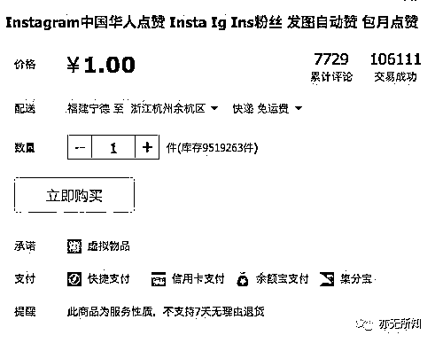

在微信公众号上

在曹大转发我的文章下面有这么一条留言，一个叫 inskeeper 的号，提供 Instagram 图片下载服务，获取到 20 万用户。

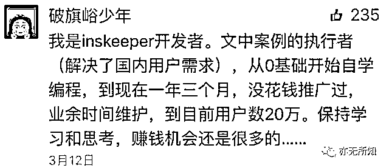

从需求维度拓展：

我们可以用 【关键词 依次 + a～z 这 24 个字母】比如『instagram a』、『Instagram b』、『Instagram c』等等，甚至重复+aa/bb/cc，比如，『Instagram aa』、『Instagram zz』？将会发现一个新世界。

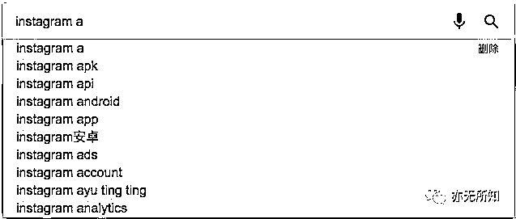

我将『Instagram a』～『Instagram z』以及『Instagram aa』～『Instagram zz』的 Google 推荐关联搜索词全部导出了，一共 521 个词，其中不乏蛮多有趣的需求。

还有一个方法：将需求中的三个词拆分开，分别替换同类词。

比如，『Instagram picture download』可以拆为：Instagram、picture、download。

Instagram=>Youtube、快手、美拍、秒拍、Vine、Twitter、Facebook...

图片=>音频、视频、文字、字幕、歌词、壁纸、头像、播放列表、用户名...

下载=>编辑、合并、上传、备份、分析、传播、点赞、增粉...仅列出来的， 就有 798=504 种组合。

随意看一个：

Youtube 的 mp3 提取站 youtube-mp3.org 在 SimilarWeb 搜索，可以看到，月 2.7 亿访问，日均近 1000 万的访问人次。

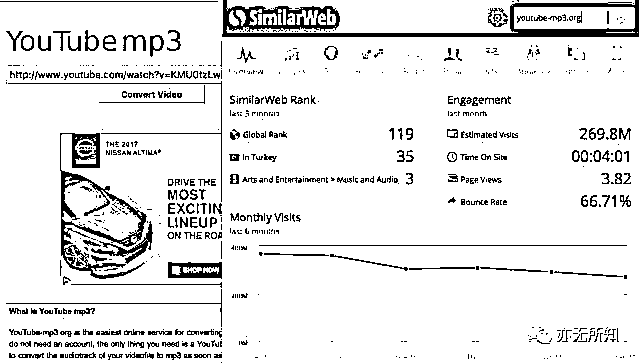

总结一下，从一个需求出发，在用户解决问题的完整路径上，思考每一个节点，是否有拓展的可能性，可能会发现惊喜！

内容来源：《如何找到 1000 个小思路？》

## 2.2 从产品/服务出发，挖掘风向标

### 2.2.1 如何从产品/服务出发，挖掘风向标？@星辰

前面我们讲到，从用户视角来看，能够从用户需求切入发现风向标。而我们也可以转换一个视角，从现在市面上已有的产品/服务，来找到异常值，发现真实存在的机会，看到我们曾没有捕捉到的用户需求。

每一个合理存在的产品/服务，都一定有对应存在的需求空间，我们要做的，就是从这个产品本身出发，解决这几个问题，从而找到机会：

1.

谁是目标用户？

2.目标用户用这个产品/服务是为了解决什么问题？

目标用户在哪里聚集？

当前卖家是怎么进行售卖的？

产品成本如何？

产品的上下游是什么？

7.有什么关联业务存在？

……

怎么找到这些产品？建议多去产品密集的平台看一看。

比如，我们每天抽空一直刷微信视频号，如果关注的是选品，当我们看到所有跟选品无关的内容，全都点击不感兴趣，然后慢慢的让系统推荐所有各种各样的产品，就会发现非常多以前从未想到过的产品，其中就很可能出现一些风向标；

再比如刷小红书的时候，看到某博主的服务，不管自己有没有需求，也可以去咨询下，看看对方是如何引流的，有没有你不知道的，比较有新意的点，加到私域以后，看看人家朋友圈是怎么做的等等；还有，风向标也不一定只在线上，身边也可能有很多，我们也可以去父母等长辈的手机上看看，去宝妈的手机上看看，看他们平常用什么 APP，他们购物车里都是些什么东西等等，没准都能发现之前完全不知道的东西，比如有一条中标的是老年人用的拍打袋，就是一个布袋加点核桃。像这种产品一般年轻人根本不可能知道，但在老年人群体中，这个产品的需求不小。

根据产品的展现形式和受众范围不同，我们可以分为以下几大类：

实体产品虚拟产品

差异化服务

蓝海产品需要注意的是，这样的分类下可能会有一定的交集，但不影响我们发现更多产品的思路，打开对产品的想象空间。

接下来就从这四类出发，看看如何通过产品来挖掘风向标。

内容来源：《谈谈我对生财这个宝库的使用心得》

### 2.2.2 实体产品

#### 2.2.2.1 方法

第一步：找到一个近期热卖的实体产品为了找这个产品，我们可能有这几种方法：

从自身的产品需要，自己身边的产品出发确定从淘宝榜单、抖音精选联盟、闲鱼榜单、视频号选品中心等渠道抓取近期热销的产品

从蝉妈妈、蝉小红、巨量百应等第三方平台抓取近期热销的产品排行榜日常有意识的选择刷视频号、抖音、小红书等平台的内容，只感兴趣产品相关的内容

根据近期的节日情况，季节变换，看看大众的关注点都在哪些特定的事物上面第二步：市场调查，在各平台搜索产品，查看大部分卖家的销售模式是怎么样的

一般情况下，我们可以优先在主流平台搜索，比如淘宝、闲鱼、抖音、小红书、视频号等，看看哪个平台上的销量更高，商家的售卖模式是什么样的。

第三步：了解产品成信息和成本，看是否有入局机会

比如是否有周边商品业务、 1688 进货渠道、是否有一些可以低价收购的渠道、是否需要一个成熟的供应链、是否有技术壁垒等等。多方面对比和了解，找到更低成本的产品渠道。

#### 2.2.2.2 案例 @安之

下面，就分享如何从【台球杆】这个产品出发，找到一门生意。

第一步：确定产品因为爱好打台球，但是台球厅里的杆不好用，所以有了打算买球杆的念头。开始只想选一个比公杆好用的就行，于是打开了闲鱼，结果打开了一个新的大门，发现了很多人在卖二手球杆，而且销量都不错。

第二步：球杆市场调查了解球杆知识：

主流分大头杆和小头杆，尤其是当下火的品牌如：皮尔力，野豹…卖的很好，但是价格虚高，球杆好坏要看木料的年限，如小头杆，基本都是白蜡木的，所以那些老杆子，有些发黄的，是真的好用，这是自用的情况，想要靠这个挣钱，还要依靠品牌的背书。

在抖音搜索：

抖音是人数最多的平台，先看看大家在做什么，观察一圈发现，很多人在做二手球杆，都是专业的，很少有个人在抖音单独出售自己的球杆，对比价格，抖音的价格要比闲鱼的价格贵一些，评论依旧有很多人在问价格和联系方式。

在闲鱼搜索：

发现卖球杆的超级多，一般分为三类

（1）专业的卖家

出售很多球杆，成色好（可能有维修）价格中等，比抖音价格低一些，店铺链接多，详情中不知道和谁学的关联一堆品牌，会写可以置换。

（2）个人卖家

价格低，成色不一，基本无修，店内东西很杂或很少，文案比较简单，能读出实在的感觉。

写可以置换。

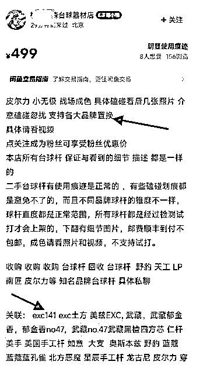

（2）个人卖家价格低，成色不一，基本无修，店内东西很杂或很少，文案比较简单，能读出实在的感觉。

第三步：找到便宜的球杆

闲鱼内不断搜索球杆产品，目的是让推荐把你的闲鱼首页猜你喜欢那都变成球杆，看到一款球杆觉得价格还不错的时候，开始的时候要多方对比：（1）抖音对比价格看下最低价和最高价以及成色如何

（2）闲鱼回收贴那里咨询几家，看看价格如何，确认好心里回收价格

（3）闲鱼看下该款球杆卖价及成色，来确定这个杆子是否有利润

当你首页有很多球杆推荐的时候，你会发现有很多个人卖家，根本不知道自己的杆怎么卖，值多少钱。这些杆子才有更多利润。

这些人的普遍特征：

（1）主图极差，很难看出是什么杆子，有的甚至大头小头都看不出来

（2）几乎不写品牌，只写 球杆，桌球杆，老杆子…

（3）还有一些人会卖一套球杆，冲杆，跳杆，打杆（三个词排列组合的方式去搜）一套卖…还有的会置换，相同价格置换，我就用一个杆换过 3 个，利润在 700 左右。

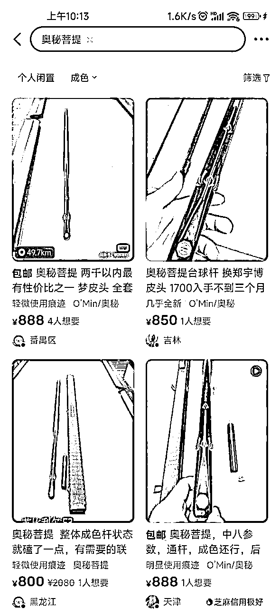

结论：那么二手球杆回收挣钱，看来很简单，就是低价收个人的，然后再卖！

如（2）中的球杆 400 元收回，用球杆清洁粉处理一下，卖个 600 还是没问题的，小 200 利润是可以到手的。

内容来源：《用生财思维，边玩边挣钱？! 》

### 2.2.3 虚拟产品

#### 2.2.3.1 方法 @黄岛主

除了实体产品之外的产品，都可以称为虚拟产品。比如我们经常看到的 APP、工具站、模板、在线资料、在线课程、小吃配方、代拍、代充、账号、游戏代练、凑单、中间人等各类服务。

从虚拟产品挖掘风向标的步骤，和实体产品的步骤相似：

第一步：找到近期热卖的虚拟产品目前的主流平台上，实体和虚拟产品都非常丰富，因此找实体产品的方法同样可以应用到找虚拟产品上：

从自身的产品需要，自己身边的产品出发确定从蝉妈妈、蝉小红、巨量百应、生意参谋等第三方平台搜索虚拟产品关键词

日常有意识的选择刷视频号、抖音、小红书等平台的内容，只感兴趣虚拟产品相关的内容

关注微信朋友圈，从广告投放以及微信好友的朋友圈动态进行观察除了以上和实体产品相同的路径外，虚拟产品还可以有以下几个有效的挖掘方法：

批量抓取课程、资料等信息，通过数据分析找到值得挖掘的虚拟产品关注近期的热门领域，比如 AI、天涯神贴、高考志愿报考等等

如果想找工具站、APP 类的产品，我们也可以关注一些排行榜网站，看看近期数据不错的应用工具有哪些

整理所关注行业的通用词根，并通过 5118 这样的关键词工具进行关键词挖掘，找到更明确的需求以教育赛道的通用词根举例：

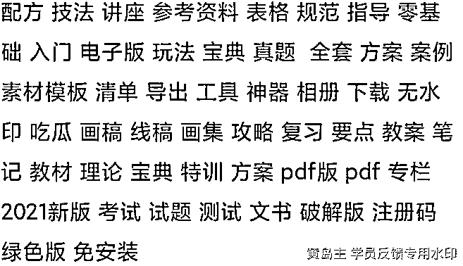

搜索词根：培训，会发现很你没见过的词汇：

第二步：市场调查，在搜索引擎、抖音、小红书、知乎等平台搜索关键词，找到用户搜索意图

如上一步，我们找到了一个没见过的培训叫 “UG 建模培训”。就可以在各平台了解 “UG 建模”相关长尾词，可以看到用户都在搜

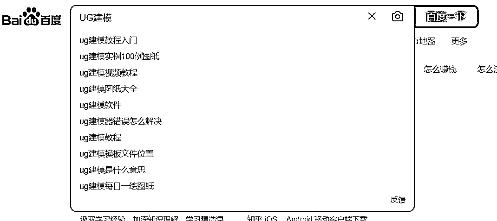

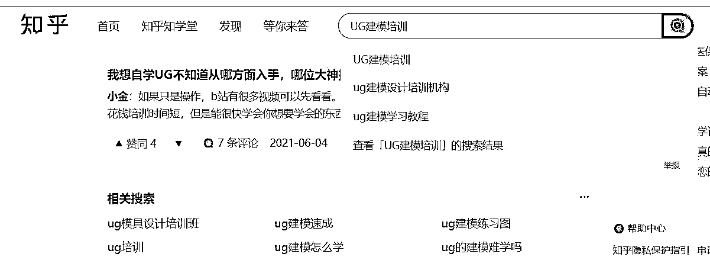

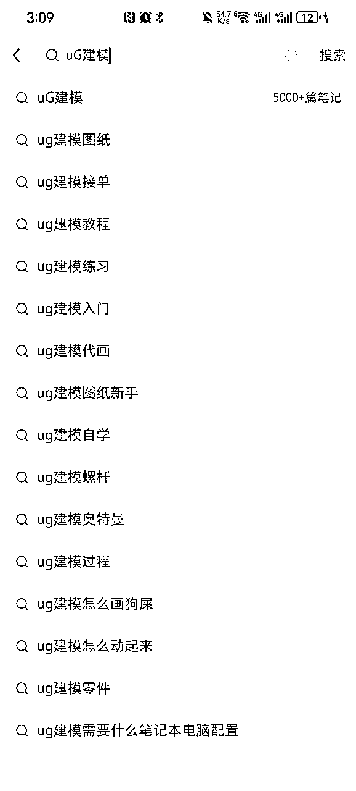

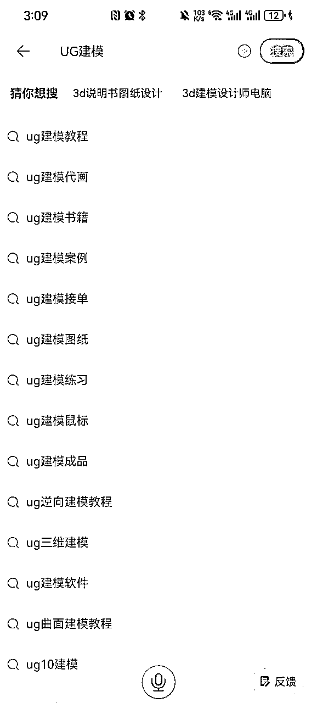

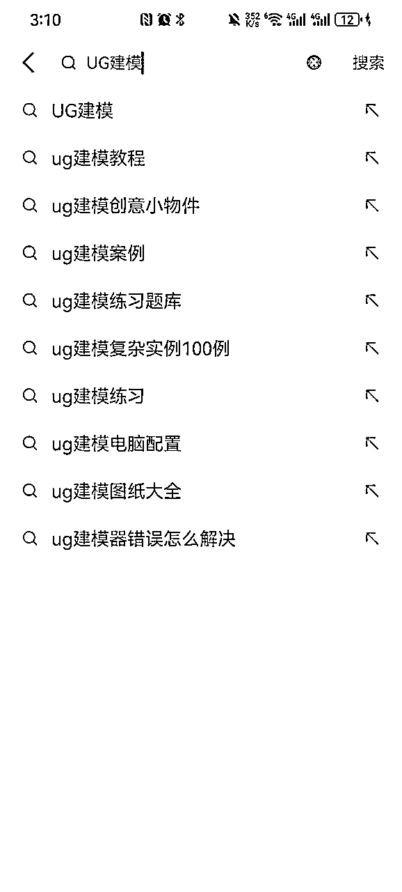

第三步：了解虚拟产品的门槛和来源，看是否有入局机会从这些搜索词，我们可以看到很多不同的用户搜索需求：

UG 建模的教学 UG 建模成品

UG 建模软件 UG 建模练习题库

UG 接单

……

我们可以把这几个点都拿出来分析下，看每个品有几个同行在竞争。这个时候我们需要分析同行数量是多少、月销量是多少、分析评论区是否为最新时间段、分析商品是否有著作权等等，按照这个去做就行了。

另外，你也可以在了解的过程中评估一下项目的门槛，判断这个项目的入场要求是什么：

1.资料、课程等产出难度怎么样？

该虚拟产品对专业技能是否有要求？

该虚拟产品需要我们投入多少时间？

……

附：筛选虚拟电商产品能否上线的注意事项

1、分析产品是否带人名、软件名、品牌、书籍等

2、分析产品是否需要出版物商家资质

3、分析产品标题是否有商标和著作权 4、分析这个产品所在店铺的保证金是多少

通过这个筛选思维，可以有效的判定这个品是否能做，是否违规等，所以大家可以尝试下去操作看看。

内容来源：《淘宝蓝海虚拟选品实操复盘，选对品可日入 300-500！》

#### 2.2.3.2 案例 @痴海

下面，再分享一下，如何在抖音上分析【知识付费课程】，找到一门生意。 （案例所涉及数据可能过时，请重点关注思路。)

在抖音上做知识付费课程来赚钱，那首先我们要知道：目前哪些课程卖的是最好的

什么类型的课程占比最多

这样可以快速帮助我们找到热门的知识付费赛道，分析其中的商业模式，学习借鉴。千万不要自己拍脑袋去想，我做 xxx 是不是可以在抖音上赚钱。一定要学会通过数据来分析市场情况，毕竟同行是最好的老师。

所以我们第一步就是要去收集抖音知识付费数据，而这些数据都某个 app 上都有，大家搜索下就很容易找到了。

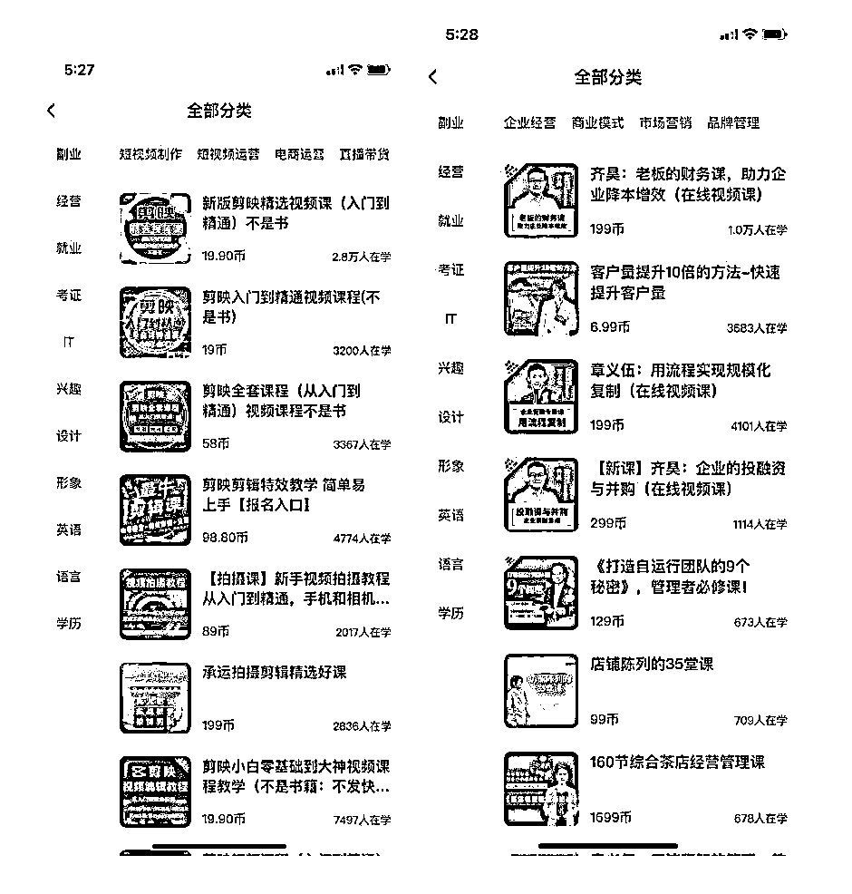

在 app 的分类中一共有 11 大类，每类下还有许多小类目。排名第一是副业，这里的副业大多都是教大家如何拍好短视频。抖音是短视频 app，会有这多教如何拍摄短视频的课程也是能够理解。

手动挨个去翻 app 肯定无法进行系统的分析，所以这时候可以借助工具，比如写个 Python 代码来收集 app 上所有的课程数据。

我收集到一共 3651 条数据，包含：

课程名称价格

销量总销售额

账号名称

大分类小分类

接下来我们就开始进行分析，找出抖音知识付费细分市场的赚钱机会数据涵盖了：副业、IT、经营、就业、考证、设计、形象、兴趣、学历、英语、语言

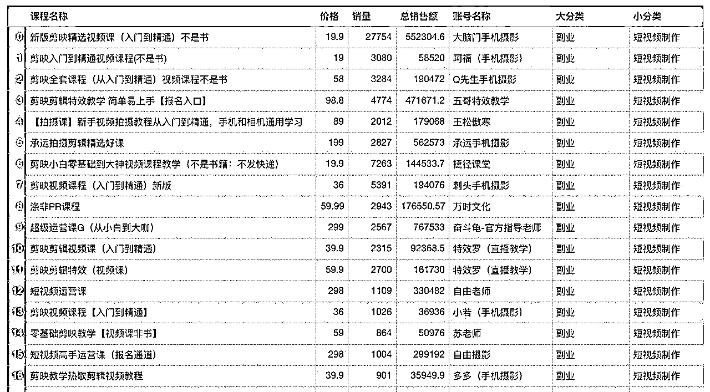

有了这些数据，我们就可以找到哪个课程卖得最好，去学习头部玩家的玩法。

首先我们对销售额进行降序，很快就能看到这份数据中，卖的最好的课程是《好声音系统训练课》，已 2112 万的销售量，遥遥领先。

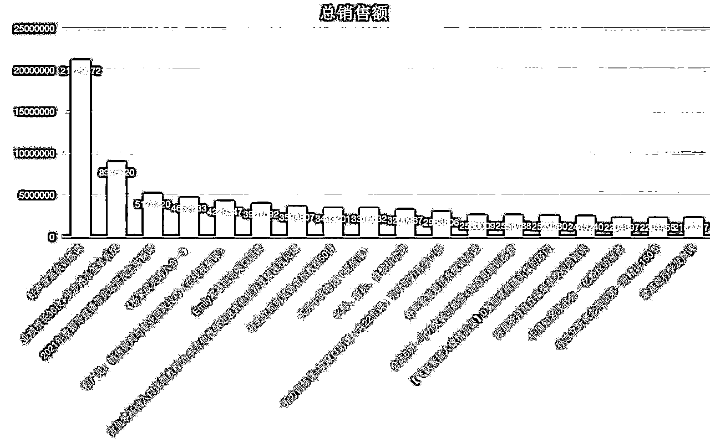

这些能卖这么多的账号，肯定有值得学习的地方。通过飞瓜数据我们就能很快找到，该商品主要销售来自一个叫「中国金话筒 语言课堂」账号，80.5W 粉，最近 30 天每场直播平均销售 60 单左右。

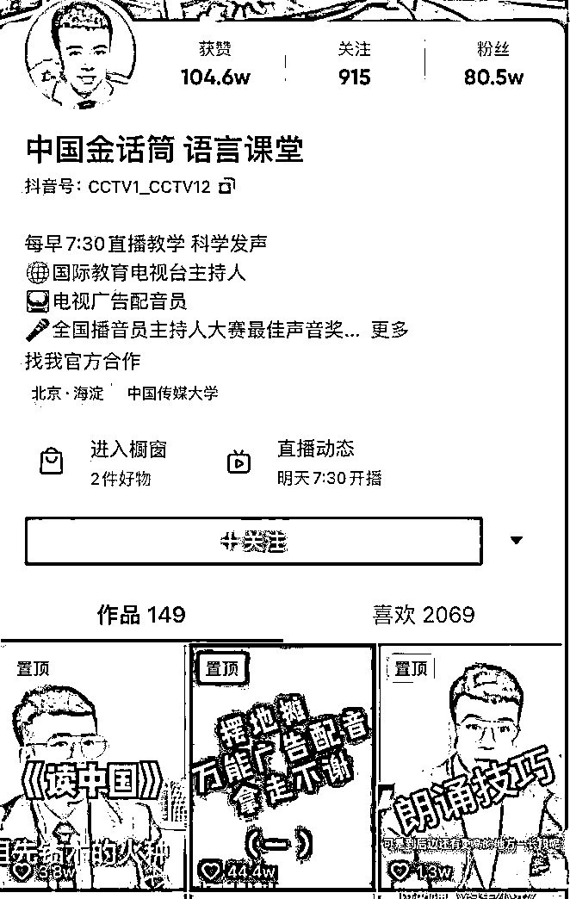

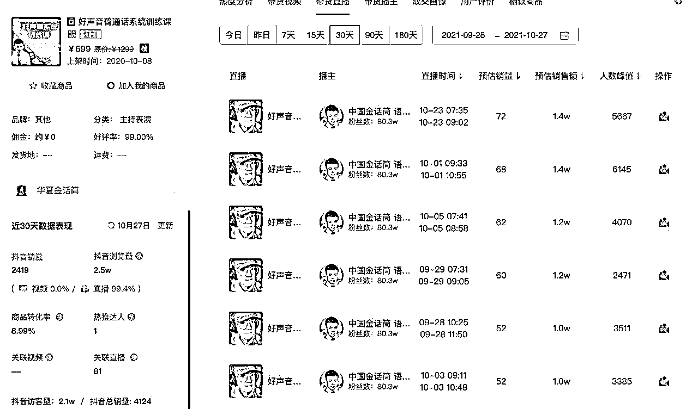

简单的调查，我们就能总结出一些这个号的模式：

账号定位：电视主持人内容规划：用主持人的口音读各种段子

变现产品：699 的好声音训练课 + 1980 声音实战课

用户痛点：普通人发音难听产品卖点：专业主持人教你如何拥有一口好听的发音

变现方式：抖音直播任何一个商业项目首先要想的第一件事就是：定位

你的账号定位是什么

你的商业产品是什么你的产品解决用户什么痛点

从这个账号我们就能学习到如何进行账号定位，能更好的变现。该账号的定位就非常厉害，本身是做电视台主持，账号走的专业人设定位。然后结合这个专业主持人的定位，去解决普通人发音难听的痛点，就非常切合。

定位行业专家人设，销售行业知识，是永不过时的打法。

当然如果要再深入研究，大家可以去把他直播间进行录播，在进一步去研究他的销售话术。

内容来源：《抖音上付费课程数据，有什么价值？》

### 2.2.4 差异化服务

##### 2.2.4.1 方法 @Zora.卓然✨

差异化服务是指，某个产品满足了其他同类别产品未满足的需求，从而更有竞争力，做到比其他家更好的成绩。那我们在找这类风向标时，需要我们进行同行对比，了解多家的模式，会更容易抓到那些相较同行做的更好的产品区别点。

第一步：选定一个具体赛道

这个赛道可以是：你自己所做项目的赛道；

你感兴趣，愿意关注的一类产品，建议这个赛道划分的细一些，比如：周边一日游、烘焙直播、舞蹈培训、AI 绘画做壁纸、ChatGPT 写文章等等任何一个类别；根据节日、热点选择相关的产品，比如一到情人节就会出现的孤寡青蛙；

你观察到的一类人群的同等行为，比如抖音、朋友圈、小红书上看到素人会发同类内容。

第二步：找到本赛道的产品/服务

方式一：如果你没有持续关注的产品，可以在抖音、小红书等各个平台搜索赛道相关关键词，按热度搜集现有的产品/服务。

方式二：如果你有自己在持续关注的产品，可以直接继续关注该类产品的动态。

第三步：分析各个产品提供的服务区别，找出差异性

以表格形式整理这些产品/服务的信息，找到差异化服务的点。

比如下面是公务员培训班的产品列表，可以看到有一些产品是有线上无限上课、出成绩优惠、上岸后再交齐学费这种差异化的服务的。如果有销售量数据，可以更进一步的判断哪一个差异化服务是对用户更加有吸引力的。

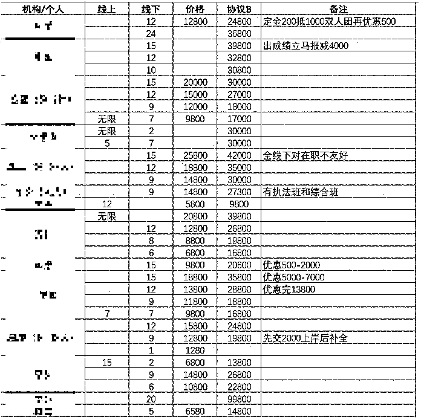

内容来源：《新人入局考公市场，变现 10 万+的复盘》

#### 2.2.4.2 案例 @林林 AIGC 写作

下面分享一下，如何在小红书看到【G 社舞蹈课】，分析其和其他舞蹈培训不同的服务，找到一个打败同行的切入点。

第一步：发现并确定舞蹈工作室的赛道最近发现不少在北京工作生活 90 后、00 后的微信好友，都很喜欢在视频号记录生活的同时发布自己跳舞的视频，这些视频拍摄出的效果确实挺专业，感觉就像有专人负责拍摄剪辑一样。

后来了解了一下才知道，他们都喜欢去一家叫做 G-STEPS 的街舞工作室（下称 “G 社” ）学跳舞，网上也有黄牛靠 G 社课程代抢赚差价，这是一个大多数舞蹈工作室所没有的生意，是个值得研究的异常值。

第二步&第三步：找到 G-STEPS 的街舞工作室，了解其产品和服务，并和其他舞蹈工作室做对比，找到差异化服务的点

至于为什么都去 G 社，我也在小红书随便搜了一下，没想到还真有网友给出了全面的分析。例如，在授课方面就有如下优点：从 AM 11：00 到 PM 09：00 都能做到有课可选；

在朝阳、海淀、丰台这 3 个区有很多门店（官方给到的门店数是 24 家）；课程难度分三等（新手老手都能找到合适的课）；

风格种类丰富（爵士舞、Jazz Dance、Hip-Pop、Urban 之类的基本都有）。

仅从约课这方面的这些细节处的体验，不难看出 G 社或许真的做过很细致很全面的用户调研。

不过更令我相信 G 社有用户思维、互联网思维的一点在于，他们很清楚数字化运营能给传统的舞蹈工作室带来怎样的改变：

课前用户可通过小程序提前预览相关视频了解课程内容；课后也可通过自己的舞蹈录像逐步记录、见证自己的成长和变化。

内容来源：《G 社舞蹈工作室差异化服务》

### 2.2.5 蓝海产品

#### 2.2.5.1 方法

一句话说明：我们需要找到“求大于供”的市场机会，即为蓝海，其中优先建议做高客单、高利润的蓝海产品。

查理芒格说了，钓鱼有两个原则。 原则一：学会在鱼多的地方； 原则二：不要忘记第一个原则。

在这个领域内，有没有人小米加步枪、产品特别简单、营销特别简单，竟然能够赚到钱的？如果有，那么，它就是蓝海。

亦仁曾经提出过：要做一个项目，需要拆解出最小闭环：流量 - 产品 - 变现。

结合上面的故事，我们可以将寻找蓝海机会的方法进行简化：蓝海三部曲 = 有稳定流量 + 产品很差 + 能稳定变现。

有稳定流量

我们经常能够看到一些所谓“现象级”的小爆款。例如 2022 年 1 月，有一个生财有术日历相关的视频爆发了：

它有流量吗？有，抖音总榜第一，有接近 1000 万点赞。

有稳定流量我们经常能够看到一些所谓“现象级”的小爆款。例如 2022 年 1 月，有一个生财有术日历相关的视频爆发了：它有流量吗？有，抖音总榜第一，有接近 1000 万点赞。

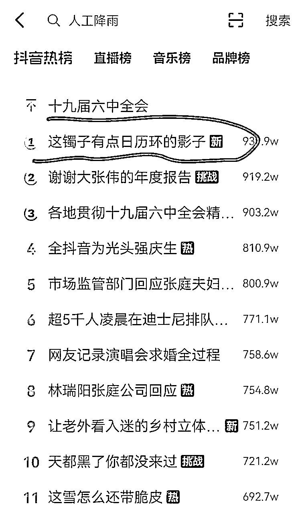

那么，怎样才算稳定的流量呢？就是你任何时候去看它，它表露出都是不温不火的样子。

直播间永远有人在线、也许不多，二三十人，但是任何时候去看，都是二三十人。

网站流量不高，每天 2000 访客，但每一天都是 2000 访客。甚至，还有持续增长的趋势。

……

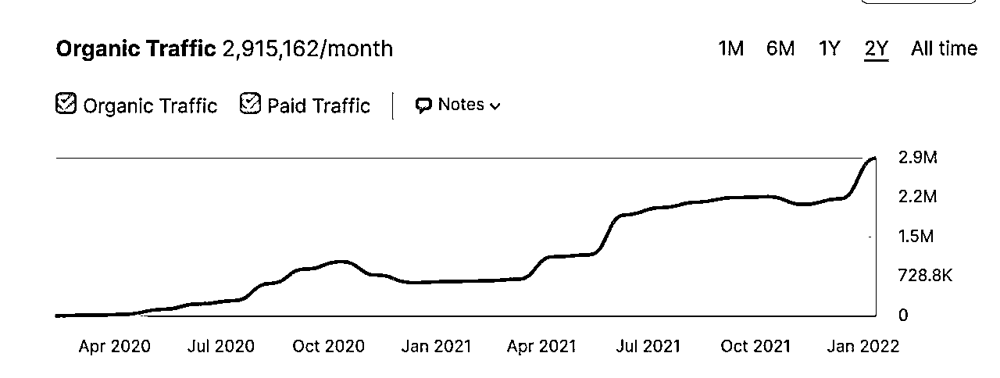

这才是我们应该去追求的“稳定流量”。

怎么找稳定流量？

很简单，看到“现象级”爆款的时候，别太激动，你得去看看作者过往的其他作品。如果作者其他作品都不行，只有这一条爆了，就暂时可以忽略它；

直到你看到同一个作者连续输出多个有流量的作品，或者在较长时间内一直有稳定的“30 天销售额”，那才可以记录下来。

产品很差

有两点需要强调。

一些同学误以为，“货”，就是产品；电商人讲“选品”，选出来的，就是“产品”。

这么说倒是没错，问题是语境不同。

在这里语境中，我们讲的“产品”，特指“一个特定的解决方案”。

以“在抖音直播里带货”为例，特定问题 = 把某个货通过直播的形式卖出去

产品 = 解决方案 = 积累精准粉丝数量、提升用户种草欲望、提升直播间转化率的工作产品很差 = 精准粉丝不多、直播质量差、短视频质量差

蓝海机会 = 某个品类的货，某个主播，精准粉丝很少、直播质量差，但他竟然有可观的稳定变现

2\. 产品很差，操作要点是“它比你能力范围能做到的更差”。

“差”是一个相对概念，只能在比较中进行。跟谁比？跟你比就可以，因为是你在寻找蓝海，主角是你。

就像是本节课开篇讲的“哈尔滨程序员”的例子。他做出的产品，跟其他普通的兼职程序员相比，那是非常非常好的；只不过是在正规军软件公司看来，毕竟是业余产品，比较差。

这是一个反直觉的事情。

常规情况下，我们都讲求“见贤思齐”，我们需要刻意去看别人更好的作品，作用是学习。学习了更多的好东西，我们才知道自己有哪些不足，才能进步。

然而，在我们找蓝海的时候，要反过来操作。凡是看到超过我们能力范围的作品，我们需要立刻跳过他。他做得好，那是他的事，你又做不过他，看他干嘛？蓝海肯定不在这里。

能稳定变现

流量是流量，变现是变现，它们俩常常并不是一回事儿。此处需要大家切记的是两条：

长得漂亮的小姐姐，唱歌跳舞，非常吸粉，但是他们很难变现。像我比较喜欢的某颜值主播抖音账号，小姐姐长得可漂亮了，几百万粉丝。然后变现呢？变现渠道，只有直播打赏的音浪收入。有时候我甚至感觉她有些可怜，这么好的自身条件，这么多的粉丝，竟然无法高效变现，真是不值。

再举一个例子。某些直播间，长期呈现稳定且可观流量。

比如这个：抖音直播刷抖音直播。（没写错，这不是病句）。

但是它的变现效率非常低，没有直观的变现渠道。这就不符合“能稳定变现”的原则。

因此，我们一定要按照 2021 年抖音大航海的思路，反复提醒自己：不管做什么事，在做之前，就想好自己的变现方式。 宁要能变现的 1000 粉，不要不能变现的 100 万粉。

正面案例就是著名的董十一。他抖音才十几万粉丝吧，每周变现 100 万人民币左右。这才是值得我们去研究和学习的。

2\. 偶尔变现，不值得追求；“稳定”变现，才是我们喜欢的事

2022 年 1 月有很多人做微信红包，在抖音直播卖微信红包，短时间内能够挣到一些钱。但是这个生意显然是不稳定的——抖音政策会变（据我所知现在已经变了，做了一些封禁）、 时效性差（今年只有这一个月能做，明年能不能做还不知道）。

虽然我们没有必要每个人都立志要做长期主义者，但也不能太短期了吧。试想，如果你做的每个项目，周期都只有一个月的时间，下个月又要重新开始；而下个月的项目在哪里呢？还不知道，因为下个月你不一定能抓到同样的短期项目机会。饱一顿饥一顿，没什么意思。

遇到这样的项目，如果你突然有点闲暇时间，短期做一做，那没问题，值得鼓励。 但是如果你的目标是把自己未来半年、一年押上去，那就没必要，直接忽略它就好。

怎么才叫“能稳定变现”呢？

和上面讲的“流量”环节类似，你任何时候去看他，他都是不温不火的样子淘宝店每天都有单，也许不多，一百单，但他每天都是一百单。

CPS 每天都有单，粉丝也就两万，但是每天能净利润三四百元抖音探店号，视频只有一两千赞，视频带有一点商家的广告或者小黄车。看上去不多，但是他每天都发、每条视频都是这样的数据。再加上他的粉丝可以一直涨，那这就很恐怖了……

……

内容来源：《蓝海项目挖掘｜小航海学习手册》

#### 2.2.5.2 案例 @陈铭 ivy

下面以小红书平台为例，分享一下如何用第三方数据平台找到小红书上的蓝海产品，发现机会。

第一步：先上淘宝买一个 48 块钱一天的千瓜豪华版，根据你想要做的领域关键词去搜索笔记，再看近一个月的笔记数量。

如下图，这是我搜索减脂，出来的结果，一个月 5.98 万笔记，妥妥的红海。【图有点糊，大家主要看字就行】

第二步：这时候我们再细分一下，比如 “200 斤减脂”，范围就会更加缩小，上图是我换了另一个搜索词，近一个月的笔记才 9 条，这海蓝得不能再蓝。

会去搜索框里搜名词的，肯定是精准用户，试想一下，搜出来 9 条笔记，如果有 4-7 条都是我们写的，这进店率是不是很香呢～

内容来源：《粉丝 3000 月营收 20 万，小红书低粉高变现的蓝海攻略分享》

## 2.3 从流量出发，挖掘风向标

流量是明显的异常值维度之一。当下更多的体现在抖音、小红书、视频号、公众号等自媒体内容平台。在刷这几个平台上的内容时，如果一个账号平时的流量都非常的平平无奇，只有几百几千，或者某类题材，其他人发只有几百几千，突然出现一个百万+播放的内容，这是非常值得我们关注的。

因为在这个流量异常值的背后，往往代表着有某个元素和其他内容 / 其他账号不一样。

比如内容的选题，内容的开头 3 秒和封面，内容的发布时间，内容打的标签，内容所带的相关产品/服务等等，都有可能是造成流量突然爆发的原因。深入分析爆款内容，就有可能发现流量密码。

在这里，我们主要讲三类目前非常值得我们关注和分析的流量表现：低粉爆款内容的情况

一直流量平平，突然有一个内容百万+的浏览的情况

一个新的自媒体账号涨粉很快的情况接下来将会分别讲讲如何这三类流量情况中挖掘风向标，我们现在开始吧。

当然，还有其他流量异常值的情况，这里暂时不做更多展开，非常欢迎大家在航海群内多多交流讨论！

### 2.3.1 低粉爆款

#### 2.3.1.1 方法

所谓低粉爆款法策略本质上就是跟爆款，只不过是找到一些粉丝量较低的账号出现的爆款视频做拆解分析。一定程度上来说，粉丝量低，播放量高，可以代表账号本身的用户基数影响较小，更多的流量来自于搜索、系统推荐等，可参考性相对较强。

第一步：如何找到低粉爆款的内容？

在我们日常刷视频和笔记的时候，建议养成习惯，多多留意播放量高的内容，看看账号粉丝数是不是一个低粉爆款的类型。

也可以根据近期热点，在这些内容平台搜索相关关键词，找到爆款内容，这个环节我们可以用后羿采集器等工具提效。

但靠日常刷非常的随机，现在也有很多第三方数据平台可以筛选出低分爆款内容的榜单，因此更多情况下，我们可以通过这些工具来找到这些内容，以下是在几个主流工具上找低粉爆款的方法。当然，还有很多好用的数据工具等你去挖掘和探索，你可以根据自己的需求进行使用。

抖音热点宝

在抖音搜索框中搜索「抖音热点宝」，选择第一个功能去查看；然后选择「热点」-「视频」，中间的筛选器选择「低粉爆款视频榜」，也可以选择赛道和时间范围，即可看到低粉爆款的内容。

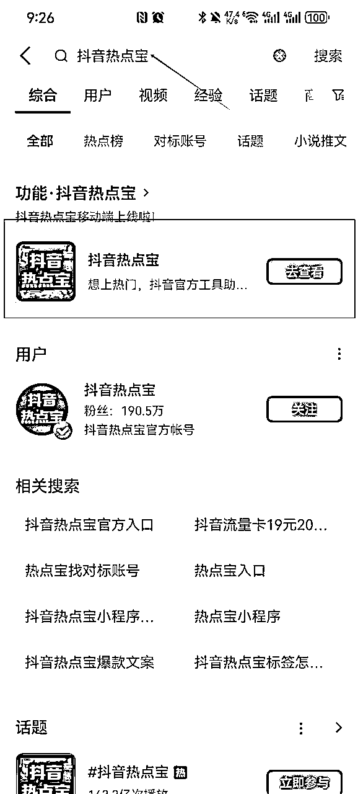

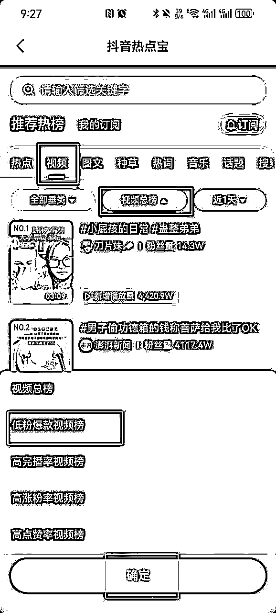

灰豚数据打开灰豚数据官网登录，左侧一列选择「短视频」-「热门视频库」，也可以选择赛道和时间范围，即可看到相关条件筛选出来的低粉爆款的内容。

如果你只关注带货视频相关的数据，左侧一列选择「短视频」-「小号爆单」，选择赛道和时间范围，即可看到相关条件筛选出来的低粉爆款的内容。

如果你关注的是小红书的低粉爆款笔记，最上方换成小红薯版本，左侧一列选择「笔记查找」-「笔记榜单」，选择「实时-低粉爆文榜」，即可看到相关条件筛选出来的低粉爆款的内容。

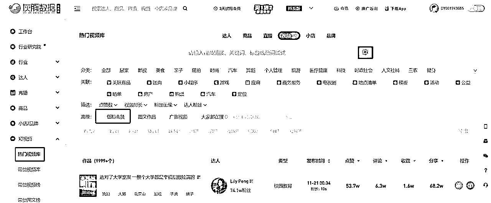

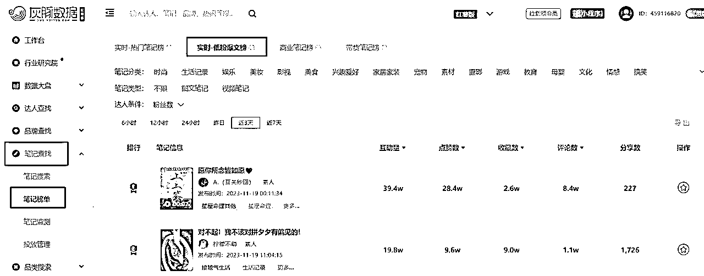

蝉妈妈

打开蝉妈妈官网登录，顶部选择「视频」-「热门视频库」，在筛选器内选择赛道和时间范围，勾选「低分爆款」即可看到相关条件筛选出来的低粉爆款的内容。（需要升级为专业版会员）

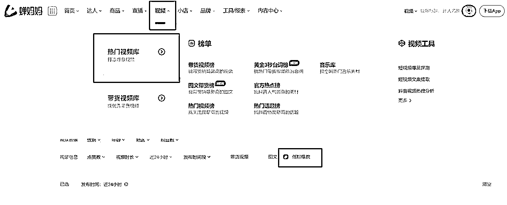

第二步：找到低粉爆款后，如何进行分析，找到机会？

1.结合数据工具看数据波动情况，看看前后内容的数据情况如何

2.

有没有其他爆款视频，爆款视频之间有没有相似之处？

看账号的注册时间，内容产出质量

4.

看发内容的数量，发频次和发布规律（时间段）

看账号名称和细分定位

6.看标题、标签和内容关键词

7.

看笔记封面/视频开头前三秒

8.

看看同选题下，其他账号的内容数据如何，和这个爆款视频的区别是什么？

……

一般来说，新注册不久的账号，数据稳定且爆款，绝对值得好好分析一把，找到可能的爆款元素，发现流量密码，甚至发现一个完整的项目。

#### 2.3.1.2 案例 @常常

下面以小红书平台为例，分享一下圈友@常常是如何用找到低粉爆款的内容并进行分析。

第一步：找到低粉爆款的笔记

我在开始进入一个赛道前，会把一个赛道中相关的小红书刷一下，然后把这个赛道相关的关键词一个个罗列出来，比如英语学习，那就是四六级、考研英语、英语学习法、雅思、托福、TED、高考英语...然后借助后羿采集器去采集，后羿采集器是非常方便使用的傻瓜式机器，当你把小红书中的链接复制粘贴到后羿采集器中，选择智能模式，就可以直接进行采集。

数据采集后，快速锁定自己准备对标的账号，选择对标账号时记得选择那些 5000-30000 粉丝之间的博主，这样的博主无论是成长，还是作品都是更值得你去学习的。

快速选择目标后，就去做好充分的信息准备，把他们的账号，挨个的做好详细统计，详细到你能对他们的账号特征了如指掌。

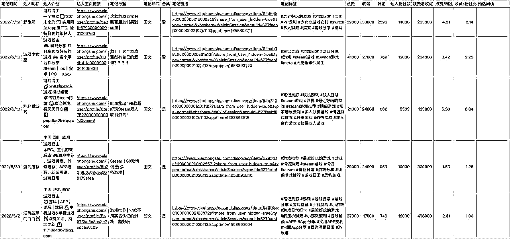

第二步：分析低粉爆款笔记

①【分析维度一】笔记数据情况

经过上一步的整理，发现了这篇标题为《会搞💰的女孩，真的是 yysd！ 📌》的笔记值得分析。

通过在蝉小红 - 分析的笔记主页 - 数据概况，来看数据情况，我们会发现这篇笔记有一个异常的赞藏比：总点赞数：46000，总评论数 338，总收藏数 44000，总分享数 1373，博主粉丝数为 5605

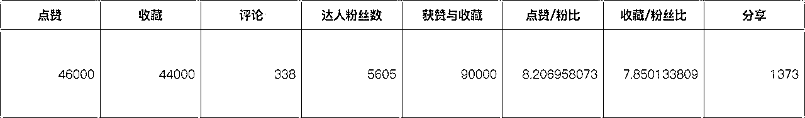

（蝉小红数据整理）

然后到千瓜后台再观察一下数据情况，综合看看各项比例和关键词：

（千瓜后台显示数据）

正常情况下，一篇笔记的数据，如果博主粉丝与笔记数据显示出赞藏：粉丝数=10:1，基本就可以判定这篇笔记属于爆款笔记，而这篇笔记在阅读：点赞=10:1、赞藏：粉丝的数据也接近 10:1，可以判定这是一篇非常爆的笔记，很多人说创业、副业笔记容易在小红书上违规，这篇笔记是不是颠覆了你的认知？

热搜词覆盖：深圳女孩🔥694.66、一心搞钱🔥225.44、也装不下🔥191.72、除了搞钱🔥80.4

笔记判断：根据点赞和笔记评论，笔记的赞粉比（点赞数/粉丝数）、藏粉比（收藏数/粉丝数）都接近 10，远远超出 1:1 的数据，可以准确判断这是一篇大爆款笔记。

模仿难度：🌟🌟🌟

制作难度

难点 1：笔记中一共使用了 17 张图片，需要具备一定的图片素材收集能力，并且要具备将图片进行良好拼接的能力，需要具备将同色系图片搭配和谐的审美能力；难点 2：单篇笔记制作较为耗时，原因在于图片数量多，从准备图片到图片同色系搭配、拼图，完成一篇笔记需要至少投入 2～3 小时的制作时间；

内容匹配难度难点 3：小红书上女性用户较多，对于在男性博主的账号上，发布女生搞钱副业相关内容的关注度低，并且人设与内容上也会产生分裂。这种玩法需要进行验证，并准备验证方法。

②【分析维度二】爆款笔记的爆点在哪里？

笔记标题

会搞💰的女孩，真的是 yysd！ 📌

抓住了关键词：搞钱 + 女孩

笔记内容亮点：图片和文字对比明显，重点比较突出，内容上在不断的加深，给出了成为搞钱女孩的具体路径，清单体的大量列举，给用户带来不能一次性学完的焦虑和急迫感，让用户迫不及待的收藏；

笔记图片

亮度和明度为暗色，图片背景整体色系为暗色或者灰色系，图片上的文字为明色、亮色的白色（封面）或黄色（内文）

图片文字：清单体，通过列表式的展开，为目标用户提供大量需要做的事情，这些事情是短时间无法完成的，所以用户最好的办法就是收藏，等到需要的时候再进行查看。

优点：文字内容涵盖四个方面：技能+自学网站+副业方向+搞钱底层逻辑，缺点：不同板块之间，图片上的文字颜色不统一，看了前面，再看后面感觉颜色乱，图片搭配不美观。

笔记标签

#自我提升 #努力变优秀 #副业 #搞钱 #女性成长 #女性智慧 #认知

笔记发布时间

2022-11-09 18:25 - 周三 - 工作日结合蝉小红数据给出的用户活跃画像，下午 6 点的时间发布，这个时间点是否具备参考价值，需要进行验证分析。

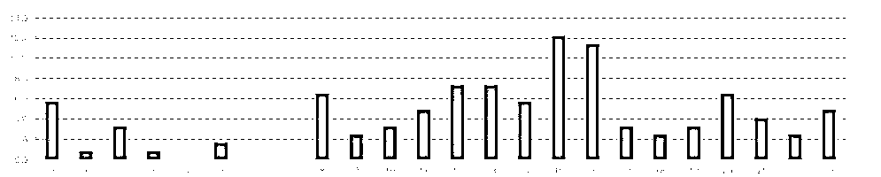

笔记评论笔记评论的关键词——蝉小红的评论分析（按照顺序排名前 10 关键词）

【博主】【搞钱】【PS】【简单】【笔记】【平台】【关注】【分享】【副业】【PP】

【笔记内容总结】（3）笔记的形式可以借鉴——清单体+背景拼图，这个形式在小红书上非常常见，爆款率较高

迭代点

（1）笔记的发布时间，可以根据数据分析平台的用户活跃时间来进行调整+验证；

（2）笔记内容的板块之间区分时，颜色搭配前面黄色、后面红色，可以调整为同一色系，把页面排版更清爽一些；④【分析维度三】这篇笔记提供了什么价值？

（1）提供了成为搞钱女孩的完整路径

笔记 9 张图，从封面给出目标——成为搞钱女孩，到后面 8 张图分别给出技能+自学网站+副业方向+搞钱底层逻辑，帮助女生规划清楚成为搞钱女孩的路径；

（2）提供成为搞钱女孩目标路径上的资源明细

给了鸡汤并且给了勺子，用清单体给出每一个板块的资源名称，方便用户进行查阅和学习；⑤【分析维度四】这篇笔记满足了笔记读者什么需求？

（1）理想自我的需求；（给出了目标——成为搞钱女孩）

（2）实现理想自我的路径；（技能+自学网站+副业“搞钱”方向+搞钱的底层逻辑）

（3）实现理想自我路径上需要的资源明细；（清单列表给出具体的学习资源）

⑥【分析维度五】这篇笔记对我们发布笔记来说，可以借鉴的点是什么？

（1）笔记的形式——清单体+拼接图片背景的形式，可以进行模仿，但是这个笔记的拼图模板，看着不是特别好，比较乱，不够美观；（2）笔记的内容，从目标——技能——自学网站——搞钱方向——搞钱底层逻辑——资源明细列表，给出的比较直观，能够给人很强的迫不及待收藏感。

内容来源：《100 天涨粉 14 万，小红书爆款笔记经验分享 》

### 2.3.2 突然百万+播放

#### 2.3.2.1 方法

我们是无法看到其他人的内容播放量数据的，但每个平台都会有一个从播放量到点赞量的比例，我们可以通过点赞量来估计播放量的大致数据。比如抖音上 1 万点赞背后可能是有 100 万的播放。那么我们从点赞的数据就可以筛选出可能到百万播放的内容。

第一步：找到百万播放的视频

找该类账号时，同样有这几类方法：在我们日常刷视频和笔记的时候，多留意点赞超过 1w 的内容

从第三方数据平台找到爆款内容榜单，每一个都不止百万播放

查看抖音、小红书等平台的热榜，从热榜中进入具体的视频列表，从中找到点赞超过 1w 的内容。抖音从顶部的热点即可找到榜单，小红书需要到「我」-「创作灵感」找到榜单。

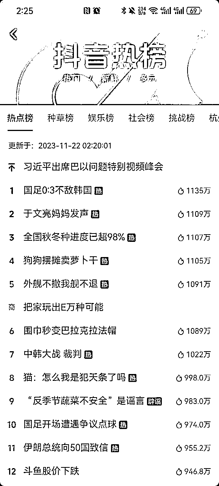

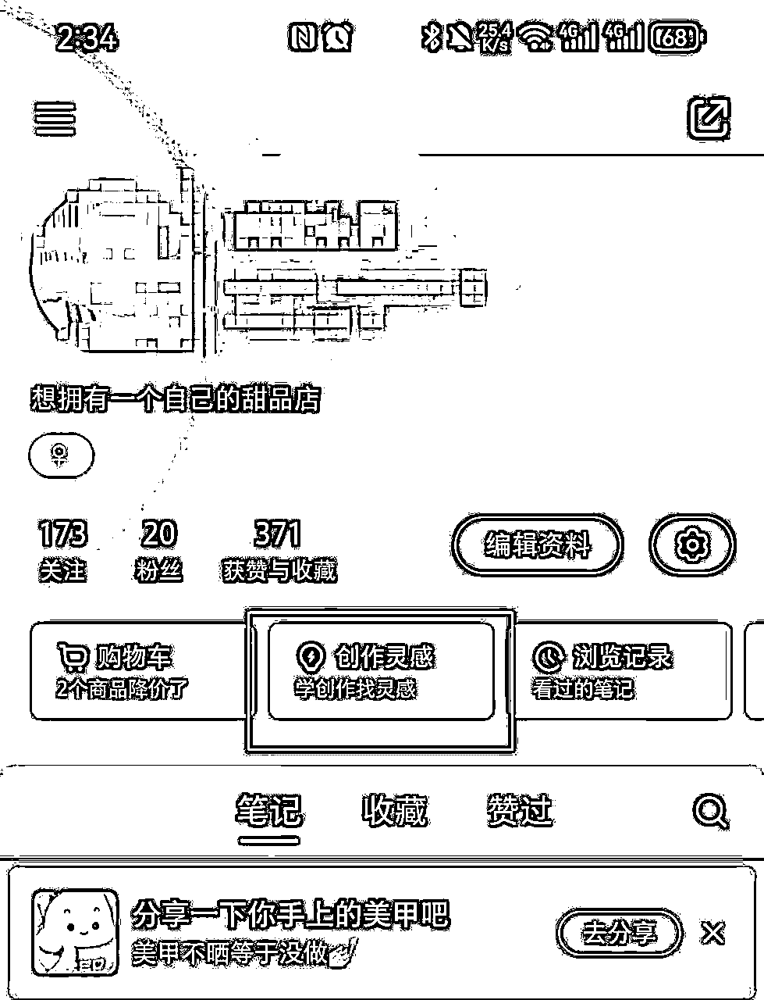

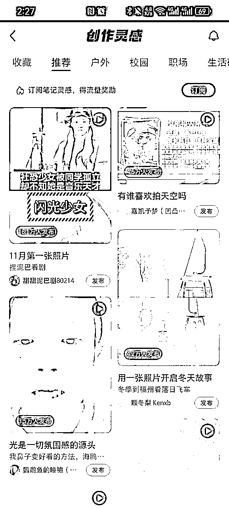

第二步：查看爆款内容相关的账号情况，确认这条内容的播放量是否为异常值

这一步，我们可以通过查看爆款内容前后的内容数据，对比确认它是不是一条突然百万+播放的内容，排除粉丝基数大等其他原因。

第三步：分析内容，定位爆款因素

1.有没有其他爆款视频，爆款视频之间有没有相似之处？

看账号的注册时间，内容产出质量

3.

看发内容的数量，发频次和发布规律（时间段）

看标题、标签和内容关键词

5.

看笔记封面/视频开头前三秒

6.看看同选题，甚至同音乐的情况下，其他账号的内容数据如何，和这个爆款视频的区别是什么？

……

#### 2.3.2.2 案例

下面以抖音平台为例，分享一下如何找到突然百万+ 播放量的内容并进行分析。

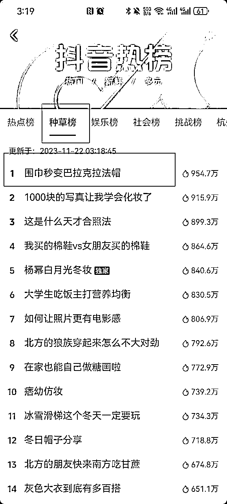

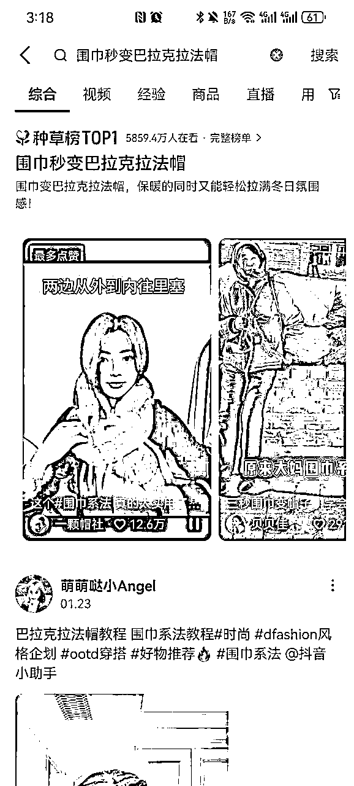

第二步：查看这个抖音账号的信息观察这个账号，发现以下几个点：

1.

该账号从今年 11 月 13 日开始发视频，到目前（11 月 22 日）共发布了 18 条内容

2.

账号名称和简介都说明这是一个秋冬帽子种草号

3.

这 18 条内容全部在分享帽子，点赞数据最高不超过 100，仅这条爆了，可以确定这篇内容是值得进一步分析的第三步：多角度分析内容，找到机会

4.

这个账号发了三条这个帽子戴法的内容，第一条是同样的内容的挂车视频，第二条是图文，流量表现都欠佳，仅这条爆款，在评论区引导大家去橱窗购买下单，目前看已售是 251 单。这种评论区引导的方式是可以参考的。

5.

在热销关键词下还有其他相关的视频内容，往下翻了一些，发现这个视频内容在去年冬天就已经有人拍过且出现了百万播放了，说明这个素材在抖音平台的受众是比较广的，爆过的视频还可以再爆。

我们可以进行跟品，也可以延展一下思路，看看手套、耳罩等等适合秋冬季节的产品，找到去年冬天爆过的产品和视频素材，

### 2.3.3 涨粉很快

#### 2.3.3.1 方法

第一步：发现涨粉快速的账号

找该类账号时，同样有这几类方法：在日常刷视频和笔记的时候，建议多多留意播放量高的内容，并且看一下账号的粉丝量和运营周期，如果新号就已经有播放量很高的内容，即使当下粉丝不多，也可以持续关注，留意他的涨粉情况；通过在抖音、小红书、视频号等平台搜索当前热点、节日等相关关键词，找出播放量高的内容，同样的看一下账号的粉丝量和运营周期判断涨粉；

借助数据工具，筛选出涨粉达人榜单。比如在「抖音热点宝」找到「高涨粉率视频榜」，在「蝉妈妈」找到「涨粉达人榜」

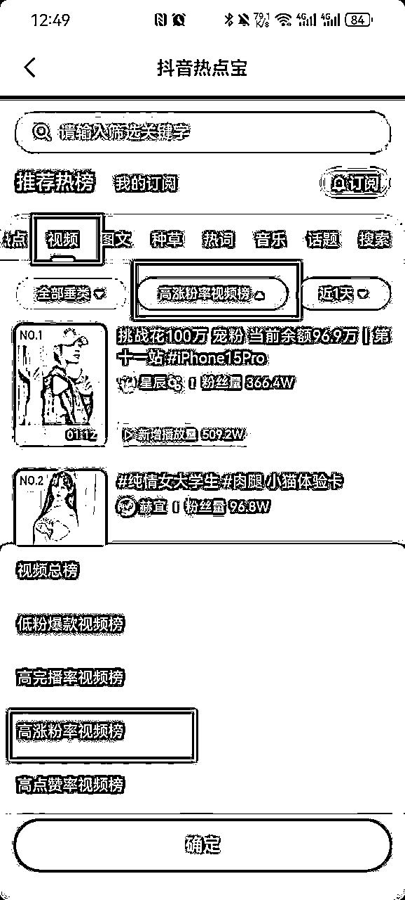

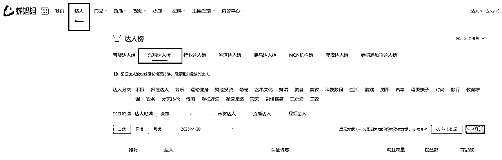

第二步：找到涨粉快的账号后，如何进行分析，找到机会？

1.结合数据工具看数据波动情况，看看前后内容的数据情况如何，是单个还是多个视频导致快速涨粉

2.

有没有其他爆款视频，爆款视频之间有没有相似之处？

看账号的注册时间，内容产出质量

4.

看发内容的数量，发频次和发布规律（时间段）

看账号名称和细分定位

6.看标题、标签和内容关键词

7.

看内容选题是否明显有利于涨粉

8.

看看其他同类账号的内容数据如何，和这个账号的区别是什么？

……

和低粉爆款同样的，如果是一个新注册不久的账号，短短时间内涨了几万甚至几十万的粉丝，也绝对值得好好分析一把，可能对于我们找爆款选题和提高粉丝数量技巧上都有所启发，也可能因此发现一个用户需求量很大，但我们从未想到过的项目。

另外，海外的短视频平台内容一样值得我们研究，如果你更关注海外市场，同样可以用这个步骤迁移到对应的平台来分析。

#### 2.3.3.2 案例 @大星儿

下面以抖音平台为例，分享一下圈友@大星儿是如何找到涨粉很快的账号并分析的。

因为大星儿是做的视频号涨粉，视频素材优先找其他平台上已爆的内容进行借鉴。因此我们确定一个前提为：找到目标用户是三四线中老年用户群体，泛娱乐为主，符合中老年用户群体的情感视频，对画质要求不高。

然后我们直接从抖音上找有相关素材的成功账号案例。

第一步：抖音直接搜关键词

抖音搜索故事、故事会、民间、情感、正能量、家庭情感故事等关键词，筛选条件：最多点赞——一周内，搜素靠前的视频其点赞、评论、转发数据都不错，点击头像进入账号主页，观察几个要素

接下来，从账号主页各视频的点赞数据，并找到点赞量高且近 1-2 天内发布的内容（至多不超过 7 天，因为数据好的视频，时间越长，很有可能已经被 BY 到视频号）。

点开查看用户评论，如果用户的头像明显是中老年人风格（花花草草之类的），那说明该视频及账号的主要受众是中老年人群体。

第二步：数据验证

方式一：蝉妈妈——视频——热门视频库/带货视频库——情感

方式二：蝉妈妈——视频——搜索框根据关键词搜索：故事、情感、正能量等。然后视频选择近 7 日内高赞的视频，点击进入账号主页——看数据和视频源是否充足，以便后期能找到足够的视频进行剪辑。

查看该细分类目下的相关账号，点击进入看具体的数据信息，主要关注 2 个核心数据：

近期涨粉人数，可以判断账号涨粉速度及近期是否有爆款视频

找到相关账号后，搭建账号库，记录核心信息，并用抖音号关注账号，博主发布视频后第一时间接到消息 push，持续关注他的视频发布动态，从而帮助我们在视频号上源源不断地有高播放高涨粉的素材灵感。

内容来源：《视频号航海新手，7 天涨粉 10W+实操手册》

## 2.4 从变现出发，挖掘风向标

我们挖风向标，培养商业嗅觉，最终还是为了能够从发现的机会中赚到钱，那么我们在找机会的时候，就可以直接从最终结果——变现的角度来寻找机会。

我们可以从销量、客单价、投放 ROI、变现模式等方向来看。

销量越高，一定程度上代表需求市场越大，空间越大。

2.客单价越高，如果同时花费成本相对较低，代表单件产品能够获得的利润额越高

为什么要关注客单价高的项目呢？

因为单价低的品利润低、差异化小，更难做。

试想，你要是卖袜子。

大店或大号 15.1 元 15 双袜子，还包邮，月销几万+。你一个新手，卖个袜子也很难做出差别。

就算 19.9 元一盒五双袜子卖出去了，扣除各种成本一单赚 10 元，一个月得卖 500 盒才能赚到 5000 元。

要是再做个推广，可能连 5000 都赚不到了。

相反，高客单价的品，即使你不太会运营，但努努力一个月卖出个几件，可能就月入过万了。

所以，关注客单价高的项目更容易发现机会。

ROI 就是投入产出比。

现在线上带货越来越卷，投流都快变成基础操作了。但投流是需要成本投入的。1 块钱投入，带来的收益大于 1 块钱才值得投入。

这就是 ROI =投放带来的销售额/投放费用，ROI 大于 1，说明收益高于投入；ROI 越高，代表每投入 1 块钱赚到的钱越多。

那些高 ROI 的账号或者品就是异常值，都是值得我们关注、进一步分析的机会。

变现模式。

常见的变现模式有：接广、店铺、引流、直播。这些大多数人都在做。

如果我们能找到罕见的变现模式，那背后或许就藏着大多数人还不知道的机会。

### 2.4.1 高销售量变现项目

#### 2.4.1.1 方法：

第一步：发现高销售量的账号，并找到热销产品

我们可以关注的销售量很多，直播的销量、单个商品的销量、某个视频或者图文的销量、店铺的销量等等。

利用考古加、禅妈妈、抖查查等第三方软件，点击直播、商品、视频、店铺任意你想关注的领域。

2.看近一周或者一个月的数据，按照销售量从高到低排序。

找粉丝量少，销量高的账号、店铺或产品。粉丝基数少还能卖得不错，那这个品大概率不错。

点击进入他们的账号、直播间或店铺，找到销量好的款。

第二步：测品并观察数据

5.

选出来的品，可以通过测品关注点击率和转化率。点击率代表热度，转化率代表销售情况。

点击率至少达到 15% 以上，转化率至少达到 3% 以上算合格。

如果在五天内，点击率没有超过 15% 或者支付没有超过 5% 的话，就淘汰。

接下来举一个例子，方便大家更好理解：

#### 2.4.1.2 案例

打开抖查查，点击直播榜。

你想看商品榜、视频榜、小店榜都是一样的道理。

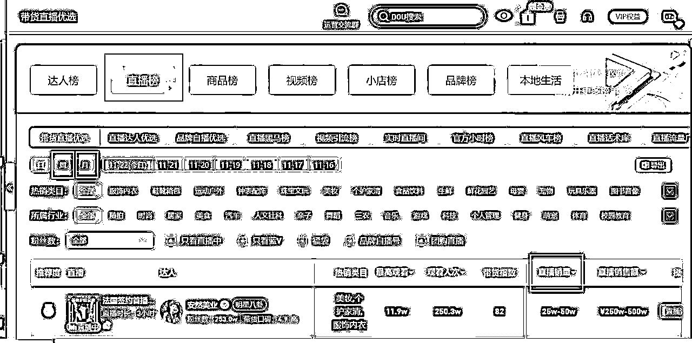

点击按周或者按月，

3.

点击直播销量，箭头向下，就是直播销量按照从高到低排序。

优先找粉丝量少，最好在 10 万以内，但直播销量高。

比如，下面这种：

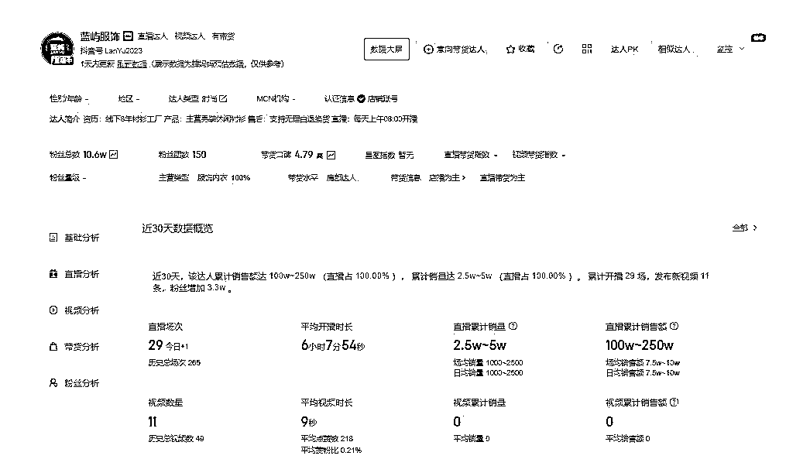

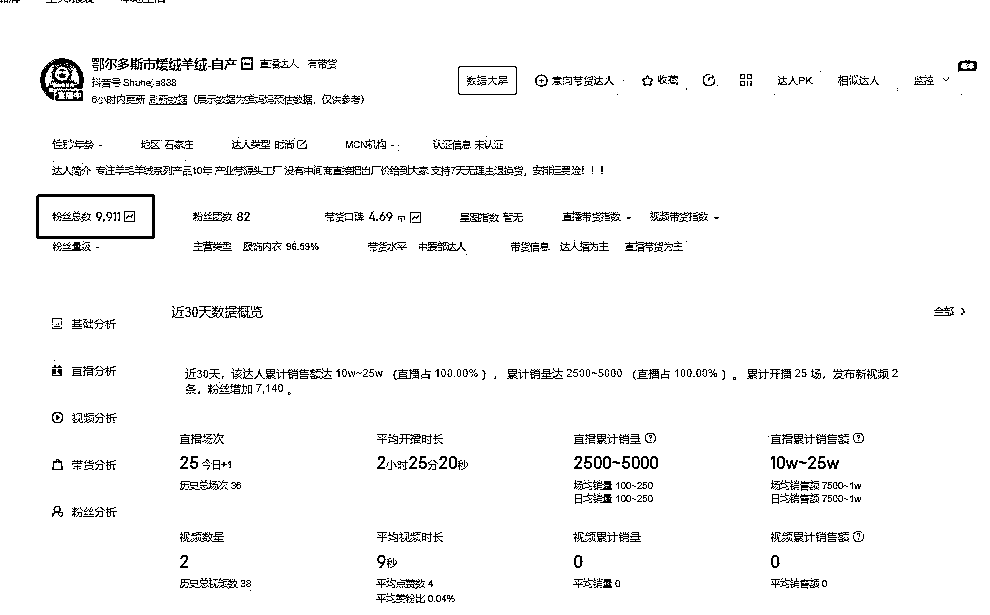

### 2.4.2 高客单变现项目

在开始找高客单项目之前，我们可以先讨论一个问题：什么是高客单项目？

一般来说，成交价 4 位数以上的都能算作高客单价，再结合我们的生活工作想想，不论是线上还是线下，我们是不是都见过许多高客单项目？

比如在线教育课程、企业咨询服务、代办中介、K12 系列、旅游、疗愈等虚拟产品或服务，还有汽车、奢侈品、房产、古玩、高定等各种实物产品……相信你看到的比这里列举的还要多。

亦仁曾经在星球分享过一个截图，很适合形容部分高客单项目，分享给你这篇帖，在评论区可以看到不少高客单领域和项目：《价值 9 位数的认知》

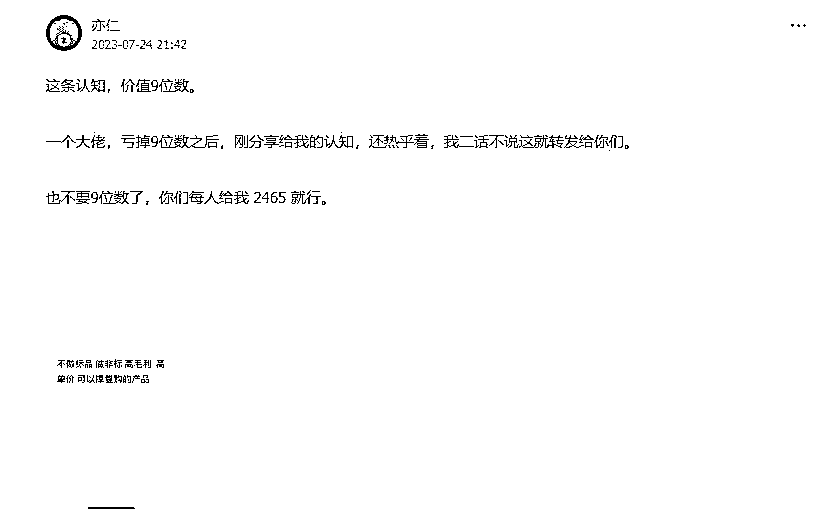

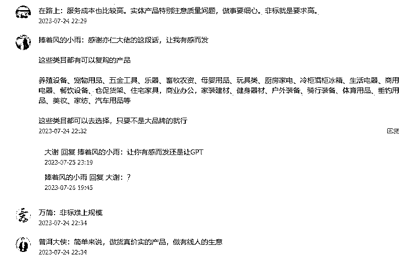

一般来说，高客单项目的每一单的毛利更高，即使销售量没有那么上一类高销售量的项目那么大，其实营收也不会少。

接下来就开始看看，如何通过找这些高客单项目来挖掘风向标吧。

#### 2.4.2.1 方法

第一步：找到已有的高客单项目

① 思路一：通过问题看到需求

其实解决自己的问题，本质就是在解决一种需求，其他人（同行）也一样会碰到，把自己碰到的问题记录下来，去搜索现在市面上满足需求的产品，可能会发现一个稳定的高客单项目。

② 思路二：通过已有项目延伸

拿身边朋友、父母、小辈等各类人群的社交账号刷一刷，看看他们平时都被推荐什么内容和产品。比如在女性人群的账号上刷到这个项目：美容院提供种植眉毛服务。它本身就是一个高客单项目，但延伸来看还有其他的机会，比如种植眉毛的技能培训、这个服务的上游产品供货商等等。

③ 思路三：做高客单项目的中介

比如上面说的美容院种植眉毛的项目，我们做不了，但是可以提供线索，拿高佣分成。还有一些代办证件、房产中介等等服务，产品本身客单价高、信息差大，即使我们没有资源，也可以作为中介，赚这个信息差的钱也是比较可观的。

④ 思路四：确定一个领域，针对性的找领域内的高客单项目

我们可以打开电商平台、第三方数据平台、课程平台、本地生活平台等集中展示相同领域产品信息的地方，选择一个领域比如“汽车”，找里面客单价高于 1000 的产品。

⑤ 思路五：从低客单找到高客单

低客单转高客单在教育培训领域很常见，在医美个护领域也很普遍，先有一个低至 1 元、9.9 元的体验产品引流，体验后再推出高客单价的产品进行转化。所以我们如果看到有这类低客单价的体验产品，就可以继续往下挖，参与体验或者进行咨询，看看背后的正价产品是什么，从而进一步分析。

⑥ 思路六：利用好生财有术，从众多项目内容中找到高客单项目碎片

比如精华帖、其他人发的风向标、上面说到的亦仁星球帖的评论区，再比如之前做过的抖音高客单项目航海，其中航海手册里收录了 《230+ 高客单项目案例》，都是丰富的高客单项目线索来源。

第二步：整理一个表格，梳理出这个项目的信息并进行分析

这个表格很简单，就是调研账号。每次做一个赛道，基本都会把一个赛道能看到的账号全部通过这张表来梳理一遍。下图是在抖音上做同城团购高客单项目相关的账号调研：

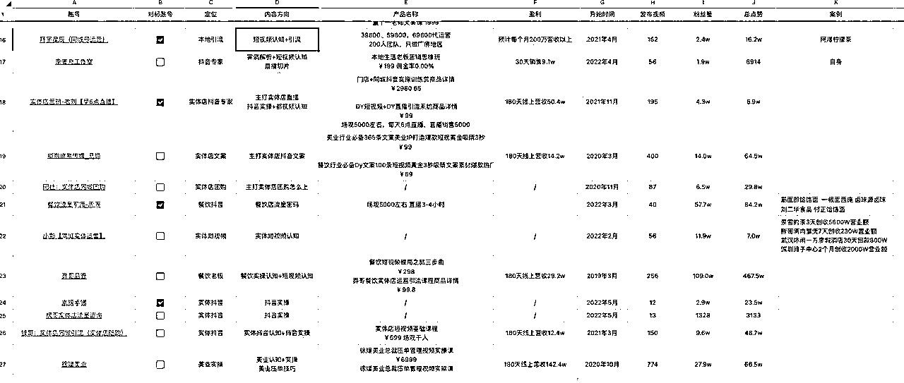

有三件事会重点看：

最近的变现情况（他最近赚了多少钱）

产品体系（靠什么赚的）

最近的内容方向（内容形式复制成本大不大）

如果这个赛道都很赚钱，那我们就基本就很确定了。接下来，思考差异化，定位差异化是很多赛道起量的前提。怎么做差异化，可以参考这句话：

重要第一，人无我有，人有我优，

消费者能感受到，独一份，

买得起，赚得到。

也就是：

这事重不重要有没有在做

有人做了话我能比他做的更好吗

消费者能感觉到我比他好或者不同吗在我这是独一份吗

消费者能够买得起吗我们毛利率高吗

比如有圈友在做打坐的账号，当时没有人在做打坐的，但是有人做冥想的，变现也还可以。所以他们以打坐作为切入现在做到全网头部，现在也一个月变现几十万。这就是是典型的通过人无我有的来切的。

你拿着这句话，再看这个表，是不是感觉有点意思了？你能做啥？需要做啥，其实看着别人做的产品，赚多少钱，基本心中有数。

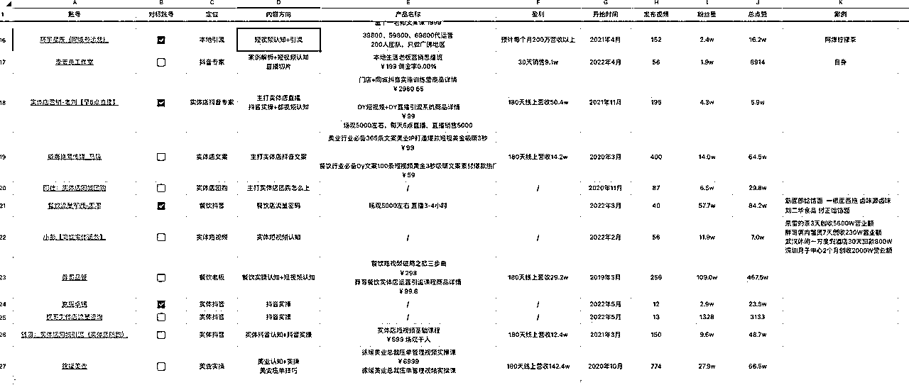

差异化最后给大家给比较简单的图，希望大家都能找到好定位。

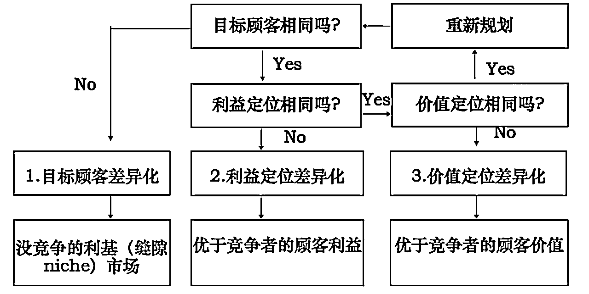

内容来源：《 2 月航海 | 抖音高客单项目 | 实战手册 》

#### 2.4.2.2 案例 @苏明波

下面以餐饮领域为例，分享一下如何分析这个领域里的高客单项目。思路可以迁移到其他领域中同样适用。

第一步，找到高客单项目

餐饮领域找高客单是比较简单的，我们可以有意识的找米其林二星以上的餐厅，黑珍珠餐厅等人均较高的。这里圈友杭州线下聚会去的是一家黑珍珠入围餐厅。

第二步：了解项目信息，分析高客单的原因，找到机会点

① 锚定效应

这家店一进门有一整面茅台墙，茅台作为中国人心目中的“硬通货”，就是一个锚，决定了这家店的档次不可能低，毕竟没人会在苍蝇馆喝茅台。

同样的，我们也可以用一些“硬通货”，将自己的产品定位拉升到中高档。比如有的西餐厅会在酒柜摆上贵价的葡萄酒；服装店突出“原创设计师品牌”；家居店强调“进口意大利瓷砖”等等。

② 食材高档

东星斑、梭子蟹等海鲜的成本档次就高，食材本身就体现了餐厅的档次。

③ 开价技巧

冯老师说在订菜时，问预算，最贵一道菜在 800-1000 之间，问有没有便宜点的，答曰东星斑 688。报价先往高了报，是一种筛选技巧，也是高客单价的秘诀。如果报高价都不敢，怎么可能有客户愿意为高单价付费。

④ 客户群体

杭州综合体商场的餐厅多是四人桌，但这家店以包厢为主，它的客户群体主要是商务宴请（茅台也是商务宴请常见酒），这就更方便做高客单，因为商务宴请的预算一般高于个人消费，对公司而言是投资，对部分员工而言可报销，因此客户群体的价格敏感性降低，有利于拉高客单价。

⑤ 老字号口碑

这家店的味道说实话中规中矩，但为什么客户愿意付费，没记错的话冯老师介绍时说过，它开了快 20 年了。对餐饮而言，这么多年能够一直做下来，必定有过人之处。我猜带外地客户来这吃饭，介绍说是杭州老字号，也能为这家店增色不少吧。

⑥ 蹭榜单光环

其实一开始我们以为这是家黑珍珠入选餐厅，后来才知道是入围不是入选，一字之差，但这家店照样把入围的奖牌摆在店前台，很多客户未必能分清区别，可以说这波是蹭到了黑珍珠的流量。

⑦ 服务细节

这家店其实细节方面一般

一句话感悟就是，高客单需要把细节做到极致，以及拥有对等的势能。

内容来源：《杭州线下聚会|高客单的秘密》

### 2.4.3 高投放 ROI

再回顾下，ROI =投放带来的销售额/投放费用，ROI 大于 1，说明收益高于投入；ROI 越高，代表每投入 1 块钱赚到的钱越多。

究竟多高算高呢？

ROI 只考虑了投放成本，ROI =1 只代表投放成本和收入相等，还要考虑其他成本，所以，ROI 至少要＞1.8。

一般高于 2 ，就算异常，可以关注了。

常见的投放有：

1.

抖音、小红书、视频号等平台，对数据好的带货图文、视频内容进行投流

2.抖音、小红书、视频号等平台，对带货直播间进行投流

3.

微博、朋友圈、百度的投流广告等等，像下图这样

还有我们平时关注的公众号接的广告。

等等，可以说，一切内容皆可投流。

那如何查看他们的 ROI ，找到 ROI 高的账号和产品呢？

ROI 算每个账号、店铺的私密数据，在第三方数据平台上也看不到，大家只能看到自己账号的 ROI 情况。

有以下 3 种毛估估的方式。

方法一：平时刷视频、公号、朋友圈时，关注一切广告。

一个品只要会花钱投流，并且被你反复几次看到，那说明它的 ROI 大概率是正的，利润还不错，不然谁会做一直做赔本买卖。

看到之后，可以去百度、抖音、小红书、微信、微博等等平台搜索相关信息，看看具体做的什么项目。

案例：

这位圈友发的风向标。

就是在朋友圈刷到一条广告，想起来之前在抖音也刷到过，就去搜索了一下信息，发现是个公益项目，ROI 还不错。

方法二：直接在直播间内，看推荐 ROI 值。

案例：

6.打开抖音，进入某个直播间。点击右下角“...”

点击“小店随心推”

目标选择 ROI ，就会跳出支付 ROI 目标。

下面有一行小字：建议设置目标值 1.6～2.1。这个范围大约就是该直播间之前投流的 ROI 范围。

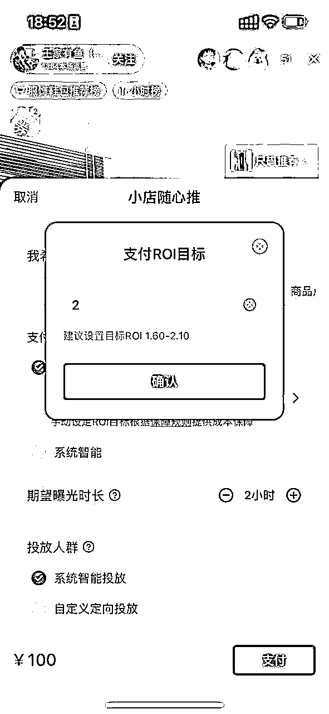

前面用高销售量、高销售额等方法选出的账号，都可以看看他们的 ROI ，进行综合判断。

方法三：前面找到的账号，比如，高客单、高销售额的直播间，可以直接在蝉妈妈、蝉小红、抖查查等数据平台，看账号的投流情况。

案例：

比如，我们找到了一个卖水貂皮草外套的账号。

11.点“直播分析”、“直播流量结构”。

可以看到近 30 天该达人付费流占比 7.99% ，低于行业平均 13.66%。

推荐 feed 高达 88%，高于行业平均 70%。

虽然不知道投放 ROI ，但低粉丝量、高客单价、高销售额，主要还是靠推荐流量，还是很不错的。

内容来源：《乡村发展基金会》

### 2.4.4 查看头部账号变现模式 @梨云

#### 2.4.4.1 方法

第一步，随意点击一个你感兴趣的头部账号，看账号有没有 4 种常规的变现方式。

广告变现：

看内容有没有产品：图文有没有产品展示、文案区有没有介绍产品看标签有没有明确打品牌名

看评论区有没有品牌种草

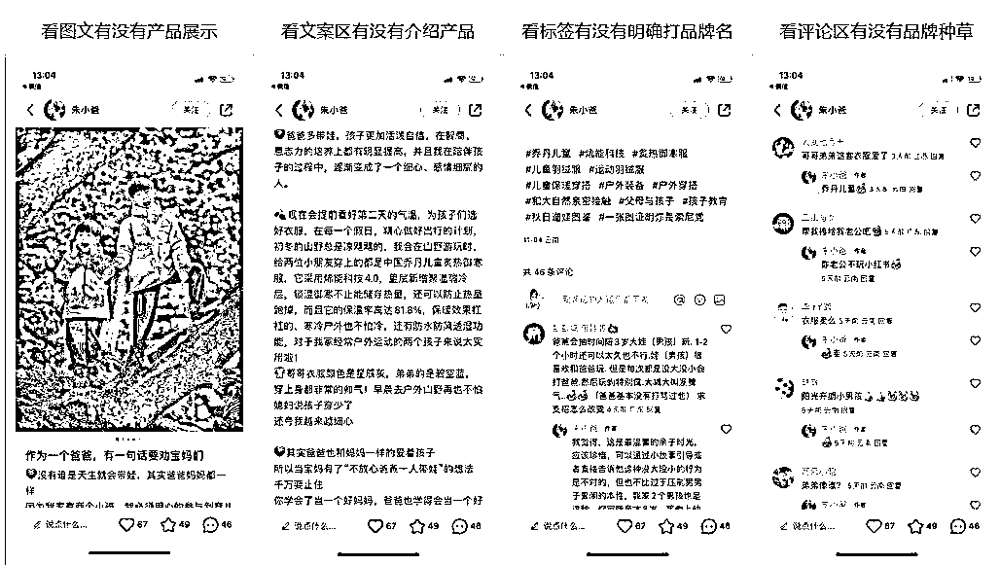

引流变现：

看主页简介内容：有没有@小号，或者小红书号就是微信号

看主页有没有群聊，可以加入试试，看有没有引流看小号置顶内容：有没有产品介绍、或者引流

看评论区引导：有没有@小号，或者暗示加入群聊看评论区，可能找到产品交付

开店变现：这个很简单，就看主页有没有店铺

还能清楚看到产品和价格。

直播变现：

主页是否有直播入口

可以参加一次直播，看看卖的产品、价格、销售情况第二步，如果一个持续更新的账号，没有常规变现模式关键词：群聊、店铺、带货，就值得筛出来，深挖。

具体如何挖：就是笨方法，从简介、置顶笔记，点开每一篇笔记的评论区，逐个找线索。

#### 2.4.4.2 案例一

简介线索：全网同名，这个线索不够，因为你不知道他主要的平台是哪个，一个个搜，效率太低了。

2.3.

只能从评论区逐个找，只要用户表达了“怎么拥有”的意向，也就能顺藤摸瓜了。发现线索：闲鱼

4.

复制小红书名字在闲鱼搜，可以发现他在闲鱼卖滴胶产品。

#### 2.4.4.3 案例二

简介的全网同名，依然遇到不知道是哪个平台的情况

2.再看置顶笔记：约稿 mhs

3.

复制粘贴“约稿 mhs”到百度搜索，答案就出来了。

这是一个专门画画约稿的 app 平台，一幅画 1500，收益可还行。

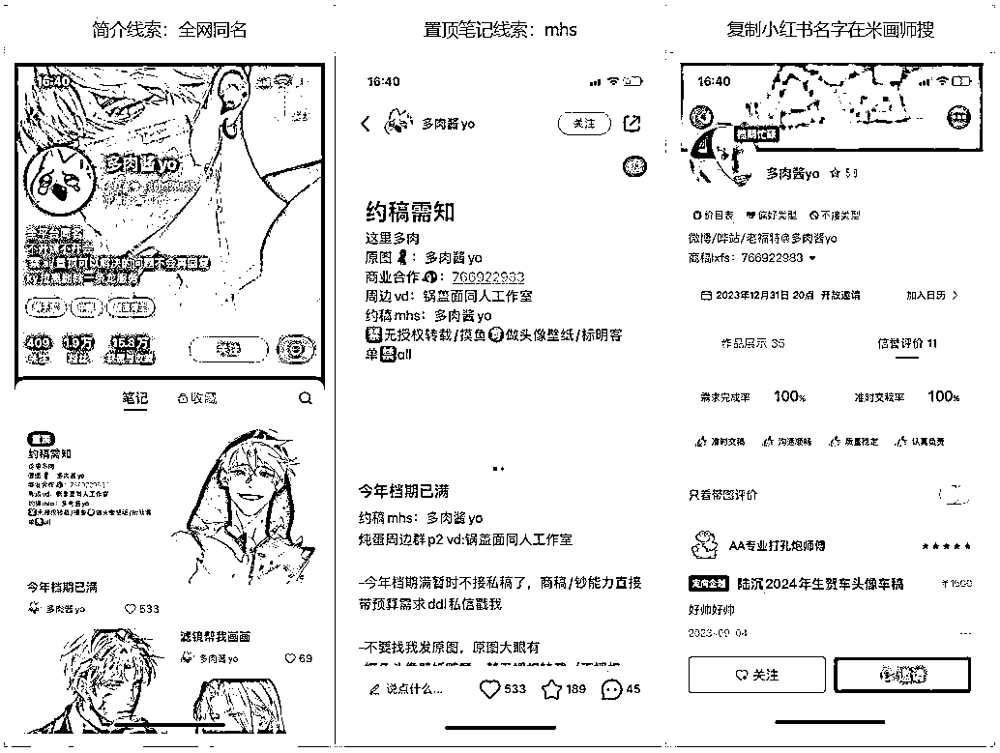

内容来源：《小红书不变现？用 3000 个人设号精细拆解变现模式，带你看到更多赚钱机会》

## 2.6 常用的信息挖掘渠道

下面会提供各大平台的常用数据分析网站，并从星球中搜索部分使用贴，给到大家。

### 2.5.1 抖音/快手数据分析平台：

蝉妈妈网站链接：https://www.chanmama.com/

功能：可以找达人、找爆品、找直播间、找品牌小店等等

相关使用帖：《蝉妈妈使用指南》

价格：个人版，年卡，每月 84 元

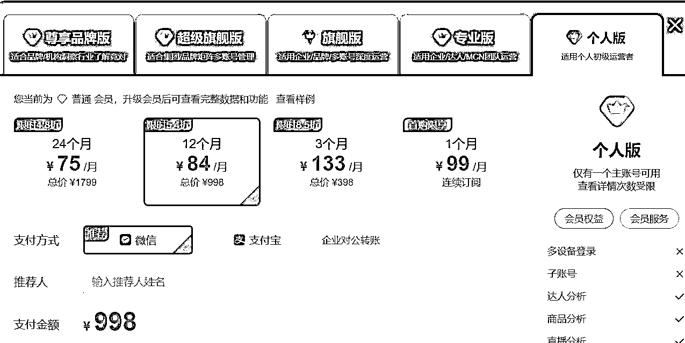

抖查查

网站链接：https://www.douchacha.com 主要功能：直播榜、达人涨粉榜、热销商品、飙升视频等等。

相关使用帖：《2021 实战抖音直播带货玩法经验分享！》价格：专业版，年卡，每月 61 元

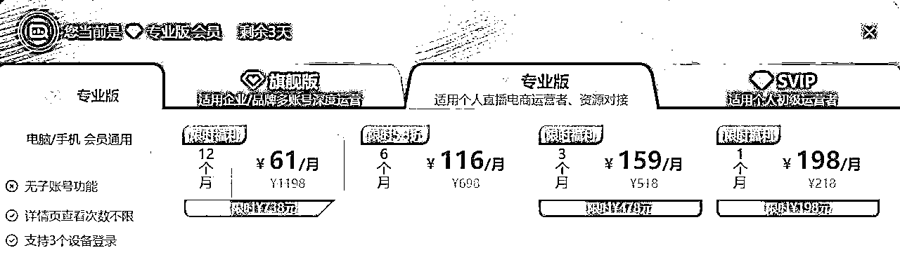

考古加：网站链接：https://www.kaogujia.com/

主要功能：找达人、商品、直播、小店、品牌、视频、关键词等，还可以看达人榜、直播榜、商品榜、小店榜。

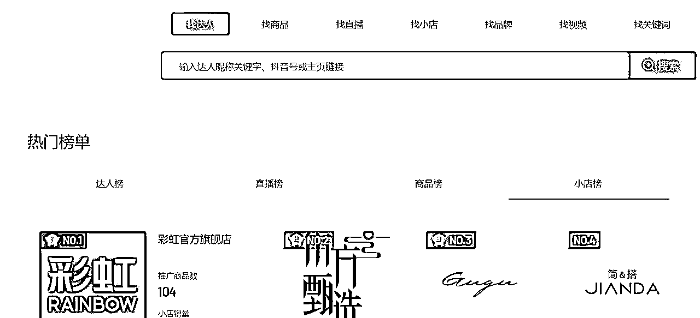

相关使用帖：《低成本，顺藤摸瓜法找对标账号和蓝海品》

价格：基础版，年卡，每月 98 元

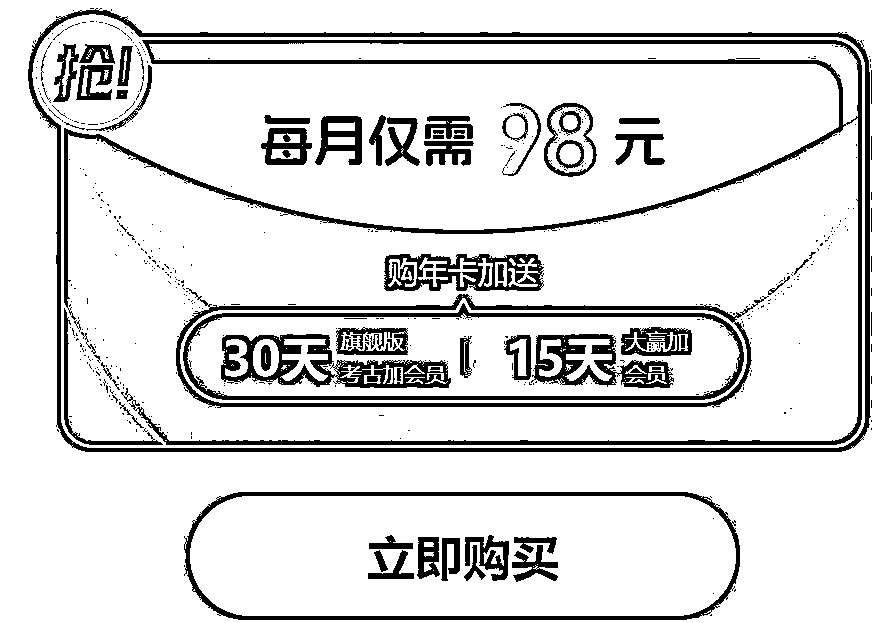

4.巨量百应：

网站链接：https://buyin.jinritemai.com/mpa/account/login?log_out=1&type=24&target_url=/dashboard/exclusive-selection-square/home 主要功能：是抖音为达人、商家、机构服务商提供的综合商品分享管理平台。可以在这里管理橱窗商品、管理直播间商品；可以分析自己账号整体的交易数据情况，包括视频、图文、店铺和直播的带货。

相关使用帖：《抖音小店玩法之达人合作》价格：免费。但仅支持 5 类人登录：

抖音/头条/抖音火山版的达人（需开通商品分享权限）

机构服务商（指管理达人的各个 mcn 机构）

小店联盟商家（指具有小店精选联盟权限的商家）

合作商家（指没有入驻小店，但被邀请合作的外部商家）

电商平台（指与抖音对接的各个电商平台）。

### 2.5.2 小红书数据平台：

蝉小红网站链接：https://www.chanxiaohong.com

主要功能：博主榜、笔记榜、品牌榜、热搜词等等

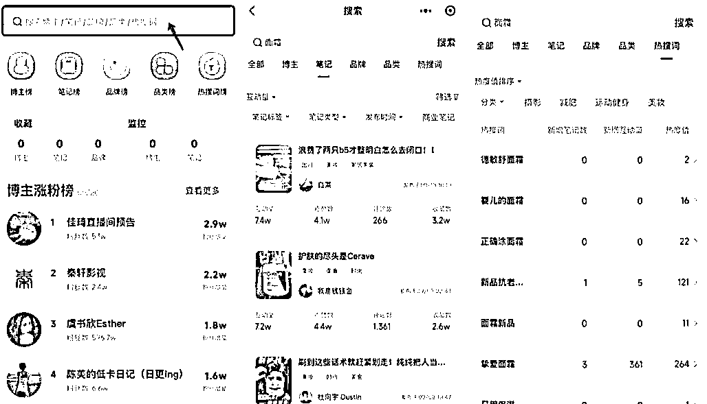

相关使用帖：《如何利用数据分析进行小红书电商选品？》

2.

千瓜数据

网站链接：http://www.qian-gua.com/主要功能：商品、达人挖掘、分析；热门内容查找、商品营销行为分析等

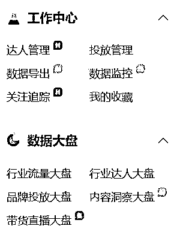

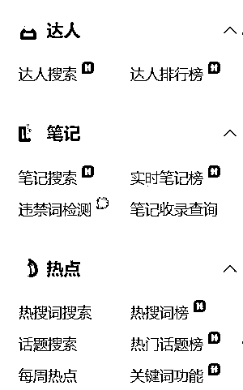

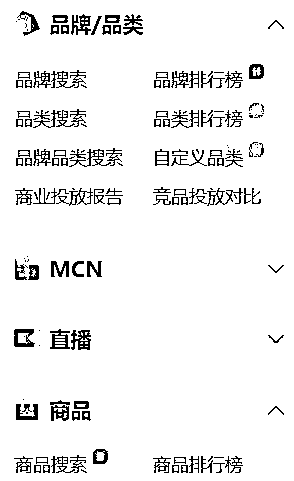

相关使用帖：《在小红书上，如何挖掘出 1000 个适合普通人的赚钱项目》

价格：高级版，年卡，1280 元/月

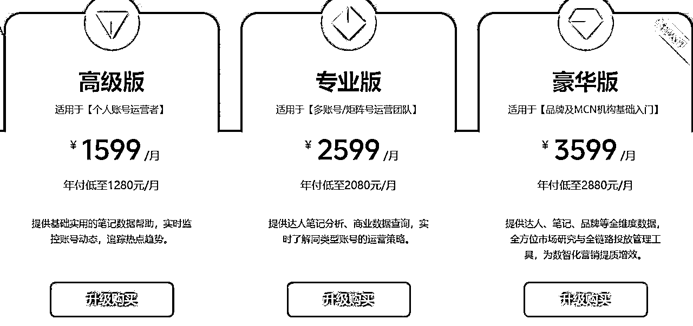

### 2.5.3 视频号数据分析平台：

新视：

网站链接：https://xs.newrank.cn/home 主要功能：找视频号、榜单、直播分析、直播商品分析、流量推广、对接合作等等。

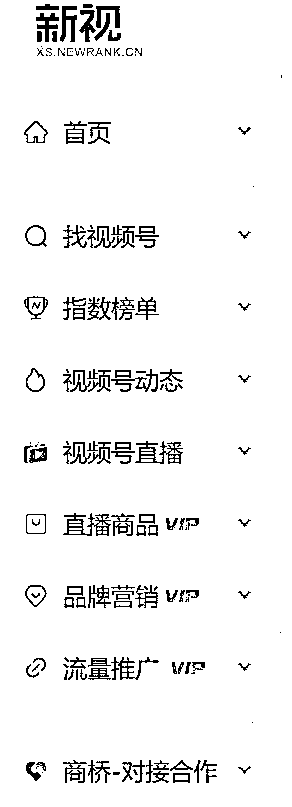

使用指南：《视频号头部 MCN 创始人：通过视频号赚到 300W 后，我总结了一套非真人出镜领域的标准起号方法论》价格：高级商务版，年卡，479.4 元/月

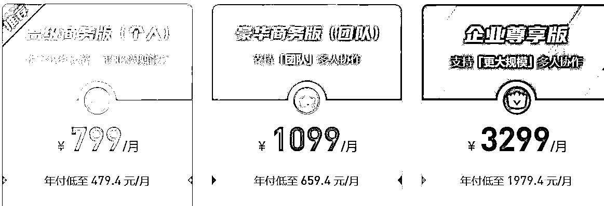

友望数据：网站链接：http://www.youwant.cn/

主要功能：目前主要有视频号榜单、直播带货榜，可以分析视频、达人、直播数据。

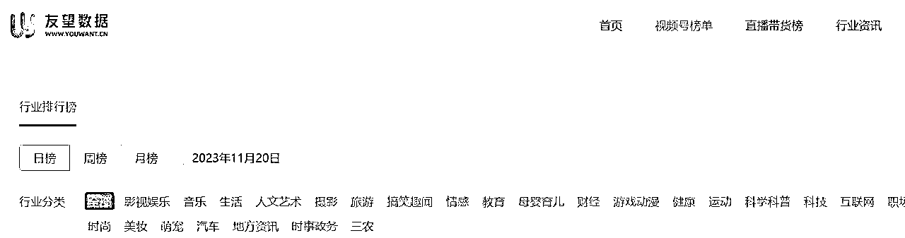

相关使用贴：无

价格：年卡，959 元/月

### 2.5.4 适合淘宝的数据分析平台：

生意参谋：

网站链接：https://sycm.taobao.com/custom/login.htm?_target=http://sycm.taobao.com/主要功能：观测店铺数据，可以查看在线商品的搜索人气、点击量、支付转化率等等。还有选词助手、商品温度计、销量预测等等。

相关使用贴：《线上生意兵器谱之 2 —— 生意参谋》

《从零到月入破万——蓝海店群》

价格：生意参谋大部分的基础功能都是免费的，只有一些高级功能是收费的。但有淘宝店才能使用。

### 2.5.5 适合 B 站的数据分析平台：

火烧云数据

网站链接：https://www.hsydata.com/index?redirect=%2F 主要功能：分析大盘流量，查找、分析 UP 主，带货榜，上单分析等等

相关使用贴：无价格：初级会员，99 元每月

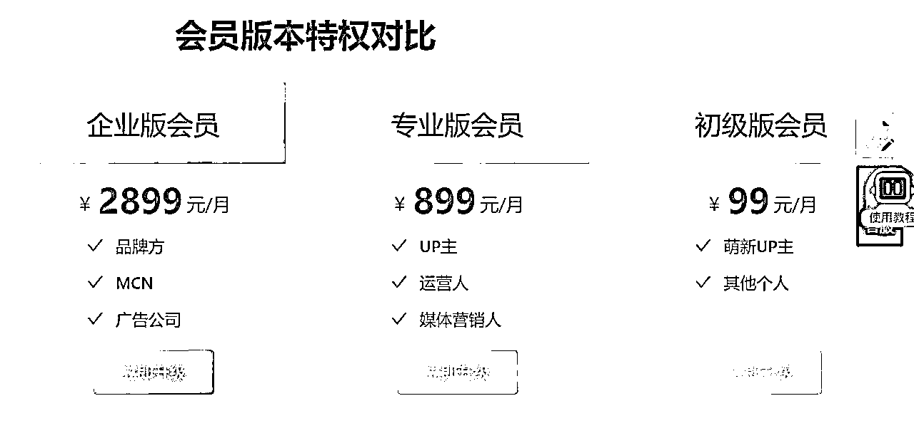

### 2.5.6 APP 数据分析工具

1.蝉应用

网站链接：https://app.chandashi.com/

主要功能：查询苹果、安卓所有 APP 的数据，包括排名、点击量、下载量等等。

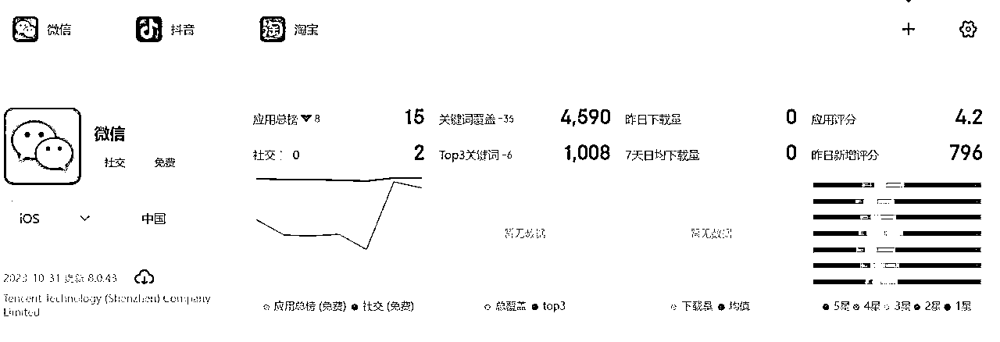

使用帖子：《从选品策划、变现、数据分析、App 矩阵多方面，分享 App 蓝海精细化运营玩法》

价格：年卡，180 元/月

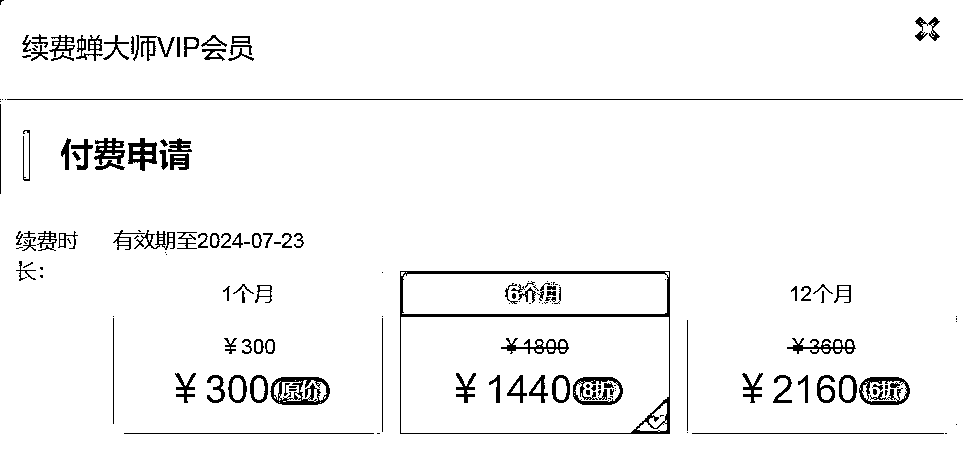

### 2.5.7 多平台网站

灰豚数据网站链接：https://www.huitun.com

适用平台：有针对抖音、淘宝、快手、小红书、小破站多个版本。

主要功能：选品、分析达人账号、分析直播、找素材等等使用帖子：《小红书单店铺单月 6000+利润选品保姆级教程》

《通过爆款笔记数据分析，我在 7 天内把一个账号做到了 60% 的爆文率》

《如何从小红书千条带货笔记深度挖掘，找到适合普通人的蓝海爆品》价格：年卡，52 元/月。

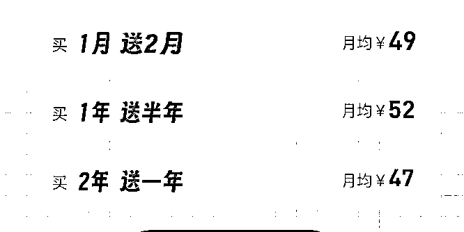

新榜网站链接：https://www.newrank.cn/ranklist/more?from=302

适用平台：公众号、抖音、快手、视频号、小红书、微博、B 站。

功能：可以搜几乎全平台的达人榜单；内容营销系统；账号数据分析、短视频数据分析；找达人、找合作、找社群。

使用帖子：无

价格：基础榜单功能免费；付费功能主要涵盖数据服务、运营增长、内容营销、版权分发等。单个平台分别收费，高级运营版，年卡，240 元/月。

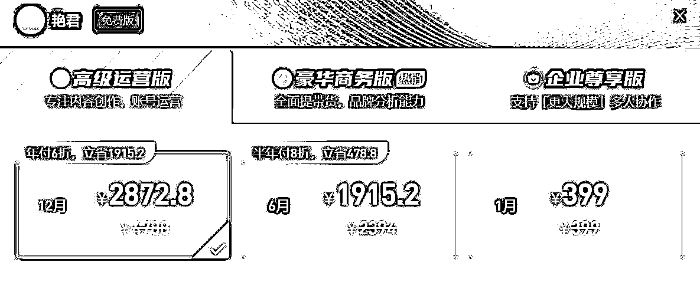

飞瓜数据

网站链接： https://www.feigua.cn/适用平台：抖音、快手，B 站

主要功能：除了类似蝉妈妈的达人分析、直播分析、商品分析等等，还有矩阵管理。

相关使用帖：《抖音小店玩法之达人合作》

价格：运营版，年卡，239 元/月。也是每个平台单独收费。

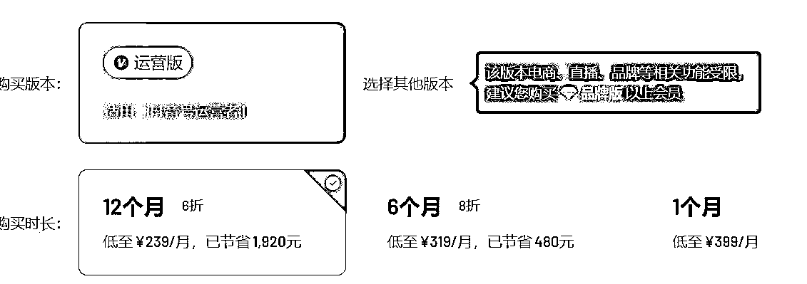

### 2.5.9 其他网站

1.5118 网

网址：https://www.5118.com 功能：行业词库、网站 SEO 数据分析。可以查各行业的热门词、网站搜索热门词等等。

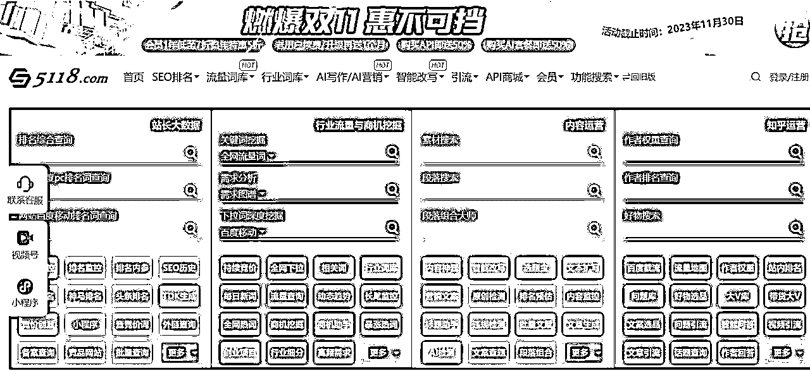

使用帖子：《通过覆盖知乎保险蓝海词下的关键回答，实现精准引流年入百万》价格：免费

2.

后羿采集器

网址：https://www.houyicaiji.com/功能：对搜索到的数据进行深度分析。

相关使用帖子：

《后羿采集器的使用方法》《通过爆款笔记数据分析，我在 7 天内把一个账号做到了 60% 的爆文率》

价格：免费

3.

巨量算数：网站链接：https://trendinsight.oceanengine.com/

主要功能：主要是用来查找各个领域的关键词，以及他们在各平台的热度。

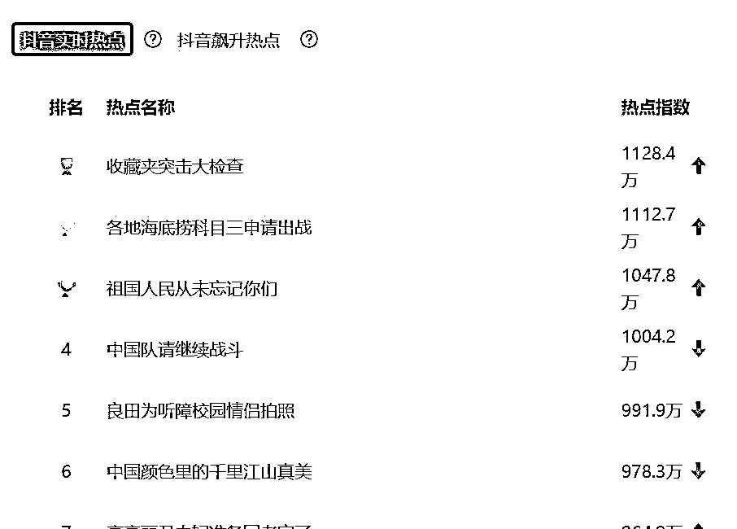

相关使用帖：《万字长文讲透兴趣电商选品理论与实操》

价格：免费大家如果在使用上面平台的过程中遇到问题，分享两种方法：

4.

使用关键词在星球中搜索，几乎每个平台都有圈友分享过自己的使用方法。

在工具平台找教程，有些平台在主页上就有使用教程、指南。

# 三、【项目实操 2/2】算账验证风向标

💡

章节概要

到这里，我们已经学到了十几种挖掘风向标的方法，但挖掘到机会还不够，我们还要进一步验证机会。

算账其实就是算这个机会可能赚到多少钱。也就是算利润。

我们将会给出五种常见项目的利润模型，包括：

✅线上带货

✅虚拟产品、服务✅线下店铺

✅网站、APP 类

✅实体制造

还用三个星球中的案例，给大家演示了具体如何查询项目收益信息，计算利润。

赶快开始算算你找到的机会吧！

## 3.1 算账的重要性 @百川

业务能力强的人，强在什么地方？

一个新的赚钱的业务告诉他，他能大概算出来能赚多少钱，在整个路径上的指标大概是多少，可能有偏差，但只要经过几次执行，立即能迭代出准确的值。

我在几家公司做运营的时候，参与过好几个内部孵化的项目，但是无一幸免，全部凉凉。

公司内部复盘时，大家有说：产品不行，运营还是缺流量，技术永远迭代跟不上……此类等等的总结。

但是我们都忽略了一个问题，那就是：盲目的开始，没有好好算账！

孙子兵法第一篇：计篇。就是在讲打仗前如何精细地计算，确定能胜才打仗，而不是靠以少胜多和奇谋巧计。

作为一个合格的生意人，首先应该做的事情是：算清一本明白账！

在开始这个生意之前计算好：

需要投入多少启动资金？

需要准备多少流动资金？

多长时间能回本？

人员成本，房租水电等各种固定成本？

最终可能失败的成本？

再计算需要获取多少流量，什么节点需要施加哪些运营干预，才能跑通这个数学模型？

等等

我们当初就是严重忽略了这个环节，只知道分析用户痛点，竞品分析，调研，产品规划等等惨痛过后，我学会了老老实实做一个生意人，把账算清楚。

内容来源：《CPA 推广一年营收 800 万，整合资源的生意要怎么做？》

## 3.2 具体如何算账？

### 3.2.1 算账的基本公式 @海程

无论做任何生意，无论生意大小，计算利润都符合下面这个公式：利润 = 营业收入 - 营业成本。

营业收入收入就是提供某种产品/服务，我们能够收到的钱。

也就是说，营业收入=产品 or 服务的销售单价销售数量，通俗讲就是单个品卖多少钱卖了多少量。

成本则是为了提供某种产品/服务，我们需要付出的钱。

这里面包括三大类成本：

1.

和提供产品/服务直接相关的成本。比如，进货的花费，生产产品采购原材料，生产设备，线下店还有房租、装修费用等等。

和销售相关的成本。比如，广告费、投放费，通过内容引流的话，就是制作引流内容需要投入的人工费等等。

财务成本。主要就是要交的税。

所以，利润 = 收入（ 销售量 × 客单价 ）- 成本。

内容来源：《如何用钱来驱动你的决策》

### 3.2.2 常见的收支计算模型

类型一：线上带货就是在抖音、快手、小红书、淘宝等线上平台，通过视频、图文或直播的方式带货。这里的货，主要指实物产品。

常见的收入有：卖货带来的收入=销售数量单件产品的价格=销售额毛利率

代理卖货的佣金收入=单件产品的价格佣金比率销售量

常见的成本有：进货成本

人工成本：主要是制作内容、账号运营、直播、售后服务等等。

如果投放的话，有投流广告费

开企业店的话，有工商执照费用

等等类型二：虚拟产品、服务

常见的收入有：卖虚拟产品的，比如，线上课程、资料包等等。主要是卖课程或者资料的收入=产品单价销售数量=销售额毛利率

提供咨询服务的，比如，心理咨询、生涯规划咨询、职业咨询、情感咨询等等。收入主要是咨询服务费=咨询人数单次咨询费提供陪跑服务的，比如，求职陪跑、小红书陪跑、抖音陪跑等等。收入主要是陪跑服务费=陪跑服务单价服务人数

常见的成本有：

主要是人工成本。需要生产课程、整理资料、花时间提供咨询服务等等。

广告投放成本。

类型三：线下店铺常见的收入有：

卖实物产品的，比如，服装店、二手手机店等等。主要是销售产品的收入=销售价格销售数量=销售额毛利率

卖会员服务的，比如，健身房、自习室等等。主要是会员费=月卡/年卡价格销售数量如果做连锁加盟，还有加盟费=加盟价加盟店数量

常见的成本有：租房的成本：房租&物业费&装修费

人工成本：主要是销售、运营、服务。

营业执照费用税费

类型四：网站、APP 类

比如，数据分析网站、常见的收入有：

广告收入。就是网站、或者 App 上面所有和官方合作的广告收入。这部分收入，和广告的合作方式有关。有些按照点击率计算，有些按照曝光量计算。

用户付费订阅的收入。简单理解，就是会员费，像 B 站大会员，腾讯视频会员等等。这类收入=订阅用户人次*单次缴纳的会员费。

用户购买付费内容的收入。就像我们用微信看书时，购买某本书；或者听网易云音乐时，下载某个付费曲子。这类收入=购买人次*单次购买价格。

常见的成本有：

人工成本。制作、运营、维护网站需要投入的人工费。

网站或者 APP 的域名费。

税费。

类型五：实体制造

就是自己有厂子，直接生产制造商品，再销售的。

收入主要有：销售产品获得收入=销售单价*销售量

成本主要有：

工厂的场地费工厂内的各种设备费用

所有员工的工资购买生产产品需要的原材料

各种税费

知道了常见类型生意的利润计算方式，接下来就要想办法拿到这些数据。但自己还没有实践之前，怎么获得这些数据呢？

答案是：看已经在做该机会的人的数据。也就是通过竞品拿数据。

### 3.2.3 通过竞品拿数据

1.线上的项目，可以直接在网上找数据。

方法一：直接看账号的店铺数据。

比如，下面这个账号。

点进橱窗，可以看到橱窗绘本价格 20-30 元

佣金率 15%，一本 30 元的书，利润为 4.5 元

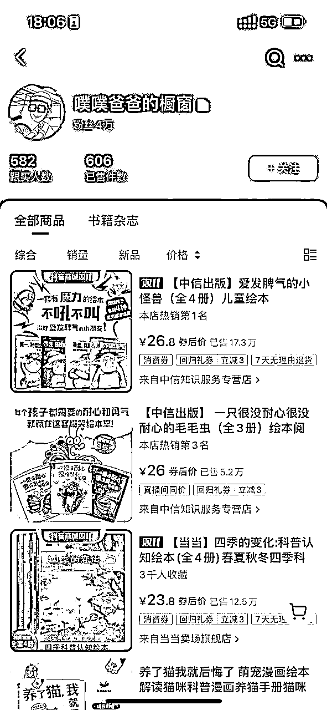

方法二：假装客户，咨询了解情况。@秦汉唐我们可以做这几步：

a. 模仿留言中的咨询语气在评论区留言。

b. 关注账号，假装用户私信他们，表明自己有需求。

c. 拨打了他们主页的官方电话。（如果有的话）

联系上以后，要注意依然模仿用户的身份了解信息，一般至少可以了解到产品价格，服务内容，哪些是引流产品，还有哪些进阶服务等等。从他们的微信朋友圈也可能获得很多信息。

更进一步，还可以说自己有些朋友也感兴趣，也许可以切换不同身份，挖掘到更多信息。

比如下面这个例子：

我在刷抖音时，关注到一个儿童游乐的视频，留言量非常多，其中还有大量用户表达需求。

我就关注到了这个项目，立刻试图跟项目方建联：

a. 模仿上面的咨询语气在评论区留了言。

b. 关注账号，假装很急的样子私信了他们。

c. 拨打了他们主页的官方电话。

不出意外，2 个小时后（估计是流量太大接不过来），在私信窗口，给我发了一个微信号，成功加上了微信。

加上微信后，给我发了 2 个文件：《已被加盟的城市地图》&《代理政策》。他们分为市代和区代，加盟费用总共在 4W 左右，市代可以发展代理拿返点。

我看到文件中已经有 130 多个城市被拿下了市代。

我简单的算了笔账，不禁眼里发光：130 个城市*4W=520W，我又翻了一下他们抖音账号往期的时候，发的都是单个玩具的展示视频，一直都是不温不火的几个十几个赞。

也就是说，单这 1 个视频，给他们带来了 500 多万的收入！

线下的项目，可以用蹲点观察法。

比如，17 年，我在研究喜茶、星巴克时是这样算净利的：连续一周，早晨 7 点到，晚上 10 点走，工作日/休息日分开，晴天/雨天分开；

开门买一杯，收摊时买一杯，记住流水号；一小时里每十分钟，记录分男女的人流数，到店数，拍视频留档；

蹲店里看一单一般是几杯，客单价多少；

估算所有原材料成本；找物业套店租和物业费；

这样就能算出大概能挣多少钱：单量 × 客单价 - 原材料成本- 店租 - 物业费。

下面，再来看几个案例，以更好的理解如何算账。

内容来源：《如何用钱来驱动你的决策》《1 条视频带来 40W+利润的项目复盘》

## 3.3 案例

### 3.3.1 案例一：线下自习室 @杨涛

第一步，算收入：

线下项目有租房成本，一般是按年出租的，所以，收入我们也计算年度收入。

1.

了解主要产品和价格。

可以去大众点评搜【线下自习室】，就能看到他们的产品和价格。

可以多对比几家，会发现除了低单价、单次的引流产品之外，主要产品和价格：月卡：379~399 元

30 次：479~499 元季卡：949~1088，固定座位 1499

半年卡和年卡，有些店有，有些店没有，我推测时间太久，消费需求应该不大，不是主要产品。

从销量最好的这家店来看（中间这张截图），推测月卡和 30 次卡应该是销售占比最高的品。

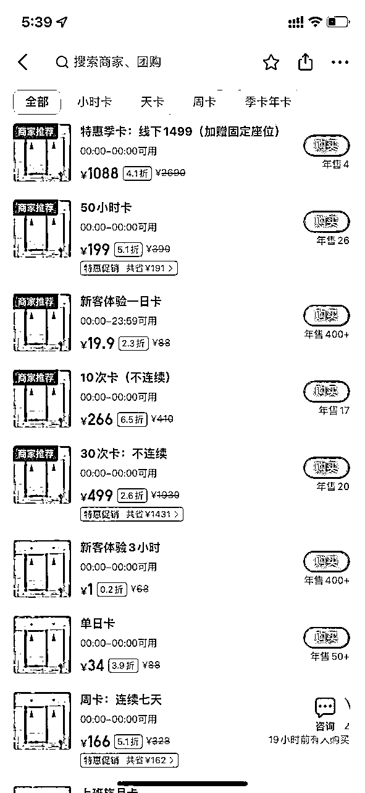

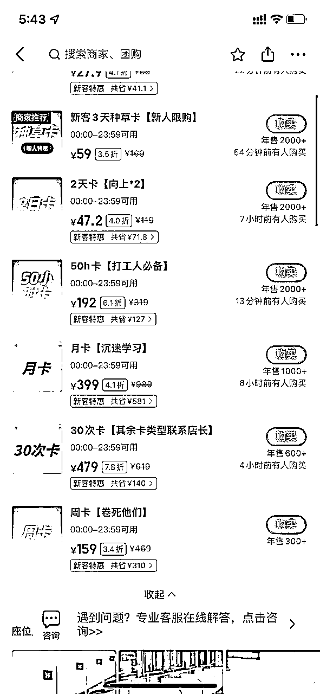

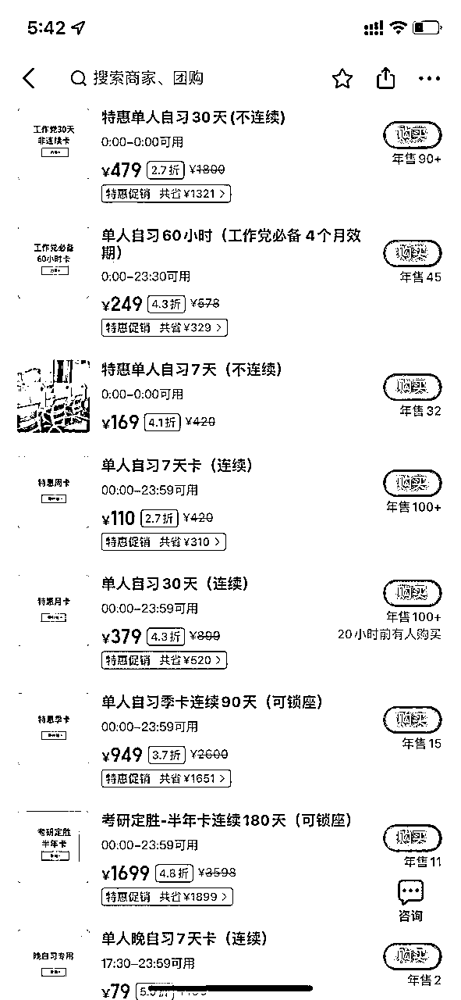

了解销售情况。

美团上的只能算一部分，应该有很多用户线下体验以后就直接线下付费了。所以，最好能亲自去跑几家店，作为用户体验一下，甚至可以象征性办个周卡和老板交个朋友，问问情况。

问不出来的话，也可以自己数座位。

前面产品分析的结论是，月卡应该销量占比最大，所以我们可以按月推算：每月的销售额=店铺座位数×月卡价格*月度上座率。

数一下店铺的座位数，再抽样去几天，挑周末、工作日、节假日、早、中、晚不同时间段去看上座率，毛估估个值。

还可以在生财星球内搜索，如果有在做相关项目的，可能会提到数据。

比如这个，日均上座率 65%。

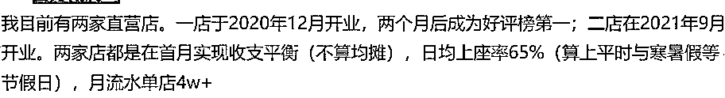

年度收入=每月的销售额 12=店铺座位数×月卡价格月度上座率 12 月卡价格按月卡和 30 次卡的均价来算，是 450；假设有 50 个座位，月上座率按 65% ；年度收入=50450*65%*12=18w

第二步，看成本

1.

主要成本有：全年的房租+软硬件总成本。

2.全年的房租成本。这个不同城市、位置，价格有差异。

我们前面既然已经去了线下考察，自然知道店铺的位置、面积，就可以在租房网上查询价格，还可以电话咨询下物业费、电费等各项费用。假设是一年 4 万。

软硬件主要有简单的硬装、灯，桌椅。

具体花费多少。同样可以和老板聊聊，链接下星球在做的伙伴问问。

如果位置在写字楼内，这些可能都是现成的，会包含在租金和物业费里面。

如果是在住宅楼，需要自己装，桌椅可以在 1688 或者拼多多搜索价格，50 个座位，大概 7250 元。硬装可以根据面积大小，假装客户找几家装修公司问下，就能清楚知道。

根据星球伙伴的经验，50 个座位的店，软硬件总共大概需要 6 万。

4.

计算利润。

房租每年都有，软硬件是一次性投入，次年开始就没有了。

这样，首年的利润=年度收入-房租-软硬件成本=18w-10w=8w

首年之后，利润=年度收入-房租=18w-4w=14w 内容来源：《涛说 ，平民开店手册「一」线下自习室》

### 3.2.2 案例二：线上-抖音图文&直播带货

账号：王家有鱼（2 号店）

类目：女装裤子（只卖裤子）

带货形式：通过图文起号，爆了以后开播带货。日常更新，图文挂车。有抖店：王家有鱼自营店。

第一步：算收入

1.

看店铺货源来自于哪里，推测利润率。

无货源模式，推测可能是从拼多多或 1688 进货

在拼多多、1688 搜同款，对比进货价和王家有鱼店铺的价格，计算利润率大概是 20%-60%

裤子 1 差价：40 元，利润率 37%。抖音卖 106.9，拼多多卖 69.9 裤子 2 差价：51 元，利润率 60%。抖音卖 83.9，拼多多卖 32.8

裤子 3 差价：39 元，利润率 37%。抖音卖 103.9，拼多多卖 64.9 裤子 4 差价：21 元，利润率 20%，抖音卖 113.9，拼多多卖 89.9

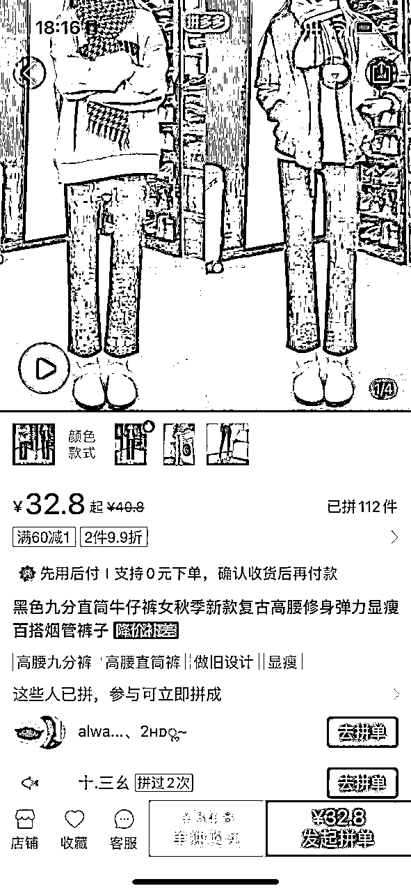

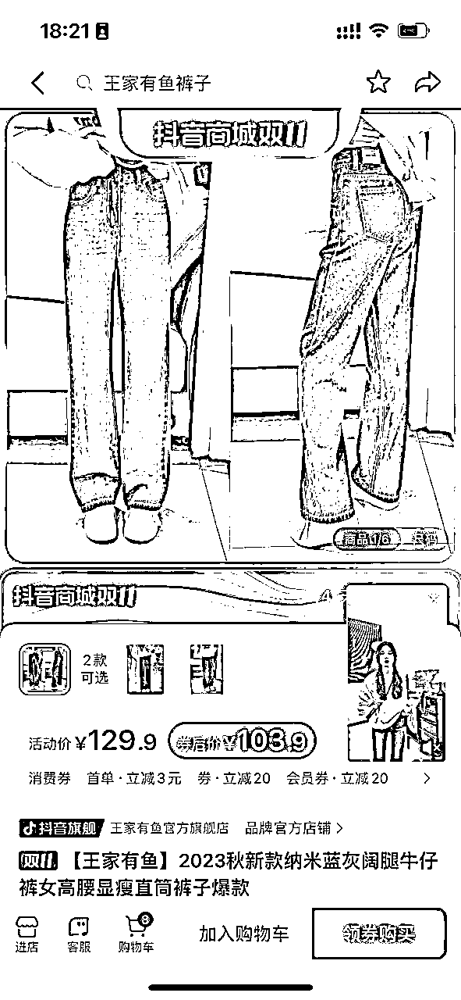

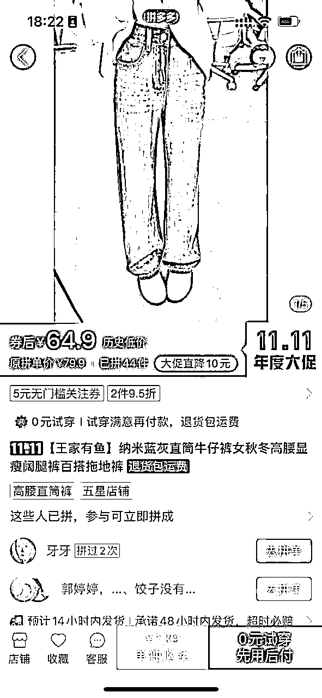

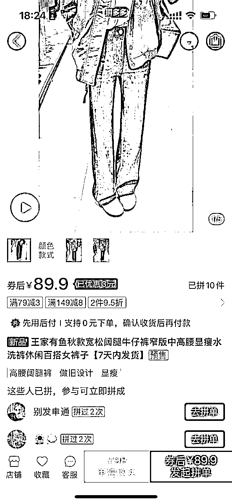

2.收入=销售额*利润率

直接在考古加搜达人账号，可以看到近 1 个月的销售额：100 万 -250 万。

收入=销售额*利润率，大约是 20 万 -150 万。

第二步，看成本

分析收入主要来源于图文带货、直播带货、还是店铺带货。推测大致需要投入的成本。

王家有鱼自营店，店铺情况。

商品带货佣金率：0%/13%；基本没人带货

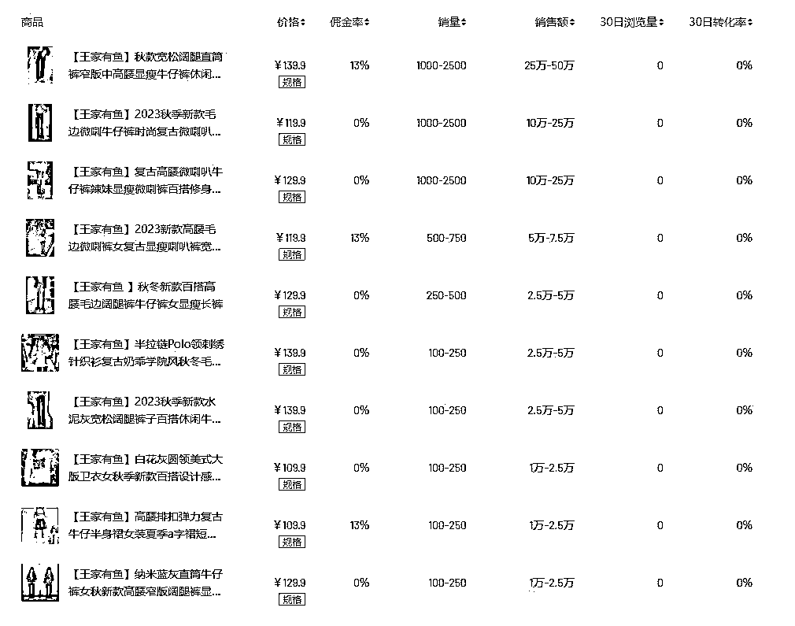

可见主要靠直播和图文带货。

直播带货收入占比 67%，销量 75-100 万，30 天直播 27 场，

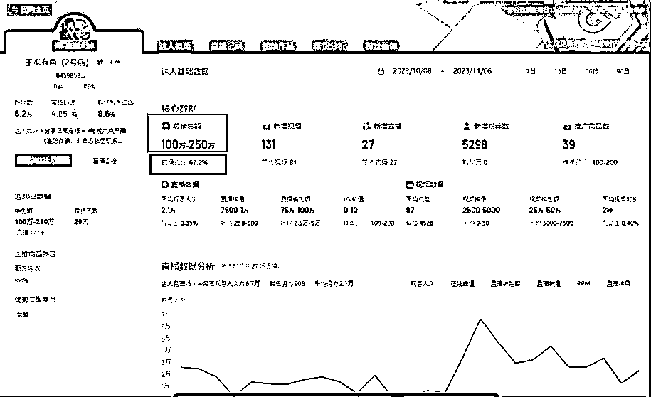

其余 30%主要是图文带货收入，大概 30-75wGMV。30 天新增图文 131 条，其中挂车 81 条。

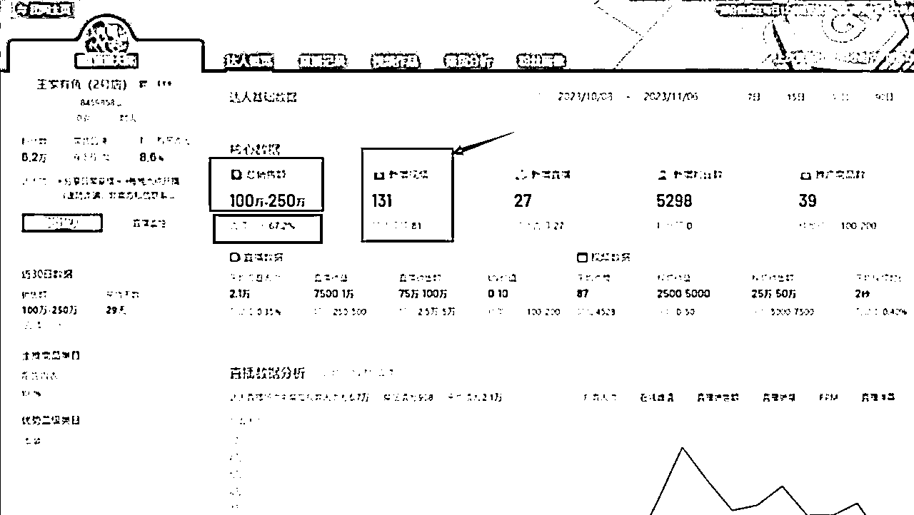

所以，这个项目主要的成本就是：直播、图文制作、货源沟通、售前售后等。

内容来源：《抖音图文带货项目拆解》

### 3.2.2 案例三：海外工具站 @亦仁

第一步：算收入

1.

找到竞品，了解变现模式。

挖掘到『instagram download pictures』这需求，在 Google 搜索它，结果的第一页出现了 6 个解决此痛点的小工具。

点开排名第一的网站，功能和模式都比较简单，直接通过输入 Instagram 图片的链接就可以将图片直接下载下来，盈利方式是 Google Adsense 广告系统。

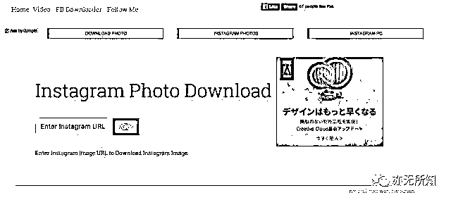

1.了解收入计算模型。

在网上搜索“Google Adsense 广告系统的收入计算”，就可以找到总收入 = 点击次数 x 平均每次点击费用 + 展示次数 x 每千次展示费用 / 1000。

其中，“平均每次点击费用”是指广告主每次点击广告的平均费用，“每千次展示费用”是指每 1000 次广告展示所获得的费用。

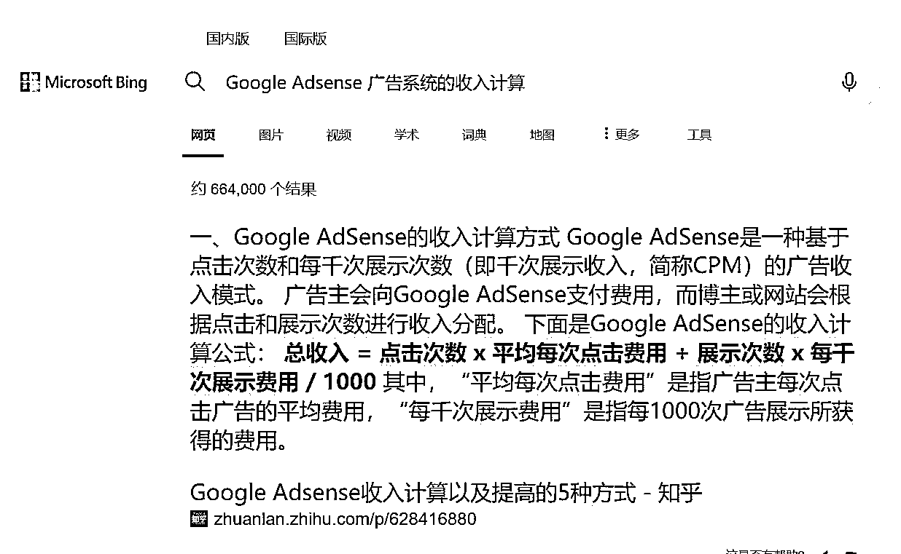

简单解释，就是用户点击收益+用户看到收益 2 个部分。

这两个部分其实都和网站的用户访问量有关，有访问，才能看到，才能点击。

所以，网站的日收入大致可以=千次访问收益日访问量

2.

计算日收入=千次访问收益日访问量网站的日访问量多少？

可以用 SimilarWeb（网站流量数据统计插件）查一下，每月 120 万访问量，每日 4 万访问量。

千次访问收益大概多少呢？

依然可以网上或者生财星球搜索“Google Adsense 的收入”。

可以看到 1.2w 日访问，收入 44.6 刀，每千次访问大概 3.7 美元。

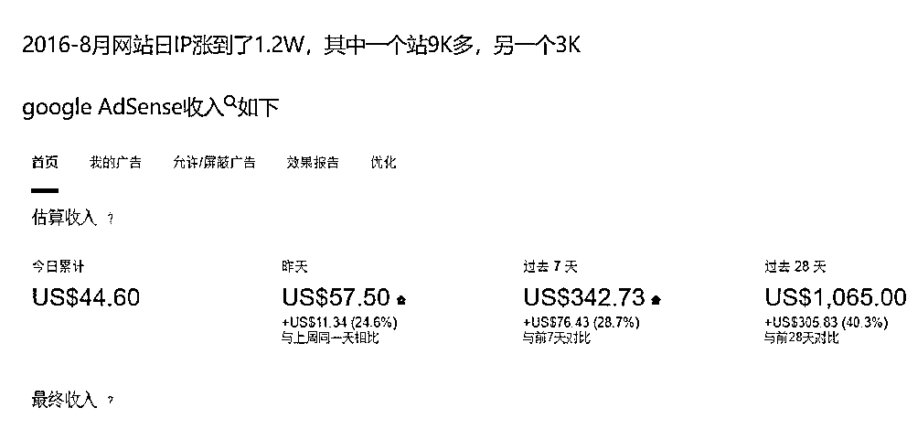

考虑到平均值，我们就打个折，按照千次访问 2 美元的收入来估算，此网站估计每天收入 80 美元，每个月收入 2400 美元，每年收入 28800 美元，约人民币 20 万元。

不错，相当于一个白领一年的收入了！

第二步，看成本在对比下成本，主要是人工费，可以在生财星球链接该领域的伙伴，了解下需要掌握的能力、投入的时间、精力。

预估下大概需要多长时间做好这个网站。

成本=投入时长*自己的工时。

利润=收入-成本，如果觉着不错，就是值得投入的项目。

内容来源：《通过 Google 挖掘细分市场的一个案例》

