# 视频号 IP 带货 202312

> 来源：[`remhu1p2pr.feishu.cn/docx/DU4xd8ahzomzidxRVTpcplJknNf`](https://remhu1p2pr.feishu.cn/docx/DU4xd8ahzomzidxRVTpcplJknNf)

# 视频号 IP 带货

出品时间：2023 年 12 月 18 日

手册使用说明：本文旨在向你展示一个项目的更多可能性，帮助你更好地理解和实操。

建议：如果需要快速定位到精确内容，可以使用快捷键 Ctrl + F/command + F 的形式，搜索「关键字/词」，查找你想要的内容

写在前面

💡欢迎大家来到 12 月航海 | 视频号 IP 带货 | 实战手册，相信在接下来的日子里，我们将在这里见面很多次。

在开始做视频号带货项目之前，让我们先来解决几个问题：

1）视频号 IP 带货是什么项目？

这次航海叫做视频号 IP 带货，顾名思义就是在视频号通过本人出镜拍摄短视频带货。

2）视频号 IP 带货现状如何？收益空间如何？

视频号的用户并不低端，目前已有大量的案例和官方的数据表明，视频号平均客单价可以做到 200+，且平均复购率达到 60%，想象空间非常大。

但视频号不再像前两年那样，简单通过搬运或者混剪就能捡钱。今后需要踏实做内容、做 IP，才能够长期在视频号赛道赚到钱。

所以，我们转战有一定创作门槛的真人露脸 IP 是更好的选择。而且，当前的视频号真人 IP 尚未像抖音一样“内卷”，仍有大量自然流。

素人 IP 不做付费投放，就能够获得这里海量的流量机会。

希望大家可以在这次航行里收获成果外，结识一群战友。

以下内容由生财有术联合圈友制作而成，仅供航海船员以及生财有术星球圈友学习使用。

同时也欢迎圈友们在实践过程中持续反馈，和我们共同完善，可以联系鱼丸（yuwan387）提供修改建议～

【更新提示】新手册使用方式

在开始前，我们来简单了解一下这个手册的正确打开方式，方便你根据自己的情况来灵活使用。

在这里，手册整体的步骤顺序是按照从 0 - 1 跑通一个视频号带货项目进行的，你可以参考航线图，按顺序开始实操。也可以根据自己的实际需求选择性阅读。

需要注意的是：本次手册相较于过往航海，进行了较大的改版。之前的手册尽可能的展示更多可能的玩法供大家自由选择，本次改版后的手册，分为【必修】和【选修】两个大的章节：

必修篇内容：为该项目从 0 到 1 跑通一个最小 MVP 的所有步骤，即航线图对应行动路径。如果你还在前期摸索中，想先完成一次整体的项目流程，那么建议从必修篇开始认真阅读和实操，不在玩法选择上做过多的纠结。

选修篇内容：则为该项目的更多玩法、案例和项目放大等相关内容。如果你已经跑通了项目的最小 MVP，想进一步了解该项目的更多可能，获得灵感，那么选修篇一定不要错过。

📌如果你还未接触过视频号带货项目：

建议在正式实操前，先初步了解下项目全貌👇

✅【项目概述】了解视频号 IP 带货📌

如果你对项目整体已有大致的了解：

请从航线图第一阶段的步骤开始实操，这个阶段你可以从手册的第二章开始阅读，逐步完成整个项目👇

✅【项目实操 1/3 】前期筹备-工具&账号准备

✅【项目实操 2/3】制作并发布视频，持续复盘优化

✅【项目实操 3/3】挂商品，带货变现

📌如果你已跑通 MVP ，想放大项目：

可以重点阅读以下章节，扩展更多玩法👇

✅【项目放大】电商 IP 直播带货

航线图和手册是高度关联的，因此你可以根据自己所在的环节，进行相关步骤的学习。

以上阶段中，所有的航线图步骤建议大家在航海前两周完成，完成后，建议以复盘&优化&提效为主，更多的选品和发布短视频，扩大自己出单的概率。

# 必修篇：跑通最小 MVP

💡

必修篇概要必修篇主要介绍视频号带货的【项目基本情况】和【项目基础玩法步骤】，让你对项目有一个全面了解，并按步骤完成项目的 0-1，跑通最小 MVP 。

如果你是本项目新手，建议在正式实操前，先初步了解下项目全貌：✅【项目概述】了解视频号 IP 带货

如果你对项目整体有了大致了解，就可以按照项目核心步骤，开始学习实操：

✅【项目实操 1/3】前期筹备，完成工具&账号准备

✅【项目实操 2/3】制作并发布视频，持续复盘优化✅【项目实操 3/3】挂商品，带货变现

在必修篇，航线图和手册顺序相对应，你可以按照手册的顺序进行学习，即可逐一完成航线图的每一个任务。

在后续的每个关键步骤的章节概要中，我们也将提到相关航线图，提醒你完成相关步骤。

接下来就正式开始吧！

# 一、【项目概述】了解视频号 IP 带货项目

💡

章节概要本章节中，我们将一起认识视频号 IP 带货项目。

视频号平台目前流量如何？平台用户画像有什么特点？

目前视频号 IP 带货项目市场如何？

哪些赛道适合新手选择？

项目的玩法和关键点是什么？……

这些，都是我们在本章节中会解决的问题。

本次航海的重点，就是告诉大家如何从 0-1 跑通视频号 IP 带货项目。

那么对整体的项目概况了解是必不可少的，一起来了解一下吧。

## 1.1 项目现状

### 1.1.1 项目概况

这次航海叫做视频号 IP 带货，顾名思义就是在视频号通过本人出镜拍摄短视频带货。

视频号可以说是目前流量赛道上红利最大的项目。我们希望通过这次航海，帮助大家在这个赛道上找到长期流量变现的机会。

先来看看视频号究竟蕴含多大的流量机会：

目前视频号月活跃用户已经超过 8 亿。

腾讯财报数据显示，2023 年视频号视频播放量同比增长 50% ，用户使用时长同比几乎翻倍，整个平台还在快速增长期。

但是，视频号不再像前两年那样，简单通过搬运或者混剪就能捡钱。今后需要踏实做内容、做 IP，才能够长期在视频号赛道赚到钱。

2022 年 3-5 月，随便搬运就可以爆视频。

2022 年 6-8 月，简单混剪还可以爆视频。

2022 年 8 月份之后，搬运和混剪就更考验速度和技巧了。

2023 年 2 月，对产品要求更严格，审核时间增长，对视频内容的原创度提高审核和扶持。

2023 年 8 月，视频号电商规则逐步完善，开通【运费险】【先付后用】功能，公布旗舰店入驻标准。此外，视频号普通账号主页不再显示【企业微信】，做矩阵号引流私域的影响较大。

所以，我们转战有一定创作门槛的真人露脸 IP 是更好的选择。而且，当前的视频号真人 IP 尚未像抖音一样“内卷”，仍有大量自然流。素人 IP 不做付费投放，就能够获得这里海量的流量机会。

这个是皓宇教练 12 月初新开的矩阵号，三个星期就有 2 个 10 万+ 点赞的视频，播放超过千万，冬至的带货视频第一天变现 6

所以，这期的视频号 IP 带货，是普通人能够入局赚钱的机会。

### 1.1.2 用户画像

想要入局视频号，首先要了解平台的用户是谁。视频号的用户画像是怎样的呢？

从大盘的统计数据看，视频号接近 60% 的用户来自三线及以下城市，40+ 用户占比超过 30%。

进一步来分析下用户在平台的行为。

很多年轻用户，只是从朋友圈和社群进入视频号随意看一两个视频。这类用户，实际上并没有对 IP、甚至视频号平台形成粘性和习惯，并不是我们想要的流量和粉丝。

那哪类用户才是真正有黏性的呢？

根据我们过去的做过的视频号变现赛道（下面会详细分析）实践中，观察到的数据来看。

这也是我们做视频号 IP 带货要关注的典型用户画像。

## 1.2 如何做好视频号 IP 带货

### 1.2.1 选择赛道

根据我们对这批用户的分析，综合我们多个账号的经验，为大家总结了适合视频号 IP 带货的一些爆款赛道，可以分为分以下几类：商业类

内容主要包括：商业思维、赚钱项目、名人故事等。

这类视频能够获得精准的粉丝，未来变现相对会比较容易，但目前起号较为困难。

典型话题：生意人的入门思维-窄门思维，三个在家就能做的小生意，马云、刘强东名言。

国学经典类内容主要包括：运势、谋略认知、人情世故等等。

适合快速获取流量，可以帮助你建立单个性别的粉丝模型。

典型话题：什么样的人会有一辈子好运气，一个人最大的风水是什么。

社会热点类视频主要用于蹭流量，跟着事件热度容易上热门。

但是这类视频有两个缺点：一是热点事件很多人都关注，通过视频获取的流量不够精准；二是会让你的人设较为正义，后期变现时容易被质疑。

典型话题：日本排放核废水，明星新闻。

民生类视频它可以说是所有视频的底层话题。

这类话题的两个关键字是“对立”和“共鸣”，聚拢一批用户形成共鸣，再形成不同用户群体之间的对立。常见的内容包括农村和城市、贫富人群、子女教育、养老等。

典型话题：富人家庭和穷人家庭的小孩教育，为什么越来越多的人选择逃离大城市回老家生活，老人的赡养问题，判断一个男人是否能成大事。

情感类情感类的内容主要包括：婚姻、相亲、恋爱等。

也算是一类特殊的民生话题，集中在性别的对立和共鸣。

典型话题：为什么北京的好男人反倒更容易单身，老公出轨了老婆还要继续忍让吗。

那我们该选择哪个赛道呢？

❌商业类：在现行视频号平台规则下，起号相对其他赛道困难一些。

❌国学经典类：转化主要靠书籍一个类目，性价比可以但是单类目需求量有限。

❌社会热点类：流量不够精准，变现时容易被质疑。

✅民生类：流量和转化都可以

✅情感类：流量和转化都可以

所以，我们的这次航海，内容方面会选取民生和情感类的赛道，它们更容易吸引流量，帮助我们实现快速变现的目标。

### 1.2.2 了解流量机制

那如何吸引到流量呢？这就涉及到理解视频号的流量机制：超过 50% 的流量来源于信息流自然推荐。

20-25% 左右的流量来自于心心和分享，也就是视频号的特色“社交推荐”。（心心和公众号“在看”的逻辑类似，用户点了心心之后，这篇内容会被推荐给这个用户的好友；而点赞不会被推荐）

在视频的页面上，也可以看到：推荐、心心、关注，是视频号最顶部的三个推荐入口。

所以，视频号本质上是一个完全依靠推荐的流量分发机制，很适合新手起号。

### 1.2.3 最小 MVP 路径 & 关键步骤

老师已经用很多账号跑出了成功的品以及配套的视频内容，按照老师的方式 1：1 复制模仿拍摄视频、粉丝达到一定量后直接拍带货视频带货。

因此，从 0-1 的最小 MVP 可以总结为：

1.

完成视频拍摄准备。

准备设备&搭建账号&解决出镜的心里门槛。关键是尝试出镜的感觉，看自己是否可以接受。

2.

完成拍摄练习，做到视频达标。

一开始先别急着发视频，先反复练习，保证视频质量。根据老师给到模板视频和文案，1：1 模仿，照背文案，模仿背景、着装，拍摄、剪辑。

参考手册中的优秀视频标准，每天拍摄至少 3 条视频，每拍完一条，对照手册中的自检清单进行检查。通过 1-2 天的练习，做到文案流畅，语气、表情、动作等自然，完全达到自检清单中拍摄环节的各项标准。

然后，继续练习剪辑，对照手册中的视频操作流程，每天至少剪辑 1 条视频，每完成一条，对照手册中的自检清单进行检查。

通过 1-2 天的练习，完全达到自检清单中剪辑环节的各项标准。

发布视频，获取流量。

在 10 万＋播放前，使用手册中给到的文案，按照拍摄和剪辑标准，每 2 天制作并发布 1 条视频。如果你学有余力，可以每天发布 2~3 条。

根据视频数据，持续复盘优化。出现 10 万＋的播放或者粉丝达到 1000 后，每天至少发布 1 条流量或带货视频。

带货变现。

实现流量目标后，可以开始发布带货视频，前期先引导到橱窗成交，千粉之后可以发视频挂小黄车，引导客户下单。保持每日复盘的习惯，坚持复盘和优化素材内容，持续更新和调整。

其中，1：1 模仿拍摄视频，是本项目的关键动作。

# 二、【项目实操 1/3 】前期筹备-工具&账号准备

💡

章节概要

了解了视频号 IP 带货项目的整体情况后，我们就要正式开始启动了。

要做视频号 IP 带货，需要先完成拍摄工具的准备和账号准备。

在这一章节，我们整理了项目开始前需要筹备的事项，包括：

✅准备拍摄工具、剪辑工具和服装

✅完成视频号账号注册与包装，并了解常用的各项功能✅了解视频号运营规范

💡

本章航线图

完成本章节的学习和实操，即可完成航线图的第一阶段：完成视频拍摄工具准备（约 1-2 天）

1.

准备好拍摄设备、软件、服装和素材管理工具（约 3-4 小时）

注册一个新视频号，并完成账号包装（约 1-2 小时）

那么现在，就请开始完成这几个步骤的筹备吧。

## 2.1 视频号 IP 的工具准备

工欲善其事，必先利其器，我们出镜拍摄电商 IP 视频时，需要使用的工具如下。

### 2.1.1 拍摄工具

拍摄设备&软件

建议使用：手机。

现在的手机像素都很强大了，拍摄短视频完全够用。拍摄时，直接使用后置摄像头，性能更好。有些伙伴担心看不到自己怎么办，在拍摄部分，我们会教大家通过镜拍的方法解决这个问题。

如果你有单反相机，使用相机会有更好的拍摄效果。

但考虑到大多数人的情况，我们后面重点还是会讲如何使用手机拍摄。

拍摄软件：不要使用美颜软件！！不要使用美颜软件！！不要使用美颜软件！！直接用手机原相机就好。

提词设备&软件

可以使用手机，也就是准备 2 部手机：1 部拍摄，1 部提词。

拍摄软件：不要使用美颜软件！！不要使用美颜软件！！不要使用美颜软件！！直接用手机原相机就好。2.提词设备&软件可以使用手机，也就是准备 2 部手机：1 部拍摄，1 部提词。

电脑网页端：在线提词器|免费在桌面浏览器或平板电脑上提示文本

3.

蓝牙遥控如果没有家人朋友帮你拍摄，可以准备一个蓝牙拍摄遥控器，方便操作。

收音话筒

声音效果非常重要，直接用手机收音会有很多杂音，所以一定要准备收音设备。我们推荐两个方案：选择一：蓝牙无线耳机。

如果你不想额外准备一个收音话筒。考虑到我们几乎所有拍摄都会略微侧对镜头，观众看不清耳朵，所以可以直接在用户看不到一侧，配戴一个蓝牙无线耳机，使用耳机的麦克风收音。

选择二：收音话筒。

淘宝、拼多多两三百那种就可以，收音效果都是不错的；早期不需要大手笔投入买 RODE 或者大疆这种很贵的收音话筒。

拍摄支架：

建议直接买两个普通支架，一个架拍摄手机、一个架提词的手机。这样既能保证手机稳定，调整起来又比较自由。如果提词使用电脑，家里找个东西把电脑架起来就好。

也可以买能够自由调整相对位置的双机位支架，但是万向软管很多不稳，所以并不是很推荐。

注意：一定避免这种固定并排放置的机位，放的太近不一定能拍到半身，放远了又看不清提词器。

补光灯

推荐使用球形补光灯，从左/右侧上方直接打光；补光灯要选择支持三种色温的，这样可以配合视频内容搭配光照效果。

另一侧可以放一个小灯管，或者挂一块反光布。具体如何布置，可以参考下面这个视频教程：

https://v.douyin.com/i8jJuV6X/注意：不推荐环绕手机的补光灯，戴眼镜的同学眼镜会有反光

### 2.1.2 剪辑工具

软件介绍：剪映

手机版下载：iOS App Store 和安卓应用商店可以直接下载

电脑版下载：https://www.capcut.cn/

如果有电脑的话建议使用电脑版，操作起来更方便。

### 2.1.3 服装

拍摄电商 IP 内容时，得体的打扮能让你的信任度更高，人设更强。

男士着装：小西装女士着装：工作装或小西装，注意不要穿女性化明显的衣服，否则你的粉丝全是色粉，没有变现意义

### 2.1.5 素材管理工具

工具：推荐飞书，大家也可以根据自己以往的习惯，选择趁手好用的管理工具。

主要用来管理你发布的视频内容。

模版：视频号 IP 带货-个人发布素材库 ，这是老师自己用的模版，大家可以直接复制建立自己的。

## 2.2 账号准备

### 2.2.1 账号注册

只需开一个新号。

本次航海做实拍 IP，只开一个号即可。视频号给新号会有流量扶持，所以大家最好使用一个从来没有发过视频的新号。

建议一机一号。

视频号实名认证有连坐机制，同一张身份证实名的视频号，如果其中一个违规，会影响到其他几个账号。所以如果条件允许，这个新的视频号认证，最好使用一个没有认证过其他视频号的身份证。

点击【我】-【视频号】，进入视频号页面，点击右上角【...】，再点【账号管理】，完成【视频号身份验证】。

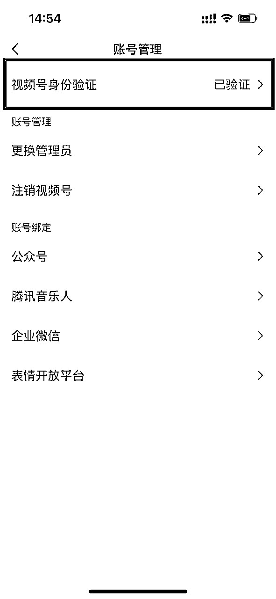

可设置内容不推荐给朋友。

如果大家想使用自己日常用的微信号，但又不想让自己的家人朋友看到这个视频号内容。

可以点击【我】-【视频号】-右上角【...】-【隐私与权限】

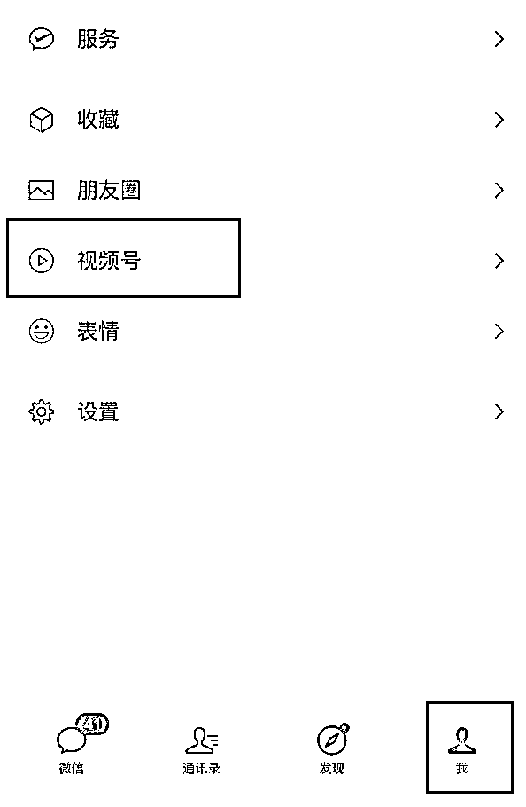

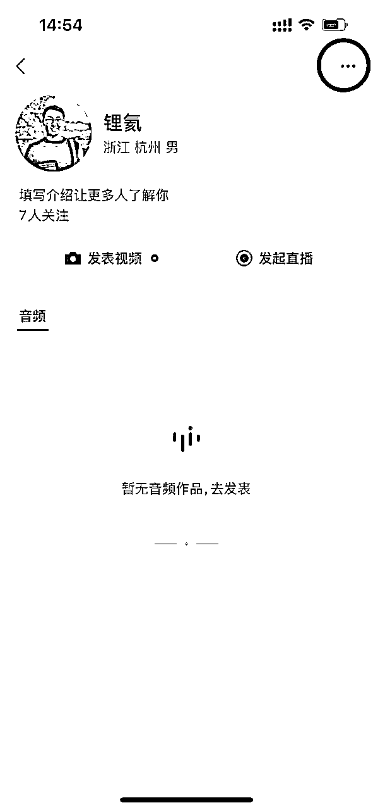

### 2.2.2 养号

开通并认证好视频号之后，先养号。

多刷一刷互动比较好的视频，了解下视频号的用户喜欢什么样的内容。

养号过程中，每 10 条左右点两个赞，每 50 个作品左右点个关注。

一般养号两三天即可，本期航海我们会先让大家做 4 天的拍摄练习，在练习期间不发视频，大家可以用这段时间来养号。

### 2.2.3 账号包装

点击创建视频号后，我们会进入这样一个界面，点击右上角【···】进入【设置】界面：

账号名称

先来看官方给出的【账号名称】注意事项：

根据自己要做的账号类型确定名称，一个好的名字要指向性明确，我们要做的是偏民生情感类。

女生可以用“智慧女性”、“女性修养”等等；男生可以用“致自己”、“悟人生” 等等。切记标题不要带“严选好物”这样的营销字样。

注意：昵称一年只能更改 5 次。

签名简介前期指向关注动作，并表明账号的主要内容，简单概括。例如：“关注我，每天为你分享智慧知识” ，“关注我的视频，一起了解更多传统文化知识” 等等。

然后自己在抖音上搜一些对标的做得好的账号，把简介里的鸡汤文案抄过来，加在后面就可以了。最好放 3 行文字，多了会被折叠。

简介是随时可以修改的。修改路径为：视频号主页头像 → 右上角 … → 头像 → 简介

头像选用穿着拍摄服装的本人头像，可以参考商务写真照的经典动作。保留上半身即可

地区：选择你所在的地区即可

### 2.2.4 了解各项功能

完成了基础账号设置后，我们来了解下视频号的各项功能；点开 “创作者服务-更多”，我们就可以看到这些功能。我们着重介绍做电商 IP 相关的一些功能，其他的大家可以自己探索。

数据中心可以查看每个视频和账号总体的数据表现，我们在后面的视频复盘优化部分会用到。

账号诊断 & 加热工具用于检查自己的账号是否有违规和向官方申诉的工具。如果发出来的视频流量非常不好，先到这里来看看是否被判定违规或者抄袭搬运

后续带货的视频是否有问题，也可以在“加热工具”里检查能否进行商品加热来判断认证

如果你有其他运动员、记者等特殊职业身份，可以在这里选择认证，会有官方给的一些助力

带货中心电商带货的重点工具，我们会在【实操 3/3】带货变现阶段，为大家进行详细介绍

## 2.3 视频号运营规范

重点关注和我们做视频带货有关的规范。

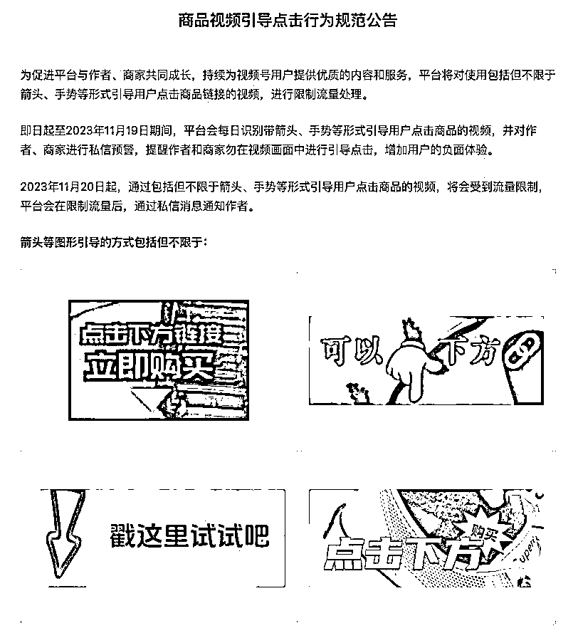

商品视频发布频次

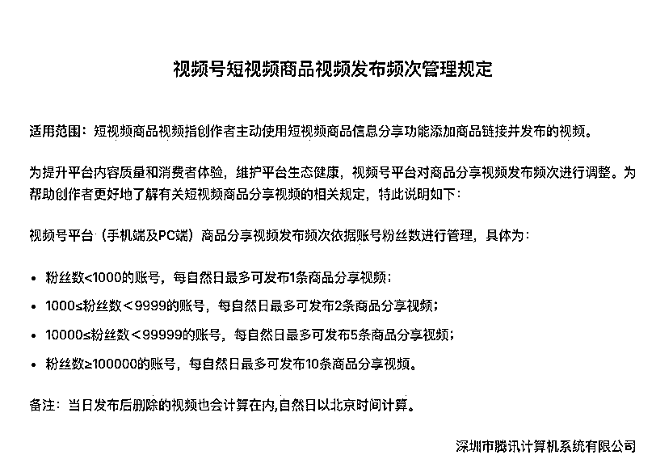

# 三、【项目实操 2/3 】制作并发布视频

💡

章节概要准备好工具后，接下来进入最关键的环节：拍摄并发布视频。

建议大家按如下步骤操作：

✅第一步：模仿同行爆款，了解视频标准

✅第二步：按照拍摄标准，每天至少拍摄 3 条视频，反复练习拍摄技巧✅第三步：拍摄过关后，按照剪辑标准，每天至少剪辑 1 条视频，练习剪辑技巧

✅第四步：完成视频发布

✅第五步：分析视频数据，持续收集素材、拆解爆款文案、优化视频，提高爆款率

来吧，开始你的视频制作之旅。

💡本章航线图

完成本章节的学习和实操，即可完成航线图的第二阶段：完成拍摄练习，做到视频达标（约 3-4 天）

每天拍 3 个视频，主练文案、语气，达审核标准（约 3～4 小时）

2.每天拍 3 个视频，主练表情、动作，达审核标准（约 3～4 小时）

每天拍 3 个视频，选 1 个剪辑，达审核标准（约 3～4 小时）

第三阶段 发布视频，获取流量（约 3-7 天）

10W＋播放前，模仿对标，每 2 天发 1 条视频（约 1～2 小时）

5.10W+ 播放之后，每天发布 1 条流量或带货视频（约 1～2 小时）

根据视频数据，持续复盘优化（约 3～4 小时）

那么现在，就请开始完成这几个步骤吧。

## 3.1 模仿同行爆款，了解视频的标准

为什么要模仿同行爆款？

现在的短视频分发，都是平台的算法系统来管理。由算法来评判你的内容够不够优质，要不要给内容更多的流量。

刚开始做内容，如果选择原创，需要拍摄大量的视频，耗费大量的人力、物力、时间成本，才能够测试出来什么样的内容是爆款。而我们作为普通人，是没有这样的资金和精力去完成这一点的。

所以，我们需要多参考同行，通过拆解爆款视频了解优秀视频的标准，这样才能更快起号。

### 3.1.1 文案分析：

样例 1.mp4【在线播放】文案关键要抓住 2 点：

选题：参考近期爆款

爆款的视频证明平台算法有流量倾斜，原创爆款是非常困难的，所谓 “创意都是老元素的新组合”，我们建议新手先从复制爆款开始。

通过逐渐积累素材库和拆解，找到爆款文案的感觉之后，再去组合创作自己的爆款。

内容：把握前五秒

视频前 3 秒和 5 秒完播率是很重要的，做短视频要在开头能够吸引大家的注意力。吸引注意力后，还要及时引导用户，点赞、评论、转发、关注。

在新手期，老师会给到已经被验证过的文案，具体见【视频号 IP 带货-文案库】，大家直接录制就好。

拍摄熟练之后，可以开始尝试自己创作文案，详细的方法见【3.6.2 持续优化，制作优质视频】。

### 3.1.2 拍摄技巧

除了内容，做好视频的另一关键就是 IP 的表现力，这也是我们在航海过程中会花费最多时间练习的环节。我们先来看下这个爆款视频如何把内容表现好。

样例 2.mp4【在线播放】着装：使用西服、发型、眼镜，营造出一个儒雅、有知识的人物形象，符合人们对于讲文化知识 IP 的心理预期。

语音：由于教练本人嗓音条件比较好，大家不一定要强行模仿，下面的练习中我们会推荐三种不同的说话语气，选择最合适自己的讲话方式即可。

动作：幅度不大的手部动作，体现出人物比较沉稳有城府。

背景：背后的书架也符合目标用户对于讲节气的预期。

灯光：虚化的背景加上冷暖光搭配，会带来冷暖交替的暗示，和文案内容契合在一起。

其中，最重要的是着装、语音和动作，也是我们重点练习的部分。

### 3.1.3 剪辑分析

从这个爆款视频可以看出，视频号电商 IP 的剪辑不需要做太复杂，突出人物本身、做好字幕和商品的画中画即可，过度美颜反而会让效果打折扣。

具体的剪辑技巧，在后面【3.4.1 剪辑方法】会讲到。

这部分的案例分析以及具体的拍摄、剪辑技巧，航海开始后还会在直播间给大家详细演示，会更加直观、好理解。希望大家按时来参加。

### 3.1.4 标题分析

标题部分主要起到两个作用，一是向用户简洁地传达视频内容，二是通过关键字获得一定的搜索流量；视频号的搜索流量并不大，所以我们不需要在标题部分浪费太多精力。

## 3.2 视频拍摄文案

制作视频，第一重要的是文案，老师已经总结、尝试了上百条文案，从中挑选出 34 条流量文案，直接给到大家。

在这 21 天训练营中，大家先拍摄并发布这些内容就好。

航海课程中给你的文案，你可能会不认同。大家要牢牢记住一点：我们所做的一切是为了拿流量，而不是为了认同。很多时候你越认同的东西，越没有流量。

以下仅展示部分文案，所有文案点击这个链接获取：【视频号 IP 带货-文案库】3.2.1 流量文案

💡

烧香的不一定是善人，乞讨的不一定是穷人，顺着你的不一定是好人

穿着衣服的，不一定是人凡事不能只看外表，家财万贯也买不了太阳西下，身无分文也不代表日后没有江山

💡

以前我对你很好，现在为什么对你不好了那是因为我以前对你好的时候呢，我是希望真心换真心，你也可以对我好

但是你却一直把我当傻子，把我的付出当理所当然

这样我还能继续对你好吗，所以当你发现我对你不好的时候，先问问自己的良心 3.2.2 带货文案

💡

一个人要是懂逆向思维，你知道有多牛吗？给你分享两个小故事，一定会让你有所启发。

故事一：一家小食品公司，辣酱上市前想做宣传，但是他们没有那么大的经济实力，租不起市区广告牌。于是他们突发奇想，租下城门口一个不值钱的广告牌。

租下广告牌后，并不是直接在上面打广告，而是贴出出租广告位招租，全年 98 万

天价广告牌的冲击力毋庸置疑，渐渐全城都知道了城门口有一个贵的离谱的广告位。

一个月以后，辣酱广告打了上去，市场迅速打开，他家的辣酱也因此供不应求。

正所谓没有难做的生意，只有不会动脑筋的人。当你的思维开阔了许多，困难自然就迎刃而解了。

故事二：一位山东的大爷把同样的东西卖出高价格，还被疯抢

大爷在地铁口卖烤地瓜。他把烤好的地瓜分成两堆，左边的比右边的贵两块钱。我问他为什么左边比右边的贵呢？他说左边比右边的品种好。

然后我观察了一会儿，发现很多人都买的是左边的，也就是贵的。有的人口才好，会讲价，以右边的价格买了左边的，然后还觉得自己占了大便宜。等左边的卖完之后，大爷随后又把右边的分到左边，于是奢侈品烤地瓜又诞生了。

最后大爷告诉我说，富人买珍贵，穷人买划算。如果你只有一堆，富人看不出哪个珍贵，穷人也看不出哪个划算，他们会想买还是不买呢？如果有两堆，他们就有了买哪个的选择。

我又问大爷，您这些招数都是在哪学的？大爷说是从我儿子送的一本逆转思维一书中学的。

读懂逆转思维，就可以让别人主动走进你设计的框架中，帮你实现你想要的结果。轻松的解决面对的难题和麻烦，成为人生的赢家。

商品：《逆转思维》

💡

为什么早上不借钱，为什么晚上不探病为什么鱼缸不送人，为什么红笔不写别人名字，为什么宁娶寡妇不娶生妻

为什么五月不盖房，六月不搬家

为什么打人不打脸，吃饭不夺碗为什么家里来客不扫地，为什么饭前不训子

为什么左手带金，右手带银为什么左手倒茶，右手倒酒，倒茶不能倒满，倒酒要倒满

为什么衣服不能烧，为什么枕头不能坐

为什么六人不坐席，三菜不上桌为什么送礼不送伞，送礼不送茶，为什么喜事不送伞，祝寿不送烟

为什么你会在不知不觉当中就得罪了人，就是因为你不懂这些老祖宗流传下来的不成文的规矩这些呢，都是中华文明之根本，老祖宗留下来的规矩

这本中国人的规矩，它不同于传统的国学，讲道不讲术

他更像是一个一路走来的长者，跟你掏心窝子的讲一讲做人做事的规矩读完这本书，你就会知道你应该怎么送礼，怎么待客，怎么交朋友，怎么教育孩子

你所处理的事情，别人也会对你赞不绝口商品：《中国人的规矩》

上面仅展示了部分文案，所有文案点击这个链接获取：【视频号 IP 带货-文案库】

## 3.3 练习拍摄技巧

我们可以从文案库中随意选择一两条流量文案来练习拍摄。所有文案点击这个链接获取：【视频号 IP 带货-文案库】

### 3.3.1 拍摄前准备

第一步，熟悉文案每篇稿子拍摄之前，至少熟读 2 遍稿子，熟悉文案是拍好视频的前提

第 1 遍，读熟练，完全不卡壳。

第 2 遍，带入角色。把自己代入到文案主角身上，和拍戏一样，只有你自己的角色代入了，才能深入理解热门文案的作用；否则即使必火的文案给你，也拿不到流量。

第二步，练习语速，找到适合自己的语气语速我们建议三种常见的语气语速，三者之间没有绝对的优劣。大家用三种语气各拍一条视频，对比下看看自己更适合哪一种。

用平时和朋友聊天的语气：这种语气较为平缓，更自然，能减少和观众的距离感。

聊天语气.mp4【在线播放】

用训斥下属或晚辈的语气：这种语气言辞较为激烈，可以树立权威感，也能让你的视频更容易引起讨论。

训斥语气.mp4【在线播放】

用讲故事的语气：这种语气表达循循善诱，故事中蕴含道理和营销，相对比较适合带图书类目的视频。

讲故事语气.mp4【在线播放】

### 3.3.2 如何拍摄？

第一步，布置拍摄环境

如果在家里拍摄，条件允许的情况下，背景使用书架，摆放几本成套的书籍加一些小摆件，让背景看起来干净整洁；如果没法用家里的书架，可以找找有没有灰色或者木纹的纯色背景。

可以找个茶室包间或者会议室来拍摄视频，这样布景效果比较好。

不要用大白墙做背景。

第二步，架好机位。

画面要求：人物要在视频居中，视线略微偏向侧面，左边或右边都可以。

画面顶部略高于头顶，画面底部略低于手部，手要完整露出。

如何架机位？

1 部拍摄手机放在自己左前方或者右前方，提词器的手机/电脑放在自己正前方。

如果只有自己一个人，建议使用下面的镜子架机位方法，这样可以实时看到自己的表情和动作。

给大家演示一个无三脚架的简陋版本。

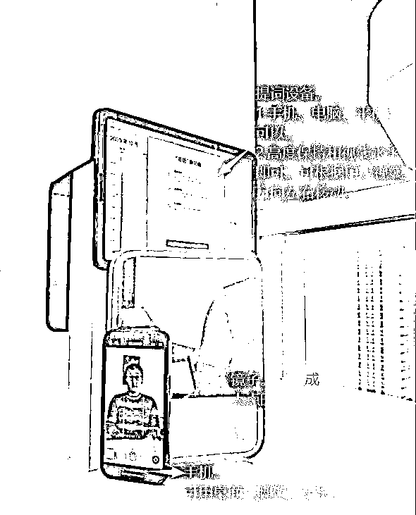

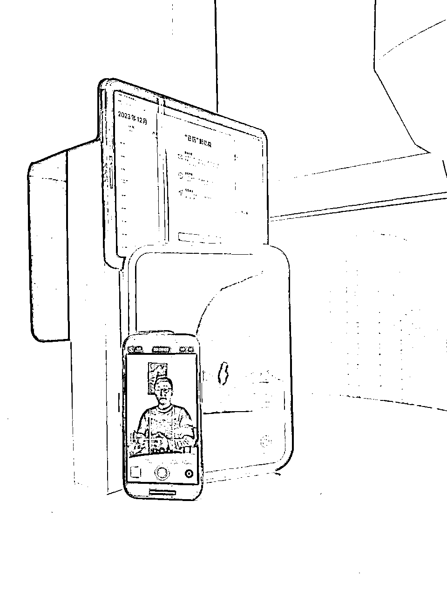

如果实在没有 2 部手机或者电脑，只有 1 部手机，可以把文案用纸打印出来提词。

利用镜子架机位

利用镜子拍视频，利用镜子一方面可以在拍摄时观察自己的表现，另一方面可以使用性能更好的后置摄像头拍视频；题词设备/纸放在镜子后面，拍不到即可。具体操作见下方视频 https://www.douyin.com/video/7255874384601075004

第三步，提词器设置。

以快题词为例，我们新建脚本，在里面输入台词即可。

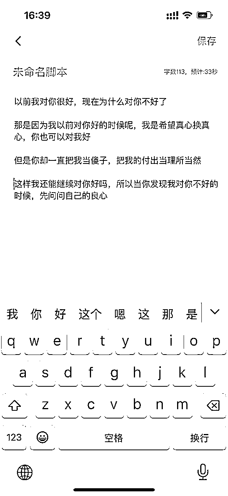

第四步，设置拍摄软件，点击拍摄。

使用手机原相机后置摄像头，不要使用任何美颜 App 背景虚化：

如果有家人，你坐好后，让家人帮忙操作。在录像模式下，长按画面中人的部分，会显示“自动曝光 / 自动对焦锁定”（AE/AF Lock）；锁定状态下就可以实现背景虚化效果。

如果只有自己一个人，不设置背景虚化也可以，直接按录制按钮开始拍摄，回到座位坐下。

第五步，拍摄技巧面部表情，要配合你选择的语气语速

视线要稳定保持在同一方向，不要左右飘忽动作手势：

头不要左右转或者大幅摆动

手势动作集中在一只手上，动作幅度不要太大，否则可能会被字幕遮挡住建议手势用右手，避免被判定为引导互动

### 3.3.3 拍摄后检查

1.可以对照下面这个自检清单，检查拍摄画面部分。

【非常重要】的项，每一条都要完全符合要求。

达到标准的可在【自检结果】处填写“已达标”，有问题的记录下问题，总结问题调整后重新拍摄。

12 月航海 | 视频号 IP 项目|视频自检清单

## 3.4 视频剪辑

### 3.4.1 剪辑方法

剪辑教学.mp4【在线播放】

具体操作如下：

1.

打开剪映，点击【开始创作】，选择手机中录好的视频，就完成了导入视频。

2.点击导入的视频，点【音量】，调节人声到 500 左右。

点击【美颜美体】-【美颜】，简单美颜。只适度开【磨皮】、【祛法令纹】以及【祛黑眼圈】。

点【编辑】，选择视频尺寸。

a.

第一种，竖屏 9:16。手机拍摄的就是 9:16，直接使用就好。

b.

第二种，竖屏 3:4。

先在剪映中将视频居中裁剪为 3:4，然后选择“画面-背景-背景填充-模糊”，将上下多余的空间模糊处理

5.

添加字幕：

a.

点【文本】-【识别字幕】-【全部】-【开始匹配】，就会自动识别生成字幕。

b.

检查一遍，有断句错误、或者错别字的，手动修改下。

调整字幕格式：

a.选中任意一段字幕，点击【编辑】，【字体】，选择【点宋体】

b.

点【样式】，可以调节字体大小、描边、阴影，一般用白字黑边，11 号字就行。

c.

上下拖动任意字幕，可以移动位置。字幕位置靠底部，留出手的画面。

d.

最后检查一下，所有的字幕最好都一行展示，不要有换行，字数太多的，可以使用【批量编辑】使用换行、拆分成 2 段。

剪掉开头结尾的空白、停顿、口误等多余画面。

8.添加字幕背景：

a.

回到视频开头，点击【画中画】，点【素材库】，搜索【黑场】，找到纯黑图片素材，选中添加。

b.

选中素材，拖动长度拉满整个视频

c.

点【编辑】，可以裁剪大小。拖动素材，可以调整上下左右位置。

d.

点【不透明度】，调整到 40 左右。

e.调整好后，把前面设置好的字幕移到半透明背景的中间。

添加标题。

a.

回到视频开头，点击【新建文本】

b.

【字体】选择【江湖体】，调整字体大小，位置移到人脸下方、胸以上。

c.

【动画】设置出场特效【溶解】

10.最后添加 bgm

a.

点击【音频】，在音乐库中搜索符合主题的慢速纯音乐

b.

音量调小，调到 30-40。

c.

剪掉结尾处比视频长的部分。

整体检查后，点击右上角【导出】。

### 3.4.2 剪辑后检查

剪辑完成后，对照下面的自检清单进行检查。

【非常重要】的项，每一条都要完全符合要求。

3.达到标准的可在【自检结果】处填写“已达标”，有问题的记录下问题，再逐一修改。

12 月航海 | 视频号 IP 项目|视频自检清单

## 3.5 发布视频

视频号发布有两个入口

手机 App 端视频号助手网页端（https://channels.weixin.qq.com/）

### 3.5.1 手机端视频发布流程

发布的流程很简单：在个人的视频号首页点击“发表视频”，然后从左下角“从相册选择”，找到我们剪辑好的视频，直接点“完成”。

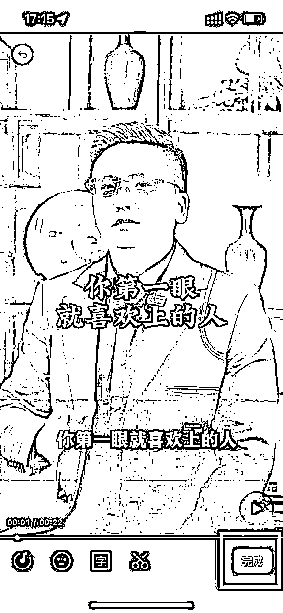

描述：使用视频标题，明确主题；保证不丢失搜索流量

话题：帮助视频获得一定搜索流量。起到了补充关键词的作用，因为你的标题不一定能够涵盖视频所有要表达的内容。我们根据视频内容适当添加 3~5 个即可。

但是视频号不会像抖音、小红书那样，向创作者直接展示哪些关键词的关注度更高。这里的技巧是，我们可以先多列举几个备选关键词，然后在搜一搜的「微信指数」里，查看近期哪些关键词在微信内的热度更高。

虽然微信指数是一个综合的评分，但是我们可以划到下面，如果这个词的量很大，绝大部分的热度又都是从视频号过来，这个数据就很有参考意义了。

比如，这几个关键词：#二十四节气 #立冬节气 #女神粥 #养生

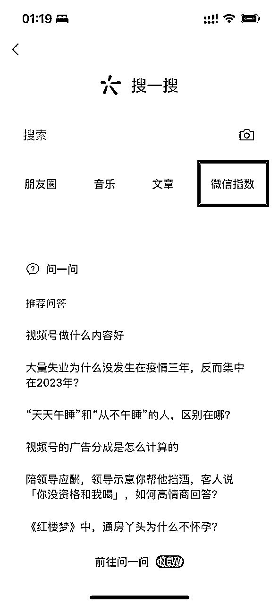

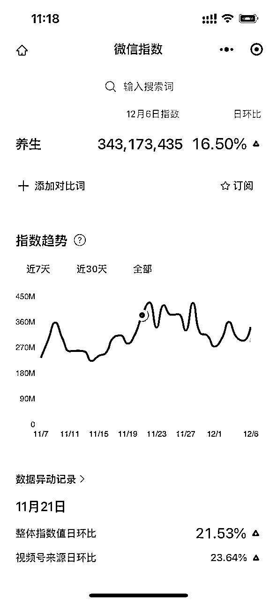

这里可以添加对比词，可以把你的备选关键词做个比较，看看如何搭配能接住更多流量。

提到：我们不会添加这个。对于我们带货来说，暂时没有想到场景所在位置：精确到你所在的城市即可，视频号基于位置的推荐基本可以忽略，所以真实就行

活动：没有什么作用，不用选

链接：当你开通视频带货后，链接里会出现“商品”选项，从这里操作挂车。

### 3.5.2 电脑端视频发布流程

入口：（https://channels.weixin.qq.com/）

除了使用手机端 App 发布视频，也可以使用网页端视频号助手发布。用网页和 App 发视频效果一样，不会影响流量。用网页的优势有以下几点：

合集：早期内容比较少的阶段，不需要考虑做合集。短标题作用也不大，可以跳过。

定时发表：这是电脑端最重要的功能。在这里设置时间后点击底部的“发表”，视频到时就会自动发布。这样可以提前把视频安排好，而不用担心临时有事无法按计划发布。

### 3.5.3 发布时间&数量

发布时间

前面讲到视频号的机制，基本上 95% 都是推荐流量。根据我们的观察，视频号内容要想成为爆款，就必须牢牢把握住推荐分发的流量。

而根据我们的观察和总结，算法是否给你的视频流量，很大程度取决于发布后的一两个小时内拿到的数据结果。一般来说，如果一个视频在发布的两小时内能够快速突破万赞，它很大概率是能做到十万赞的。

我们发布视频要在目标用户相对比较空闲、能够刷视频的时间。因此推荐的发布时间是：

早上 5-8 点之间，老年人起床比较早，所以发布时间跟随他们的作息

中午 11-12 点之间，差不多做完午饭可以来看视频下午 17-18 点之间，同中午的逻辑

晚上 21-24 点之间，晚上空闲下来独处的时间当你在这几个时间点上，无法保证空出时间发布视频时，就可以使用电脑端的定时发布功能。

视频发布的数量

作为初学者，在 21 天航海期内，根据自己的时间安排，最少做到两天发布 1 条。

但在粉丝量达到 1000，开始带货以后，想获得稳定持续的收益，每天至少要发 3 条起步，晚间可以加更 1~2 条。 我们也建议航海期间能够投入足够时间的同学，尽可能按这个标准发布。

## 3.6 视频复盘优化

### 3.6.1 视频数据复盘优化

视频号 IP 带货本质上是一种货带人的形式。我们视频的观众在意的是价格和商品本身他是否愿意买，也就是性价比，而不是谁在卖这件商品。

所以，短视频带货的销量，更多和视频播放量相关，而和粉丝量关系不大。

在数据分析中，粉丝数方面，我们只需要达到 1000 粉丝量，能够开通橱窗和视频挂车即可。

关注的重点数据应该是每个视频的播放和互动。

而且不需要过度关心播放量和互动量不佳的视频，重点总结复盘爆款视频，思考如何持续复制爆款。只要有少量带货爆款视频，我们就能够顺利达到带货变现的目标。

如何查看视频数据微信 → 发现 → 视频号 → 右上角人像 → 我的视频号 → 创作者中心→ 数据概览

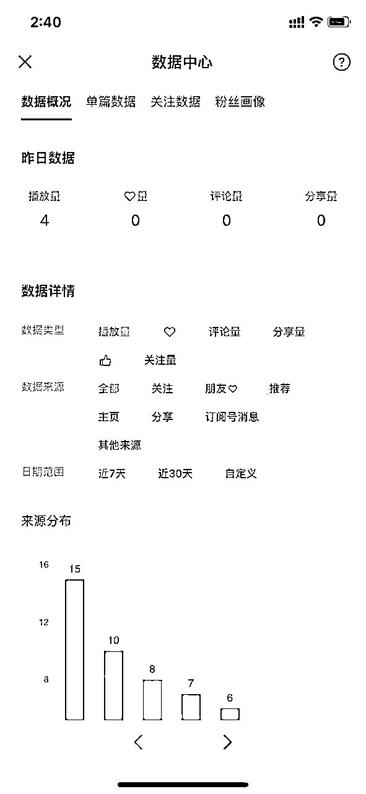

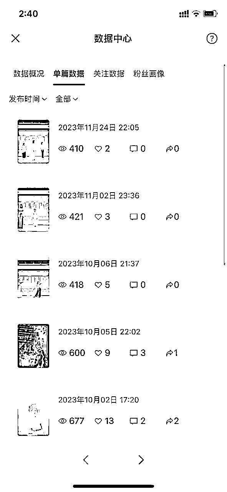

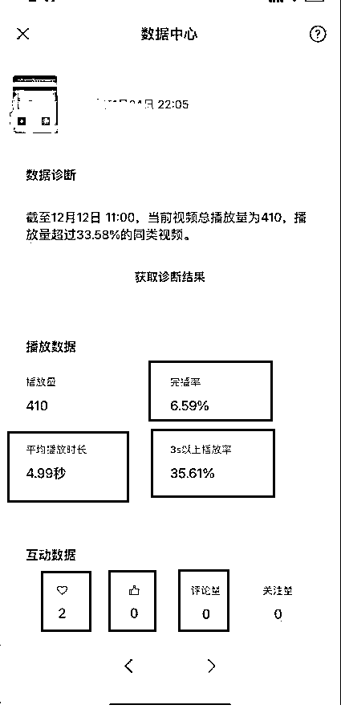

就可以看到该视频的所有详细数据。

一个视频，我们一般关注以下几个数据维度和标准：

3 秒完播率：达到 60% 以上完播率：要达到 25% 以上

平均播放时长：大于视频时长的一半互动数据：转发、点赞 / 心心、评论。其中心心的作用更类似公众号的“在看”，会推荐给点心心用户的好友，而点赞不会影响社交分发，仅仅表示这个用户喜欢。

把每个视频的数据都记录到自己的发布素材库。

视频号 IP 带货-个人发布素材库

这样，可以做横向对比。

重点关注爆款的笔记，分析其文案、视频表现，找到适合自己的、创作爆款的关键因素，持续优化。

### 3.6.2 持续优化，制作优质内容

#### 3.6.2.1 收集爆款素材

一个稳定产出的视频号电商 IP，每月要发布将近 100 条视频。为了稳定的产出优质内容，就需要我们建立素材库，积累优质素材，作为充足的灵感来源。

##### 3.6.2.1.1 素材来源

视频号上直接找自然刷

视频号上刷同领域的视频，并且看完点赞，然后就会一直给你推同领域的视频，这样你就收获了一堆同行账号。

搜索

当你看到一个爆款视频时，可以把文案或者标题中的关键字拿去搜索。可以得到一堆你想要的视频。

另外，也可以看看同样的主题，其他账号的数据如何。因为口播视频火不火，主播的表现力和人气也是很重要的因素。如果有好几个人用同一段文案出过成绩，才能证明它是好文案。

还可以顺着这些视频，点进账号的主页，寻找更多视频。

例如，搜索 “商业思维”这个主题。

每一个视频都可以点击进入账号主页，找到更多相关视频。

2.抖音、快手同行视频

自然刷

注册新的抖音和快手账号，在没有用户数据的情况下，算法会首先推送当前的平台爆款给用户。

在这里面找到合适目标用户、可以借鉴的爆款，点赞关注之后，算法会推荐更多同类型的内容给你。

搜索

和前面一样，当你看到一个爆款视频时，可以把文案或者标题中的关键字拿去搜索。可以得到一堆你想要的视频。

巨量算数

可以通过抖音巨量算数的免费工具，查看近期抖音的热门关键词和热门视频。

创作指南-内容创意分析-热门视频，可以选近 1 日或者近 3 日。

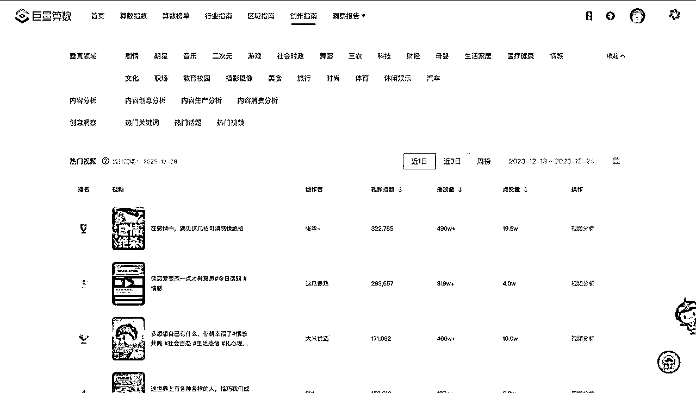

找到热门视频后，依然可以拿着关键词和主题再去抖音、快手、视频号搜索，就可以顺藤摸瓜找到很多相关视频。

3.

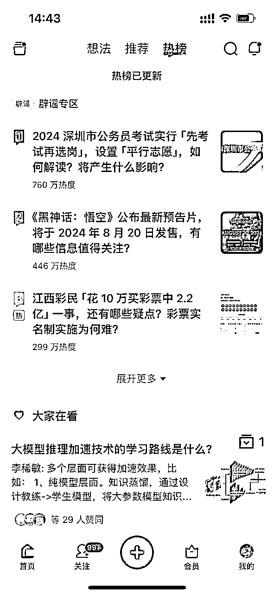

自己的灵感

自己有好的灵感要随时记录，整理到素材库；我们不推荐新手直接自己写文案，更多作为自己的训练手段。

##### 3.6.2.1.2 下载视频，提取文案

手机录屏获取视频+飞书提取文案这个方法适用于所有平台的视频内容。

找到爆款视频后，播放视频，同时使用手机的录屏功能，这样就可以把视频完整录制下来。

然后打开飞书 APP。下载链接：https://safe.qhtui.com/sinfo/2000000838_4003227.html?qz_gdt=m2vyezibaaacfjzpwomq 手机号可以直接注册个人账号。登录后，搜索【飞书妙记】，打开页面。

点击【上传】-【上传本地文件】-上传视频（音频文件也可以）

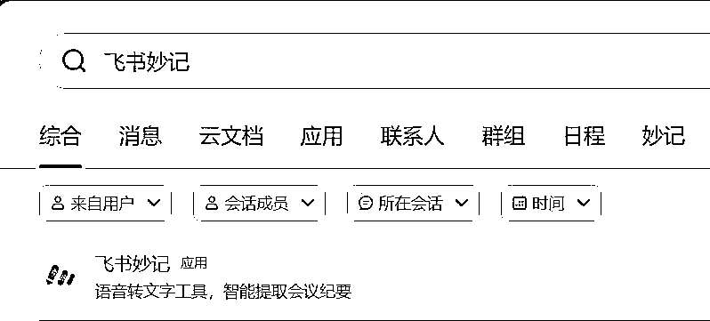

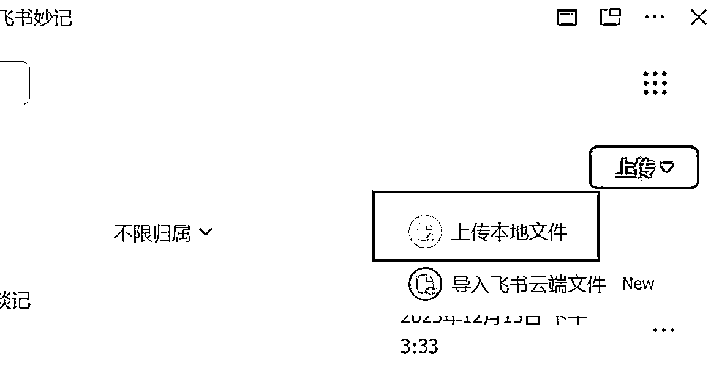

上传成功后，会自动解码，点进文档，就可以看到文案啦！

个人版的飞书妙记有存储空间限制，但我目前使用基本够用。

2.

使用“轻抖”小程序

找到爆款视频之后，复制视频的链接。在微信中打开“轻抖”小程序，点击【文案提取】，粘贴链接，一键提取文案。就可以啦！

注意，目前只支持抖音、快手、西瓜、小红书、头条、微博、B 站视频链接，不支持视频号。

所以，提取视频号的视频文案大家可以用第一种方式——飞书妙记提取。

因为是免费工具，所以广告有点多，用的时候要耐心点。

##### 3.6.2.1.2 搭建素材库

我们可以将内容划分到两个素材库，分别是基础素材库、爆款素材库。

1.基础素材库

上面收集的灵感，在提取文案后，都可以直接保存在基础素材库。

爆款素材库爆款素材可以按照以下几个维度拆解：

选题；

文案；可以进一步拆为：引出、正文内容、带货内容、结束语。

拍摄技巧；

剪辑技巧：包括剪辑的方法、视频素材。

把每个爆款素材中，你觉着有亮点的内容，存到对应的内容中。

这样拆解后，方便你后面根据自己的思路自由组合。这里是你经过个人加工，真正能够吸收转化为自己东西的素材。

做了一个视频素材库模版，供大家使用。12 月航海 | 视频号 IP | 视频素材库

接下来，就来看看具体如何拆解爆款文案，进行二次创作。

#### 3.6.2.2 拆解爆款文案，总结方法，二次创作

下面这个是我们的爆款带货视频，这条视频播放 920 万，点赞 20 多万，变现 30 万+

爆款案例.mp4【在线播放】3.6.2.2.1 分析选题

只要属于我们的赛道，并且无论粉丝量大小，有多个账号做的该选题数据都不错，那就值得借鉴。

##### 3.6.2.2.2 拆解分析文案

头开引出

开头 3 秒，黄金时间，要抓住用户注意力。

💡

第一部分：接福作为视频导入

赶紧把门关好了，把手机音量调到最大悄悄告诉你，从 11 月 4 号起将有大事发生

低能量的人刷不到这条视频，你一定是凭着自己的感恩和善良，和我发生了能量的同频共振

铁粉们太知道了，我说话特别灵不管你过去经历多少风雨，多少欺骗，多少煎熬的日子

当你看到视频的这一秒开始，你已经啊，进入到高能量磁场的频率当中过去所有的不顺、受的委屈，都会变成爱和财富的能量来成就你

因为你本性善良，你懂得感恩，相信我你会越来越健康、越来越有钱、越来越幸福

用不了多久，你就会生活富足，平和且喜悦接下来的内容非常重要啊，先点赞收藏，听我慢慢说

这个视频使用了大多数人的关注点——接福导入。

视频号的核心用户比较信这个，这个开头可以用在很多文案中。

大家去刷抖音，也会有很多针对年轻用户的接福，只不过使用了年轻人更能接受的目标和话术，例如这个视频。所以这是个普遍的需求。

通过接福，顺利完成了 3 秒完播率和 5 秒完播率的目标；接福文案也会把视频整体的完播率带上去。

引出的最后，主动引导用户，点赞、评论、转发、关注。

到这里，这个视频就有了成为爆款的基本盘。

除了视频中的方式，还有哪些比较好的引出方法呢？

引发共鸣

比如，上面案例中的接福。用户为了吉利，会继续看下去。另外一种是大白话的哲理。

例如：不要原谅一个故意伤害过你的人，哪怕他现在百般的讨好你。

颠覆大家的广泛认知，引发用户来看视频和参与讨论。

例如：

为什么越善良的女人，越命苦呢，请耐心听我讲完。

给你讲一个笑话，为什么低学历的人比高学历的人，更容易成为老板。

激发恐惧。

例如：

7 个中老年人的养生误区，你有没有占一个。

女人如果不改掉这 3 点，每段感情都不会长久。

不要以为你现在过得不错，以后就安生了，大错特错。

引发好奇。

用比较抓眼球，但是又没有完全讲明白的话，引发用户的好奇心。

例如：

未来 3 年咱们普通人一定要记住的 10 个忠告

妈妈什么样的性格是最旺孩子的

2.

正文部分：

💡第二部分：针对话题的知识讲述

今年的立冬啊，是从 11 月 7 号到 8 号，立冬过后这个节气啊，千万要记住这三不露、四不吃、一要喝

尤其是女性朋友，一定要认真看完这条视频第一不露脚，立冬是二十四节气中的第 18 个节气，表示冬天的开始，气温骤降

俗话说寒从脚下起，到了立冬节气之后呢，一定要穿好袜子，穿好鞋给脚部保暖，避免寒气侵蚀体内，平时在家也不能光脚了，避免因为脚受凉而感冒，晚上呢还可以泡泡脚

第二不露关节，立冬过后，就不能再穿短袖和露肩的背心了，尤其是爱美的女性，要保护好我们的关节，因为关节很容易受到寒气的侵蚀，到老啊落下一身毛病第三不露肚脐，晚上睡觉不能露肚脐，一定要关好窗户，盖好被子，因为立冬过后昼夜温差大，不盖被子晚上容易着凉生病

那四不吃呢，第一个海鲜尽量少吃，海鲜性凉嘛，不能多吃，如果实在想吃，尝尝鲜就可以了，吃的时候呢，别忘了放点姜片

第二个西瓜不能吃了，夏天很多人啊，对西瓜是情有独钟，西瓜是夏天的象征，西瓜性凉，也有人称它是凉瓜，立冬过后不能再吃了，以免拉肚子，或者引起身体的其他不舒服第三不吃绿豆，绿豆性寒，立冬过后，昼夜温差不断加大，就不要再熬绿豆汤了，尤其是脾胃不好的人

第四少吃辛辣食物，立冬过后，冬燥明显，处于干燥的季节，这个时候如果你吃辛辣的，容易上火，尽量少吃辛辣食物那一要喝，要喝什么呢

在中国民间啊，有立冬补冬补嘴空的谚语立冬是二十四节气中的第 18 个节气，表示冬天的开始,此时草木凋零,蛰虫浮藏，万物活动趋向休止，以冬眠状态养精蓄锐，为来年春天生机勃发做好准备

而人类虽没有冬眠之说，但民间却有立冬补冬的习俗，因此人们在这个进补的最佳时期，可以进行食补，为抵御冬天的严寒，补充元气正文部分的重点是扣题。

这个视频的标题是讲立冬的，该吃什么、该做什么。

这段文案还有一个优势，就是二十四节气的话题内容稍作修改，可以使用在从 8 月底立秋到 11 月初立冬的所有节气上，反复获取平台的流量。

正文常见的几种形式&广告的引出。

我们做的是个电商 IP，正文部分虽然更多在陈述，也要能够配合后面的转化。一般有以下几种打法：给忠告：通过给观众忠告的形式，在适当位置，插入产品的广告。

比如：

立冬以后牢记三不漏、四不吃、一要喝。这里“一要喝”就是我们要带的商品。

家里这 7 件事，千万不能做，有车有房的要注意了。可以在最后一件事的解决方案上，带上我们要卖的家居好物。

讲故事：将产品融入到故事中。

比如：

五个小故事告诉你，懂博弈的人有多可怕。引入讲商业博弈的书籍。

美女开网球馆，一招打败周围所有同行。同样可以卖商业相关的书籍。

教方法：讲述各类方法，从某个方法切入产品。

比如：

你知道钱是怎么来的吗？我告诉你钱来的真相。可以销售商业书籍。

女人冬天保持年轻漂亮的 7 个方法。可以卖护肤产品或者养生食补。

女人最后的黄金期，你知道是什么时候吗？同样卖护肤产品或者养生食补。

转化文案

💡

第三部分：针对女性用户做转化立冬过后，也就是女性朋友自身保养的好时候，有一个好身体，才有应对生活的底气啊

女人想去改变的时候，不要去问老公，也不要去问朋友，更不要去问从来不保养的人

你应该问问镜子里的自己，算一算自己还有多少个十年所以在这啊，我教你一个非常便宜的小方法，你把黑米红米糯米红豆花生桂圆，红枣和枸杞，隔水炖上 60 分钟，立冬过后，坚持喝上一个月，让自己的美由内而外绽放出来如果你自己不会搭配，在这有可以选择的，这款女神粥啊已经替你搭配好了

点击视频左下角

从今天开始，用它好好的爱自己这段文案“女人想去改变的时候 ...... 算一算自己还有多少个十年”，是很重要的转化助推。

它实际起到了一个逼单的作用，推动目标消费者不要犹豫。

如果问了老公或者朋友，肯定会说这种保养品是智商税，所以要讲“不要去问从来不保养的人”。最后“算一算自己还有多少个十年”，营造年龄的焦虑感。

最后教一下用户怎么下单，再用最后一句话再次起到逼单效果。

转化的内容方法：

转化的内容打法相对比较固定，一般由以下几部分构成：

1.

产品介绍部分介绍产品或品牌历史

介绍产品制作、创作过程介绍产品效果

介绍产品使用方法

介绍产品原料 2.

购买原因

正向原因：购买以后，能怎么样反向原因：那些不购买的人，会怎么样

3.

临门一脚逼单：下单前，最后一次直接的推销。例如：

赶紧把它带回家不要去问老公，不要去问朋友，就问问镜子里的自己.....

带货视频的转化环节，还需要注意以下几点：画中画：视频中提到产品的部分，要加上对应的画中画，提高转化率。

不能直接提及功效及效果。例如：减肥、用了皮肤会变好、看了一定能发财。

不能提及到视频链接。例如：点击视频下方链接，就在视频的左下角。

不能通过箭头等方式，引导观众去注意购买链接的位置。

在讲述产品的时候，手不能动。否则容易被系统误判为，恶意引导观众下单。

##### 3.6.2.2.3 视频标题&留言区

视频标题：由于标题对流量的影响较小，不需要特别花精力，总结视频内容即可

带货的视频，记得留言区一定要置顶留言：只卖便宜又营养的产品。购买方式：点击视频左下角的小黄车就可以购买了，愿你越来越好❤️❤️

##### 3.6.2.2.4 二次创作

新手创作期以像素级模仿为主。

从上面的爆款拆解我们可以看到，好文案环环相扣的节奏，也是视频能够成为爆款的重要原因。

新手期，可以考虑直接模仿自己收集的爆款文案。先不要因为顾虑文案重复，而去微调爆款文案。

而且，文案部分在判定重复方面所占比重较低，没必要在新手期过度考虑重复问题。

积累一段时间以后，可以尝试二创。

号想做大，长期靠像素模仿肯定也不行。

素材拼接法。

前面建立爆款素材库时，让大家对爆款视频进行了拆分。就可以同一个主题找 2-3 篇不同的内容，把开头、正文、转化文案等部分拼接使用。比如，用 A 的开头，B 的正文。

但一定要注意，修改衔接和语言风格，也可以适当加入自己的风格，关键要确保风格一致、内容流畅。

关键：要通过拍摄验证数据，看看你对爆款原因的理解是否正确。

一开始数据不好很正常，大家要有耐心，多尝试多练习，积累多了就会有体感了。

2.

记得查违禁词

自己创作视频文案，一定要做一下违禁词检查。

使用前面提到的“轻抖”小程序，点【违禁词】，把文案复制进去就可以。

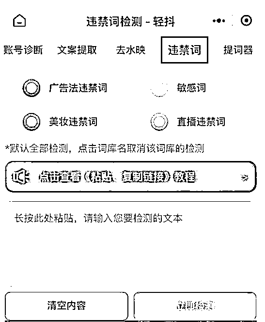

### 3.6.3 进阶拍摄 / 剪辑小技巧

1.相机拍摄

如果你使用索尼相机，推荐 12mm f/2.0 的定焦镜头。室内可以拍人像，室外也能拍出很好的人物和背景的配合。一个镜头几乎适用所有拍摄场景。

2.灯光布置

预算充足的团队拍摄，灯光可以参考这个教程。

剪辑技巧可以多次使用的剪辑片段，包括图像、音频、字幕，可以在电脑版剪映上保存成素材，方便今后直接导入。

具体方法是：

随后选中这个复合片段，再次右键，选择“保存为我的预设”；

等待剪映保存完成后，就可以在“媒体-本地-我的预设”中，找到这段素材。后续使用时，直接从这里拖到新内容的轨道上即可。

# 四、【实操 3/3】挂商品，带货变现

💡

章节概要

学会了视频制作及发布，要坚持发布流量视频，努力达到 10 万+ 播放，就可以开始带货啦！

具体操作如下：

✅第一步，选择合适的商品

✅第二步，通过橱窗和视频挂上商品，完成带货

💡

本章航线图完成本章节的学习和实操，即可完成航线图的第四阶段：带货变现（约 3-7 天）

完成个人主页橱窗挂商品（约 1～2 小时）

开通购物车权限，完成视频挂商品（约 1～2 小时）

3.根据带货数据，持续复盘优化视频（约 3～4 小时）

那么现在，就请开始完成这几个步骤吧。

## 4.1 选品&货品渠道

### 4.1.1 选品原则

参加航海的同学应该都是素人，没有明星那种一呼百应的人设。我们没有将商品通过人设，以高价卖出的能力，我们视频的观众在意的是价格和商品本身他是否愿意买，而不是谁在卖这件商品。

这就决定了，视频号 IP 带货本质上是一种货带人的形式。

所以，我们选品只需要关注两件事：性价比和需求量。

只要性价比足够好，商品也是目标用户普遍需要的品，就会有好的转化。让消费者把注意力集中在商品的价格上，快速决策，而不是慢慢对你建立信任才能转化。

同时，如果用户买了东西发现不好，售后率很高。一来你花费精力带的货因为售后没有了佣金，二来还会损伤用户对 IP 的信任。

所以选择的商品一定要在一定销量基础上，售后率低的商品。

### 4.1.2 产品库 & 渠道库

了解视频带货的都知道，选品、测品是非常费时、费力的事情。而且新号用户少、流量少，也很难达到测品的效果。

这次航海为了让大家更快出成绩，我们省去了大家测款、选品的步骤，直接拿出经过我们各个大账号反复测试、跑出来的几个爆款产品。它们适合短视频销售、并且售后率低。

图书

家居好物

并且给出配套的转化文案，具体见【视频号 IP 带货-文案库】中的 5 条流量文案。

只要达到卖货条件，就可以找教练拿推荐的链接，使用文案直接录制视频带货了。

不要小看这几个品，足够大家前期卖了，像我们前面给大家看的账号，一个品只要卖的好，一天就能变现 6 万+，累计能实现十几万、甚至几十万的收入。

账号做起来后，如果想要自己选品，可以看【4.2.2.1 个人主页橱窗挂商品】部分的选品方法。

## 4.2 挂商品

### 4.2.1 三种带货方式

进入我的视频号-创作者中心-带货中心，里面集中了视频号电商相关的主要功能。点击右上角小头像。

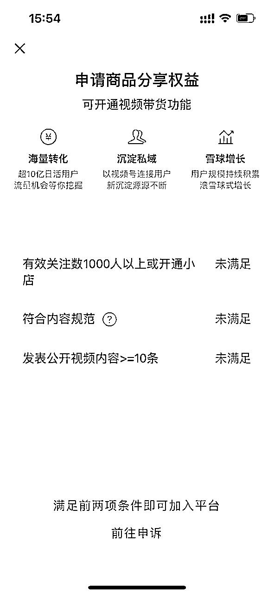

可以看到，视频号有 3 种带货权限。

视频带货。

就是在视频中可以直接挂车带货。

开通要求是：

有效关注数 1000 人以上或开通小店。互关这种途径获得的粉丝，视频号是不会算为有效关注的。

符合内容规范。

发表公开视频内容≥10 条。

完成微信支付实名认证。

橱窗带货。

在橱窗上架货品。

开通要求是：有效关注数 1000 人以上，开通视频号小店。

直播带货。

就是开直播，在直播过程中带货了。

开通要求是：有效关注数 1000 人以上或开通视频号小店。

如果不达到 1000 粉丝，只能带你自己店铺内的商品。

橱窗、视频、直播带货，都有分销和开店两种：

4.

分销

就是直接在选品中心选品分销一件代发的商品，这样我们能够集中精力在内容运营，而不用担心商品的物流和售后。

5.开店卖自己的货。

分为有货源和无货源。

但是近期视频号封掉了订单获取用户地址和联系方式的口子，所以想通过开店 + 导单实现无货源也不可能了。

DSR（Detailed Seller Rating）主要用来评估一个店铺的服务能力，包括服务体验、商品体验、物流体验三项。具体规则大家可以在 DSR 详情中查看。

要注意的是，短视频店铺对于服务的要求还是很高的，会考核 90 天内 3 分钟人工客服回复率（8:00-23:00），没有全职客服人手的同学非常不建议开店卖自己的商品。

普通的分销卖家，可以忽略这个分数。

我们前期带货还是以分销为主，也就是直接在选品中心选品分销一件代发的商品。

下面，重点讲视频带货和橱窗带货如何在选品中心选品挂商品，直播带货会放在选修部分。

### 4.2.2 橱窗和视频挂商品

把商品挂到视频号里，主要包括 2 个动作：

1.

在个人主页橱窗挂商品（主要通过选品中心，选择商品挂上去）

发布视频的时候挂商品（在个人主页橱窗选择商品来挂）

#### 4.2.2.1 个人主页橱窗挂商品

主要通过选品中心，选择商品挂上去。

账号做起来后，大家如果想自己选品，该怎么做呢？

选品中心怎么用？

视频号选品中心的整体功能相对比较简陋，有基础的排序、筛选、以及榜单功能。

由于市面上目前并没有类似蝉妈妈、新抖这样的，针对视频号的数据分析服务。在进行选品时，建议以抖音的带货视频和电商数据为基础，辅以用户画像的二次核对，来帮助我们找到适合电商 IP 的商品。

这里强调下：目前网上所有号称能查询分析视频号数据的工具，都是骗子！！！

具体操作可以参考以下步骤：根据视频号 IP 定位，锁定大致的品类。

在数据工具中（蝉妈妈、新抖等），查询对应品类下的爆款商品，筛选条件包括

时间：最好是近一周，最差也要近一个月；过去太久的爆款没什么参考价值销量：抖音全站最近单天破过万单（日均至少 1000 以上）才值得分析

价格：视频号以性价比产品为主，日常用品建议价格不要超过 39.9；图书考虑有多本套装，可以适当放宽一些，避免漏掉好货佣金：佣金要符合我们的预期；建议佣金率 25-40%，单品佣金额 10 元以上；佣金太低卖了货空有销量赚不到钱，佣金过高的商品很难出销量，卖不出去也赚不到钱

带货方法：因为我们是短视频带货，所以排除掉主要依靠直播带销量的商品确定爆款商品范围之后，选择这件商品销量最高的内容，以及内容的用户画像，我们再参考内容文案和用户画像二次创作即可

蝉妈妈和新抖都还是比较贵的，建议先模仿做到稳定变现，有收益了再来投资高阶数据工具

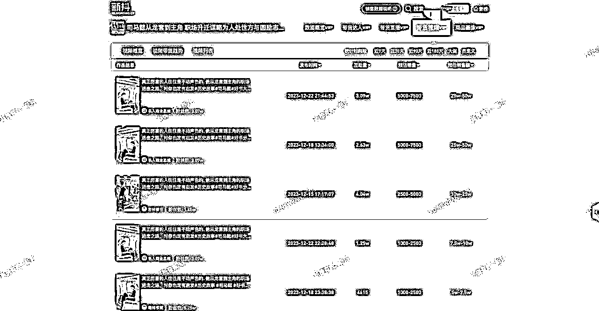

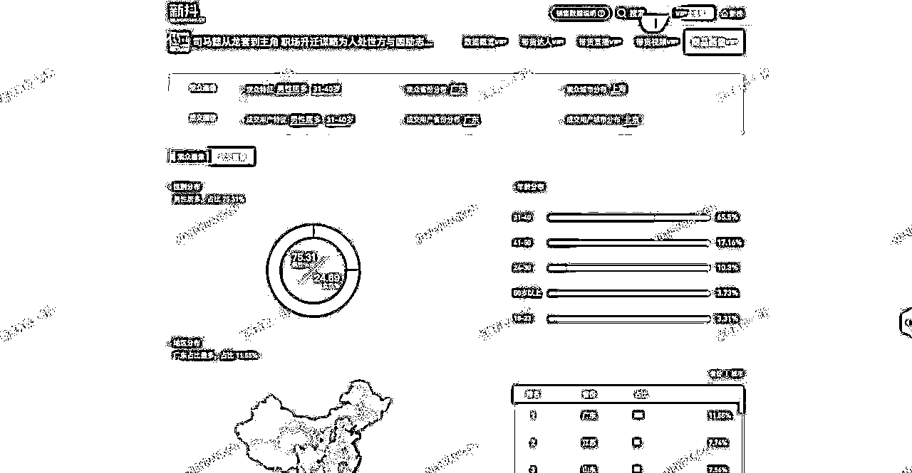

选品后，切记，视频号电商 IP 是货带人的逻辑，要从用户对商品的需求出发，再来创作合适的内容。

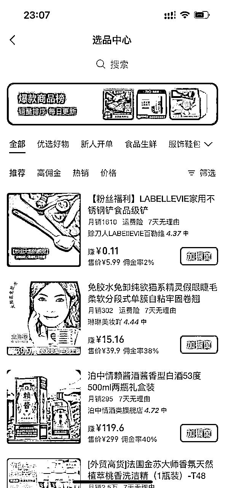

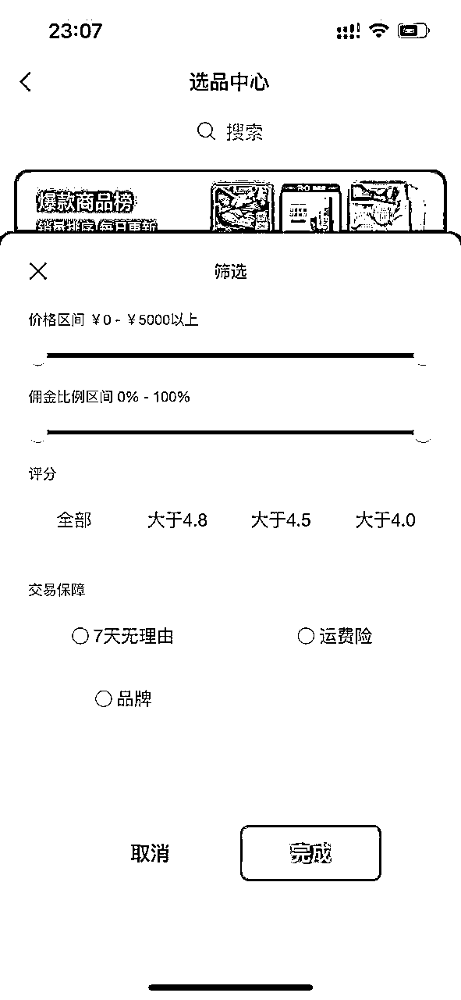

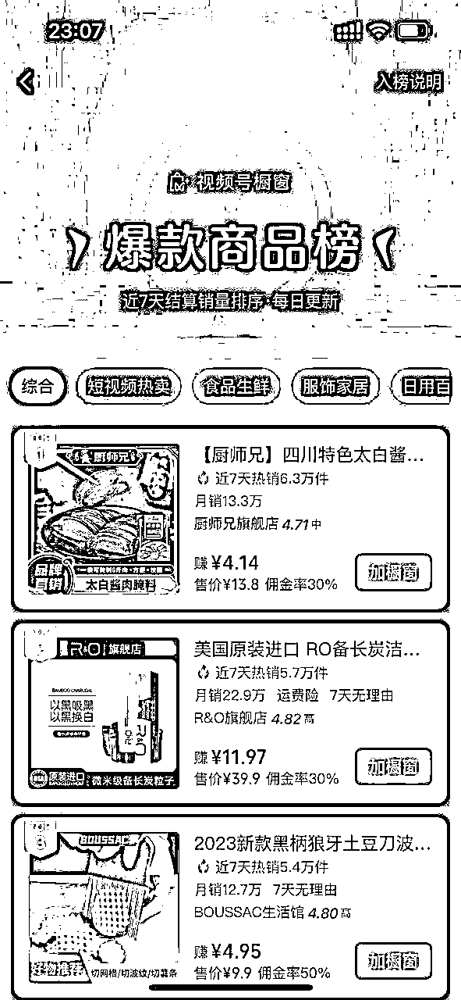

#### 4.2.2.2 发视频挂商品 @纸壳 @李诚 Sonic

如果已经通过前面的步骤把商品挂到橱窗了，在发布视频时，我们按照以下步骤操作即可：

内容来源：《视频号带货建议指南》；《视频号短视频挂车投流常见问题和解决方案》

# 选修篇：更多玩法

💡章节概要

当我们完成项目最小 MVP，基本掌握项目的操作流程后，可以尝试项目放大玩法：

✅电商 IP 直播带货发掘项目的更多可能性~

# 五、电商 IP 直播带货

💡

章节概要带货视频一爆，我们就可以立马开启直播，去放大成交、拉升销售额。

我们这次打造的电商 IP 偏向民生、感情赛道，考虑到人设和内容的一致性、以及介绍商品的直播话术和潜在风险，我们建议直播去做图书或者家居好物这两个赛道。

这里整理了直播相关的内容供大家参考：

✅直播推流机制

✅直播场景怎么搭

✅直播话术参考✅直播违规注意事项

## 5.1 了解平台推流机制 @大树

了解平台的推流机制，有方向、有依据，才能越做越好。做视频号直播带货，我们需要关注人气数据，同时更需要关注成交数据，以及公私域流量。

这些因素在短视频平台上可以帮助大家提升影响力、人气和直播质量，从而更好地进行产品推广和带货活动。不过，请注意这些因素可能会因平台政策和算法变化而有所不同，所以确保了解最新的平台规则和趋势是很重要的。

### 5.1.1 人气权重

曝光进入率这是指观众从平台的曝光渠道进入直播间的比例，即进入直播间的人数/平台给的曝光看到人数。

曝光渠道包括封面、标题、直播画面等，这些因素会影响观众是否点击进入直播间。这个比率可以帮助了解有多少看到直播间的人实际进入了直播。

2.有效观看占比 30S/60S/180S

这是指观众在直播中观看的时间占比。

平台会针对用户在直播间的观看时长进行分层，看了 30 秒以内的用户占比多少、看了 60 秒的用户占比多少、看了 180 秒的用户占比多少，从而根据推流规则计算评判直播间内容、直播间能力给予相应定位的权重层级。

互动率、关注率

互动就是观众与主播通过问答、评论、送礼、连麦等方式进行交流，互动能增加观众的参与感与粘性；关注代表主播人气提升，粉丝的增加，关注后可以收到直播间开播通知，代表了更深度的用户粘性。

互动率、关注率越高说明主播越受欢迎、直播内容受欢迎、用户粘性高，越好转化成交。

粉丝团粉丝团成员基本就是铁粉了，可以长期持续维护转化做裂变、让他们分享到各自的渠道（朋友圈、社群等）来帮助直播间拉流。

### 5.1.2 成交权重

1、成交密度：单位时间内的成交量

成交密度对于自然推流的贡献特别特别明显，根据在线人数的 10%来计算成交单量，即如果有 100 人在线，就争取成交 10 单。不管是下单的 1 块钱的还是 100 块钱的都没关系，争取做到 5 分钟成交一波、连续三波 5 分钟成交密度叠加是有机会刺激平台推流的。

2、商品点击成交率

商品点击成交率 = 成功下单量 / 商品链接点击人数

商品点击成交率越高代表商品越受欢迎，这个数据对于推动平台曝光流量也是很重要的。

我们按照不同产品属性来制定数据标准：

福利品的点击成交率要达到 70%以上承接品的点击成交率达到 40%以上

利润品的点击成交率达到 20%以上

以此保证整体商品点击成交率在 30%左右商品数据达不到就需要优化主播话术、商品链接、还有选品、排品的问题。这些内容，我们将会在后文介绍。

### 5.1.3 私域与公域置换（重点关注）

视频号与抖音最大的区别就是可以做私域流量，并且可以通过私域流量撬动公域流量。一个私域流量可以置换 1-50 个公域流量。

1、分享

视频号直播可以分享到朋友圈，可以让用户分享到他们的朋友圈。

分享动作全程都应该要，想办法用策略去要，具体怎么要，需要自己多思考，每一个分享都会带来更多的流量，比如亦仁分享了我的直播间，你在朋友圈看到了，是不是会点进来看看。分享的人质量越高，流量越大。物以类聚，人以群分，他是我的用户群体，他朋友圈里的人也有很多是我的用户。

2、预约

可以做多次预约，为下一次直播做预热。

预约和分享的节奏差不多，预约也是应该见缝插针，在直播中有机会就要个预约。需要提前设置好预约，方便在直播间弹窗。

比如你这次直播中为下次直播预约了 100 人，这 100 人在你直播中都会收到提醒，即时有 50 人不点进来，那么开场也会通过预约进来 50 人，亲测有效，很好用。

### 5.1.4 不同阶段的考核维度

1、冷启动期：1000 场观以下

注重人气数据（关键数据：曝光进入、停留）

在冷启阶段，系统会重点关注直播间的「内容消费表现」，也就是说，推荐系统会根据「曝光进入率」、「直播间有效观看占比」情况，来找到对该内容有兴趣的用户，并在后续推荐过程中做持续的放大，如果直播间在这几个指标上表现较差，则有可能无法持续拿到更多自然流量。

2、数据增长期：10000 场观以下注重流量精准度（关键数据：商品点击率、支付转化率）

在此阶段的账号核心考核的是「商品点击成交率」，也就是说有多少用户点击查看了直播间商品、又有多少人点击进去成功下单，这与下单金额无关，只与「下单人数」、「下单单量」有关，直播间用户开始单纯从看内容到有支付行为开始转变。平台就会开始给直播账号打上精准的标签定位，从而开始推荐更精准度人群来到直播间。

3、成交转化期 ：10000 场观以上

注重直播间利用率（关键数据：GMV、观转率、GPM 千次观看成交金额）

有了相对精准人群、平台考核制度开始转变到直播间对于「流量的利用率」，也就是同样的流量你能卖多少钱，同行能卖多少钱，谁给平台带来的利益高平台就会把更多的流量交给谁，这就是平台的赛马机制。

重点考核的就是成交金额也就是「GMV」、整体的「观看成交转化率」就是平台给你了这么多精准流量你能卖出去多少订单、「GPM 千次观看成交金额」就是平台给你推荐了一千个进入你卖了多少钱，这些都是同行赛马的关键数据，做直播就是压倒同行从而获得流量。

## 5.2 直播场景搭建

### 5.2.1 直播设备&工具

直播设备相较拍摄视频要简单一些，主要有：一台手机：用于拍摄

手机支架：用于固定手机商品样品：不管是书籍还是家居好物，都需要准备展示的样品（如果你做的是知识付费直播，需要把直播关键词提前做好 KT 板，用于直播间展示）

商品展示旋转台：用来展示样品

直播伴侣（免费） 直播伴侣 - 下载

### 5.2.2 直播场景

俗话说，场景不会搞，直播做不好。

场景可以理解为我所能看到的一切画面。包含直播封面、直播画面、主播、产品的包装等，任何可以让用户看到的都叫场景。外场景是直播封面+直播实时缩小画面，点进去就是直播是实时画面。

#### 5.1.2.1 直播封面、画面

从直播广场未点进直播间的情况下，先看到静止的直播封面，再看到动态的直播实时画面。这时候听不到主播说什么，只能看到文字信息和直播画面。

封面是一个海报，要包含最重要的信息。简洁明了，让人一看就知道是做什么的，我们要把任何一个给我们展示的地方利用好。比如："泰国原装进口乳胶枕——好睡到天亮"。

直播广场上的动态场景，也是我们直播的实时画面，画面影响着直播曝光进入率，我们看一个直播画面有没有吸引力，愿不愿意让人点进来，这个很重要。官方有明确指出"曝光进入率"很重要。

直播画面里的标题，比如："好睡到天亮。""哪些人适合用乳胶枕"。

#### 5.1.2.2 直播画面中的文案特点

简洁、讲主题、说重点、一目了然、有吸引力

有吸引力："产品上贴上 1 米福利"、"老北京布鞋 9.9""奥特莱斯正品撤柜"品牌宣传："回力正品直播间"

痛点卖点："三分钟出门素颜装"信用背书：XX 官方制定供应商、XX 工艺大师...

#### 5.1.2.3 场景搭建的依据因素

同一个产品，在不同的场景里，表达的信息不同，好的场景自己能卖货。给用户购买者一个想象画面，能够想到自己得到这个产品之后会有什么改变。

产品视角：产品为主要视觉中心，例如手播卖西洋参，画面就是对着产品。突出产品卖点、产品功能、产品细节。

整体氛围感：在茶室里卖茶叶突出高端、在仓库里卖茶叶突出性价比、在茶园里卖茶叶突出原产地正宗、在大卖场里有茶叶、热闹氛围。每一个场景都对应了人群的购买喜好。

原产地：如果是真实的，不好复制的原产地，就用最真实的场景说话，走出室内，会让用户产生信任度。比如：在新疆葡萄园里卖葡萄干 VS 在一个房间里卖葡萄干。优势就很明显，吸引力、信任度都会不一样。

产品的包装：卖产品还是卖包装？我们是通过镜头去感知一个产品的价值感，视觉效果很重要。很多产品，包装比产品贵。

产品的摆放：一个陶瓷杯放在一个普通的桌面上 VS 一个陶瓷杯放在一个木制的盒子里 VS 一个陶瓷杯放在一个打着灯光的玻璃柜里。自己感知。

### 5.2.3 实战直播场景

对于真人出镜的短视频账号，一定要借势用户对 IP 已有的信任，出镜直播

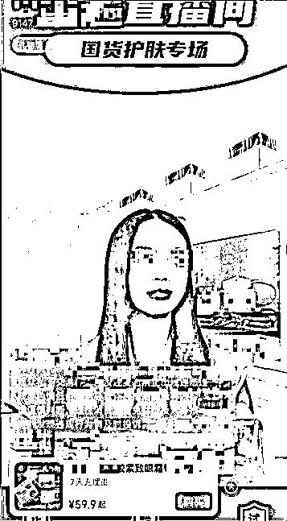

## 5.3 直播话术

### 5.3.1 话术类型

#### 5.3.1.1 拉流话术：外面的点进来、进来的留下来

目的：要数据，破层级，做权重

这里解释简单解释一下，什么叫做拉流。直播间进来的人就是流量，讲一两句简短的和他有关的话吸引他们，把他们留在直播间，同样在外头没进来的人听到有福利也可能会进来看看，进来的人不出去，持续把人留住从而达到在线人数越来越高，留住的人比离开直播间的人多在线拉高了，说明你拉流成功了。

话术举例：欢迎新进来的姐姐们，我手里的这个帽子，我们专柜价格 899，现在一个快递费就给了，想要的打 1，丝绸面料的帽子，适合 XX 的姐姐，已经有 XX 报名了，还有 XX 个名额，2 分钟就要上架了。。。等会还有 XX 也是给大家准备的福利。

#### 5.3.1.2 立人设：讲背景

有背书、做信任，即为什么你要听我的

立人设的重点在于，摆事实、拿证据、讲故事，让人信服。

话术举例：咱们家是帽子工厂，有 3000 平方的厂房，100 多个工人，一天能生产 XX 个帽子，都是给品牌做代加工的，咱们这个帽子贴个商标就是大几百，你看咱们这个款式在某宝某猫上卖 XX（举道具：价格对比）。。。。

#### 5.3.1.3 讲主题：今日活动

有主题，有逻辑，我来干什么，我为什么要这样做？

话术举例：我们家一直做线下，最近刚来线上，准备做自己的品牌，那咱们都知道不管是开店还是做直播肯定是得要先有人，我们也不知道怎么做直播，所以我们准备拿出来 XX 份礼物给大家，姐姐们啥也不用做就呆着领礼物，给我捧捧人场热闹热闹，稍后 2 分钟一轮给大家安排，也不耽误大家时间，今天的福利都是有 XXXXXX。。。。

#### 5.3.1.4 点对点：点对点成交，要读公屏

专业度、易成交、有故事。可以请水军来带动没有互动的人

话术举例：XX 姐姐给我扣 1 了，给她安排一单

#### 5.3.1.5 塑品话术：让产品听起来逼格更高

从更高维度塑造产品

不是简单围绕产品本身说这个什么材质，什么工艺，是从更高的角度去和产品相关联，通常会用到这些词汇：大牌同款、纯手工制作、明星同款、进出口 。

1.痛点需求：引起共鸣

2.

产品卖点：为什么买？能解决 XX 问题。

价值塑造：讲故事塑品、类比品牌

话术举例：（纯手工制作）这个版型是由京派旗袍传承人亲手设计的，具有浓浓的京派旗袍的韵味，穿在身上，凸显您的女性魅力，这款旗袍如果您有兴趣看，在北京的大栅栏这条街上，就有这个京派旗袍传承人的门店，有就会能够看到这个款式。

#### 5.3.1.6 转品话术：承上启下

无中生有、顺其自然、利他口吻话术举例：刚刚有姐姐问，眼镜还有没有？咱们这个眼镜是给老粉的福利，昨天答应你们的，新粉先不买，过完这个再给新粉福利。

#### 5.3.1.7 催单逼单：为什么今天买？今天不买有什么损失？

开价格后，给他们多留点时间拍，但是要营造紧迫感。

话术举例：姐姐们手速太快了，没有了，以后也没有了。看看还有没有占单的，再给姐姐点时间，再不付款，咱就把名额让给有需要的姐姐。

#### 5.3.1.8 保障话术：放心无忧

买了后悔了怎么办？看了没有用怎么办？不满意怎么办？承诺

话术举例：我在这里向大家保证，我们的所有产品都是正品，假一赔十。你们可以看到，这是我们的产品质量报告和国家相关部门的认证。如果你们在购买后发现任何问题，我们提供 7 天无理由退换货服务。我们的客户评价也非常好，已经帮助了上万的客户解决了问题。所以，大家可以放心购买。

### 5.3.2 实战直播话术

实践中我们做的情感类和民生类 IP，针对图书和家居好物两种直播，建议两套基础话术，一般只需要在直播过程中反复使用。

图书直播欢迎各位来到直播间，这里是视频同款书籍的直播间，点击直播间左下角链接把书带回家

这套书印刷清晰，有油墨香气，今天直播间都是包邮送到家，大概多久能到货呢？包邮区的话大概 2-3 天，其他地区看快递配送情况。

来我跟大家看一下书里的内容（翻开书，读目录）

家居好物直播

欢迎家人朋友来我们直播间，这里是视频同款商品的直播间，点击直播间左下角链接把商品带回家来我们来看下这个产品的功能（演示功能）

来我们看下这个产品的质量（展示质量）

## 5.4 直播违规注意事项

在熟悉直播全流程后，我们也要注意规避直播违规的情况。

要知道，视频号的管理非常严格，一旦违规，对账号的打击是不可逆的。虽然明面上说是 3 天或者 7 天限流，这个号大概率过了处罚期，流量都会减少，只能换绑或者注销重来。因此，如果不是熟练的团队，不推荐无人和半无人直播，非常容易违规。

目前，直播违规主要分为两种类型，一种则是小店产品售后违规，包括商品的标题，图片等等。另一种是直播间违规，包括主播话术，直播间场景等。

情况一：产品售后违规 1）违背承诺【延迟、无法发货】：视频号橱窗商家未按平台规定或约定向视频号橱窗用户发货或提供承诺的服务。处理结果一般是禁止使用橱窗 3 天跟下架对应商品。

应对策略：如果确实由于各种原因未能及时发货，及时要向平台进行报备或与客户沟通取消订单。报备是直接在小店后台进行报备即可（如下图），还有一种则是给平台官方发送报备邮件（weixinlive-JF@tencent.com）。只要有报备，理由是正当的，后续如有误判，找官方小二沟通，大概率还是能撤消处罚恢复开播。

注意，报备最多可报备 15 天，超过报备期限就必须重新报备，否则将会按照违背承诺处罚。

具体细则，详见：《视频号橱窗商家【违背承诺】实施细则》《关于延迟、无法发货报备的指引公告》。

2）推广超范围商品： 视频号橱窗达人通过视频号橱窗推广明确不得在平台出售的商品类型。即售卖平台禁售商品，或商家无对应资质开通类目的商品，包括超低价商品等。

例如，售卖皮色料（属于珠宝玉石禁售）/无资质赠送手表（商家无资质售卖的商品）/售卖莫桑钻商品（平台明确限制出售的商品）/售卖平台禁售商品低价珍珠饰品（推广平台明确限制出售的商品）。

应对策略：了解平台开放、不开放、定向准入的产品，且了解部分定向准入产品的销售底价。一般情况下直播间只能售卖绑定

3）发布违禁信息：发布的信息或商品违反《中华人民共和国广告法》等相关法律法规。

主要有两方面，第一方面是食药同源或者滋补品，容易在直播中被判处夸大功效；

第二方面是主播或直播团队被全网拉黑或违规违法团体。

例如，

口播吃亚麻籽油可以疏通血管，养护大脑，存在虚夸普通食品功效而被处罚；

拍 A 发 B 售卖‘幸福小丸子’（壮阳物品）而被处罚；

主播话术：男人加油站；懂得懂，一个小时打底，因而处罚；

主播口播售卖的古玺堂精油炙疗腿疼、颈椎膝盖难受等症状，为夸大护肤品医疗的功效而被处罚。

例如，口播吃亚麻籽油可以疏通血管，养护大脑，存在虚夸普通食品功效而被处罚；拍 A 发 B 售卖‘幸福小丸子’（壮阳物品）而被处罚；主播话术：男人加油站；懂得懂，一个小时打底，因而处罚；主播口播售卖的古玺堂精油炙疗腿疼、颈椎膝盖难受等症状，为夸大护肤品医疗的功效而被处罚。

4）发布虚假宣传信息：视频号橱窗达人违规使用极限词，虚假限时文案，欺骗，误导视频号橱窗用户的情形。

判罚的逻辑大概有以下几类：货不对板；质量问题；用户投诉；纠纷单量大；物流问题。

例如，因该账号的商品品质与宣传描述不符（少件），给消费者带来不良体验，举报与投诉数据较多；因该账号的商品品质与宣传描述不符，且带有物流异常问题，给消费者带来不良体验，举报与投诉数据较多；

主播口播宣传该商品具有祛斑作用，但所提供相关的特殊化妆品证明中的名称与商品名称不一致， 固无法判定该证明上的名称为此商品。

应对策略：虚假宣传是非常容易出现的判罚，其中核心是直播间货品与实际货品质量不一致，导致用户投诉或引起纠纷，会被判处虚假宣传。且承诺物流发货快或几日内送达，如果达不到，遭到举报，也会被判处虚假宣传。

故而要注重产品的品质，直播样品与正品是一致的，同时主播要注意话术，不可为了逼单在直播间给出过多的承诺，最后是一定一定要做好售后服务，客服要能及时响应客户的咨询跟处理售后服务。

具体细则，详见：《视频号橱窗描述不符/虚假宣传纠纷处理判责标准》《视频号橱窗交易纠纷处理规则》。

5）发布不合规信息：主要是商品重要信息缺失跟类目乱挂。

例如，商品名称没有重量，或玉石材质，镶嵌类的商品无品牌无重量；

商品标题缺少品牌信息；

翡翠手绳类目错挂在翡翠手镯上和翡翠吊坠上 ；

正红菇干货类，应挂在食品饮料>粮油调味>南北干货>类目，而商家最终是错挂在生鲜-蔬菜-根茎类上等等。

情况二：直播间违规

1）不正当营销：视频号橱窗达人通过虚假承诺福利，虚假抽奖，虚假赠品等方式吸引人气，吸引视频号橱窗用户关注但最终未兑现。

例如：

①直播宣传：涉及全场 1 折，1 折清仓，全场 X 元/折起，免费送 XX，xx 品牌商品个位数，全场清仓，全清，清完走人，专柜 x 折，特殊材质商品个位数，扣 xx 免费送，新人免费送.....

②直播间物料/举牌：直播间人员或背景出现 1 折、X 元、免费送等字样（包含但不限于字纸印刷物、电子显示屏、灯牌、第三方推流贴图等）。

③低价商品高运费：售卖商品明显低于市场价、成本价，同时收取高额运费的引流方式。

④打击场景：直播间口述、视频号昵称、简介、直播主题、公屏互动等。例如，工厂直销一折优惠；标题宣传全场 9.9，涉及低价引流；直播间直接展示产品免费试用；直播间新人，每人送 2 份见面礼字样；直播中使用低价商品进行引流（1 元），实际商品价格高于宣传价格。

应对策略：不正当营销是目前平台处罚最多的判罚规则，主要是所有涉及到低价或者赠送或者福利品都会被判处为不正当营销，目前的视频号规则不允许通过低价进行引流，而且价格不能低于 9.9，折扣也不能过低，在官方看来属于恶意竞争打价格战，所以抖快的直播习惯和套路并不完全适用于视频号。

具体细则，详见：《视频号橱窗达人【不正当营销】实施细则 》。

2）低质量内容：无人直播，录播。画面属于录播素材，非实时直播。除非有特殊申请，不然目前平台是不允许这两种方式的直播。这里要特殊说明一点是，平台是允许绿幕直播的，只是不允许在绿幕直播时，背景是放一个视频一直在循环播放。

但在今年 2 月份开始，平台对背景视频播放有放开一种场景，就是服装直播间，背景是可以放置模特走秀的视频，要求清晰，全屏即可，目前仅限这种形式被允许。例如有两个帐号是目前一直在开播，百丽集团旗舰店跟佑游健身，大家可以关注看看。

具体细则，详见：《视频号橱窗达人【发布低质量内容】实施细则》。

3）在以下场景：直播间封面、背景、头像、主题、评论区、昵称等不要出现“扣 xxx 送 xx，新人送 xx，关注送 xx，免费送 xxx”等【虚假福利或不正当营销行为】。

例如：

扣 1，分享朋友圈送手镯

关注送项链

扣 666 免费送梳子

新人免费领大礼包进来免费送、0 米送

等等引导用户在直播间互动给礼品的种种方！

其他敏感词详见《视频号直播敏感词汇注意事项》《视频号直播违禁词大全》。

另外，在各个品类也有各自的一些违规规则。

如生鲜类直播间，第一，直播间内必须展示实物商品，包装商品需拆开包装展示内容实物，不可以用绿幕代替商品展示。也就是说不能只展示内容物，要连包装一起展示在直播间；

再比如卖生鲜肉的直播间，需同时展示带包装产品，不能只展示肉本身；再比如售卖冰冻鱼的，不可只在直播间展示新鲜鱼，需展示冰冻包装鱼，防止误导消费者。第二则是商品标题、商品实物包装名称、直播间展示实物，三者需一致。

最后，分享大家一个经验，如果直播过程中，后台有两次弹出直播处理通知，需要马上下播，重新开一场新直播。这个规则在于如果有第三次弹窗通知，处罚至少禁播 1 天起。但新开播又是重新计数了，这样可以减少一点禁播风险。

内容来源：3 月 8 日《视频号直播违规避坑》@宏；《12 月航海|视频号带货|航海手册》

