整理日期：230613

 

 

生财风向标系列单独用在线文档分享，地址见专属群q群消息。

一些帖子跳转飞书查阅，如需破解复制权限，见这篇文章：

解除复制限制！

往期的生财周报合集（含在线版和离线版），见专属群Q群文件和群公告。

希望大家有收获~

标题加了(精华)的表示精华贴，前面为截至今日的点赞数。

以下是目录，内容有些多。大家可以挑兴趣的内容阅读。

 

# 【目录】

【目录】

【项目分享】**8**篇

(精华帖)(95赞)如何利用高考2天摆摊卖花赚波快钱

(精华帖)(152赞)抖音优化文案，从“抄”到“超”，卖中高考押题作文，3天转化3000单＋

(精华帖)(242赞)资料整理日均引私域180+用户，最重要的是提供附加产品-解决问题的方案

(精华帖)(143赞)人均 GMV 50W 的三线城市高考咨询项目实战分享(29赞)知乎引流之“术”——稳定、安全、日均50+

(23赞)高考志愿填报这门生意分析

(54赞)一年不开张，开张吃一辈子的高考志愿填报项目

(精华帖)(73赞)如何短期用 SEO 协助一民办学校招生到 5500+ 人，并拿到 15W 的奖金

【中标案例】**29**篇

(145赞)高考在抖音-视频号-快手-小红书起号，1000 W+播放

(精华帖)(88赞)高考生查询和了解意向报考学校将会用各种公域平台

(151赞)知乎目前流量很强，可以从高三即将步入大学的学生这边找突破口(117赞)抓住高考热点，用学校吸引高三家长，售卖志愿书-卡

(181赞)这段时间高考赛道的内容应该是最火的，可以引流

(140赞)抖音卖衡水中学学霸笔记资料，再深耕用户做高客单

(123赞)就要高考了，做玄学的可以卖高考专用符等周边产品变现

(74赞)高考季视频号直播可以借鉴张琦矩阵的玩法

(33赞)出一个报考学校的思维导图，可以引流，也可以付费阅读

(50赞)针对要中考、高考学生定制营养食谱课程

(13赞)各大平台开始做高考相关的流量，及周边产品

(11赞)抖音很多北京大学在读学生介绍学习方法，橱窗售卖状元笔记之类的学习相关产品

(7赞)小语种高考今年火了，老师需求很大

(9赞)一个工具搞定高考志愿填报

(7赞)爱山东、支付宝高考成绩查询通道

(9赞)小程序「高考U选」，助力志愿填报智能化

(6赞)高考说专业是一个大热点，视频号、抖音等都可以实现涨粉变现

(9赞)高考后联系学霸学神和家长，做暑假补习服务

(7赞)在高考考场门口送带二维码的小扇子，巨大的广告效应

(4赞)高考热点，一切行业都可以蹭热点

(5赞)可以在考场门口向家长推送高考志愿资料，为微信号或者公众号做引流(6赞)高考的流量，在各个应用、自媒体所有行业均可以试用

(11赞)高考结束存在的隐形机会

(13赞)高考可以在学校门口面向家长，设置海报加好友拉群免费提供志愿指南(5赞)江苏阿姨设计中国风高考锦鲤旗袍，寓意孩子考上重点大学

(7赞)高考会有一大批家长陪考，可以搭帐篷给家长们休息，拉新引流

(7赞)高考可以提前找各学校学霸预约学习笔记售卖低年级学生

(6赞)高考祝福礼盒

【异常值洞察】**7**篇

(12赞)AI写高考文章，测试流量主广告效果，是否会豹纹

(11赞)高考期间搜索量上涨，成为热点关注的风向标

(6赞)高考市场具有增量潜力

(13赞)每年中高考相关产品，从4月份增长趋势迅猛

(106赞)高考志愿填报微信指数不断上升

(59赞)资料引流、虚拟产品频率较高的词和行业

(19赞)高考季的直播很吃香

【思路分享】**39**篇

(17赞)抖音报考群规则和玩法，引流变现不容错过

(10赞)高考热点视频直播效果好，可延展至志愿填报和大一新生准备

(14赞)利用高考季节吸引流量，同时布局大一入学准备文章

(10赞)高考、中考临近，小红书上押题题材引流效果不错

(15赞)高考期间销量飙升，张雪峰的《选择比努力更重要》成热门选择

(10赞)历年高考选择题答案分布规律，多种变现方式等你来玩

(9赞)抖音高校报考咨询群拓展：寻找高职类院校，引流创业粉的不错选择

(15赞)高考志愿填报咨询服务：盖洛普测评赋能，增加成交量

(14赞)高考毕业季，班级MV制作需求增加

(13赞)中、高考祝福商品，打糕、花、糕点、包子粽子，商机多多

(9赞)B站UP主利用AI预测2022年高考作文题，可广告合作与教育机构合作，具体玩法揭秘

(24赞)高考卖花，不同节日相同玩法

(15赞)毕业季和6.18到来，学校周边二手书和笔记收购是挣钱好路子

(11赞)用ChatGPT做高考题蹭热度，还能够利用高考热点结合chat做一些复习资料等项目

(13赞)对于黑龙江省外，尤其高考大省，也许是提前选择布局的一个机会

(14赞)高考摆摊新项目：在校门口卖花束，价格与学校联系起来

(8赞)中高考各平台的这个品，可以跟上

(10赞)接下来一个月左右最热的话题是高考，可以推高端的志愿填报指导，卖志愿填报卡

(8赞)高考周边产品（文具）可以加大投放或者免费流量力度了

(8赞)抖音开了高考栏目，各个小机构目测可以再结合ChatGPT生产

(6赞)高考可以用AI声音和AI视频接一些祝福或者加油的定制短视频

(8赞)高考后这一部分学生的各方面需求都很多

(8赞)大家可以在高考那几天去接一下流量

(6赞)马上高考了，可以弄点祈福手串

(23赞)抖音分享文曲星配件，高考用品，做矩阵号一个月 1W 不难

(6赞)可以结合ChatGPT和MJ做类似的视频号，结合下个月中考加高考做(16赞)抖音今年做了高考主会场（百度的数据），每个学校可以创建抖音群(9赞)利用AI生成高考模拟卷，可信度应该还成

(6赞)水果店利用高考热词来售卖一种“祈福状元水果礼盒”，还会赠送“送考旗袍”+上上签

(9赞)中高考祈福无论是短视频还是直播都可以跑

(7赞)高考招生行业  ，市场火爆，利润高达35%

(4赞)小红书发教育行业的热点，可以适合长期搞

(11赞)高考结束分别的小礼物，数据还可以

(7赞)抖音名为地名+中考-高考的账号在学校外开直播，与学生家长互动引流(11赞)教高考报志愿直播间，用最原始的小黑板粉笔进行讲解，点赞评论量都相当高

(精华帖)(20赞)变现思路：高考毕业纪念模板

(精华帖)(18赞)思路分享：高考分数预测，猜中双倍返现

(精华帖)(16赞)各类app如何蹭高考热点

(精华帖)(44赞)杭州的闷声发大财公司代表：升学E网通

【资源对接】**2**篇

(105赞)抖音高校报考咨询群：赚钱新玩法

(0赞)提供高考志愿填报资料和填报指导服务的推广

# 【项目分享】**8**篇

# **# ****(**精华帖**)(95**赞**)**如何利用高考**2**天摆摊卖花赚

# 波快钱

作者：  艾小飞

日期：2023-06-05

马上又要高考啦，敏锐的创业人又嗅到了商机

高考卖花，到底能不能行得通？

我看行！

很多宝子把摆摊卖花当做副业，那一定不能错过高考季！！

因为高考当天学校门口会有很多家长，注重仪式感的家长都会给自己的孩子买束花万字长文预警！

接下来我会用干货的形式来分享此篇教程，覆盖了所有的实操细节！

争取让你看完后，无脑照抄的马上去执行赚钱了！

要认真的看完哦

详情可点进飞书文档链接

（内容很长，打开链接缓冲较慢，请耐心等待5-10秒）

总结：

因为过两天就是全国的高考了，每年到这个时候，都有小波的热度。

所以想要快速搞钱的，可以马上复制我这篇教程去实操，里面说的细节都非常详细了。

剩下的就看你愿不愿意去做了

另外在此我想感谢两位生财的圈友。@可颜  这位圈友，她给了我很多的关于在选花细节方面的技巧。让我意识到了不单单是实操过程重要，选花的细节也很重要，谢谢你！

还有这位  老师，他同样也给了我很多对于赚钱方向的横向思考。延伸出更多的思路。

比如文中提到的抖音直播和私域二次转化，就是这位圈友老师给的建议，谢谢你！

同时也特别感谢广西生财群主  ，是他让我感受到了我们广西人的团结和力量。同时群内圈友还会一起鼓励前进，一起生财有术！

再次特意感谢  他们

好了，这次的分享就到这了，谢谢各位！

https://nivut760ftk.feishu.cn/docx/X3ijdNIc0oyd3Ixf9H1cUUhJnzf?from=from_copylink评论区：

叶扬 : 很详细了，属于把饭喂到嘴里的教程

艾小飞 : 就看你有没有时间精力去照搬搞钱了[旺柴]

雨水 : 有谁想去呀，不介意请带我一个呀。

菜同学 : 赚不赚钱的就感觉比较有意义！

帅彬 : 详细，很详细，很有启发，感谢分享

亦仁 : 感谢分享，已加精华。

Super黄 : 太棒了，Why、What、How全都有

怪力小乔巴 : 啊哈，广西圈友！！！

# **# ****(**精华帖**)(152**赞**)**抖音优化文案，从**“**抄**”**到

# **“**超**”**，卖中高考押题作文，**3**天转化**3000**单＋

作者：  猎音狮

日期：2023-05-22

各位圈友们好，做图书教辅的都知道，这两个月是卖中高考周边的高峰期。

尤其像王后雄押题卷呀，万唯中考黑白卷呀……都比较畅销！

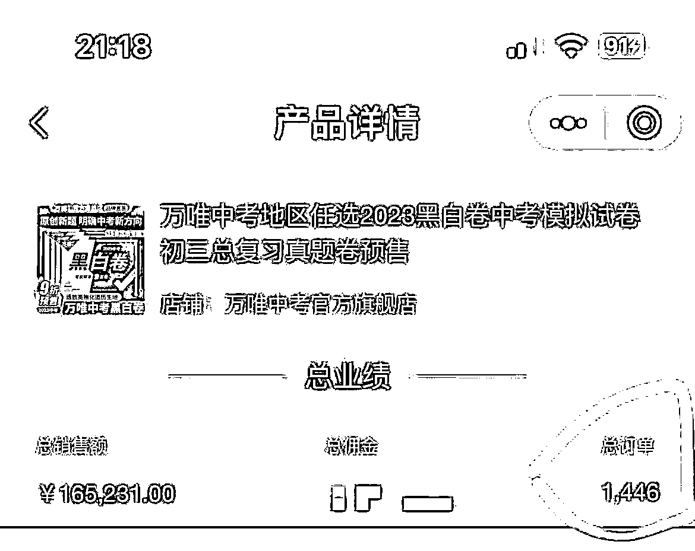

自然流 出的 万唯中考黑白卷 ！

下面是我这几天爆的意林押题作文素材。

截止现在，出了将近**3000**单。数据走势一直攀升中……

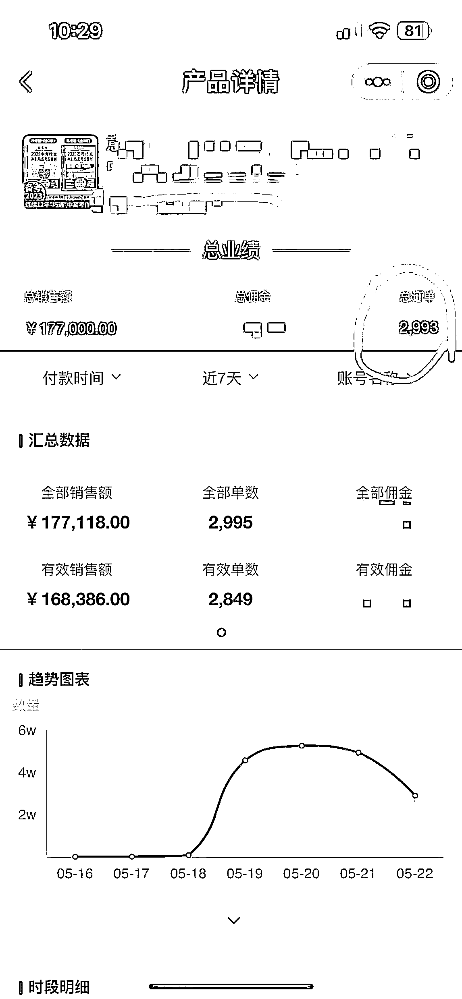

但是，也不是一来就爆的，这个文案进行了两次优化，才有了这个效果！

文案如下：

““淄博烧烤**”**被预测可能成为今年中考作文

淄博烧烤，非常有可能成为今年中考语文的作文题，因为很多地区的二模，已经考到了。

万一考到，怎么写呢？替孩子点赞收藏！

可以从这四个角度切入啊！

角度一：用真诚换真心

角度二：游客和淄博的双向奔赴

角度三：唯有特色，才能深得人心

角度四：抓住风口寻求突破

孩子在学校都不刷手机，根本不知道淄博烧烤是怎么回事？除了淄博烧烤呢，还有很多热点。

这本意林中考作文热点素材给出的这也是智慧，变，我的高光时刻，互联网，我心目中的英雄等等，也是很有可能要考，

意林呢，已经连续12年巧遇中高考作文，它还帮你选好了速用素材，考到直接好米下锅。

所以这两本书，考前几天，还是值得好好看一看！”

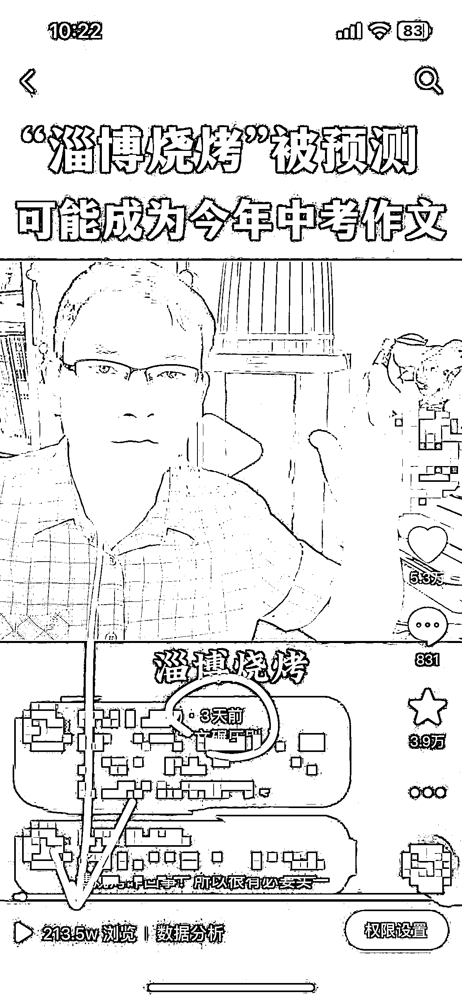

第一次发这个文案，是在**5**月**3**日，我也在我星球里分享了。

灵感来自我在抖音主页刷到的这个视频，5月2号发布的，我5月3号刷到，就用了！

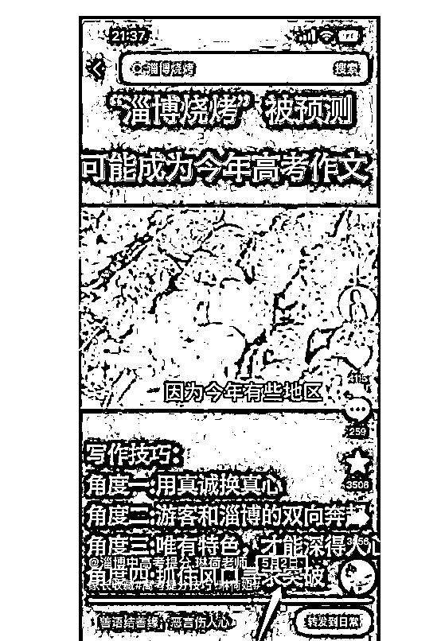

然后，视频发布后，我知觉告诉我，这个视频能爆（做短视频久的，这种知觉很敏感，我们叫它网感）。

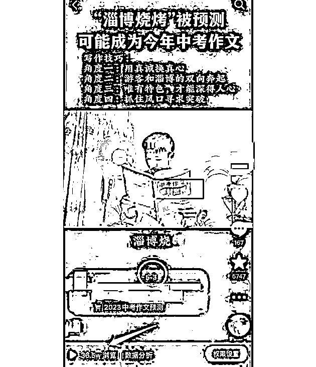

第一次（第一版文案），我卖的是这本书：中考作文素材密押

然后顺手分享到了我的星球里。

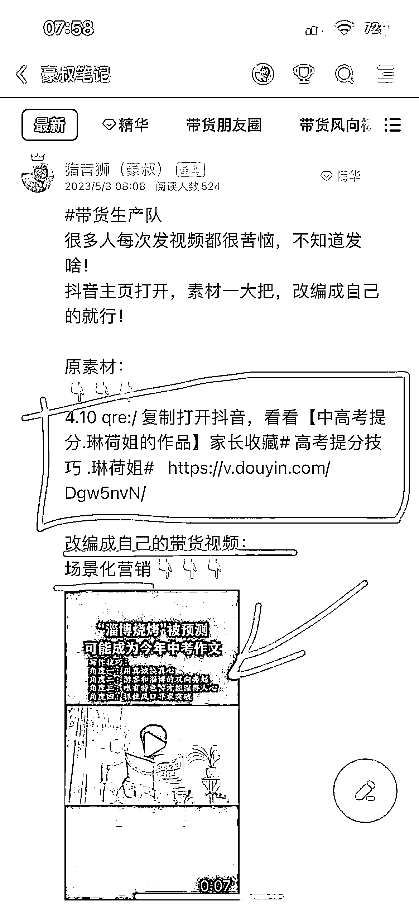

这个是拍一个**7**秒钟孩子看书的场景，然后把文案贴上去，场景化营销，很多宝妈号就是这么干的，简单粗暴！

就挂孩子视频中看的书，这个出了300＋单。

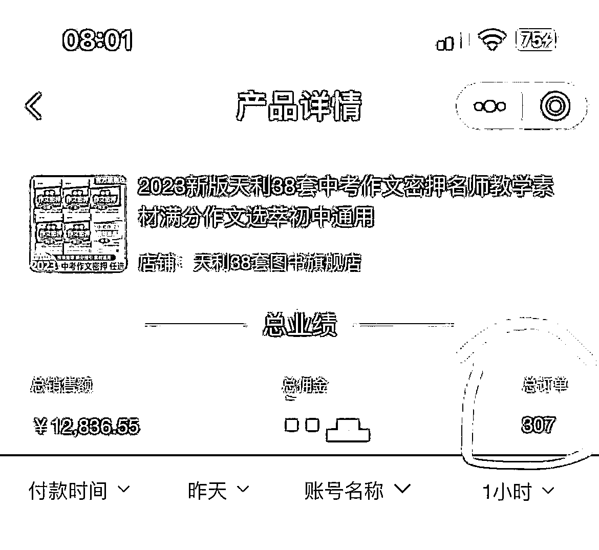

说到这里，给大家分享一个小经验，视频发出去，一定要留意评论区，一个是控评，删除一些带节奏的。

另外一个，你的评论区，就是一份市场调研问卷，你可以得到用户对你产品和视频内容的反馈，下次发布视频可以完善。

这里真的出问题了，家长炸锅了，评论区直接节奏被带骗了，严重影响到了商品转化。

因为写这篇文章的时候，很多评论已经被我删除了，找了一下，家长说的最多的就是：

孩子不看手机，怎么知道淄博烧烤这件事？

虽然视频数据很不错，但是严重影响转化，商家也急了，给我发来私信：

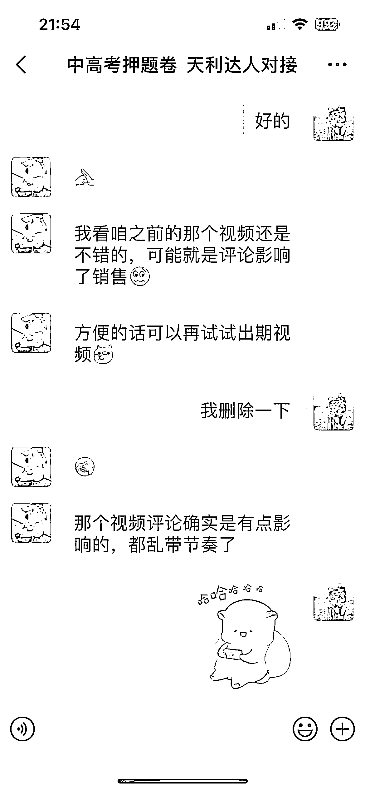

于是，我删了200多条评论，将计就计，顺着家长的思路，置顶了一条评论进行公关。

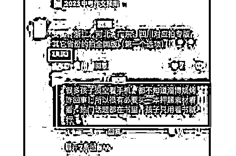

然后，转化一下子就上来了！

然后第二次出视频（第二版文案），我做了真人出镜口播的，吃一堑长一智，我把**“**孩子没空看手机**”**这个痛点写在了文案里。

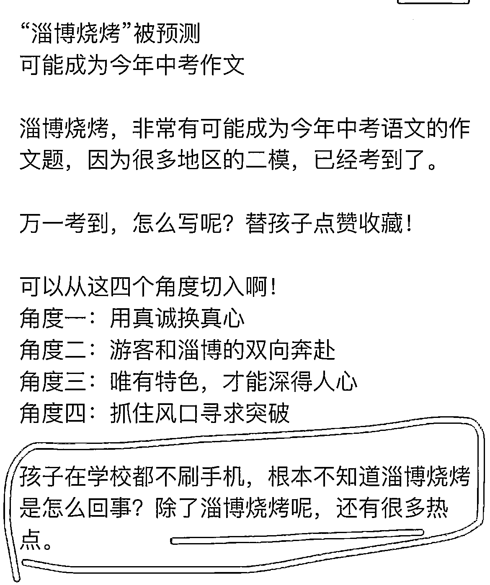

然后顺理成章引出产品，解决痛点：

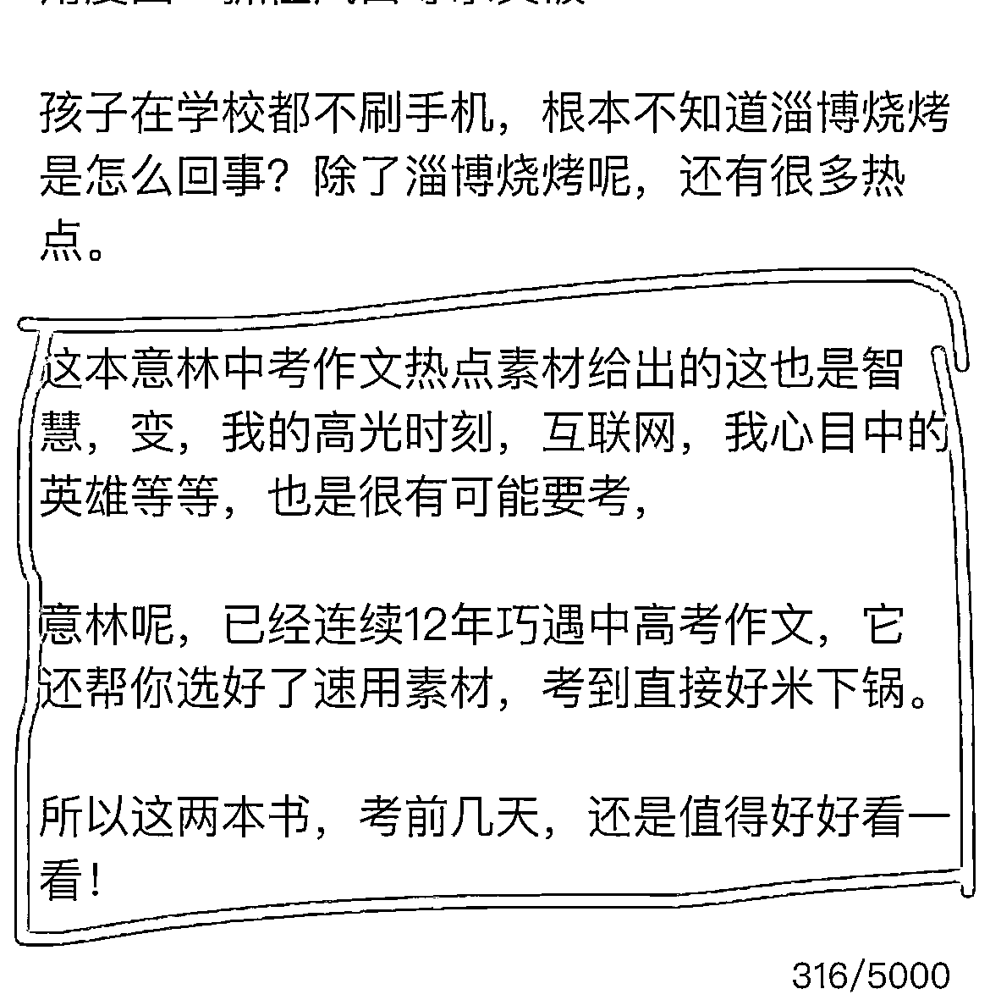

但是，问题又来了，家长更炸了这次！

说的最多的就是考卷已经封题，不可能考！因为淄博烧烤火遍全网，是在五一假期，我想也是。

评论我也删除差不多了，刚找了下，当时很多这样的评论。

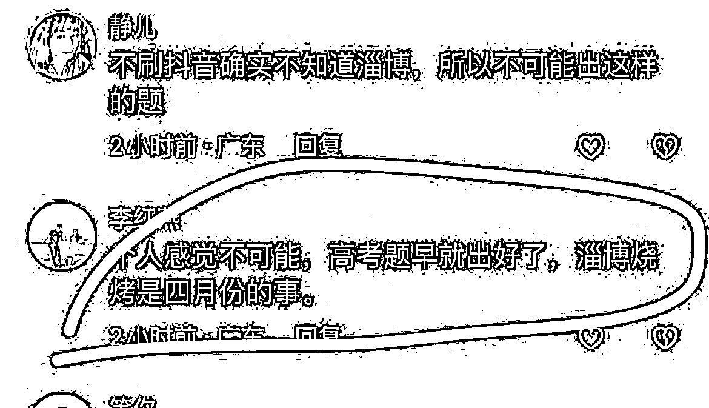

难到就这样被带着节奏走吗？

我百度了一下，好在淄博烧烤早在**3**月份就火了。

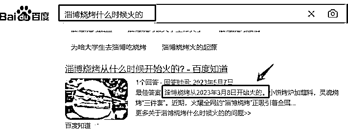

于是我又进行了第二次公关，评论区置顶了文案：

这个操作，完全把家长拿捏了，甚至有些家长在评论区都站在了我这方，替我说话：

说了更确切的时间，说是3月3号周五大学生放学后组团坐高铁去淄博撸串。这一局终于扳回来了！

于是这个视频就爆了，书也卖爆了！

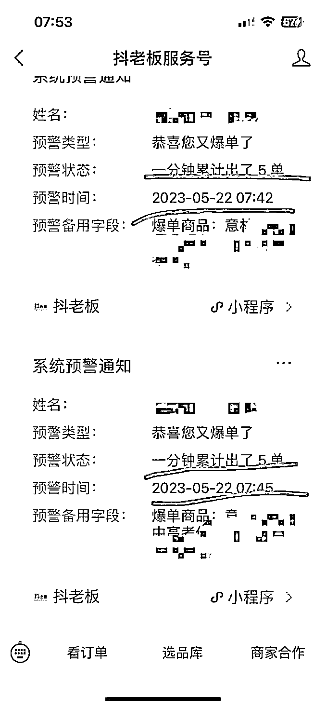

如果再出一版视频，我会把淄博烧烤什么时候开始火的也写进文案中！

比如 第三版 这样写：

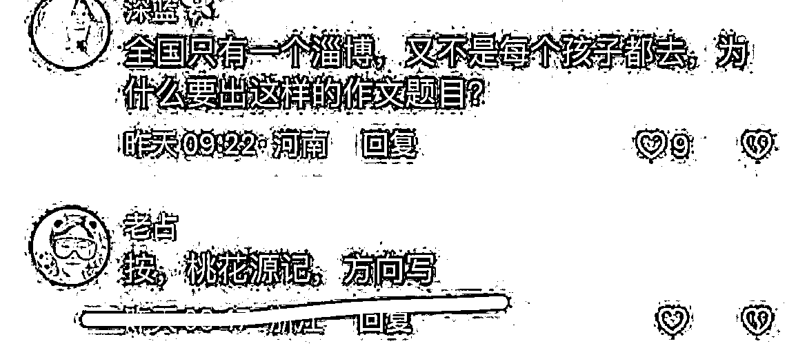

“淄博烧烤”被预测

可能成为今年中考作文

淄博烧烤，非常有可能成为今年中考语文的作文题，因为试卷四月底出好，而淄博烧烤**3**月份就火了，很多地区的二模，已经考到了。（打消家长押不到题的顾虑，提高转化）

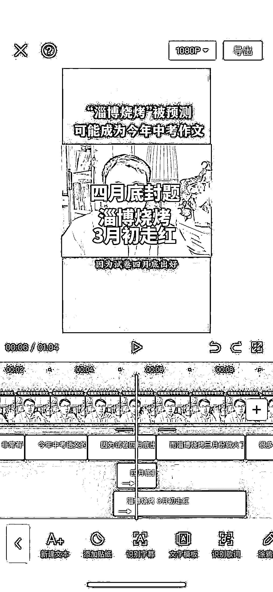

万一考到，怎么写呢？替孩子点赞收藏！

可以从这四个角度切入啊！

角度一：唯有诚信得天下

角度二：人间烟火气

角度三：以范仲淹的《岳阳楼记》为材料，考你政通人和。

角度四：结合《桃花源记》来考你

孩子在学校都不刷手机，根本不知道淄博烧烤是怎么回事？除了淄博烧烤呢，还有很多热点。

这本意林中考作文热点素材给出的梦想，成长，真情等等，也是中考热考主题。

意林呢，已经连续12年巧遇中高考作文，它还帮你选好了速用素材，给出了参考范文，考前背一背，用到直接好米下锅。

所以这两本书，考前几天，哪怕能多背一个句子，也是有用的！（这一句很关键，可以把这本书推到考前一周，提高转化）

然后根据反馈，继续发第四版、第五版、第六版文案**………**

所以，创作不是 自嗨 ，不是 一厢情愿 ，要根据目标客户的疑点、痛点出发，打消顾虑，解决痛点，才能把产品卖出去！

好了，这就是我对这次爆单的复盘，我是猎音狮，专注教辅赛道短视频带货。如果我的分享对你有所启发，就麻烦帮我点个赞，你们的认可与鼓励，将是我继续分享的动力！谢谢！同行交流VX：xxsnb6688

评论区：

拾一 : 牛🍺！！

猎音狮 : [抱拳][抱拳]

叫我去吃饭 : 豪叔真的牛！

猎音狮 : 雕虫小技，希望有帮助[捂脸]

豆豆 : 秀

猎音狮 : 😂

麋鹿 : 牛！

猎音狮 : [抱拳][抱拳]希望有用

# **# ****(**精华帖**)(242**赞**)**资料整理日均引私域**180+**用

# 户，最重要的是提供附加产品**-**解决问题的方案

作者：  三恒

日期：2023-05-10

既然你再获取客户，那就一定要打磨自己的产品，资料是别人的，产品必须是自己的，如果没有，那就去打磨，但是不能不做——因为这是打造自己的变现+产品体系的过程，而不是简单无脑的卖资料！

大家好，我是三恒，今年生财圈友的新手。

实操，资料整理日均引私域180+用户，但我认为最重要的是可以给用户提供附加产品，也就是解决问题的方案，在此之外，卖资料只不过是你获取客源的踏脚石（除非是你自己的产品和资料）。

大部分做资料整理的应该都是别人的产品，这个时候记住这句话（开头提到了）：既然你再获取客户（引流），那就一定要有自己的产品，资料是别人的，产品必须是自己的，如果没有，那就去打磨，但是不能不做！

因为只有做到这一步，我觉得资料整理的价值才算真正的发挥出来，赚卖资料的小钱已经是顺便的事儿了。

要整理输入，也要重构输出，甚至通过资料整理培养自己某一方面的能力，打造自己的商业盈利系统！

例如，卖高中资料的可以做高考报考咨询

卖英语资料的可以做英语训练营

卖阅读资料的可以做读书营等等

完整版转飞书文档

https://t6lslyeg22.feishu.cn/docx/BzIfdvAQloqLImxjEhKcERAXn5f评论区：

春夏 : 资料去哪里弄呢？

风轻云淡 : 非常详细[强][强][强]

乔帮主 : 资料整理航海整起来[呲牙]

三恒 : 看你想要什么资料，天涯的我可以无偿分享给大家

三恒 : 感谢认同

三恒 : 整起来

生财纪检委 : 房产的么这个

Dyna : 有启发，谢谢！

# **# ****(**精华帖**)(143**赞**)**人均** GMV 50W **的三线城市高

# 考咨询项目实战分享

目录：

**1. **确定赛道（定方向）

**2. **如何找到有需求的用户？

**3. **如何搭建一个团队，快速复制？

作者：  鹏哥

日期：2022-02-22

大家好，我是鹏哥，在一个三线城市从事新高考教育咨询工作 8 年。从 14 年入行做高考咨询业务，我们服务学生 3000+，年营业额 500 万以上，人均绩效超 50 万。

虽然双减政策打击了不少教育机构，但高考的市场，依旧有着较高的社会和家庭关注度，单一市场也有较大的规模。另外，这个赛道因为专业度高，高考很快就要出结果，从业压力大，竞争相对要小的多，并且随着经济和生活水平的提高和家长受教育程度的提升，愿意付费咨询的家庭越来越多，这个行业的春天刚刚开始。

因此，本篇内容我想给大家分享一下我是如何做这个项目的，内容从高考咨询的行业定位展开，到产品体系的建立，以及我们如何系统性拓展这项业务，最后是企业文化为团队的赋能。

**—01—**

确定赛道（定方向）

一、双减后的机会点

2021 年教育部的双减政策（针对义务教育阶段的学生：减轻校内作业负担，减轻校外培训负担），致使行业大洗牌，上到新东方、学而思退出义务教育段培训市场，下到中小教育机构 90% 关门或是转行。

其实在双减之前，低年龄段的兴趣班，义务教育段的学科辅导竞争，为了追求利润，行业的发展已经背离了以孩子为重心的教育初衷。成人段需求多元，三线地级市规模化培训难以组织，利润分散。而高中段结果导向明显，高考的唯一性，社会和家庭关注度高，单一市场也有较大的规模。

另外，这个赛道因为专业度高，高考很快就要出结果，从业压力大，竞争相对要小得多，很多公司和个人不愿意承担这个高风险。做正确而难的事情，符合我们深耕细作的思路。

2022 年 1 月 1 日《家庭教育促进法》开始实施，国家从立法层面明确家庭教育的重要性，孩子是家庭的未来，教育承载着未来。高考升学规划能够有效把孩子、家长和学校的意愿结合起来综合考虑。希望我们的存在能够减少每年复读生的人数，减少 9 月大学开学后，因为专业和院校不合适而退学和休学的人数，多一些家庭和睦，多一些社会和谐。有了政策的加持和几年的工作积累也让我们更坚定地做下去。

二、我们的产品体系

三线城市的家长希望在一个平台解决升学规划、语言培训、学科辅导甚至是心理辅导的问题。犹如加入生财有术的圈友不仅可以做淘宝蓝海也可以参加抖音大航海，需求是变化的、多层次的。这样的市场需求决定了我们的交付会很重，但口碑的传递也会更好。

我们的高考咨询涵盖高中学业规划、高考选科指导、背景提升、综合评价等多元渠道的选择、最后才是高考志愿填报。

我们一个全职员工服务 50 个 VIP 学生（高一至高三各年级段）是没有问题的，我们老师服务的学生贯穿高一、高二和高三，比例大概是 40%：20%：40%。

新高考高一的家长较为迷茫，意识强的家长付费咨询的意愿强烈，而且很多是扎堆一起来；高三因为临近高考较为焦虑，家长付费咨询较为果断，占比同样较高；高二的占比一直较低，有想法的已经来了，意识不强的这阶段做决定也比较难，特别是付费转钱的时候。

我们全流程规划的咨询费中位价是 8000 元（类似生财有术的入会费），通过每月的线上和线下沟通再挖掘出家长的多元需求。比如想以宁波大学的分数进入浙大，可以参加浙江省内三位一体的录取渠道，对应的同一个学生就拓展出一个新的收费项目，另外有的同学要走中外合作院校、强基计划或是港澳院校，每个渠道收费 4500-30000 元，收费可以叠加。

当高考分数出来，孩子填报的时候能够比其他人多** 2-3 **项选择，所有的付出都是值得的。这样下来年人均绩效做到** 50 **万** GMV **也就到了。

**—02—**

如何找到有需求的用户

我们这个行业对场地和硬件要求不高，属于知识密集型。一个升学规划师的专业能力，也就是解决家长问题的能力至关重要。家长和学生尊称我们为老师，所以打电话、发传单这样的方式不合适，我们不能做得太 Low。基于这个原因，我没有设专职销售岗位，一个优秀的规划师在沟通过程中，销售是可以潜移默化地嵌入服务之中。几年下来我们的转介绍比例可以达到 80% 以上，口碑的传递帮我们拓展出更精准的客户群体。

一、定制化的服务

新高考实行高一下开始学考；高二选科；高三小高考和高考环环相扣。三位一体、强基计划、综合评价、中外合作院校等升学渠道为学生个性化升学规划创造了机会。

升学规划是我们的入门产品，服务好一个学生后期会激发出更多需求。

高考分已经不是唯一的衡量标准，多元的升学渠道也是新高考的特点。英语好的可以选择中外合作大学或是 4+0（不出国的留学）；数理化好的可以走强基计划（36 所 A 类  985 院校本硕博连读）和综合评价；有国防梦想的可以报军校或是警校；家庭条件好的可以选择港澳院校或是留学。

一个孩子会有一项或是多项需求。高考出分以后，当摆在面前有好几种选择，家长和学生可以优中选优，那就是我们工作的价值所在。

提前做好准备，降低 20-50 分录取，每年身边都有很多成功的案例。

我们当地一中的徐同学，通过我们团队的升学规划服务，从职业性格测评开始，找到兴趣点和优势点相匹配的专业方向，帮助学生找到了自己的学习节奏，确立了目标，调整了自己的学习状态，从原来的迷茫到自己「要」学，从 500 多名进步到第一次选考后的  90 多名，最终去了心仪的学校 —— 西南交通大学（211 院校）。

二、微信群裂变

几年做下来，运营上最大的感触就是要直接和家长建立联系，才能有效沟通。以前我们也踩过很多坑，比如发 DM 宣传页、电台做广告、通过校领导或是班主任进校做宣传等等，效果都一般。2018 年以后我们的运营转到以微信群为主。

以我们桐乡校区 1 个月的启动期为例：

第一步：通过身边的家长和朋友先拉一个 50 人的小群，只要是高中家长即可，不分年级。然后每周二、周四做两场群直播分享，从升学规划、高考选考、三位一体、综合评价等项目中按次序系统化讲解，每次讲完留钩子，吸引更多的家长入群。四个星期下来微信群基本能达到 200-300 人。

第二步：一个月后把群解散，解散前三天让家长加入高一、高二、高三的大群，告诉他们年级大群里会定期分享更精准的内容。这样我们运营的群就分为一个月的引流群和长期的年级大群。

第三步：每个年级段的需求不同，我们根据成交的机会点拉临时性的小群，筛选精准用户，专题群收单以后立马解散，只保留年级大群。比如：针对高一下的学考选考做专题群转化；针对高三的三位一体做专题群转化；针对全年级的升学规划做专题群转化。择时择机循环操作。

三、线下讲座促单成交

因为我们的客单价较高，而且是咨询类虚拟产品，线上直接成交的占比不大，大部分家长还是需要转到线下来成交转化。

线下讲座的运营思路大同小异，我坚持的一个原则是，没有** 30% **的面访率不开线下招生讲座。比如一次讲座的规模设定为 30 组家长，我会提前做到 10 组左右的家长在讲座前一周上门面访，建立了信任度，这样才能控制会场的节奏和成交。我最好的一次线下讲座是 2019 年 5 月 19 日，来了 32 组家长，成交接近 53 万。

四、提升转介绍率，形成业务闭环

感兴趣和有优势的专业是文科大类方向还是理工科方向？

左脑还是右脑思维，偏理性思维还是跳跃性思维？

目前的学习节奏是好的状态还是不努力的状态？

我们一直在探索把转介绍做成系统化，根据学生升学渠道的方向，我们会赠送相关行业或是报考要求的书籍，引导家长参加相关的讲座，不断提升认知。对已经做转介绍的家长给予一定的费用优惠，把他转介绍的家长一起约过来茶话会或是聚餐。根据孩子规划的目标院校送大学校徽，定制的大学 Logo 书签，不断提升个性化服务的体验感。通过以上的方法，冗余资源得到更好的运用，增加了家长和我们之间的粘性。很多家长慢慢和我们成为了朋友，有毕业三年的家长还在不断给我们做转介绍。

我判断一个家长对我们的认可度只看一个指标，就是有没有给我们做转介绍。当然能让家长主动转介绍也充分体现我们的专业能力。

升学规划的第一步是做测评，很多家长是凭感觉或是身边老师同学和亲朋好友的意见在选大学和定专业，但结果往往和他们想额不一样。所以我们要通过测评了解到学生：

有了数据做参考，才能帮助父母和学生本人结合平时的实际情况做判断和对比，能够帮助孩子找到感兴趣和有优势的学科方向，这是解决教育中多么大的一个痛点。

当然面访解读中还可以了解到学生家长的受教育程度和经济能力，为后面的多元规划打基础。专业的解读可以走进家长和学生的内心，建立深度互信。

在转介绍这个模块我的心法很简单，就是比同行多做** 1-2 **步，比市场上的同类产品多往前一步就有机会赶超，多走两步就可以领先。

比如：家长来咨询选科，我不仅告诉他如何选科，还会告诉他这样的选科以后在长三角地区就业的优势点。

你想选科是家长的目标么？不是。

选科是为了上个好大学，上个好大学是为了更好的就业。那我就告诉你怎样的选科更适合特定区域内的就业。

再比如，有家长带孩子来咨询怎么学好英语，我不仅会告诉他怎么提升听力，做好阅读理解和作文，还会告诉他语数英三门主科中，英语相对是好提分的。学好英语或许就是孩子分数快速提升的引爆点，英语提上来了，总分会高，排名也就上来了，孩子的状态和节奏也会良性循环，你说要不要把英语学好？

五、生财有术大航海带来的渠道拓展

参加生财有术大航海之前，一直在思考怎么把线下的模式搬到线上，也没有具体的流程与步骤。

两个月的大航海让我对做抖音有了一套新的思维模型，通过一段时间的实操也总结了一套方法。虽然目前做得不好，但方向和认知到了，那就撸起袖子努力干。

另外，抖音视频我也同步发在视频号上，视频号的视频推送更加精准，大航海期间，抖音没有变现反而视频号引流了两单到线下变现了 15800 元。最近我把视频又同步到了头条号上，也有了 1000 多粉丝。

新媒体给我们带来更灵活和更接地气的获客渠道，接下来我们会尝试多注册几个账号做同城号引流。现在我们已经有 4 个人参与新媒体：我负责文案内容、一位同事负责拍、一位同事负责拍摄时候的场地和着装等辅助工作、一位负责后期的视频剪辑。

12 月中旬以来我们能坚持每天一更，争取到春节的时候利用好时间差每天做到两更。在这里，是不是应该感谢一下生财（哈哈哈）。

**—01—**

如何搭建一个团队，快速复制

一、合伙人的心态聘用员工

教育培训是一个知识密集型的行业，人员结构小而精，从业人员学历高，能力强。特别是我们这样的三线城市，优秀的人才少。员工的优秀程度制约着我们企业发展的速度和深度。我们所有的员工都是 80 或是 90 后，这个年龄段的人在最求金钱以外，自我价值的实现也是重点考虑的一个因素，如何激发员工的自驱力，考验着当下的老板们。

首先，我们设立有竞争性的薪酬和晋升制度，从普通规划师到资深规划师收入会提高  50%，从资深规划师到项目合伙人收入可以达到二十万，同时也具备了带徒弟的资格，有机会成立「封疆大吏」独挡一面。

普通规划师：普通规划师是我们的最基层员工，通过 3 个月的基础培训和实践，可以独立服务客户，一个升学规划的单子服务费是 800 元，参加会销业绩的分成。

资深规划师：资深规划师在普通规划师的基础上，一个升学规划的单子服务费是 1200 元，根据客户的积累量可以统合公司的资源开个人专场会销。

项目合伙人：享受资深规划师的薪资，另外可以带徒弟享受管理奖金，可以参股新开设的分公司，成为合伙人。要成为一个优秀的员工，在高考咨询这个行业打底两年，才能真正在这个行业立足。

其次，每周我们都有例会，常规性工作用文字稿汇报，重点放在非常规工作上。如案例分析，从工作中梳理出新的案例，共同探讨解决办法。梳理出解决问题的步骤和流程，然后以百问百答的形式汇总成基本方法论。把非常规的问题逐步变成常规的问题，不断优化解决问题的能力。通过这样的方式不断提升员工的专业能力。

最后，日常工作中不设立打卡制度，上班时间统一，下班时间根据工作需要自己安排，请假只要提前做好工作安排就可以；周末加班可以把小孩子带到公司来，小食堂也会准备好午餐，目的就是让员工能够更好地协调工作与生活；节假日给员工的父母送爱心礼物，对员工的关怀可以延伸到家人，老家在外地的会安排邮寄礼物。

二、师徒制组合开展工作

师徒制有深厚的信任基础，有了这个基础为了共同的目标，加班加点也愿意，相对的负面情绪就少了。师徒组合更容易在实践中发现问题并解决问题。我们和家长签订的是握手合同，既要坚持原则又要做有温度的高考咨询服务，对这个度的把握很重要，也就是「火候」的把控。师傅可以更好地言传身教，传递企业价值观。

我们姚老师入职两年，现在是我们桐乡校区的负责人，成为合伙人。入职前做纺织品销售工作，入职后工作积极主动，学习能力强，第一年是我自己在带他。一年下来就可以独立做高考志愿填报（行业技术含量最高的一个项目），2021 年开始带徒弟，也是有模有样。到下半年已经担任讲师开专场讲座，当地电视台也给他做了专访，年底顺利晋升合伙人。两年时间不仅从行业小白到家长认可的行业专家，收入也随之翻了两翻。

三、牵头成立升学规划路联盟整合资源

教育、医疗和养老是当下家庭的重心，尤其是教育承载着家庭的未来。

新高考改革是把人才培养从「分层选拔」改为「分类培养」。以前高分去好学校，低分去差学校，但当下通过「中本一体化」、「嵌入式培养」、「三位一体」和「强基计划」等招生和培养模式，充分考虑人才的个性化培养，2021 年多所职业技术学院升级为职业技术大学，让我们看清了国家引导的教育发展方向。大部分家长和学生是不清楚这样的变化，对未来读大学和就业的影响，所以高考咨询行业会在双减之后迎来更好的机遇。

我牵头成立「浙江升学规划联盟」，不同地级市的同业资源共享。其出发点就是想大家一起把这个蛋糕做大，在帮助更多学生的同时，也能让我们从业者成就一项事业。

从 2019 年联盟成立起，每季度选定一个地级市召开经营分析会，群策群力解决人员招聘、产品研发、市场推广、法律风险规避等问题。这个虚拟的联盟已经成为我们共同的百宝箱，有什么问题，有什么困难，大家都会伸出援手。通过抖音大航海有幸结识了几位外省的同行，之后不仅可以在专业技能的深度，也可以在行业发展的广度上做拓展。

** **

教育是一个家庭的未来，做为从业者我们要坚持以学生为核心，帮助他们在高考这个人生的关键点做到未雨绸缪，把握更好的未来。

附名词解释：

**1. **中本一体化：3 年中专 + 4 年本科联合培养（不用读高中，采用单招定向的模式选拔）。

**2. **嵌入式培养：计算机软件行业常见的培养方式（校企联合培养），高起点就业。

**3. **三位一体：高考占比 60%、高校综合测试占比 30%（笔试、面试的形式）、10% 学考（毕业会考），三项加权综合录取。打破老高考的唯分数选拔，表达能力强可以带来实实在在的降分。

**4. **强基计划：2020 年起 36 所 A 类 985 院校，针对基础学科和尖端行业（卡脖子产品）新增的录取渠道。采用 3+1+X（本科 3 年 + 1 年研究生预备课程 + 硕博）本硕博贯通的培养方式。高考分占比 85%、学校综合测试分占比 15%，最低过高考所在省份分一本线即可以录取清北复交等名校。

评论区：

喀什都市网金宝贝 : 这个项目可以加盟吗

鹏哥 : 暂时没有这个计划，因为生财大航海我们接了一个大项目，今年会聚焦抖音和视频号。做为生财圈友，如果你们有基础我可以倾囊相授

咖咖 : 期待官方加精华👍很多家长就是差一个专业的人来辅助规划，就像好的地产中介服务富人一样。

鹏哥 : 是的，教育承载着家庭的未来。2014年新高考改革以后，教育部综合评论招生的方式越来越多样化。

钱钰 : 哈哈  你的业务还没够做么

北鱼 : 做这个需要当地学校资源吗？比如校长教师教育局人脉资源等

张兴 : 感谢鹏哥分享，有心法，有操作，提供给我们非常有价值的借鉴，希望有机会和鹏哥深入学习和合作!

巍而特秀 : 这项目是又门槛的。在我们这边一个教育出名的县城，这个行业很火爆。但是在市区却没有那么火。如果像我们这样的小白想要跟着你学习的话，有什么途径和办法呢？

# **# ****(29**赞**)**知乎引流之**“**术**”——**稳定、安全、日均

# **50+**

作者：  杨星城｜水水

日期：2021-07-09

大家好，我是星城，希望你看到我这个名字，做任何事情都能够心（星）想事成（城）[呲牙]。

今天，和大家分享一下，我在知乎的引流心得，更好的阅读体验可以直接打开石墨文档：  《知乎引流之“术”——稳定、安全、日均50+。》，可复制链接后用石墨文档 App 或小程序打开。

引流，大家非常关心的话题，但如何安全引流，还真是一个关键的知识点。之前和一位朋友聊过，我问，“知乎的粉丝重要吗？”，朋友答，“重要，但更重要的是怎么引流在自己的私域池子里”。是的，得流量者得天下。

生财写文顺序，先上结果，再分享内容更真实：

①、我自己有个线上记忆力课程，通过知乎引流日均20~40左右公众号。

②、之前做机构号引流，日均引流50+到私域。

③、高考填报志愿，13天时间，公众号0做到5000，日均引流400+人左右。

以上是我操盘过三个知乎账号的引流结果，方法比结果更重要，分享以上心得技巧，详情直接打开石墨观看啦，谢谢捧场~https://shimo.im/docs/W93trHGKHcWQVYWg/评论区：

思想假 : 做很久了，知乎可以放公众号，但不能随便放资料，回复关键词引流，被举报只是随时的事，一个个都准。

但效果最好的还是放资料……

杨星城｜水水 : 看权重，粉丝量，高赞，话术引导和插入形式。以上分享都可放心食用[愉快]

Landis :  

奋斗小青年 : 组长真优秀

杨星城｜水水 : 组长？哈哈你是不是认错人了？[偷笑]

杨星城｜水水 : 老哥，可以做到的，我能分享出来就代表我做过，细节我文章写了，注意看是否高赞和一些规则哈。

乔安 : [强][强][强]

# **# ****(23**赞**)**高考志愿填报这门生意分析

作者：  沐沐春风

日期：2021-06-23

每年会有大量的高考同学需要填报志愿，翻看每个学校录取手册大大的厚本，实在是费力不讨好。

市面上有很多教同学们填报志愿的，不管是抖音店还是别的渠道，但志愿填报是重要的事情，一般情况下消费者买过卡以后也希望可以联系到相关报考老师来进行咨询。

于是乎有了本篇，今年我做了了高考志愿填报的腾讯高考通，利用高中老师的人脉同时也开拓了自己闲鱼，微博，还有别的平台来卖货。为了介绍自己的产品，自己专门研究了如何填写资源才不会浪费每一分。

（本篇帖子未完待续，这是一张查看自己的省内排名的二维码，需要同学们用手机号注册查看，每个同学一次机会）

同时也欢迎大家把本篇转给需要的人，大学四年的决定真的很重要！

**6**千字吐血整理**---**高考志愿填报！！！

又是一年高考季，不管同学们考了多少分，现在需要注意的是：如何填报志愿才不会浪费自己辛辛苦苦考出来的分数？

每个学子要回答的三个问题：

**1. ** Who---我是谁？我的基本情况怎么样？家庭背景如何？

**2. ** Where---我想读什么专业？我想去哪里念书？

**3. ** How---我怎么填报才能去我喜欢的城市念我喜欢的学校专业？

分数可以大致帮咱选出一个大概的学校范围，那么我们如何根据自己的家庭背景，兴趣爱好和家族发展来选出具体的学校和专业来帮助自己以后的职业发展呢？

不着急，我们现在认真回答一下这些问题：

**1. ** 我的分数如何？（大致在什么名次？

**2. ** 我的身体状况如何？（有没有不宜就读，不建议录取的专业？

**3. ** 我在哪个省份？是少数民族地区吗？我是少数民族吗？（有没有相关的加分政策和优先录取的学校专业？

**4. ** 家里的经济条件怎么样？  （有些学校适合出国，或者所在地区生活水准高，自己家里的条件能不能接受？

**5. ** 父母的职业发展怎么样？  （有没有对自己以后就业有帮助的就业攻略？

**6. ** 家里的亲戚朋友怎么样？都在哪些地方发展？可以为我提供什么帮助？（比如想在南方发展的同学想一想自己家里有没有在当地落户的亲戚，都是做什么的？

然后我们一个问题一个问题来进行拆解：

一

我的分数如何？（大致在什么名次？

这里我们需要用两个概念来确定自己的层次：

排位，线差

从高往低讲，超高分数段是能够上C9联盟高校或者同位次高校的分数：

这些学校有：清华，北大，复旦，上海交通大学，南京大学，浙江大学，中国科学技术大学，哈尔滨工业大学，西安交通大学

然后是高分段（本科一批）：超高分数下可以上双一流重点学科建设高校或同位次高校的分数

接着是中分段（本科二批）：可以上非双一流非211的普通本科学校的分数

最后是低分段（专科录取）：顾名思义，可以上专科的分数

以下的填报，我用自己可以找到的数据来作为指导：

调档分：是高校将你的档案提走的最低分数线  （这个是每个分数段都应该注意的！忽视有落榜风险

调档分位次：也就是一所学校录取的最后一名的名次（这点考虑哦，一分可以错开好几百名呢

调档本一线差：该所学校录取的最低分数高于本一多少分

调档本二线差：该所学校录取的最低分数高于本二多少分

好了，现在我们点开每个学校的近年的招生数据，在这里我们用北京邮电大学举例：

普通二本类似

调档的分数，线差，名次可以帮助我们交叉验证自己能不能上这所学校，这里收住，我们下面慢慢解释。

二** **

高考体检的健康情况怎么样？

军队，武警，司法警官院校这些学校对于同学的身体素质要求高，具体的体检结果以高考指定医院的体检结果为准；有任何标注的地方都要仔仔细细查看，如果不明白，一定要查看指导文件---

《普通高等学校招生体检工作指导意见》

这个同学们可以用省名**+**《普通高等学校招生体检工作指导意见》来进行查找，比如河南省《普通高等学校招生体检工作指导意见》

三

少数民族地区考生**/**少数民族地区

每个地方的高考政策不一样，比如少数民族地区或者少数民族地区的汉族考生，可能会享受到加分政策（同时可能会有优先录取哦）

少数民族还可以选择少数民族预科班，这个比较常见于民族类院校，需要查看各高校招生计划

四

家里经济条件怎么样

不得不承认的是，如果家里有矿，选择范围会宽很多，比如好学校的中外合作办学，虽然每年万元以上的学费很高（部分高达十几万），但学校的地理位置好，师资强，同学也不错，而且这所学校的历届毕业生就业/考研/留学情况都非常不错，在家庭可以承受的情况下选择中外办学对同学发展是很有好处的，以后的选择范围宽，大概率可以选择

好学校的优势专业（真的是除了贵没毛病

不过这里也要考虑到家里没矿，甚至上学困难的同学！这种情况下我们要万分留意各种优惠政策，因为在现行的国家招生体系下，国家政策不会让任何一个同学因为没钱而念不下去书，不仅仅大学里设置有贷款，助学金，校内工作，学费减免的机会，而且同学可以先录取后，选择当兵两年自己来赚学费和生活费（没错，这条路是可选的）五

父母的基本情况

其实很多父母是可以给孩子提供帮助的，只不过大部分孩子和家长并没有意识到，尤其是中产家庭出身的孩子，在这种情况下，我们可以考虑什么呢？

① 爸妈的职业发展路径是什么？

② 如何站在爸妈的肩膀上得到更好发展？

中产阶级的孩子，不少是爸爸妈妈在自己业内都是很厉害的角色，有的是律师，有的是医生教师等等，每个行业有每个行业的难处，所以很多爸妈不希望孩子吃自己一路跋涉过来的苦，在孩子选择专业的时候，不建议孩子选择爸妈的专业，其实这样考虑是欠妥的，因为爸妈一路经历过来的经验，让他们明白在业内出类拔萃的重要节点在哪里，以及哪个地方可能会遇到困难，这就直接让他们的孩子有一个别人无可比拟的优势----专业就业攻略/职场指导，以后孩子遇到什么困难的时候，爸妈知道怎么帮助孩子，而不是让孩子一人在职场上摸爬滚打碰一鼻子灰。

下面呢，我们可以用几个具体的例子来做说明：

小冰：小冰是今年高考的应届生，本书刚刚过本二30分，爸妈都是普通的公务员，妈妈在食品药品监督管理局工作，爸爸在司法机关从事行政工作，从事三十余年的工作，积累不少人脉，家里小有积蓄，在二线城市是个中产。

现在面临在二本里面选专业的问题，小冰同学各个科目平平，没有严重偏科现象，结合爸妈的情况，建议小冰选择三不限的专业，这些专业考公的选择范围广，没有专业的限制，同时建议小冰选择距离家较近的学校，一方面省内录取分数比省外同等优惠，另一方面上学方便，平时有事可以回家。

小芳：小芳是今年高考的一本理科生，她的分数刚过一本线30分，因为自己平时对于专业的了解不多，现在报考的时候会先看看热门专业比如金融，财会这类“应就业”的专业，但她的分数没有很高，对于一些好院校中的强势经管专业，并不能保证稳妥的录取。  在填写专业的时候，小芳忘记了一件非常重要的事情---她的妈妈是三甲医院的针灸推拿科的主任，自己从业的时候积累了不少关键的人脉，可以对孩子的以后的就业有巨大的帮助！而这一点小芳和小芳妈妈都没有意识到！从职业发展规划上，最后建议孩子报考中医药大学的针灸推拿专业，而小芳入学以后，也对自己的专业非常满意。

小波：小波是理科考生，学习成绩还不错，今年的高考分数可以上985，但是在专业选择上因为没有自己明确的喜好所以迟迟不能定下来填写什么专业，据了解，小波的爸爸是酒厂的老板，家里从事葡萄酒酿造的生意已经很多年了，酒厂里有经验非常丰富的老师傅，在这种情况下，小波选择985院校中的酿酒相关的专业就是非常不错的选择---比如中国农业大学的酿酒专业，西北农林科技大学的葡萄与葡萄酒工程，这些专业和小波的家庭背景高度吻合，而且小波爸爸可以提供酒类的专业技术知道还有销售帮助，后来小波也选择了这个专业平时在学校跟着老师学习基础，放假回家跟着厂里老师傅学，小波对自己的专业非常满意。

我们的选择是这三个的总和：

爱好，价值观，能力这三者的交集地方，但现实生活中，很少有人可以同时满足这三个要求，更多时候是这三个中挑选对自己最重要的来选

出了分以后，可以以终为始来选择学校---

**1. ** 首先根据自己的分数确定下来可以上的学校范围

**2. ** 看一看这些学校的专业都有哪些？（这里注意一下，一定要特别注意自己不能接受的专业

**3. ** 一个一个去了解这些专业  （这些专业培养了什么人才？  他们以后的职业发展规划是？

**4. ** 问一问自己的身边的亲戚朋友，当年学了什么专业？自己毕业后又有什么机会？

**5. ** 去微博，知乎，贴吧等等地方问一问自己的师哥师姐的就读体验，他们还是很热心的

首先自己的专业要遵循自己的爱好和特长  （比如考古专业

选择学校尽量靠近自己以后想要就业的地方（比如有些同学想在学校所在地落户想出门读书的同学首选京津冀，包邮区这些发达的地方

想在家附近念书的尽量选择中心城市及其附近的高校

选择专业跟随国家大力发展专业（参考十四五规划中的：新能源，新材料，人工智能等高分考试和低分考生选择专业的时候应该有不一样的就业思路

想考研的同学要把学校的学风（考研率作为重点选校的指标，比如在山东的曲阜师范大学，25%左右的考研率妥妥拉开一众二本院校，河南的河南师范大学考研率23%也是不错的选择

大写加粗注意事项：

这些文件你一定要看！而且要在自己当地的政府官网里面可以查到！

**1. ** 各考试院出台的当年的《招生工作实施规定》

**2. ** 各高校的《招生章程》

办学类型，专业录取规则，专业志愿要求，单科成绩要求，加分降分规定，口试面试说明，外语语种限制说明，身体和特殊要求（比如视力要求），奖学金助学金贷款的说明等；

服从调配的说明（是不是达到最低录取分数线服从调剂就不用退档了，这个要重点关注）

**1. ** 招生计划

**2. ** 《普通高等学校招生体检工作指导意见》

**3. ** 《军队和武警部队院校招收普通高中毕业生面试体检工作考生手册》

**4. ** 《公安普通高等院校公安类专业招生面试，体检，体能测评和政治考察工作方法》平行志愿投档是什么？

平行志愿投档原则是“位次优先，遵循志愿，一轮投档”，也就是说同一颗雷某批线上按考生投档分从高分到低分排序，确认位次，然后按照位次逐个检索考生所填的志愿院校。经检索到符合投档条件的院校，即投档到该院校，平行的后续志愿将终止检索，一轮投档就结束了。

以下我们用一张表格来做志愿投档的模拟：

如上，现在有7位同学填报了一样的录取学校，每个学校的招生计划都是1人，好学校根据名次优先录取，现在假设这7位同学都是服从调剂的，开始录取----

每个同学的志愿检索都是从A开始，依次是BCDE

田一  被复旦录取，志愿检索到了A （复旦录取满了，不再检索下一个同学的档案赵二  被西交大录取  ，志愿检索到了B （西交大录取满了，不再检索下一个同学的档案刘三  被川大录取  ，志愿检索到了C （川大录取满了，不再检索下一个同学的档案陈四  被重大录取，志愿检索到了D （重大录取满了，不再检索下一个同学的档案李五  被西财录取 ,志愿检索到了E （西财录取满了，不再检索下一个同学的档案这时候郭六和丁七还没有被录取，郭六的投档线过了西财的投档线，学校保证投进来不退档，这时候郭六可以等待征集志愿或者下一批次的录取，丁七因为自己的最后的志愿填了中大，中大确实还有一个剩余的名额，程序把丁七的档案投到了中大。

从上面的例子中我们可以真实看到是怎么样的录取过程，以及有志愿有梯度的重要性---丁七如果没有填报中大，就只能等待下一批次的录取。

所以我们需要注意这两个事项：

**1. ** 正常的落榜风险依然存在，合理填报/服从调配可以大大减少这个风险**2. ** 平行志愿中一定要注意梯度差，冲刺学校---稳投学校---保底学校  一定要合理利用好每个志愿填报的机会

看完了上面的投档，现在我们来看一看高校的录取规则：

**1. ** 专业优先

**2. ** 分数优先

**3. ** 专业极差

每个学校的招生章程里都会有这个----对进档考生专业的安排方法：

（具体可以查看具体的学校文件，下面用最常见的来举例

对本科普通批次进档考生，按照“专业志愿清”方式来进行录取，每个专业之间没有分数级差---满足了思想政治品德考核，身体健康状况合格的考生按照“专业志愿优先”来安排专业，同一志愿从高到低分数录取，如果不服从调剂，做退档处理

下面我们模拟一个学校的录取：

（补充一个概念：专业级差  上面的第二轮排队的时候，赵二同学的分数需要减两分左右和别的同学一起排队）

上面两张表示每个同学的基本情况+学校的招生计划，下面是程序模拟录取

现在我们对比完第一志愿第二志愿的录取，开始分数优先的录取模拟，由上图所示，分数从高到低依次是：田一，赵二，刘三，那么志愿的录取顺序就是这个顺序，录取结果如下：

田一------计算机科学  （分高者先录

赵二------经济学  （计算机科学已满，经济学有空缺

刘三------法学  （经济学已满，法学有空缺

如何利用分差，线差来为自己选取三个档次的学校呢？

我们依次来解决一下问题：

利用线差，位次来研究自己的录取的可能性有多大？

拉开志愿梯度的“冲稳保”原则？

高校录取的大小年怎么把握？

志愿填报里的勾选，怎样对待？

现在我们有了数据库，不需要一页一页来翻书查找数据指导自己的填报，我们也模拟一位同学来进行志愿填报：

华晶晶同学，今年的河南地区理科考生，实际分数580分，高出一本线80分，全省排名15900名，非少数民族或者少数民族地区考生，体检报告有近视----不予录取4，5，不建议就读4，专业方面结合家庭背景侧重于化工专业，理工科没有强烈不想就读的专业，因为从小到大都在家念书，上大学想要去外面看一看，首选京津冀和包邮区的学校，家庭条件一般，不考虑中外合作办学，公办院校优先。

因为视力问题不宜就读/不予录取的专业有下：

　一、有下列视力问题考生，不宜就读的专业

1、屈光不正（近视眼或远视眼）任何一眼矫正到4.8，镜片度数大于400度。

不宜就读：海洋技术、海洋科学、测控技术与仪器、核工程与核技术、生物医学工程、服装设计与工程、飞行器制造工程。

2、任何一眼矫正到4.8，镜片度数大于800度。

不宜就读：地矿类、水利类、土建类、动物生产类、水产类、化工与制药类、武器类、医学类、心理学类船舶与海洋工程、生物工程、动物医学等专业。

　3、一眼失明另一眼矫正到4.8，镜片度数大于400度。

不宜就读：医学、法学各专业及应用物理学、应用化学、生物技术、地质学、生态学、海洋科学、生物科学、应用心理学等专业。

二、有下列视力问题者，学校有关专业可不予录取

1、轻度色觉异常（俗称色弱）不能录取的专业

药学类、生物科学类、公安技术类、地质学类各专业，医学类等专业。

2、色觉异常Ⅱ度（俗称色盲）不能录取的专业

除同轻度色觉异常外，还包括美术学、绘画、艺术设计、摄影、动画、博物馆学、应用物理学、天文学、地理科学、应用气象学等专业。

3、不能准确识别红、黄、绿、蓝、紫各种颜色中任何一种颜色的导线、按键、信号灯、几何图形者，不能录取的专业

不能准确在显示器上识别红、黄、绿、兰、紫各颜色中任何一种颜色的数码、字母者不能录取到计算机科学与技术等专业。

4、  裸眼视力任何一眼低于5.0者，不能录取的专业

飞行技术、航海技术、消防工程、刑事科学技术、侦察。专科专业：海洋船舶驾驶及与以上专业相同相近专业（如民航空中交通管制）。

然后我们开始自己的志愿填报，先是冲刺档：

冲刺的学校需要是那种自己踮起脚尖可以够得到，而且服从调剂的专业没有自己坚决不能接受专业的那种学校（举个反例：一所学校的最低录取分数高于你3分，或者学校可以够得到，但是冷门专业里的病理学是你坚决不想上的专业  这两个情况出现任何一个，都要果断放弃）

然后我们点开腾讯高考通：

选择好自己的分数和地区以后，出现这个---

我们直接看  理科最低分和最低位次  来确定自己的填报，在冲刺的学校里面，我们需要确保自己的分数满足冲刺校的最低要求，如果可以接受冷门专业的话，高分段同学多加2分来看学校也是可行的，也就是我们考了580，可以当做582来对待，在冲刺的学校里面呢，这里有以下小小建议：

**1. ** 问一问这个学校的第二专业都可以选什么专业

**2. ** 重点看一下学校的位置，是不是自己想要就业的城市

有了冲刺的院校，我们现在可以点开较稳妥的来进行填报，在这里我们需要看院校的优势专业，来进行选择，可供参考的指标如下：

近5年调档本一线差----确保自己大于这个差

近5年平均本一线差----每年大概比一本线高多少分

近5年调档分位差----不满足这个要求就换一个学校

近5年平均分位次----看看自己是不是在这个范围

遇到院校大小年怎么办？

大小年的意思就是某年扩招，某年少招，这个时候分数虽然看，但名次更重要，如果我们在65000名左右，需要确定的是我们要填写的学校今年录取多少人？大概都在什么名次？

两个问题有了确定答案，才不会浪费志愿填写。

最后一个是保底院校，就是比我们分低的录取院校，这个时候我们有学校上，重点确定喜欢的专业就可以了。

比如我们的华晶晶同学，她的爸爸在政府机关工作，妈妈在企业里做财务工作，她本身比较倾向考公，所以她的专业大于学校的选择，学校的位置距离家远近没问题，出门念书的话，希望在南方的发达城市，于是，华晶晶的最终选择是这三所：

（冲刺）天津商业大学---经管类专业，服从调剂（直辖市，考虑大二辅修经济学或者法学

（稳妥）齐鲁工业大学---法学  （考公好专业，学校在济南，学习氛围好

（保底）河南科技学院---计算机科学与技术（离家近，学校学习氛围好

以上，就是本文的全部啦！

6481字，看完的你也很厉害哦！

附上腾讯高考通体验二维码，选择自己喜欢的学校，地区和专业，快来看看自己的录取概率吧！

（没有开通VIP只能查看部分院校，为了让大家有更好的填报志愿体验，购买后我提供填报咨询服务）

评论区：

依依na : 您好，想请问下如果想兼职高考志愿规划或填报工作，有相关课程培训么[愉快]

沐沐春风 : 你好，这个是付费的VIP，如果咱们报考需要数据库可以自行购买，我这边没有课程，可以提供相应咨询服务[呲牙]

依依na : 谢谢大佬回答，可以加您微信请教么

沐沐春风 : 没问题 CQXchen

# **# ****(54**赞**)**一年不开张，开张吃一辈子的高考志愿

# 填报项目

作者：  大芽

日期：2021-06-09

哈喽，我是大芽，做为小透明的我，在四月份加入生财以来，学到了很多，真的是开眼了。第一个大的收获就是凡事进一步拆解和思考。

这几天偶然看到了一个有趣的项目，就是引流做高考志愿咨询，这个是当下的热点，我跟大家分享一下。

具体细节，请移步石墨文档...

《一年不开张，开张吃一辈子的高考志愿填报项目》

https://shimo.im/docs/UcbPSYL5IOsXvGJx/评论区：

胡川川🌎 : 确定你是高中生？现在的高中生这么厉害了[惊讶]

Yoga : 不是高中生，他是拆解  给高考生填志愿的项目

闲梦 : 哇，厉害了[强]

草木青 : 好思路

陳拾柒Roy : 这个项目马上就会被政府合规了，昨天被爆出来了

佰亮 : 很好的思路，但有一定的风险。毕竟填报志愿关乎到孩子的未来，平台或官方不可能让一些鱼龙混杂的人上来说的。

雨晴 : 我有高考通资源

戴巍 : 高考通是什么？请教一下。

# **# ****(**精华帖**)(73**赞**)**如何短期用** SEO **协助一民办学

# 校招生到** 5500+ **人，并拿到** 15W **的奖金

作者： zhangck7

日期：2021-05-17

龙珠修行《如何短期用SEO协助一民办学校招生到5500+人，并拿到15w的奖金》seo 传统大学网络招生复盘

大家晚上好，因为近期参加了沐文大佬的龙珠训练营，才有这篇大概万字左右的复盘。

文章的主要部分是2018年的一个特殊的经历，回到大学校园，当了半个老师，带了18个0基础大专生帮学校做了2个多月的seo，通过seo网络招生，拿到一笔可观的奖金，后来这群学生帮公司做了近1年的兼职，毕业后成为我们公司在青岛运营中心的全职员工。

本文大概从这几个方面说明：

1、做这个项目的一些背景和资源,seo基础;

2、学校招生工作当时的推广思路和阶段性的推广策略(这是本文的重点)

3、这次招生活动的感悟和总结

4、seo能帮个人和企业做点什么,seo新手的10条避坑建议。

我是 zhangck7,坐标深圳南山,一个seo转运营,现在做互联网招生的项目经理。这是加入生财第2年的第1篇个人分

享(以后尽量多写),希望对大家有用,关于文章其中没提到的细节可以私下沟通!《如何短期用SEO协助一民办学校招生到5500+人，并拿到15w的奖金》https://shimo.im/docs/LGJhzhDYLz4CTp2r/评论区：

liliya : 太厉害了！我十多年前给民办高校做过招生，难度是相当大的，一年能招5500+真的太厉害了！题主中间提到的，用情感用诚心来跟学生打交道这个部分特别到位，学生真的能感受到老师是善意负责还是糊弄利用。

刘晶晶 : 龙珠训练营在哪里呀😂

zhangck7 : 哈哈，找沐文大佬，也可以加我名字微信，我推给你[呲牙] zhangck7 : 哈哈，谢谢，但是这个项目我们只是算辅助获取流量截流，学校的线下团队真是太厉害了，民办学校招生是头等大事，利益也分配的到位。带了这群学生可能是那段时间最有意义的事了，超过了招生项目的本身[呲牙]

琴歌剑舞 : 不知道现在做哪方面的互联网招生的项目？向您多学习！

zhangck7 : 现在主要做预科留学艺考类[呲牙]

冰是睡着的水 : 10年前  给该学校线下招过生[捂脸]

zhangck7 : [呲牙][强]

# 【中标案例】**29**篇

# **# ****(145**赞**)**高考在抖音**-**视频号**-**快手**-**小红书起

# 号，**1000 W+**播放

作者：  猎音狮

日期：2023-06-06

高考热点！抖音/视频号/快手/小红书起号！1000 w➕播放！

一年一度的高考又要到了，今天跟圈友们聊聊，往年高考，我是怎么蹭流量起号的！都是精准家长粉，后续短视频/直播售卖志愿填报资料，选专业方面的书，转化杠杠滴！

有一下几个思路，供圈友们参考：

1、考前：高考出过的题目（图一）来源于网络

0.56 jcn:/ 复制打开抖音，看看【生涯规划唐老师的作品】祝愿所有考生金榜题名，前程似锦# 2023年高考 ...

2、考中：第一个出考场的人/捕捉感人瞬间（我自己原创[抱拳]）

明天就要高考了，快到考试结束的时候，可以在你家附近找一所学校，端着拍第一个出考场的人，我就拍爆过（图二）捕捉感人瞬间（图三）

3、考后：查分段子，如图4、5、6（我自己原创[抱拳]）

举一反三，希望对各位圈友有所启发！[抱拳][抱拳]https://v.douyin.com/ivapY6/

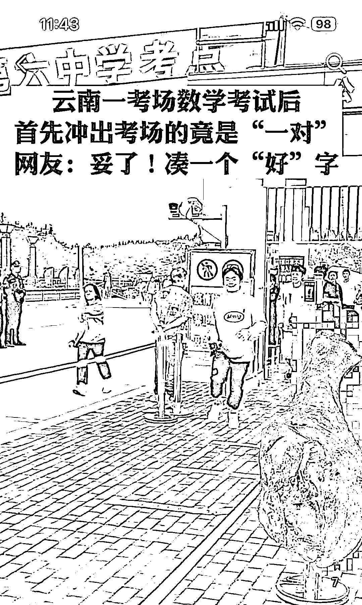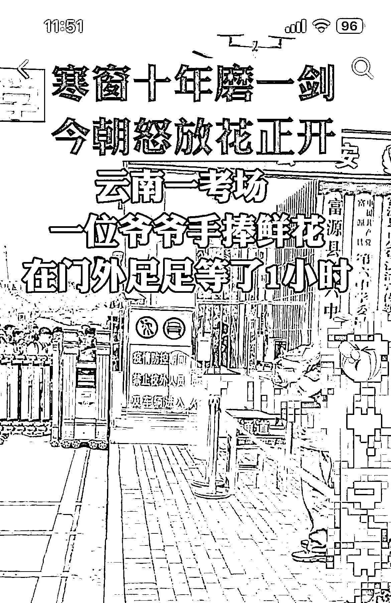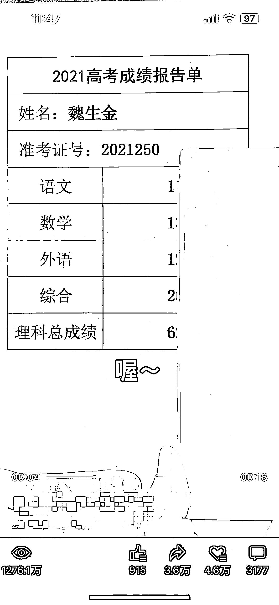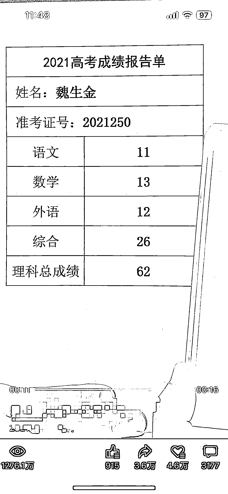

评论区：

大刘 : 豪叔牛逼~破音了

刘皇叔 : 豪叔，江湖人称：涨粉狂魔

FC : 豪叔我爱你~破音

沧海一粟 : [强][强][强]感谢豪叔的无私分享！！！

雨辰 : 还得是你，牛

小掌柜 : 666

心若向阳 : [666]

猎音狮 : 哈哈😃

# **# ****(**精华帖**)(88**赞**)**高考生查询和了解意向报考学

# 校将会用各种公域平台

作者：  安慕希姓安（大学生资*

日期：2023-05-31

高考即将来临

然而紧接着就是全国各大高校的招生阶段了

高考生查询和了解意向报考学校将会用各种公域平台

做过高校社群的都知道，以前的社群全部集中在qq群，得新生群流量者就相当于得到了能产生十几种变现得种子客户

今年抖音开始出现了报考交流群，这也就说明今年得新生公域流量很大一部分将会从抖音中引导而出，然而这个新生群是每个人都可以自己建得，排名肯定是根据活跃和算法进行排名，大一新生的变现价值我就不一个一个细讲了，有想法做高校新生流量得可以开始布局了

评论区：

小沐鱼 : 小白想请教一下，大一新生的变现方式都有哪些呢？变现价值为什么大？求指点！[抱拳][嘿哈]

小野 : 驾照，床上四件套，知识付费

小沐鱼 : 好嘞，请问驾照是怎么个操作法啊？

小野 : 和当地驾校合作，你负责引流赚佣金，他负责收学员

小沐鱼 : okok，懂了！感谢！

马虎驴 : 都是我们团队抢注册的  哈哈哈哈哈

马虎驴 : 这个排名是根据创建时间来的  目前来看和人数及活跃没有关系  不知道后面会不会变动

亦仁 : 中标，术值+1。

在上方专栏点击 #中标，可查看所有中标风向标。

# **# ****(151**赞**)**知乎目前流量很强，可以从高三即将

# 步入大学的学生这边找突破口

作者：  郭成宇

日期：2023-05-25

知乎目前流量很强，特别是想要做大学生领域的圈友。可以从高三即将步入大学的学生这边找突破口。

在知乎上撰写你的大学成长经历经验、高中生步入大学应该怎样做？有什么注意事项？

等等

给对大学认知尚浅的高三同学建立基础认知，可引流一批非常精准的准大学生流量。

现在就可以开始布局，六月高考结束需求将达到顶峰，能引流一大批准大学生流量。

图下是我的知乎账号（成宇同学），可参考我的文章逻辑。

评论区：

果冻 : 内容写的真不错[强]

郭成宇 : 哈哈哈这是两年前写的，当时还是大一[可怜]

亦仁 : 中标，术值+1。

在上方专栏点击 #中标，可查看所有中标风向标。

挽歌 : 感谢哥的分享！对我很有价值！

挽歌 : 已赞赏，请哥喝杯奶茶~

郭成宇 : 谢谢挽歌大佬，一起进步[玫瑰]

BeCa公主 : 请教大佬，请问说的流量，意思是知乎年轻的这个群体的流量更多的意思还是，这是其中的一个流量群呢？

BeCa公主 : 对于我是重要的信息，感谢分享

# **# ****(117**赞**)**抓住高考热点，用学校吸引高三家

# 长，售卖志愿书**-**卡

作者：  猎音狮

日期：2023-05-22

抓住高考热点，用学校吸引高三家长，售卖志愿书/卡！

最近我用一条素材改了两个视频，暴率很高！

快手一个视频涨粉1万➕，发到视频号，小红书也爆了！

相关素材：

5.17 HIi:/ 复制打开抖音，看看【凤凰网科技的作品】曹德旺呼吁：家长可以把子女送到我学校来！

改写后的文案：

这所学校考上就补贴5万，毕业就给安排工作家长先替孩子点赞收藏，再在评论区打上金榜题名（做数据，让家长评论，提高完播率，打字需要时间，完播有了，再说家长喜欢跟风，看别人打，自己也打，一打视频就爆了），把这个视频发给孩子。

他就是玻璃大王曹德旺先生出资100个亿创办的福耀科技大学啊，家长们可以把子女送到我学校来，我的预算是培养一个学生，他在我学校四年，我最少要借他5万块钱，我计划一年要退5亿钱下钱耀科技大学呢，定位的是理工类、研究型公立大学，培养国内新兴产业急需的研究型人才、复合型实用人才。

那么怎么样才能被录取呢？感兴趣的家长先点个关注，我们下期来具体聊聊。（放入钩子。吸引精准流量，引导关注涨粉！）

视频号上爆的，很多加长加我，问了怎么报考之类的。我就直接把填报志愿的书推荐给家长了！利润70%！https://v.douyin.com/DoPJMEW/

评论区：

马虎驴 : 这个我们抢占了将近1000所学校的抖音群。😂

猎音狮 : [强][强]

实战专家|黄校长 : 666

猎音狮 : [机智]

叉叉敌 : 厉害哦

猎音狮 : [抱拳][抱拳]

亦仁 : 中标，术值+1。

在上方专栏点击 #中标，可查看所有中标风向标。

猎音狮 : [抱拳][抱拳][耶]

# **# ****(181**赞**)**这段时间高考赛道的内容应该是最火

# 的，可以引流

作者：  拱卒

日期：2023-05-12

高考赛道，这段时间，这类内容应该是最火的，没有之一，可以引流（还有不到一个月高考）

卖资料或者后续卖高考志愿填报卡

这是虚拟电商的内容，下面来说一些实物电商的干货

实物电商（小红书无货源电商）逻辑很简单，高考还有不到一个月，涉及高考的周边产品，可以重点考虑，不知道有什么周边产品的

可以在拼多多或者淘宝搜索关键词“高考”会出现很多热门产品

至于内容，最简单的肯定是二创抖音的，升级版，肯定还是自己的原创  小红书资料引流  小红书电商

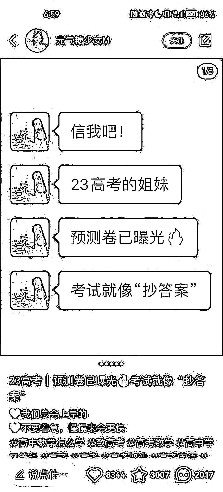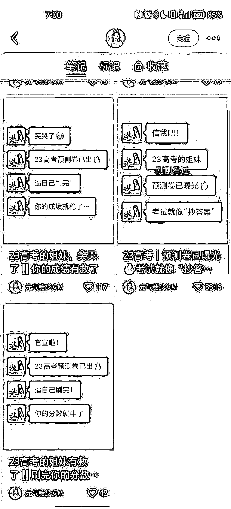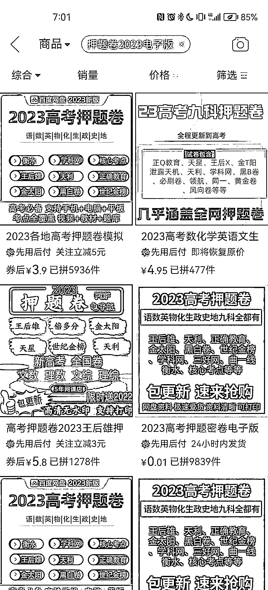

评论区：

拱卒 : 当然还有很多创意玩法

例如

1.高考结束后，互赠礼物（可以在朋友圈灌输这个思想，其实本来也有）

2.高考相册精致本

3.高考升大学的知识付费产品

4.即将进入大学的时候，需要准备的软硬件物品

等等，很多

把私域玩明白了，可以整个用户生命周期，多纬度操作

浪人 : [鼓掌]

拱卒 : 冲

亦仁 : 中标，术值+1。

在上方专栏点击 #中标，可查看所有中标风向标。

周彦充 : 高考指数开始飙升

拱卒 : 对

闫君 : 总觉得高考是影响一个人一辈子的事，咱不专业就别误导孩子了。尤其是看到那

个什么信我吧的文案，这种人真的。。。。。

Liu : 赞同

# **# ****(140**赞**)**抖音卖衡水中学学霸笔记资料，再深

# 耕用户做高客单

作者：  随想

日期：2023-05-10

卖衡水中学学霸笔记资料，再深耕用户做高客单

【推荐理由】

1.天然流量品，引流、变现效率高；案例集合-》完美的高客单商业项目雏形；

1.1 衡水中学，是全国有名的中学，美誉度高

1.2 可以引流到微信，也可以直接卖抖音“精选联盟”的《衡水重点中学学霸笔记》  1.3 这些案例综合起来看：“引流、基本业务、衍生业务、高客单业务”，就是一个. 非常好的商业闭环项目雏形

2.赛道好，长久可以做

2.1 每年都可以做，不愁没生意

2.2 衍生品类多：除了学霸笔记，吸引到中学家长后，亦可以卖其他的  学霸笔记、  英语学习、教辅类书籍

2.3 光卖资料变现的话，单账号月收益从几千-3万。如果视频爆单、图文爆单后，  收益会更高；可以买实物笔记，自己进行实拍，做多账号矩阵，扩大收益

3.可延伸的高客单项目很多【这是核心发财点】

3.1 高考志愿咨询/职业生涯规划

3.2 咨询基本要几百元起步，甚至一些城市一些高级别咨询师达到了数万元。月收  益：几万至几十万元不等，最高达到 90 万。可以为咨询者引流。

3.3 学生心理健康教育

很多学生都有厌学抑郁情况，很多学校都配备一到两位的心理教师。预约心理

咨询的家长非常多，她们已经超负荷工作！

当遇到心理情况比较严重，超出心理教师的能力，会被建议到校外寻找专业的

心理医生。去了医院心理科，住院半个月，花费需要一万多。可以为心理咨询

师们引流，或者合作打造心理咨询交付SOP。

3.4 卖高考志愿填报卡

几十块钱成本，300-1000元的售价

3.5 卖出国留学项目、暑期两周研学项目

**4. ** 小白、宝妈都能做

欢迎评论、留言，大家一块探讨

由于排版格式，具体详情和实操请见：

https://mtm8eqhtaa.feishu.cn/docx/Ov5EdM0p1orLGJxo300cSRpundc?from=from_copylink

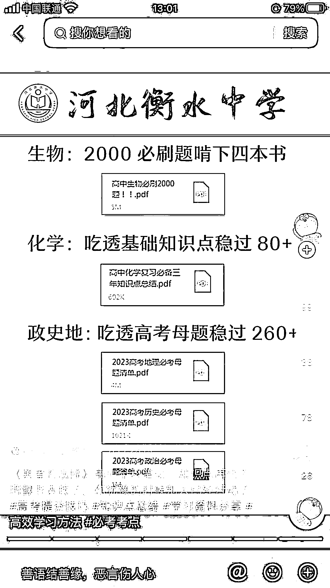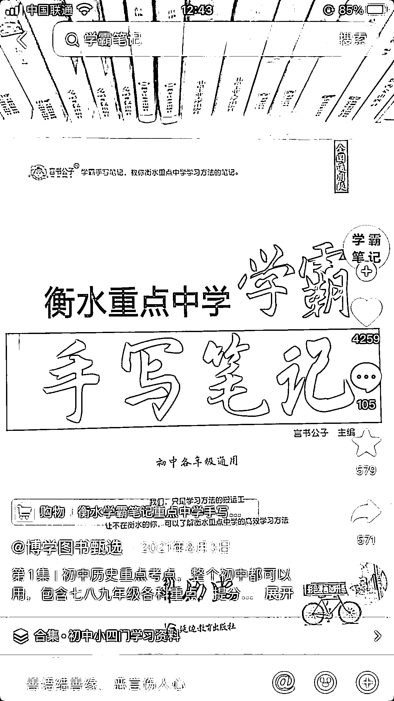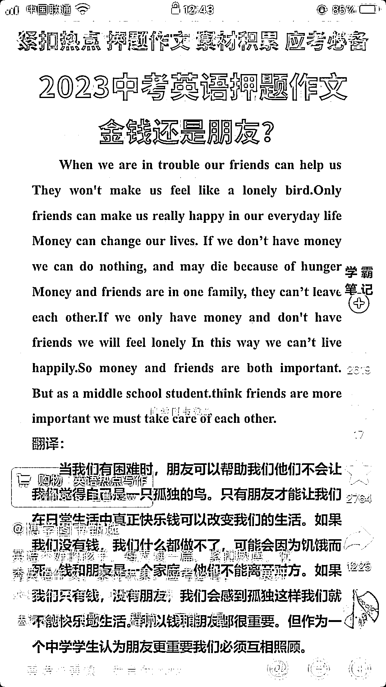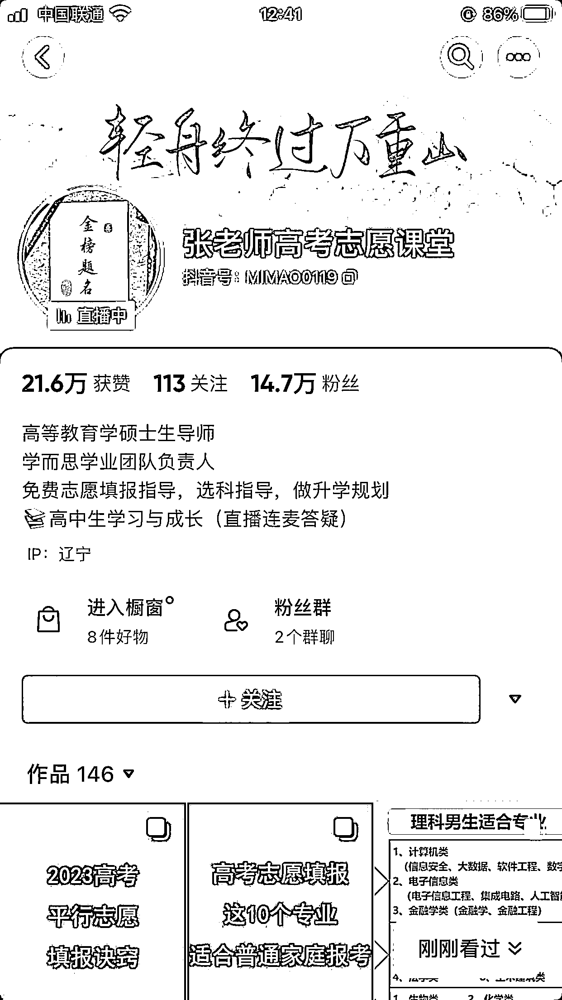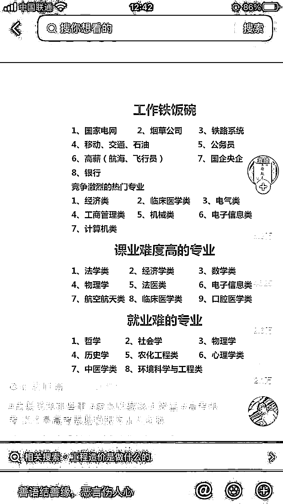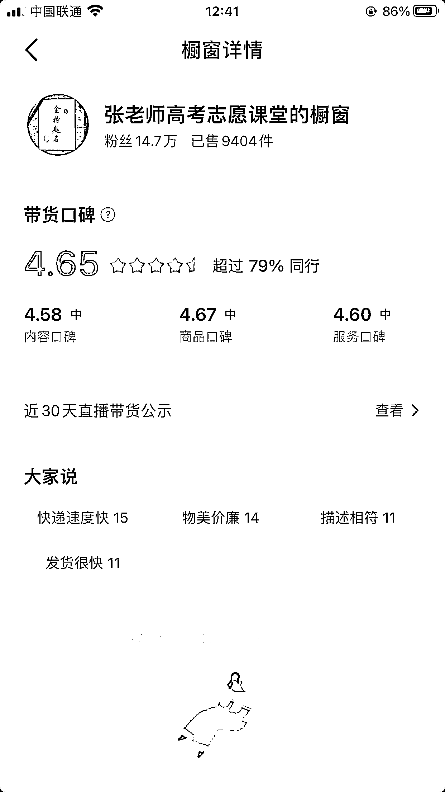

评论区：

亦仁 : 中标，术值+1。

在上方专栏点击 #中标，可查看所有中标风向标。

咔咔〖私人号〗 : 请问  这个会有版权风险吗？有规避的办法吗？

随想 : 笔记类，大多是自己整理的，目前没听说有版权问题

四方小慢慢 : 拼多多买的都带水印，咱们需要去水印么

# **# ****(123**赞**)**就要高考了，做玄学的可以卖高考专

# 用符等周边产品变现

作者：  员外

日期：2023-05-10

还有两个多月就要高考了，这个号卖香锦囊+定制祈福品4.2开始发的作品，到现在已经卖了700多件了

还可以推展一下思路，做玄学的卖高考专用符等周边产品变现

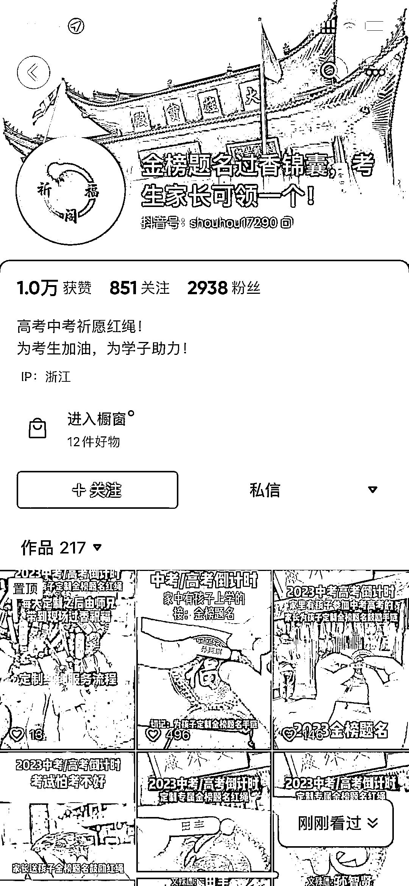

评论区：

辛禾 : 抖音上贼多抠图的，正能量，求财求健康求金榜题名，许多人真爱看  张热烈啊 : 我觉得视频号可以整，毕竟视频号的人群都是四五十岁的

员外 : 可以可以  一鱼多吃

张热烈啊 : 这个有渠道吗？可以搞一下

员外 : 拼多多应该全是，渠道好说  先发作品测下流量

亦仁 : 中标，术值+1。

在上方专栏点击 #中标，可查看所有中标风向标。

顺了个达 : 挺好的，就是有几个小疑问有没有大佬给指点指点: 如果自己没有加工厂，收了单子拼多多做好了发过来然后再去寺庙祈福，最后再发到客户手上，这个周期会不会太长了？有没有更快捷的方式哇？

员外 : 那有没有可能是，你直接买到祈福好的商品呢[偷笑]或者dy找小店分销，其实这种也不是特别蓝海，做的很多，只要你拼多多  淘宝  抖音  搜一搜都能找的到，重点是  先搞流量[呲牙]

# **# ****(74**赞**)**高考季视频号直播可以借鉴张琦矩阵的

# 玩法

作者：  少儿探索科学实验室

日期：2023-05-10

高考季，这种不出镜直播，值得玩起来，可以借鉴张琦矩阵的玩法，做矩阵，拉时长，视频号直播，主要是中年为主，这群人有消费能力，正好是高考家长的客户群体，大家看下这个，早上场观就8000多了，可以带教辅，带志愿填报卡等，还可以引导到私域，做志愿填报指导，职业分析规划……

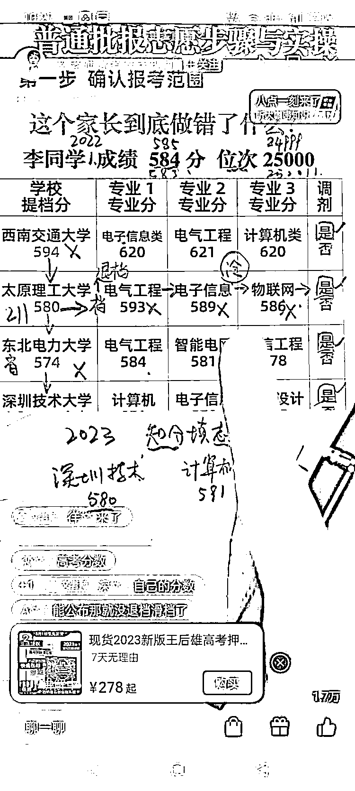

评论区：

亦仁 : 中标，术值+1。

在上方专栏点击 #中标，可查看所有中标风向标。

# **# ****(33**赞**)**出一个报考学校的思维导图，可以引

# 流，也可以付费阅读

作者：  灯火阑珊

日期：2023-03-31

中考，高考，马上开始了，好多家长不知道孩子该上什么学校，如果有人出一个报考学校的思维导图，让家长一目了然应该不错，可以引流，也可以付费阅读

评论区：

老杨 : 抖音有类似的直播教怎么报考

晴天哥哥 : 信息差永远存在，可以从抖音搬到其他平台

亦仁 : 中标，术值+1。

在上方 #星球栏目  专栏中，点击 #中标，可查看所有中标风向标。

# **# ****(50**赞**)**针对要中考、高考学生定制营养食谱课

# 程

作者：  石头

日期：2023-03-08

（少儿探索科学实验室共创  风向标）

缘起：家中老大要备考中考，又要减肥，很矛盾（需求）

万事不决问ChatGPT:给出图1、图2的答案，一看感觉还挺靠谱，可以媲美相当一部分所谓的营养师了；

联想需求：马上中考季，多数家庭应该都会面临这个问题，哪怕不减肥，但是如何让孩子吃的健康，有营养？

客户群体:不管是中考学生、还是高考学生，都是家中眼中的宝贝疙瘩，都是极大的痛点，急需，刚需，市场巨大，只选贵的，不选对的；

产品：

1.定制食谱；（ps：这块也可以发散一下和一些健身俱乐部结合，给他们提供营养食谱，省下一个营养师的工资）

2.针对要中考、高考学生的营养食谱课程，直接在线陪跑，付费社群；见图3 3.针对高净值人群，甚至可以1v1来指导；

变现渠道：

1.抖音、快手、视频号直播引流，打赏一杯奶茶的钱，可以定制一份食谱；主要针对家长人群；

2.小红书引流，提供营养食谱  主要针对有营养餐需求的年轻群体；

3.前期通过社群引流的家长社群，人群比较精准，可以根据相关筛选，来做二次客户开发，比如  高考志愿填报  高一辅导班，教辅材料售卖，以及大学生相关产品。

 

评论区：

亦仁 : 中标，术值+1。

在上方 #星球栏目  专栏中，点击 #中标，可查看所有中标风向标。

希声 : 很有意思的切入点

# **# ****(13**赞**)**各大平台开始做高考相关的流量，及周

# 边产品

作者：  好六

日期：2023-02-27

距离高考的时间很短了，不管是抖音还是其他平台也都开始给高考相关的流量了，高考志愿填报、混剪鸡血视频赚平台分成、快递聚合平台邮寄大包裹、引流卖资料等等，尽快开始布局吧

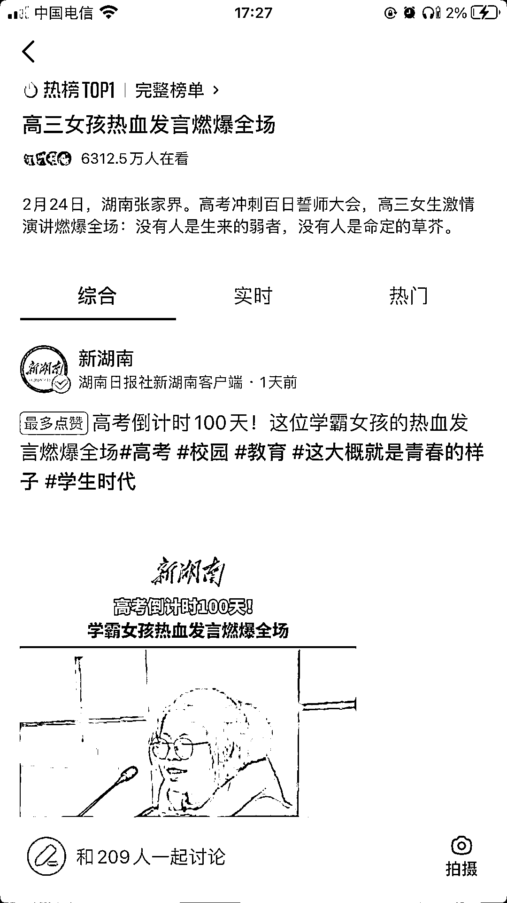

评论区：

亦仁 : 中标，术值+1。

在上方 #星球栏目  专栏中，点击 #中标，可查看所有中标风向标。

# **# ****(11**赞**)**抖音很多北京大学在读学生介绍学习方

# 法，橱窗售卖状元笔记之类的学习相关产品

作者：  今日AI

日期：2021-07-07

最近刷抖音有点多，生财有术看多了，难免什么都往赚钱方向上想。

刷到什么内容呢？

由于近期中考、高考以及小孩期末考，我搜索学习方面的东西多了点，尤其是这两天重点在搜索英语如何学习、如何背单词。

好家伙，一刷抖音推荐给我的有一大半是这方面的，在这里我发现一个现象：

有很多北京大学在读学生正在介绍他们的学习方法，他们的自我介绍都很牛的，都是学霸，橱窗里卖的一般是状元笔记之类的学习相关产品，个别还有志愿填报服务。此外，这些号里感觉内容相似度很高，不知是否可以大胆猜测有机构去北大签约一帮人过来，统一培训后大批量帐号操作。

对抖音有研究，又有资金的朋友我觉得可以考虑找清北的学生试试。

评论区：

Hope : 每年卖学霸笔记的还是比较多

亦仁 : 中标，术值 +1。

点击最上方 #中标  专栏，可查看所有中标风向标。

戴巍 : 学霸笔记不赚钱，还会附带销售直播网课的小课包

东向 : 矩阵操作的

# **# ****(7**赞**)**小语种高考今年火了，老师需求很大

作者：  武康慧

日期：2021-06-28

小语种高考今年火了，有很多家庭至今还不知道，目前很多高中都设立小语种学习，例如俄语，日语等等，老师需求很大

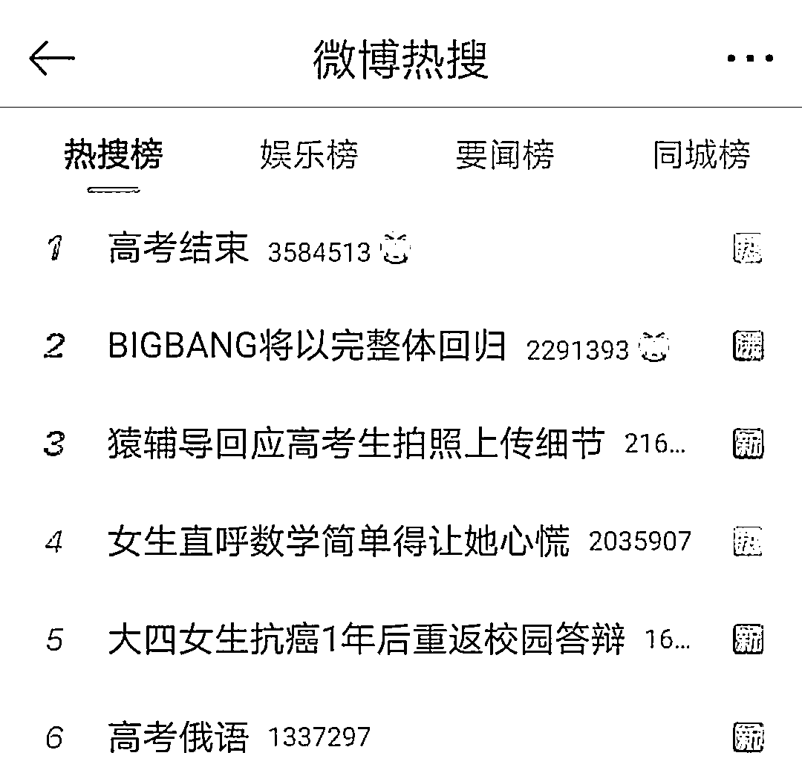

评论区：

亦仁 : 中标。

点击最上方 #中标  专栏，可查看所有中标风向标。

武康慧 : 感谢😊

# **# ****(9**赞**)**一个工具搞定高考志愿填报

作者： KK

日期：2021-06-28

一个工具搞定高考志愿填报！

夸克浏览器里边的夸克高考，从分数线，院校，专业，招生政策，性格等多个维度为学生填报志愿提供指南！

适合引流，咨询付费！

评论区：

亦仁 : 中标。

点击最上方 #中标  专栏，可查看所有中标风向标。

# **# ****(7**赞**)**爱山东、支付宝高考成绩查询通道

作者：  欣诶

日期：2021-06-16

爱山东、支付宝高考成绩查询通道

山东是高考大省，今年55万考生成绩可以在“爱山东”APP及支付宝程序查询。

上支付宝搜“高考”可进入掌上高考专区。除查询成绩，还有查大学、查专业、智能选大学、模拟报志愿等功能，可提前了解院校、规划志愿填报。

评论区：

几句 : [强]

亦仁 : 中标。

点击最上方 #中标  专栏，可查看所有中标风向标。

# **# ****(9**赞**)**小程序「高考**U**选」，助力志愿填报智能

# 化

作者：  奇点

日期：2021-06-11

小程序「高考U选」，助力志愿填报智能化。

评论区：

一盘唐僧肉 : [强]

亦仁 : 中标。

点击帖中中标标签，可查看所有中标风向标。

或在置顶帖中，点击#中标  标签可直达

# **# ****(6**赞**)**高考说专业是一个大热点，视频号、抖

# 音等都可以实现涨粉变现

作者：  南天

日期：2021-06-10

高考说专业在刚考完这几天是一个大热点，视频号、抖音等都可以做，实现涨粉变现。

评论区：

千钟 : [强]

寒竹 : [强]

亦仁 : 中标。

点击帖中中标标签，可查看所有中标风向标。

或在置顶帖中，点击#中标  标签可直达

# **# ****(9**赞**)**高考后联系学霸学神和家长，做暑假补

# 习服务

作者：  尺走

日期：2021-06-10

高考后，做中间人，联系学霸学神和家长，做暑假补习服务。

拿到学霸们和老师的微信号，之后学霸上大学了，通过学霸链接到大学生群体，继续放大，做大学生群体副业。

评论区：

千钟 : [强]

寒竹 : [强]

亦仁 : 中标。

点击帖中中标标签，可查看所有中标风向标。

或在置顶帖中，点击#中标  标签可直达

# **# ****(7**赞**)**在高考考场门口送带二维码的小扇子，

# 巨大的广告效应

作者： Gao

日期：2021-06-08

天热，高考考场门口，送的小扇子，陪考的人均一把以上，扇面放二维码，大家陪考结束也都会带走，巨大的广告效应。

评论区：

鱼的记忆🐠 : 要得

亦仁 : 中标。

点击帖中中标标签，可查看所有中标风向标。

或在置顶帖中，点击#中标  标签可直达

# **# ****(4**赞**)**高考热点，一切行业都可以蹭热点

作者：  懒

日期：2021-06-07

高考，热点，一切行业都可以蹭热点，跨行业，营销，例如蒙牛牛奶，包装加上高考试题，买牛奶的是家长，同质化产品，一定选蒙牛。同理可以延伸中考，小升初，还有食品行业包装。举一反三，食品+养生健康，医院医疗常识性问题科普。还有邮政银行，做奶茶，实力境界压制，邮政八万的营业网点，如果起步一万家店，😂就比最大的蜜雪冰城店多。你永远不知道你的竞争对手是谁。一切行业都可以跨界。

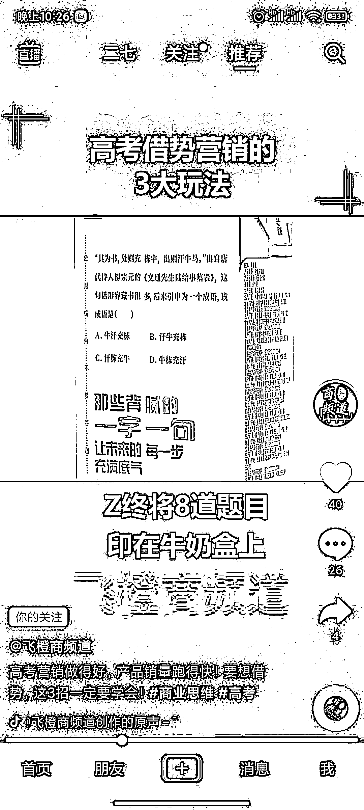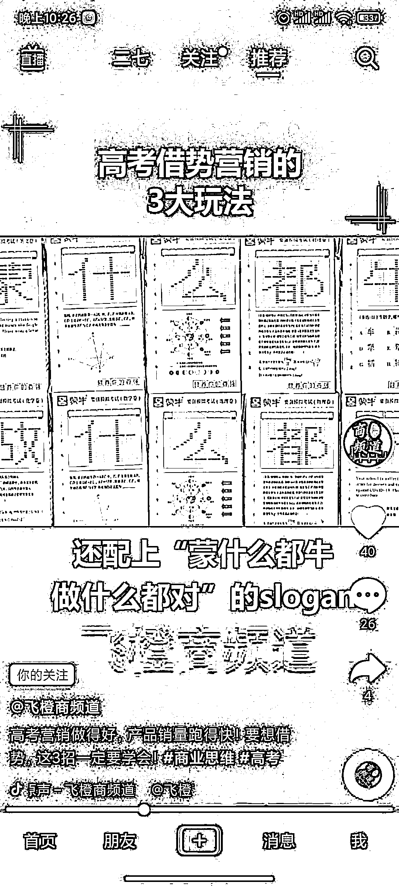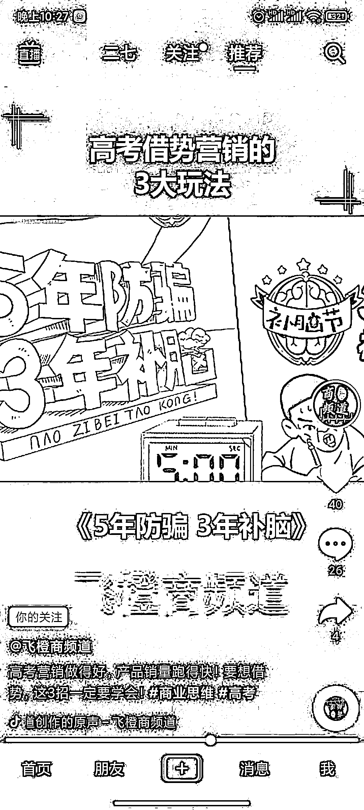

评论区：

寒竹 : [强]

千钟 : [强]

亦仁 : 中标。

点击帖中中标标签，可查看所有中标风向标。

或在置顶帖中，点击#中标  标签可直达

# **# ****(5**赞**)**可以在考场门口向家长推送高考志愿资

# 料，为微信号或者公众号做引流

作者：  星月在xyz

日期：2021-06-07

最近高考，可以在考场门口向家长推送高考志愿资料，为自己的微信号或者公众号做引流。（其他社群也可以）

高考志愿资料各大网站都有，很容易搜索的到。

Ps:要小心城管人员，建议在考试期间只向家长发，考试完了之后就不要发了，避免考生分心。

评论区：

一盘唐僧肉 : [强]

亦仁 : 中标。

点击帖中中标标签，可查看所有中标风向标。

或在置顶帖中，点击#中标  标签可直达

星月在xyz : 感谢亦仁大大，我会继续加油的💪

# **# ****(6**赞**)**高考的流量，在各个应用、自媒体所有

# 行业均可以试用

作者：  懒

日期：2021-06-07

高考  ，这个流量，各个应用  自媒体所有行业均可以试用，例如高德地图  加油💪，短视频的详细解说，公众号的历年回顾，延伸可以做抽奖，评论有礼，可以引流到微信，后续，高考完，学生的假期，业务延伸驾照，旅游，毕业照，聚餐饭店行业，也可以做高考志愿指引，对接互联网资源。

评论区：

懒 :

格律塔林·大梦 : [强]

亦仁 : 中标。

点击帖中中标标签，可查看所有中标风向标。

或在置顶帖中，点击#中标  标签可直达

懒 : 感谢

# **# ****(11**赞**)**高考结束存在的隐形机会

作者：  微观保险

日期：2021-06-07

高考结束会干嘛？存在那些隐形机会？

**1. ** 填报自愿辅导

**2. ** 性格与职业匹配测试问卷

**3. ** 经典，小说（明朝哪些事？如何读大学.）

**4. ** 抖音复制如上内容讲解？或者截流

**5. ** 所属地区的大学校园入学指南，了解？

**6. ** 根据上述获取的用户，付费指导精进指导？入学快递直邮？大学生入学必备用品（杯子，被子，盆等一系列套餐）

**7. ** 旅游指导，特价游，全家游，校园游，同学游？

评论区：

格律塔林·大梦 : [强]

亦仁 : 中标。

点击帖中中标标签，可查看所有中标风向标。

或在置顶帖中，点击#中标  标签可直达

# **# ****(13**赞**)**高考可以在学校门口面向家长，设置海

# 报加好友拉群免费提供志愿指南

作者： System

日期：2021-06-04

高考，学校门口有很多家长在等待孩子出来，设置海报加好友拉群免费提供志愿指南，其实夸克浏览器已经准备好了。

评论区：

一盘唐僧肉 : [强]

亦仁 : 中标。

点击帖中中标标签，可查看所有中标风向标。

或在置顶帖中，点击#中标  标签可直达

Gao : 越来越多拉群的

铃铛 : 夸克最近跑信息流广告跑疯了

# **# ****(5**赞**)**江苏阿姨设计中国风高考锦鲤旗袍，寓

# 意孩子考上重点大学

作者：  孤月大叔

日期：2021-06-03

江苏阿姨设计中国风高考锦鲤旗袍，“旗开得胜、鱼跃龙门、金榜（膀）题名，还有开门红。”下单后孩子考上重点大学的，还能得到100到300元不等的礼金。“

评论区：

一盘唐僧肉 : [强]

亦仁 : 中标。

点击帖中中标标签，可查看所有中标风向标。

或在置顶帖中，点击#中标  标签可直达

# **# ****(7**赞**)**高考会有一大批家长陪考，可以搭帐篷

# 给家长们休息，拉新引流

作者：  大魔王

日期：2021-06-01

马上要高考啦！

会有一大批家长陪考，可以搭帐篷给家长们休息，然后拉新，引流。送水呀，或者绿豆汤之类的

评论区：

一盘唐僧肉 : [强]

亦仁 : 中标。

点击帖中中标标签，可查看所有中标风向标。

或在置顶帖中，点击#中标  标签可直达

# **# ****(7**赞**)**高考可以提前找各学校学霸预约学习笔

# 记售卖低年级学生

作者：  尺走

日期：2021-05-31

高考临近，可以提前去找各学校学霸预约学霸学神的学习笔记，在考完后复印或售卖给高二，高一学生。

评论区：

一盘唐僧肉 : [强]

亦仁 : 中标。

点击帖中中标标签，可查看所有中标风向标。

或在置顶帖中，点击#中标  标签可直达

# **# ****(6**赞**)**高考祝福礼盒

作者：  陈姐

日期：2021-05-31

高考祝福礼盒

评论区：

一盘唐僧肉 : [强]

亦仁 : 中标。

点击帖中中标标签，可查看所有中标风向标。

或在置顶帖中，点击#中标  标签可直达

刚刚

# 【异常值洞察】**7**篇

# **# ****(12**赞**)AI**写高考文章，测试流量主广告效果，

# 是否会豹纹

作者：  周彦充

日期：2023-06-05

高考爆了，已高考为题用ai写一篇文章，加上流量主广告测试下，是否会豹纹。

评论区：

周彦充 : 结果没有爆，20多的阅读量，文章已删。哈哈

# **# ****(11**赞**)**高考期间搜索量上涨，成为热点关注的

# 风向标

作者：  天二

日期：2023-06-05

高考了，搜索量也在增加

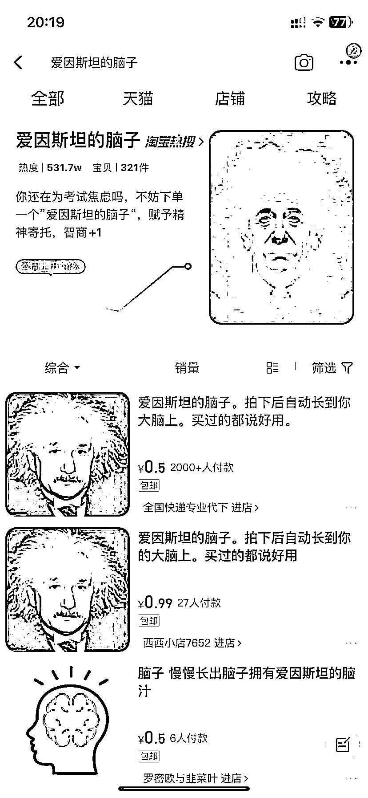

评论区：

成果 : 西方有一句非常著名的营销的经典的话是这么说的：“客户买的不是种子而是草坪”。就你看起来卖的是种子，但是对于客户来讲，他想要的是草坪。

# **# ****(6**赞**)**高考市场具有增量潜力

作者：  西柚

日期：2023-06-02

高考是个增量市场

评论区：

暂无评论

# **# ****(13**赞**)**每年中高考相关产品，从**4**月份增长趋

# 势迅猛

作者：  章果老

日期：2023-05-19

每年中高考相关产品，从4月份增长趋势迅猛，相关考试套装能迅速起飞。做电商选品很重要，顺势而为更重要，尤其是当下流量红利不再的电商平台。

评论区：

林仙森- : 这个是什么平台

# **# ****(106**赞**)**高考志愿填报微信指数不断上升

作者：  热心网友大表哥

日期：2023-04-18

高考志愿填报

评论区：

张友胜 : 低频市场，一年就一次，坑已踩过[微笑]

热心网友大表哥 : 诚挚邀请你开贴细说！

小辰在路上 : 没懂🤔

热心网友大表哥 : 卖相关服务

枫宇翔 : 一年就这一次。大批卖志愿卡的这个时候最活跃[闭嘴]

热心网友大表哥 : 是的

亦仁 : 中标，术值+1。

在上方专栏点击 #中标，可查看所有中标风向标。

Unbrick : 可以延伸搞生涯规划课程，还是很赚钱的

# **# ****(59**赞**)**资料引流、虚拟产品频率较高的词和行

# 业

作者：  沐文

日期：2023-03-31

做资料引流、虚拟产品的注意，最近遇到的几个频率较高的几个词和行业：

1、大学生创新创业大赛（特别是代写PPT\策划书）

2、教师资格证2023上（资料需求：2022下教资证真题、笔记）

3、高考冲刺、高考押题（网课押题、讲义）

评论区：

亦仁 : 中标，术值+1。

在上方 #星球栏目  专栏中，点击 #中标，可查看所有中标风向标。

封伟-自动化变现 : 很多人认为虚拟资源是一个变现类目，实际在不同的细分领域，对应的性质和人群截然不同

变现空间：以大学生创新创业大赛为例

每年高校每个专业，学校，学校，城市，全国都有比赛，学生没有好项目和经验，老师不懂接地气的打法很多时候也拿不出好的指导项目，学校有任务，需要拿奖，很多市面上的项目拿到比赛里很有优势，特别是有阶段成果的

学院和学校有固定预算至少上万，进入市级比赛，奖金更高

商机：

代写策划案，ppt，参赛辅导，资质素材提供等

特别是参赛辅导，资质素材提供，很多参赛团队根本不具备

有这块的账号其实资料是搬运的，由于ip打造得看似专业，让人感觉是专业的指导老师，活得轻松滋润

变现手段：

卖资料：历届比赛获奖资料，如挑战杯等，和公文变现一个模式

卖服务：资料背后的服务，辅导，咨询，资质素材等

细分服务：版权软著快速注册，小程序上线，运营数据报表，财报等，帮助参赛项目润色提分

如果你要来做这个项目，会怎么做？

全国高校数量3013所，服务得好，每年都有这块的需求

流量：

SEO：自媒体平台针对长尾词矩阵号内容分享，

矩阵号：从案例点评的角度分享，提高价值，导流私域

裂变：结合分销系统，学生群体传播

产品：

资料：类似公文变现的打法，更新的历史资料，结合分销代理跑量

参赛服务：链接创业协会等，对接创业团队标准版：突围训练营（案例拆解策划指导咨询），升级版：创业赛陪跑服务，包括上面涉及的细分服务

结合自身资源，线上线下可操作空间灵活

# **# ****(19**赞**)**高考季的直播很吃香

作者：  宏

日期：2023-03-27

高考季，现在做这一块的直播很吃香，内容可以是咨询类，院校介绍，专业咨询等，也符合平台方向，大场观相对比较容易

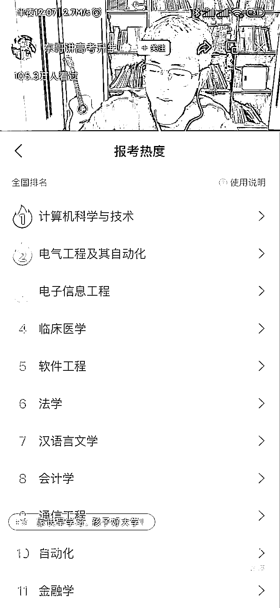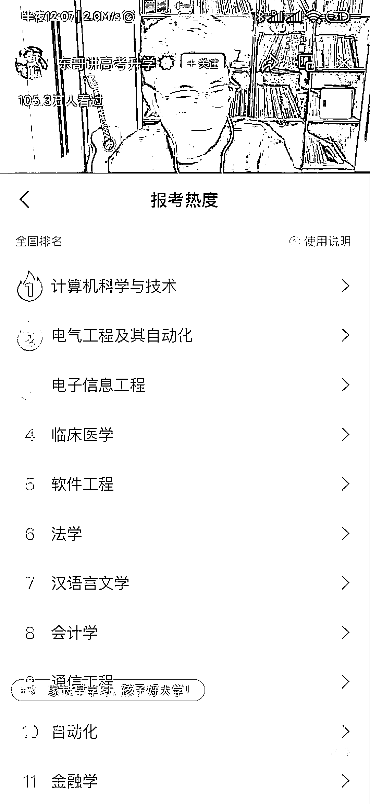

评论区：

亦仁 : 中标，术值+1。

在上方专栏点击 #中标，可查看所有中标风向标。

# 【思路分享】**39**篇

# **# ****(17**赞**)**抖音报考群规则和玩法，引流变现不容

# 错过

作者：  马虎驴

日期：2023-06-06

《抖音报考群的大致规则和玩法》

一、大致规则

①创建规则

这个是昨天下午四点整调整的，每个账号每个学校只能创建两个群聊，每个账号可以创建5个学校也就是10个群以后就会进入冷却(冷却时间1～3天)

②加群规则

每个账号每天只能加10个群聊，第11个之后就会提前加群失败，需要第二天才可以继续添加

③排名规则

完全按照时间顺序来的，【同一个账号某个学校同时创建几个，就会导致最后创建的那个靠前】，其他账号创建的都在这个之后【而且有且只有一个群聊在推荐位】

④其他规则

a抖音报考群上限100人

b加入某个群聊之后，这个群聊会置顶，也就是在推荐位

c每天不定时清理某些学校的所有群【每天一次，清理哪些学校也不清楚，有的一直没被清理过，有的被清理过3次了[撇嘴]】

⑤大致人群

目前还是家长和一些本校的学生为主，根据之前QQ群经验，预测高考新生季的流量和人群

a.大致三个高峰期，高考后出成绩和录取后

b.三个不同时期的人群，目前家长比较多，等出成绩后，也就是报考的时候，会有家长和高考考生各一部分，也会有部分热心学长学姐解疑答惑，录取后进入的几乎都是精准的准新生

c.QQ群我们单校最高记录一天净加760人【仅通过QQ群排名的流量】抖音这波应该不会比QQ低(抖音也在弄志愿填报和高校渠道)

二、大致玩法

大家对于抖音很少聊天，这一块的用户习惯很差。所以我们更好的是直接引流的QQ和微信【抖音群→QQ/微信  跳转链接，家长引流的微信(几乎都不用QQ）(学生引流QQ，QQ更方便管理，而且QQ可以结合QQ群优化和QQ频道来做】

重点！！！

重点！！！

重点！！！

抖音群虽然只有100上限，但是我们可以一直踢人，保证我们的群聊一直在推荐位！！！

三、变现方法

家长:主要做高考志愿填报，另外对于床品等也都可以的。

学生:新生床品、校园电话卡、本地吃喝玩乐...另外可以和本校学生团队对接等。

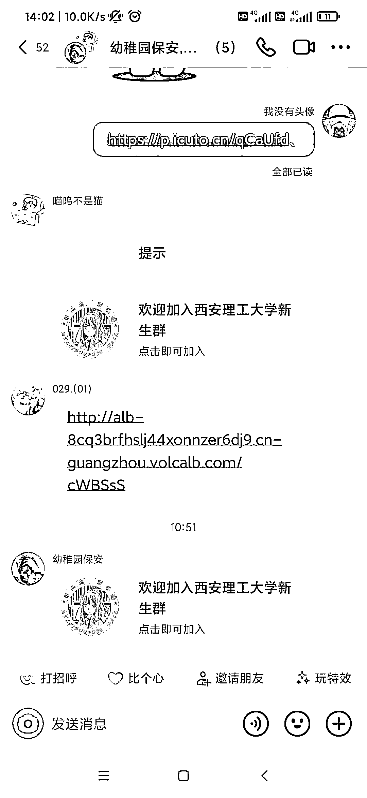

评论区：

马虎驴 : 把最重要的给忘了

抖音群虽然只有100上限，但是我们可以一直踢人，保证我们的群聊一直在推荐位！！！

# **# ****(10**赞**)**高考热点视频直播效果好，可延展至志

# 愿填报和大一新生准备

作者：  张老师

日期：2023-06-06

针对于高考的祝福特效视频，直播效果很好，跟着高考这个大热点去做视频或者直播，包括可以延展到后面的高考志愿填报，大一新生的准备，提前做好捆绑工作，

评论区：

暂无评论

# **# ****(14**赞**)**利用高考季节吸引流量，同时布局大一

# 入学准备文章

作者：  白宝香

日期：2023-06-06

高考季，公众号小红书都可以发一些高考相关的知识，文章等，吸引流量

还有后续大一入学需要准备什么物品资料这些文章也可以开始布局

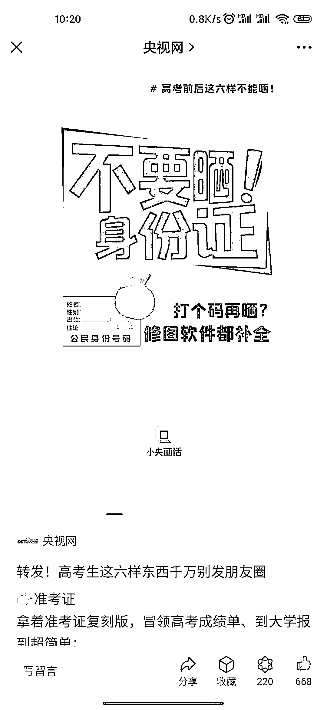

评论区：

暂无评论

# **# ****(10**赞**)**高考、中考临近，小红书上押题题材引

# 流效果不错

作者：  阿迪

日期：2023-06-05

临近高考、中考，押题题材也热起来，引流效果不错，小红书上热门贴不少。

评论区：

夏林 : 需要相关资质，不然笔记会被禁

MR.王 : 就是啊，每次发出来小眼睛一冲就被违规。无解的感觉

夏林 : 办一个教育咨询相关的营业执照就可以了

MR.王 : 谢谢，就是要600米么

阿迪 : 感谢提醒[强]

# **# ****(15**赞**)**高考期间销量飙升，张雪峰的《选择比

# 努力更重要》成热门选择

作者：  十巷

日期：2023-06-05

这两天高考，从这两天开始发布高考相关的，然后对接志愿相关咨询，或者复读等，最简单的就是挂张雪峰的书《选择比努力更重要》，他名气可以，这两天销量可好评论区：

暂无评论

# **# ****(10**赞**)**历年高考选择题答案分布规律，多种变

# 现方式等你来玩

作者：  小二

日期：2023-06-05

寻找历年高考选择题答案分布规律，写图文发布，考前会有很多抱佛脚的流量，这个账号6月2号开始发文3天涨粉2k+，等高考完，志愿填报、驾校、大学资料、新生被子、校园卡等等，各种变现方式都可以玩

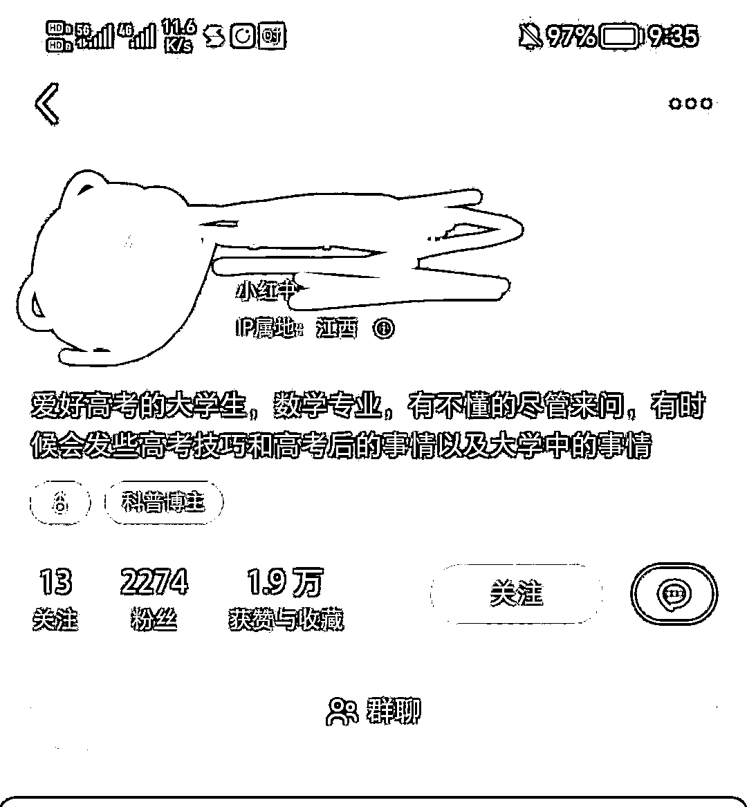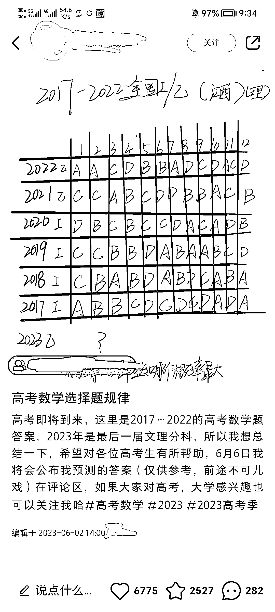

评论区：

暂无评论

# **# ****(9**赞**)**抖音高校报考咨询群拓展：寻找高职类

# 院校，引流创业粉的不错选择

作者：  糊涂月²

日期：2023-06-05

在此基础上，抖音高校报考咨询群风向标拓展

在高校库里，直接寻找高职类院校，这些学校学生创业意愿强烈，引流创业粉也是个不错的选择~

https://gaokao.chsi.com.cn/sch/search.do?searchType=1&ssdm=&yxls=loc&xlcc=gzzk&zgsx=&zgsx=&yxjbz=

评论区：

暂无评论

# **# ****(15**赞**)**高考志愿填报咨询服务：盖洛普测评赋

# 能，增加成交量

作者：  大进

日期：2023-06-05

高考完过后，咨询服务里高考志愿填报是一个热门项目，可以用盖洛普赋能填报咨询业务，通过测评解读报告，了解自身优势适合的职业，根据职业选专业，根据专业再去填报学校！从孩子自身出发，很多家长会更愿意购买服务！增加成交量！

评论区：

暂无评论

# **# ****(14**赞**)**高考毕业季，班级**MV**制作需求增加

作者：  亦行

日期：2023-06-05

高考来临，毕业季，帮班级剪辑毕业MV视频。

评论区：

暂无评论

# **# ****(13**赞**)**中、高考祝福商品，打糕、花、糕点、

# 包子粽子，商机多多

作者：  半峰

日期：2023-06-05

马上高考了，接着就是中考，两个非常重要的考试，也是所有考生父母都重视的，围绕中、高考可以衍生出祝福商品

我家在延边朝鲜族自治州

我们本地朝鲜族就是在考试这几天在考场学校外放一个板子，上面用来放打糕的，考生家长把打打糕粘板子上写上祝福语，寓意打高分，高中。

同理，看圈友也有发9.85卖花的，寓意985的

圈友  提出可以卖特色糕点，寓意“高中状元”

教练  提出也可以卖包子+粽子，寓意“包中”

通过谐音梗会发现很多种有寓意的组合，也是个商机

评论区：

暂无评论

# **# ****(9**赞**)B**站**UP**主利用**AI**预测**2022**年高考作文

# 题，可广告合作与教育机构合作，具体玩法揭秘

作者： melisa

日期：2023-06-05

B站UP主“图灵的猫”发布了一则关于 AI预测2022年高考作文题，利用chatgpt API接口实现，这玩法可以通过作文题预测+范文引流，可以广告合作，与教育机构合作，可以开发应用，给考生或家长使用。

具体玩法在：https://www.sohu.com/a/553114819_121124286

 

评论区：

暂无评论

# **# ****(24**赞**)**高考卖花，不同节日相同玩法

作者：  王恰恰

日期：2023-06-02

高考卖花，不同节日相同玩法

评论区：

暂无评论

# **# ****(15**赞**)**毕业季和**6.18**到来，学校周边二手书和

# 笔记收购是挣钱好路子

作者：  泉州百度营销顺

日期：2023-06-02

6.18和毕业季的到来，可以学校周边收购一批二手书，优秀笔记等等，等高考一结束，又是一个挣钱好路子

评论区：

黄豆 : 顺哥开始行动了吗

# **# ****(11**赞**)**用**ChatGPT**做高考题蹭热度，还能够利

# 用高考热点结合**chat**做一些复习资料等项目

作者：  闲米

日期：2023-06-01

用chat做高考题蹭热度，还能够利用高考热点结合chat做一些复习资料、学霸笔记、志愿填报推荐等等项目

评论区：

暂无评论

# **# ****(13**赞**)**对于黑龙江省外，尤其高考大省，也许

# 是提前选择布局的一个机会

作者：  粉条Annie

日期：2023-06-01

距离高考不到一个周的时间，也就是这两天，黑龙江省出了落户新政，全省所有城区（镇）取消落户限制，在黑龙江省内有经常居住的需求即可落户。

对于黑龙江省内非哈尔滨户口，落户哈尔滨更容易了。对于黑龙江省外，尤其高考大省，也许是提前选择布局的一个机会，而且这个机会比以往更容易实现，要知道去年黑龙江二本分数线308分，同样四五百分，有些省份上大专甚至上不了大专，在黑龙江甚至是一本线。

评论区：

粉条Annie : 这条不中标也没关系，主要是最快半年内，可能会操作这个事情

# **# ****(14**赞**)**高考摆摊新项目：在校门口卖花束，价

# 格与学校联系起来

作者： lily fu🌟符

日期：2023-06-01

高考来临，摆摊项目多一个：在校门口卖花束，而且把价格和学校联系起来。

985、211，在清一色的花摊里就特别了起来，毕竟，大人小孩都想图个吉利[强] 思路一换，眼界大开

评论区：

静明 : 真棒

# **# ****(8**赞**)**中高考各平台的这个品，可以跟上

作者：  安俊

日期：2023-05-31

中高考  考前季节，这个东西刚需！各平台的这个品，可以跟上

评论区：

暂无评论

# **# ****(10**赞**)**接下来一个月左右最热的话题是高考，

# 可以推高端的志愿填报指导，卖志愿填报卡

作者：  少儿探索科学实验室

日期：2023-05-31

高考季，马上就要高考了，填报志愿，专业选择，学校选择，一定是家长和孩子们最关心的问题，也是接下来一个月左右最热的话题，可以玩点不一样的，访谈100个大一在校生，让他们聊一聊自己选择的专业，学校的经验，教训，一年了，自己的感悟，思考，给学弟的建议，做成一期期的短视频

直播可以连麦访谈，还可以同步云看校，需要了解学校哪个地方，都可以直接视频连麦看

变现渠道就很多了，可以引流到私域，可以推高端的志愿填报指导，可以卖志愿填报卡评论区：

暂无评论

# **# ****(8**赞**)**高考周边产品（文具）可以加大投放或

# 者免费流量力度了

作者：  拱卒

日期：2023-05-31

还有一周高考，周边产品（文具）可以加大投放或者免费流量力度了

评论区：

暂无评论

# **# ****(8**赞**)**抖音开了高考栏目，各个小机构目测可

# 以再结合**ChatGPT**生产

作者：  橙劳斯

日期：2023-05-31

抖音开了高考栏目

志愿填写这块有了机器算法支撑

各个小机构目测可以再结合gpt生产出

志愿填报推荐服务

制定出填报方案

评论区：

暂无评论

# **# ****(6**赞**)**高考可以用**AI**声音和**AI**视频接一些祝福

# 或者加油的定制短视频

作者：  玉米

日期：2023-05-30

六一节和马上就要高考了，可以用ai声音和ai视频接一些祝福或者加油的定制短视频评论区：

暂无评论

# **# ****(8**赞**)**高考后这一部分学生的各方面需求都很

# 多

作者：  飞鸿

日期：2023-05-30

临近高考，高考后这一部分学生的各方面需求都很多。比如卖志愿卡，或者对接复读机构，进行复读学校的信息整理等，高考的流量会有一波

评论区：

暂无评论

# **# ****(8**赞**)**大家可以在高考那几天去接一下流量

作者：  向风

日期：2023-05-25

今天想到一个想法

大家可以在高考那几天去接一下流量，我今天写论文的时候，我发现一个问题，我写的好像也差不多是高考语文那一套东西，我在想，还有10多天就快高考了，然后我们在高考结束后或者高考结束之中出答案的时候，拿GPT同步进行操盘，答题，这个肯定有流量，这个时候来的基本上也算垂直都是关注ai板块或者是关注高考板块当然，这两个板块都对我们有利

高考板块的学生，分为两种，第一种是为了学习的钱，第二种是为了凑热闹的，这两批的流量都可以接，第一个，ai带你学习（高二升高三的）第二种，凭借我们互联网上有了流量，自然就能做卖铲子的事情。这个又可以去找波流量玩了

评论区：

暂无评论

# **# ****(6**赞**)**马上高考了，可以弄点祈福手串

作者： Dr.weird

日期：2023-05-22

马上高考了，可以弄点祈福手串

评论区：

暂无评论

# **# ****(23**赞**)**抖音分享文曲星配件，高考用品，做矩

# 阵号一个月** 1W **不难

作者：  行一（不吃饭）

日期：2023-05-19

最近看到这种号，分享出来

文曲星配件，高考用品

这块领域要是矩阵做号，一个月1w不难，但唯一缺陷就是实名

流量：混剪佛学视频和带货视频，还有大佛的说话祝福

产品：从1688，pdd找，无货源玩法

变现：小红书本身站内店铺成交，好变现，挺不错的，评论数据也高

评论区：

图图 : 选品+1

🍀刘驴💥 : 我的账号可以用起来了，吸引了一大波这个流量，准备搞个橱窗带货  行一（不吃饭） : 哈哈哈哈

# **# ****(6**赞**)**可以结合**ChatGPT**和**MJ**做类似的视频

# 号，结合下个月中考加高考做

作者：  喝茶不加糖

日期：2023-05-18

通过AI制作动图视频号

参考视频号，创意莲荷

想法：可以结合ChatGPT和MJ做类似的视频号，结合下个月中考加高考做  变现:小程序取图或者做祈福类商品

评论区：

Kilo : 这种变现是什么流程呢大哥

喝茶不加糖 : 可以开橱窗卖挂件，福袋之类的，也可以出图

# **# ****(16**赞**)**抖音今年做了高考主会场（百度的数

# 据），每个学校可以创建抖音群

作者：  马虎驴

日期：2023-05-18

抖音今年做了高考主会场【百度的数据】，每个学校可以创建抖音群，创建时间越早，权重越高

评论区：

暂无评论

# **# ****(9**赞**)**利用**AI**生成高考模拟卷，可信度应该还

# 成

作者：  七五

日期：2023-05-18

利用AI生成高考模拟卷

同理，可利用AI生成各种课程的模拟考试卷，包括高中、大学、出国、考研、考公等等，基于过往数据的大模型，可信度应该还成

评论区：

暂无评论

# **# ****(6**赞**)**水果店利用高考热词来售卖一种**“**祈福状

# 元水果礼盒**”**，还会赠送**“**送考旗袍**”+**上上签

作者：  剽悍的大春

日期：2023-05-17

高考目前是热点词

看到一个水果店，利用高考热词来售卖一种“祈福状元水果礼盒🎁”。

这里面还会赠送“送考旗袍”➕上上签！很好的寓意！

单买水果产品本身价值一般，但如何对产品结合当下热点进行包装进而提高利润是每一个商家都可以认真思考的角度

评论区：

暂无评论

# **# ****(9**赞**)**中高考祈福无论是短视频还是直播都可

# 以跑

作者：  天道电商-东东

日期：2023-05-17

中高考祈福

目前有一两个月的红利期赶紧跟上，

无论是短视频还是直播都可以跑

引导私域或者挂车卖祈福品，都很不错

评论区：

暂无评论

# **# ****(7**赞**)**高考招生行业** **，市场火爆，利润高达

# **35%**

作者：  夏天

日期：2023-05-15

高考来临  招生行业  市场火爆

了解过行情  利润高达35% 比方说高升专价格7700元，拉一个人可以得到2700左右。

当地有资源什么的  高考之后的一个风口  可以做

评论区：

暂无评论

# **# ****(4**赞**)**小红书发教育行业的热点，可以适合长

# 期搞

作者：  作书

日期：2023-05-15

高考永远绕不过去的槛，年年都是千万大军挤独木桥，年年如是……

教育行业中大大滴热点，几千年了，教育永不停歇，可适合长期搞

评论区：

暂无评论

# **# ****(11**赞**)**高考结束分别的小礼物，数据还可以

作者：  小李同学

日期：2023-05-12

还有不到一个月高考，最近学生们除了在备战高考

高考结束之后，师生关系，同学关系就要花上句号了。

那这和我们电商人就有关系了，中国人聚散离合都有一个仪式感，尤其学生分别很多都会互赠礼物。因为我们初中高中毕业那时候同学之间合影，互相寄语和互赠小礼物等等，这就产生了需求

前天围绕这个点去查了下并且测试了一下数据还可以，今天刚好给大家分享下

1  登机牌

2  低成本小花束（可以送全班同学）

3  定制笔记本

欢迎圈友们延伸

选好品后笔记标题模仿爆款标题即可

评论区：

暂无评论

# **# ****(7**赞**)**抖音名为地名**+**中考**-**高考的账号在学校

# 外开直播，与学生家长互动引流

作者：  霍德胜

日期：2023-05-11

中高考临近，很多抖音名为地名+中考/高考的账号，在体育中考和中高考时期在学校外开直播，与学生家长互动。免费发水，引流。然后后期开直播，讲解志愿报名，以及本地各个学校的优缺点，升学率等。变现可以卖中高考志愿填报指导资料，以及一对一指导等。其实单招考试也可以是这个策略，但是今年单招已经过去了，可以收集资料做准备做明年的。

评论区：

暂无评论

# **# ****(11**赞**)**教高考报志愿直播间，用最原始的小黑

# 板粉笔进行讲解，点赞评论量都相当高

作者：  远方

日期：2023-05-10

各平台开直播知识付费是热门，为了竞争，直播间为方便直播各种高科技也是五花八门。今天刷到一个教高考报志愿直播间，反其道而行之，用最原始的小黑板粉笔进行讲解，点赞评论量都相当高。翻了他以往的视频，以前播主也用过电子活动板，但都没小黑板点赞量高。感觉这是一种很好的方式，原因有3

1.还原真实教学场景，观众一看到黑板，自然把自己代入到学习状态，认真听讲，增加观看时长。

2.想学报志愿的都是70 80后，看见黑板这种原始的方式是不是更有亲切感。

3.用黑板来呈现教学内容，比起其它高报播主单纯坐在镜头前口播，是不是更易于内容呈现，知识点一目了然。

这种直播方式是不是可以借鉴到其它知识付费或卖资料的播主身上，将当天要讲的知识点呈现在黑板上，是不是更容易引起观众要想认真学习的心理暗示。如果面对的是40岁以后的观众估计效果更佳。

评论区：

暂无评论

# **# ****(**精华帖**)(20**赞**)**变现思路：高考毕业纪念模板

作者：  张五哥

日期：2017-06-19

张五哥的废话  高考系列

高考过去一阵了，高中毕业临分别要搞些纪念，文化衫往往要设计图案，这个图案有个省事的办法就是把班级群的头像排列图放上，然而微信提供的太粗糙，弄个工具可以选择模板把微信群里的头像放到一张图里，基础功能免费，模板收费。估计有人会用。

放上“帝都群”里的头像，会PS的小伙伴可以弄个模板看看效果。马上毕业季，高中大学

研究生各阶段的都可以用，还有毕业十年二十年聚会貌似需求不少

评论区：

田土土 : 不错哦

亦仁 : 张五哥为什么会这么关注高考领域的？

^_^秀燕 : 类似这样的吗

亦仁 : 这个是怎么做的？

^_^秀燕 : 给五哥打赏了  还不错，升级为3.33拉

张五哥 : 关注高考是因为我的一个小私心，论年龄我和曹大还有欧神差不多都是70后，但人家的学霸优势随着年龄拉开我这同龄人越来越大，而后面你们这些80后又飞速的成长，现在学习新东西真感觉力不从心，而时代变化这么快不学又不行，未来没有一技傍身只能跟上潮流，从我来看未来十年引领潮流的应该就是今天高考的人，他们未来的十年是最大变化的重要参与者，了解他们理解他们也许是我未来不被淘汰的一出奇招。因此我借着圈里的主题想聚焦他们，接下来是大一，大二，，，毕业，工作，结婚，买房。。。关注十年，看看能否积累些理解他们的优势

^_^秀燕 : 群里勾搭  立早葵  或 mi

亦仁 : 抓的够早！

# **# ****(**精华帖**)(18**赞**)**思路分享：高考分数预测，猜

# 中双倍返现

作者： niege

日期：2017-06-05

思路  高考

又看了遍亦仁大神公众号「从0到0.1，如何从知乎神贴找到创业机会」的文章，去知乎按关键词「高考」大致撸了遍问题和回答。

数据我统计不了，不过大多是数学语文怎么提高分数、志愿怎么报的问题和回答，大多是以事例为主，贴上自己公众号在引流。其中点赞高的回答让人看了很爽，如果知乎有赞赏功能，估计能收一些赞赏。但是要想针对这个做付费社群或者知乎live，没有这方面影响力积累的很难做到；工具类型的，成本太大，猿题库那种学生长期使用的app可以做到收费，我们因为信任问题成本问题也很难做到。

但是除了提高分数和报志愿的问题，还有类关于体验的问题值得关注。就是高考完到高考分数出来的那段时间，因为分数的未知和压力，对很多高考生来说又无聊又焦虑。我自己有体验，他们一边拿钱玩着一边关注着，预测着分数。

所以有个思路，像赌博一样，让他们能够拿自己未知的分数去「赌」。

具体场景例子，高考生预测自己总分500分，他下注200块钱，如果分数出来在480到520之间，就返还双倍的钱，返还400块；如果分数出来在480到520范围之外，那他200块就没了。

这个玩法就很简单，公众号、微信群、小密圈之类的都可以玩。这类赌注有没有人玩？

有，前段时间我一个微信群里有伙伴被「得到」邀请到北京参加罗胖办的个会，我说开个盘，赌他能不能和罗振宇或者和菜头单独合影，有人发来大额红包挺他能合上影，结果没合着。。

这类玩法需要的信用问题，一个长时间的公众号和微信群都可以解决。

这么玩会不会亏？我没有很大量的关于学生预测自己分数多准的数据，但据我经历，高考上能比较准确预测自己分数的学生，少数。玩法范围是灵活的，赔率也是灵活的，我觉得对操作者和高考生都有点意思。

有点瞎扯😂请大神重拍

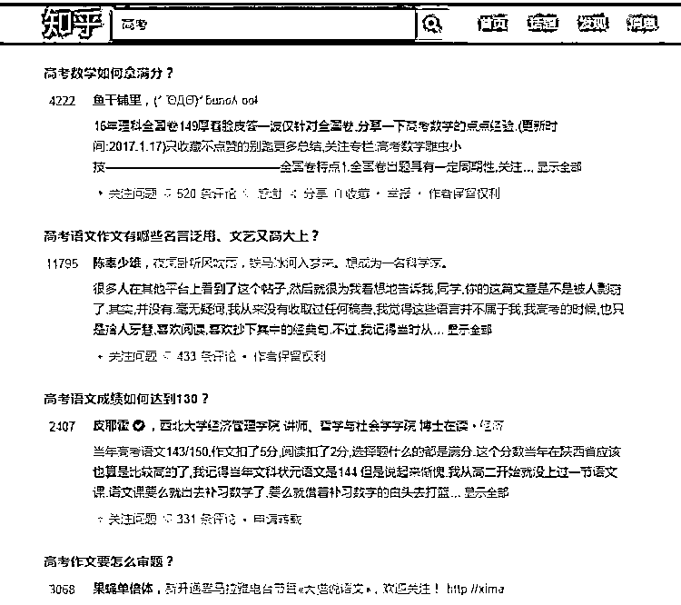

评论区：

悠长假期的鹿 : 想起Fenng之前就开了个盘口，公开接受下注。然后... niege : 然后怎么了😂

悠长假期的鹿 : 赔了

niege : 要是之前知道我也去下一把注😂

亦仁 : 明显的信息弱势方啊... 会亏的很惨

niege : 百度了下信息弱势😂是有问题，学习了

^_^秀燕 : 感想快行动  厉害  来个1.21

# **# ****(**精华帖**)(16**赞**)**各类**app**如何蹭高考热点

作者： niege

日期：2017-06-05

看到张五哥提到了高考报志愿的工具，这几天还真看到了有。

前几天因为自己小密圈的一个伙伴提到了「猿题库」，才发现有一类像驾校宝典的app，只是这个是服务于中学生高学生的，看下载量和使用量，流量非常大，功能也非常全，完全打破了我以前对中学不容许学生用手机的认识，感觉自己快out了😂

图片1是「猿题库」的，有主要功能有练习册和猿辅导，都是收费的，据小密圈的那个小伙伴说，猿题库出题给学生练习，然后从海量数据里将易错的总结起来出练习册卖给学生，各种类型练习册的交易量都是几万几万。猿辅导则是老师在线视频讲解，简直暴击那些线下辅导班。

图片2就是张五哥提到的高考报志愿工具，猿题库这种蹭一下再合理不过，这种事，对于好不容易高考完了的说，只要有一点参考价值，学生和家长们都不会在乎这个钱，所以图里99这个价有几千的付费量也很正常。

类似的app还有不少，如图片3的「阿凡题」，还有学而思网校、芥末堆、作业帮、学霸君、新东方在线等等，不蹭一下高考热点都说不过去。

这个热点不敏感吧😜求加精

评论区：

Jimi : 这个热点对于这几个来说确实不应该错过

亦仁 : 加精华了，猿题库这个转化思路很赞，确实是个需求

niege : 多谢亦仁打赏加精😄

York : 进小密圈最大的收获之一是如何蹭流量的各种体位的学习和热点敏锐性练习  Steven : 猿题库是现在的猿辅导吧

# **# ****(**精华帖**)(44**赞**)**杭州的闷声发大财公司代表：

# 升学**E**网通

作者：  朱凯阳

日期：2017-03-27

杭州的闷声发大财公司代表：升学E网通

app和网站的功能包括：高考志愿填报，网课，心理FM，中学生社区，四个板块。

月流水一个亿左右，请看截图，玩流量的朋友可能第一反应是卧槽这卖得动？

没错，放线上肯定卖不动。

套路：公司几百个销售，发展全国上下学校和教育局为代理，最后给学生价格360（“看多划算，软件内需要600+呢”之前是200，估计发现太好骗了），原来是一家卖高考志愿

填报系统的公司，近年拓展其他线上教育板块，似乎对学校领导的销售更容易做了，营业额暴涨

评论区：

朱凯阳 : 知识付费，其实最主要还是解决通道问题。以前是线下人际关系天然的信任感，现在是对kol的信任

亦仁 : 这个厉害了，

七对 : 收到，谢谢师弟……😜😜😜

coder : 赫死个人

朱凯阳 : 是真的，他们家的程序员小伙伴口述

大高 : 这个发展，就应该有大学问啊。全校每个班推广？和学校教育局分成？

# 【资源对接】**2**篇

# **# ****(105**赞**)**抖音高校报考咨询群：赚钱新玩法

作者：  马虎驴

日期：2023-06-05

风向标  资源对接

抖音高校报考咨询群

【抖音每天会不定时把随机某些学校的群都清理了，有兴趣的可以捡一下漏:抖音群排名是按照时间来的，越早越靠前】

今年抖音对接了百度高考志愿填报的数据，另外也开始弄了高校志愿填报的群【今年不仅抖音，贴吧也在做新生群[尴尬][尴尬][尴尬]个人更看好抖音】

状况:抖音流量必然是最高的，之前新生群是高考后才可能上人，抖音群现在已经录取开始上人，而且有不少的家长。

玩法:抖音群100人上限，但是推荐位是按照时间来的，只要不满就会一直霸占推荐位，不用优化等。找一批兼职或者写个脚本，功能如下

①群内每加一个人就艾特他让他加QQ或者微信，引流到私域(如果是兼职的话，每半个小时艾特一下)

②群内成员超过90就自动把多余的踢出群聊，保证群一直在推荐位(如果是兼职的话，每半个小时手动清理成员)

变现:①抖音群内超级多家长，可以做志愿填报

②卖被子等日用品

③对接营业厅，办理校园卡

④对接学校周边驾校

⑤用来做校园自媒体账号

......

由于内测阶段我们提前得知，团队连夜抢注册了600多抖音群推荐位。其中211 985几乎都在我们这边，另外，抖音官方每天可能会把某些学校的抖音群全部扫了，需要重新注册【这个量不大，大概只有百分之一的量】

欢迎老板对接[得意]内附几个账号随机几个学校的推荐位群

评论区：

如获至宝 : 麻烦留一个方式呢，我这需要招生

马虎驴 : l13598078622

马虎驴 : 大致玩法我们也都有方法了:推荐位是根据时间来的，只要群不满，他就一直在推荐位。

我们每个兼职会负责几个学校，每半个小时需要把全体成员艾特一下，让他们加我们的QQ或者微信。另外把人全部都踢了，剩余二三十个。

这样子的话会保证推荐位一直是我们的。实现推荐位最利用

亦仁 : 中标，术值+1。

在上方专栏点击 #中标，可查看所有中标风向标。

雪樵 : [玫瑰]

雪樵 : 我这边在做高考志愿填报，求合作[抱拳]

马虎驴 : [大哭][大哭][大哭]第一次中标[大哭]

马虎驴 : l13598078622

# **# ****(0**赞**)**提供高考志愿填报资料和填报指导服务

# 的推广

作者：  王多维

日期：2023-06-05

问题求助

马上要进入高考志愿冲刺期了

需要对接有高考志愿填报资料和填报指导服务的团队

我这有博主可以做推广

评论区：

良也 : v LDSKLY

天籁 : 个人v 1479707702