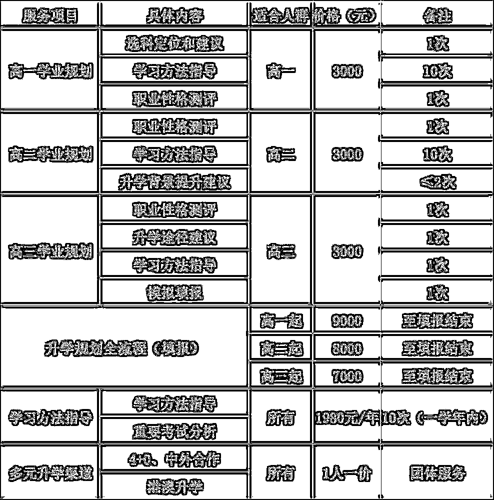
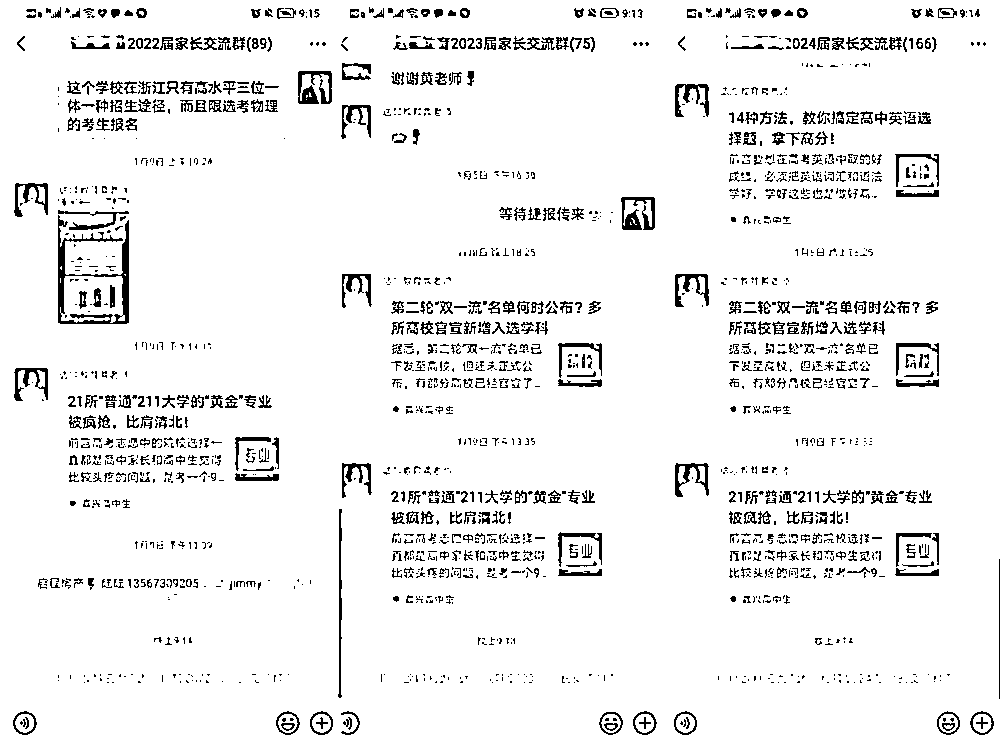

# (精华帖)(143 赞)人均 GMV 50W 的三线城市高考咨询项目实战分享

目录：

**1. **确定赛道（定方向）

**2. **如何找到有需求的用户？

**3. **如何搭建一个团队，快速复制？

作者：  鹏哥

日期：2022-02-22

大家好，我是鹏哥，在一个三线城市从事新高考教育咨询工作 8 年。从 14 年入行做高考咨询业务，我们服务学生 3000+，年营业额 500 万以上，人均绩效超 50 万。

虽然双减政策打击了不少教育机构，但高考的市场，依旧有着较高的社会和家庭关注度，单一市场也有较大的规模。另外，这个赛道因为专业度高，高考很快就要出结果，从业压力大，竞争相对要小的多，并且随着经济和生活水平的提高和家长受教育程度的提升，愿意付费咨询的家庭越来越多，这个行业的春天刚刚开始。

因此，本篇内容我想给大家分享一下我是如何做这个项目的，内容从高考咨询的行业定位展开，到产品体系的建立，以及我们如何系统性拓展这项业务，最后是企业文化为团队的赋能。

**—01—**

确定赛道（定方向）

一、双减后的机会点

2021 年教育部的双减政策（针对义务教育阶段的学生：减轻校内作业负担，减轻校外培训负担），致使行业大洗牌，上到新东方、学而思退出义务教育段培训市场，下到中小教育机构 90% 关门或是转行。

其实在双减之前，低年龄段的兴趣班，义务教育段的学科辅导竞争，为了追求利润，行业的发展已经背离了以孩子为重心的教育初衷。成人段需求多元，三线地级市规模化培训难以组织，利润分散。而高中段结果导向明显，高考的唯一性，社会和家庭关注度高，单一市场也有较大的规模。

另外，这个赛道因为专业度高，高考很快就要出结果，从业压力大，竞争相对要小得多，很多公司和个人不愿意承担这个高风险。做正确而难的事情，符合我们深耕细作的思路。

2022 年 1 月 1 日《家庭教育促进法》开始实施，国家从立法层面明确家庭教育的重要性，孩子是家庭的未来，教育承载着未来。高考升学规划能够有效把孩子、家长和学校的意愿结合起来综合考虑。希望我们的存在能够减少每年复读生的人数，减少 9 月大学开学后，因为专业和院校不合适而退学和休学的人数，多一些家庭和睦，多一些社会和谐。有了政策的加持和几年的工作积累也让我们更坚定地做下去。

二、我们的产品体系

三线城市的家长希望在一个平台解决升学规划、语言培训、学科辅导甚至是心理辅导的问题。犹如加入生财有术的圈友不仅可以做淘宝蓝海也可以参加抖音大航海，需求是变化的、多层次的。这样的市场需求决定了我们的交付会很重，但口碑的传递也会更好。

我们的高考咨询涵盖高中学业规划、高考选科指导、背景提升、综合评价等多元渠道的选择、最后才是高考志愿填报。

我们一个全职员工服务 50 个 VIP 学生（高一至高三各年级段）是没有问题的，我们老师服务的学生贯穿高一、高二和高三，比例大概是 40%：20%：40%。

新高考高一的家长较为迷茫，意识强的家长付费咨询的意愿强烈，而且很多是扎堆一起来；高三因为临近高考较为焦虑，家长付费咨询较为果断，占比同样较高；高二的占比一直较低，有想法的已经来了，意识不强的这阶段做决定也比较难，特别是付费转钱的时候。

我们全流程规划的咨询费中位价是 8000 元（类似生财有术的入会费），通过每月的线上和线下沟通再挖掘出家长的多元需求。比如想以宁波大学的分数进入浙大，可以参加浙江省内三位一体的录取渠道，对应的同一个学生就拓展出一个新的收费项目，另外有的同学要走中外合作院校、强基计划或是港澳院校，每个渠道收费 4500-30000 元，收费可以叠加。

当高考分数出来，孩子填报的时候能够比其他人多** 2-3 **项选择，所有的付出都是值得的。这样下来年人均绩效做到** 50 **万** GMV **也就到了。

**—02—**

如何找到有需求的用户

我们这个行业对场地和硬件要求不高，属于知识密集型。一个升学规划师的专业能力，也就是解决家长问题的能力至关重要。家长和学生尊称我们为老师，所以打电话、发传单这样的方式不合适，我们不能做得太 Low。基于这个原因，我没有设专职销售岗位，一个优秀的规划师在沟通过程中，销售是可以潜移默化地嵌入服务之中。几年下来我们的转介绍比例可以达到 80% 以上，口碑的传递帮我们拓展出更精准的客户群体。

一、定制化的服务

新高考实行高一下开始学考；高二选科；高三小高考和高考环环相扣。三位一体、强基计划、综合评价、中外合作院校等升学渠道为学生个性化升学规划创造了机会。

升学规划是我们的入门产品，服务好一个学生后期会激发出更多需求。

高考分已经不是唯一的衡量标准，多元的升学渠道也是新高考的特点。英语好的可以选择中外合作大学或是 4+0（不出国的留学）；数理化好的可以走强基计划（36 所 A 类  985 院校本硕博连读）和综合评价；有国防梦想的可以报军校或是警校；家庭条件好的可以选择港澳院校或是留学。

一个孩子会有一项或是多项需求。高考出分以后，当摆在面前有好几种选择，家长和学生可以优中选优，那就是我们工作的价值所在。

提前做好准备，降低 20-50 分录取，每年身边都有很多成功的案例。

我们当地一中的徐同学，通过我们团队的升学规划服务，从职业性格测评开始，找到兴趣点和优势点相匹配的专业方向，帮助学生找到了自己的学习节奏，确立了目标，调整了自己的学习状态，从原来的迷茫到自己「要」学，从 500 多名进步到第一次选考后的  90 多名，最终去了心仪的学校 —— 西南交通大学（211 院校）。

二、微信群裂变

几年做下来，运营上最大的感触就是要直接和家长建立联系，才能有效沟通。以前我们也踩过很多坑，比如发 DM 宣传页、电台做广告、通过校领导或是班主任进校做宣传等等，效果都一般。2018 年以后我们的运营转到以微信群为主。

以我们桐乡校区 1 个月的启动期为例：

第一步：通过身边的家长和朋友先拉一个 50 人的小群，只要是高中家长即可，不分年级。然后每周二、周四做两场群直播分享，从升学规划、高考选考、三位一体、综合评价等项目中按次序系统化讲解，每次讲完留钩子，吸引更多的家长入群。四个星期下来微信群基本能达到 200-300 人。

第二步：一个月后把群解散，解散前三天让家长加入高一、高二、高三的大群，告诉他们年级大群里会定期分享更精准的内容。这样我们运营的群就分为一个月的引流群和长期的年级大群。

第三步：每个年级段的需求不同，我们根据成交的机会点拉临时性的小群，筛选精准用户，专题群收单以后立马解散，只保留年级大群。比如：针对高一下的学考选考做专题群转化；针对高三的三位一体做专题群转化；针对全年级的升学规划做专题群转化。择时择机循环操作。

三、线下讲座促单成交

因为我们的客单价较高，而且是咨询类虚拟产品，线上直接成交的占比不大，大部分家长还是需要转到线下来成交转化。

线下讲座的运营思路大同小异，我坚持的一个原则是，没有** 30% **的面访率不开线下招生讲座。比如一次讲座的规模设定为 30 组家长，我会提前做到 10 组左右的家长在讲座前一周上门面访，建立了信任度，这样才能控制会场的节奏和成交。我最好的一次线下讲座是 2019 年 5 月 19 日，来了 32 组家长，成交接近 53 万。

四、提升转介绍率，形成业务闭环

感兴趣和有优势的专业是文科大类方向还是理工科方向？

左脑还是右脑思维，偏理性思维还是跳跃性思维？

目前的学习节奏是好的状态还是不努力的状态？

我们一直在探索把转介绍做成系统化，根据学生升学渠道的方向，我们会赠送相关行业或是报考要求的书籍，引导家长参加相关的讲座，不断提升认知。对已经做转介绍的家长给予一定的费用优惠，把他转介绍的家长一起约过来茶话会或是聚餐。根据孩子规划的目标院校送大学校徽，定制的大学 Logo 书签，不断提升个性化服务的体验感。通过以上的方法，冗余资源得到更好的运用，增加了家长和我们之间的粘性。很多家长慢慢和我们成为了朋友，有毕业三年的家长还在不断给我们做转介绍。

我判断一个家长对我们的认可度只看一个指标，就是有没有给我们做转介绍。当然能让家长主动转介绍也充分体现我们的专业能力。

升学规划的第一步是做测评，很多家长是凭感觉或是身边老师同学和亲朋好友的意见在选大学和定专业，但结果往往和他们想额不一样。所以我们要通过测评了解到学生：

有了数据做参考，才能帮助父母和学生本人结合平时的实际情况做判断和对比，能够帮助孩子找到感兴趣和有优势的学科方向，这是解决教育中多么大的一个痛点。

当然面访解读中还可以了解到学生家长的受教育程度和经济能力，为后面的多元规划打基础。专业的解读可以走进家长和学生的内心，建立深度互信。

在转介绍这个模块我的心法很简单，就是比同行多做** 1-2 **步，比市场上的同类产品多往前一步就有机会赶超，多走两步就可以领先。

比如：家长来咨询选科，我不仅告诉他如何选科，还会告诉他这样的选科以后在长三角地区就业的优势点。

你想选科是家长的目标么？不是。

选科是为了上个好大学，上个好大学是为了更好的就业。那我就告诉你怎样的选科更适合特定区域内的就业。

再比如，有家长带孩子来咨询怎么学好英语，我不仅会告诉他怎么提升听力，做好阅读理解和作文，还会告诉他语数英三门主科中，英语相对是好提分的。学好英语或许就是孩子分数快速提升的引爆点，英语提上来了，总分会高，排名也就上来了，孩子的状态和节奏也会良性循环，你说要不要把英语学好？

五、生财有术大航海带来的渠道拓展

参加生财有术大航海之前，一直在思考怎么把线下的模式搬到线上，也没有具体的流程与步骤。

两个月的大航海让我对做抖音有了一套新的思维模型，通过一段时间的实操也总结了一套方法。虽然目前做得不好，但方向和认知到了，那就撸起袖子努力干。

另外，抖音视频我也同步发在视频号上，视频号的视频推送更加精准，大航海期间，抖音没有变现反而视频号引流了两单到线下变现了 15800 元。最近我把视频又同步到了头条号上，也有了 1000 多粉丝。

新媒体给我们带来更灵活和更接地气的获客渠道，接下来我们会尝试多注册几个账号做同城号引流。现在我们已经有 4 个人参与新媒体：我负责文案内容、一位同事负责拍、一位同事负责拍摄时候的场地和着装等辅助工作、一位负责后期的视频剪辑。

12 月中旬以来我们能坚持每天一更，争取到春节的时候利用好时间差每天做到两更。在这里，是不是应该感谢一下生财（哈哈哈）。

**—01—**

如何搭建一个团队，快速复制

一、合伙人的心态聘用员工

教育培训是一个知识密集型的行业，人员结构小而精，从业人员学历高，能力强。特别是我们这样的三线城市，优秀的人才少。员工的优秀程度制约着我们企业发展的速度和深度。我们所有的员工都是 80 或是 90 后，这个年龄段的人在最求金钱以外，自我价值的实现也是重点考虑的一个因素，如何激发员工的自驱力，考验着当下的老板们。

首先，我们设立有竞争性的薪酬和晋升制度，从普通规划师到资深规划师收入会提高  50%，从资深规划师到项目合伙人收入可以达到二十万，同时也具备了带徒弟的资格，有机会成立「封疆大吏」独挡一面。

普通规划师：普通规划师是我们的最基层员工，通过 3 个月的基础培训和实践，可以独立服务客户，一个升学规划的单子服务费是 800 元，参加会销业绩的分成。

资深规划师：资深规划师在普通规划师的基础上，一个升学规划的单子服务费是 1200 元，根据客户的积累量可以统合公司的资源开个人专场会销。

项目合伙人：享受资深规划师的薪资，另外可以带徒弟享受管理奖金，可以参股新开设的分公司，成为合伙人。要成为一个优秀的员工，在高考咨询这个行业打底两年，才能真正在这个行业立足。

其次，每周我们都有例会，常规性工作用文字稿汇报，重点放在非常规工作上。如案例分析，从工作中梳理出新的案例，共同探讨解决办法。梳理出解决问题的步骤和流程，然后以百问百答的形式汇总成基本方法论。把非常规的问题逐步变成常规的问题，不断优化解决问题的能力。通过这样的方式不断提升员工的专业能力。

最后，日常工作中不设立打卡制度，上班时间统一，下班时间根据工作需要自己安排，请假只要提前做好工作安排就可以；周末加班可以把小孩子带到公司来，小食堂也会准备好午餐，目的就是让员工能够更好地协调工作与生活；节假日给员工的父母送爱心礼物，对员工的关怀可以延伸到家人，老家在外地的会安排邮寄礼物。

二、师徒制组合开展工作

师徒制有深厚的信任基础，有了这个基础为了共同的目标，加班加点也愿意，相对的负面情绪就少了。师徒组合更容易在实践中发现问题并解决问题。我们和家长签订的是握手合同，既要坚持原则又要做有温度的高考咨询服务，对这个度的把握很重要，也就是「火候」的把控。师傅可以更好地言传身教，传递企业价值观。

我们姚老师入职两年，现在是我们桐乡校区的负责人，成为合伙人。入职前做纺织品销售工作，入职后工作积极主动，学习能力强，第一年是我自己在带他。一年下来就可以独立做高考志愿填报（行业技术含量最高的一个项目），2021 年开始带徒弟，也是有模有样。到下半年已经担任讲师开专场讲座，当地电视台也给他做了专访，年底顺利晋升合伙人。两年时间不仅从行业小白到家长认可的行业专家，收入也随之翻了两翻。

三、牵头成立升学规划路联盟整合资源

教育、医疗和养老是当下家庭的重心，尤其是教育承载着家庭的未来。

新高考改革是把人才培养从「分层选拔」改为「分类培养」。以前高分去好学校，低分去差学校，但当下通过「中本一体化」、「嵌入式培养」、「三位一体」和「强基计划」等招生和培养模式，充分考虑人才的个性化培养，2021 年多所职业技术学院升级为职业技术大学，让我们看清了国家引导的教育发展方向。大部分家长和学生是不清楚这样的变化，对未来读大学和就业的影响，所以高考咨询行业会在双减之后迎来更好的机遇。

我牵头成立「浙江升学规划联盟」，不同地级市的同业资源共享。其出发点就是想大家一起把这个蛋糕做大，在帮助更多学生的同时，也能让我们从业者成就一项事业。

从 2019 年联盟成立起，每季度选定一个地级市召开经营分析会，群策群力解决人员招聘、产品研发、市场推广、法律风险规避等问题。这个虚拟的联盟已经成为我们共同的百宝箱，有什么问题，有什么困难，大家都会伸出援手。通过抖音大航海有幸结识了几位外省的同行，之后不仅可以在专业技能的深度，也可以在行业发展的广度上做拓展。

** **

教育是一个家庭的未来，做为从业者我们要坚持以学生为核心，帮助他们在高考这个人生的关键点做到未雨绸缪，把握更好的未来。

附名词解释：

**1. **中本一体化：3 年中专 + 4 年本科联合培养（不用读高中，采用单招定向的模式选拔）。

**2. **嵌入式培养：计算机软件行业常见的培养方式（校企联合培养），高起点就业。

**3. **三位一体：高考占比 60%、高校综合测试占比 30%（笔试、面试的形式）、10% 学考（毕业会考），三项加权综合录取。打破老高考的唯分数选拔，表达能力强可以带来实实在在的降分。

**4. **强基计划：2020 年起 36 所 A 类 985 院校，针对基础学科和尖端行业（卡脖子产品）新增的录取渠道。采用 3+1+X（本科 3 年 + 1 年研究生预备课程 + 硕博）本硕博贯通的培养方式。高考分占比 85%、学校综合测试分占比 15%，最低过高考所在省份分一本线即可以录取清北复交等名校。

评论区：

喀什都市网金宝贝 : 这个项目可以加盟吗

鹏哥 : 暂时没有这个计划，因为生财大航海我们接了一个大项目，今年会聚焦抖音和视频号。做为生财圈友，如果你们有基础我可以倾囊相授

咖咖 : 期待官方加精华👍很多家长就是差一个专业的人来辅助规划，就像好的地产中介服务富人一样。

鹏哥 : 是的，教育承载着家庭的未来。2014 年新高考改革以后，教育部综合评论招生的方式越来越多样化。

钱钰 : 哈哈  你的业务还没够做么

北鱼 : 做这个需要当地学校资源吗？比如校长教师教育局人脉资源等

张兴 : 感谢鹏哥分享，有心法，有操作，提供给我们非常有价值的借鉴，希望有机会和鹏哥深入学习和合作!

巍而特秀 : 这项目是又门槛的。在我们这边一个教育出名的县城，这个行业很火爆。但是在市区却没有那么火。如果像我们这样的小白想要跟着你学习的话，有什么途径和办法呢？
